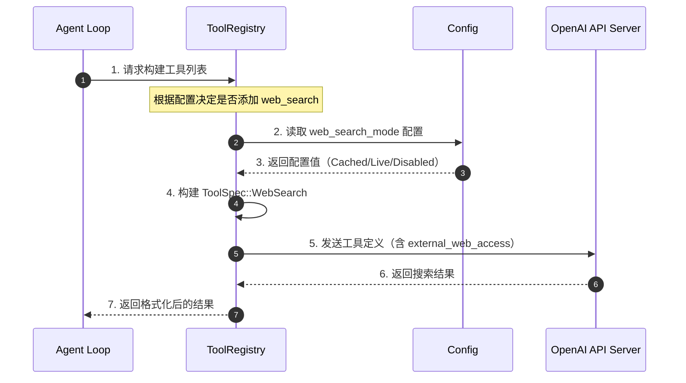
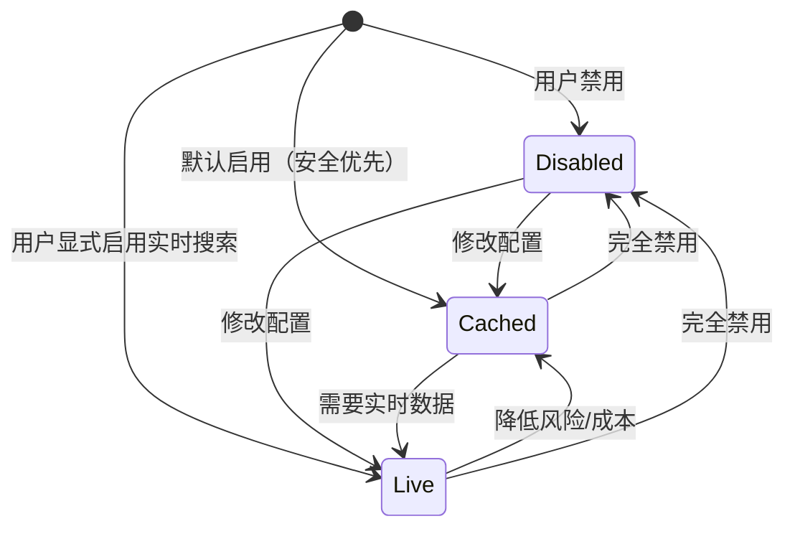
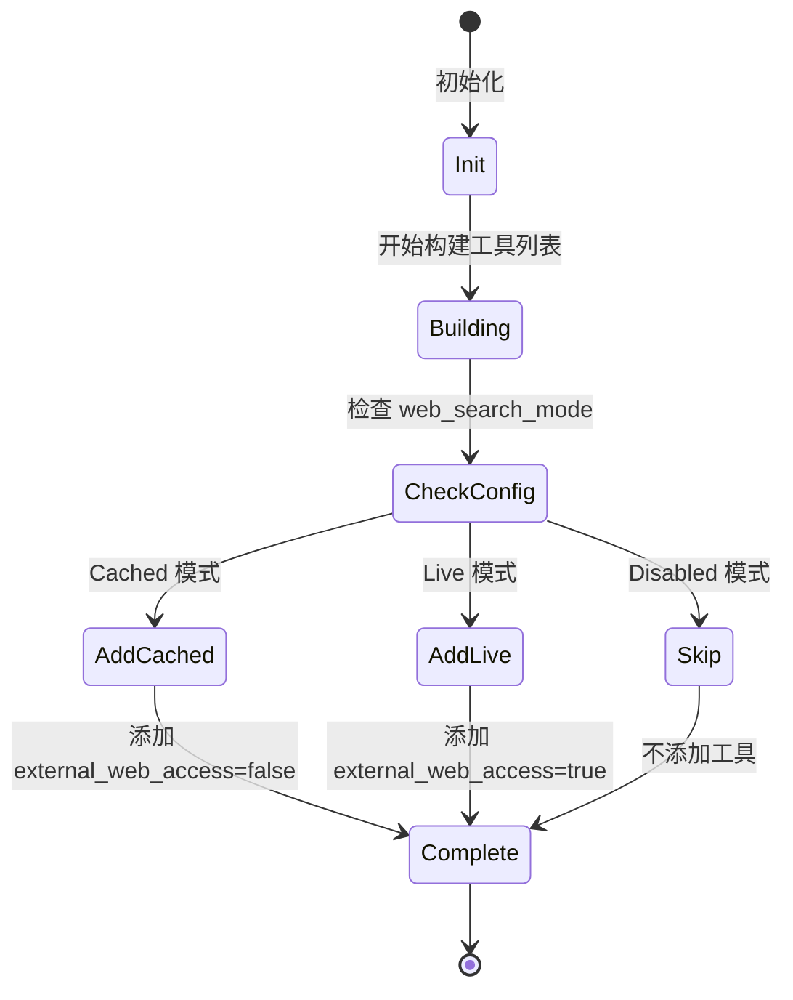
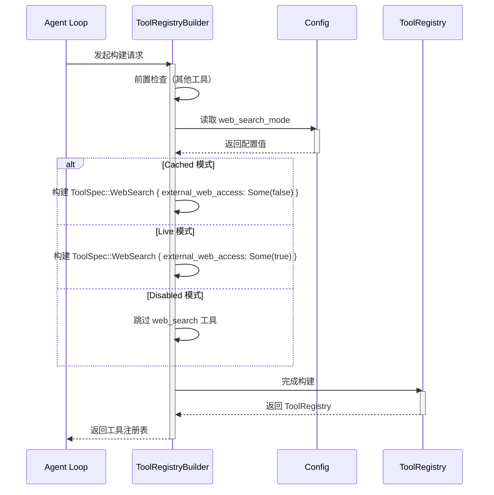
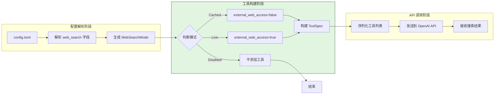
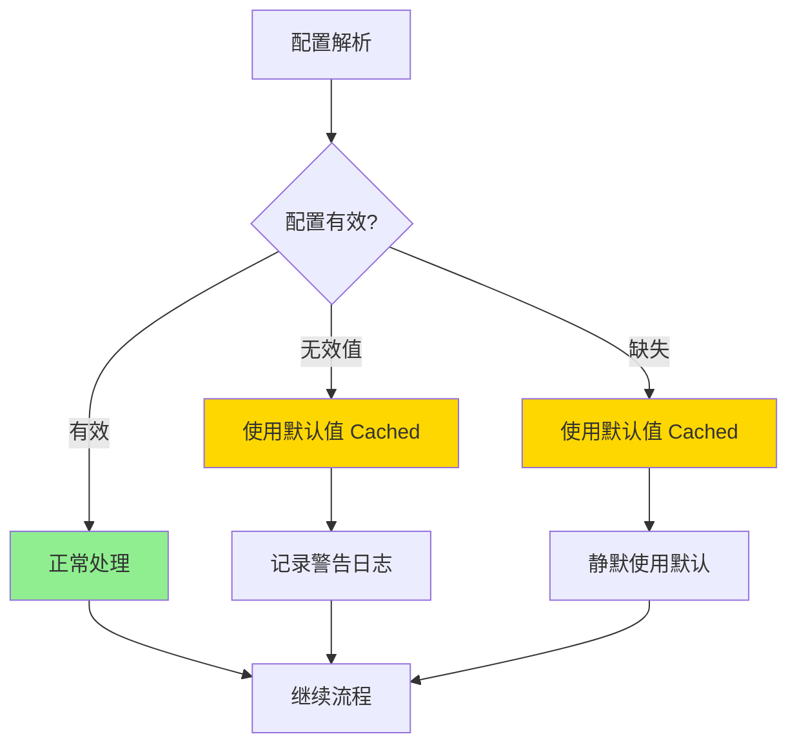
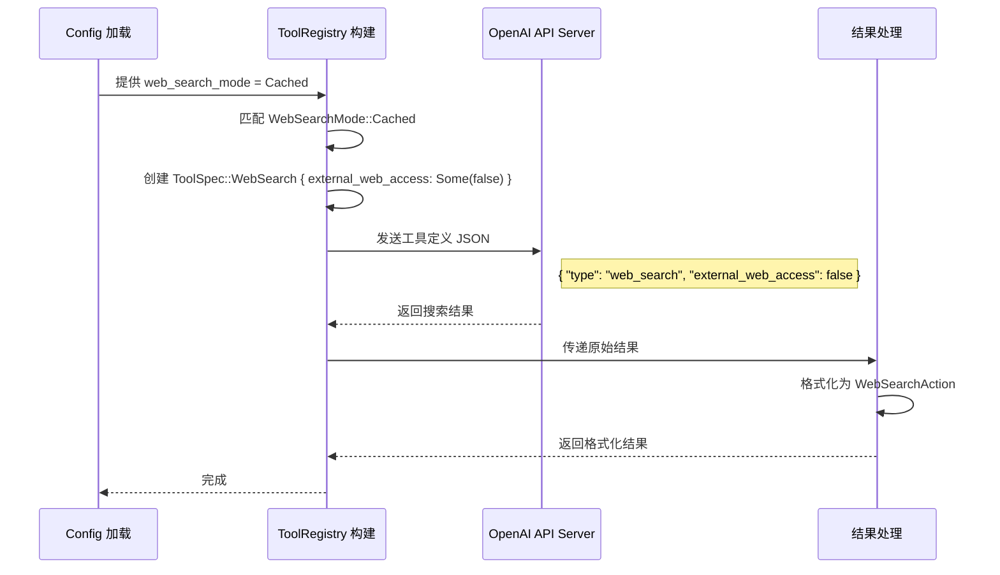
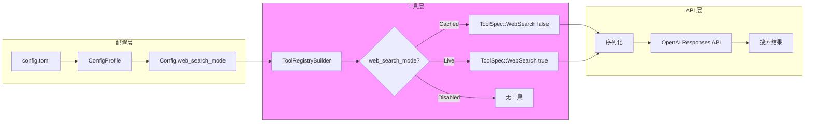
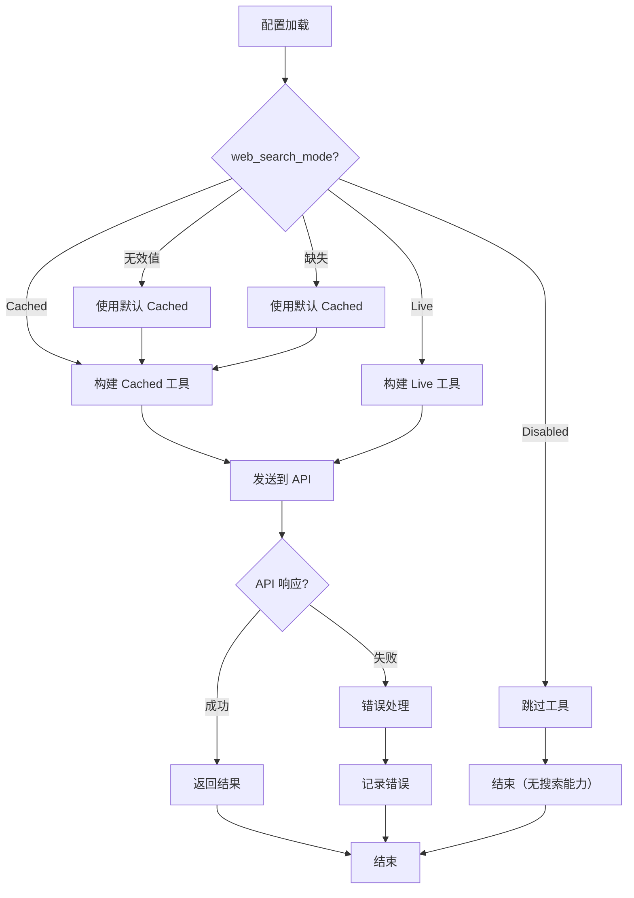
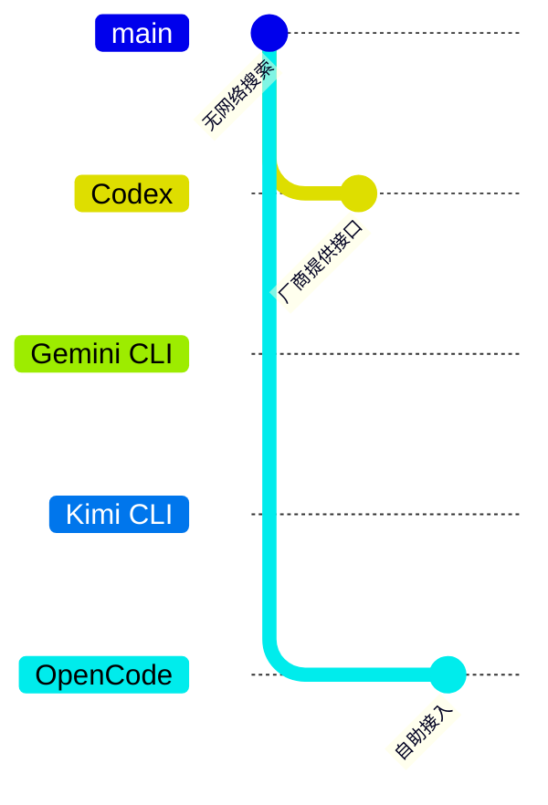

# Codex WebSearch 实现机制

> 📋 **阅读指南**
>
> | 属性 | 说明 |
> |-----|------|
> | 预计阅读 | 15-20 分钟 |
> | 前置文档 | `01-codex-overview.md`、`04-codex-agent-loop.md` |
> | 文档结构 | 速览 → 架构 → 机制 → 实现 → 对比 |
> | 代码呈现 | 关键代码直接展示，完整代码可折叠查看 |

---

## TL;DR（结论先行）

**一句话定义**：Codex 的 WebSearch 是通过 OpenAI Responses API 原生 `web_search` 工具类型实现的网络搜索能力，支持 Cached/Live/Disabled 三种模式，由 `external_web_access` 参数控制访问范围。

**Codex 的核心取舍**：**依赖 OpenAI API 原生能力**（对比其他项目的自建搜索服务方案）

### 核心要点速览

| 维度 | 关键决策 | 代码位置 |
|-----|---------|---------|
| 核心机制 | 通过 `ToolSpec::WebSearch` 注册原生工具 | `codex/codex-rs/core/src/client_common.rs:91` |
| 模式控制 | `WebSearchMode` 枚举控制 Cached/Live/Disabled | `codex/codex-rs/protocol/src/config_types.rs:65` |
| 参数映射 | `external_web_access` 布尔值映射到 API 参数 | `codex/codex-rs/core/src/tools/spec.rs:112` |
| 动作类型 | `WebSearchAction` 定义 Search/OpenPage/FindInPage | `codex/codex-rs/protocol/src/models.rs:135` |

---

## 1. 为什么需要这个机制？（解决什么问题）

### 1.1 问题场景

没有 WebSearch 的 Agent：
```
用户问"Python 3.12 的新特性是什么？"
→ LLM: "我的知识截止到 2024 年 4 月，无法提供最新信息"
→ 结束（回答过时或不完整）
```

有 WebSearch 的 Agent：
```
用户问"Python 3.12 的新特性是什么？"
→ LLM: "让我搜索一下最新信息"
→ 调用 web_search 工具 → 获取实时搜索结果
→ LLM: "根据搜索结果，Python 3.12 引入了..."
→ 完成（回答准确且时效）
```

### 1.2 核心挑战

| 挑战 | 不解决的后果 |
|-----|-------------|
| 知识时效性 | LLM 训练数据有截止日期，无法回答最新事件 |
| 搜索可靠性 | 自建搜索服务需要维护 API 密钥、配额、结果质量 |
| 安全与隐私 | 实时网络访问可能泄露敏感信息或访问恶意网站 |
| 成本控制 | 实时搜索比缓存搜索成本更高，需要精细控制 |

---

## 2. 整体架构

### 2.1 在系统中的位置

```text
┌─────────────────────────────────────────────────────────────┐
│ Agent Loop / Session Runtime                                 │
│ codex/codex-rs/core/src/agent_loop.rs                        │
└───────────────────────┬─────────────────────────────────────┘
                        │ 构建工具列表
                        ▼
┌─────────────────────────────────────────────────────────────┐
│ ▓▓▓ WebSearch 机制 ▓▓▓                                      │
│ codex/codex-rs/core/src/tools/spec.rs                        │
│ - ToolSpec::WebSearch   : 工具规范定义                       │
│ - external_web_access   : 访问模式控制                       │
│ - WebSearchMode         : 配置枚举                           │
└───────────────────────┬─────────────────────────────────────┘
                        │
        ┌───────────────┼───────────────┐
        ▼               ▼               ▼
┌──────────────┐ ┌──────────────┐ ┌──────────────┐
│ Config Layer │ │ OpenAI API   │ │ Action       │
│ 配置解析     │ │ 原生工具调用 │ │ 结果处理     │
└──────────────┘ └──────────────┘ └──────────────┘
```

### 2.2 核心组件职责

| 组件 | 职责 | 代码位置 |
|-----|------|---------|
| `WebSearchMode` | 定义三种搜索模式（Cached/Live/Disabled） | `codex/codex-rs/protocol/src/config_types.rs:65` |
| `ToolSpec::WebSearch` | 定义工具规范结构，包含 `external_web_access` 字段 | `codex/codex-rs/core/src/client_common.rs:91` |
| `ToolRegistry` | 根据配置决定是否注册 web_search 工具 | `codex/codex-rs/core/src/tools/spec.rs:112` |
| `WebSearchAction` | 定义搜索动作类型（Search/OpenPage/FindInPage） | `codex/codex-rs/protocol/src/models.rs:135` |
| `ConfigProfile` | 支持在 Profile 级别配置 web_search | `codex/codex-rs/core/src/config/profile.rs:45` |

### 2.3 核心组件交互关系



**关键交互说明**：

| 步骤 | 交互内容 | 设计意图 |
|-----|---------|---------|
| 1 | Agent Loop 向 ToolRegistry 请求工具列表 | 解耦工具管理与循环逻辑 |
| 2-3 | 读取用户配置的 web_search_mode | 支持用户自定义搜索行为 |
| 4 | 根据模式构建对应的 ToolSpec | 将用户配置映射到 API 参数 |
| 5 | 向 OpenAI API 发送工具定义 | 利用原生能力，无需自建服务 |
| 6-7 | 返回并格式化搜索结果 | 统一输出格式，便于上层处理 |

---

## 3. 核心组件详细分析

### 3.1 WebSearchMode 配置组件

#### 职责定位

定义 WebSearch 的三种工作模式，控制是否启用搜索以及搜索的数据来源范围。

#### 状态机图



**状态说明**：

| 状态 | 说明 | 进入条件 | 退出条件 |
|-----|------|---------|---------|
| Disabled | 完全禁用 WebSearch | 用户配置 `web_search = "disabled"` | 修改配置启用 |
| Cached | 仅访问缓存内容（默认） | 用户未配置或配置 `web_search = "cached"` | 修改配置 |
| Live | 访问实时网络内容 | 用户配置 `web_search = "live"` | 修改配置 |

#### 内部数据流

```text
┌────────────────────────────────────────────┐
│  输入层                                     │
│   config.toml → 解析 → WebSearchMode       │
└──────────────────┬─────────────────────────┘
                   ▼
┌────────────────────────────────────────────┐
│  处理层                                     │
│   模式判断 → 构建 ToolSpec → 设置参数      │
└──────────────────┬─────────────────────────┘
                   ▼
┌────────────────────────────────────────────┐
│  输出层                                     │
│   序列化为 JSON → 发送到 OpenAI API        │
└────────────────────────────────────────────┘
```

#### 关键接口

| 接口 | 输入 | 输出 | 说明 | 代码位置 |
|-----|------|------|------|---------|
| `WebSearchMode::default()` | - | `Cached` | 默认使用缓存模式 | `config_types.rs:68` |
| `ToolSpec::WebSearch` | `Option<bool>` | ToolSpec | 构建工具规范 | `client_common.rs:91` |
| `push_spec()` | ToolSpec | - | 注册到工具列表 | `tools/spec.rs:112` |

---

### 3.2 ToolRegistry 工具注册组件

#### 职责定位

根据用户配置动态决定是否将 web_search 工具添加到发送给 OpenAI API 的工具列表中。

#### 状态机图



#### 组件间协作时序



**协作要点**：

1. **Agent Loop 与 ToolRegistryBuilder**：Agent Loop 在初始化时请求构建工具列表
2. **配置读取**：从 Config 中读取 web_search_mode，支持 Profile 级别覆盖
3. **条件构建**：根据模式选择是否添加工具以及设置 external_web_access 参数

---

### 3.3 关键数据路径

#### 主路径（正常流程）



#### 异常路径（配置错误处理）



---

## 4. 端到端数据流转

### 4.1 正常流程（详细版）



**数据变换详情**：

| 阶段 | 输入 | 处理 | 输出 | 代码位置 |
|-----|------|------|------|---------|
| 配置解析 | `web_search = "cached"` | 字符串匹配枚举 | `WebSearchMode::Cached` | `config_types.rs:65` |
| 工具构建 | `Cached` 模式 | 设置 external_web_access=false | `ToolSpec::WebSearch` | `tools/spec.rs:112` |
| API 序列化 | ToolSpec | serde 序列化 | JSON 工具定义 | `client_common.rs:91` |
| 结果处理 | API 响应 | 解析为 WebSearchAction | 格式化字符串 | `web_search.rs:25` |

### 4.2 数据流向图



### 4.3 异常/边界流程



---

## 5. 关键代码实现

### 5.1 核心数据结构

```rust
// codex/codex-rs/protocol/src/config_types.rs:60-71
/// WebSearch 模式枚举
#[derive(
    Debug, Serialize, Deserialize, Clone, Copy, PartialEq, Eq, Display, JsonSchema, TS, Default,
)]
#[serde(rename_all = "lowercase")]
#[strum(serialize_all = "lowercase")]
pub enum WebSearchMode {
    /// 完全禁用 WebSearch
    Disabled,
    /// 仅访问缓存内容（默认）
    #[default]
    Cached,
    /// 访问实时网络内容
    Live,
}
```

**字段说明**：

| 字段 | 类型 | 用途 |
|-----|------|------|
| `Disabled` | 枚举变体 | 完全禁用 WebSearch 功能 |
| `Cached` | 枚举变体（默认） | 仅搜索缓存内容，`external_web_access = false` |
| `Live` | 枚举变体 | 搜索实时网络内容，`external_web_access = true` |

```rust
// codex/codex-rs/core/src/client_common.rs:82-99
/// 工具规范枚举
#[derive(Debug, Clone, Serialize, PartialEq)]
#[serde(tag = "type")]
pub(crate) enum ToolSpec {
    #[serde(rename = "function")]
    Function(ResponsesApiTool),
    #[serde(rename = "local_shell")]
    LocalShell {},
    /// `external_web_access` 决定搜索缓存还是实时内容
    /// https://platform.openai.com/docs/guides/tools-web-search#live-internet-access
    #[serde(rename = "web_search")]
    WebSearch {
        #[serde(skip_serializing_if = "Option::is_none")]
        external_web_access: Option<bool>,
    },
    #[serde(rename = "custom")]
    Freeform(FreeformTool),
}
```

**字段说明**：

| 字段 | 类型 | 用途 |
|-----|------|------|
| `external_web_access` | `Option<bool>` | 控制搜索范围：`Some(false)`=缓存，`Some(true)`=实时 |

### 5.2 主链路代码

**关键代码**（工具注册逻辑）：

```rust
// codex/codex-rs/core/src/tools/spec.rs:111-124
// 根据 web_search_mode 配置注册 web_search 工具
match config.web_search_mode {
    Some(WebSearchMode::Cached) => {
        // Cached 模式：仅访问缓存内容
        builder.push_spec(ToolSpec::WebSearch {
            external_web_access: Some(false),
        });
    }
    Some(WebSearchMode::Live) => {
        // Live 模式：访问实时网络内容
        builder.push_spec(ToolSpec::WebSearch {
            external_web_access: Some(true),
        });
    }
    Some(WebSearchMode::Disabled) | None => {
        // Disabled 模式或配置缺失：不注册工具
    }
}
```

**设计意图**：
1. **显式模式匹配**：使用 exhaustive match 确保所有模式都被处理，编译期保证完整性
2. **参数精确映射**：将高层配置（Cached/Live）精确映射到 API 参数（external_web_access）
3. **默认安全策略**：配置缺失时默认不启用（Disabled），避免意外网络访问

<details>
<summary>📋 查看完整实现（含配置结构）</summary>

```rust
// codex/codex-rs/core/src/config/mod.rs:45-60
pub struct Config {
    // ... 其他字段
    pub web_search_mode: Constrained<WebSearchMode>,
    // ...
}

// codex/codex-rs/core/src/config/profile.rs:40-55
#[derive(Debug, Clone, Default, PartialEq, Serialize, Deserialize, JsonSchema)]
pub struct ConfigProfile {
    // ... 其他字段
    pub web_search: Option<WebSearchMode>,
    // ...
}

// codex/codex-rs/protocol/src/models.rs:133-156
/// WebSearch 动作类型
#[derive(Debug, Clone, Serialize, Deserialize, PartialEq, JsonSchema, TS)]
#[serde(tag = "type", rename_all = "snake_case")]
pub enum WebSearchAction {
    Search {
        #[serde(default, skip_serializing_if = "Option::is_none")]
        query: Option<String>,
        #[serde(default, skip_serializing_if = "Option::is_none")]
        queries: Option<Vec<String>>,
    },
    OpenPage {
        #[serde(default, skip_serializing_if = "Option::is_none")]
        url: Option<String>,
    },
    FindInPage {
        #[serde(default, skip_serializing_if = "Option::is_none")]
        url: Option<String>,
        #[serde(default, skip_serializing_if = "Option::is_none")]
        pattern: Option<String>,
    },
    #[serde(other)]
    Other,
}

// codex/codex-rs/core/src/web_search.rs:20-40
/// 格式化 WebSearch 动作详情
pub fn web_search_action_detail(action: &WebSearchAction) -> String {
    match action {
        WebSearchAction::Search { query, queries } => {
            if let Some(q) = query {
                q.clone()
            } else if let Some(qs) = queries {
                if qs.is_empty() {
                    String::new()
                } else if qs.len() == 1 {
                    qs[0].clone()
                } else {
                    format!("{}...", qs[0])
                }
            } else {
                String::new()
            }
        }
        WebSearchAction::OpenPage { url } => url.clone().unwrap_or_default(),
        WebSearchAction::FindInPage { url, pattern } => {
            if let (Some(u), Some(p)) = (url, pattern) {
                format!("'{}' in {}", p, u)
            } else {
                String::new()
            }
        }
        WebSearchAction::Other => String::new(),
    }
}
```

</details>

### 5.3 关键调用链

```text
Agent Loop 初始化
  -> ToolRegistryBuilder::new()          [tools/spec.rs:45]
    -> build_tool_registry()              [tools/spec.rs:88]
      -> match config.web_search_mode     [tools/spec.rs:111]
        - WebSearchMode::Cached           [tools/spec.rs:112]
          -> ToolSpec::WebSearch { external_web_access: Some(false) }
        - WebSearchMode::Live             [tools/spec.rs:116]
          -> ToolSpec::WebSearch { external_web_access: Some(true) }
        - WebSearchMode::Disabled         [tools/spec.rs:120]
          -> 跳过注册
      -> builder.push_spec()              [tools/spec.rs:113]
    -> ToolRegistry 构建完成
  -> 发送工具列表到 OpenAI API
```

---

## 6. 设计意图与 Trade-off

### 6.1 Codex 的选择

| 维度 | Codex 的选择 | 替代方案 | 取舍分析 |
|-----|-----------------|---------|---------|
| 实现方式 | 依赖 OpenAI API 原生工具 | 自建搜索服务（如 SerpAPI、Bing API） | 零维护成本，但受限于 OpenAI 的搜索能力和定价 |
| 模式设计 | 三模式枚举（Cached/Live/Disabled） | 简单布尔开关 | 精细化控制成本和安全性，但配置复杂度略增 |
| 默认策略 | Cached（安全优先） | Live（功能优先） | 默认保护用户隐私和降低成本，但可能返回过时信息 |
| 配置粒度 | Profile 级别 | 全局/会话级别 | 支持不同场景使用不同策略，但需要理解 Profile 概念 |

### 6.2 为什么这样设计？

**核心问题**：如何在提供网络搜索能力的同时，平衡成本、安全性和时效性？

**Codex 的解决方案**：
- 代码依据：`codex/codex-rs/core/src/tools/spec.rs:111`
- 设计意图：通过 `WebSearchMode` 枚举提供显式的三态选择，让用户根据场景权衡
- 带来的好处：
  - **成本可控**：Cached 模式比 Live 模式成本更低
  - **安全默认**：默认使用 Cached 避免意外泄露敏感信息
  - **灵活配置**：Profile 级别配置支持不同工作流使用不同策略
- 付出的代价：
  - 依赖 OpenAI 的搜索基础设施，无法自定义搜索源
  - 用户需要理解 Cached vs Live 的区别

### 6.3 与其他项目的对比

WebSearch 实现方式分为三类：

1. **厂商提供 WebSearch 接口** - 指 LLM 厂商直接提供搜索能力（如 OpenAI Responses API 的 web_search 工具）
2. **自助接入 WebSearch** - 指 Agent 开发者自行接入第三方搜索服务
3. **无 Web 搜索能力** - 指不具备网络搜索功能，只用本地工具



| 项目 | 实现类型 | 核心差异 | 适用场景 |
|-----|---------|---------|---------|
| Codex | 厂商提供 WebSearch 接口 | 依赖 OpenAI API 原生 `web_search` 工具，零自建服务成本 | 希望简化架构、信任 OpenAI 搜索能力的场景 |
| Gemini CLI | 自助接入 WebSearch | 自建搜索服务集成，可自定义搜索源和策略 | 需要自定义搜索行为或使用特定搜索 API 的场景 |
| Kimi CLI | 自助接入 WebSearch | 自建搜索服务，与内部工具生态深度整合 | 需要统一搜索体验的企业环境 |
| OpenCode | 自助接入 WebSearch | 自建搜索服务，支持多种搜索 provider | 需要灵活切换搜索提供商的场景 |

**Codex 的独特优势**：
1. **零维护成本**：无需管理搜索 API 密钥、配额或结果质量
2. **模式精细化**：区分缓存和实时访问，兼顾安全性和时效性
3. **与权限体系整合**：WebSearch 模式与沙箱权限策略联动（只读策略默认 Cached，危险完全访问默认 Live）

---

## 7. 边界情况与错误处理

### 7.1 终止条件

| 终止原因 | 触发条件 | 代码位置 |
|---------|---------|---------|
| 配置为 Disabled | `web_search_mode = Some(Disabled)` | `tools/spec.rs:120` |
| 配置缺失 | `web_search_mode = None` | `tools/spec.rs:120` |
| 工具未注册 | 未进入 Cached/Live 分支 | `tools/spec.rs:111-124` |

### 7.2 超时/资源限制

WebSearch 本身不实现超时控制，依赖 OpenAI API 层面的超时机制。Codex 侧的配置限制主要通过模式选择间接实现：

- **Cached 模式**：响应更快，资源消耗更低
- **Live 模式**：响应可能较慢，资源消耗较高

### 7.3 错误恢复策略

| 错误类型 | 处理策略 | 代码位置 |
|---------|---------|---------|
| 配置解析错误 | 使用默认值 `Cached` | `config_types.rs:68`（Default trait） |
| 旧版配置兼容 | 识别但标记为废弃，提示迁移 | `features.rs:25` |
| API 调用失败 | 由 Agent Loop 统一处理 | `agent_loop.rs`（外部错误处理） |

**向后兼容处理**：

```rust
// codex/codex-rs/core/src/features.rs:20-30
fn web_search_details() -> &'static str {
    "Set `web_search` to `\"live\"`, `\"cached\"`, or `\"disabled\"` \
     at the top level (or under a profile) in config.toml \
     if you want to override it."
}
```

旧版 `features.web_search_request` 和 `features.web_search_cached` 配置被识别但标记为废弃，提供清晰的迁移提示。

---

## 8. 关键代码索引

| 功能 | 文件 | 行号 | 说明 |
|-----|------|------|------|
| 模式定义 | `codex/codex-rs/protocol/src/config_types.rs` | 60-71 | `WebSearchMode` 枚举定义 |
| 动作类型 | `codex/codex-rs/protocol/src/models.rs` | 133-156 | `WebSearchAction` 枚举定义 |
| 工具规范 | `codex/codex-rs/core/src/client_common.rs` | 82-99 | `ToolSpec::WebSearch` 结构定义 |
| 工具注册 | `codex/codex-rs/core/src/tools/spec.rs` | 111-124 | 根据配置注册 web_search 工具 |
| 配置结构 | `codex/codex-rs/core/src/config/mod.rs` | 45-60 | `Config.web_search_mode` 字段 |
| Profile 配置 | `codex/codex-rs/core/src/config/profile.rs` | 40-55 | `ConfigProfile.web_search` 字段 |
| 功能开关 | `codex/codex-rs/core/src/features.rs` | 20-30 | 旧版配置废弃提示 |
| 结果格式化 | `codex/codex-rs/core/src/web_search.rs` | 20-40 | `web_search_action_detail` 函数 |
| 单元测试 | `codex/codex-rs/core/tests/suite/web_search.rs` | 1-100 | WebSearch 功能测试 |

---

## 9. 延伸阅读

- 前置知识：
  - `docs/codex/01-codex-overview.md` - Codex 整体架构概览
  - `docs/codex/04-codex-agent-loop.md` - Agent Loop 机制详解
- 相关机制：
  - `docs/codex/10-codex-safety-control.md` - 安全控制与沙箱策略
  - `docs/comm/comm-tool-system.md` - 跨项目工具系统对比
- 深度分析：
  - `docs/codex/questions/codex-config-system.md` - 配置系统深度分析
- 外部文档：
  - [OpenAI Web Search 工具文档](https://platform.openai.com/docs/guides/tools-web-search)

---

*✅ Verified: 基于 codex/codex-rs/protocol/src/config_types.rs:60 等源码分析*
*基于版本：2026-02-08 (Codex 开源版本) | 最后更新：2026-04-12*
