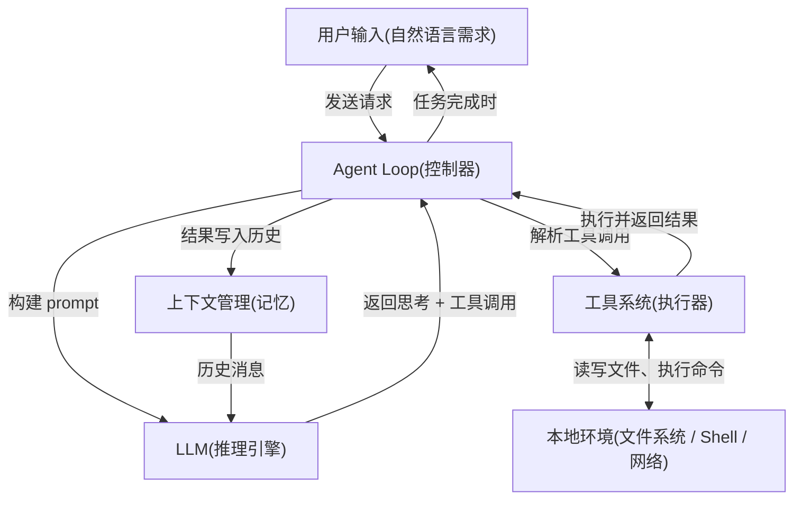
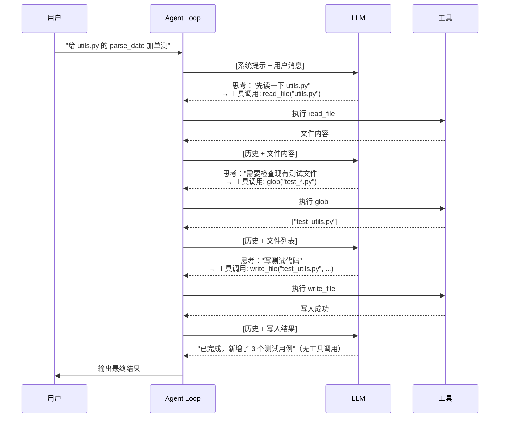
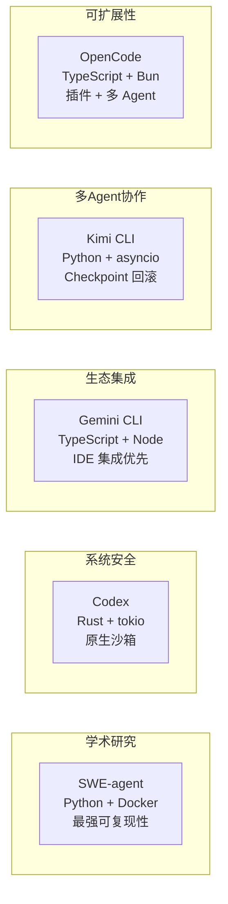

# Code Agent 全局认知

## TL;DR

Code Agent = LLM + 工具调用循环 + 本地环境。它不是"更聪明的代码补全"，而是一个能自主规划、执行、观察、修正的工程执行器。

---

## 1. 为什么要有 Code Agent？

**传统 LLM 的局限：**

一次调用只能"思考"，不能"行动"。你把代码问题发给 LLM，它给你一个答案 —— 但如果答案需要先读文件、跑测试、再根据结果修正，单次调用就做不到了。

**Code Agent 解决什么：**

```
你的问题 → [多轮循环] → 完成的任务
               ↑
         每轮：LLM 思考 → 调用工具 → 观察结果 → 继续
```

这个"多轮循环 + 工具调用"就是 Agent 的核心。

---

## 2. Code Agent 的整体架构



**五个核心组件，缺一不可：**

| 组件 | 职责 | 类比 |
|------|------|------|
| **LLM** | 推理：下一步该做什么 | 大脑 |
| **Agent Loop** | 协调循环，直到任务完成 | 操作系统调度器 |
| **工具系统** | 执行具体操作（读写文件、运行命令） | 手和工具 |
| **上下文管理** | 管理历史消息，不超出 token 限制 | 短期记忆 |
| **本地环境** | 实际的文件系统、Shell、网络 | 操作台 |

---

## 3. 一次完整的任务执行流程

以"帮我给这个函数加单元测试"为例：



**关键点：** LLM 从不直接操作文件。它只输出"我想做什么"，由工具系统实际执行。

---

## 4. 五个项目的定位

本仓库分析了 5 个主流 Code Agent 项目，它们解决同一个问题，但在工程取舍上各有侧重：



| 项目 | 语言 | 核心特点 | 适合研究的问题 |
|------|------|----------|----------------|
| **SWE-agent** | Python | Docker 隔离，配置驱动，学术标杆 | 工具系统设计、评估框架 |
| **Codex** | Rust | 原生 Seatbelt/Landlock 沙箱，actor 模型 | 安全架构、高性能并发 |
| **Gemini CLI** | TypeScript | 递归 continuation 驱动，Scheduler 状态机 | Loop 控制流设计 |
| **Kimi CLI** | Python | Checkpoint + revert 回滚机制 | 上下文状态管理 |
| **OpenCode** | TypeScript | 多 Agent 系统，Zod 类型安全工具 | 可扩展工具系统 |

---

## 5. 核心机制导航

理解 Code Agent，需要依次掌握以下模块（建议阅读顺序）：

```
01-comm-overview.md       ← 你在这里（整体认知）
        ↓
04-comm-agent-loop.md     ← 最核心：循环如何驱动
        ↓
05-comm-tools-system.md   ← 工具如何定义和执行
        ↓
07-comm-memory-context.md ← 上下文如何管理
        ↓
06-comm-mcp-integration.md ← 如何集成外部工具
        ↓
10-comm-safety-control.md  ← 如何防止危险操作
        ↓
03-comm-session-runtime.md ← Session 生命周期
```

---

## 6. 架构共性 vs 实现差异

### 所有项目共有的核心流程

无论语言和实现如何不同，每个项目都实现了以下循环（伪代码）：

```python
# 所有 Code Agent 的本质
while task_not_done:
    response = llm.call(context)          # 问 LLM 下一步
    if response.has_tool_calls:
        for call in response.tool_calls:
            result = tools.execute(call)  # 执行工具
            context.append(result)        # 结果写入历史
    else:
        break                             # 没有工具调用 = 任务完成
```

- SWE-agent 实现：`sweagent/agent/agents.py:390` (`run()` 方法)
- Kimi CLI 实现：`kimi-cli/packages/kosong/src/kosong/__main__.py:47` (`agent_loop()`)
- Gemini CLI 实现：`gemini-cli/packages/core/src/core/client.ts:789` (`sendMessageStream()`)
- OpenCode 实现：`opencode/packages/opencode/src/session/prompt.ts:294` (`while(true)` 循环)
- Codex 实现：`codex/codex-rs/core/src/agent/control.rs:55` (`spawn_agent()`)

### 各项目的关键差异维度

| 维度 | 差异点 | 影响 |
|------|--------|------|
| **Loop 驱动方式** | 迭代 vs 递归 vs actor 消息 | 并发安全性、调试难度 |
| **工具定义方式** | YAML vs Rust trait vs Zod Schema | 类型安全性、扩展成本 |
| **上下文策略** | 内存 vs SQLite vs Checkpoint | 持久化能力、回滚能力 |
| **安全模型** | Docker vs 系统沙箱 vs 确认机制 | 隔离强度 vs 性能损耗 |
| **工具扩展** | Bundle vs MCP vs 插件 | 第三方集成生态 |

---

## 7. 关键代码入口索引

| 项目 | 入口文件 | Agent Loop 核心 | 工具系统核心 |
|------|----------|-----------------|--------------|
| SWE-agent | `sweagent/run/run.py` | `sweagent/agent/agents.py:390` | `sweagent/tools/tools.py` |
| Codex | `codex-rs/cli/src/main.rs` | `codex-rs/core/src/agent/control.rs:55` | `codex-rs/core/src/tools/` |
| Gemini CLI | `packages/cli/src/index.ts` | `packages/core/src/core/client.ts:789` | `packages/core/src/tools/` |
| Kimi CLI | `src/kimi_cli/main.py` | `packages/kosong/src/kosong/__main__.py:47` | `packages/kosong/src/kosong/tooling/` |
| OpenCode | `packages/opencode/src/main.ts` | `packages/opencode/src/session/prompt.ts:274` | `packages/opencode/src/tool/` |
