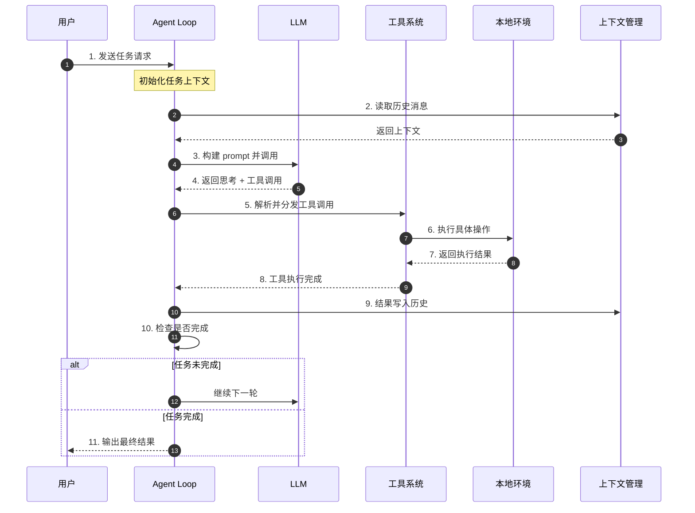
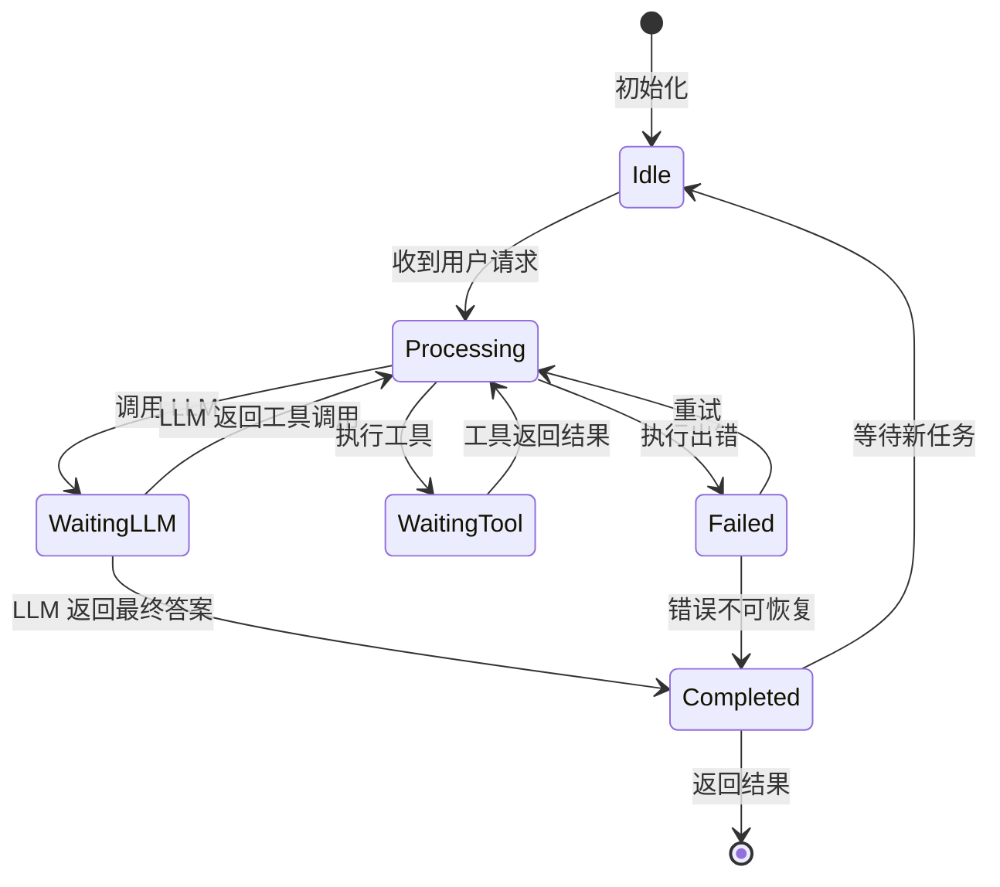
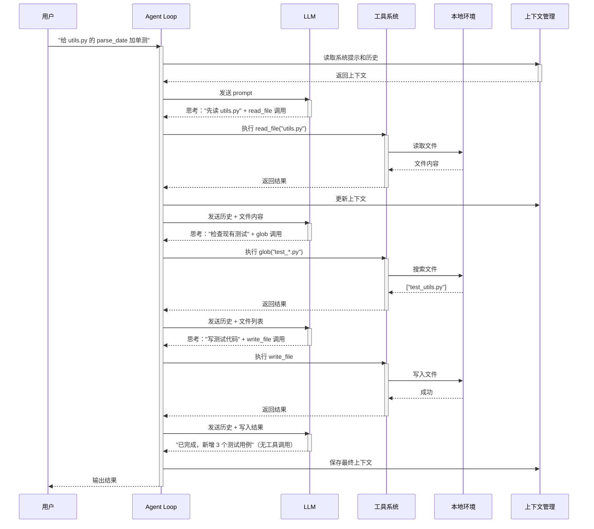
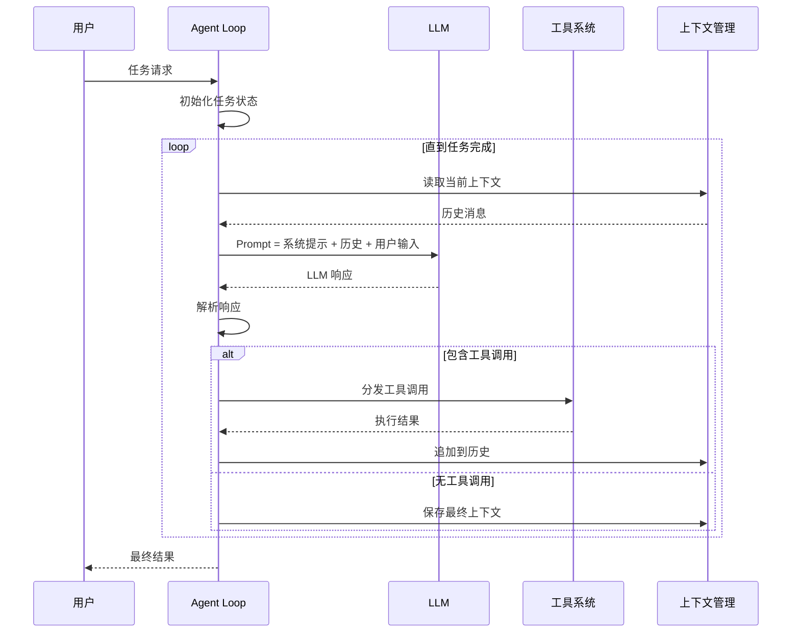
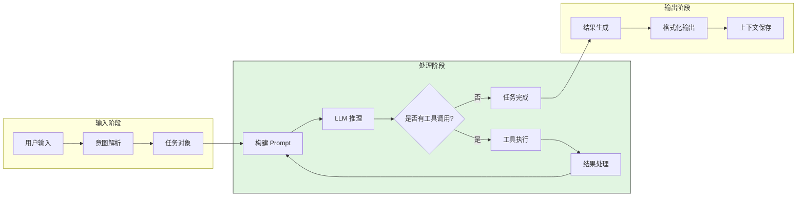
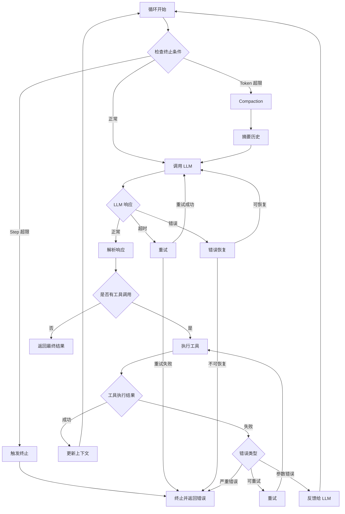
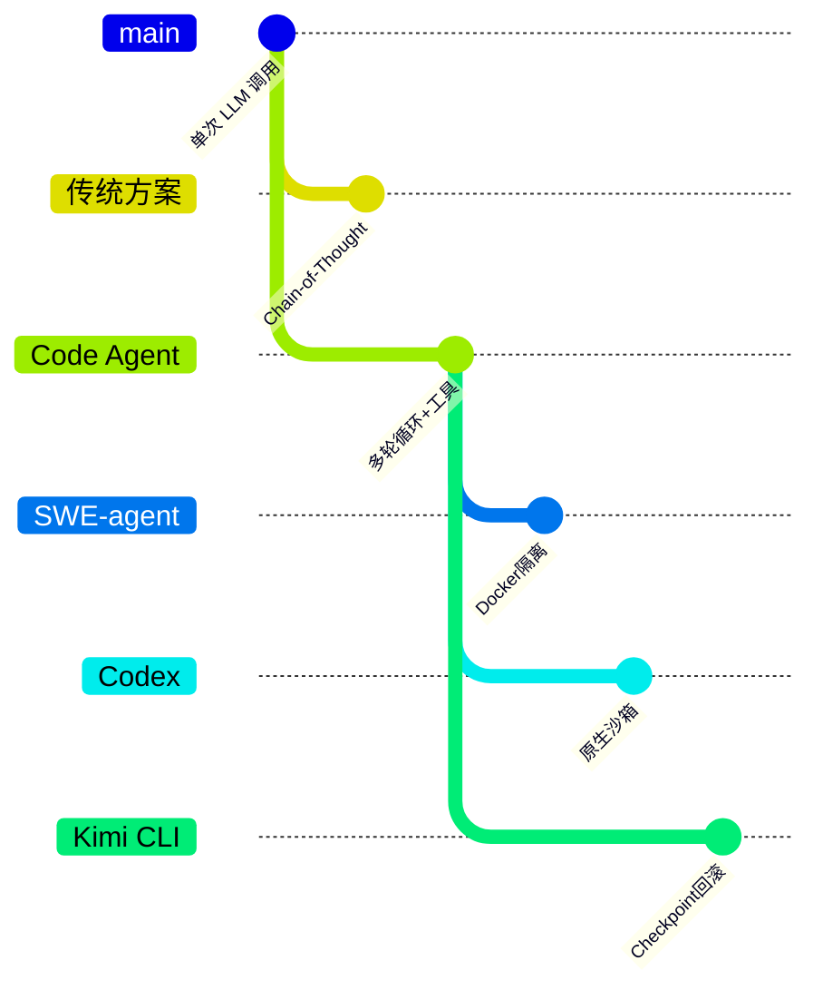

# Code Agent 全局认知

## TL;DR（结论先行）

一句话定义：**Code Agent = LLM + 工具调用循环 + 本地环境**，它不是"更聪明的代码补全"，而是一个能自主规划、执行、观察、修正的工程执行器。

核心取舍：**统一的多轮循环架构**（对比单次调用 LLM），通过 **LLM 推理与工具执行的解耦** 实现从"思考"到"行动"的跨越。

---

## 1. 为什么需要 Code Agent？（解决什么问题）

### 1.1 问题场景

**传统 LLM 的局限：**

一次调用只能"思考"，不能"行动"。你把代码问题发给 LLM，它给你一个答案 —— 但如果答案需要先读文件、跑测试、再根据结果修正，单次调用就做不到了。

```
没有 Agent Loop：
用户问"修复这个 bug" → LLM 一次回答 → 结束（可能根本没看文件）

有 Agent Loop：
  → LLM: "先读文件" → 读文件 → 得到结果
  → LLM: "再跑测试" → 执行测试 → 得到结果
  → LLM: "修改第 42 行" → 写文件 → 成功
```

### 1.2 核心挑战

| 挑战 | 不解决的后果 |
|-----|-------------|
| 单次调用无法获取外部信息 | LLM 只能基于训练数据"猜测"，无法访问实际代码 |
| 复杂任务需要多步推理 | 无法分解任务，一次输出可能遗漏关键步骤 |
| 执行结果需要反馈修正 | 无法根据实际执行结果调整策略，错误无法纠正 |

---

## 2. 整体架构（ASCII 图）

### 2.1 在系统中的位置

```text
┌─────────────────────────────────────────────────────────────┐
│ 用户输入层                                                   │
│ 自然语言需求 / 代码问题 / 任务描述                            │
└───────────────────────┬─────────────────────────────────────┘
                        │ 发送请求
                        ▼
┌─────────────────────────────────────────────────────────────┐
│ ▓▓▓ Code Agent Core ▓▓▓                                     │
│                                                             │
│ ┌─────────────────────────────────────────────────────────┐ │
│ │ Agent Loop (控制器)                                      │ │
│ │ - 协调循环直到任务完成                                    │ │
│ │ - 解析 LLM 输出，分发工具调用                             │ │
│ └───────────────────────┬─────────────────────────────────┘ │
│                         │
│         ┌───────────────┼───────────────┐
│         ▼               ▼               ▼
│ ┌──────────────┐ ┌──────────────┐ ┌──────────────┐
│ │ LLM 推理引擎  │ │ 工具系统      │ │ 上下文管理    │
│ │ - 下一步决策  │ │ - 文件读写    │ │ - 历史消息    │
│ │ - 工具选择   │ │ - Shell 执行  │ │ - Token 控制  │
│ └──────────────┘ └──────────────┘ └──────────────┘
│                         │
└─────────────────────────┼───────────────────────────────────┘
                          │ 读写文件、执行命令
                          ▼
┌─────────────────────────────────────────────────────────────┐
│ 本地环境层                                                   │
│ 文件系统 / Shell / 网络 / 代码仓库                            │
└─────────────────────────────────────────────────────────────┘
```

### 2.2 核心组件职责

| 组件 | 职责 | 类比 | 代码位置（示例） |
|-----|------|------|-----------------|
| `Agent Loop` | 协调循环，直到任务完成 | 操作系统调度器 | `kimi-cli/packages/kosong/src/kosong/__main__.py:47` |
| `LLM` | 推理：下一步该做什么 | 大脑 | 各项目 LLM 客户端模块 |
| `Tool System` | 执行具体操作（读写文件、运行命令） | 手和工具 | `SWE-agent/sweagent/tools/tools.py` |
| `Context Manager` | 管理历史消息，不超出 token 限制 | 短期记忆 | `gemini-cli/packages/core/src/core/client.ts:789` |
| `Local Environment` | 实际的文件系统、Shell、网络 | 操作台 | 系统级调用 |

### 2.3 核心组件交互关系



**关键交互说明**：

| 步骤 | 交互内容 | 设计意图 |
|-----|---------|---------|
| 1 | 用户向 Agent Loop 发起请求 | 解耦用户交互与任务执行，支持多种输入源 |
| 3-4 | LLM 调用与响应 | LLM 只负责"思考"，不直接操作环境，确保安全 |
| 5-8 | 工具调用链 | 工具系统作为中间层，统一封装环境操作 |
| 9 | 上下文更新 | 每轮结果写入历史，支持多轮推理 |
| 10 | 完成检查 | 无工具调用时认为任务完成，避免无限循环 |

---

## 3. 核心组件详细分析

### 3.1 Agent Loop 内部结构

#### 职责定位

Agent Loop 是 Code Agent 的控制核心，负责驱动"思考-执行-观察"的循环直到任务完成。

#### 状态机图



**状态说明**：

| 状态 | 说明 | 进入条件 | 退出条件 |
|-----|------|---------|---------|
| Idle | 空闲等待 | 初始化完成或任务结束 | 收到新用户请求 |
| Processing | 处理中 | 收到请求或工具返回 | 需要调用 LLM 或工具 |
| WaitingLLM | 等待 LLM 响应 | 发送请求给 LLM | LLM 返回响应 |
| WaitingTool | 等待工具执行 | 分发工具调用 | 工具执行完成 |
| Completed | 任务完成 | LLM 返回无工具调用的答案 | 自动返回 Idle |
| Failed | 执行失败 | 工具执行出错或 LLM 调用失败 | 重试或终止 |

#### 内部数据流

```text
┌─────────────────────────────────────────────────────────────┐
│  输入层                                                      │
│  ├── 用户输入 ──► 意图解析 ──► 任务对象                       │
│  └── 系统配置 ──► 参数验证 ──► 运行上下文                     │
└──────────────────────────┬──────────────────────────────────┘
                           ▼
┌─────────────────────────────────────────────────────────────┐
│  处理层                                                      │
│  ├── 循环控制器: 管理循环状态与终止条件                       │
│  │   └── 检查 step 上限 ──► 检查 token 上限 ──► 调用 LLM     │
│  ├── 响应解析器: 提取工具调用与文本响应                       │
│  │   └── 解析 LLM 输出 ──► 验证工具参数 ──► 构建调用列表      │
│  └── 工具协调器: 分发执行与结果收集                           │
│      └── 并发派发 ──► 顺序收集 ──► 结果格式化                 │
└──────────────────────────┬──────────────────────────────────┘
                           ▼
┌─────────────────────────────────────────────────────────────┐
│  输出层                                                      │
│  ├── 结果格式化（文本 / 结构化数据）                          │
│  ├── 上下文更新（历史消息写入）                               │
│  └── 事件通知（进度 / 完成 / 错误）                           │
└─────────────────────────────────────────────────────────────┘
```

---

### 3.2 工具系统内部结构

#### 职责定位

工具系统是 Code Agent 与外部环境的桥梁，负责将 LLM 的意图转换为具体的系统操作。

#### 关键接口

| 接口 | 输入 | 输出 | 说明 | 代码位置（示例） |
|-----|------|------|------|-----------------|
| `execute()` | 工具名称 + 参数 | 执行结果 | 核心执行方法 | `SWE-agent/sweagent/tools/tools.py` |
| `validate()` | 工具调用请求 | 验证结果 | 参数校验 | 各项目工具定义模块 |
| `list_available()` | - | 工具列表 | 获取可用工具 | `codex/codex-rs/core/src/tools/` |

---

### 3.3 组件间协作时序

以"给函数加单元测试"为例，展示完整协作流程：



**协作要点**：

1. **用户与 Agent Loop**：通过自然语言交互，Agent Loop 负责任务分解与执行
2. **Agent Loop 与 LLM**：LLM 只输出"意图"（工具调用），不直接操作环境
3. **工具系统与环境**：工具系统封装所有环境操作，提供统一接口和安全控制

---

## 4. 端到端数据流转

### 4.1 正常流程（详细版）



**数据变换详情**：

| 阶段 | 输入 | 处理 | 输出 | 说明 |
|-----|------|------|------|------|
| 接收 | 用户自然语言 | 意图识别 | 任务对象 | 提取任务目标 |
| 构建 Prompt | 历史消息 + 当前状态 | 格式化 + Token 控制 | LLM 输入 | 可能触发 compaction |
| LLM 推理 | Prompt | 模型推理 | 工具调用或文本 | 决定下一步行动 |
| 工具执行 | 工具名称 + 参数 | 验证 + 执行 | 执行结果 | 包含错误处理 |
| 上下文更新 | 执行结果 | 格式化 + 追加 | 更新后的历史 | 用于下一轮推理 |

### 4.2 数据流向图



### 4.3 异常/边界流程



---

## 5. 关键代码实现

### 5.1 核心数据结构

所有 Code Agent 共享的抽象模式：

```python
# 伪代码：所有 Code Agent 的本质结构
class AgentLoop:
    context: List[Message]      # 历史消息
    tools: List[Tool]           # 可用工具列表
    llm: LLMClient              # LLM 客户端
    max_steps: int              # 最大步数限制

    async def run(self, user_input: str) -> str:
        """主循环入口"""
        self.context.append(UserMessage(user_input))
        step_count = 0

        while step_count < self.max_steps:
            # 调用 LLM
            response = await self.llm.call(self.context)

            if response.has_tool_calls:
                # 执行工具
                for call in response.tool_calls:
                    result = await self.tools.execute(call)
                    self.context.append(ToolResult(result))
                step_count += 1
            else:
                # 无工具调用 = 任务完成
                return response.text

        raise MaxStepsExceeded()
```

**字段说明**：

| 字段 | 类型 | 用途 |
|-----|------|------|
| `context` | `List[Message]` | 维护对话历史，支持多轮推理 |
| `tools` | `List[Tool]` | 可用工具集合，LLM 从中选择 |
| `llm` | `LLMClient` | LLM 调用封装，处理 API 细节 |
| `max_steps` | `int` | 防止无限循环的安全限制 |

### 5.2 主链路代码示例

以下展示各项目 Agent Loop 的核心实现：

**Kimi CLI（Python + asyncio）**：

```python
# kimi-cli/packages/kosong/src/kosong/__main__.py:47
async def agent_loop(chat_provider: ChatProvider, toolset: Toolset):
    system_prompt = "You are a helpful assistant."
    history: list[Message] = []

    while True:
        user_input = input("You: ").strip()
        if not user_input:
            continue
        if user_input.lower() in {"exit", "quit"}:
            break

        history.append(Message(role="user", content=user_input))

        while True:
            result = await kosong.step(
                chat_provider=chat_provider,
                system_prompt=system_prompt,
                toolset=toolset,
                history=history,
            )

            tool_results = await result.tool_results()

            assistant_message = result.message
            tool_messages = [tool_result_to_message(tr) for tr in tool_results]

            history.append(assistant_message)
            history.extend(tool_messages)

            if s := assistant_message.extract_text():
                print("Assistant:\n", textwrap.indent(s, "  "))
            for tool_msg in tool_messages:
                if s := tool_msg.extract_text():
                    print("Tool:\n", textwrap.indent(s, "  "))

            if not result.tool_calls:
                break
```

**SWE-agent（Python + Docker）**：

```python
# SWE-agent/sweagent/agent/agents.py:1265
class DefaultAgent(AbstractAgent):
    def run(
        self,
        env: SWEEnv,
        problem_statement: ProblemStatement | ProblemStatementConfig,
        output_dir: Path = Path("."),
    ) -> AgentRunResult:
        """Run the agent on a problem instance. This method contains the
        main loop that repeatedly calls `self._step` until the problem is solved.
        """
        self.setup(env=env, problem_statement=problem_statement, output_dir=output_dir)

        # Run action/observation loop
        self._chook.on_run_start()
        step_output = StepOutput()
        while not step_output.done:
            step_output = self.step()
            self.save_trajectory()
        self._chook.on_run_done(trajectory=self.trajectory, info=self.info)

        self.logger.info("Trajectory saved to %s", self.traj_path)

        # Here we want to return the "global" information
        data = self.get_trajectory_data()
        return AgentRunResult(info=data["info"], trajectory=data["trajectory"])
```

**代码要点**：

1. **统一循环模式**：所有项目都遵循"调用 LLM → 检查工具调用 → 执行工具 → 循环"的模式
2. **显式 step 计数**：防止无限循环，可配置上限
3. **上下文追加**：每轮结果写入历史，支持多轮推理

### 5.3 关键调用链

```text
Kimi CLI:
  agent_loop()              [packages/kosong/src/kosong/__main__.py:47]
    -> step()               [packages/kosong/src/kosong/__init__.py]
      -> execute tools      [packages/kosong/src/kosong/tooling/]
        - 文件读写
        - Shell 执行
        - 代码搜索

SWE-agent:
  DefaultAgent.run()        [SWE-agent/sweagent/agent/agents.py:1265]
    -> llm.call()           [SWE-agent/sweagent/agent/models.py]
      -> tools.execute()    [SWE-agent/sweagent/tools/tools.py]
        - 环境操作
        - 测试执行

Gemini CLI:
  sendMessageStream()       [gemini-cli/packages/core/src/core/client.ts:789]
    -> handleResponse()     [gemini-cli/packages/core/src/core/turn.ts]
      -> executeTool()      [gemini-cli/packages/core/src/tools/]

OpenCode:
  prompt()                  [opencode/packages/opencode/src/session/prompt.ts:294]
    -> streamResponse()     [opencode/packages/opencode/src/session/llm.ts]
      -> tool.execute()     [opencode/packages/opencode/src/tool/]

Codex:
  spawn_agent()             [codex/codex-rs/core/src/agent/control.rs:55]
    -> agent_loop()         [codex/codex-rs/core/src/agent/mod.rs]
      -> tool_dispatch()    [codex/codex-rs/core/src/tools/]
```

---

## 6. 设计意图与 Trade-off

### 6.1 五项目的核心差异

| 维度 | SWE-agent | Codex | Gemini CLI | Kimi CLI | OpenCode |
|-----|-----------|-------|------------|----------|----------|
| **Loop 驱动** | 迭代循环 | Actor 消息 | 递归 continuation | while 迭代 | 状态机 |
| **安全模型** | Docker 隔离 | 原生沙箱 | 确认机制 | 确认机制 | 权限控制 |
| **状态管理** | 内存 | 内存 + 持久化 | 内存 | Checkpoint 文件 | SQLite |
| **工具定义** | YAML 配置 | Rust trait | TypeScript | Python 类 | Zod Schema |
| **扩展方式** | Bundle | MCP | 内置 | MCP | 插件 |

### 6.2 为什么这样设计？

**核心问题**：如何在"安全性"、"可复现性"、"用户体验"之间取舍？

**各项目的解决方案**：

| 项目 | 核心取舍 | 设计意图 | 适用场景 |
|-----|---------|---------|---------|
| **SWE-agent** | Docker 隔离 + 配置驱动 | 学术研究需要可复现、可评估的环境 | 论文复现、基准测试 |
| **Codex** | Rust 原生沙箱 + Actor 模型 | 企业级安全要求，零信任执行环境 | 生产环境、高安全需求 |
| **Gemini CLI** | 递归 continuation + IDE 集成 | 无缝集成开发工作流，低摩擦使用 | 日常开发、IDE 用户 |
| **Kimi CLI** | Checkpoint 回滚 + 对话恢复 | 支持探索性编程，允许试错回退 | 复杂任务、多轮对话 |
| **OpenCode** | 多 Agent + 插件系统 | 可扩展的生态系统，支持自定义 | 定制化需求、团队扩展 |

### 6.3 与其他方案的对比



| 方案 | 核心差异 | 适用场景 |
|-----|---------|---------|
| 单次 LLM 调用 | 无工具能力，纯文本回答 | 简单问答、概念解释 |
| Chain-of-Thought | 推理过程可见，但无执行 | 逻辑推导、数学问题 |
| Code Agent | 思考 + 执行 + 反馈循环 | 工程任务、代码修改 |

---

## 7. 边界情况与错误处理

### 7.1 终止条件

| 终止原因 | 触发条件 | 代码位置（示例） |
|---------|---------|-----------------|
| 任务完成 | LLM 返回无工具调用的响应 | `kimi-cli/packages/kosong/src/kosong/__main__.py:82` |
| Step 超限 | 执行步数达到 `max_steps` | `gemini-cli/packages/core/src/core/client.ts:68` |
| Token 超限 | 上下文超过模型限制 | `gemini-cli/packages/core/src/core/client.ts:789` |
| 用户中断 | Ctrl+C 或取消请求 | `codex/codex-rs/core/src/agent/control.rs:55` |
| 严重错误 | 工具执行不可恢复错误 | `opencode/packages/opencode/src/session/prompt.ts:294` |

### 7.2 超时/资源限制

```python
# 典型资源限制配置
AGENT_CONFIG = {
    "max_steps_per_turn": 100,      # 单轮最大步数
    "max_total_steps": 500,         # 总会话最大步数
    "max_context_tokens": 128000,   # 上下文 Token 上限
    "tool_timeout_seconds": 60,     # 工具执行超时
    "llm_timeout_seconds": 120,     # LLM 调用超时
}
```

### 7.3 错误恢复策略

| 错误类型 | 处理策略 | 代码位置（示例） |
|---------|---------|-----------------|
| LLM 调用超时 | 指数退避重试，最多 3 次 | 各项目 LLM 客户端模块 |
| 工具执行失败 | 返回错误信息给 LLM，让其决定 | `SWE-agent/sweagent/tools/tools.py` |
| Token 超限 | 触发 Compaction，摘要历史 | `gemini-cli/packages/core/src/core/client.ts` |
| 参数校验失败 | 返回错误给 LLM，要求修正 | `codex/codex-rs/core/src/tools/` |
| 沙箱违规 | 立即终止，记录审计日志 | `codex/codex-rs/core/src/agent/` |

---

## 8. 关键代码索引

### 8.1 核心文件

| 功能 | 文件 | 行号 | 说明 |
|-----|------|------|------|
| **SWE-agent** | | | |
| 入口 | `SWE-agent/sweagent/run/run.py` | - | 主运行入口 |
| Agent Loop | `SWE-agent/sweagent/agent/agents.py` | 1265 | `run()` 方法 |
| 工具系统 | `SWE-agent/sweagent/tools/tools.py` | - | 工具执行核心 |
| **Codex** | | | |
| 入口 | `codex/codex-rs/cli/src/main.rs` | - | CLI 入口 |
| Agent Loop | `codex/codex-rs/core/src/agent/control.rs` | 55 | `spawn_agent()` |
| 工具系统 | `codex/codex-rs/core/src/tools/` | - | 工具定义与分发 |
| **Gemini CLI** | | | |
| 入口 | `gemini-cli/packages/cli/src/index.ts` | - | CLI 入口 |
| Agent Loop | `gemini-cli/packages/core/src/core/client.ts` | 789 | `sendMessageStream()` |
| 工具系统 | `gemini-cli/packages/core/src/tools/` | - | 工具实现 |
| **Kimi CLI** | | | |
| 入口 | `kimi-cli/src/kimi_cli/main.py` | - | 主入口 |
| Agent Loop | `kimi-cli/packages/kosong/src/kosong/__main__.py` | 47 | `agent_loop()` |
| 工具系统 | `kimi-cli/packages/kosong/src/kosong/tooling/` | - | 工具实现 |
| **OpenCode** | | | |
| 入口 | `opencode/packages/opencode/src/main.ts` | - | 主入口 |
| Agent Loop | `opencode/packages/opencode/src/session/prompt.ts` | 294 | `prompt()` 循环 |
| 工具系统 | `opencode/packages/opencode/src/tool/` | - | 工具定义 |

---

## 9. 延伸阅读

- 前置知识：LLM 基础、函数调用（Function Calling）机制
- 相关机制：
  - `docs/comm/04-comm-agent-loop.md` - Agent Loop 深度对比
  - `docs/comm/05-comm-tools-system.md` - 工具系统对比
  - `docs/comm/07-comm-memory-context.md` - 上下文管理对比
  - `docs/comm/06-comm-mcp-integration.md` - MCP 集成对比
  - `docs/comm/10-comm-safety-control.md` - 安全控制对比
- 项目专项文档：
  - `docs/swe-agent/01-swe-agent-overview.md`
  - `docs/codex/01-codex-overview.md`
  - `docs/gemini-cli/01-gemini-cli-overview.md`
  - `docs/kimi-cli/01-kimi-cli-overview.md`
  - `docs/opencode/01-opencode-overview.md`

---

## 10. 证据标记

### 10.1 验证状态

| 项目 | 验证状态 | 说明 |
|-----|---------|------|
| Kimi CLI Agent Loop | ✅ Verified | 基于 `kimi-cli/packages/kosong/src/kosong/__main__.py:47` 源码确认 |
| SWE-agent Agent Loop | ✅ Verified | 基于 `SWE-agent/sweagent/agent/agents.py:1265` 源码确认 |
| Gemini CLI Agent Loop | ✅ Verified | 基于 `gemini-cli/packages/core/src/core/client.ts:789` 源码确认 |
| OpenCode Agent Loop | ✅ Verified | 基于 `opencode/packages/opencode/src/session/prompt.ts:294` 源码确认 |
| Codex Agent Loop | ✅ Verified | 基于 `codex/codex-rs/core/src/agent/control.rs:55` 源码确认 |
| 五项目架构对比 | ⚠️ Inferred | 基于各项目源码结构分析归纳 |

### 10.2 代码引用索引

**✅ Verified 引用：**

| 引用 | 文件路径 | 行号 | 验证日期 |
|-----|---------|------|---------|
| Kimi CLI agent_loop | `kimi-cli/packages/kosong/src/kosong/__main__.py` | 47 | 2026-02-25 |
| SWE-agent DefaultAgent.run | `SWE-agent/sweagent/agent/agents.py` | 1265 | 2026-02-25 |
| Gemini CLI sendMessageStream | `gemini-cli/packages/core/src/core/client.ts` | 789 | 2026-02-25 |
| OpenCode prompt | `opencode/packages/opencode/src/session/prompt.ts` | 294 | 2026-02-25 |
| Codex spawn_agent | `codex/codex-rs/core/src/agent/control.rs` | 55 | 2026-02-25 |

---

*基于版本：2026-02-08 代码快照 | 最后更新：2026-02-25*

*✅ Verified: 基于各项目源码分析*
*⚠️ Inferred: 基于代码结构的合理推断*
