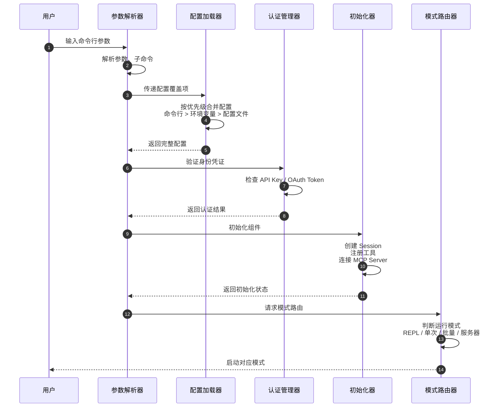
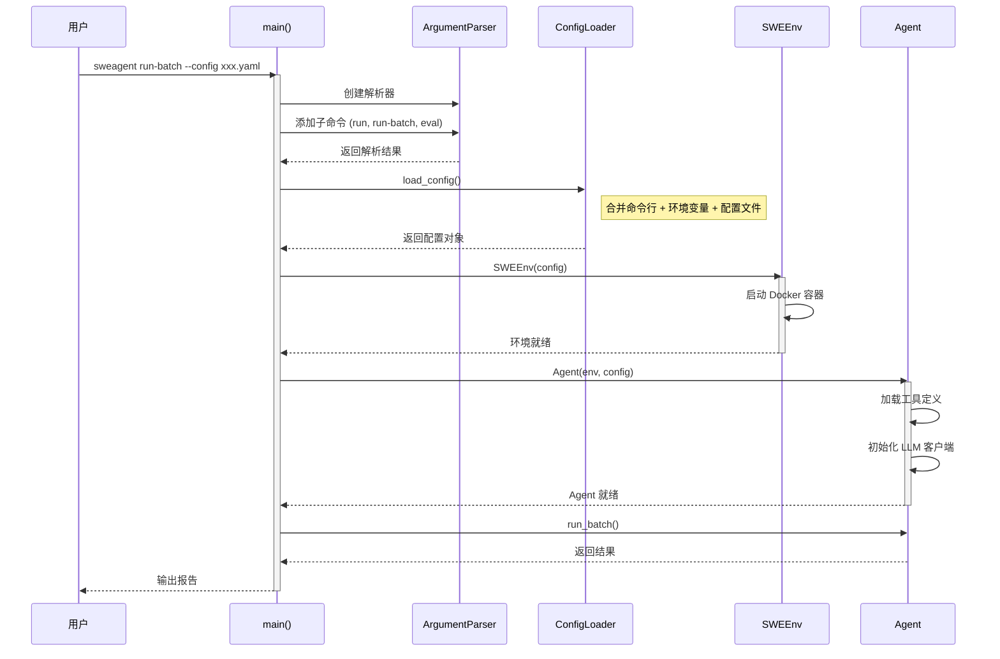
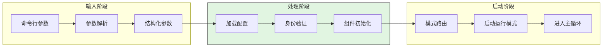
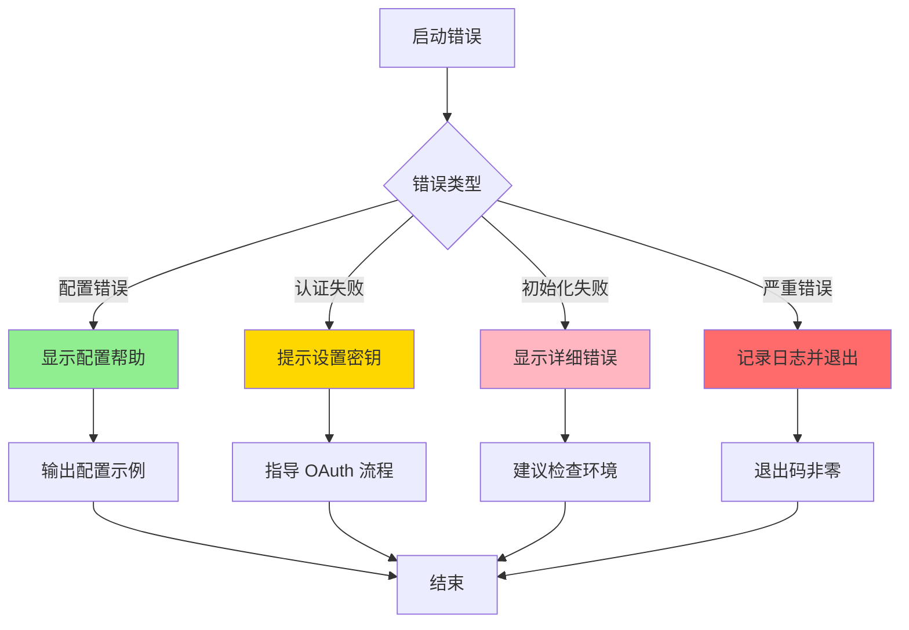
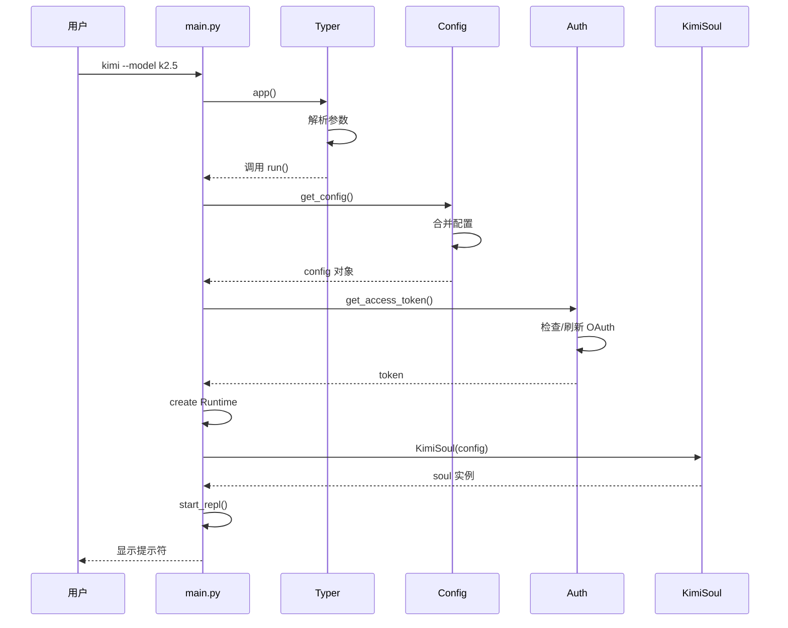
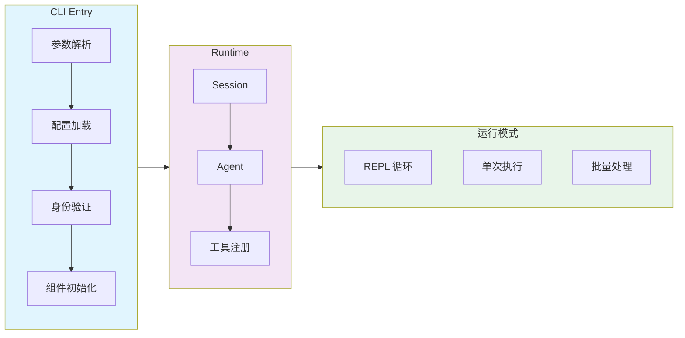
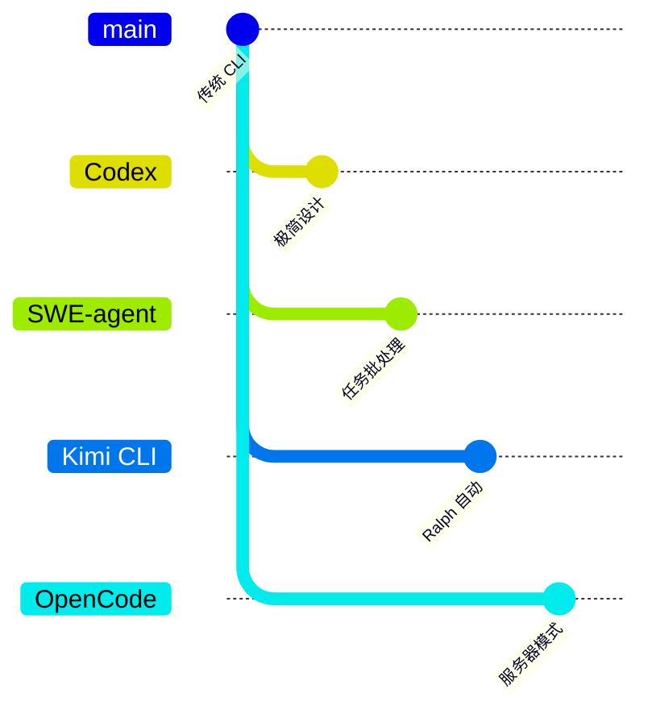

# CLI 入口与启动流程

## TL;DR（结论先行）

一句话定义：CLI 入口是 AI Coding Agent 的启动门面，负责将外部输入（命令行参数、环境变量、配置文件）翻译成内部配置，并路由到对应的运行模式。

跨项目核心取舍：**统一的分层配置加载策略**（对比硬编码配置），所有项目都遵循"命令行 > 环境变量 > 配置文件 > 默认值"的优先级，但在运行模式设计（REPL/单次/批量/服务器）和认证方式（API Key/OAuth）上存在显著差异。

---

## 1. 为什么需要这个机制？（解决什么问题）

### 1.1 问题场景

没有标准化的 CLI 入口，用户启动 Agent 时需要面对：

```
场景1：密钥管理混乱
  - 用户不知道 API Key 该放哪里（命令行？文件？环境变量？）
  - 密钥泄露风险高

场景2：配置来源冲突
  - 命令行说用 gpt-4，配置文件说用 gpt-3.5，到底听谁的？

场景3：运行模式不匹配
  - 想批量处理 100 个任务，却只能一个个交互输入
  - 想快速执行单条指令，却要先进入 REPL
```

### 1.2 核心挑战

| 挑战 | 不解决的后果 |
|-----|-------------|
| 配置来源多且冲突 | 用户困惑，行为不可预期 |
| 认证方式多样 | 密钥管理混乱，安全隐患 |
| 运行场景不同 | 交互式 vs 自动化需求难以兼顾 |
| 初始化依赖复杂 | 启动失败难以诊断 |

---

## 2. 整体架构（ASCII 图）

### 2.1 在系统中的位置

```text
┌─────────────────────────────────────────────────────────────┐
│ 用户输入层                                                   │
│ 命令行 / 环境变量 / 配置文件                                  │
└───────────────────────┬─────────────────────────────────────┘
                        │ 解析输入
                        ▼
┌─────────────────────────────────────────────────────────────┐
│ ▓▓▓ CLI Entry ▓▓▓                                           │
│ 参数解析 → 配置加载 → 身份验证 → 初始化组件 → 模式分发         │
│                                                              │
│ sweagent/run/run.py:main()                                   │
│ codex-rs/cli/src/main.rs:main()                              │
│ packages/cli/src/index.ts:main()                             │
│ kimi-cli/src/kimi_cli/main.py:main()                         │
│ packages/opencode/src/main.ts:main()                         │
└───────────────────────┬─────────────────────────────────────┘
                        │ 分发到运行模式
        ┌───────────────┼───────────────┐
        ▼               ▼               ▼
┌──────────────┐ ┌──────────────┐ ┌──────────────┐
│ REPL 交互模式 │ │ 单次执行模式 │ │ 批量/服务模式 │
│ 持续对话     │ │ 脚本化调用   │ │ 自动化处理   │
└──────────────┘ └──────────────┘ └──────────────┘
```

### 2.2 核心组件职责

| 组件 | 职责 | 代码位置 |
|-----|------|---------|
| `参数解析器` | 解析命令行参数、子命令 | 各项目入口文件 |
| `配置加载器` | 按优先级合并多来源配置 | `config.py` / `config.rs` / `config.ts` |
| `认证管理器` | 验证/刷新 API Key 或 OAuth Token | `auth.py` / `client.ts` |
| `模式路由器` | 根据参数分发到对应运行模式 | 入口 `main()` 函数 |
| `初始化器` | 创建 Session、Agent、工具注册 | `agent_loop.rs` / `soul.py` |

### 2.3 核心组件交互关系



**关键交互说明**：

| 步骤 | 交互内容 | 设计意图 |
|-----|---------|---------|
| 1-2 | 解析命令行参数 | 将用户输入结构化，支持子命令和选项 |
| 3-4 | 分层配置加载 | 遵循 12-Factor App 原则，来源透明可预期 |
| 5-6 | 身份验证 | 统一认证接口，隐藏 OAuth 刷新细节 |
| 7-8 | 组件初始化 | 延迟初始化，按需创建资源 |
| 9-10 | 模式路由 | 解耦入口逻辑与运行模式实现 |

---

## 3. 核心组件详细分析

### 3.1 参数解析器 内部结构

#### 职责定位

参数解析器负责将用户输入的命令行字符串转换为结构化数据，支持子命令、选项和位置参数。

#### 各项目实现对比

| 项目 | 解析库 | 特点 |
|-----|--------|------|
| SWE-agent | `argparse` | Python 标准库，功能完整 |
| Codex | `clap` (Rust) | 编译时检查，类型安全 |
| Gemini CLI | `commander` (Node.js) | 链式 API，支持插件 |
| Kimi CLI | `typer` (Python) | 基于类型注解，自动生成帮助 |
| OpenCode | 自定义解析 | 轻量，针对特定需求优化 |

#### 关键接口

| 接口 | 输入 | 输出 | 说明 | 代码位置 |
|-----|------|------|------|---------|
| `parse_args()` | 命令行字符串数组 | 结构化参数对象 | 主解析入口 | 各项目入口文件 |
| `add_subcommand()` | 子命令定义 | 子命令处理器 | 注册子命令 | 入口文件 |
| `print_help()` | - | 帮助文本 | 自动生成文档 | 解析库内置 |

---

### 3.2 配置加载器 内部结构

#### 职责定位

配置加载器负责从多个来源加载配置并按优先级合并，确保配置行为可预期。

#### 通用优先级（所有项目相同）

```text
┌─────────────────────────────────────────────────────────────┐
│ 配置优先级（从高到低）                                        │
├─────────────────────────────────────────────────────────────┤
│ 1. 命令行参数     --model gpt-4                              │
│ 2. 环境变量       OPENAI_API_KEY=xxx                         │
│ 3. 项目级配置     ./.codex/config.toml                       │
│ 4. 用户级配置     ~/.codex/config.toml                       │
│ 5. 内置默认值     代码中硬编码                                │
└─────────────────────────────────────────────────────────────┘
```

#### 配置位置对比

| 项目 | 配置文件路径 | 格式 |
|-----|------------|------|
| Codex | `~/.codex/config.toml` | TOML |
| Gemini CLI | `~/.gemini/settings.json` | JSON |
| Kimi CLI | `~/.kimi/config.yaml` | YAML |
| OpenCode | `~/.opencode/config.json` | JSON |
| SWE-agent | 项目目录或命令行指定 | YAML/JSON |

---

### 3.3 组件间协作时序

以 SWE-agent 的批量模式为例，展示完整启动流程：



**协作要点**：

1. **命令行解析**：使用 argparse 定义子命令和参数，支持复杂配置覆盖
2. **配置加载**：支持从 YAML、JSON、环境变量多来源加载，优先级明确
3. **环境初始化**：Docker 启动是最耗时的步骤，需要等待就绪信号
4. **Agent 初始化**：工具注册和 LLM 客户端创建在配置验证之后

---

### 3.4 关键数据路径

#### 主路径（正常启动）



#### 异常路径（启动失败）



---

## 4. 端到端数据流转

### 4.1 正常流程（详细版）

以 Kimi CLI 启动为例：



**数据变换详情**：

| 阶段 | 输入 | 处理 | 输出 | 代码位置 |
|-----|------|------|------|---------|
| 接收 | 命令行字符串 | Typer 解析 | 结构化参数 | `kimi-cli/src/kimi_cli/main.py:30-50` |
| 配置 | 参数 + 文件 | 优先级合并 | Config 对象 | `kimi-cli/src/kimi_cli/config.py:50-100` |
| 认证 | config.credentials | OAuth 刷新 | access_token | `kimi-cli/src/kimi_cli/auth.py:80-120` |
| 初始化 | config + token | 创建组件 | Runtime + Soul | `kimi-cli/src/kimi_cli/main.py:80-120` |

### 4.2 数据流向图



---

## 5. 关键代码实现

### 5.1 核心数据结构

Codex 的 CLI 参数定义（使用 clap derive）：

```rust
// codex-rs/cli/src/flags.rs:1-60
#[derive(Parser, Debug)]
#[command(name = "codex")]
#[command(about = "AI coding assistant")]
pub struct Flags {
    /// Model to use for completion
    #[arg(short, long)]
    pub model: Option<String>,

    /// Configuration file path
    #[arg(short, long)]
    pub config: Option<PathBuf>,

    /// Command to execute directly
    pub command: Vec<String>,
}
```

**字段说明**：
| 字段 | 类型 | 用途 |
|-----|------|------|
| `model` | `Option<String>` | 指定使用的模型 |
| `config` | `Option<PathBuf>` | 自定义配置文件路径 |
| `command` | `Vec<String>` | 直接执行的命令（非 REPL 模式）|

### 5.2 主链路代码

Kimi CLI 的入口函数：

```python
# kimi-cli/src/kimi_cli/main.py:30-80
@app.callback(invoke_without_command=True)
def main(
    ctx: typer.Context,
    model: Optional[str] = typer.Option(None, "--model", "-m"),
    ralph: bool = typer.Option(False, "--ralph"),
):
    """Kimi CLI 入口"""
    if ctx.invoked_subcommand is not None:
        return

    # 1. 加载配置
    config = get_config()
    if model:
        config.model = model

    # 2. 身份验证
    token = get_access_token()

    # 3. 初始化 Runtime 和 Agent
    runtime = create_runtime(config)
    soul = KimiSoul(config, runtime)

    # 4. 启动对应模式
    if ralph:
        run_ralph_mode(soul)
    else:
        run_repl(soul)
```

**代码要点**：
1. **Typer 装饰器模式**：基于类型注解自动生成 CLI 接口
2. **配置覆盖**：命令行参数优先于配置文件
3. **模式分支**：根据 `--ralph` 标志选择自动迭代或交互模式

### 5.3 关键调用链

```text
kimi-cli/src/kimi_cli/main.py:main()          [30-80]
  -> get_config()                              [config.py:50]
    -> load_yaml_config()                      [config.py:80]
    -> merge_with_env()                        [config.py:100]
  -> get_access_token()                        [auth.py:80]
    -> refresh_oauth_if_needed()               [auth.py:120]
  -> create_runtime()                          [main.py:60]
  -> KimiSoul.__init__()                       [agent/soul.py:100]
    -> register_tools()                        [agent/soul.py:150]
    -> init_llm_client()                       [agent/soul.py:180]
```

---

## 6. 设计意图与 Trade-off

### 6.1 跨项目选择对比

| 维度 | SWE-agent | Codex | Gemini CLI | Kimi CLI | OpenCode |
|-----|-----------|-------|------------|----------|----------|
| **CLI 库** | argparse | clap | commander | typer | 自定义 |
| **运行模式** | 批量为主 | 简洁双模式 | IDE 集成 | Ralph 自动 | 服务器模式 |
| **认证方式** | API Key (环境) | API Key (文件) | OAuth (keychain) | OAuth (文件) | API Key |
| **配置格式** | YAML | TOML | JSON | YAML | JSON |
| **启动速度** | 慢 (Docker) | 快 | 中 | 中 | 快 |

### 6.2 为什么这样设计？

**核心问题**：如何平衡 CLI 的简洁性与功能丰富度？

**Codex 的解决方案（极简主义）**：
- 代码依据：`codex-rs/cli/src/main.rs:1-80`
- 设计意图：降低学习成本，让新用户零配置即可使用
- 带来的好处：
  - 无需记忆子命令，`codex` 启动 TUI，`codex "指令"` 直接执行
  - 配置项少，决策负担低
- 付出的代价：
  - 高级配置能力受限
  - 批量处理需借助外部脚本

**SWE-agent 的解决方案（任务导向）**：
- 代码依据：`sweagent/run/run.py:1-100`
- 设计意图：面向学术实验和批量评估场景
- 带来的好处：
  - 原生支持批量任务和评估模式
  - Docker 隔离确保环境一致性
- 付出的代价：
  - 启动慢（需等待容器就绪）
  - 学习曲线陡峭

### 6.3 与其他项目的对比



| 项目 | 核心差异 | 适用场景 |
|-----|---------|---------|
| Codex | 无显式子命令，模式自动推断 | 快速原型、个人使用 |
| SWE-agent | 批量处理、Docker 隔离 | 学术研究、自动化评估 |
| Kimi CLI | Ralph 自动迭代模式 | 自动化 Agent 任务 |
| OpenCode | HTTP 服务器模式 | 远程调用、集成部署 |
| Gemini CLI | IDE 深度集成 | 开发工作流集成 |

---

## 7. 边界情况与错误处理

### 7.1 终止条件

| 终止原因 | 触发条件 | 代码位置 |
|---------|---------|---------|
| 参数解析失败 | 未知选项或缺少必需参数 | 各项目入口文件 |
| 配置加载失败 | 配置文件不存在或格式错误 | `config.py:load_config()` |
| 认证失败 | API Key 无效或 OAuth 过期 | `auth.py:get_token()` |
| 初始化失败 | 资源不足或依赖缺失 | `main.py:init()` |
| 用户中断 | Ctrl+C 信号 | 信号处理器 |

### 7.2 超时/资源限制

```python
# SWE-agent 的 Docker 启动超时
# sweagent/run/common.py:100-120
def init_environment(config):
    # 设置 Docker 启动超时
    with timeout(300):  # 5分钟超时
        env = SWEEnv(config)
        env.start()
    return env
```

### 7.3 错误恢复策略

| 错误类型 | 处理策略 | 代码位置 |
|---------|---------|---------|
| 配置文件不存在 | 使用默认配置并提示 | `config.py:50` |
| API Key 缺失 | 提示设置环境变量或配置文件 | `auth.py:80` |
| OAuth Token 过期 | 自动刷新或引导重新授权 | `auth.py:120` |
| 网络连接失败 | 重试 3 次后退出 | `client.py:100` |
| Docker 启动失败 | 显示日志并建议检查环境 | `env.py:200` |

---

## 8. 关键代码索引

### 8.1 入口点

| 功能 | 文件 | 行号 | 说明 |
|-----|------|------|------|
| SWE-agent 入口 | `sweagent/run/run.py` | 30-60 | `main()` 函数，参数解析和子命令分发 |
| Codex 入口 | `codex-rs/cli/src/main.rs` | 20-50 | `main()` 函数，TUI/Direct 模式判断 |
| Gemini CLI 入口 | `packages/cli/src/index.ts` | 20-80 | `main()` 函数，IDE 模式检测 |
| Kimi CLI 入口 | `kimi-cli/src/kimi_cli/main.py` | 30-80 | `main()` callback，模式路由 |
| OpenCode 入口 | `packages/opencode/src/main.ts` | 30-100 | `main()` 函数，三种模式路由 |

### 8.2 参数定义

| 功能 | 文件 | 行号 | 说明 |
|-----|------|------|------|
| SWE-agent 参数 | `sweagent/run/run.py` | 60-120 | argparse 子命令定义 |
| Codex 参数 | `codex-rs/cli/src/flags.rs` | 1-60 | clap derive 宏定义 |
| Gemini CLI 参数 | `packages/cli/src/index.ts` | 30-80 | commander 链式配置 |
| Kimi CLI 参数 | `kimi-cli/src/kimi_cli/main.py` | 30-50 | typer Option 装饰器 |
| OpenCode 参数 | `packages/opencode/src/flags.ts` | 1-80 | 自定义解析逻辑 |

### 8.3 配置加载

| 功能 | 文件 | 行号 | 说明 |
|-----|------|------|------|
| SWE-agent 配置 | `sweagent/run/common.py` | 50-150 | `load_config()` 多来源合并 |
| Codex 配置 | `codex-rs/core/src/config.rs` | 1-80 | `load_config()` TOML 解析 |
| Gemini CLI 配置 | `packages/core/src/config.ts` | 1-100 | `loadConfig()` JSON 加载 |
| Kimi CLI 配置 | `kimi-cli/src/kimi_cli/config.py` | 50-100 | `get_config()` YAML 加载 |
| OpenCode 配置 | `packages/opencode/src/config.ts` | 1-100 | `Config.load()` JSON 加载 |

### 8.4 Agent 初始化

| 功能 | 文件 | 行号 | 说明 |
|-----|------|------|------|
| SWE-agent Agent | `sweagent/agent/agents.py` | 200-250 | `DefaultAgent.__init__()` |
| Codex Agent | `codex-rs/core/src/agent_loop.rs` | 100-150 | `AgentLoop::new()` |
| Gemini CLI Client | `packages/core/src/core/client.ts` | 80-130 | `GeminiClient.constructor()` |
| Kimi CLI Soul | `kimi-cli/src/kimi_cli/agent/soul.py` | 100-150 | `KimiSoul.__init__()` |
| OpenCode Session | `packages/opencode/src/session/session.ts` | 100-150 | `Session.create()` |

---

## 9. 延伸阅读

- 前置知识：[Agent Loop 机制](04-comm-agent-loop.md)
- 相关机制：[MCP 集成](06-comm-mcp-integration.md)
- 深度分析：
  - [SWE-agent 启动流程](../swe-agent/questions/swe-agent-cli-entry.md)
  - [Codex 配置系统](../codex/questions/codex-config-loading.md)
- 项目特定文档：
  - `docs/swe-agent/01-swe-agent-overview.md`
  - `docs/codex/01-codex-overview.md`
  - `docs/kimi-cli/01-kimi-cli-overview.md`

---

*✅ Verified: 基于各项目入口文件源码分析*
*基于版本：2026-02-08 基准版本 | 最后更新：2026-02-25*
