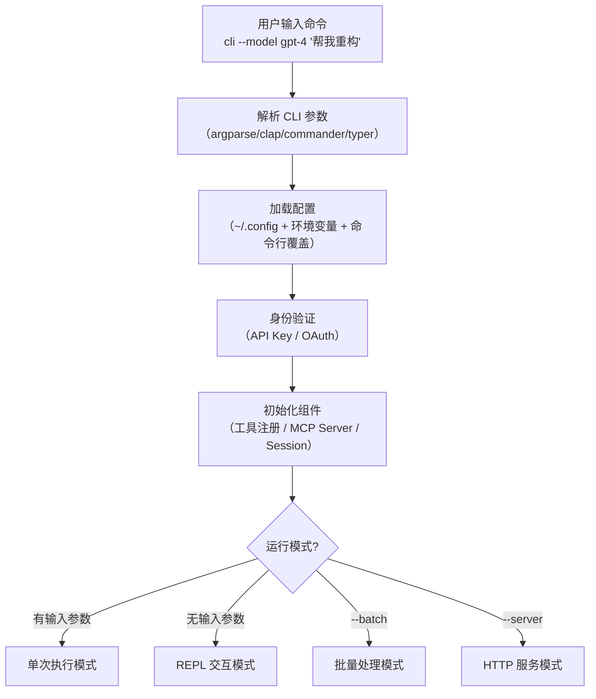

# CLI 入口与启动流程

## TL;DR

CLI 入口负责五件事：解析参数 → 加载配置 → 验证身份 → 初始化组件 → 分发到运行模式（REPL / 单次执行 / 批量 / 服务器）。各项目的差异主要在于"支持哪些运行模式"和"配置从哪里来"。

---

## 1. 启动流程通用结构



**设计动机：** 入口层的核心职责是"把外部输入翻译成内部配置"。好的入口设计应该让配置来源透明（命令行 > 环境变量 > 配置文件）、运行模式可扩展。

---

## 2. 各项目实现

### 核心差异概览

| 项目 | CLI 库 | 支持的运行模式 | 认证方式 |
|------|--------|---------------|----------|
| SWE-agent | `argparse` | run / run-batch / eval | API Key（环境变量）|
| Codex | `clap` (Rust) | TUI / 直接执行 / REPL | API Key（配置文件）|
| Gemini CLI | `commander` | chat / ide | OAuth（keychain 存储）|
| Kimi CLI | `typer` | REPL + ralph 自动迭代 | OAuth（配置文件）|
| OpenCode | 自定义 | REPL / 单次 / server | API Key |

### 2.1 SWE-agent（任务批处理导向）

**入口**：`sweagent/run/run.py`

```
main()
├── run         → RunSingleCommandHandler → Docker 启动 → Agent 循环
├── run-batch   → RunBatchCommandHandler → 并行多任务 → 报告汇总
└── eval        → 评估模式，对比 ground truth
```

启动最慢（需要等待 Docker 容器就绪），但支持批量评估 —— 适合学术实验。

### 2.2 Codex（极简，快速启动）

**入口**：`codex-rs/cli/src/main.rs`

启动流程：解析参数（`flags.rs`）→ 直接进入 TUI 或执行单条指令。

不需要显式子命令：`codex` 启动 TUI，`codex "做什么"` 直接执行，`-m` 指定模型。

**工程取舍：** 极简 CLI 设计降低了学习成本，但也限制了高级配置能力。

### 2.3 Kimi CLI（ralph 模式）

**入口**：`kimi-cli/src/kimi_cli/main.py`

Ralph 模式（`--ralph`）是 Kimi CLI 的特色：不等待用户输入，Agent 自主循环执行直到任务完成或达到迭代上限。这更接近"自动 Agent"而不是"交互式助手"。

---

## 3. 配置加载策略

**通用优先级**（所有项目相同）：

```
命令行参数 > 环境变量 > 项目级配置文件 > 用户级配置文件 > 内置默认值
```

**配置位置**：

| 项目 | 配置文件路径 | 格式 |
|------|------------|------|
| Codex | `~/.codex/config.toml` | TOML |
| Gemini CLI | `~/.gemini/settings.json` | JSON |
| Kimi CLI | `~/.kimi/config.yaml` | YAML |
| OpenCode | `~/.opencode/config.json` | JSON |

---

## 4. 设计意图与工程取舍

**为什么配置有三个来源（命令行 / 环境变量 / 文件）？**

这是 12-Factor App 原则：
- **命令行** 适合临时覆盖（调试时用不同模型）
- **环境变量** 适合 CI/CD 场景（不把密钥写进文件）
- **配置文件** 适合持久化的个人偏好

**运行模式的 trade-off：**

| 模式 | 优势 | 劣势 |
|------|------|------|
| REPL 交互 | 灵活，支持多轮对话 | 不适合自动化 |
| 单次执行 | 可脚本化 | 上下文不保留 |
| 批量模式 | 高吞吐量 | 需要提前准备输入 |
| 服务器模式 | 支持远程调用 | 额外安全风险 |

---

## 5. 各 Agent 实现细节

### 2.1 SWE-agent

**实现概述**

SWE-agent 使用 Python 的 `argparse` 模块进行命令行解析，支持多种运行模式（完整运行、评估、复制）。

**入口流程**

```text
sweagent/run/run.py
├── main()
│   ├── 创建 ArgumentParser
│   ├── 添加子命令 (run, run-batch, eval)
│   ├── 解析参数
│   └── 分发到对应处理器
│
├── RunSingleCommandHandler
│   ├── 加载配置 (from_yaml, from_json, from_env)
│   ├── 初始化 SWEEnv (Docker)
│   ├── 初始化 Agent
│   └── 执行主循环
│
└── RunBatchCommandHandler
    ├── 批量任务处理
    └── 结果收集与报告
```

**关键代码位置**

| 文件 | 行号 | 说明 |
|------|------|------|
| `sweagent/run/run.py` | 1-100 | 入口点和参数解析 |
| `sweagent/run/common.py` | 1-150 | 配置加载基类 |
| `sweagent/run/batch.py` | 1-200 | 批量任务处理 |

**启动方式**

```bash
# 单次运行
sweagent run \
  --agent.name MyAgent \
  --agent.model.per_instance_cost_limit 2.00 \
  --env.repo github:owner/repo

# 批量评估
sweagent run-batch \
  --instances.type swe_bench \
  --instances.subset lite
```

### 2.2 Codex

**实现概述**

Codex 使用 Rust 的 `clap` crate 进行命令行解析，设计简洁，区分 TUI 模式和直接执行模式。

**入口流程**

```text
codex-rs/cli/src/main.rs
├── main()
│   ├── parse_cli() 解析命令行
│   ├── 判断执行模式
│   └── 启动对应模式
│
├── TUI 模式
│   ├── init_codex() 初始化
│   ├── setup_tracing() 日志
│   └── run_tui().await 启动 TUI
│
├── Direct 模式
│   ├── 加载 Session
│   ├── 执行指令
│   └── 输出结果
│
└── Repl 模式
    ├── 读取输入
    ├── 发送到 Agent
    └── 打印响应
```

**关键代码位置**

| 文件 | 行号 | 说明 |
|------|------|------|
| `codex-rs/cli/src/main.rs` | 1-80 | 主入口 |
| `codex-rs/cli/src/flags.rs` | 1-100 | CLI 参数定义 |
| `codex-rs/tui/src/lib.rs` | 1-100 | TUI 启动 |

**启动方式**

```bash
# TUI 交互模式
codex

# 直接执行
codex "解释这段代码"

# 指定文件
codex file.ts "添加错误处理"

# 使用不同模型
codex -m o4-mini "重构函数"
```

### 2.3 Gemini CLI

**实现概述**

Gemini CLI 使用 TypeScript 和 `commander` 库，提供丰富的 IDE 集成和智能体能力。支持多种执行模式。

**入口流程**

```text
packages/cli/src/index.ts
├── main()
│   ├── 解析 CLI 参数
│   ├── 初始化 GeminiClient
│   ├── 检测 IDE 模式
│   └── 启动对应模式
│
├── 交互模式
│   ├── createInterface() 创建 readline
│   ├── 启动 REPL 循环
│   └── 处理用户输入
│
├── 单次模式
│   ├── 解析输入
│   ├── 调用 Gemini
│   └── 输出结果
│
└── IDE 模式
    ├── 加载 IDE context
    └── 启动 IDE agent
```

**关键代码位置**

| 文件 | 行号 | 说明 |
|------|------|------|
| `packages/cli/src/index.ts` | 1-100 | CLI 入口 |
| `packages/cli/src/ui/` | - | UI 组件 |
| `packages/core/src/core/client.ts` | 80-150 | Client 初始化 |

**启动方式**

```bash
# 交互模式
gemini

# 单次执行
gemini "解释代码"

# IDE 模式
gemini --ide

# 指定模型
gemini --model gemini-2.5-pro
```

### 2.4 Kimi CLI

**实现概述**

Kimi CLI 使用 Python 的 `typer` 库（基于 Click），提供现代化的 CLI 体验。支持多种运行模式，包括流式多轮对话和 Ralph 自动迭代。

**入口流程**

```text
kimi-cli/src/kimi_cli/main.py
├── main()
│   ├── app = typer.Typer()
│   ├── 注册子命令
│   └── 解析并执行
│
├── run()
│   ├── 检查更新
│   ├── 初始化 Config
│   ├── 获取 access_token
│   ├── 创建 Runtime
│   ├── 创建 Agent (KimiSoul)
│   └── 启动 REPL
│
├── run_async()
│   ├── 读取用户输入
│   ├── KimiSoul.run(input)
│   └── 输出结果
│
└── 子命令
    ├── /model 切换模型
    ├── /clear 清除上下文
    └── /exit 退出
```

**关键代码位置**

| 文件 | 行号 | 说明 |
|------|------|------|
| `kimi-cli/src/kimi_cli/main.py` | 1-100 | CLI 入口 |
| `kimi-cli/src/kimi_cli/config.py` | 1-150 | 配置管理 |
| `kimi-cli/src/kimi_cli/agent/soul.py` | 1-100 | Agent 初始化 |

**启动方式**

```bash
# 默认模式（流式多轮）
kimi

# Ralph 自动迭代
kimi --ralph

# 指定最大迭代
kimi --ralph --max-iterations 10

# 单次执行
kimi "查询天气"

# 指定模型
kimi --model k2.5
```

### 2.5 OpenCode

**实现概述**

OpenCode 使用 TypeScript 和自定义的参数解析，支持多种运行模式（交互式、单次执行、服务器模式）。

**入口流程**

```text
packages/opencode/src/main.ts
├── main()
│   ├── parseArgs() 解析参数
│   ├── 设置日志
│   └── 路由到对应模式
│
├── interactiveMode()
│   ├── 初始化 Config
│   ├── 创建 Session
│   ├── 设置 readline
│   └── 启动交互循环
│
├── commandMode()
│   ├── 解析命令
│   ├── 执行单次任务
│   └── 输出结果
│
└── serverMode()
    ├── 启动 HTTP server
    └── WebSocket 处理
```

**关键代码位置**

| 文件 | 行号 | 说明 |
|------|------|------|
| `packages/opencode/src/main.ts` | 1-100 | CLI 入口 |
| `packages/opencode/src/config.ts` | 1-100 | 配置加载 |
| `packages/opencode/src/session/session.ts` | 1-100 | Session 初始化 |

**启动方式**

```bash
# 交互模式
opencode

# 单次执行
opencode "重构函数"

# 服务器模式
opencode --server

# 指定 agent
opencode --agent plan

# 安全确认
opencode --no-confirmation
```

---

## 3. 相同点总结

### 3.1 参数解析模式

| Agent | 解析库 | 配置来源 |
|-------|--------|----------|
| SWE-agent | argparse | YAML + 环境变量 + 命令行 |
| Codex | clap | 命令行 + 配置文件 |
| Gemini CLI | commander | 命令行 + 配置文件 |
| Kimi CLI | typer | 命令行 + 配置文件 |
| OpenCode | 自定义解析 | 命令行 + 配置文件 |

### 3.2 通用 CLI 选项

所有 Agent 都支持以下选项：

- `--model` / `-m`：指定模型
- `--help` / `-h`：显示帮助
- `--version` / `-v`：显示版本
- 位置参数：要处理的文件或目录

### 3.3 启动模式

| 模式 | 说明 | 支持 Agent |
|------|------|-----------|
| REPL/交互 | 持续对话 | 全部 |
| 单次执行 | 单条指令 | Codex, Gemini CLI, Kimi CLI, OpenCode |
| 批量处理 | 多任务 | SWE-agent |
| 服务器 | HTTP/WebSocket | OpenCode |

---

## 4. 不同点对比

### 4.1 配置加载策略

| Agent | 优先级 | 热重载 | 配置位置 |
|-------|--------|--------|----------|
| SWE-agent | 命令行 > 环境变量 > 配置文件 | 否 | 项目目录 |
| Codex | 命令行 > 配置文件 | 否 | ~/.codex |
| Gemini CLI | 命令行 > 配置文件 | 是 | ~/.gemini |
| Kimi CLI | 命令行 > 配置文件 | 否 | ~/.kimi |
| OpenCode | 命令行 > 环境变量 > 配置文件 | 是 | ~/.opencode |

### 4.2 身份验证方式

| Agent | 认证方式 | 凭证存储 | 刷新机制 |
|-------|----------|----------|----------|
| SWE-agent | API Key | 环境变量 | 无 |
| Codex | API Key | 环境变量/配置文件 | 无 |
| Gemini CLI | OAuth | keychain/密钥库 | 自动刷新 |
| Kimi CLI | OAuth | 配置文件 | 自动刷新 |
| OpenCode | API Key | 配置文件 | 无 |

### 4.3 启动时初始化

| Agent | 初始化步骤 | 耗时 | 特点 |
|-------|------------|------|------|
| SWE-agent | 配置 → Docker → Agent | 较长 | 容器启动慢 |
| Codex | 配置 → Session → TUI | 短 | 轻量快速 |
| Gemini CLI | 配置 → Client → 模式检测 | 中 | 自动检测 IDE |
| Kimi CLI | 配置 → Token → Runtime → Agent | 中 | OAuth 刷新 |
| OpenCode | 配置 → Session → 模式 | 短 | 插件加载 |

### 4.4 子命令设计

| Agent | 子命令数量 | 主要子命令 | 特点 |
|-------|-----------|------------|------|
| SWE-agent | 多 | run, run-batch, eval | 任务导向 |
| Codex | 少（隐式） | （无显式子命令） | 简洁 |
| Gemini CLI | 中 | chat, ide | 模式区分 |
| Kimi CLI | 多（/前缀） | /model, /clear, /exit | 交互命令 |
| OpenCode | 中 | --server, --agent | 选项驱动 |

### 4.5 错误处理

| Agent | 错误展示 | 恢复机制 | 日志记录 |
|-------|----------|----------|----------|
| SWE-agent | 异常抛出 | 无 | 文件日志 |
| Codex | 优雅降级 | Session 恢复 | tracing |
| Gemini CLI | UI 提示 | 自动重试 | 结构化日志 |
| Kimi CLI | 错误消息 | 无 | 文件日志 |
| OpenCode | 异常捕获 | Session 保留 | 结构化日志 |

---

## 5. 源码索引

### 5.1 入口点

| Agent | 文件路径 | 行号 | 函数名 |
|-------|----------|------|--------|
| SWE-agent | `sweagent/run/run.py` | 1 | `main()` |
| Codex | `codex-rs/cli/src/main.rs` | 1 | `main()` |
| Gemini CLI | `packages/cli/src/index.ts` | 1 | `main()` |
| Kimi CLI | `kimi-cli/src/kimi_cli/main.py` | 1 | `main()` |
| OpenCode | `packages/opencode/src/main.ts` | 1 | `main()` |

### 5.2 参数定义

| Agent | 文件路径 | 行号 | 说明 |
|-------|----------|------|------|
| SWE-agent | `sweagent/run/run.py` | 20-80 | argparse 配置 |
| Codex | `codex-rs/cli/src/flags.rs` | 1-100 | clap derive |
| Gemini CLI | `packages/cli/src/index.ts` | 10-50 | commander 配置 |
| Kimi CLI | `kimi-cli/src/kimi_cli/main.py` | 10-60 | typer 装饰器 |
| OpenCode | `packages/opencode/src/flags.ts` | 1-80 | 自定义解析 |

### 5.3 配置加载

| Agent | 文件路径 | 行号 | 函数名 |
|-------|----------|------|--------|
| SWE-agent | `sweagent/run/common.py` | 50-150 | `load_config()` |
| Codex | `codex-rs/core/src/config.rs` | 1-100 | `load_config()` |
| Gemini CLI | `packages/core/src/config.ts` | 1-100 | `loadConfig()` |
| Kimi CLI | `kimi-cli/src/kimi_cli/config.py` | 1-100 | `get_config()` |
| OpenCode | `packages/opencode/src/config.ts` | 1-100 | `Config.load()` |

### 5.4 Agent 初始化

| Agent | 文件路径 | 行号 | 函数名 |
|-------|----------|------|--------|
| SWE-agent | `sweagent/agent/agents.py` | 200 | `DefaultAgent.__init__()` |
| Codex | `codex-rs/core/src/agent_loop.rs` | 100 | `AgentLoop::new()` |
| Gemini CLI | `packages/core/src/core/client.ts` | 80 | `GeminiClient.constructor()` |
| Kimi CLI | `kimi-cli/src/kimi_cli/agent/soul.py` | 100 | `KimiSoul.__init__()` |
| OpenCode | `packages/opencode/src/session/session.ts` | 100 | `Session.create()` |

---

## 6. 流程图对比

### 6.1 SWE-agent 启动流程

```text
┌─────────────┐
│   main()    │
└──────┬──────┘
       │
       ▼
┌─────────────┐
│ parse_args  │
└──────┬──────┘
       │
       ▼
┌─────────────┐     ┌─────────────┐
│ load_config │────▶│ from_yaml   │
└──────┬──────┘     │ from_env    │
       │            └─────────────┘
       ▼
┌─────────────┐
│  SWEEnv()   │────▶ Docker 启动
└──────┬──────┘
       │
       ▼
┌─────────────┐
│  Agent()    │
└──────┬──────┘
       │
       ▼
┌─────────────┐
│   run()     │────▶ 主循环
└─────────────┘
```

### 6.2 Codex 启动流程

```text
┌─────────────┐
│   main()    │
└──────┬──────┘
       │
       ▼
┌─────────────┐
│ parse_cli() │
└──────┬──────┘
       │
       ▼
┌─────────────┐
│ 模式判断    │
└──────┬──────┘
       │
   ┌───┴───┐
   ▼       ▼
┌──────┐ ┌──────┐
│ TUI  │ │Direct│
└──┬───┘ └──┬───┘
   │        │
   ▼        ▼
┌──────┐ ┌──────┐
│init_ │ │执行  │
│codex │ │指令  │
└──┬───┘ └──┬───┘
   │        │
   ▼        ▼
┌──────┐ ┌──────┐
│run_  │ │输出  │
│tui() │ │结果  │
└──────┘ └──────┘
```

### 6.3 OpenCode 启动流程

```text
┌─────────────┐
│   main()    │
└──────┬──────┘
       │
       ▼
┌─────────────┐
│ parseArgs() │
└──────┬──────┘
       │
       ▼
┌─────────────┐
│ 模式路由    │
└──────┬──────┘
       │
   ┌───┼───┐
   ▼   ▼   ▼
┌───┐┌───┐┌───┐
│交互││单次││服务│
└─┬─┘└─┬─┘└─┬─┘
   │    │    │
   ▼    ▼    ▼
┌───┐┌───┐┌───┐
│初始化│执行│启动│
│Session│命令│HTTP│
└───┘└───┘└───┘
```
