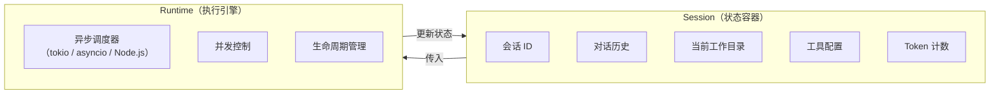
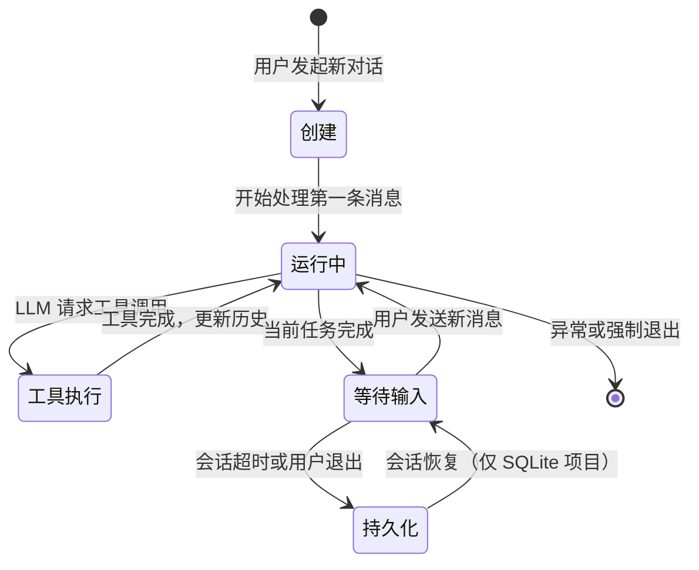
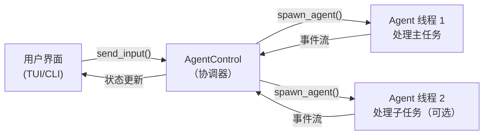
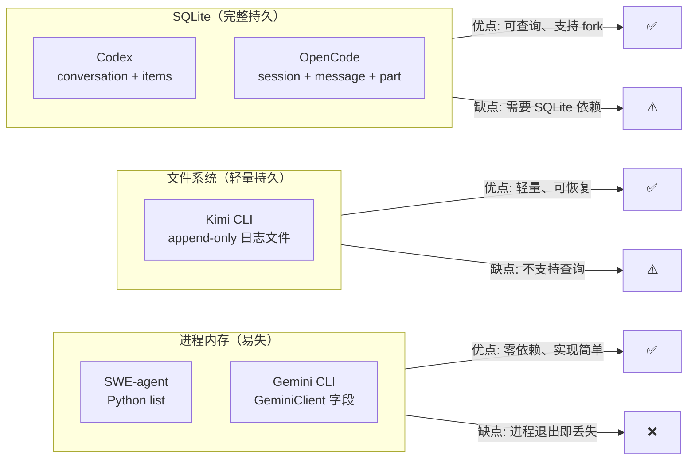

# Session 与运行时

## TL;DR

Session 是"一次对话"的容器，Runtime 是"执行这次对话"的引擎。两者的设计选择（持久化 vs 内存、Actor 模型 vs 协程）决定了 Agent 能否支持会话恢复、并发工具执行和多 Agent 协作。

---

## 1. 概念区分



**类比：** Session 是"游戏存档"，Runtime 是"游戏引擎"。存档记录当前进度（对话历史、配置），引擎负责运行游戏（执行 loop、调度工具）。

---

## 2. Session 生命周期



---

## 3. 各项目的 Session 实现

### OpenCode：三层数据模型（最细粒度）

OpenCode 用 SQLite 存储三层结构（`opencode/packages/opencode/src/session/session.sql.ts`）：

```
Session                     // 会话级
├── id, title
├── time_created, time_updated
└── Messages[]              // 消息级
    ├── id, sessionID
    ├── role (user/assistant)
    ├── finish (stop/tool-calls/length)
    └── Parts[]             // 内容片段级（最细）
        ├── text part       // 文字内容
        ├── tool part       // 工具调用/结果
        └── reasoning part  // 推理过程
```

**为什么要有 Part 层？**  
因为一条助手消息可能包含：先说一段话 → 调用工具 → 等待结果 → 继续说话。Parts 允许对消息内部进行细粒度的状态管理（如标记某个工具调用正在运行中 `status: "running"`）。

**会话恢复**（`session/index.ts:212`）：`Session.create()` 时可以指定 `fork` 参数，基于已有 session 创建分支会话，保留历史但允许走不同路径。

---

### Codex：SQLite + Actor 模型（并发安全）

Codex 的运行时基于 Rust tokio，采用 Actor 模型：



**关键文件**：
- `codex-rs/core/src/agent/control.rs:55`：`spawn_agent()` 创建独立 agent 线程
- `codex-rs/core/src/agent/control.rs:172`：`send_input()` 向 agent 发消息
- `codex-rs/core/src/agent/control.rs:195`：`interrupt_agent()` 随时中断

**优势**：Rust 类型系统保证线程安全，`interrupt_agent()` 可以在任何时刻发送中断信号，Agent 线程会安全退出。

---

### Gemini CLI：`GeminiClient` 管理会话状态

Gemini CLI 将 Session 状态内嵌在 `GeminiClient` 对象中（`gemini-cli/packages/core/src/core/client.ts:80`）：

```typescript
class GeminiClient {
    private sessionTurnCount: number     // 当前 session 已执行轮次
    private maxSessionTurns: number      // 最大轮次限制
    private currentSequenceModel: Model  // 当前使用的模型
    private loopDetector: LoopDetector   // 循环检测状态
    private chatHistory: Content[]       // 对话历史（内存存储）
}
```

这是**无持久化**设计：进程退出后历史丢失。`sessionTurnCount` 用于防止同一 session 执行过多轮次（对话越长越贵）。

---

### Kimi CLI：文件 + 内存双层存储

Kimi CLI 的 `Context` 类（`src/kimi_cli/soul/context.py:16`）使用 append-only 文件日志作为持久化层：

```python
class Context:
    def __init__(self, file_backend: Path):
        self._history: list[Message] = []  # 内存缓存
        self._token_count: int = 0
        self._next_checkpoint_id: int = 0

    async def restore(self) -> bool:       # 从文件重建历史（行号: 24）
        # 读取文件，逐行解析，重建内存状态
```

**优势**：进程崩溃后可以通过 `restore()` 恢复历史；不需要 SQLite 依赖，部署更简单。  
**劣势**：文件 append-only，无法高效查询历史记录；checkpoint 状态也存在文件中，重建时需要全量扫描。

---

### SWE-agent：最简单 —— Python list

SWE-agent 的"Session"就是一个 Python list：

```python
# sweagent/agent/agents.py:390
class DefaultAgent:
    def run(self, ...):
        self.history = []  # 重置历史
        # ... 追加消息
```

**设计意图：** 学术场景下，每次运行都是独立任务（修复一个 GitHub Issue），不需要跨任务恢复会话。简单 list 的好处是完全透明，便于调试和分析执行轨迹（trajectory）。

---

## 4. 持久化方案对比



---

## 5. 运行时并发模型对比

| 项目 | 异步运行时 | 并发模型 | 工具并发执行 |
|------|-----------|----------|------------|
| SWE-agent | Python threading/asyncio | 协程 | 否 |
| Codex | tokio（Rust 异步） | Actor + channel | 是（读写分离） |
| Gemini CLI | Node.js 事件循环 | Promise + Generator | 是（Scheduler） |
| Kimi CLI | Python asyncio | 协程 | 是（asyncio.gather）|
| OpenCode | Bun（Node 兼容） | Promise | 是 |

---

## 6. 关键代码索引

| 项目 | 文件 | 行号 | 说明 |
|------|------|------|------|
| SWE-agent | `sweagent/agent/agents.py` | 390 | `run()` —— history 初始化 |
| Kimi CLI | `src/kimi_cli/soul/context.py` | 16 | `Context` 类定义 |
| Kimi CLI | `src/kimi_cli/soul/context.py` | 24 | `restore()` —— 从文件恢复 |
| Kimi CLI | `src/kimi_cli/soul/context.py` | 68 | `checkpoint()` —— 创建检查点 |
| Gemini CLI | `packages/core/src/core/client.ts` | 80 | `GeminiClient` —— Session 状态 |
| OpenCode | `packages/opencode/src/session/index.ts` | 32 | `Session` 命名空间 |
| OpenCode | `packages/opencode/src/session/index.ts` | 212 | `Session.create()` —— 创建/fork |
| OpenCode | `packages/opencode/src/session/session.sql.ts` | 50 | `PartTable` —— 三层 SQL 结构 |
| Codex | `codex-rs/core/src/agent/control.rs` | 55 | `spawn_agent()` —— 创建 Agent 线程 |
| Codex | `codex-rs/core/src/agent/control.rs` | 195 | `interrupt_agent()` —— 中断 |
