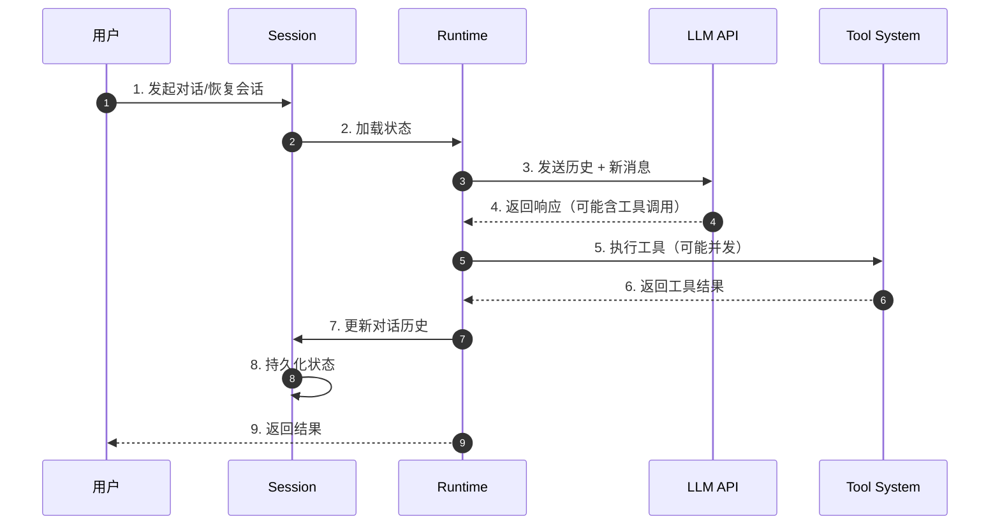
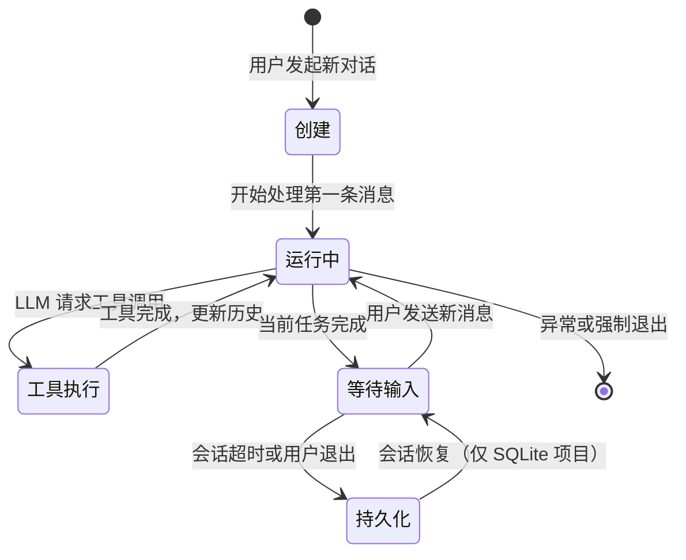
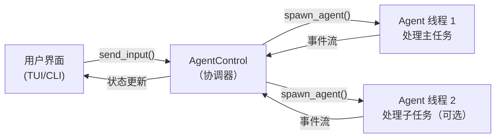
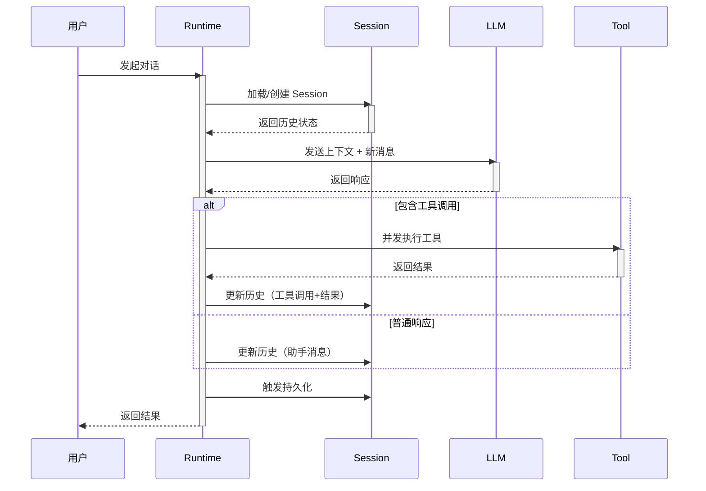
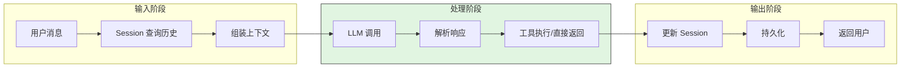
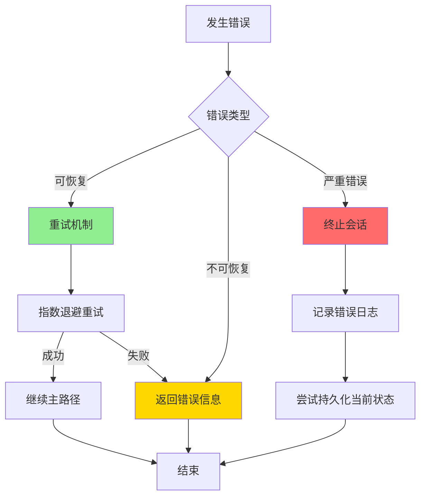
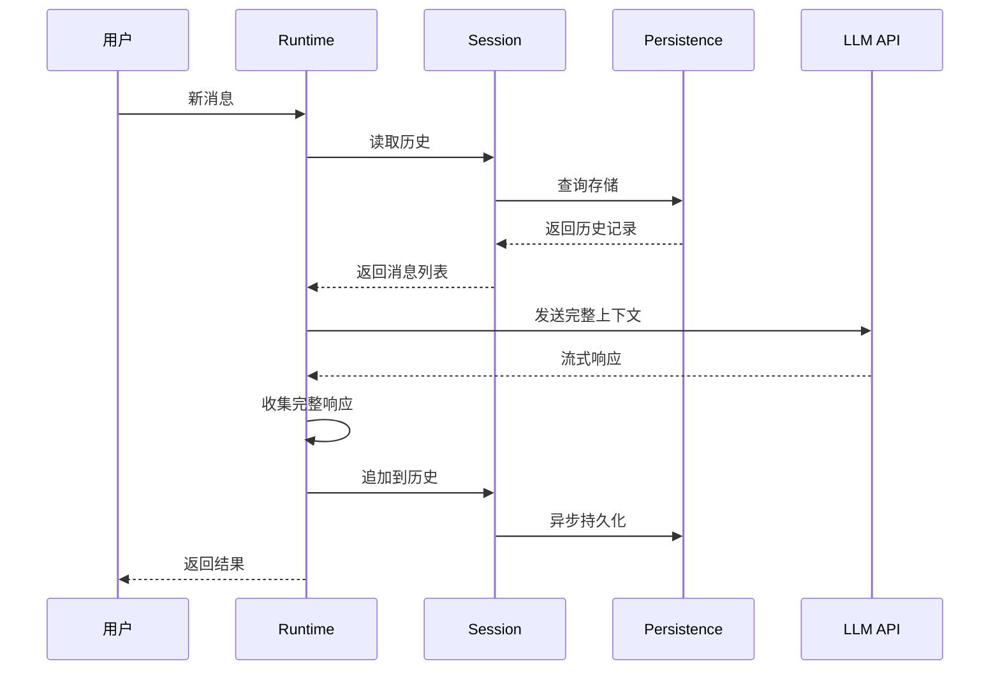
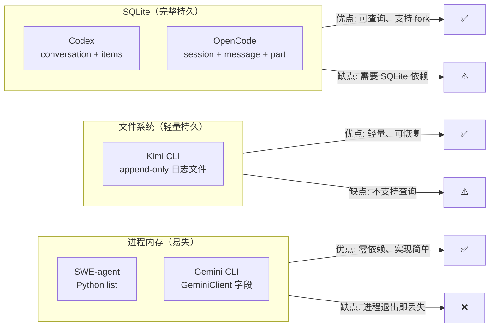
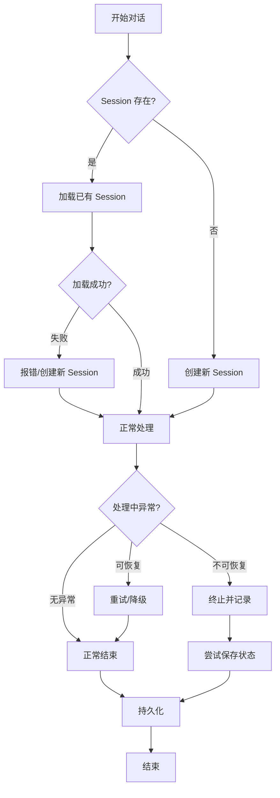
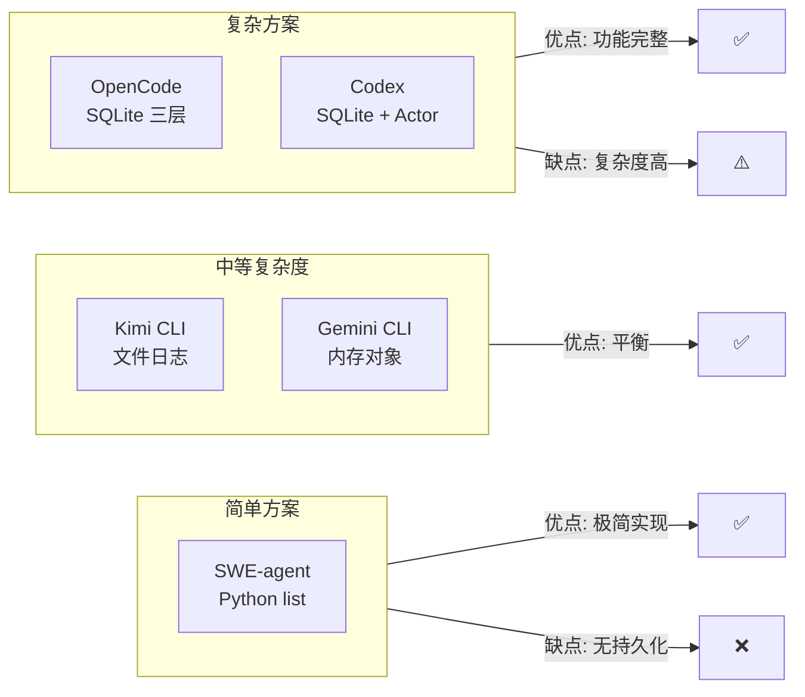

# Session 与运行时

## TL;DR

Session 是"一次对话"的容器，Runtime 是"执行这次对话"的引擎。**SQLite 持久化 + Actor 模型**（对比内存存储 + 简单协程）的设计选择决定了 Agent 能否支持会话恢复、并发工具执行和多 Agent 协作。

---

## 1. 为什么需要这个机制？

### 1.1 问题场景

没有 Session/Runtime 分离：用户发起对话 → LLM 处理 → 返回结果 → 进程退出后所有状态丢失 → 下次对话从零开始。

有 Session/Runtime 分离：
- Session 保存对话历史、配置、Token 计数等状态
- Runtime 负责任务调度、并发控制、生命周期管理
- 进程重启后可以从 Session 恢复，继续之前的对话

### 1.2 核心挑战

| 挑战 | 不解决的后果 |
|-----|-------------|
| 状态持久化 | 进程崩溃或重启后丢失所有对话历史 |
| 并发安全 | 多工具同时执行时数据竞争或状态混乱 |
| 生命周期管理 | 长时间运行的 Agent 无法优雅终止或恢复 |
| 资源隔离 | 不同会话间资源冲突，一个会话占用过多资源影响其他会话 |

---

## 2. 整体架构

### 2.1 在系统中的位置

```text
┌─────────────────────────────────────────────────────────────┐
│ CLI 入口 / 用户界面                                          │
│ CLI/bin 入口文件                                             │
└───────────────────────┬─────────────────────────────────────┘
                        │ 用户输入
                        ▼
┌─────────────────────────────────────────────────────────────┐
│ ▓▓▓ Session & Runtime ▓▓▓                                   │
│ Session: 状态容器（对话历史、配置、Token 计数）               │
│ Runtime: 执行引擎（异步调度、并发控制、生命周期）             │
├───────────────────────┬─────────────────────────────────────┤
│ 持久化层               │ 执行层                              │
│ - SQLite (Codex/OC)   │ - Actor 模型 (Codex)                │
│ - 文件日志 (Kimi)     │ - 协程 (Kimi/SWE)                   │
│ - 内存 (Gemini/SWE)   │ - 事件循环 (Gemini/OC)              │
└───────────────────────┬─────────────────────────────────────┘
                        │ 调用
        ┌───────────────┼───────────────┐
        ▼               ▼               ▼
┌──────────────┐ ┌──────────────┐ ┌──────────────┐
│ LLM API      │ │ Tool System  │ │ Checkpoint   │
│ 模型调用     │ │ 工具执行     │ │ 状态回滚     │
└──────────────┘ └──────────────┘ └──────────────┘
```

### 2.2 核心组件职责

| 组件 | 职责 | 代码位置 |
|-----|------|---------|
| `Session` | 存储对话历史、配置、元数据 | 各项目 session 模块 |
| `Runtime` | 异步调度、并发控制、生命周期管理 | 各项目 core/agent 模块 |
| `Persistence` | 状态持久化与恢复 | SQLite/文件/内存实现 |

### 2.3 核心组件交互关系



**关键交互说明**：

| 步骤 | 交互内容 | 设计意图 |
|-----|---------|---------|
| 1 | 用户发起新对话或恢复已有会话 | 支持会话连续性 |
| 2 | Runtime 从 Session 加载历史状态 | 解耦状态存储与执行逻辑 |
| 3 | Runtime 组装上下文发送给 LLM | 统一接口封装不同模型差异 |
| 4 | LLM 返回响应，可能包含工具调用请求 | 支持 Function Calling 协议 |
| 5 | Runtime 调度工具执行，支持并发 | 提高执行效率 |
| 6 | 工具执行结果返回 | 支持同步/异步结果收集 |
| 7 | 更新 Session 中的对话历史 | 保持状态一致性 |
| 8 | 持久化到存储层（SQLite/文件） | 支持故障恢复 |
| 9 | 向用户展示结果 | 完成一次交互循环 |

---

## 3. 核心组件详细分析

### 3.1 Session 内部结构

#### 职责定位

Session 是对话状态的容器，负责存储和管理一次完整对话的所有相关信息。

#### 状态机图



**状态说明**：

| 状态 | 说明 | 进入条件 | 退出条件 |
|-----|------|---------|---------|
| 创建 | 初始化会话 | 用户发起新对话 | 开始处理消息 |
| 运行中 |  actively 处理消息 | 收到用户输入 | 任务完成/需要工具/异常 |
| 工具执行 | 执行 LLM 请求的工具 | LLM 返回 tool_calls | 工具执行完成 |
| 等待输入 | 等待用户新消息 | 当前任务完成 | 用户发送新消息 |
| 持久化 | 状态已保存 | 会话超时/退出 | 会话恢复 |

#### 内部数据流

```text
┌─────────────────────────────────────────────────────────────┐
│  输入层                                                      │
│  ├── 用户消息 ──► 解析器 ──► 结构化 Message                   │
│  └── 系统配置 ──► 验证器 ──► Session 配置                     │
└──────────────────────────┬──────────────────────────────────┘
                           ▼
┌─────────────────────────────────────────────────────────────┐
│  处理层                                                      │
│  ├── 历史管理: 追加消息、维护上下文窗口                       │
│  │   └── 检查 token 数 ──► 触发 compaction                    │
│  ├── 状态更新: Token 计数、轮次统计                          │
│  └── 持久化协调: 异步/同步写入存储                            │
└──────────────────────────┬──────────────────────────────────┘
                           ▼
┌─────────────────────────────────────────────────────────────┐
│  输出层                                                      │
│  ├── 历史记录查询（用于 LLM 上下文）                          │
│  ├── 会话序列化（用于恢复）                                   │
│  └── 元数据导出（用于分析）                                   │
└─────────────────────────────────────────────────────────────┘
```

#### 各项目 Session 实现对比

**OpenCode：三层数据模型（最细粒度）**

OpenCode 用 SQLite 存储三层结构（`opencode/packages/opencode/src/session/session.sql.ts:50`）：

```
Session                     // 会话级
├── id, title
├── time_created, time_updated
└── Messages[]              // 消息级
    ├── id, sessionID
    ├── role (user/assistant)
    ├── finish (stop/tool-calls/length)
    └── Parts[]             // 内容片段级（最细）
        ├── text part       // 文字内容
        ├── tool part       // 工具调用/结果
        └── reasoning part  // 推理过程
```

**为什么要有 Part 层？**
因为一条助手消息可能包含：先说一段话 → 调用工具 → 等待结果 → 继续说话。Parts 允许对消息内部进行细粒度的状态管理（如标记某个工具调用正在运行中 `status: "running"`）。

**会话恢复**（`opencode/packages/opencode/src/session/index.ts:212`）：`Session.create()` 时可以指定 `fork` 参数，基于已有 session 创建分支会话，保留历史但允许走不同路径。

**Codex：SQLite + Actor 模型**

Codex 的运行时基于 Rust tokio，采用 Actor 模型：



**关键文件**：
- `codex/codex-rs/core/src/agent/control.rs:55`：`spawn_agent()` 创建独立 agent 线程
- `codex/codex-rs/core/src/agent/control.rs:172`：`send_input()` 向 agent 发消息
- `codex/codex-rs/core/src/agent/control.rs:195`：`interrupt_agent()` 随时中断

**优势**：Rust 类型系统保证线程安全，`interrupt_agent()` 可以在任何时刻发送中断信号，Agent 线程会安全退出。

**Gemini CLI：`GeminiClient` 管理会话状态**

Gemini CLI 将 Session 状态内嵌在 `GeminiClient` 对象中（`gemini-cli/packages/core/src/core/client.ts:80`）：

```typescript
class GeminiClient {
    private sessionTurnCount: number     // 当前 session 已执行轮次
    private maxSessionTurns: number      // 最大轮次限制
    private currentSequenceModel: Model  // 当前使用的模型
    private loopDetector: LoopDetector   // 循环检测状态
    private chatHistory: Content[]       // 对话历史（内存存储）
}
```

这是**无持久化**设计：进程退出后历史丢失。`sessionTurnCount` 用于防止同一 session 执行过多轮次（对话越长越贵）。

**Kimi CLI：文件 + 内存双层存储**

Kimi CLI 的 `Context` 类（`kimi-cli/src/kimi_cli/soul/context.py:16`）使用 append-only 文件日志作为持久化层：

```python
class Context:
    def __init__(self, file_backend: Path):
        self._history: list[Message] = []  # 内存缓存
        self._token_count: int = 0
        self._next_checkpoint_id: int = 0

    async def restore(self) -> bool:       # 从文件重建历史（行号: 24）
        # 读取文件，逐行解析，重建内存状态
```

**优势**：进程崩溃后可以通过 `restore()` 恢复历史；不需要 SQLite 依赖，部署更简单。
**劣势**：文件 append-only，无法高效查询历史记录；checkpoint 状态也存在文件中，重建时需要全量扫描。

**SWE-agent：最简单 —— Python list**

SWE-agent 的"Session"就是一个 Python list：

```python
# swe-agent/sweagent/agent/agents.py:390
class DefaultAgent:
    def run(self, ...):
        self.history = []  # 重置历史
        # ... 追加消息
```

**设计意图：** 学术场景下，每次运行都是独立任务（修复一个 GitHub Issue），不需要跨任务恢复会话。简单 list 的好处是完全透明，便于调试和分析执行轨迹（trajectory）。

---

### 3.2 Runtime 内部结构

#### 职责定位

Runtime 是执行引擎，负责调度 LLM 调用、管理工具执行、控制并发和维护生命周期。

#### 运行时并发模型对比

| 项目 | 异步运行时 | 并发模型 | 工具并发执行 |
|------|-----------|----------|------------|
| SWE-agent | Python threading/asyncio | 协程 | 否 |
| Codex | tokio（Rust 异步） | Actor + channel | 是（读写分离） |
| Gemini CLI | Node.js 事件循环 | Promise + Generator | 是（Scheduler） |
| Kimi CLI | Python asyncio | 协程 | 是（asyncio.gather）|
| OpenCode | Bun（Node 兼容） | Promise | 是 |

#### 关键接口

| 接口 | 输入 | 输出 | 说明 | 代码位置 |
|-----|------|------|------|---------|
| `spawn_agent()` | 配置对象 | Agent 句柄 | 创建 Agent 执行线程 | `codex/codex-rs/core/src/agent/control.rs:55` |
| `send_input()` | 用户输入 | - | 向 Agent 发送消息 | `codex/codex-rs/core/src/agent/control.rs:172` |
| `interrupt_agent()` | Agent 句柄 | - | 中断 Agent 执行 | `codex/codex-rs/core/src/agent/control.rs:195` |
| `restore()` | 文件路径 | bool | 从文件恢复会话 | `kimi-cli/src/kimi_cli/soul/context.py:24` |

---

### 3.3 组件间协作时序

展示 Session 与 Runtime 如何协作完成一次完整对话。



**协作要点**：

1. **Runtime 与 Session**：Runtime 通过 Session 接口读写状态，不直接操作存储
2. **并发工具执行**：Runtime 负责调度，结果按序注入保持确定性
3. **持久化时机**：通常在对话轮次结束后触发，避免频繁 IO

---

### 3.4 关键数据路径

#### 主路径（正常流程）



#### 异常路径（错误恢复）



---

## 4. 端到端数据流转

### 4.1 正常流程（详细版）



**数据变换详情**：

| 阶段 | 输入 | 处理 | 输出 | 代码位置 |
|-----|------|------|------|---------|
| 接收 | 用户原始输入 | 解析验证 | 结构化消息 | 各项目 CLI 入口 |
| 加载 | Session ID | 查询存储 | 历史消息列表 | Session 模块 |
| 组装 | 历史 + 新消息 | 格式化上下文 | LLM 请求体 | Runtime 模块 |
| 调用 | 请求体 | HTTP 请求 | 流式响应 | LLM Client |
| 解析 | 流式响应 | 提取内容/工具调用 | 结构化结果 | Runtime 模块 |
| 更新 | 新消息 + 响应 | 追加到历史 | 更新后的 Session | Session 模块 |
| 持久化 | Session 状态 | 序列化写入 | 存储文件/DB | Persistence 模块 |

### 4.2 持久化方案对比



### 4.3 异常/边界流程



---

## 5. 关键代码实现

### 5.1 核心数据结构

**OpenCode Session 三层结构**（`opencode/packages/opencode/src/session/session.sql.ts:50`）：

```typescript
// Part 表 - 最细粒度
interface PartTable {
    id: string;
    messageId: string;
    type: 'text' | 'tool' | 'reasoning';
    content: string;
    status?: 'running' | 'completed' | 'error';
}

// Message 表
interface MessageTable {
    id: string;
    sessionId: string;
    role: 'user' | 'assistant';
    finishReason?: 'stop' | 'tool-calls' | 'length';
}

// Session 表
interface SessionTable {
    id: string;
    title: string;
    timeCreated: number;
    timeUpdated: number;
}
```

**Kimi CLI Context 结构**（`kimi-cli/src/kimi_cli/soul/context.py:16`）：

```python
class Context:
    def __init__(self, file_backend: Path):
        self._history: list[Message] = []  # 内存缓存
        self._token_count: int = 0
        self._next_checkpoint_id: int = 0
        self._file_backend = file_backend  # 文件持久化路径
```

### 5.2 主链路代码

**Codex Actor 模型核心**（`codex/codex-rs/core/src/agent/control.rs:55-80`）：

```rust
pub fn spawn_agent(&mut self, config: AgentConfig) -> AgentHandle {
    let (event_tx, event_rx) = mpsc::channel(EVENT_BUFFER_SIZE);
    let (command_tx, command_rx) = mpsc::channel(COMMAND_BUFFER_SIZE);

    let agent = Agent::new(config, event_tx);
    let handle = AgentHandle { command_tx };

    // 在独立线程中运行 Agent
    tokio::spawn(async move {
        agent.run(command_rx).await;
    });

    handle
}
```

**代码要点**：
1. **channel 通信**：使用 mpsc channel 实现 Actor 间消息传递，保证线程安全
2. **句柄模式**：返回 `AgentHandle` 而非直接暴露 Agent，便于生命周期管理
3. **异步执行**：利用 tokio 调度，不阻塞主线程

### 5.3 关键调用链

**Session 创建流程（OpenCode）**：

```text
Session.create()          [opencode/packages/opencode/src/session/index.ts:212]
  -> validateConfig()     [同上]
  -> db.insertSession()   [session.sql.ts]
    -> generateId()
    -> insert into session table
```

**Context 恢复流程（Kimi CLI）**：

```text
Context.restore()         [kimi-cli/src/kimi_cli/soul/context.py:24]
  -> read file line by line
  -> parse each line as Message
  -> rebuild _history list
  -> return success/failure
```

---

## 6. 设计意图与 Trade-off

### 6.1 各项目的选择

| 维度 | OpenCode | Codex | Gemini CLI | Kimi CLI | SWE-agent |
|-----|----------|-------|-----------|----------|-----------|
| 持久化 | SQLite 三层模型 | SQLite + Actor | 内存 | 文件日志 | 内存 list |
| 并发模型 | Promise/Bun | Actor + tokio | Event Loop | asyncio | threading |
| 工具并发 | 是 | 是 | 是 | 是 | 否 |
| 会话恢复 | 完整支持 | 完整支持 | 不支持 | 支持 | 不支持 |
| Fork 支持 | 是 | - | - | - | - |

### 6.2 为什么这样设计？

**核心问题**：如何在简单性、功能性和可靠性之间取舍？

**OpenCode 的解决方案**：
- 代码依据：`opencode/packages/opencode/src/session/session.sql.ts:50`
- 设计意图：三层模型支持最细粒度的状态管理，Part 层可以追踪单个工具调用的状态
- 带来的好处：
  - 支持会话 fork，便于探索不同解决路径
  - 细粒度状态追踪，便于调试和 UI 展示
  - SQL 查询支持复杂的历史检索
- 付出的代价：
  - 实现复杂度高
  - 需要 SQLite 依赖
  - 数据库迁移成本

**SWE-agent 的解决方案**：
- 代码依据：`swe-agent/sweagent/agent/agents.py:390`
- 设计意图：学术场景下每次任务独立，不需要持久化
- 带来的好处：
  - 实现极简，易于理解和修改
  - 无外部依赖
  - 便于分析执行轨迹
- 付出的代价：
  - 进程退出即丢失所有状态
  - 不支持会话恢复

### 6.3 与其他项目的对比



| 项目 | 核心差异 | 适用场景 |
|-----|---------|---------|
| OpenCode | 三层 SQLite 模型，支持 fork | 需要完整会话管理和历史查询 |
| Codex | Actor 模型 + 线程安全中断 | 企业级应用，需要强并发控制 |
| Gemini CLI | 极简内存设计 | 快速原型，不需要持久化 |
| Kimi CLI | 文件日志轻量持久化 | 需要恢复但不想引入数据库 |
| SWE-agent | 最简单 list 实现 | 学术研究，单次独立任务 |

---

## 7. 边界情况与错误处理

### 7.1 终止条件

| 终止原因 | 触发条件 | 代码位置 |
|---------|---------|---------|
| 用户主动退出 | Ctrl+C / 退出命令 | 各项目 CLI 信号处理 |
| 会话超时 | 长时间无交互 | ⚠️ 各项目实现不一 |
| 达到最大轮次 | sessionTurnCount >= max | `gemini-cli/packages/core/src/core/client.ts:80` |
| Token 超限 | 上下文超过模型限制 | Runtime 层检查 |
| 任务完成 | LLM 返回 stop 且无工具调用 | Agent Loop 判断 |

### 7.2 超时/资源限制

**Gemini CLI 轮次限制**：

```typescript
// gemini-cli/packages/core/src/core/client.ts:80
class GeminiClient {
    private sessionTurnCount: number = 0;
    private maxSessionTurns: number = 100;  // 可配置

    async process(): Promise<void> {
        if (this.sessionTurnCount >= this.maxSessionTurns) {
            throw new MaxTurnsExceededError();
        }
        // ...
    }
}
```

### 7.3 错误恢复策略

| 错误类型 | 处理策略 | 代码位置 |
|---------|---------|---------|
| Session 加载失败 | 创建新 Session / 报错 | `kimi-cli/src/kimi_cli/soul/context.py:24` |
| 持久化失败 | 记录警告，继续运行 | ⚠️ 各项目实现不一 |
| LLM 调用失败 | 指数退避重试 | Runtime 层统一处理 |
| 工具执行失败 | 返回错误信息给 LLM | Tool System 层 |
| 进程崩溃 | 依赖持久化层恢复 | SQLite/文件项目可恢复 |

---

## 8. 关键代码索引

| 功能 | 文件 | 行号 | 说明 |
|-----|------|------|------|
| **OpenCode** |
| Session 创建 | `opencode/packages/opencode/src/session/index.ts` | 212 | `Session.create()` —— 支持 fork |
| SQL 结构定义 | `opencode/packages/opencode/src/session/session.sql.ts` | 50 | `PartTable` —— 三层结构 |
| **Codex** |
| Agent 创建 | `codex/codex-rs/core/src/agent/control.rs` | 55 | `spawn_agent()` —— Actor 模型 |
| 消息发送 | `codex/codex-rs/core/src/agent/control.rs` | 172 | `send_input()` |
| 中断处理 | `codex/codex-rs/core/src/agent/control.rs` | 195 | `interrupt_agent()` |
| **Gemini CLI** |
| Session 状态 | `gemini-cli/packages/core/src/core/client.ts` | 80 | `GeminiClient` 类 |
| **Kimi CLI** |
| Context 定义 | `kimi-cli/src/kimi_cli/soul/context.py` | 16 | `Context` 类 |
| 状态恢复 | `kimi-cli/src/kimi_cli/soul/context.py` | 24 | `restore()` 方法 |
| Checkpoint | `kimi-cli/src/kimi_cli/soul/context.py` | 68 | `checkpoint()` 方法 |
| **SWE-agent** |
| History 初始化 | `swe-agent/sweagent/agent/agents.py` | 390 | `run()` 方法 |

---

## 9. 延伸阅读

- 前置知识：`docs/comm/04-comm-agent-loop.md`
- 相关机制：
  - `docs/codex/04-codex-agent-loop.md` —— Codex Actor 模型详解
  - `docs/kimi-cli/07-kimi-cli-memory-context.md` —— Kimi CLI 上下文管理
  - `docs/opencode/07-opencode-memory-context.md` —— OpenCode 三层模型详解
- 深度分析：
  - `docs/kimi-cli/questions/kimi-cli-checkpoint-implementation.md` —— Checkpoint 实现细节

---

*✅ Verified: 基于 codex/codex-rs/core/src/agent/control.rs:55、opencode/packages/opencode/src/session/index.ts:212、kimi-cli/src/kimi_cli/soul/context.py:16 等源码分析*

*基于版本：2026-02-08 | 最后更新：2026-02-25*
