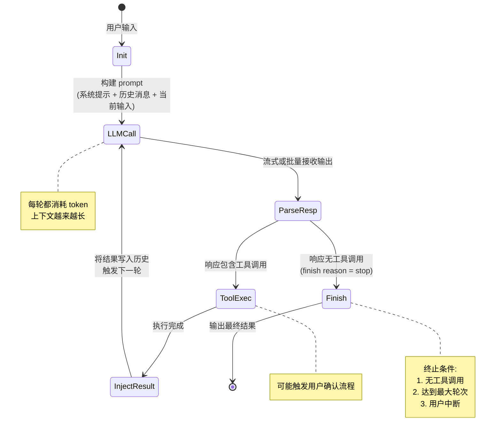
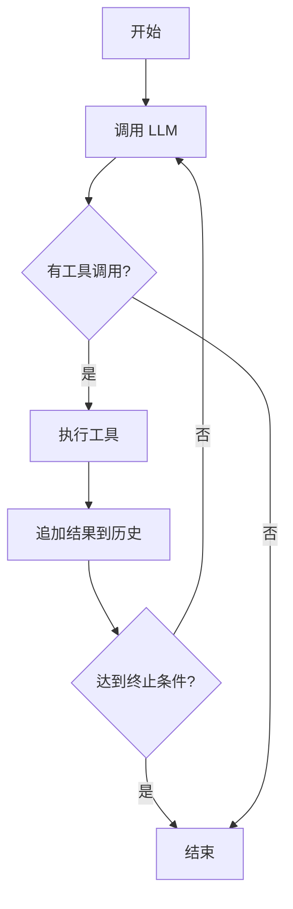
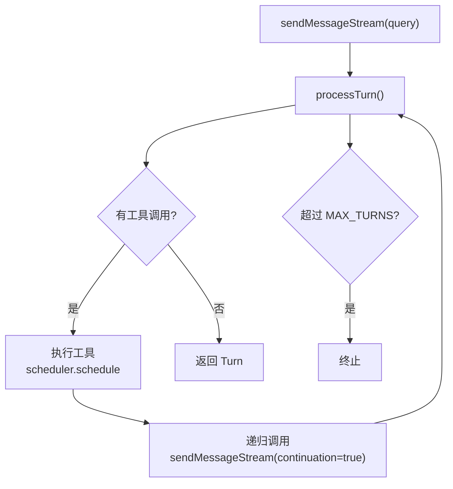
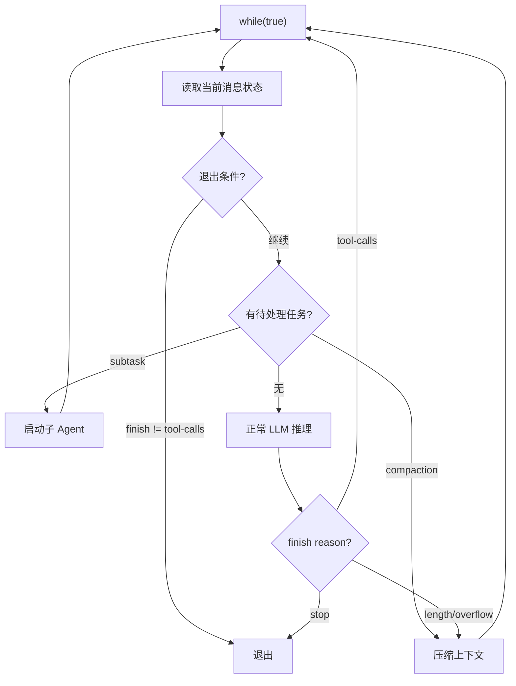
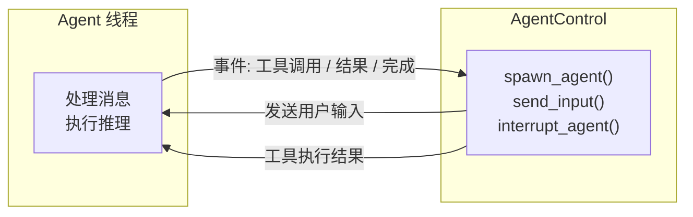

# Agent Loop 机制

## TL;DR

Agent Loop 是 Code Agent 的控制核心：它让 LLM 从"一次性回答"变成"多步执行"。本质是一个带工具调用的 while 循环，区别在于各项目选择不同的循环驱动方式来应对并发、错误恢复、上下文溢出等工程挑战。

---

## 1. 为什么需要循环？

**假设没有循环：**

```
用户："帮我修复这个 bug"
→ LLM 一次回答 → 输出一段代码 → 结束
```

问题在于：LLM **不知道文件内容**，**不知道测试是否通过**，**不知道修改是否引入新问题**。它只能"猜"。

**有了循环：**

```
用户："帮我修复这个 bug"
→ LLM: "先读一下文件" → 读文件 → 得到结果
→ LLM: "再跑一下测试" → 执行测试 → 得到结果
→ LLM: "测试失败，修改第 42 行" → 写文件 → 成功
→ LLM: "再跑测试确认" → 执行测试 → 通过
→ LLM: "完成" → 结束
```

循环让 LLM 能够**观察 → 计划 → 行动**，处理任意复杂的多步任务。

---

## 2. Loop 的通用生命周期

所有项目的 Agent Loop 都包含这几个阶段：



---

## 3. 五种 Loop 驱动方式

各项目选择了不同的循环结构，每种都有独特的工程考量：

### 方式 1：命令式 while 循环（SWE-agent / Kimi CLI）

**最直观的实现**，和普通程序逻辑一致。



**SWE-agent 实现**（`sweagent/agent/agents.py:390`）：
- `run()` 方法驱动外层循环（一次对话）
- `step()` 方法执行单步（`agents.py:328`）
- 终止条件：执行 `submit` 命令 或 超出成本上限（`agents.py:336`）

**Kimi CLI 实现**（`kimi-cli/packages/kosong/src/kosong/__main__.py:51`）：
```python
while True:                              # 外层：等待用户输入
    while True:                          # 内层：执行 agent loop
        result = await kosong.step(...)
        tool_results = await result.tool_results()   # 等待工具执行完成
        history.append(assistant_message)            # 追加助手消息
        history.extend(tool_messages)                # 追加工具结果消息
        if not result.tool_calls:        # 无工具调用 = 结束
            break
```
两层 while：外层管对话，内层管单次任务执行。工具结果的等待与历史追加均在内层循环中完成，而非 `step()` 内部。

**工程取舍：** 简单清晰，易于调试；`step()` 在 LLM 流式输出时并发派发多个工具调用（存入 futures），但 `tool_results()` 会按顺序逐一 await，实质是并发触发、顺序收集。

---

### 方式 2：递归 continuation（Gemini CLI）

**用递归代替循环**，每次工具执行完毕后"重新发起"一次调用。



**关键代码**（`gemini-cli/packages/core/src/core/client.ts:550`）：
- `processTurn()` 执行单轮，发现工具调用后由 `sendMessageStream()` 递归继续
- `sessionTurnCount` 防止无限递归（超过 `maxSessionTurns` 时终止）
- `loopDetector.reset()` 检测重复模式（`client.ts:789`）

**工程取舍：** 每轮状态独立，易于理解调用链；但递归深度受限，且调试 stack trace 较深。上下文压缩（`tryCompressChat`）也在每轮入口处触发（`client.ts:578`），时机清晰。

---

### 方式 3：状态机 + 分支 loop（OpenCode）

**最复杂的结构**，支持多种任务类型（普通推理 / 子 Agent / 上下文压缩）。



**关键代码**（`opencode/packages/opencode/src/session/prompt.ts:294`）：
```typescript
while (true) {
    // 1. 检查退出条件（lastAssistant.finish 不是 "tool-calls"）
    if (lastAssistant?.finish && !["tool-calls","unknown"].includes(...)) break

    // 2. 根据任务类型分支（subtask / compaction / 正常推理）
    const tasks = msgs.filter(p => p.type === "compaction" || p.type === "subtask")
}
```

**工程取舍：** 高度灵活，可在循环内插入任意新任务类型；但状态复杂，需要从消息流中重建循环状态（每次循环都重新扫描消息列表）。

---

### 方式 4：Actor 消息驱动（Codex）

**Rust 的异步模型**，通过 channel 传递事件而不是直接调用。



**关键代码**（`codex/codex-rs/core/src/agent/control.rs:55`）：
- `spawn_agent()` 启动独立 agent 线程
- `send_input()` 向 agent 发送用户消息（`control.rs:172`）
- `interrupt_agent()` 随时中断（`control.rs:195`）

**工程取舍：** 真正的并发安全（Rust 类型系统保证），支持随时中断和多 agent 协作；但调试难度高，需要理解 channel 通信模式。

---

## 4. 核心工程取舍对比

| 维度 | SWE-agent / Kimi | Gemini CLI | OpenCode | Codex |
|------|-----------------|------------|----------|-------|
| **循环结构** | while 迭代 | 递归调用 | while + 分支 | Actor 消息 |
| **调试难度** | 低（线性执行） | 中（递归栈） | 高（状态扫描） | 高（channel） |
| **并发工具执行** | 并发派发、顺序收集 | 是（Scheduler） | 是 | 是（tokio） |
| **中途中断** | 需要标志位 | 困难 | AbortSignal | 天然支持 |
| **上下文溢出处理时机** | 每步前检查 | 每轮入口 | 循环内动态分支 | 模型层管理 |

---

## 5. 终止条件设计

终止条件是 Loop 设计中最容易被忽视但最重要的部分：

| 终止原因 | SWE-agent | Gemini CLI | OpenCode | Kimi CLI |
|----------|-----------|------------|----------|----------|
| **自然完成**（无工具调用） | `submit` 命令 | 无 tool_calls | `finish != "tool-calls"` | `result.tool_calls` 为空 |
| **最大轮次** | `cost_limit` 超额 | `maxSessionTurns` | `steps` 配置 | 外层用户 break |
| **用户中断** | Ctrl-C | AbortSignal | `abort.aborted` | Ctrl-C |
| **上下文溢出** | 无（依赖模型） | `ContextWindowWillOverflow` | `compaction` 任务 | `compact_context` |
| **循环检测** | 无 | `loopDetector` | 无 | 无 |

**设计启示：** Gemini CLI 的 `loopDetector`（`client.ts:789`）是额外的安全网 —— 当 LLM 陷入重复调用同一工具的死循环时，能主动终止。这是其他项目缺少的防御性设计。

---

## 6. 关键代码索引

| 项目 | 文件 | 行号 | 说明 |
|------|------|------|------|
| SWE-agent | `sweagent/agent/agents.py` | 390 | `run()` —— 主循环入口 |
| SWE-agent | `sweagent/agent/agents.py` | 328 | `step()` —— 单步执行 |
| Kimi CLI | `kimi-cli/packages/kosong/src/kosong/__main__.py` | 51 | `agent_loop()` —— 双层 while |
| Kimi CLI | `kimi-cli/packages/kosong/src/kosong/__init__.py` | 104 | `step()` —— 单次 LLM 调用 + 工具收集 |
| Gemini CLI | `gemini-cli/packages/core/src/core/client.ts` | 789 | `sendMessageStream()` —— 递归入口 |
| Gemini CLI | `gemini-cli/packages/core/src/core/client.ts` | 550 | `processTurn()` —— 单轮处理 |
| OpenCode | `opencode/packages/opencode/src/session/prompt.ts` | 274 | `loop()` —— 带分支的 while |
| OpenCode | `opencode/packages/opencode/src/session/prompt.ts` | 319 | 退出条件判断 |
| Codex | `codex/codex-rs/core/src/agent/control.rs` | 55 | `spawn_agent()` —— 创建 agent 线程 |
| Codex | `codex/codex-rs/core/src/agent/control.rs` | 172 | `send_input()` —— 发送用户消息 |
