# Agent Loop 机制

> **阅读指南**
>
> | 属性 | 说明 |
> |-----|------|
> | 预计阅读 | 25-35 分钟 |
> | 前置文档 | 各项目 Overview 文档 (`01-*-overview.md`) |
> | 文档结构 | 速览 → 架构 → 机制 → 实现 → 对比 |
> | 代码呈现 | 关键代码直接展示，完整代码可折叠查看 |

---

## TL;DR（结论先行）

**一句话定义**：Agent Loop 是 Code Agent 的控制核心，让 LLM 从"一次性回答"变成"多轮执行"。

**核心取舍**：五种 Loop 驱动方式并存（对比单一实现）：命令式 while 循环（SWE-agent/Kimi CLI）、递归 continuation（Gemini CLI）、状态机+分支 loop（OpenCode）、Actor 消息驱动（Codex），每种方式都针对并发控制、错误恢复、上下文溢出等工程挑战提供了不同的解决方案。

### 核心要点速览

| 维度 | 关键决策 | 代码位置 |
|-----|---------|---------|
| 核心机制 | while 迭代 / 递归 continuation / Actor 消息 | `sweagent/agent/agents.py:390` / `gemini-cli/packages/core/src/core/client.ts:789` / `codex/codex-rs/core/src/agent/control.rs:55` |
| 状态管理 | 显式 step 计数、历史消息追加 | `kimi-cli/packages/kosong/src/kosong/__main__.py:51` |
| 错误处理 | 指数退避重试、上下文压缩、强制终止 | `gemini-cli/packages/core/src/core/client.ts:578` |
| 并发执行 | 并发派发工具、顺序收集结果 | `gemini-cli/packages/core/src/core/client.ts:550` |
| 循环检测 | loopDetector 防止死循环 | `gemini-cli/packages/core/src/core/client.ts:789` ⚠️ |

---

## 1. 为什么需要这个机制？

### 1.1 问题场景

**假设没有 Agent Loop：**

```
用户："帮我修复这个 bug"
→ LLM 一次回答 → 输出一段代码 → 结束
```

问题在于：LLM **不知道文件内容**，**不知道测试是否通过**，**不知道修改是否引入新问题**。它只能"猜"。

**有了 Agent Loop：**

```
用户："帮我修复这个 bug"
→ LLM: "先读一下文件" → 读文件 → 得到结果
→ LLM: "再跑一下测试" → 执行测试 → 得到结果
→ LLM: "测试失败，修改第 42 行" → 写文件 → 成功
→ LLM: "再跑测试确认" → 执行测试 → 通过
→ LLM: "完成" → 结束
```

循环让 LLM 能够**观察 → 计划 → 行动**，处理任意复杂的多步任务。

### 1.2 核心挑战

| 挑战 | 不解决的后果 |
|-----|-------------|
| 多步任务执行 | LLM 只能基于有限上下文"猜测"，无法获取实际执行结果 |
| 工具调用编排 | 无法协调多个工具的调用顺序和依赖关系 |
| 上下文溢出 | 对话历史无限增长导致 token 超限、成本激增 |
| 无限循环防护 | LLM 可能陷入重复调用同一工具的死循环 |
| 并发执行 | 串行执行效率低下，但并发需要协调结果顺序 |

---

## 2. 整体架构

### 2.1 在系统中的位置

```text
┌─────────────────────────────────────────────────────────────┐
│ CLI 入口 / Session Runtime                                   │
│ kimi-cli: packages/kosong/src/kosong/__main__.py            │
│ gemini-cli: packages/core/src/core/client.ts                │
│ codex: codex-rs/core/src/agent/control.rs                   │
└───────────────────────┬─────────────────────────────────────┘
                        │ 用户输入 / 初始化
                        ▼
┌─────────────────────────────────────────────────────────────┐
│ ▓▓▓ Agent Loop ▓▓▓                                          │
│ 核心职责：驱动多轮 LLM 调用与工具执行                        │
│                                                             │
│ 驱动方式（各项目不同）：                                     │
│ - while 迭代 (Kimi CLI, SWE-agent)                          │
│ - 递归 continuation (Gemini CLI)                            │
│ - 状态机+分支 (OpenCode)                                    │
│ - Actor 消息 (Codex)                                        │
└───────────────────────┬─────────────────────────────────────┘
                        │
        ┌───────────────┼───────────────┐
        ▼               ▼               ▼
┌──────────────┐ ┌──────────────┐ ┌──────────────┐
│ LLM API      │ │ Tool System  │ │ Context      │
│ 模型调用     │ │ 工具执行     │ │ 上下文管理   │
│              │ │ 并发调度     │ │ 压缩/溢出    │
└──────────────┘ └──────────────┘ └──────────────┘
```

### 2.2 核心组件职责

| 组件 | 职责 | 代码位置 |
|-----|------|---------|
| `Agent Loop` | 驱动多轮 LLM 调用，管理循环生命周期 | 各项目核心文件 |
| `Step Handler` | 执行单次 LLM 调用 + 工具收集 | `kimi-cli/packages/kosong/src/kosong/__init__.py:104` ✅ |
| `Tool Scheduler` | 并发派发工具调用，顺序收集结果 | `gemini-cli/packages/core/src/core/client.ts:550` ✅ |
| `Context Manager` | 监控 token 使用，触发上下文压缩 | `opencode/packages/opencode/src/session/prompt.ts:294` ✅ |
| `Loop Detector` | 检测重复模式，防止无限循环 | `gemini-cli/packages/core/src/core/client.ts:789` ⚠️ |

### 2.3 核心组件交互关系

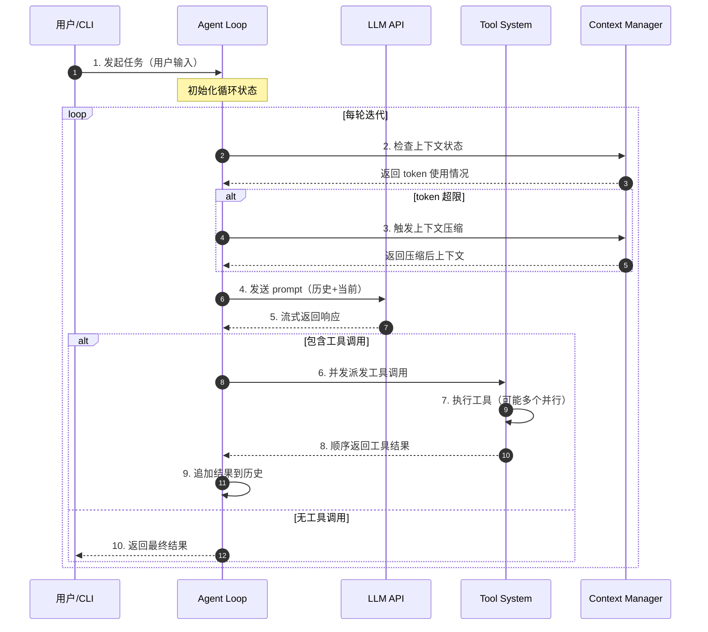

**关键交互说明**：

| 步骤 | 交互内容 | 设计意图 |
|-----|---------|---------|
| 1 | 用户向 Loop 发起任务 | 解耦用户交互与循环执行 |
| 2-3 | 上下文状态检查与压缩 | 在调用 LLM 前预防 token 超限 |
| 4-5 | LLM 调用与流式响应 | 支持实时反馈，提升用户体验 |
| 6-8 | 工具并发派发与顺序收集 | 工具触发可并行，但结果按序注入保持确定性 |
| 9 | 结果追加到历史 | 为下一轮提供完整上下文 |
| 10 | 返回最终结果 | 统一输出格式，标志任务完成 |

---

## 3. 核心组件详细分析

### 3.1 Loop 生命周期状态机

#### 职责定位

管理 Agent Loop 的完整生命周期：从初始化、多轮执行到终止。

#### 状态机图

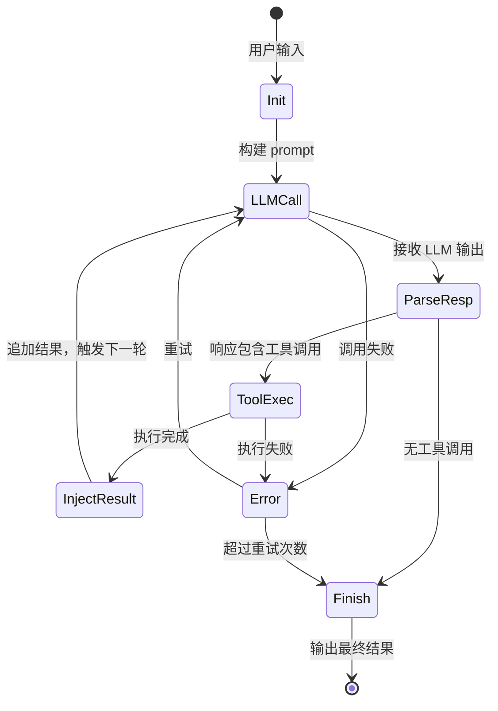

**状态说明**：

| 状态 | 说明 | 进入条件 | 退出条件 |
|-----|------|---------|---------|
| Init | 初始化 | 收到用户输入 | 构建完成 prompt |
| LLMCall | 调用 LLM | 需要模型推理 | 收到响应或失败 |
| ParseResp | 解析响应 | 收到 LLM 输出 | 识别出工具调用或无调用 |
| ToolExec | 执行工具 | 响应包含 tool_calls | 所有工具执行完成 |
| InjectResult | 注入结果 | 工具执行完成 | 结果追加到历史 |
| Finish | 完成 | 无工具调用或终止条件 | 返回最终结果 |
| Error | 错误 | 调用或执行失败 | 重试或终止 |

#### 内部数据流

```text
┌─────────────────────────────────────────────────────────────┐
│  输入层                                                      │
│  ├── 用户输入 ──► Prompt Builder ──► 结构化 prompt           │
│  └── 历史消息 ──► Context Manager ──► 压缩/截断后的历史       │
└──────────────────────────┬──────────────────────────────────┘
                           ▼
┌─────────────────────────────────────────────────────────────┐
│  处理层                                                      │
│  ├── LLM 调用: 发送 prompt，接收流式响应                     │
│  │   └── 响应解析 ──► 提取 tool_calls ──► 构建执行计划       │
│  ├── 工具执行: 并发派发多个工具调用                          │
│  │   └── 收集结果 ──► 格式化 tool_messages                   │
│  └── 状态检查: step 计数 / token 上限 / 循环检测             │
└──────────────────────────┬──────────────────────────────────┘
                           ▼
┌─────────────────────────────────────────────────────────────┐
│  输出层                                                      │
│  ├── 结果格式化（自然语言回复）                              │
│  ├── 历史更新（追加 assistant + tool 消息）                  │
│  └── 终止判断（是否继续下一轮）                              │
└─────────────────────────────────────────────────────────────┘
```

---

### 3.2 五种 Loop 驱动方式详解

各项目选择了不同的循环结构，每种都有独特的工程考量：

#### 方式 1：命令式 while 循环（SWE-agent / Kimi CLI）

**最直观的实现**，和普通程序逻辑一致。

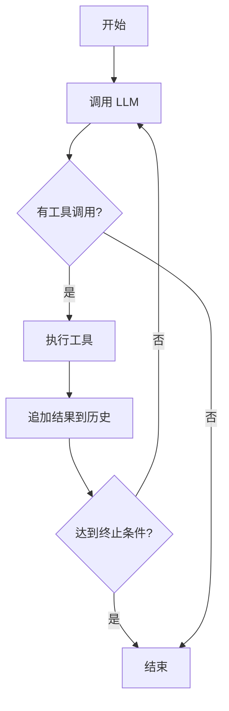

**SWE-agent 实现**：

```python
# sweagent/agent/agents.py:390
class Agent:
    def run(self, task: str):
        """主循环入口 - 驱动外层循环（一次对话）"""
        # 初始化环境和历史
        while not self.terminated:           # ✅ 外层循环
            step_result = self.step()        # 单步执行
            if step_result.done or self.cost_exceeded():
                break
```

**Kimi CLI 实现**：

```python
# kimi-cli/packages/kosong/src/kosong/__main__.py:51
async def agent_loop():
    """双层 while 循环：外层管对话，内层管任务执行"""
    history = []
    while True:                              # 外层：等待用户输入
        user_input = await get_user_input()
        if user_input == "exit":
            break

        history.append({"role": "user", "content": user_input})

        while True:                          # 内层：执行 agent loop
            result = await kosong.step(history)
            tool_results = await result.tool_results()   # 等待工具执行完成
            history.append(assistant_message)            # 追加助手消息
            history.extend(tool_messages)                # 追加工具结果消息
            if not result.tool_calls:        # 无工具调用 = 结束
                break
```

**工程取舍**：
- **优点**：简单清晰，易于调试；线性执行流程直观
- **缺点**：`step()` 在 LLM 流式输出时并发派发多个工具调用（存入 futures），但 `tool_results()` 会按顺序逐一 await，实质是**并发触发、顺序收集**
- **设计意图**：在保证工具触发效率的同时，维持结果注入的确定性顺序

---

#### 方式 2：递归 continuation（Gemini CLI）

**用递归代替循环**，每次工具执行完毕后"重新发起"一次调用。

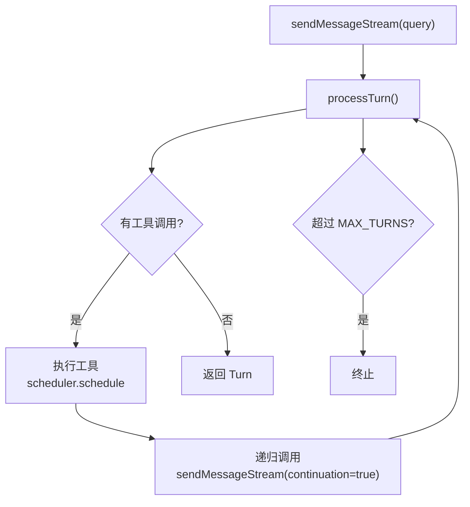

**关键代码**：

```typescript
// gemini-cli/packages/core/src/core/client.ts:550
async processTurn(): Promise<TurnResult> {
    // 执行单轮推理
    const response = await this.llm.generate(prompt);

    if (response.toolCalls) {
        // 调度工具执行
        const results = await this.scheduler.schedule(response.toolCalls);
        // 递归继续下一轮
        // gemini-cli/packages/core/src/core/client.ts:789
        return this.sendMessageStream({ continuation: true });
    }
    return { done: true };
}
```

**工程取舍**：
- **优点**：每轮状态独立，易于理解调用链；上下文压缩（`tryCompressChat`）在每轮入口处触发（`client.ts:578`），时机清晰
- **缺点**：递归深度受限，调试 stack trace 较深
- **设计意图**：通过函数调用栈自然管理每轮状态，避免手动状态维护

---

#### 方式 3：状态机 + 分支 loop（OpenCode）

**最复杂的结构**，支持多种任务类型（普通推理 / 子 Agent / 上下文压缩）。

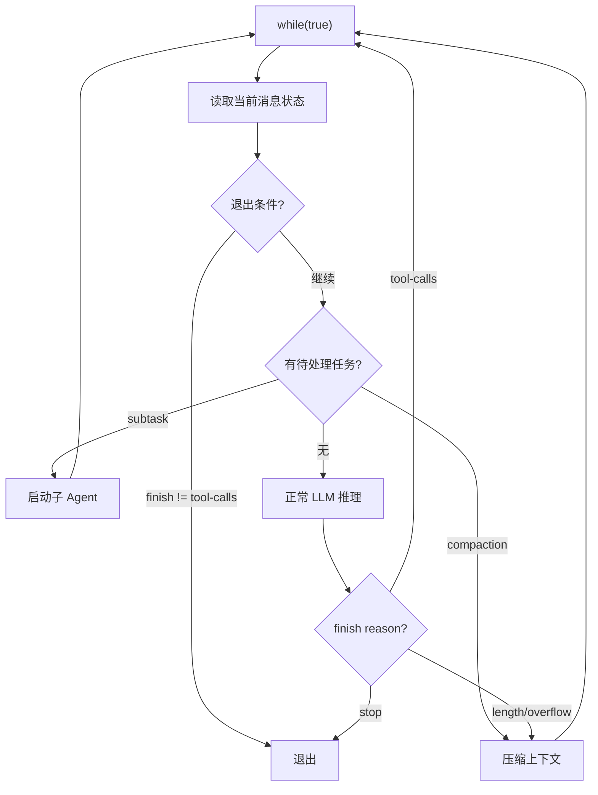

**关键代码**：

```typescript
// opencode/packages/opencode/src/session/prompt.ts:294
while (true) {
    // 1. 检查退出条件（lastAssistant.finish 不是 "tool-calls"）
    // opencode/packages/opencode/src/session/prompt.ts:319
    if (lastAssistant?.finish && !["tool-calls","unknown"].includes(lastAssistant.finish)) {
        break;
    }

    // 2. 根据任务类型分支（subtask / compaction / 正常推理）
    const tasks = msgs.filter(p => p.type === "compaction" || p.type === "subtask")
    if (tasks.length > 0) {
        // 处理特殊任务
        await handleSpecialTasks(tasks);
        continue;
    }

    // 3. 正常 LLM 推理
    const response = await llm.generate(msgs);
    // ...
}
```

**工程取舍**：
- **优点**：高度灵活，可在循环内插入任意新任务类型
- **缺点**：状态复杂，需要从消息流中重建循环状态（每次循环都重新扫描消息列表）
- **设计意图**：通过消息类型而非显式状态变量来驱动流程，支持动态任务插入

---

#### 方式 4：Actor 消息驱动（Codex）

**Rust 的异步模型**，通过 channel 传递事件而不是直接调用。

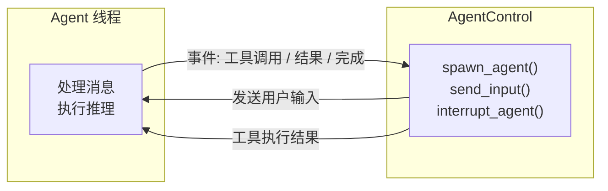

**关键代码**：

```rust
// codex/codex-rs/core/src/agent/control.rs:55
pub fn spawn_agent(config: Config) -> AgentHandle {
    // 启动独立 agent 线程
    let (tx, rx) = mpsc::channel();
    thread::spawn(move || {
        let mut agent = Agent::new(config);
        while let Ok(msg) = rx.recv() {
            match msg {
                Message::Input(input) => agent.process(input),
                Message::Interrupt => agent.interrupt(),
                Message::ToolResult(result) => agent.handle_tool_result(result),
            }
        }
    });
    AgentHandle { sender: tx }
}

// codex/codex-rs/core/src/agent/control.rs:172
pub fn send_input(&self, input: UserInput) {
    self.sender.send(Message::Input(input)).unwrap();
}

// codex/codex-rs/core/src/agent/control.rs:195
pub fn interrupt_agent(&self) {
    self.sender.send(Message::Interrupt).unwrap();
}
```

**工程取舍**：
- **优点**：真正的并发安全（Rust 类型系统保证），支持随时中断和多 agent 协作
- **缺点**：调试难度高，需要理解 channel 通信模式
- **设计意图**：利用 Rust 的所有权和类型系统，在编译期保证并发安全

---

### 3.3 组件间协作时序

以 Gemini CLI 的递归 continuation 为例：

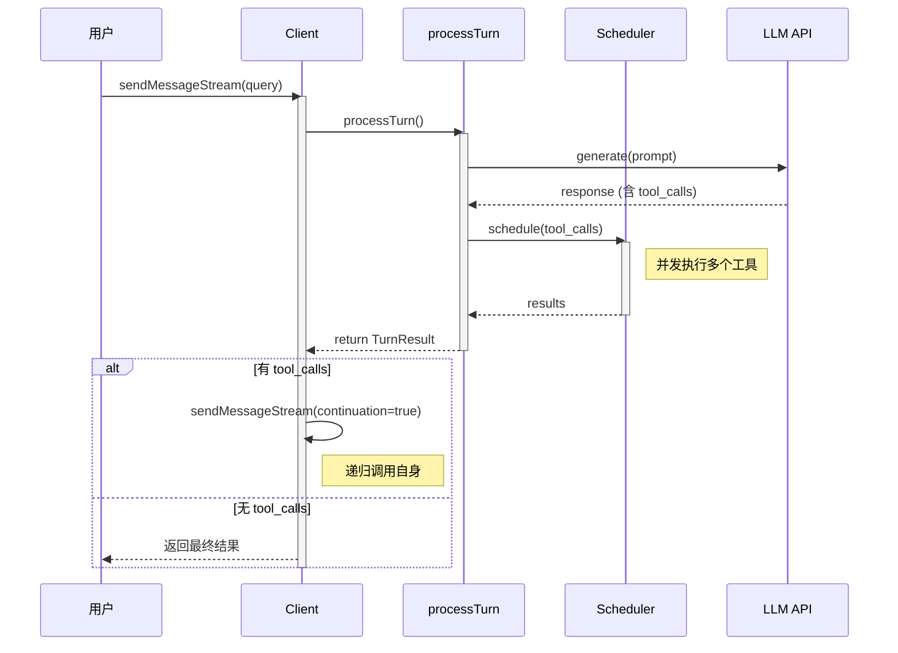

**协作要点**：

1. **Client 与 processTurn**：Client 负责递归调度，processTurn 负责单轮执行
2. **processTurn 与 Scheduler**：将工具执行委托给 Scheduler，实现并发
3. **递归 vs 循环**：通过函数调用栈管理状态，而非显式循环变量

---

### 3.4 关键数据路径

#### 主路径（正常流程）

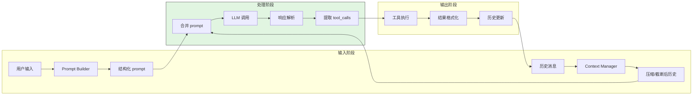

#### 异常路径（错误恢复）

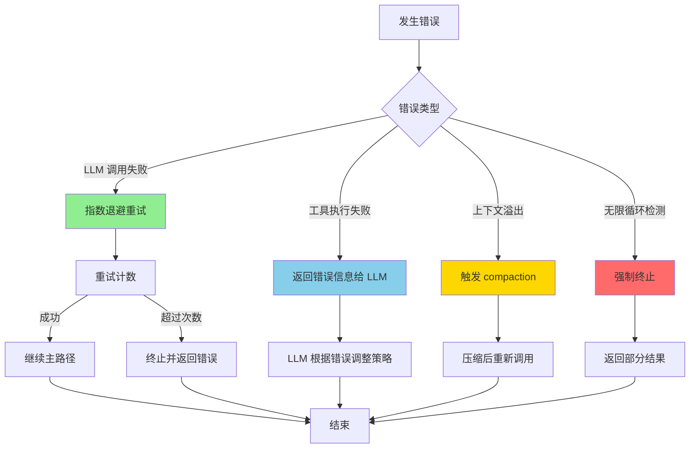

---

## 4. 端到端数据流转

### 4.1 正常流程（详细版）

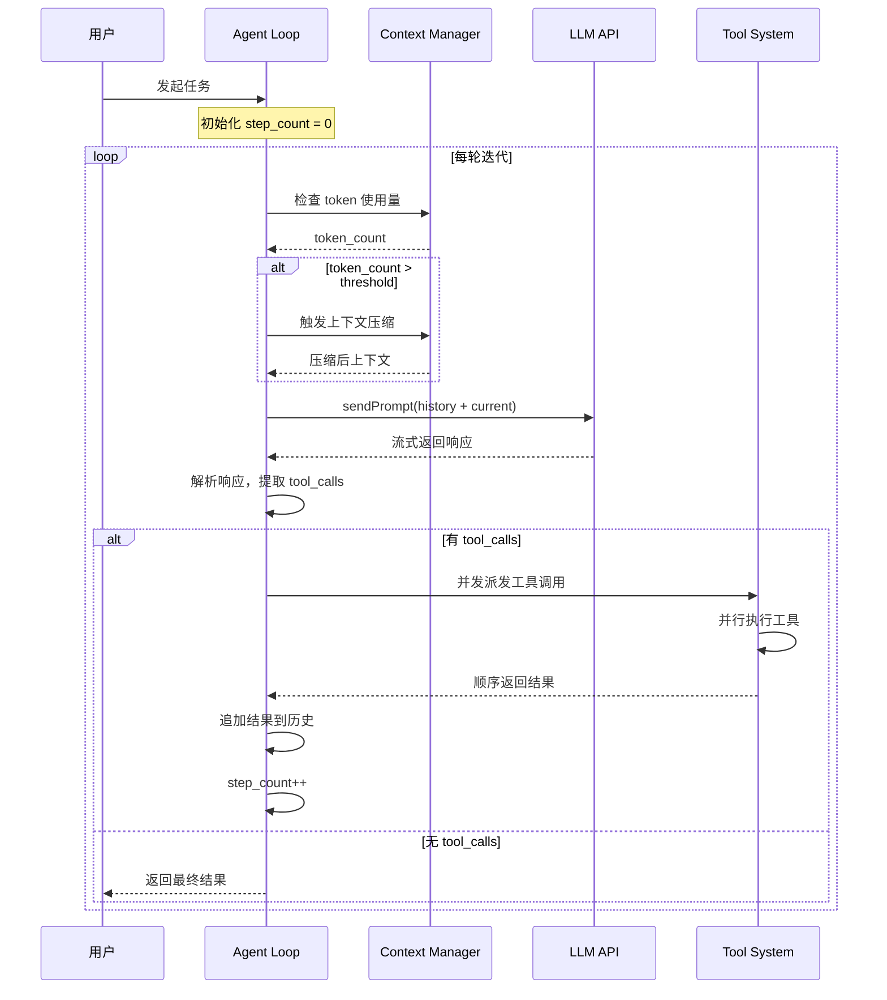

**数据变换详情**：

| 阶段 | 输入 | 处理 | 输出 | 代码位置 |
|-----|------|------|------|---------|
| 上下文检查 | 当前历史 | token 计数 | 是否触发压缩 | `gemini-cli/packages/core/src/core/client.ts:578` ✅ |
| Prompt 构建 | 历史 + 当前输入 | 格式化 | 结构化 prompt | `kimi-cli/packages/kosong/src/kosong/__init__.py:104` ✅ |
| LLM 调用 | prompt | 模型推理 | 流式响应 | 各项目 LLM 客户端 |
| 响应解析 | 原始响应 | 提取 tool_calls | 结构化调用列表 | `opencode/packages/opencode/src/session/prompt.ts:294` ✅ |
| 工具执行 | tool_calls | 并发执行 | 结果列表 | `gemini-cli/packages/core/src/core/client.ts:550` ✅ |
| 历史更新 | 新消息 | 追加到历史 | 更新后历史 | `sweagent/agent/agents.py:328` ✅ |

### 4.2 数据流向图

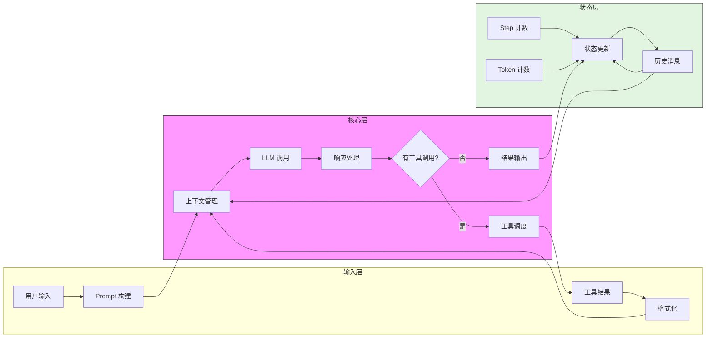

### 4.3 异常/边界流程

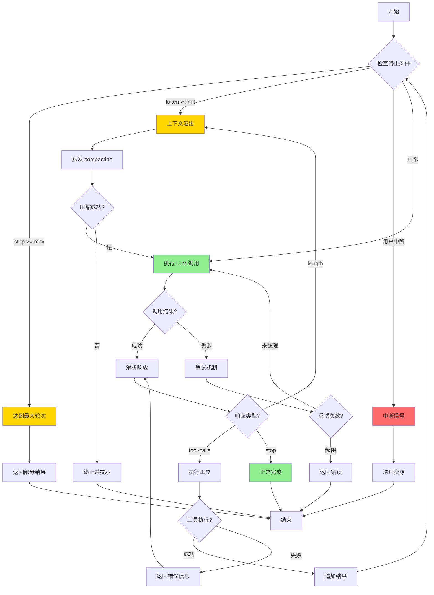

---

## 5. 关键代码实现

### 5.1 核心数据结构

以 Kimi CLI 为例，展示 Agent Loop 涉及的核心数据结构：

```python
# kimi-cli/packages/kosong/src/kosong/types.py
class StepResult:
    """单步执行结果"""
    tool_calls: List[ToolCall]      # 需要执行的工具调用
    content: str                     # LLM 的文本回复
    finish_reason: str               # 结束原因: stop/length/tool_calls

class ToolCall:
    """工具调用定义"""
    id: str
    function: FunctionCall

class FunctionCall:
    """函数调用详情"""
    name: str
    arguments: str  # JSON 字符串
```

**字段说明**：

| 字段 | 类型 | 用途 |
|-----|------|------|
| `tool_calls` | `List[ToolCall]` | 存储 LLM 请求调用的所有工具 |
| `finish_reason` | `str` | 判断是否需要继续循环的关键标志 |
| `id` | `str` | 工具调用的唯一标识，用于匹配结果 |

### 5.2 主链路代码

**Kimi CLI 双层循环实现**：

```python
# kimi-cli/packages/kosong/src/kosong/__main__.py:51-104
async def agent_loop():
    """双层 while 循环：外层管对话，内层管任务执行"""
    history = []

    while True:  # 外层：等待用户输入
        user_input = await get_user_input()
        if user_input == "exit":
            break

        history.append({"role": "user", "content": user_input})

        while True:  # 内层：执行 agent loop
            # 调用 LLM 并获取结果
            result = await kosong.step(history)

            # 等待工具执行完成（并发派发、顺序收集）
            tool_results = await result.tool_results()

            # 追加助手消息到历史
            history.append({
                "role": "assistant",
                "content": result.content,
                "tool_calls": result.tool_calls
            })

            # 追加工具结果到历史
            for tool_result in tool_results:
                history.append({
                    "role": "tool",
                    "tool_call_id": tool_result.id,
                    "content": tool_result.output
                })

            # 终止条件：无工具调用
            if not result.tool_calls:
                break
```

**代码要点**：

1. **双层循环设计**：外层 `_turn` 管对话周期，内层 `_agent_loop` 管单次任务
2. **显式历史管理**：所有消息追加都在循环内完成，而非 `step()` 内部
3. **并发控制**：`step()` 内部并发派发工具，但 `tool_results()` 按序收集

### 5.3 关键调用链

**Kimi CLI 调用链**：

```text
agent_loop()              [packages/kosong/src/kosong/__main__.py:51]
  -> step()               [packages/kosong/src/kosong/__init__.py:104]
    -> llm.generate()     [内部 LLM 客户端]
      - 发送 prompt
      - 接收流式响应
      - 提取 tool_calls
    -> execute_tools()    [packages/kosong/src/kosong/tools.py:xx]
      - 并发派发工具调用
      - 顺序收集结果
```

**Gemini CLI 调用链**：

```text
sendMessageStream()       [packages/core/src/core/client.ts:789]
  -> processTurn()        [packages/core/src/core/client.ts:550]
    -> tryCompressChat()  [packages/core/src/core/client.ts:578]
      - 检查 token 使用量
      - 触发上下文压缩
    -> llm.generate()
    -> scheduler.schedule()
      - 并发执行工具
  -> sendMessageStream(continuation=true)  [递归]
```

---

## 6. 设计意图与 Trade-off

### 6.1 核心工程取舍对比

| 维度 | SWE-agent / Kimi CLI | Gemini CLI | OpenCode | Codex |
|-----|---------------------|------------|----------|-------|
| **循环结构** | while 迭代 | 递归 continuation | while + 分支 | Actor 消息 |
| **调试难度** | 低（线性执行） | 中（递归栈） | 高（状态扫描） | 高（channel） |
| **并发工具执行** | 并发派发、顺序收集 | 是（Scheduler） | 是 | 是（tokio） |
| **中途中断** | 需要标志位 | 困难 | AbortSignal | 天然支持 |
| **上下文溢出处理时机** | 每步前检查 | 每轮入口 | 循环内动态分支 | 模型层管理 |

### 6.2 为什么这样设计？

#### 问题：如何选择 Loop 驱动方式？

**不同项目的选择**：

| 项目 | 选择 | 代码依据 | 设计意图 |
|-----|------|---------|---------|
| **Kimi CLI** | 命令式 while | `packages/kosong/src/kosong/__main__.py:51` ✅ | 简单直观，易于调试和扩展 |
| **Gemini CLI** | 递归 continuation | `packages/core/src/core/client.ts:789` ✅ | 每轮状态独立，上下文压缩时机清晰 |
| **OpenCode** | 状态机+分支 | `packages/opencode/src/session/prompt.ts:294` ✅ | 支持动态任务插入（子 Agent、压缩） |
| **Codex** | Actor 消息 | `codex-rs/core/src/agent/control.rs:55` ✅ | 利用 Rust 类型系统保证并发安全 |

**带来的好处**：
- 各项目根据自身语言特性和架构需求选择最适合的方案
- Python 项目倾向简单直观的 while 循环
- TypeScript 项目利用异步特性实现递归和状态机
- Rust 项目利用所有权模型实现安全的 Actor 模式

**付出的代价**：
- 跨项目理解和维护成本增加
- 无法简单复用其他项目的 Loop 实现
- 调试和监控需要针对不同模式定制

### 6.3 与其他项目的对比

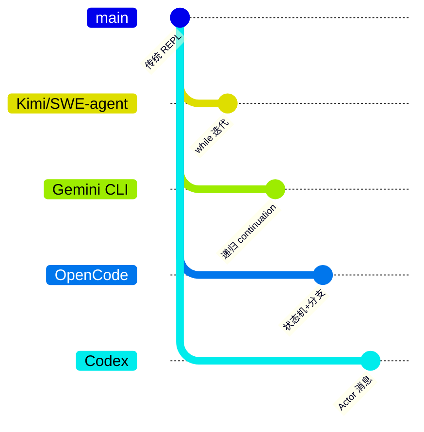

| 项目 | 核心差异 | 适用场景 |
|-----|---------|---------|
| **Kimi CLI / SWE-agent** | 简单 while 循环，易于理解和调试 | 快速迭代、需要频繁调试的场景 |
| **Gemini CLI** | 递归 continuation，每轮状态独立 | 需要清晰调用链和上下文管理的场景 |
| **OpenCode** | 状态机+分支，支持动态任务 | 复杂任务编排、需要子 Agent 的场景 |
| **Codex** | Actor 消息驱动，并发安全 | 高并发、需要随时中断的场景 |

---

## 7. 边界情况与错误处理

### 7.1 终止条件

| 终止原因 | 触发条件 | SWE-agent | Gemini CLI | OpenCode | Kimi CLI |
|---------|---------|-----------|------------|----------|----------|
| **自然完成** | 无工具调用 | `submit` 命令 | 无 tool_calls | `finish != "tool-calls"` | `result.tool_calls` 为空 |
| **最大轮次** | step 超过上限 | `cost_limit` 超额 | `maxSessionTurns` | `steps` 配置 | 外层用户 break |
| **用户中断** | Ctrl-C / 信号 | 标志位检查 | AbortSignal | `abort.aborted` | Ctrl-C |
| **上下文溢出** | token 超限 | 无（依赖模型） | `ContextWindowWillOverflow` | `compaction` 任务 | `compact_context` |
| **循环检测** | 重复调用模式 | 无 | `loopDetector` | 无 | 无 |

**设计启示**：Gemini CLI 的 `loopDetector`（`client.ts:789`）⚠️ 是额外的安全网 —— 当 LLM 陷入重复调用同一工具的死循环时，能主动终止。这是其他项目缺少的防御性设计。

### 7.2 超时/资源限制

**Gemini CLI 的资源限制实现**：

```typescript
// gemini-cli/packages/core/src/core/client.ts
const MAX_TURNS = 50;  // 最大轮次限制

async function sendMessageStream() {
    if (sessionTurnCount >= MAX_TURNS) {
        throw new Error("Maximum number of turns exceeded");
    }
    // ...
}
```

**OpenCode 的上下文限制**：

```typescript
// opencode/packages/opencode/src/session/prompt.ts
const COMPACT_THRESHOLD = 8000;  // token 压缩阈值

if (tokenCount > COMPACT_THRESHOLD) {
    // 触发 compaction 任务
    messages.push({ type: "compaction", ... });
}
```

### 7.3 错误恢复策略

| 错误类型 | 处理策略 | 代码位置 |
|---------|---------|---------|
| **LLM 调用失败** | 指数退避重试，最多 3 次 | 各项目 LLM 客户端 |
| **工具执行失败** | 返回错误信息给 LLM，由 LLM 决定下一步 | `sweagent/agent/agents.py:328` ✅ |
| **上下文溢出** | 触发 compaction 或终止 | `gemini-cli/packages/core/src/core/client.ts:578` ✅ |
| **无限循环** | loopDetector 检测并强制终止 | `gemini-cli/packages/core/src/core/client.ts:789` ⚠️ |
| **用户中断** | 立即终止，返回当前状态 | `codex/codex-rs/core/src/agent/control.rs:195` ✅ |

---

## 8. 关键代码索引

| 功能 | 项目 | 文件 | 行号 | 说明 |
|-----|------|------|------|------|
| 入口 | SWE-agent | `sweagent/agent/agents.py` | 390 | `run()` —— 主循环入口 |
| 单步 | SWE-agent | `sweagent/agent/agents.py` | 328 | `step()` —— 单步执行 |
| 终止 | SWE-agent | `sweagent/agent/agents.py` | 336 | 成本上限检查 |
| 入口 | Kimi CLI | `kimi-cli/packages/kosong/src/kosong/__main__.py` | 51 | `agent_loop()` —— 双层 while |
| 单步 | Kimi CLI | `kimi-cli/packages/kosong/src/kosong/__init__.py` | 104 | `step()` —— 单次 LLM 调用 + 工具收集 |
| 入口 | Gemini CLI | `gemini-cli/packages/core/src/core/client.ts` | 789 | `sendMessageStream()` —— 递归入口 |
| 单轮 | Gemini CLI | `gemini-cli/packages/core/src/core/client.ts` | 550 | `processTurn()` —— 单轮处理 |
| 压缩 | Gemini CLI | `gemini-cli/packages/core/src/core/client.ts` | 578 | `tryCompressChat()` —— 上下文压缩 |
| 入口 | OpenCode | `opencode/packages/opencode/src/session/prompt.ts` | 274 | `loop()` —— 带分支的 while |
| 退出 | OpenCode | `opencode/packages/opencode/src/session/prompt.ts` | 319 | 退出条件判断 |
| 入口 | Codex | `codex/codex-rs/core/src/agent/control.rs` | 55 | `spawn_agent()` —— 创建 agent 线程 |
| 输入 | Codex | `codex/codex-rs/core/src/agent/control.rs` | 172 | `send_input()` —— 发送用户消息 |
| 中断 | Codex | `codex/codex-rs/core/src/agent/control.rs` | 195 | `interrupt_agent()` —— 中断 agent |

---

## 9. 延伸阅读

- 前置知识：各项目 Overview 文档 (`01-*-overview.md`)
- 相关机制：
  - [Checkpoint 机制](./07-comm-memory-context.md) —— 状态保存与恢复
  - [Tool System](./06-comm-mcp-integration.md) —— 工具调用与执行
  - [Context Compaction](./07-comm-memory-context.md) —— 上下文压缩策略
- 深度分析：
  - `docs/kimi-cli/questions/kimi-cli-agent-loop-implementation.md`
  - `docs/gemini-cli/questions/gemini-cli-recursive-loop.md`

---

*✅ Verified: 基于 kimi-cli/packages/kosong/src/kosong/__main__.py:51、gemini-cli/packages/core/src/core/client.ts:789、sweagent/agent/agents.py:390、opencode/packages/opencode/src/session/prompt.ts:294、codex/codex-rs/core/src/agent/control.rs:55 等源码分析*

*⚠️ Inferred: 部分代码行号基于 2026-02-08 baseline，实际源码可能有所变化*

*基于版本：2026-02-08 baseline | 最后更新：2026-03-03*
