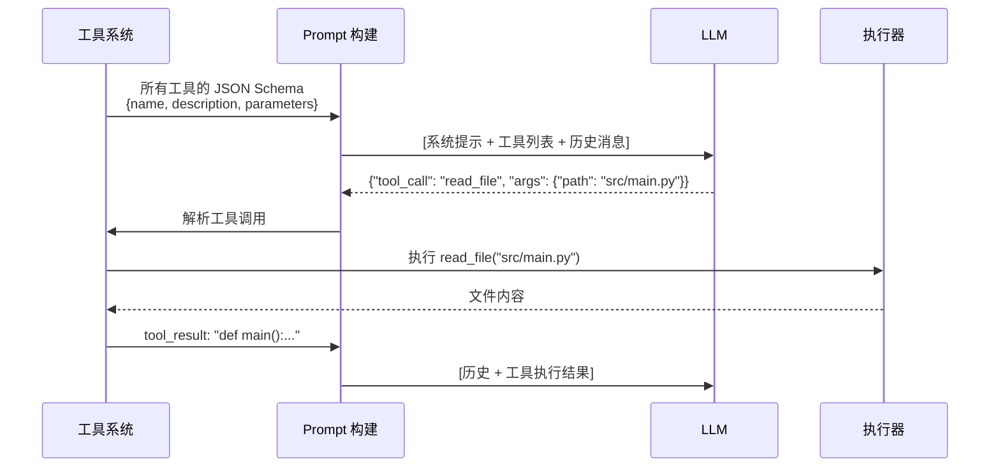
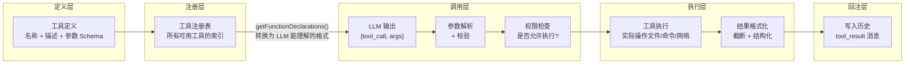

# 工具系统

## TL;DR

工具系统是 LLM 与真实世界之间的接口层。LLM 不直接执行操作，而是输出"我要调用哪个工具、传什么参数"，由工具系统实际执行并把结果返回。核心挑战是：如何让 LLM 知道有哪些工具、工具参数如何描述给 LLM、执行结果如何安全地返回。

---

## 1. 工具调用的本质：LLM 的"函数签名"

理解工具系统，先理解 LLM 是如何"知道"工具存在的。

LLM 本身不能执行代码。工具系统的工作是：
1. 把工具的**名称 + 参数 Schema** 写进 LLM 的 prompt
2. LLM 决定是否调用，并输出结构化的工具调用（JSON）
3. 系统解析 JSON，执行对应函数，把结果注入历史



**关键约束：** 工具的参数描述（Schema）必须足够清晰，让 LLM 能正确生成调用；同时又不能太复杂，避免消耗过多 token。

---

## 2. 完整数据流



---

## 3. 各项目的工具定义方式

### 方式 1：YAML Bundle（SWE-agent）

工具通过配置文件定义，和代码解耦。

```yaml
# sweagent/tools/windowed/config.yaml
tools:
  open:
    docstring: "Open a file for viewing"
    signature: "open <path> [<lineno>]"
    arguments:
      - name: path
        type: string
        required: true
```

**架构关键**（`sweagent/tools/tools.py:75`，`ToolConfig` 类）：
- `ToolConfig` 管理 Bundle 列表
- `use_function_calling()` 判断是否转换为 OpenAI 格式（`tools.py:155`）
- `ToolHandler` 负责执行（`tools.py:227`）

**工程取舍：** 工具定义与代码分离，研究人员可以不写 Python 直接修改工具行为，便于实验；但失去类型安全，运行时才能发现配置错误。

---

### 方式 2：Rust Trait（Codex）

工具通过实现 `ToolHandler` trait 定义，编译期保证类型安全。

```rust
// codex-rs/core/src/tools/registry.rs:34
pub trait ToolHandler: Send + Sync {
    async fn is_mutating(&self, invocation: &ToolInvocation) -> bool {
        false  // 默认非变异（读操作）
    }

    async fn handle(
        &self,
        invocation: ToolInvocation,
    ) -> Result<ToolOutput, FunctionCallError>;
}
```

`is_mutating()` 是 Codex 独有设计 —— 区分只读和写操作，用于并发控制：写操作必须串行，读操作可以并行（`registry.rs:79`，`dispatch()` 方法）。

**注册机制**（`registry.rs:241`，`ToolRegistryBuilder`）：
```rust
builder.register_handler("bash", Arc::new(BashHandler::new()));
builder.register_handler("read_file", Arc::new(ReadFileHandler::new()));
let (specs, registry) = builder.build(); // specs 发给 LLM，registry 负责执行
```

**工程取舍：** 编译期类型检查，性能最优；但添加新工具需要修改 Rust 代码并重新编译，扩展成本高。

---

### 方式 3：声明式基类（Gemini CLI）

工具通过继承 `DeclarativeTool` 抽象类定义，`Kind` 枚举控制权限。

**关键设计**（`gemini-cli/packages/core/src/tools/tools.ts:353`）：

```typescript
export abstract class DeclarativeTool<TParams, TResult> {
    readonly kind: Kind;           // 工具类别（Read/Write/Execute 等）
    readonly parameterSchema: unknown;  // JSON Schema 格式的参数定义

    build(params: TParams): ToolInvocation<TParams, TResult>;
    // 构建可执行实例，由子类实现
}
```

`Kind` 枚举（`tools/kind.ts`）决定权限策略：
- `Kind.Read` → 默认允许
- `Kind.Write` → 需要用户确认
- `Kind.Execute` → 严格审批

三层工具来源（`tools/registry.ts`）：
```
Built-in (优先级 0)  → 内置工具（读文件、执行命令）
Discovered (优先级 1) → 项目目录中发现的工具
MCP (优先级 2)       → 外部 MCP Server 提供的工具
```

**工程取舍：** Kind 分类使权限控制与工具定义绑定，不需要额外配置；但需要工具开发者预先分类，分错 Kind 会影响安全策略。

---

### 方式 4：Zod Schema 工厂函数（OpenCode）

最现代的 TypeScript 方式，用 Zod 提供运行时类型安全。

**关键代码**（`opencode/packages/opencode/src/tool/tool.ts:50`）：

```typescript
export function define<Parameters extends z.ZodType>(
    id: string,
    init: () => Promise<{
        description: string
        parameters: Parameters
        execute(args: z.infer<Parameters>, ctx: Context): Promise<Result>
    }>
): Info<Parameters>
```

实际工具定义示例：
```typescript
// 参数 Schema 与执行逻辑在同一个对象中定义
export const BashTool = Tool.define("bash", async () => ({
    description: "Execute shell commands",
    parameters: z.object({
        command: z.string(),
        timeout: z.number().optional(),
    }),
    async execute(args, ctx) {
        await ctx.ask({ permission: "bash", patterns: [args.command] })  // 权限请求
        // ...执行逻辑
    }
}))
```

Zod 的 `parameters.parse(args)` 在执行前自动校验（`tool.ts:57`）：参数不合法时直接拒绝，不会到达执行逻辑。

**工程取舍：** 类型安全 + 运行时校验 + 描述可读性好；但 Zod Schema 需要手写，对不熟悉的开发者有学习成本。

---

## 4. 核心工程取舍对比

### 工具定义方式的维度对比

| 维度 | YAML (SWE-agent) | Rust Trait (Codex) | TypeScript Class (Gemini) | Zod (OpenCode) |
|------|-----------------|-------------------|--------------------------|----------------|
| **类型安全** | 无（运行时） | 编译期最强 | TypeScript 静态 | 运行时校验 |
| **新增工具成本** | 低（改配置文件） | 高（改 Rust 代码） | 中（新建 Class） | 低（工厂函数） |
| **动态加载** | 否 | 否 | 是（Discovery） | 是（文件加载） |
| **MCP 扩展** | 否 | 是 | 是（原生支持） | 是 |
| **权限控制** | blocklist 过滤 | is_mutating 标记 | Kind 枚举分类 | ctx.ask 运行时 |

### 工具执行的并发策略

| 项目 | 并发执行 | 控制方式 | 原因 |
|------|----------|----------|------|
| SWE-agent | 否 | 顺序执行 | 简单可靠，学术场景不需要高并发 |
| Codex | 是 | `is_mutating()` 控制 | 读操作并行，写操作串行 |
| Gemini CLI | 是 | Scheduler 状态机 | 支持多工具同时执行 |
| OpenCode | 是 | Promise 并发 | 提升执行效率 |

---

## 5. 工具的输出截断问题

这是被文档经常忽视的工程细节：工具执行结果可能很大（如读取一个 10MB 的文件），直接注入上下文会撑爆 token 限制。

各项目的处理方式：
- **OpenCode**：`Truncate` 模块（`tool/truncation.ts`），每个工具返回时自动截断
- **Gemini CLI**：`tryMaskToolOutputs()` 在上下文超限时遮罩大体积工具输出
- **SWE-agent**：通过"windowed"工具提供分页读取，而不是一次返回全部

---

## 6. 关键代码索引

| 项目 | 文件 | 行号 | 说明 |
|------|------|------|------|
| SWE-agent | `sweagent/tools/tools.py` | 75 | `ToolConfig` —— 工具配置类 |
| SWE-agent | `sweagent/tools/tools.py` | 227 | `ToolHandler` —— 工具执行管理 |
| SWE-agent | `sweagent/tools/tools.py` | 155 | `use_function_calling()` —— 格式转换 |
| Codex | `codex-rs/core/src/tools/registry.rs` | 34 | `ToolHandler` trait |
| Codex | `codex-rs/core/src/tools/registry.rs` | 79 | `dispatch()` —— 分发执行 |
| Codex | `codex-rs/core/src/tools/registry.rs` | 241 | `ToolRegistryBuilder` |
| Gemini CLI | `gemini-cli/packages/core/src/tools/tools.ts` | 353 | `DeclarativeTool` 抽象类 |
| Gemini CLI | `gemini-cli/packages/core/src/tools/tools.ts` | 312 | `kind` —— 工具分类字段 |
| OpenCode | `opencode/packages/opencode/src/tool/tool.ts` | 50 | `Tool.define()` —— 工厂函数 |
| OpenCode | `opencode/packages/opencode/src/tool/tool.ts` | 22 | `Context.ask()` —— 运行时权限请求 |
