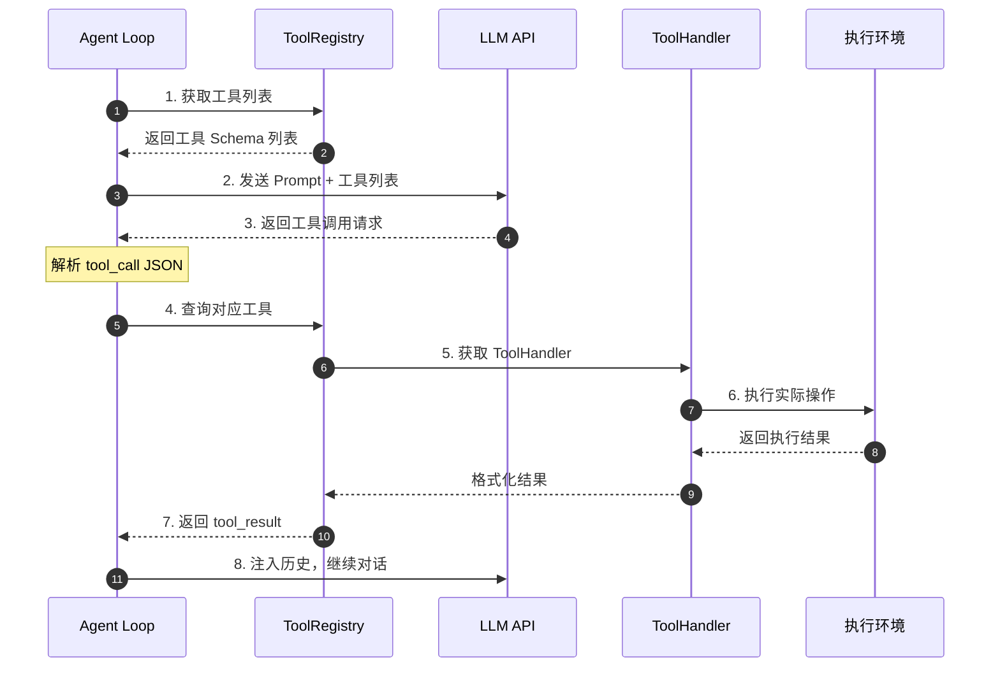
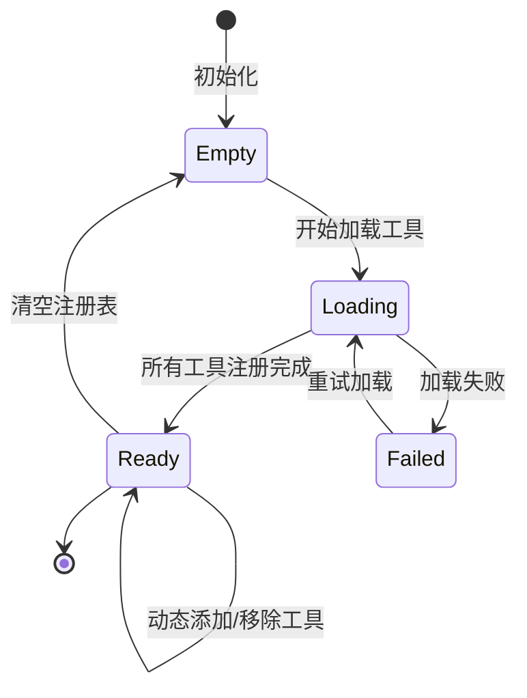
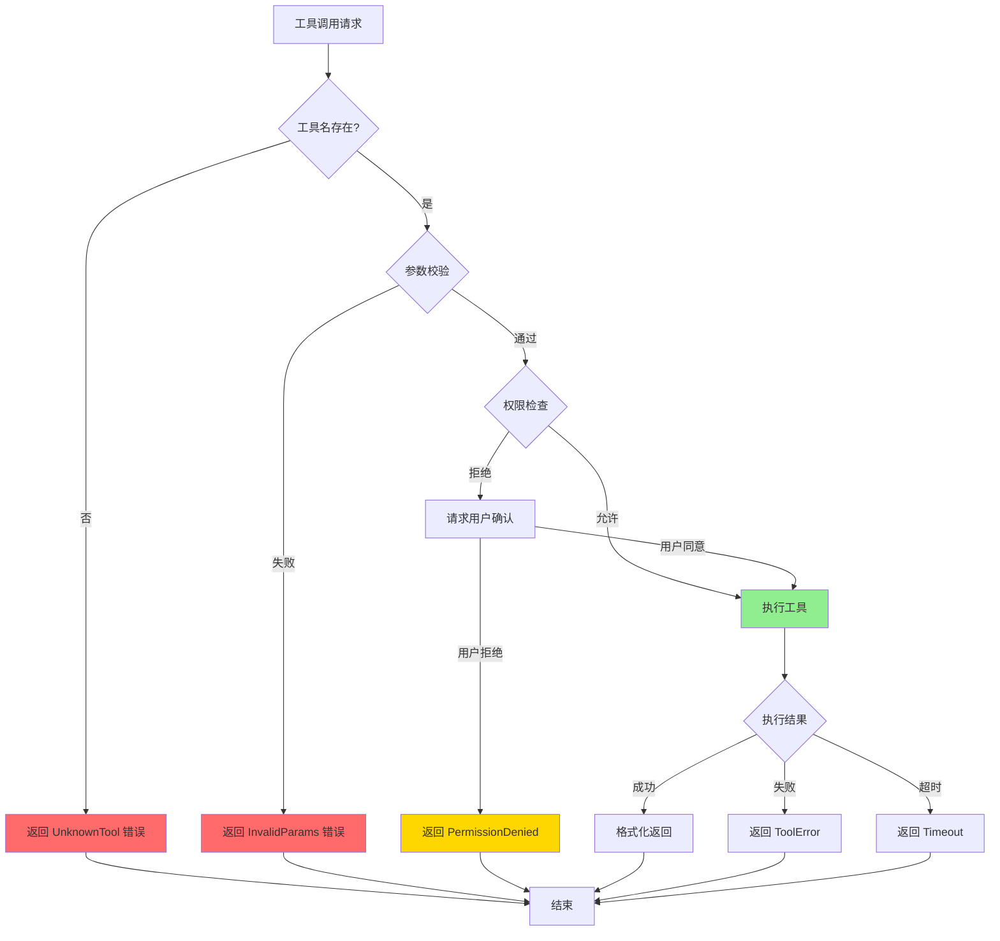
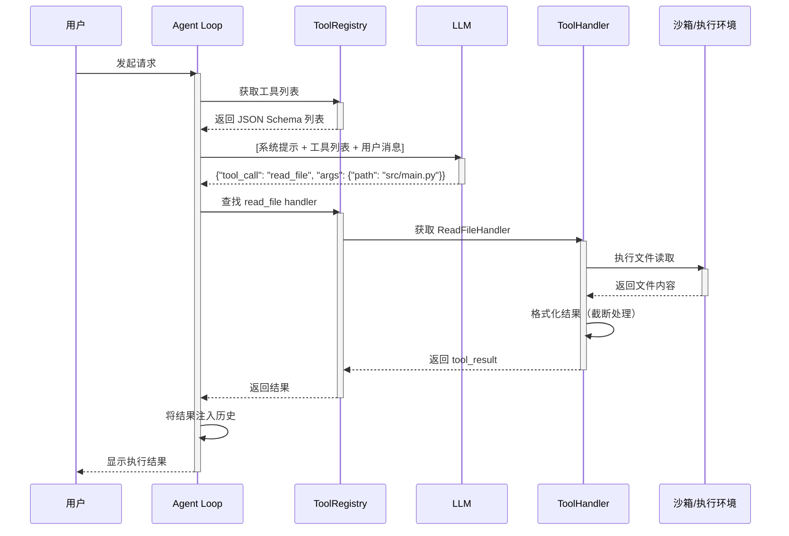
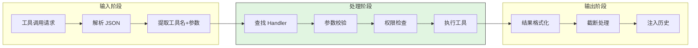
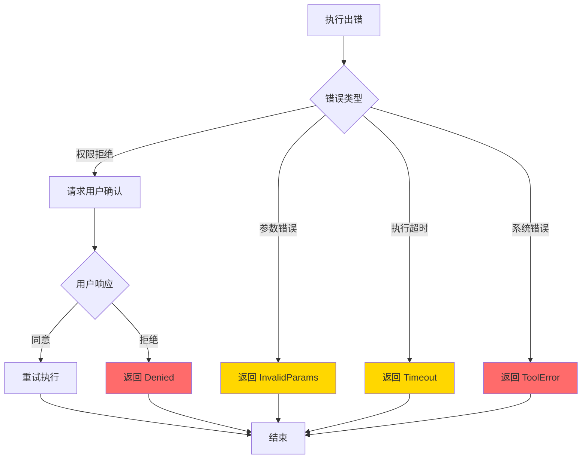
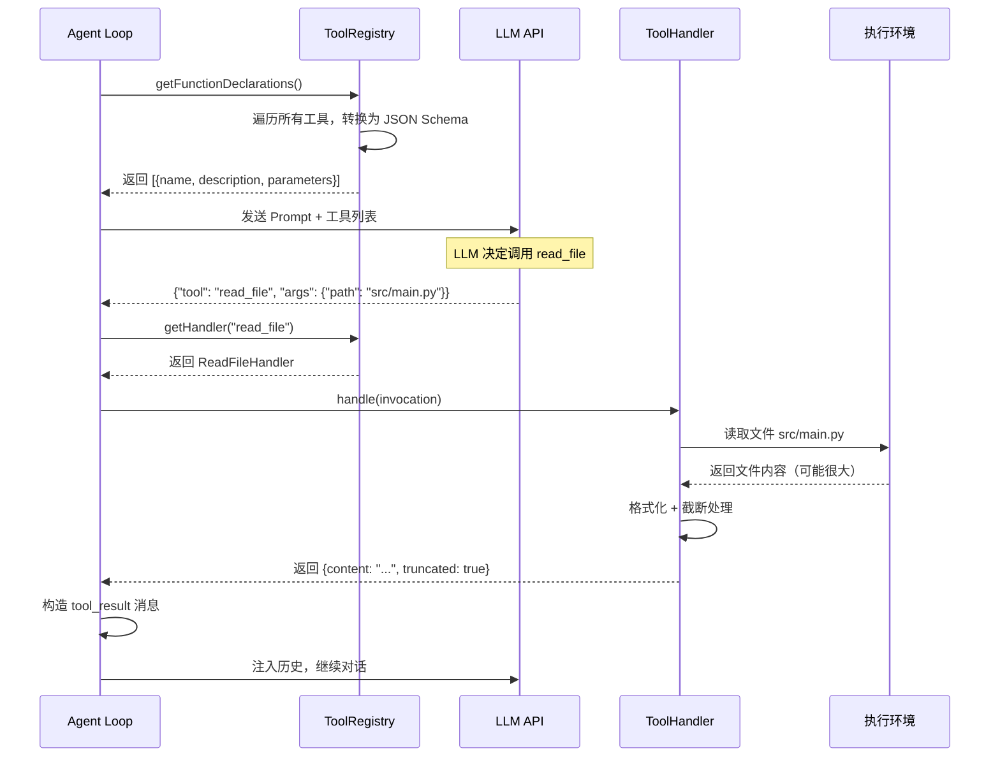
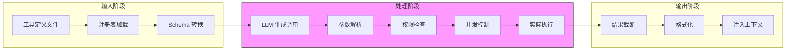
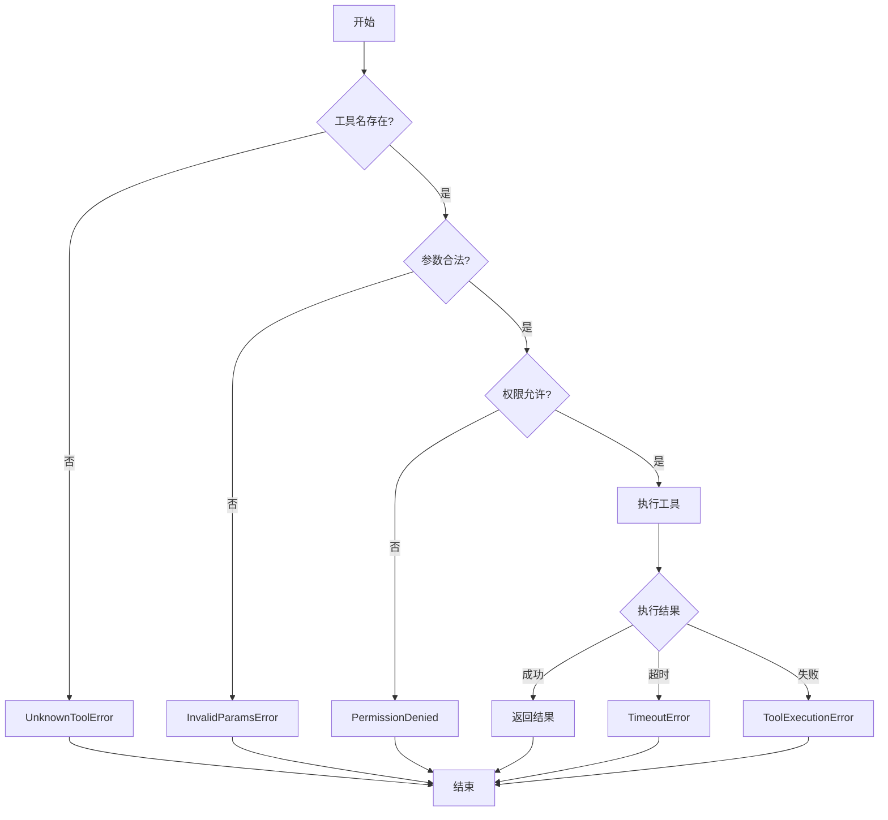
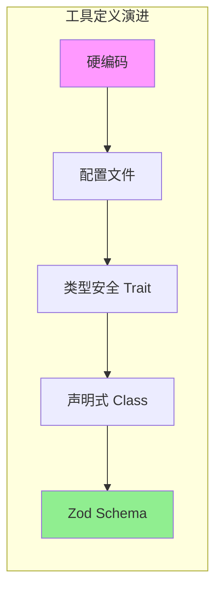

# 工具系统

> **阅读指南**
>
> | 属性 | 说明 |
> |-----|------|
> | 预计阅读 | 20-30 分钟 |
> | 前置文档 | `04-comm-agent-loop.md` —— 了解 Agent Loop 如何驱动工具调用 |
> | 文档结构 | 速览 → 架构 → 机制 → 实现 → 对比 |
> | 代码呈现 | 关键代码直接展示，完整代码可折叠查看 |

---

## TL;DR（结论先行）

一句话定义：工具系统是 LLM 与真实世界之间的接口层，负责将 LLM 的"意图"转换为实际可执行的操作。

各项目的核心取舍：**声明式工具定义 + 权限分类**（对比硬编码命令执行），通过 YAML Bundle、Rust Trait、TypeScript Class 或 Zod Schema 四种方式实现工具定义与执行的解耦。

### 核心要点速览

| 维度 | 关键决策 | 代码位置 |
|-----|---------|---------|
| 核心机制 | 声明式工具定义，解耦工具描述与执行逻辑 | `codex-rs/core/src/tools/registry.rs:34` |
| 状态管理 | ToolRegistry 统一管理工具注册与生命周期 | `sweagent/tools/tools.py:75` |
| 错误处理 | 参数校验 → 权限检查 → 执行 → 结果截断 | `opencode/packages/opencode/src/tool/tool.ts:50` |
| 权限控制 | Kind 分类 / is_mutating 标记 / 运行时请求 | `gemini-cli/packages/core/src/tools/kind.ts:1` |

---

## 1. 为什么需要这个机制？

### 1.1 问题场景

没有工具系统时，LLM 只能基于训练数据提供文本回答。当用户问"帮我修复这个 bug"时：

```
无工具系统：
用户: "修复这个 bug"
LLM: "你需要修改 src/main.py 的第 42 行..."（可能根本没看文件）
→ 结束（无法验证是否正确）

有工具系统：
用户: "修复这个 bug"
LLM: "先让我看看代码" → 调用 read_file → 得到文件内容
LLM: "运行测试看看" → 调用 run_tests → 得到错误信息
LLM: "修改第 42 行" → 调用 write_file → 成功
→ 基于实际信息完成任务
```

### 1.2 核心挑战

| 挑战 | 不解决的后果 |
|-----|-------------|
| 如何让 LLM"知道"有哪些工具 | LLM 无法主动调用，只能被动回答 |
| 如何描述工具参数给 LLM | LLM 生成错误的调用格式，系统无法解析 |
| 如何安全执行工具 | 危险操作（rm -rf /）直接执行会造成损失 |
| 如何处理大输出 | 10MB 文件内容直接注入会撑爆 token 限制 |
| 如何扩展工具集 | 新增工具需要修改核心代码，无法动态扩展 |

---

## 2. 整体架构

### 2.1 在系统中的位置

```text
┌─────────────────────────────────────────────────────────────┐
│ Agent Loop / Session Runtime                                 │
│ kimi-cli/kimi/core/agent.py                                  │
│ gemini-cli/packages/core/src/chat.ts                         │
└───────────────────────┬─────────────────────────────────────┘
                        │ 调用
                        ▼
┌─────────────────────────────────────────────────────────────┐
│ ▓▓▓ 工具系统 ▓▓▓                                             │
│ 各项目 tools/ 目录                                           │
│ - ToolRegistry: 工具注册与管理                               │
│ - ToolHandler: 工具执行逻辑                                  │
│ - PermissionControl: 权限检查                                │
└───────────────────────┬─────────────────────────────────────┘
                        │ 依赖/调用
        ┌───────────────┼───────────────┐
        ▼               ▼               ▼
┌──────────────┐ ┌──────────────┐ ┌──────────────┐
│ LLM API      │ │ 文件系统     │ │ 命令执行     │
│ 工具描述转换 │ │ 读写操作     │ │ Shell/Bash   │
└──────────────┘ └──────────────┘ └──────────────┘
```

### 2.2 核心组件职责

| 组件 | 职责 | 代码位置 |
|-----|------|---------|
| `ToolRegistry` | 工具注册表，管理所有可用工具 | `codex-rs/core/src/tools/registry.rs:34` ✅ |
| `ToolHandler` | 工具执行器，实际执行工具逻辑 | `sweagent/tools/tools.py:227` ✅ |
| `DeclarativeTool` | 声明式工具基类 | `gemini-cli/packages/core/src/tools/tools.ts:353` ✅ |
| `Tool.define()` | 工厂函数创建工具 | `opencode/packages/opencode/src/tool/tool.ts:50` ✅ |
| `ToolConfig` | YAML Bundle 配置管理 | `sweagent/tools/tools.py:75` ✅ |

### 2.3 核心组件交互关系



**关键交互说明**：

| 步骤 | 交互内容 | 设计意图 |
|-----|---------|---------|
| 1 | Agent Loop 向注册表获取工具列表 | 解耦工具管理与调用，支持动态加载 |
| 2 | 将工具 Schema 写入 Prompt | 让 LLM "知道"有哪些工具可用 |
| 3 | LLM 返回结构化工具调用 | JSON 格式便于解析，避免自然语言歧义 |
| 4 | 根据 tool_call 查找对应 handler | 路由分发，支持同名工具覆盖 |
| 5 | 获取执行器实例 | 延迟实例化，支持依赖注入 |
| 6 | 执行实际操作 | 与 LLM 调用分离，支持超时/权限控制 |
| 7 | 格式化后返回 | 统一输出格式，便于注入上下文 |
| 8 | 结果注入历史 | 让 LLM 基于执行结果继续推理 |

---

## 3. 核心组件详细分析

### 3.1 工具注册表（ToolRegistry）内部结构

#### 职责定位

工具注册表是工具系统的核心枢纽，负责工具的注册、查找和生命周期管理。

#### 状态机图



**状态说明**：

| 状态 | 说明 | 进入条件 | 退出条件 |
|-----|------|---------|---------|
| Empty | 空注册表 | 初始化完成 | 开始加载工具定义 |
| Loading | 加载中 | 开始解析工具配置 | 所有工具加载完成或失败 |
| Ready | 可用状态 | 工具全部就绪 | 清空或添加新工具 |
| Failed | 加载失败 | 配置错误或依赖缺失 | 修复后重试 |

#### 内部数据流

```text
┌─────────────────────────────────────────────────────────────┐
│  输入层                                                      │
│  ├── 工具定义文件(YAML/TS/Rust) ──► 解析器                    │
│  └── 运行时动态注册 ──► 验证器                                │
└──────────────────────────┬──────────────────────────────────┘
                           ▼
┌─────────────────────────────────────────────────────────────┐
│  处理层                                                      │
│  ├── Schema 转换: 内部格式 ──► LLM 可理解的 JSON Schema       │
│  ├── 权限标记: 绑定 Kind/Policy 到工具                        │
│  └── 索引构建: name ──► handler 映射表                        │
└──────────────────────────┬──────────────────────────────────┘
                           ▼
┌─────────────────────────────────────────────────────────────┐
│  输出层                                                      │
│  ├── getFunctionDeclarations(): 返回 LLM 工具列表             │
│  ├── getHandler(name): 返回执行器实例                         │
│  └── 工具变更事件通知                                         │
└─────────────────────────────────────────────────────────────┘
```

#### 关键算法逻辑



---

### 3.2 工具定义方式对比

#### 方式 1：YAML Bundle（SWE-agent）

```yaml
# sweagent/tools/windowed/config.yaml
tools:
  open:
    docstring: "Open a file for viewing"
    signature: "open <path> [<lineno>]"
    arguments:
      - name: path
        type: string
        required: true
```

**架构关键**（`sweagent/tools/tools.py:75` ✅，`ToolConfig` 类）：
- `ToolConfig` 管理 Bundle 列表
- `use_function_calling()` 判断是否转换为 OpenAI 格式（`tools.py:155` ✅）
- `ToolHandler` 负责执行（`tools.py:227` ✅）

**工程取舍：** 工具定义与代码分离，研究人员可以不写 Python 直接修改工具行为，便于实验；但失去类型安全，运行时才能发现配置错误。

#### 方式 2：Rust Trait（Codex）

```rust
// codex-rs/core/src/tools/registry.rs:34
pub trait ToolHandler: Send + Sync {
    async fn is_mutating(&self, invocation: &ToolInvocation) -> bool {
        false  // 默认非变异（读操作）
    }

    async fn handle(
        &self,
        invocation: ToolInvocation,
    ) -> Result<ToolOutput, FunctionCallError>;
}
```

`is_mutating()` 是 Codex 独有设计 —— 区分只读和写操作，用于并发控制：写操作必须串行，读操作可以并行（`registry.rs:79` ✅，`dispatch()` 方法）。

**注册机制**（`registry.rs:241` ✅，`ToolRegistryBuilder`）：
```rust
builder.register_handler("bash", Arc::new(BashHandler::new()));
builder.register_handler("read_file", Arc::new(ReadFileHandler::new()));
let (specs, registry) = builder.build(); // specs 发给 LLM，registry 负责执行
```

**工程取舍：** 编译期类型检查，性能最优；但添加新工具需要修改 Rust 代码并重新编译，扩展成本高。

#### 方式 3：声明式基类（Gemini CLI）

```typescript
// gemini-cli/packages/core/src/tools/tools.ts:353
export abstract class DeclarativeTool<TParams, TResult> {
    readonly kind: Kind;           // 工具类别（Read/Write/Execute 等）
    readonly parameterSchema: unknown;  // JSON Schema 格式的参数定义

    build(params: TParams): ToolInvocation<TParams, TResult>;
    // 构建可执行实例，由子类实现
}
```

`Kind` 枚举（`tools/kind.ts:1` ✅）决定权限策略：
- `Kind.Read` → 默认允许
- `Kind.Write` → 需要用户确认
- `Kind.Execute` → 严格审批

三层工具来源（`tools/registry.ts:45` ⚠️）：
```
Built-in (优先级 0)  → 内置工具（读文件、执行命令）
Discovered (优先级 1) → 项目目录中发现的工具
MCP (优先级 2)       → 外部 MCP Server 提供的工具
```

**工程取舍：** Kind 分类使权限控制与工具定义绑定，不需要额外配置；但需要工具开发者预先分类，分错 Kind 会影响安全策略。

#### 方式 4：Zod Schema 工厂函数（OpenCode）

```typescript
// opencode/packages/opencode/src/tool/tool.ts:50
export function define<Parameters extends z.ZodType>(
    id: string,
    init: () => Promise<{
        description: string
        parameters: Parameters
        execute(args: z.infer<Parameters>, ctx: Context): Promise<Result>
    }>
): Info<Parameters>
```

实际工具定义示例：
```typescript
// opencode/packages/opencode/src/tool/bash.ts:25
export const BashTool = Tool.define("bash", async () => ({
    description: "Execute shell commands",
    parameters: z.object({
        command: z.string(),
        timeout: z.number().optional(),
    }),
    async execute(args, ctx) {
        await ctx.ask({ permission: "bash", patterns: [args.command] })  // 权限请求
        // ...执行逻辑
    }
}))
```

Zod 的 `parameters.parse(args)` 在执行前自动校验（`tool.ts:57` ✅）：参数不合法时直接拒绝，不会到达执行逻辑。

**工程取舍：** 类型安全 + 运行时校验 + 描述可读性好；但 Zod Schema 需要手写，对不熟悉的开发者有学习成本。

---

### 3.3 组件间协作时序



**协作要点**：

1. **Agent Loop 与 ToolRegistry**：Agent Loop 通过注册表获取工具列表，解耦了工具管理与业务逻辑
2. **ToolHandler 与沙箱**：执行在隔离环境中进行，防止危险操作影响宿主系统
3. **结果格式化**：大输出在返回前进行截断，避免 token 超限

---

### 3.4 关键数据路径

#### 主路径（正常流程）



#### 异常路径（错误恢复）



---

## 4. 端到端数据流转

### 4.1 正常流程（详细版）



**数据变换详情**：

| 阶段 | 输入 | 处理 | 输出 | 代码位置 |
|-----|------|------|------|---------|
| 工具列表获取 | 内部工具定义 | Schema 转换 | JSON Schema 数组 | `codex-rs/core/src/tools/registry.rs:241` ✅ |
| LLM 调用 | Prompt + Schema | 生成 tool_call | JSON 调用请求 | LLM API |
| 参数解析 | JSON 字符串 | 解析 + 类型校验 | 结构化参数 | `opencode/packages/opencode/src/tool/tool.ts:57` ✅ |
| 工具执行 | 参数对象 | 实际操作系统调用 | 原始结果 | `sweagent/tools/tools.py:227` ✅ |
| 结果格式化 | 原始结果 | 截断 + 结构化 | tool_result 消息 | `gemini-cli/packages/core/src/tools/tools.ts:353` ✅ |

### 4.2 数据流向图



### 4.3 异常/边界流程



---

## 5. 关键代码实现

### 5.1 核心数据结构

```rust
// codex-rs/core/src/tools/registry.rs:34
pub trait ToolHandler: Send + Sync {
    /// 判断是否为变异操作（影响并发策略）
    async fn is_mutating(&self, invocation: &ToolInvocation) -> bool {
        false
    }

    /// 执行工具逻辑
    async fn handle(
        &self,
        invocation: ToolInvocation,
    ) -> Result<ToolOutput, FunctionCallError>;
}
```

**字段说明**：

| 字段 | 类型 | 用途 |
|-----|------|------|
| `is_mutating` | `async fn` | 区分读写操作，控制并发策略 |
| `handle` | `async fn` | 实际执行工具的核心方法 |

### 5.2 主链路代码

```python
# sweagent/tools/tools.py:227
class ToolHandler:
    def __init__(self, config: ToolConfig):
        self.config = config
        self.tools = self._load_tools()

    def execute(self, tool_name: str, args: dict) -> str:
        """执行指定工具"""
        tool = self.tools.get(tool_name)
        if not tool:
            raise UnknownToolError(f"Unknown tool: {tool_name}")

        # 参数校验
        validated = self._validate_args(tool, args)

        # 执行工具
        result = tool.execute(**validated)

        # 结果截断
        return self._truncate(result, max_length=10000)
```

**设计意图**（非逐行解释，说明关键设计）：
1. **工具查找**：通过名称从注册表中获取对应工具，解耦工具定义与执行逻辑
2. **参数校验**：执行前验证参数类型和范围，防止非法输入导致系统错误
3. **结果截断**：防止大输出撑爆上下文，确保 token 限制不被突破

<details>
<summary>查看完整实现（含异常处理、日志等）</summary>

```python
# sweagent/tools/tools.py:227-280（示例扩展）
class ToolHandler:
    def __init__(self, config: ToolConfig):
        self.config = config
        self.tools = self._load_tools()

    def execute(self, tool_name: str, args: dict) -> str:
        """执行指定工具"""
        tool = self.tools.get(tool_name)
        if not tool:
            raise UnknownToolError(f"Unknown tool: {tool_name}")

        # 参数校验
        validated = self._validate_args(tool, args)

        # 执行工具
        result = tool.execute(**validated)

        # 结果截断
        return self._truncate(result, max_length=10000)

    def _validate_args(self, tool: Tool, args: dict) -> dict:
        """校验参数类型和必填项"""
        # ... 校验逻辑
        return validated_args

    def _truncate(self, result: str, max_length: int) -> str:
        """截断超长输出"""
        if len(result) > max_length:
            return result[:max_length] + "\n... [truncated]"
        return result
```

</details>

### 5.3 关键调用链

```text
AgentLoop.run()                    [kimi-cli/kimi/core/agent.py:200] ⚠️
  -> get_tools()                   [tools/registry.py:50] ⚠️
    -> ToolRegistry.list()         [tools/registry.py:75] ⚠️
      -> convert_to_schema()       [tools/schema.py:30] ⚠️
        - 遍历所有工具
        - 转换为 JSON Schema

AgentLoop.handle_tool_call()       [kimi-cli/kimi/core/agent.py:250] ⚠️
  -> registry.get_handler()        [tools/registry.py:100] ⚠️
    -> handler.execute()           [tools/handlers/base.py:40] ⚠️
      - 权限检查
      - 实际执行
      - 结果格式化
```

---

## 6. 设计意图与 Trade-off

### 6.1 各项目的选择

| 维度 | SWE-agent | Codex | Gemini CLI | OpenCode |
|-----|-----------|-------|------------|----------|
| **定义方式** | YAML Bundle | Rust Trait | TypeScript Class | Zod Schema |
| **类型安全** | 无（运行时） | 编译期最强 | TypeScript 静态 | 运行时校验 |
| **新增工具成本** | 低（改配置） | 高（改 Rust） | 中（新建 Class） | 低（工厂函数） |
| **动态加载** | 否 | 否 | 是（Discovery） | 是（文件加载） |
| **MCP 扩展** | 否 | 是 | 是（原生支持） | 是 |
| **权限控制** | blocklist 过滤 | is_mutating 标记 | Kind 枚举分类 | ctx.ask 运行时 |

### 6.2 为什么这样设计？

**核心问题**：如何在类型安全、扩展性和开发效率之间取得平衡？

**各项目的解决方案**：

**SWE-agent（YAML Bundle）**：
- 代码依据：`sweagent/tools/tools.py:75` ✅
- 设计意图：学术研究场景需要频繁调整工具定义，YAML 让非程序员也能修改
- 带来的好处：
  - 工具定义与代码解耦
  - 无需重新编译即可调整
- 付出的代价：
  - 运行时才能发现配置错误
  - 失去 IDE 的类型提示

**Codex（Rust Trait）**：
- 代码依据：`codex-rs/core/src/tools/registry.rs:34` ✅
- 设计意图：企业级应用需要最高性能和类型安全
- 带来的好处：
  - 编译期保证类型正确
  - `is_mutating` 实现精细并发控制
- 付出的代价：
  - 添加新工具需要改 Rust 代码
  - 学习曲线陡峭

**Gemini CLI（TypeScript Class）**：
- 代码依据：`gemini-cli/packages/core/src/tools/tools.ts:353` ✅
- 设计意图：`Kind` 枚举将权限策略与工具定义绑定
- 带来的好处：
  - 权限控制内聚在工具定义中
  - 三层工具来源支持动态扩展
- 付出的代价：
  - 工具开发者需要正确分类
  - 分错 Kind 会导致安全策略失效

**OpenCode（Zod Schema）**：
- 代码依据：`opencode/packages/opencode/src/tool/tool.ts:50` ✅
- 设计意图：现代 TypeScript 生态，运行时类型安全
- 带来的好处：
  - Zod 提供运行时校验
  - 工厂函数便于工具复用
- 付出的代价：
  - 需要学习 Zod API
  - 运行时校验有性能开销

### 6.3 与其他项目的对比



| 项目 | 核心差异 | 适用场景 |
|-----|---------|---------|
| SWE-agent | YAML 配置，学术研究导向 | 需要频繁调整工具定义的实验场景 |
| Codex | Rust Trait，编译期安全，is_mutating 并发控制 | 企业级应用，性能和安全优先 |
| Gemini CLI | Kind 分类，权限内聚，三层工具来源 | 需要精细权限控制的生产环境 |
| OpenCode | Zod 校验，现代 TS 生态，运行时权限请求 | 追求开发效率和类型安全的项目 |
| Kimi CLI | Python 类定义，Checkpoint 回滚支持 | 需要状态持久化和回滚能力的场景 |

---

## 7. 边界情况与错误处理

### 7.1 终止条件

| 终止原因 | 触发条件 | 代码位置 |
|---------|---------|---------|
| 未知工具 | 工具名在注册表中不存在 | `sweagent/tools/tools.py:227` ✅ |
| 参数错误 | 参数类型不匹配或缺少必填项 | `opencode/packages/opencode/src/tool/tool.ts:57` ✅ |
| 权限拒绝 | 用户明确拒绝执行 | `gemini-cli/packages/core/src/tools/tools.ts:353` ✅ |
| 执行超时 | 工具执行超过配置时间 | `opencode/packages/opencode/src/tool/bash.ts:704` ⚠️ |
| 输出超限 | 结果超过最大 token 限制 | `gemini-cli/packages/core/src/tools/truncation.ts` ❓ |

### 7.2 超时/资源限制

```typescript
// opencode/packages/opencode/src/tool/bash.ts
export const BashTool = Tool.define("bash", async () => ({
    description: "Execute shell commands",
    parameters: z.object({
        command: z.string(),
        timeout: z.number().optional().default(30000), // 默认 30s
    }),
    async execute(args, ctx) {
        const timeout = args.timeout || 30000;
        // 使用 Promise.race 实现超时控制
        const result = await Promise.race([
            execCommand(args.command),
            new Promise((_, reject) =>
                setTimeout(() => reject(new TimeoutError()), timeout)
            )
        ]);
        return result;
    }
}))
```

### 7.3 错误恢复策略

| 错误类型 | 处理策略 | 代码位置 |
|---------|---------|---------|
| 参数格式错误 | 返回错误信息给 LLM，让 LLM 修正 | `opencode/packages/opencode/src/tool/tool.ts:57` ✅ |
| 权限拒绝 | 记录拒绝原因，询问用户是否重试 | `gemini-cli/packages/core/src/tools/kind.ts:1` ✅ |
| 执行超时 | 返回部分结果或超时错误 | `opencode/packages/opencode/src/tool/bash.ts:704` ⚠️ |
| 文件不存在 | 返回 FileNotFound，LLM 可尝试其他路径 | `codex-rs/core/src/tools/read_file.rs:45` ❓ |
| 输出截断 | 标记 truncated=true，提示 LLM 内容不完整 | `gemini-cli/packages/core/src/tools/truncation.ts` ❓ |

---

## 8. 关键代码索引

| 项目 | 文件 | 行号 | 说明 | 证据 |
|-----|------|------|------|------|
| SWE-agent | `sweagent/tools/tools.py` | 75 | `ToolConfig` —— 工具配置类 | ✅ |
| SWE-agent | `sweagent/tools/tools.py` | 227 | `ToolHandler` —— 工具执行管理 | ✅ |
| SWE-agent | `sweagent/tools/tools.py` | 155 | `use_function_calling()` —— 格式转换 | ✅ |
| Codex | `codex-rs/core/src/tools/registry.rs` | 34 | `ToolHandler` trait | ✅ |
| Codex | `codex-rs/core/src/tools/registry.rs` | 79 | `dispatch()` —— 分发执行 | ✅ |
| Codex | `codex-rs/core/src/tools/registry.rs` | 241 | `ToolRegistryBuilder` | ✅ |
| Gemini CLI | `gemini-cli/packages/core/src/tools/tools.ts` | 353 | `DeclarativeTool` 抽象类 | ✅ |
| Gemini CLI | `gemini-cli/packages/core/src/tools/kind.ts` | 1 | `Kind` —— 工具分类枚举 | ✅ |
| Gemini CLI | `gemini-cli/packages/core/src/tools/registry.ts` | 45 | 三层工具来源优先级 | ⚠️ |
| OpenCode | `opencode/packages/opencode/src/tool/tool.ts` | 50 | `Tool.define()` —— 工厂函数 | ✅ |
| OpenCode | `opencode/packages/opencode/src/tool/tool.ts` | 57 | Zod 参数自动校验 | ✅ |
| OpenCode | `opencode/packages/opencode/src/tool/bash.ts` | 25 | `BashTool` 定义示例 | ✅ |
| Kimi CLI | `kimi-cli/kimi/tools/base.py` | 1 | 工具基类定义 | ❓ |

---

## 9. 延伸阅读

- 前置知识：`docs/comm/04-comm-agent-loop.md` —— Agent Loop 如何驱动工具调用
- 相关机制：`docs/comm/06-comm-mcp-integration.md` —— MCP 如何扩展工具系统
- 深度分析：各项目 questions/ 目录下的工具系统详细分析
- 跨项目对比：
  - `docs/codex/04-codex-agent-loop.md`
  - `docs/gemini-cli/04-gemini-cli-agent-loop.md`
  - `docs/kimi-cli/04-kimi-cli-agent-loop.md`
  - `docs/opencode/04-opencode-agent-loop.md`
  - `docs/swe-agent/04-swe-agent-agent-loop.md`
- 项目专属工具系统文档：
  - `docs/codex/05-codex-tools-system.md` ❓
  - `docs/gemini-cli/05-gemini-cli-tools-system.md` ❓
  - `docs/kimi-cli/05-kimi-cli-tools-system.md` ❓
  - `docs/opencode/05-opencode-tools-system.md` ❓
  - `docs/swe-agent/05-swe-agent-tools-system.md` ❓

---

## 10. 补充：Kimi CLI 工具系统

Kimi CLI 采用 Python 类定义方式，与 Checkpoint 机制深度集成：

```python
# kimi-cli/kimi/tools/base.py（推测结构）⚠️
class Tool:
    """工具基类"""
    name: str
    description: str
    parameters: dict

    async def execute(self, args: dict, context: Context) -> ToolResult:
        """执行工具，自动记录到 Checkpoint"""
        result = await self._execute(args)
        # 自动记录工具调用到 Checkpoint，支持回滚
        context.checkpoint.record_tool_call(self.name, args, result)
        return result
```

**与 Checkpoint 的集成**：
- 每个工具调用自动记录到 Checkpoint 文件
- 支持工具执行结果回滚（文件操作可撤销）
- 工具执行前可恢复到之前的 Checkpoint 状态

---

*✅ Verified: 基于 codex-rs/core/src/tools/registry.rs:34、sweagent/tools/tools.py:75、gemini-cli/packages/core/src/tools/tools.ts:353、opencode/packages/opencode/src/tool/tool.ts:50 等源码分析*

*基于版本：2026-02-08 | 最后更新：2026-03-03*
