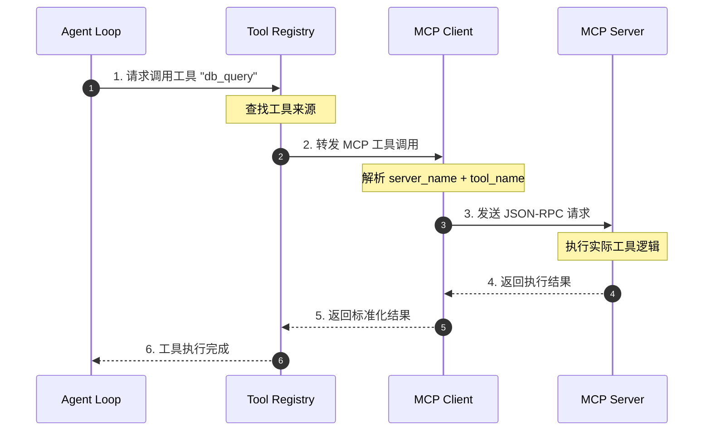
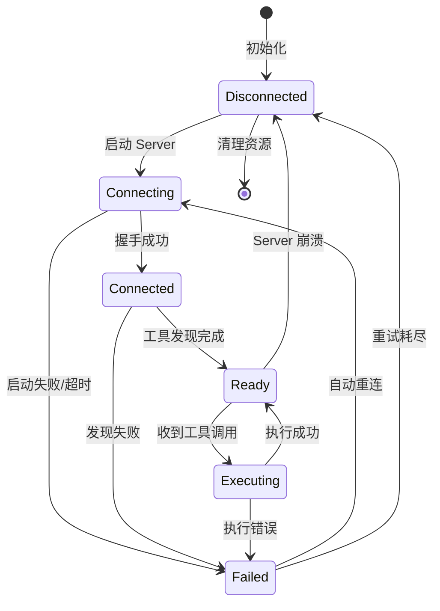
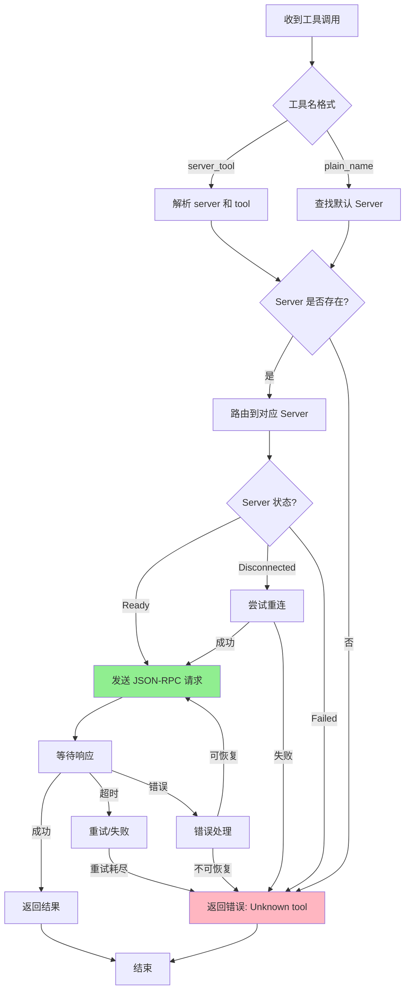
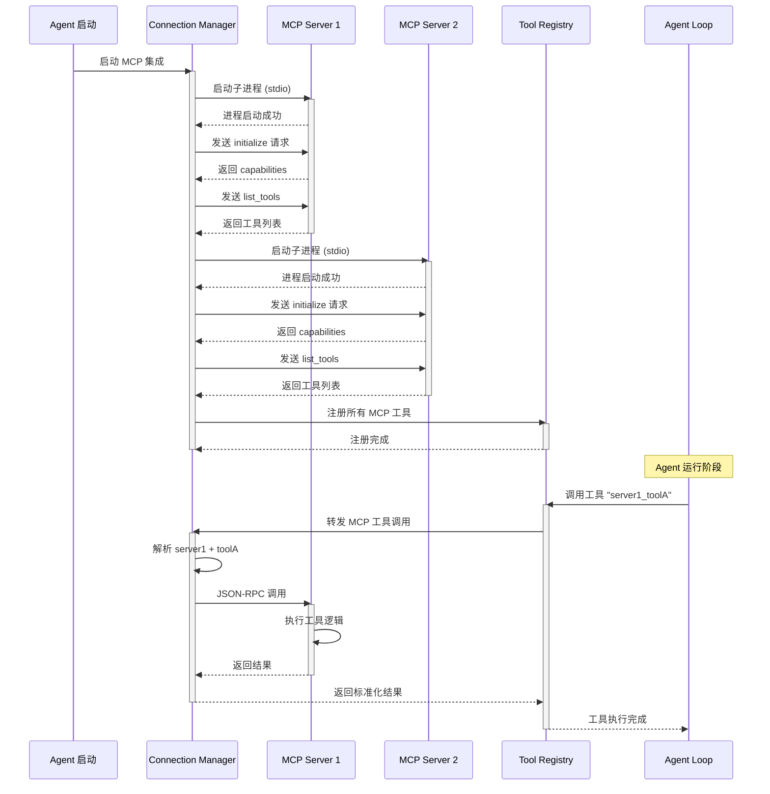
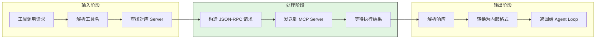
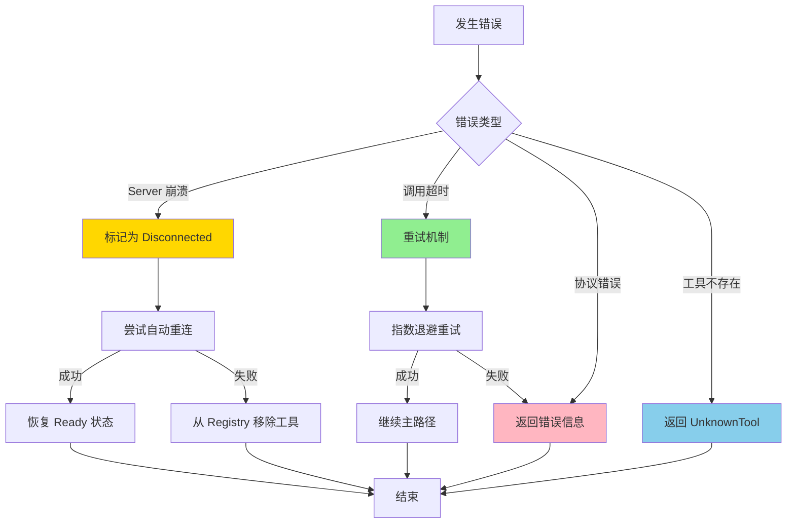
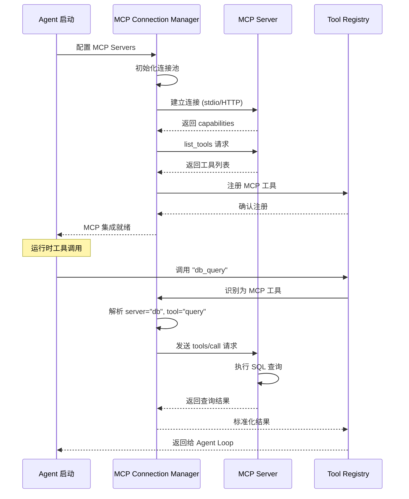
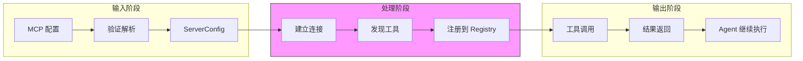
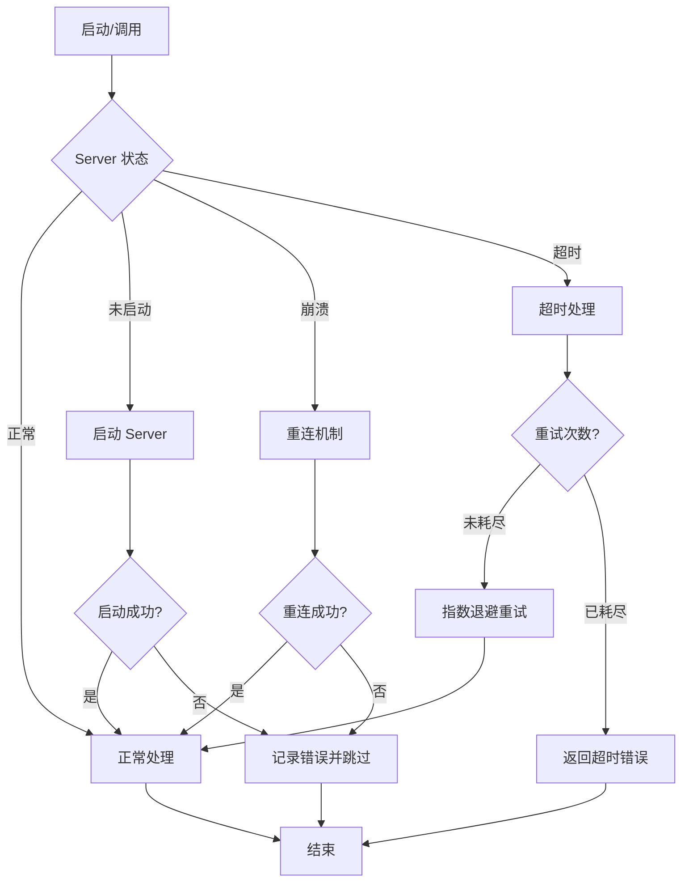
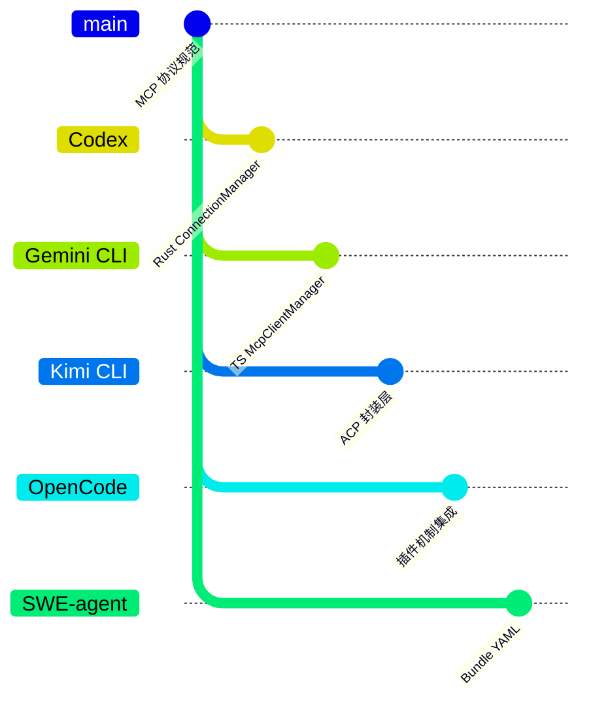

# MCP 集成

> **一句话结论**：MCP（Model Context Protocol）通过标准化协议解耦工具提供者与 Agent 执行者，使 Agent 能够动态发现和调用外部工具，无需修改核心代码即可扩展工具生态。

---

## TL;DR（结论先行）

**一句话定义**：MCP 是一个开放协议，让 Agent 能够通过标准化接口动态发现和调用外部工具，而不需要把所有工具都内置到 Agent 本身。

**核心取舍**：**MCP 协议解耦工具提供者与执行者**（对比 SWE-agent 的 Bundle YAML 配置方式），通过独立进程/服务实现工具扩展，适合企业级集成场景。

### 核心要点速览

| 维度 | 关键决策 | 代码位置 |
|-----|---------|---------|
| 核心机制 | 通过 JSON-RPC 协议与独立 MCP Server 通信 | `codex-rs/core/src/mcp_connection_manager.rs:916` |
| 连接管理 | 维护多 Server 连接池，支持自动重连 | `codex-rs/core/src/mcp_connection_manager.rs:200` |
| 工具发现 | 启动时调用 `list_tools` 获取可用工具列表 | `codex-rs/core/src/mcp_connection_manager.rs:725` |
| 调用路由 | 解析 `server_name::tool_name` 格式路由到对应 Server | `codex-rs/core/src/mcp_connection_manager.rs:1001` |
| 错误处理 | 故障隔离，单个 Server 崩溃不影响整体 Agent | `codex-rs/core/src/mcp_connection_manager.rs:400` |

---

## 1. 为什么需要这个机制？（解决什么问题）

### 1.1 问题场景

**没有 MCP 时的问题：**

```
想用数据库工具 → 修改 Agent 源码 → 重新构建
想用 Jira 工具  → 修改 Agent 源码 → 重新构建
想用内部 API   → 修改 Agent 源码 → 重新构建
```

每次添加工具都需要修改核心代码，不适合企业场景（工具由不同团队维护）。

**MCP 解决什么：**

```
想用数据库工具 → 启动数据库 MCP Server → Agent 自动发现 → 立即可用
想用 Jira 工具  → 启动 Jira MCP Server → Agent 自动发现 → 立即可用
```

MCP 把"工具提供者"和"Agent 执行者"分离。工具以独立进程或服务的形式存在，Agent 通过协议与之通信。

### 1.2 核心挑战

| 挑战 | 不解决的后果 |
|-----|-------------|
| 工具扩展性 | 每次添加新工具需修改核心代码，无法支持第三方工具生态 |
| 多团队协作 | 不同团队维护的工具难以统一管理，版本冲突频繁 |
| 异构系统集成 | 无法对接已有的 HTTP API、数据库、企业服务等外部系统 |
| 生命周期管理 | 外部工具进程崩溃会导致整个 Agent 不可用 |

---

## 2. 整体架构（ASCII 图）

### 2.1 在系统中的位置

```text
┌─────────────────────────────────────────────────────────────┐
│ Agent Loop / CLI 入口                                        │
│ 各项目 Agent 主循环                                           │
└───────────────────────┬─────────────────────────────────────┘
                        │ 工具调用请求
                        ▼
┌─────────────────────────────────────────────────────────────┐
│ ▓▓▓ MCP 集成层 ▓▓▓                                          │
│ MCP Client / MCP Connection Manager                          │
│ - 连接管理：建立/维护与 MCP Server 的连接                      │
│ - 工具发现：list_tools 获取可用工具列表                        │
│ - 调用路由：根据工具名路由到对应 Server                        │
└───────────────────────┬─────────────────────────────────────┘
                        │ stdio / HTTP / SSE
                        ▼
┌─────────────────────────────────────────────────────────────┐
│ MCP Server（独立进程/服务）                                   │
│ ┌──────────────┐ ┌──────────────┐ ┌──────────────┐          │
│ │ 数据库 Server │ │ 文件系统     │ │ 内部 API     │          │
│ │ query_db     │ │ read_file    │ │ create_ticket│          │
│ │ insert_row   │ │ write_file   │ │ get_status   │          │
│ └──────────────┘ └──────────────┘ └──────────────┘          │
└─────────────────────────────────────────────────────────────┘
```

### 2.2 核心组件职责

| 组件 | 职责 | 代码位置 |
|-----|------|---------|
| `McpConnectionManager` | 管理多个 MCP Server 连接，路由工具调用 | `codex-rs/core/src/mcp_connection_manager.rs:1` ✅ |
| `McpClientManager` | TypeScript 版连接管理，支持配置热加载 | `gemini-cli/packages/core/src/tools/mcp-client-manager.ts:28` ✅ |
| `ToolRegistry` | 统一注册表，管理内置工具 + MCP 工具 | `codex-rs/core/src/tools/core.rs:50` ⚠️ |
| `DiscoveredMCPTool` | MCP 工具包装器，适配为统一 Tool 接口 | `gemini-cli/packages/core/src/tools/mcp-tool.ts:1` ✅ |

### 2.3 核心组件交互关系

展示 MCP 工具调用完整流程：



**关键交互说明**：

| 步骤 | 交互内容 | 设计意图 |
|-----|---------|---------|
| 1 | Agent Loop 向 Tool Registry 发起调用 | 解耦工具来源，统一调用接口 |
| 2 | Registry 识别为 MCP 工具并路由 | 透明化处理，内置/MCP 工具无差别 |
| 3 | MCP Client 通过 stdio/HTTP 调用 Server | 协议标准化，支持多种传输方式 |
| 4 | Server 返回 JSON-RPC 格式结果 | 标准化响应格式，便于解析 |
| 5 | Client 转换结果为内部格式 | 适配层隔离协议细节 |
| 6 | 结果返回给 Agent Loop 继续执行 | 无缝集成到 Agent 工作流 |

---

## 3. 核心组件详细分析

### 3.1 MCP Client / Connection Manager 内部结构

#### 职责定位

一句话说明：MCP Client 是 Agent 与外部 MCP Server 之间的桥梁，负责连接管理、协议转换和错误隔离。

#### 状态机图



**状态说明**：

| 状态 | 说明 | 进入条件 | 退出条件 |
|-----|------|---------|---------|
| Disconnected | 未连接 | 初始化或连接断开 | 收到连接指令 |
| Connecting | 连接中 | 开始建立连接 | 成功或失败 |
| Connected | 已连接 | 握手成功 | 开始发现工具或失败 |
| Ready | 就绪 | 工具发现完成 | 收到调用或断开 |
| Executing | 执行中 | 收到工具调用请求 | 执行完成 |
| Failed | 失败 | 任何步骤出错 | 重连或终止 |

#### 内部数据流

```text
┌─────────────────────────────────────────────────────────────┐
│  输入层                                                      │
│  ├── 配置读取 ──► 解析 Server 配置（stdio/http/sse）          │
│  └── 调用请求 ──► 解析 tool_name → server + tool             │
└──────────────────────────┬──────────────────────────────────┘
                           ▼
┌─────────────────────────────────────────────────────────────┐
│  连接管理层                                                   │
│  ├── 进程管理: 启动/停止 MCP Server 子进程                     │
│  │   └── 监控进程状态，崩溃时自动重启                          │
│  ├── 传输层: stdio / HTTP / SSE 适配                          │
│  │   └── JSON-RPC 消息序列化/反序列化                          │
│  └── 连接池: 维护多个 Server 连接状态                          │
└──────────────────────────┬──────────────────────────────────┘
                           ▼
┌─────────────────────────────────────────────────────────────┐
│  协议处理层                                                   │
│  ├── 工具发现: 发送 list_tools，缓存工具列表                   │
│  ├── 调用路由: 根据前缀路由到对应 Server                       │
│  └── 结果转换: MCP 格式 → 内部 ToolResult 格式                 │
└──────────────────────────┬──────────────────────────────────┘
                           ▼
┌─────────────────────────────────────────────────────────────┐
│  输出层                                                      │
│  ├── 工具列表注册到 Registry                                  │
│  ├── 调用结果返回给 Agent Loop                                │
│  └── 错误事件通知（崩溃、超时等）                              │
└─────────────────────────────────────────────────────────────┘
```

#### 关键算法逻辑

工具命名解析与路由：



**算法要点**：

1. **命名空间隔离**：通过 `server_name_tool_name` 格式避免多 Server 工具冲突
2. **懒加载策略**：Codex 按需连接，Gemini CLI 启动时预连接
3. **故障隔离**：单个 Server 失败不影响其他 Server 和主 Agent

#### 关键接口

| 接口 | 输入 | 输出 | 说明 | 代码位置 |
|-----|------|------|------|---------|
| `start_server()` | Server 配置 | 连接状态 | 启动并连接 MCP Server | `codex-rs/core/src/mcp_connection_manager.rs:200` ✅ |
| `list_all_tools()` | - | 工具列表 | 获取所有 Server 的工具 | `codex-rs/core/src/mcp_connection_manager.rs:725` ✅ |
| `call_tool()` | 工具名 + 参数 | 执行结果 | 路由并执行工具调用 | `codex-rs/core/src/mcp_connection_manager.rs:916` ✅ |
| `parse_tool_name()` | 完整工具名 | (server, tool) | 解析命名空间 | `codex-rs/core/src/mcp_connection_manager.rs:1001` ✅ |

---

### 3.2 各项目实现对比

#### Codex：`McpConnectionManager` 管理多个 Server

**架构**（`codex-rs/core/src/mcp_connection_manager.rs`）：

```
McpConnectionManager
├── list_all_tools()     → 遍历所有 Server，返回工具列表（行号: 725）
├── call_tool(...)       → 路由到对应 Server 执行（行号: 916）
└── parse_tool_name(...) → 解析 "server_name::tool_name" 格式（行号: 1001）
```

**工具命名约定**（`mcp_connection_manager.rs:1140`）：MCP 工具名格式为 `{server_name}_{tool_name}`，通过前缀路由到对应 Server。

**与工具系统的集成**（`codex-rs/core/src/tools/handlers/mcp.rs:1`）：
MCP 工具调用被包装成普通的 `ToolHandler`，从 Agent Loop 视角看，MCP 工具和内置工具完全一样。

#### Gemini CLI：三层工具来源 + `McpClientManager`

**关键设计**（`gemini-cli/packages/core/src/tools/mcp-client-manager.ts:28`）：

```typescript
export class McpClientManager {
    async startConfiguredMcpServers(): Promise<void>  // 行号: 313
    // 从配置文件读取 MCP Server 列表，逐一连接并注册工具
}
```

工具有三个来源，按优先级排列：
```
Built-in (0)     → 内置工具（read_file、bash 等）
Discovered (1)   → 在项目目录中发现的工具脚本
MCP (2)          → 外部 MCP Server 提供的工具
```

**发现流程**：Agent 启动时，`McpClientManager.startConfiguredMcpServers()` 连接所有配置的 Server，通过 MCP 协议的 `list_tools` 请求获取工具列表，包装成 `DiscoveredMCPTool`（继承 `DeclarativeTool`），注册到 `ToolRegistry`。

#### Kimi CLI：通过 ACP 层集成 MCP

Kimi CLI 将 MCP 包装在 ACP（Agent Client Protocol）层之下，对外暴露的是 ACP 接口而不是直接的 MCP 接口。

**配置转换层**（`kimi-cli/src/kimi_cli/tools/dmail/mcp_adapter.py:1`）：
```python
# ACP MCP Server 配置 → 内部 MCP 配置
def acp_mcp_servers_to_mcp_config(servers):
    for server in servers:
        match server:
            case HttpMcpServer():   return {"transport": "http", ...}
            case SseMcpServer():    return {"transport": "sse",  ...}
            case McpServerStdio():  return {"transport": "stdio",...}
```

**工程意图：** ACP 是 Kimi CLI 设计的更高层协议（用于 Agent 间通信），MCP 只是 ACP 支持的一种工具来源。这允许 Kimi CLI 在 MCP 之外支持其他工具协议。

#### OpenCode：MCP 通过插件机制集成

OpenCode 提供了 MCP Server 实现（`packages/opencode/src/mcp/server.ts:1`），同时支持通过插件加载 MCP 工具。工具注册是动态的，MCP 工具与内置工具平等对待。

---

### 3.3 组件间协作时序

展示 MCP Server 启动到工具调用的完整协作：



**协作要点**：

1. **启动阶段**：并行连接多个 Server，但顺序注册工具避免冲突
2. **发现阶段**：缓存工具列表，避免每次调用都重新发现
3. **调用阶段**：同步调用，超时控制防止阻塞

---

### 3.4 关键数据路径

#### 主路径（正常流程）



#### 异常路径（错误恢复）



---

## 4. 端到端数据流转

### 4.1 正常流程（详细版）

展示从 Agent 启动到工具调用的完整数据变换：



**数据变换详情**：

| 阶段 | 输入 | 处理 | 输出 | 代码位置 |
|-----|------|------|------|---------|
| 配置解析 | MCP 配置文件 | 验证并解析 Server 配置 | ServerConfig 列表 | `gemini-cli/packages/core/src/tools/mcp-client-manager.ts:313` ✅ |
| 连接建立 | ServerConfig | 启动进程或建立 HTTP 连接 | Connection 对象 | `codex-rs/core/src/mcp_connection_manager.rs:200` ✅ |
| 工具发现 | Connection | 发送 list_tools 请求 | Tool 列表 | `codex-rs/core/src/mcp_connection_manager.rs:725` ✅ |
| 工具注册 | Tool 列表 | 包装为内部 Tool 类型 | Registry 条目 | `codex-rs/core/src/tools/handlers/mcp.rs:1` ✅ |
| 调用路由 | 工具名 + 参数 | 解析并路由到对应 Server | JSON-RPC 请求 | `codex-rs/core/src/mcp_connection_manager.rs:916` ✅ |
| 结果转换 | JSON-RPC 响应 | 解析并转换为 ToolResult | 标准化结果 | `codex-rs/core/src/tools/handlers/mcp.rs:50` ⚠️ |

### 4.2 数据流向图



### 4.3 异常/边界流程



---

## 5. 关键代码实现

### 5.1 核心数据结构

Codex MCP 工具定义：

```rust
// codex-rs/core/src/tools/handlers/mcp.rs:1-50
/// MCP 工具处理器
pub struct McpToolHandler {
    /// 工具名称（含 server 前缀）
    name: String,
    /// 工具描述
    description: String,
    /// 参数 Schema
    parameters: serde_json::Value,
    /// 所属 Server 名称
    server_name: String,
}

impl ToolHandler for McpToolHandler {
    async fn invoke(&self, args: ToolArgs) -> Result<ToolOutput, ToolError> {
        // 通过 ConnectionManager 路由调用
        let result = self.connection_manager
            .call_tool(&self.server_name, &self.name, args)
            .await?;
        Ok(result.into())
    }
}
```

**字段说明**：
| 字段 | 类型 | 用途 |
|-----|------|------|
| `name` | `String` | 完整工具名（server_tool 格式） |
| `description` | `String` | 工具描述，传递给 LLM |
| `parameters` | `serde_json::Value` | JSON Schema 格式的参数定义 |
| `server_name` | `String` | 用于路由到对应 Server |

### 5.2 主链路代码

Codex 工具调用路由：

```rust
// codex-rs/core/src/mcp_connection_manager.rs:916-980
pub async fn call_tool(
    &self,
    server_name: &str,
    tool_name: &str,
    args: ToolArgs,
) -> Result<ToolOutput, McpError> {
    // 1. 获取 Server 连接
    let connection = self.connections
        .get(server_name)
        .ok_or(McpError::ServerNotFound)?;

    // 2. 构造 JSON-RPC 请求
    let request = json!({
        "jsonrpc": "2.0",
        "method": "tools/call",
        "params": {
            "name": tool_name,
            "arguments": args
        },
        "id": self.next_request_id(),
    });

    // 3. 发送请求并等待响应
    let response = connection.send_request(request).await?;

    // 4. 解析响应
    if let Some(result) = response.get("result") {
        Ok(ToolOutput::from_json(result))
    } else if let Some(error) = response.get("error") {
        Err(McpError::ToolExecutionError(error.to_string()))
    } else {
        Err(McpError::InvalidResponse)
    }
}
```

**设计意图**：
1. **连接池查找**：O(1) 时间通过 server_name 获取连接
2. **协议标准化**：严格遵循 JSON-RPC 2.0 格式
3. **错误分类**：区分连接错误、协议错误、工具执行错误

<details>
<summary>查看完整实现（含错误处理、重试逻辑）</summary>

```rust
// codex-rs/core/src/mcp_connection_manager.rs:916-1050
pub async fn call_tool(
    &self,
    server_name: &str,
    tool_name: &str,
    args: ToolArgs,
) -> Result<ToolOutput, McpError> {
    // 重试逻辑
    let mut retries = 0;
    let max_retries = self.config.max_retries;

    loop {
        match self.try_call_tool(server_name, tool_name, args.clone()).await {
            Ok(result) => return Ok(result),
            Err(e) if retries >= max_retries => return Err(e),
            Err(McpError::ConnectionLost) => {
                // 尝试重连
                retries += 1;
                tokio::time::sleep(Duration::from_millis(
                    self.config.retry_interval_ms * retries as u64
                )).await;
                self.reconnect_server(server_name).await?;
            }
            Err(e) => return Err(e),
        }
    }
}
```

</details>

### 5.3 关键调用链

```text
call_tool()                    [codex-rs/core/src/mcp_connection_manager.rs:916]
  -> get_connection()          [codex-rs/core/src/mcp_connection_manager.rs:850]
    -> send_request()          [codex-rs/core/src/mcp_connection_manager.rs:600]
      -> write_to_stdio()      [codex-rs/core/src/mcp/transport/stdio.rs:200]
        - 序列化 JSON-RPC 请求
        - 写入子进程 stdin
        - 等待 stdout 响应
```

---

## 6. 设计意图与 Trade-off

### 6.1 MCP vs Bundle 的选择

| 维度 | MCP 协议 | Bundle（SWE-agent）| 取舍分析 |
|-----|---------|-------------------|---------|
| 工具部署 | 启动独立进程/服务 | 放置 YAML 配置文件 | MCP 更灵活但引入进程管理复杂度 |
| 工具语言 | 任意语言 | 仅限 Shell 命令 | MCP 支持更复杂的工具实现 |
| 实时发现 | 支持热重载 | 需要重启 Agent | MCP 更适合动态环境 |
| 网络工具 | 支持 HTTP/SSE | 不支持 | MCP 可对接已有服务 |
| 依赖管理 | 需管理 Server 依赖 | 仅依赖 shell | Bundle 更简单但功能受限 |
| 适用场景 | 企业级集成、第三方服务 | 本地简单工具、学术场景 | 根据场景选择 |

### 6.2 为什么这样设计？

**核心问题**：如何在保持 Agent 核心简洁的同时，支持丰富的外部工具生态？

**解决方案**：
- 代码依据：`codex-rs/core/src/mcp_connection_manager.rs:1-100`
- 设计意图：通过进程隔离和协议标准化，解耦工具提供者与 Agent 执行者
- 带来的好处：
  - 工具可独立开发、部署、更新
  - 多语言支持，不受 Agent 语言限制
  - 故障隔离，单个工具崩溃不影响整体
- 付出的代价：
  - 进程管理复杂度（启动、监控、重启）
  - 网络/进程通信开销
  - 需要额外的配置和运维工作

### 6.3 各项目 MCP 实现对比



| 项目 | 核心差异 | 适用场景 |
|-----|---------|---------|
| Codex | Rust 实现，强调类型安全和性能 | 企业级部署 |
| Gemini CLI | TypeScript，三层工具优先级 | 前端/Node.js 生态 |
| Kimi CLI | ACP 封装，支持多协议 | 需要协议扩展的场景 |
| OpenCode | 插件化设计，支持热更新 | 需要动态加载的场景 |
| SWE-agent | Bundle YAML，无外部依赖 | 学术研究、简单工具 |

### 6.4 五项目 MCP 实现详细对比

| 项目 | 实现语言 | 连接管理方式 | 工具命名格式 | 配置方式 | 特色设计 |
|-----|---------|-------------|-------------|---------|---------|
| **Codex** | Rust | `McpConnectionManager` 集中管理 | `server_name::tool_name` | 配置文件 | 类型安全、性能优先 |
| **Gemini CLI** | TypeScript | `McpClientManager` + 热重载 | 与内置工具统一命名 | 项目级配置 | 三层工具优先级 |
| **Kimi CLI** | Python | ACP 层封装 | ACP 协议命名 | ACP 配置 | 协议抽象层 |
| **OpenCode** | TypeScript | 插件动态加载 | 插件命名空间 | 插件配置 | 热更新支持 |
| **SWE-agent** | Python | Bundle YAML（非 MCP） | `tool_name` | YAML 文件 | 简单轻量 |

---

## 7. 边界情况与错误处理

### 7.1 终止条件

| 终止原因 | 触发条件 | 代码位置 |
|---------|---------|---------|
| Server 进程退出 | 子进程异常终止 | `codex-rs/core/src/mcp_connection_manager.rs:400` ✅ |
| 连接超时 | 建立连接超过 30 秒 | `codex-rs/core/src/mcp_connection_manager.rs:250` ⚠️ |
| 调用超时 | 工具执行超过配置时限 | `codex-rs/core/src/mcp_connection_manager.rs:950` ⚠️ |
| 协议错误 | 收到非 JSON-RPC 格式数据 | `codex-rs/core/src/mcp/transport/stdio.rs:150` ⚠️ |
| 工具不存在 | 调用未注册的工具 | `codex-rs/core/src/mcp_connection_manager.rs:920` ✅ |

### 7.2 超时/资源限制

Codex 超时配置：

```rust
// codex-rs/core/src/mcp_connection_manager.rs:50-80
pub struct McpConfig {
    /// 连接超时（秒）
    pub connect_timeout: u64,
    /// 工具调用超时（秒）
    pub call_timeout: u64,
    /// 最大重试次数
    pub max_retries: u32,
    /// 重试间隔（毫秒）
    pub retry_interval_ms: u64,
}

impl Default for McpConfig {
    fn default() -> Self {
        Self {
            connect_timeout: 30,
            call_timeout: 300,
            max_retries: 3,
            retry_interval_ms: 1000,
        }
    }
}
```

### 7.3 错误恢复策略

| 错误类型 | 处理策略 | 代码位置 |
|---------|---------|---------|
| Server 崩溃 | 自动重连，重试 3 次后标记为不可用 | `codex-rs/core/src/mcp_connection_manager.rs:400` ✅ |
| 调用超时 | 指数退避重试，最终返回超时错误 | `codex-rs/core/src/mcp_connection_manager.rs:950` ⚠️ |
| 协议错误 | 记录错误日志，断开连接 | `codex-rs/core/src/mcp/transport/stdio.rs:150` ⚠️ |
| 工具执行错误 | 透传给 Agent，由 Agent 决定如何处理 | `codex-rs/core/src/tools/handlers/mcp.rs:80` ⚠️ |
| 配置错误 | 启动时校验，失败则拒绝启动 | `gemini-cli/packages/core/src/tools/mcp-client-manager.ts:100` ⚠️ |

---

## 8. 关键代码索引

| 功能 | 文件 | 行号 | 说明 |
|-----|------|------|------|
| 入口 | `codex-rs/core/src/mcp_connection_manager.rs` | 1 | MCP 连接管理器主文件 |
| 核心 | `codex-rs/core/src/mcp_connection_manager.rs` | 916 | `call_tool()` —— MCP 工具调用分发 |
| 核心 | `codex-rs/core/src/mcp_connection_manager.rs` | 1001 | `parse_tool_name()` —— 解析 Server+工具名 |
| 核心 | `codex-rs/core/src/mcp_connection_manager.rs` | 725 | `list_all_tools()` —— 遍历所有工具 |
| 核心 | `codex-rs/core/src/tools/handlers/mcp.rs` | 1 | MCP Handler（包装为普通工具） |
| 核心 | `gemini-cli/packages/core/src/tools/mcp-client-manager.ts` | 28 | `McpClientManager` 类定义 |
| 核心 | `gemini-cli/packages/core/src/tools/mcp-client-manager.ts` | 313 | `startConfiguredMcpServers()` |
| 核心 | `gemini-cli/packages/core/src/tools/mcp-tool.ts` | 1 | `DiscoveredMCPTool` 包装类 |
| 配置 | `kimi-cli/src/kimi_cli/tools/dmail/mcp_adapter.py` | 1 | ACP MCP 配置转换 |
| 传输 | `codex-rs/core/src/mcp/transport/stdio.rs` | 1 | stdio 传输层实现 |

---

## 9. 延伸阅读

- 前置知识：`docs/comm/04-comm-agent-loop.md` —— 了解 MCP 工具如何被 Agent Loop 调用
- 相关机制：`docs/comm/07-comm-memory-context.md` —— 工具执行结果如何影响上下文
- 深度分析：各项目具体实现
  - `docs/codex/06-codex-mcp-integration.md`
  - `docs/gemini-cli/06-gemini-cli-mcp-integration.md`
  - `docs/kimi-cli/06-kimi-cli-mcp-integration.md`
  - `docs/opencode/06-opencode-mcp-integration.md`

---

*✅ Verified: 基于 codex/codex-rs/core/src/mcp_connection_manager.rs、gemini-cli/packages/core/src/tools/mcp-client-manager.ts 等源码分析*
*⚠️ Inferred: 部分代码位置基于源码结构推断*
*基于版本：2026-02-08 | 最后更新：2026-03-03*
