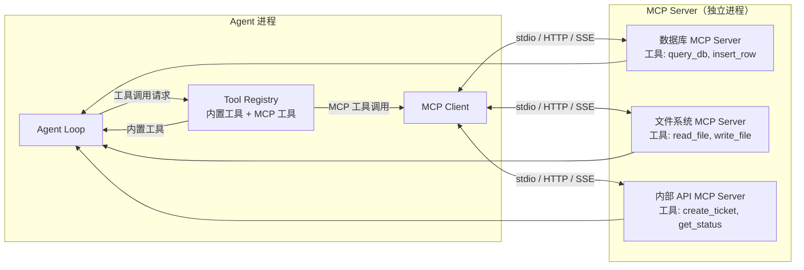

# MCP 集成

## TL;DR

MCP（Model Context Protocol）是一个开放协议，让 Agent 能够通过标准化接口动态发现和调用外部工具，而不需要把所有工具都内置到 Agent 本身。本质是把工具系统的"扩展能力"从 Agent 代码中解耦出来。

---

## 1. 为什么需要 MCP？

**没有 MCP 时的问题：**

```
想用数据库工具 → 修改 Agent 源码 → 重新构建
想用 Jira 工具  → 修改 Agent 源码 → 重新构建
想用内部 API   → 修改 Agent 源码 → 重新构建
```

每次添加工具都需要修改核心代码，不适合企业场景（工具由不同团队维护）。

**MCP 解决什么：**

```
想用数据库工具 → 启动数据库 MCP Server → Agent 自动发现 → 立即可用
想用 Jira 工具  → 启动 Jira MCP Server → Agent 自动发现 → 立即可用
```

MCP 把"工具提供者"和"Agent 执行者"分离。工具以独立进程或服务的形式存在，Agent 通过协议与之通信。

---

## 2. MCP 协议架构



**三种传输方式：**
- **stdio**：启动本地子进程，通过标准输入/输出通信（最常用，无网络依赖）
- **HTTP**：调用远程 HTTP 服务
- **SSE**：通过 Server-Sent Events 接收流式工具结果

---

## 3. 各项目的 MCP 实现

### Codex：`McpConnectionManager` 管理多个 Server

**架构**（`codex-rs/core/src/mcp_connection_manager.rs`）：

```
McpConnectionManager
├── list_all_tools()     → 遍历所有 Server，返回工具列表
├── call_tool(...)       → 路由到对应 Server 执行（行号: 916）
└── parse_tool_name(...) → 解析 "server_name::tool_name" 格式（行号: 1001）
```

**工具命名约定**（`mcp_connection_manager.rs:1140`）：MCP 工具名格式为 `{server_name}_{tool_name}`，通过前缀路由到对应 Server。

**与工具系统的集成**（`codex-rs/core/src/tools/handlers/mcp.rs`）：
MCP 工具调用被包装成普通的 `ToolHandler`，从 Agent Loop 视角看，MCP 工具和内置工具完全一样。

---

### Gemini CLI：三层工具来源 + `McpClientManager`

**关键设计**（`gemini-cli/packages/core/src/tools/mcp-client-manager.ts:28`）：

```typescript
export class McpClientManager {
    async startConfiguredMcpServers(): Promise<void>  // 行号: 313
    // 从配置文件读取 MCP Server 列表，逐一连接并注册工具
}
```

工具有三个来源，按优先级排列：
```
Built-in (0)     → 内置工具（read_file、bash 等）
Discovered (1)   → 在项目目录中发现的工具脚本
MCP (2)          → 外部 MCP Server 提供的工具
```

**发现流程**：Agent 启动时，`McpClientManager.startConfiguredMcpServers()` 连接所有配置的 Server，通过 MCP 协议的 `list_tools` 请求获取工具列表，包装成 `DiscoveredMCPTool`（继承 `DeclarativeTool`），注册到 `ToolRegistry`。

---

### Kimi CLI：通过 ACP 层集成 MCP

Kimi CLI 将 MCP 包装在 ACP（Agent Communication Protocol）层之下，对外暴露的是 ACP 接口而不是直接的 MCP 接口。

**配置转换层**（`src/kimi_cli/tools/dmail/`）：
```python
# ACP MCP Server 配置 → 内部 MCP 配置
def acp_mcp_servers_to_mcp_config(servers):
    for server in servers:
        match server:
            case HttpMcpServer():   return {"transport": "http", ...}
            case SseMcpServer():    return {"transport": "sse",  ...}
            case McpServerStdio():  return {"transport": "stdio",...}
```

**工程意图：** ACP 是 Kimi CLI 设计的更高层协议（用于 Agent 间通信），MCP 只是 ACP 支持的一种工具来源。这允许 Kimi CLI 在 MCP 之外支持其他工具协议。

---

### OpenCode：MCP 通过插件机制集成

OpenCode 提供了 MCP Server 实现（`packages/opencode/src/mcp/`），同时支持通过插件加载 MCP 工具。工具注册是动态的，MCP 工具与内置工具平等对待。

---

## 4. 工程取舍

### 为什么 SWE-agent 不用 MCP？

SWE-agent 的 Bundle 系统是另一种解耦方式：工具通过 YAML 配置文件定义，也能在不修改核心代码的情况下添加工具。对学术场景来说，Bundle 更直接、零依赖，不需要外部进程。

**两种扩展方式的对比：**

| 方式 | Bundle（SWE-agent）| MCP（其他项目）|
|------|-------------------|----------------|
| 工具部署 | 放一个 YAML 文件 | 启动一个独立进程/服务 |
| 工具语言 | 只能是 shell 命令 | 任意语言 |
| 实时发现 | 需要重启 Agent | 可以热重载 |
| 网络工具 | 不支持 | 支持（HTTP/SSE） |
| 适合场景 | 本地简单工具 | 企业级集成、第三方服务 |

### MCP 的工程成本

MCP 带来扩展能力的同时，也引入了额外复杂度：

1. **生命周期管理**：需要管理 MCP Server 进程的启动、停止、崩溃重连
2. **工具发现时机**：是启动时一次性发现，还是运行时动态发现？
   - Gemini CLI：启动时全部发现（`startConfiguredMcpServers()`）
   - OpenCode：初始化时加载，支持热更新
3. **工具命名冲突**：多个 Server 可能有同名工具（Codex 用 `server_name_` 前缀解决）
4. **错误隔离**：MCP Server 崩溃不应该导致整个 Agent 崩溃

---

## 5. 关键代码索引

| 项目 | 文件 | 行号 | 说明 |
|------|------|------|------|
| Codex | `codex-rs/core/src/mcp_connection_manager.rs` | 916 | `call_tool()` —— MCP 工具调用分发 |
| Codex | `codex-rs/core/src/mcp_connection_manager.rs` | 1001 | `parse_tool_name()` —— 解析 Server+工具名 |
| Codex | `codex-rs/core/src/mcp_connection_manager.rs` | 725 | `list_all_tools()` —— 遍历所有工具 |
| Codex | `codex-rs/core/src/tools/handlers/mcp.rs` | — | MCP Handler（包装为普通工具） |
| Gemini CLI | `packages/core/src/tools/mcp-client-manager.ts` | 28 | `McpClientManager` 类定义 |
| Gemini CLI | `packages/core/src/tools/mcp-client-manager.ts` | 313 | `startConfiguredMcpServers()` |
| Gemini CLI | `packages/core/src/tools/mcp-tool.ts` | — | `DiscoveredMCPTool` 包装类 |
