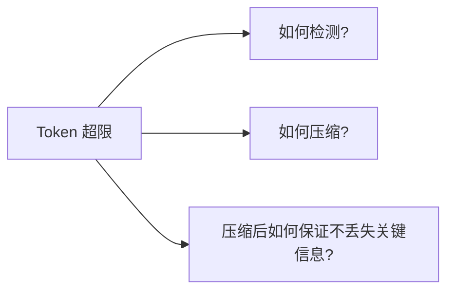
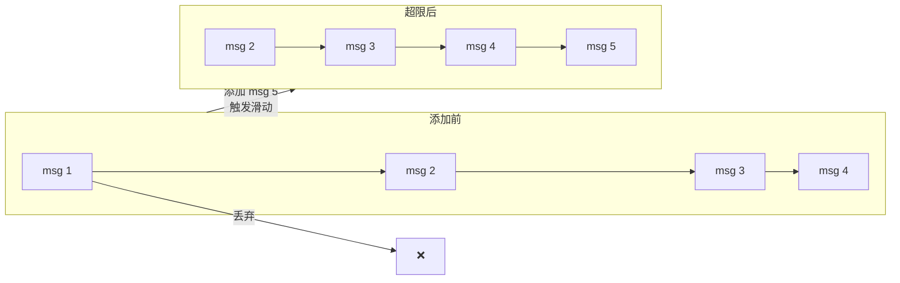
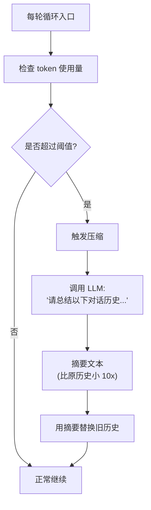
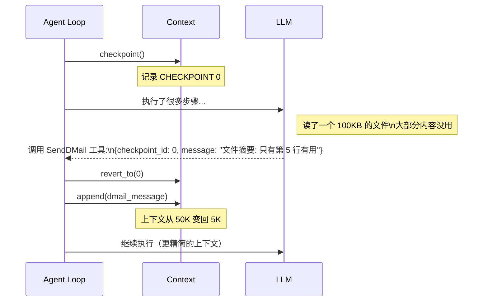
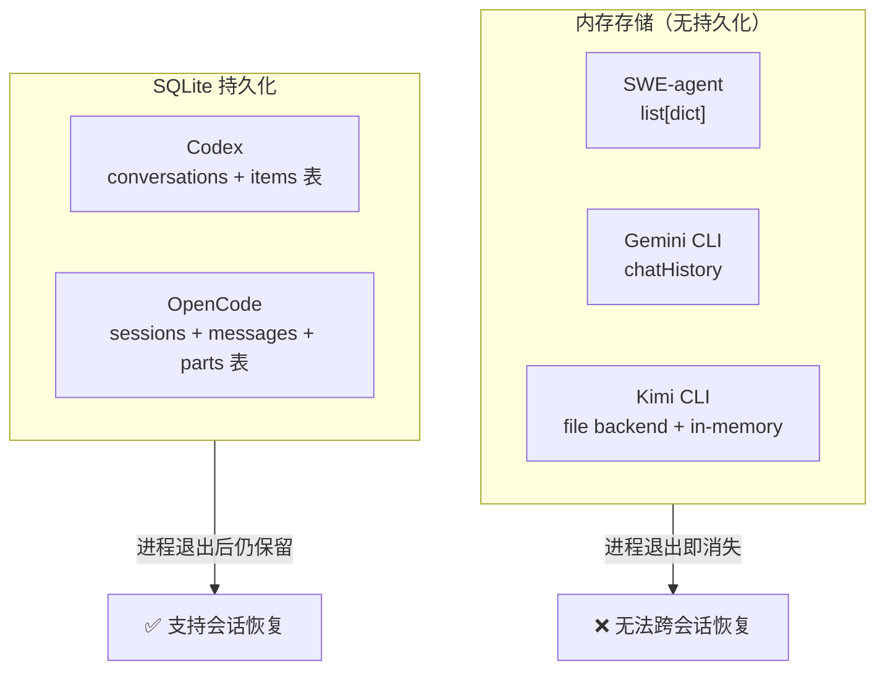

# 记忆与上下文管理

## TL;DR

LLM 的"记忆"就是每次调用时传入的消息历史。上下文管理的核心问题是：token 有上限，历史会越来越长，必须设计策略应对溢出。五个项目提供了三种截然不同的策略：**滑动窗口**（最简单）、**动态压缩**（LLM 自己做摘要）、**Checkpoint 回滚**（LLM 主动截断冗余）。

---

## 1. 为什么上下文管理是个难题

### Token 窗口限制

LLM 每次调用都有 token 上限（比如 128K tokens）。随着任务执行，消息历史不断累积：

```
初始状态:
[系统提示(2K)] [用户消息(0.5K)]  → 总计 2.5K，远低于限制

执行 20 步后:
[系统提示(2K)] [消息历史(50K)] [工具结果(30K)]  → 总计 82K，接近上限

执行 40 步后:
[系统提示(2K)] [消息历史(100K)] [工具结果(60K)] → 总计 162K，超出限制！
```

**超出限制的后果：** LLM 调用直接失败，或被强制截断（丢失重要上下文）。

### 上下文管理的三个核心问题



---

## 2. 三种主流策略

### 策略一：滑动窗口（SWE-agent / Codex）

**最简单**的方案：只保留最近的 N 条消息，旧的直接丢弃。



**SWE-agent 实现**（`sweagent/agent/agents.py:390`）：
- 依赖模型层（OpenAI API）处理 token 截断，自身不做显式压缩
- `history` 是 Python list，线性追加

**Codex 实现**：
- 使用 SQLite 持久化消息（`codex-rs/core/src/tools/`），支持会话恢复
- 同样依赖模型的 context window 管理，不做主动压缩

**适用场景：** 短任务、每次任务相对独立、不需要长期记忆  
**风险：** 丢弃旧消息可能丢失关键约束或早期决策

---

### 策略二：动态压缩（Gemini CLI / OpenCode）

**当上下文快满时，触发 LLM 自动生成摘要，替换掉详细历史。**



**Gemini CLI 实现**（`gemini-cli/packages/core/src/core/client.ts:577`）：

```typescript
// 每轮推理前检查
const compressed = await this.tryCompressChat(prompt_id, false);
if (compressed.compressionStatus === CompressionStatus.COMPRESSED) {
    yield { type: GeminiEventType.ChatCompressed, value: compressed };
}

// 还有另一层保险：遮罩大体积工具输出
await this.tryMaskToolOutputs(this.getHistory());  // client.ts:586
```

`tryCompressChat()` 在 `client.ts:1045`，调用 `compressionService.compress()` 生成摘要。

**OpenCode 实现**（`opencode/packages/opencode/src/session/compaction.ts:32`）：

```typescript
// 判断是否超限
export async function isOverflow(input: { tokens, model }) {
    const reserved = config.compaction?.reserved
        ?? Math.min(COMPACTION_BUFFER, maxOutputTokens(input.model))
    return input.tokens.total >= (model.contextWindow - reserved)
}
```

OpenCode 还有额外的 `prune()` 策略（`compaction.ts:58`）：不触发全量摘要，而是从后往前扫描工具输出，把超过 40K token 的部分标记为"已压缩"，保留消息结构但截断内容。

**两者的关键差异：**
- Gemini CLI：调用独立 LLM 生成摘要（需要额外 API 调用，但摘要质量更好）
- OpenCode：先 prune（快速截断），再用专用 `compaction` Agent 生成结构化摘要（`compaction.ts:109`）

---

### 策略三：Checkpoint + D-Mail 回滚（Kimi CLI）

**最独特的策略：让 LLM 自己决定"哪些历史可以丢"，主动发送回滚信号。**



**关键代码位置：**
- `context.py:68`：`checkpoint()` —— 在历史中插入 `CHECKPOINT N` 标记
- `context.py:80`：`revert_to(checkpoint_id)` —— 截断到指定检查点
- `denwarenji.py:8`：`DMail` 结构体 —— LLM 调用的 D-Mail 工具参数

**D-Mail 的工程意图**（`kimi-cli/src/kimi_cli/tools/dmail/dmail.md`）：
> "Unlike D-Mail in Steins;Gate, the D-Mail you send here will not revert the filesystem or any external state. You are basically **folding the recent messages in your context into a single message**."

即：文件系统修改不回滚，只有 **LLM 看到的历史** 被压缩。这是"逻辑回滚"而非"物理回滚"。

**适用场景：** 长任务中有明确的"探索—确认"模式（先探索多个方向，发现有用信息后，抛弃探索过程，只保留结论）。

---

## 3. 存储方式对比

上下文管理还涉及持久化：任务中断后能否恢复？



**Kimi CLI 的特殊机制**（`context.py:17`）：使用文件作为"弱持久化"后端，每次操作 append-only 写入日志文件，支持 `restore()` 从文件重建历史（`context.py:24`）。既不是纯内存，也不是完整 SQLite，是轻量的中间方案。

---

## 4. 核心工程取舍对比

| 维度 | 滑动窗口 | 动态压缩 | Checkpoint 回滚 |
|------|----------|----------|-----------------|
| **实现复杂度** | 低 | 中 | 高 |
| **信息损失** | 高（整条消息丢弃） | 中（摘要质量取决于 LLM） | 低（LLM 自己选择保留什么） |
| **额外 API 调用** | 无 | 有（压缩需要 LLM） | 有（D-Mail 也是工具调用） |
| **适合任务类型** | 短任务、独立任务 | 长任务、通用 | 探索性长任务 |
| **调试友好度** | 高 | 中 | 低（需要理解回滚逻辑） |

**选择参考：**
- 做快速原型或短任务 → 滑动窗口（SWE-agent 风格）
- 需要长上下文支持但不想复杂化 → 动态压缩（Gemini CLI 风格）
- 任务有大量探索阶段（读文件、搜索、尝试方案）→ Checkpoint 回滚（Kimi CLI 风格）

---

## 5. 关键代码索引

| 项目 | 文件 | 行号 | 说明 |
|------|------|------|------|
| SWE-agent | `sweagent/agent/agents.py` | 390 | 历史追加（`history.append()`） |
| Kimi CLI | `src/kimi_cli/soul/context.py` | 16 | `Context` 类 —— 上下文管理核心 |
| Kimi CLI | `src/kimi_cli/soul/context.py` | 68 | `checkpoint()` —— 创建检查点 |
| Kimi CLI | `src/kimi_cli/soul/context.py` | 80 | `revert_to()` —— 回滚到检查点 |
| Kimi CLI | `src/kimi_cli/soul/denwarenji.py` | 8 | `DMail` —— D-Mail 数据结构 |
| Gemini CLI | `packages/core/src/core/client.ts` | 577 | `tryCompressChat()` 触发点 |
| Gemini CLI | `packages/core/src/core/client.ts` | 586 | `tryMaskToolOutputs()` —— 输出遮罩 |
| Gemini CLI | `packages/core/src/core/client.ts` | 1045 | `tryCompressChat()` 实现 |
| OpenCode | `packages/opencode/src/session/compaction.ts` | 32 | `isOverflow()` —— 溢出检测 |
| OpenCode | `packages/opencode/src/session/compaction.ts` | 58 | `prune()` —— 工具输出裁剪 |
| OpenCode | `packages/opencode/src/session/compaction.ts` | 109 | compaction agent 触发 |
