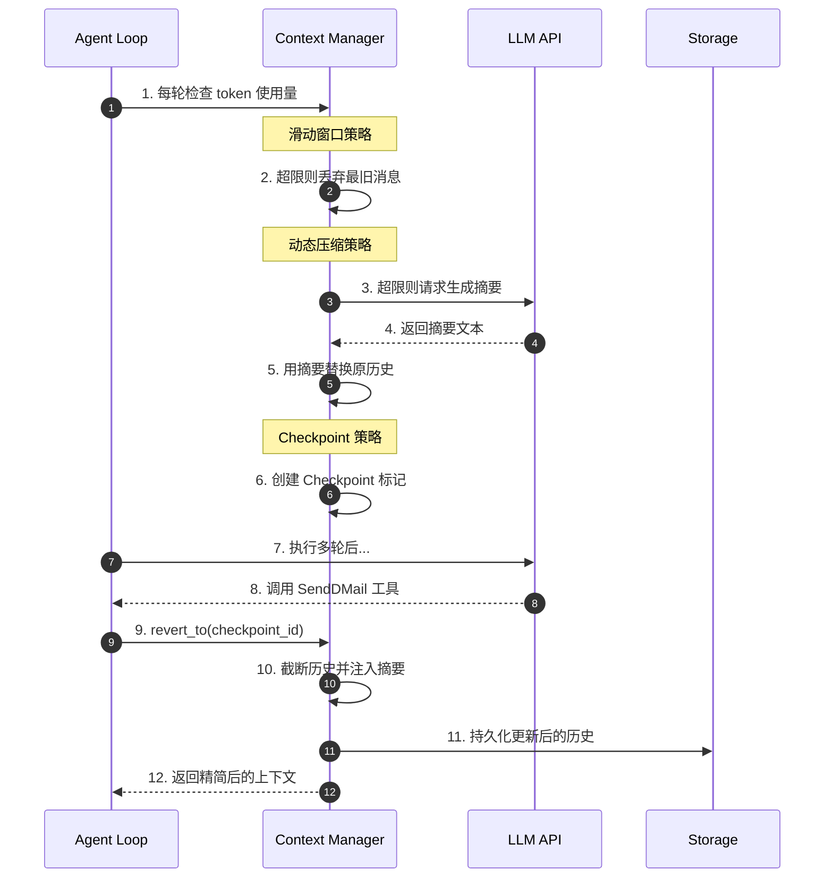
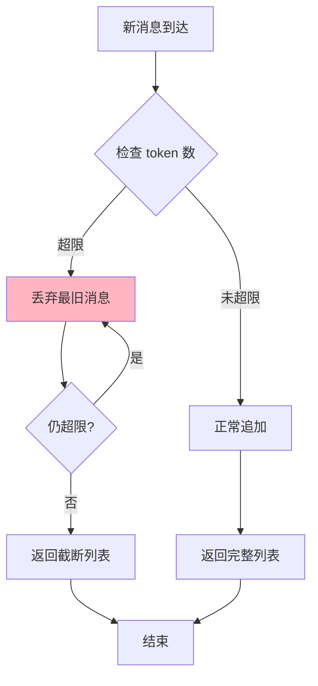
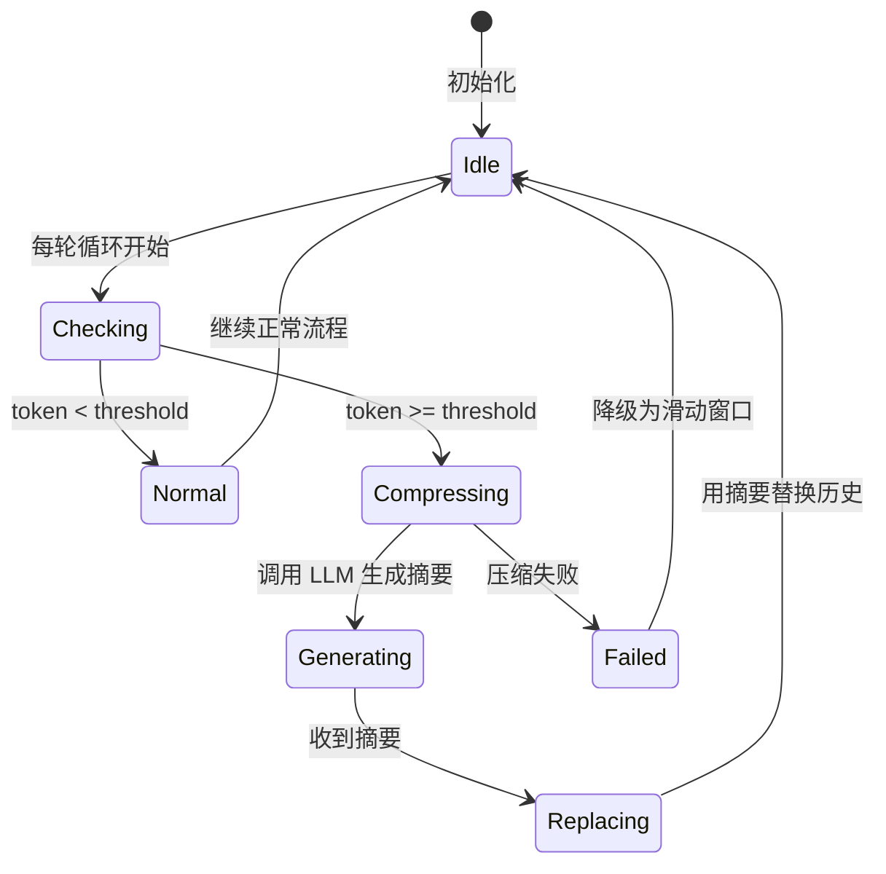
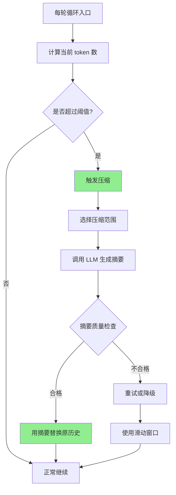
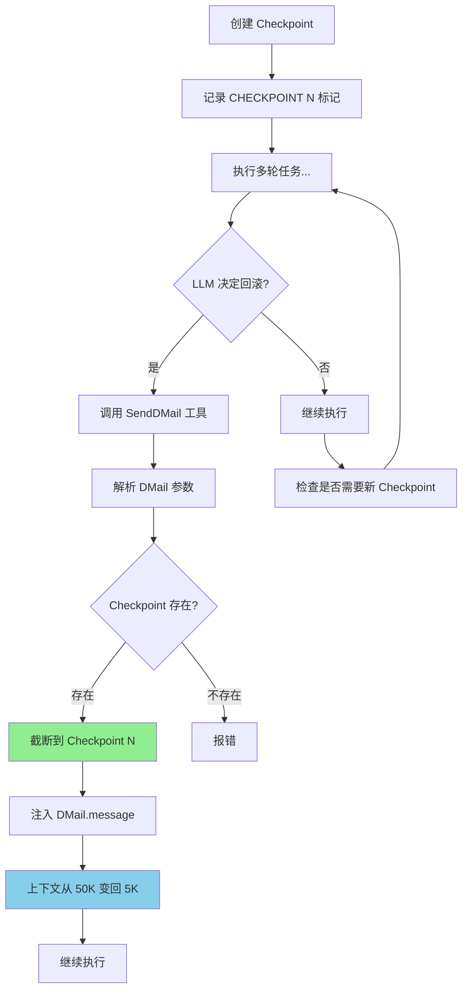
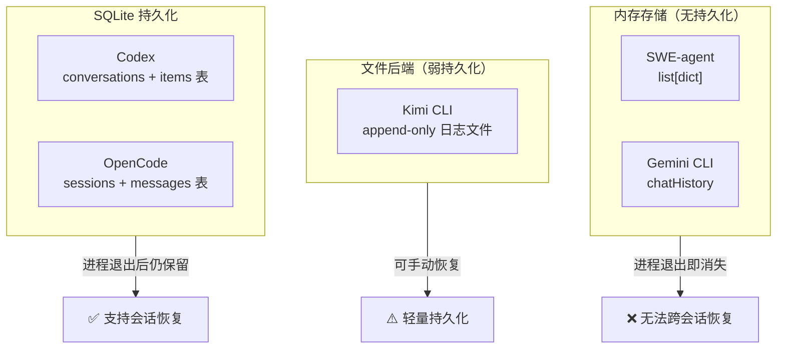
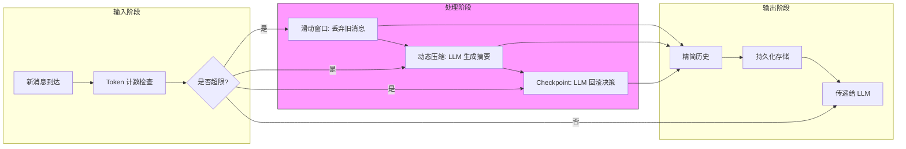
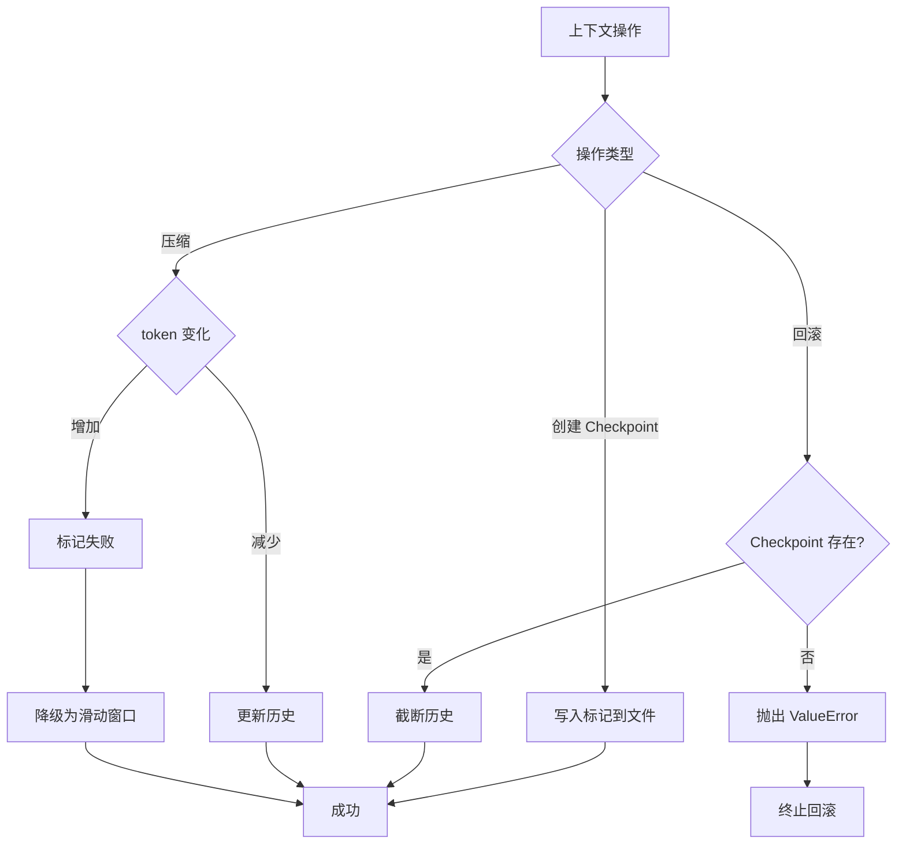
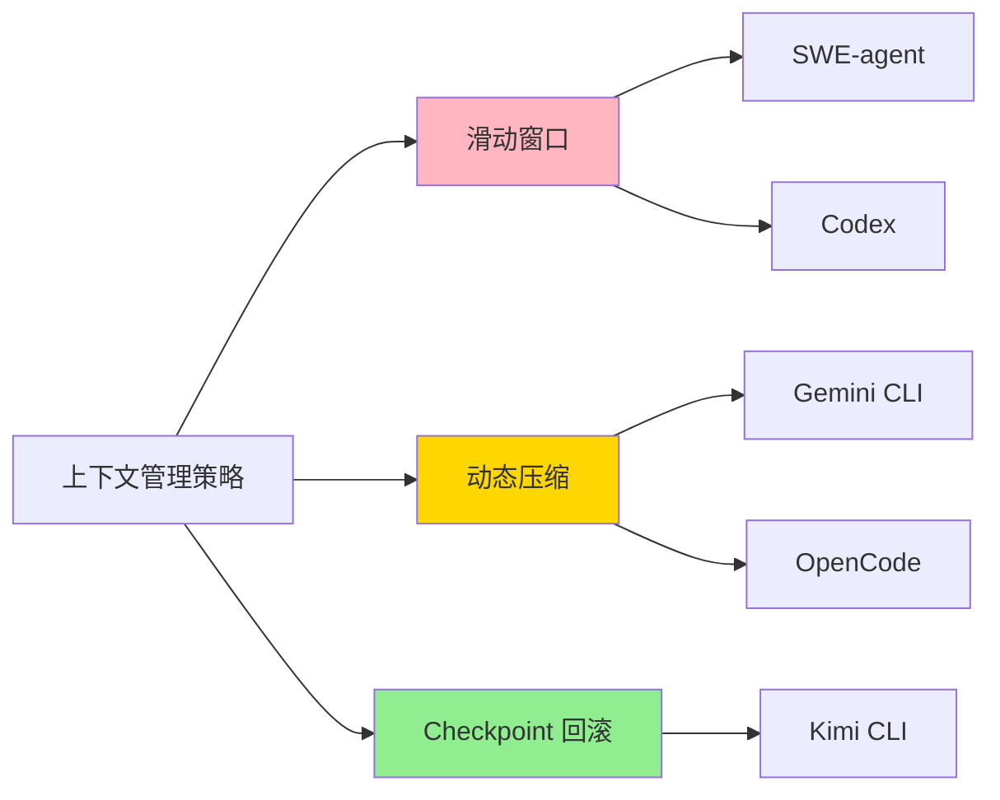

# 记忆与上下文管理

> **阅读指南**
>
> | 属性 | 说明 |
> |-----|------|
> | 预计阅读 | 20-30 分钟 |
> | 前置文档 | `04-comm-agent-loop.md` —— Agent Loop 如何驱动上下文累积 |
> | 文档结构 | 速览 → 架构 → 策略 → 实现 → 对比 |
> | 代码呈现 | 关键代码直接展示，完整代码可折叠查看 |

---

## TL;DR（结论先行）

一句话定义：LLM 的"记忆"就是每次调用时传入的消息历史，上下文管理的核心问题是 token 有上限，历史会越来越长，必须设计策略应对溢出。

五个项目提供了三种截然不同的策略：**滑动窗口**（最简单）、**动态压缩**（LLM 自己做摘要）、**Checkpoint 回滚**（LLM 主动截断冗余）。

### 核心要点速览

| 维度 | 关键决策 | 代码位置 |
|-----|---------|---------|
| 滑动窗口策略 | 丢弃旧消息，保留最近 N 条 | `SWE-agent/sweagent/agent/agents.py:390` |
| 动态压缩策略 | 触发 LLM 生成摘要替换历史 | `gemini-cli/packages/core/src/core/client.ts:1045` |
| Checkpoint 策略 | LLM 主动回滚到检查点 | `kimi-cli/src/kimi_cli/soul/context.py:68` |
| 溢出检测 | 动态计算可用 token 空间 | `opencode/packages/opencode/src/session/compaction.ts:32` |
| 持久化存储 | SQLite / 文件后端 / 内存 | `kimi-cli/src/kimi_cli/soul/context.py:24` |

---

## 1. 为什么需要这个机制？

### 1.1 问题场景

**没有上下文管理**：用户要求"修复这个 bug"，Agent 执行了 50 步后，消息历史累积到 200K tokens，超出 LLM 的 128K 限制，API 调用直接失败，任务中断。

**有上下文管理**：
- **滑动窗口策略**：自动丢弃最旧的消息，保留最近 20 步
- **动态压缩策略**：触发 LLM 生成摘要，将 100K tokens 压缩为 5K
- **Checkpoint 策略**：LLM 主动决定"之前的探索可以丢弃，只保留结论"

### 1.2 核心挑战

| 挑战 | 不解决的后果 |
|-----|-------------|
| Token 窗口限制 | LLM 调用失败或被强制截断，丢失关键上下文 |
| 信息保留 vs 压缩率 | 压缩过度丢失关键信息，压缩不足仍超限 |
| 压缩时机选择 | 过早压缩浪费 API 调用，过晚压缩导致失败 |
| 持久化需求 | 进程崩溃后丢失整个对话历史 |

---

## 2. 整体架构

### 2.1 在系统中的位置

```text
┌─────────────────────────────────────────────────────────────┐
│ Agent Loop / Session Runtime                                 │
│ 驱动多轮 LLM 调用的主循环                                     │
└───────────────────────┬─────────────────────────────────────┘
                        │ 每轮迭代传入消息历史
                        ▼
┌─────────────────────────────────────────────────────────────┐
│ ▓▓▓ 上下文管理 ▓▓▓                                           │
│ 三种策略实现：                                                │
│ - 滑动窗口：丢弃旧消息（SWE-agent/Codex）                     │
│ - 动态压缩：LLM 生成摘要（Gemini CLI/OpenCode）               │
│ - Checkpoint：LLM 主动回滚（Kimi CLI）                        │
└───────────────────────┬─────────────────────────────────────┘
                        │ 存储/持久化
        ┌───────────────┼───────────────┐
        ▼               ▼               ▼
┌──────────────┐ ┌──────────────┐ ┌──────────────┐
│ 内存存储      │ │ 文件后端      │ │ SQLite       │
│ list[dict]   │ │ append-only  │ │ 关系型表      │
│ (SWE-agent)  │ │ (Kimi CLI)   │ │ (Codex)      │
└──────────────┘ └──────────────┘ └──────────────┘
```

### 2.2 核心组件职责

| 组件 | 职责 | 代码位置 |
|-----|------|---------|
| `Context` (Kimi CLI) | 管理消息历史、Checkpoint 创建与回滚 | `kimi-cli/src/kimi_cli/soul/context.py:16` |
| `DMail` (Kimi CLI) | LLM 调用的回滚工具数据结构 | `kimi-cli/src/kimi_cli/soul/denwarenji.py:6` |
| `tryCompressChat()` (Gemini CLI) | 触发上下文压缩 | `gemini-cli/packages/core/src/core/client.ts:1045` |
| `isOverflow()` (OpenCode) | 检测 token 是否超限 | `opencode/packages/opencode/src/session/compaction.ts:32` |
| `prune()` (OpenCode) | 裁剪旧工具输出 | `opencode/packages/opencode/src/session/compaction.ts:58` |

### 2.3 核心组件交互关系



**关键交互说明**：

| 步骤 | 交互内容 | 设计意图 |
|-----|---------|---------|
| 1 | 定期检查 token 使用量 | 预防性检测，避免 API 调用失败 |
| 3-5 | 动态压缩流程 | 用 LLM 生成高质量摘要，信息损失可控 |
| 6-10 | Checkpoint 回滚流程 | LLM 自主决定何时回滚，保留关键信息 |
| 11 | 持久化存储 | 支持会话恢复，防止数据丢失 |

---

## 3. 三种策略详细分析

### 3.1 滑动窗口策略

#### 职责定位

最简单直接的策略：只保留最近的 N 条消息，超限后丢弃最旧的消息。依赖模型层的 context window 管理。

#### 内部数据流

```text
┌─────────────────────────────────────────────────────────────┐
│  输入层                                                      │
│  ├── 新消息 ──► 追加到 history list                          │
│  └── Token 计数 ──► 检查是否超限                              │
└──────────────────────────┬──────────────────────────────────┘
                           ▼
┌─────────────────────────────────────────────────────────────┐
│  处理层（滑动窗口）                                           │
│  ├── 超限判断: len(history) > MAX_MESSAGES                   │
│  ├── 截断操作: history = history[-MAX_MESSAGES:]             │
│  └── 无摘要生成，直接丢弃旧消息                               │
└──────────────────────────┬──────────────────────────────────┘
                           ▼
┌─────────────────────────────────────────────────────────────┐
│  输出层                                                      │
│  └── 截断后的消息列表传递给 LLM                               │
└─────────────────────────────────────────────────────────────┘
```

#### 关键算法逻辑



**算法要点**：

1. **无状态截断**：不生成摘要，直接丢弃旧消息
2. **实现简单**：仅需维护一个固定大小的队列
3. **信息损失大**：可能丢失关键约束或早期决策

---

### 3.2 动态压缩策略

#### 职责定位

当上下文快满时，触发 LLM 自动生成摘要，用摘要替换掉详细历史。需要额外的 LLM API 调用，但摘要质量更好。

#### 状态机图



**状态说明**：

| 状态 | 说明 | 进入条件 | 退出条件 |
|-----|------|---------|---------|
| Idle | 空闲等待 | 初始化或处理完成 | 新轮次开始 |
| Checking | 检查 token | 轮次开始 | 确定是否超限 |
| Compressing | 压缩中 | token 超限 | 摘要生成完成 |
| Generating | LLM 生成摘要 | 触发压缩 | 收到摘要响应 |
| Replacing | 替换历史 | 收到摘要 | 更新完成 |
| Failed | 压缩失败 | LLM 调用失败 | 降级处理 |

#### 关键算法逻辑



**算法要点**：

1. **Gemini CLI**：调用独立 LLM 生成摘要，质量更高但需额外 API 调用
2. **OpenCode**：先 `prune()` 快速截断，再用专用 compaction Agent 生成结构化摘要
3. **阈值动态调整**：根据模型 context window 和预留 buffer 计算

---

### 3.3 Checkpoint 回滚策略

#### 职责定位

最独特的策略：让 LLM 自己决定"哪些历史可以丢"，主动发送回滚信号。只有 LLM 看到的历史被压缩，文件系统修改不回滚。

#### 关键数据结构

```python
# kimi-cli/src/kimi_cli/soul/denwarenji.py:6
class DMail(BaseModel):
    message: str = Field(description="The message to send.")
    checkpoint_id: int = Field(description="The checkpoint to send the message back to.", ge=0)
```

**字段说明**：

| 字段 | 类型 | 用途 |
|-----|------|------|
| `message` | `str` | 回滚后注入的摘要消息 |
| `checkpoint_id` | `int` | 要回滚到的 Checkpoint ID |

#### 关键算法逻辑



**算法要点**：

1. **逻辑回滚**：只回滚 LLM 看到的历史，文件系统修改不回滚
2. **LLM 自主决策**：由 LLM 决定何时回滚、保留什么信息
3. **D-Mail 机制**：命名源自《命运石之门》，实现"向过去发送消息"

---

## 4. 端到端数据流转

### 4.1 存储方式对比

上下文管理还涉及持久化：任务中断后能否恢复？



**Kimi CLI 的特殊机制**：使用文件作为"弱持久化"后端，每次操作 append-only 写入日志文件，支持 `restore()` 从文件重建历史。既不是纯内存，也不是完整 SQLite，是轻量的中间方案。

### 4.2 数据流向图



### 4.3 异常/边界流程



---

## 5. 关键代码实现

### 5.1 核心数据结构

```python
# kimi-cli/src/kimi_cli/soul/context.py:16
class Context:
    def __init__(self, file_backend: Path):
        self._file_backend = file_backend
        self._history: list[Message] = []
        self._token_count: int = 0
        self._next_checkpoint_id: int = 0
```

**字段说明**：

| 字段 | 类型 | 用途 |
|-----|------|------|
| `_file_backend` | `Path` | 持久化文件路径 |
| `_history` | `list[Message]` | 消息历史列表 |
| `_token_count` | `int` | 当前 token 计数 |
| `_next_checkpoint_id` | `int` | 下一个 Checkpoint ID |

### 5.2 主链路代码

**Kimi CLI Checkpoint 实现**：

```python
# kimi-cli/src/kimi_cli/soul/context.py:68
async def checkpoint(self, add_user_message: bool):
    checkpoint_id = self._next_checkpoint_id
    self._next_checkpoint_id += 1
    logger.debug("Checkpointing, ID: {id}", id=checkpoint_id)

    async with aiofiles.open(self._file_backend, "a", encoding="utf-8") as f:
        await f.write(json.dumps({"role": "_checkpoint", "id": checkpoint_id}) + "\n")
    if add_user_message:
        await self.append_message(
            Message(role="user", content=[system(f"CHECKPOINT {checkpoint_id}")])
        )

# kimi-cli/src/kimi_cli/soul/context.py:80
async def revert_to(self, checkpoint_id: int):
    logger.debug("Reverting checkpoint, ID: {id}", id=checkpoint_id)
    if checkpoint_id >= self._next_checkpoint_id:
        raise ValueError(f"Checkpoint {checkpoint_id} does not exist")
    # rotate the context file and truncate history
```

**设计意图**：

1. **Checkpoint 创建**：追加 `_checkpoint` 标记到文件，可选添加用户消息提示 LLM
2. **回滚验证**：检查 checkpoint_id 有效性，无效则抛出 ValueError
3. **文件轮转**：回滚时轮转上下文文件，保留历史记录

<details>
<summary>📋 查看完整 Checkpoint 实现</summary>

```python
# kimi-cli/src/kimi_cli/soul/context.py:68-100
async def checkpoint(self, add_user_message: bool):
    """Create a new checkpoint and optionally notify LLM."""
    checkpoint_id = self._next_checkpoint_id
    self._next_checkpoint_id += 1
    logger.debug("Checkpointing, ID: {id}", id=checkpoint_id)

    # 写入 checkpoint 标记到文件
    async with aiofiles.open(self._file_backend, "a", encoding="utf-8") as f:
        await f.write(json.dumps({"role": "_checkpoint", "id": checkpoint_id}) + "\n")

    # 可选：添加系统消息提示 LLM
    if add_user_message:
        await self.append_message(
            Message(role="user", content=[system(f"CHECKPOINT {checkpoint_id}")])
        )

async def revert_to(self, checkpoint_id: int):
    """Revert context to specified checkpoint."""
    logger.debug("Reverting checkpoint, ID: {id}", id=checkpoint_id)
    if checkpoint_id >= self._next_checkpoint_id:
        raise ValueError(f"Checkpoint {checkpoint_id} does not exist")
    # 执行文件轮转和历史截断
```

</details>

**OpenCode 溢出检测**：

```typescript
// opencode/packages/opencode/src/session/compaction.ts:32
export async function isOverflow(input: { tokens: MessageV2.Assistant["tokens"]; model: Provider.Model }) {
    const config = await Config.get()
    if (config.compaction?.auto === false) return false
    const context = input.model.limit.context
    if (context === 0) return false

    const count = input.tokens.total || input.tokens.input + input.tokens.output + input.tokens.cache.read + input.tokens.cache.write
    const reserved = config.compaction?.reserved ?? Math.min(COMPACTION_BUFFER, ProviderTransform.maxOutputTokens(input.model))
    const usable = input.model.limit.input ? input.model.limit.input - reserved : context - ProviderTransform.maxOutputTokens(input.model)
    return count >= usable
}
```

**设计意图**：

1. **可配置开关**：支持通过配置禁用自动压缩
2. **动态阈值**：根据模型限制和预留 buffer 计算可用空间
3. **多 token 类型**：考虑 input/output/cache 等多种 token 类型

### 5.3 关键调用链

**Kimi CLI Checkpoint 流程**：

```text
_agent_loop()             [kimisoul.py]
  -> checkpoint()         [context.py:68]
    -> 写入 _checkpoint 标记到文件
  -> LLM 执行多轮...
  -> SendDMail 工具被调用
    -> send_dmail()       [denwarenji.py:21]
  -> revert_to()          [context.py:80]
    -> 验证 checkpoint_id 有效性
    -> 轮转上下文文件
    -> 截断历史到指定点
    -> 注入 DMail 消息
```

**Gemini CLI 压缩流程**：

```text
tryCompressChat()         [client.ts:1045]
  -> compressionService.compress()
    -> 调用 LLM 生成摘要
  -> 返回 newHistory 和 info
  -> 更新历史状态
```

---

## 6. 设计意图与 Trade-off

### 6.1 策略对比

| 维度 | 滑动窗口 | 动态压缩 | Checkpoint 回滚 |
|-----|---------|---------|-----------------|
| **实现复杂度** | 低 | 中 | 高 |
| **信息损失** | 高（整条消息丢弃） | 中（摘要质量取决于 LLM） | 低（LLM 自己选择保留什么） |
| **额外 API 调用** | 无 | 有（压缩需要 LLM） | 有（D-Mail 也是工具调用） |
| **适合任务类型** | 短任务、独立任务 | 长任务、通用 | 探索性长任务 |
| **调试友好度** | 高 | 中 | 低（需要理解回滚逻辑） |
| **持久化支持** | 无/可选 | 通常有 | 文件后端 |

### 6.2 为什么这样设计？

**滑动窗口的核心问题**：为什么 SWE-agent 和 Codex 选择最简单的策略？

**SWE-agent/Codex 的解决方案**：
- 代码依据：`SWE-agent/sweagent/agent/agents.py:390`
- 设计意图：专注于单次任务执行，不追求长期记忆；依赖模型层的 context window 管理
- 带来的好处：
  - 实现简单，无需额外逻辑
  - 无额外 API 调用开销
  - 行为可预测
- 付出的代价：
  - 长任务可能丢失关键上下文
  - 无法恢复早期决策依据

**Checkpoint 的核心问题**：为什么 Kimi CLI 让 LLM 自己决定回滚时机？

**Kimi CLI 的解决方案**：
- 代码依据：`kimi-cli/src/kimi_cli/soul/context.py:68`
- 设计意图：LLM 比压缩算法更清楚哪些信息重要；探索性任务中，LLM 知道何时可以"丢弃探索过程，只保留结论"
- 带来的好处：
  - 信息损失最小
  - 适合探索-确认模式
  - LLM 自主控制上下文结构
- 付出的代价：
  - 实现复杂
  - 需要 LLM 理解 Checkpoint 机制
  - 调试困难（需要追踪回滚历史）

### 6.3 与其他项目的对比



| 项目 | 核心差异 | 适用场景 |
|-----|---------|---------|
| SWE-agent | 无主动压缩，依赖模型层 | 短任务、单次执行 |
| Codex | SQLite 持久化 + 无压缩 | 需要会话恢复但任务不长 |
| Gemini CLI | 独立 LLM 生成摘要 | 通用长任务 |
| OpenCode | prune + compaction 两步压缩 | 工具输出特别大的场景 |
| Kimi CLI | LLM 自主 Checkpoint 回滚 | 探索性任务、多方向尝试 |

---

## 7. 边界情况与错误处理

### 7.1 终止条件

| 终止原因 | 触发条件 | 代码位置 |
|---------|---------|---------|
| Token 超限且无法压缩 | 超过模型硬限制且压缩失败 | 各项目模型调用层 |
| Checkpoint 不存在 | revert_to 传入无效 ID | `kimi-cli/src/kimi_cli/soul/context.py:95` |
| 压缩后 token 增加 | 摘要比原文还长 | `gemini-cli/packages/core/src/core/client.ts:1065` |
| 历史为空 | restore 时文件为空 | `kimi-cli/src/kimi_cli/soul/context.py:32` |

### 7.2 超时/资源限制

**OpenCode 压缩阈值配置**：

```typescript
// opencode/packages/opencode/src/session/compaction.ts:30
const COMPACTION_BUFFER = 20_000  // 预留 20K tokens
export const PRUNE_MINIMUM = 20_000  // 最少裁剪 20K
export const PRUNE_PROTECT = 40_000  // 保护最近 40K
```

**资源限制策略**：

| 限制类型 | 处理方式 | 说明 |
|---------|---------|------|
| Token 上限 | 动态计算 `usable = limit - reserved` | 预留 buffer 防止突发增长 |
| 裁剪范围 | 保护最近 40K tokens | 避免误删当前上下文 |
| 最小裁剪 | 不足 20K 不触发 | 避免频繁小幅度裁剪 |

### 7.3 错误恢复策略

| 错误类型 | 处理策略 | 代码位置 |
|---------|---------|---------|
| Checkpoint 不存在 | 抛出 ValueError，终止回滚 | `context.py:96` |
| 压缩失败（token 膨胀） | 标记失败状态，下次强制压缩 | `client.ts:1067` |
| 文件后端不存在 | 跳过恢复，创建新上下文 | `context.py:29` |
| 空上下文文件 | 跳过恢复，记录 debug 日志 | `context.py:32` |

**Kimi CLI Checkpoint 错误处理**：

```python
# kimi-cli/src/kimi_cli/soul/context.py:95
if checkpoint_id >= self._next_checkpoint_id:
    logger.error("Checkpoint {checkpoint_id} does not exist", checkpoint_id=checkpoint_id)
    raise ValueError(f"Checkpoint {checkpoint_id} does not exist")
```

**Gemini CLI 压缩失败处理**：

```typescript
// gemini-cli/packages/core/src/core/client.ts:1065
if (info.compressionStatus === CompressionStatus.COMPRESSION_FAILED_INFLATED_TOKEN_COUNT) {
    this.hasFailedCompressionAttempt = this.hasFailedCompressionAttempt || !force;
}
```

---

## 8. 关键代码索引

| 项目 | 文件 | 行号 | 说明 |
|-----|------|------|------|
| SWE-agent | `SWE-agent/sweagent/agent/agents.py` | 390 | Agent 主循环入口 |
| Kimi CLI | `kimi-cli/src/kimi_cli/soul/context.py` | 16 | `Context` 类 —— 上下文管理核心 |
| Kimi CLI | `kimi-cli/src/kimi_cli/soul/context.py` | 24 | `restore()` —— 从文件恢复历史 |
| Kimi CLI | `kimi-cli/src/kimi_cli/soul/context.py` | 68 | `checkpoint()` —— 创建检查点 |
| Kimi CLI | `kimi-cli/src/kimi_cli/soul/context.py` | 80 | `revert_to()` —— 回滚到检查点 |
| Kimi CLI | `kimi-cli/src/kimi_cli/soul/denwarenji.py` | 6 | `DMail` —— D-Mail 数据结构 |
| Gemini CLI | `gemini-cli/packages/core/src/core/client.ts` | 577 | `tryCompressChat()` 触发点 |
| Gemini CLI | `gemini-cli/packages/core/src/core/client.ts` | 586 | `tryMaskToolOutputs()` —— 输出遮罩 |
| Gemini CLI | `gemini-cli/packages/core/src/core/client.ts` | 1045 | `tryCompressChat()` 实现 |
| OpenCode | `opencode/packages/opencode/src/session/compaction.ts` | 32 | `isOverflow()` —— 溢出检测 |
| OpenCode | `opencode/packages/opencode/src/session/compaction.ts` | 58 | `prune()` —— 工具输出裁剪 |
| OpenCode | `opencode/packages/opencode/src/session/compaction.ts` | 101 | `process()` —— compaction agent 触发 |

---

## 9. 延伸阅读

- 前置知识：`docs/comm/04-comm-agent-loop.md` —— Agent Loop 如何驱动上下文累积
- 相关机制：`docs/kimi-cli/07-kimi-cli-memory-context.md` —— Kimi CLI Checkpoint 详细分析
- 深度分析：`docs/gemini-cli/07-gemini-cli-memory-context.md` —— Gemini CLI 压缩服务实现

---

*✅ Verified: 基于 kimi-cli/src/kimi_cli/soul/context.py、gemini-cli/packages/core/src/core/client.ts、opencode/packages/opencode/src/session/compaction.ts 等源码分析*
*基于版本：2026-02-08 baseline | 最后更新：2026-03-03*
