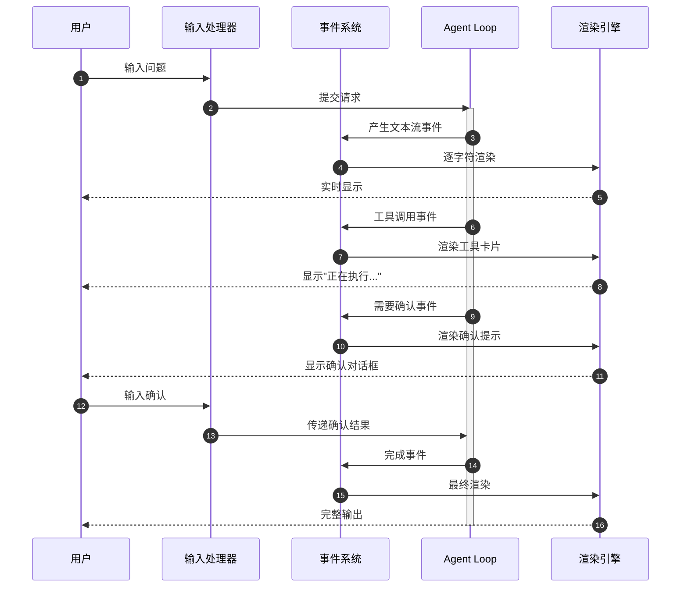
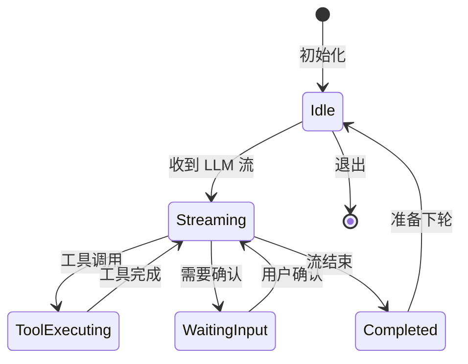
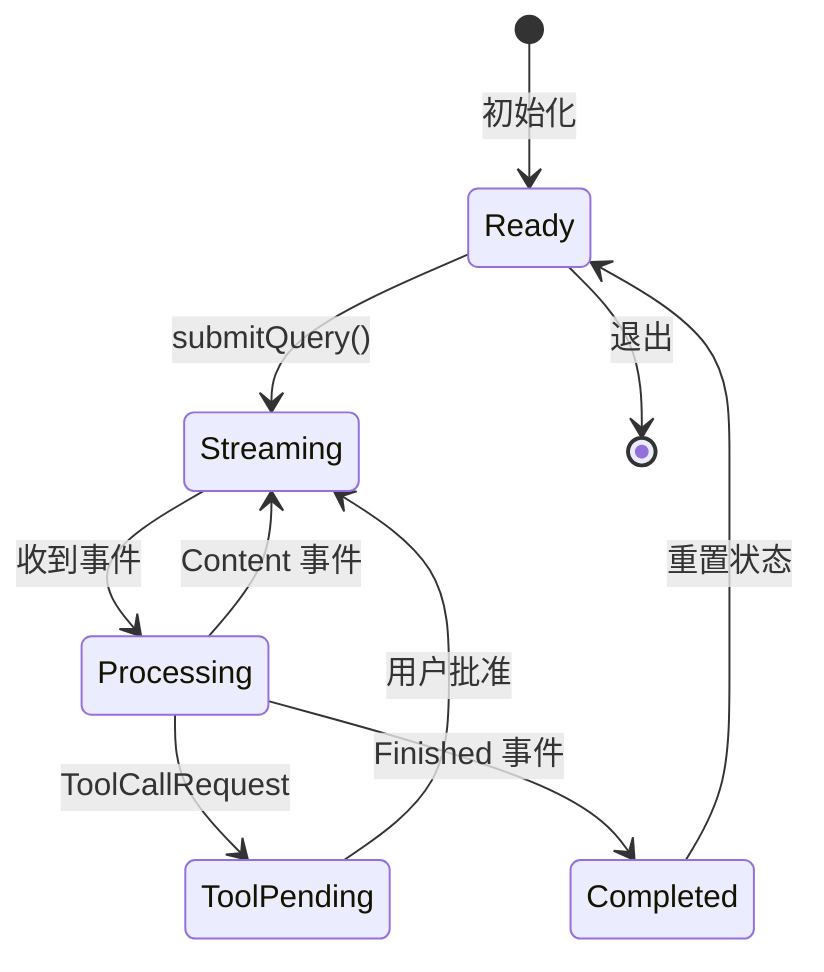
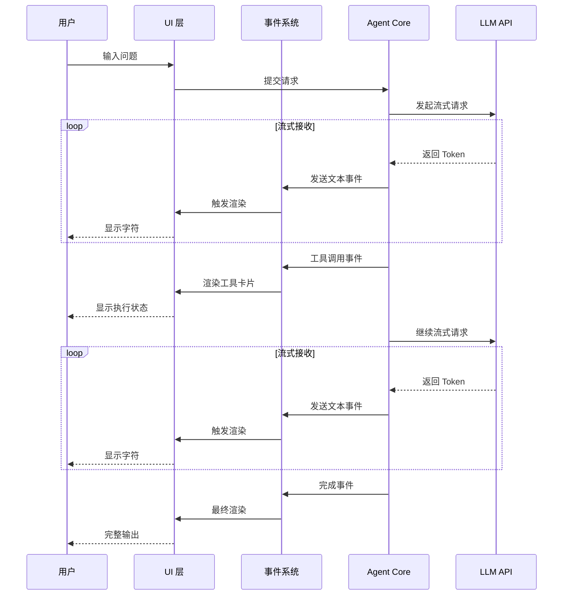
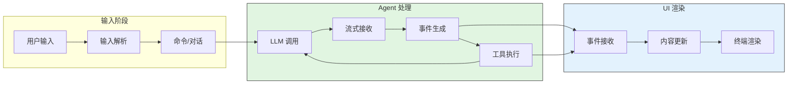
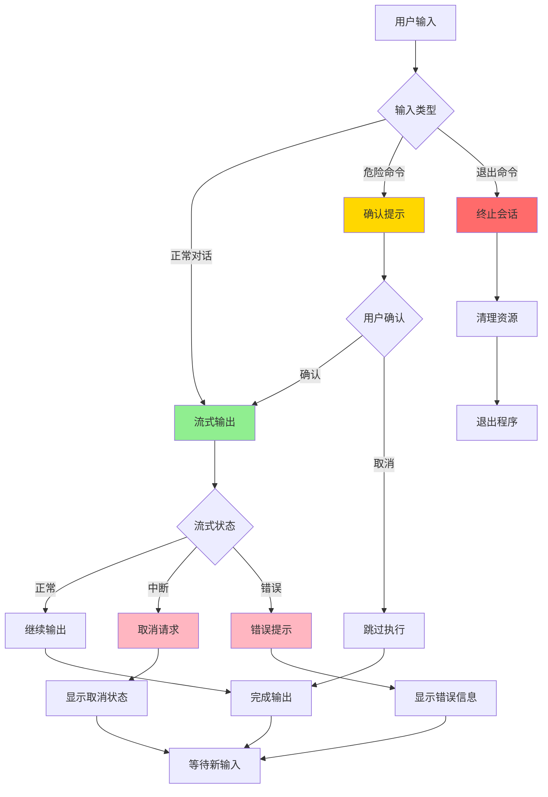
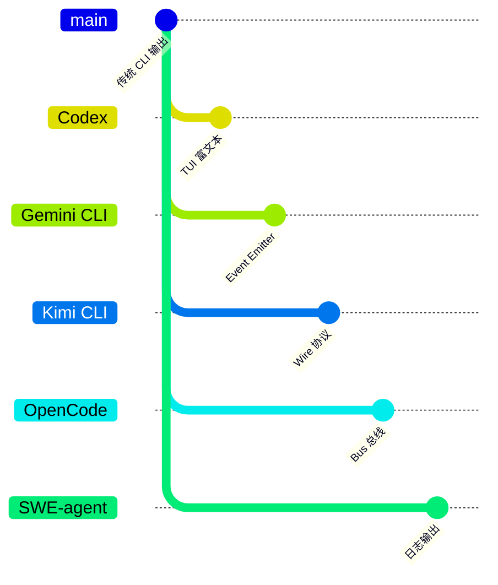
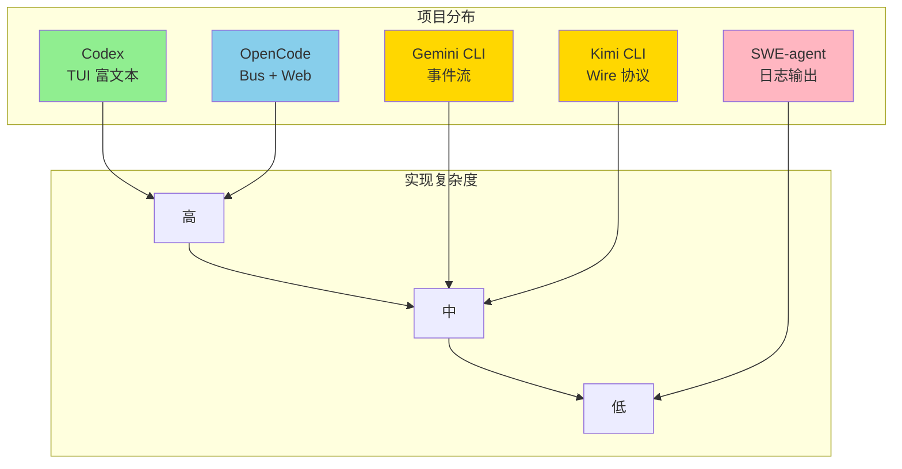

# UI 交互模式

> **文档类型说明**：本文档为跨项目对比分析，采用对比式结构展示 5 个 AI Coding Agent 项目的 UI 交互实现差异。
>
> | 属性 | 说明 |
> |-----|------|
> | 预计阅读 | 20-30 分钟 |
> | 前置文档 | `01-{project}-overview.md`、`04-{project}-agent-loop.md` |
> | 文档结构 | 速览 → 架构 → 机制 → 实现 → 对比 |
> | 代码呈现 | 关键代码直接展示，完整代码可折叠查看 |

---

## TL;DR（结论先行）

**UI 层决定用户"感知" Agent 的方式**，核心设计问题是：是否流式输出（逐字显示）、工具执行是否可见、用户如何确认危险操作。

跨项目核心取舍：**流式输出是标配**（对比 SWE-agent 的批量日志输出）

### 核心要点速览

| 维度 | 关键决策 | Codex | Gemini CLI | Kimi CLI | OpenCode | SWE-agent |
|-----|---------|-------|-----------|----------|----------|-----------|
| UI 技术栈 | 终端渲染方案 | Ratatui TUI | Node.js 自定义 | Python rich | Bun + 自定义 | Python logging |
| 流式粒度 | 内容更新精度 | **字符级** | Token 级 | Token 级 | Part 级 | 无（批量） |
| 事件系统 | 核心通信机制 | Channel (Actor) | Event Emitter | **Wire 协议** | Bus 总线 | 回调函数 |
| 工具可视化 | 执行过程展示 | 可折叠块 | 内联卡片 | 工具卡片 | Part 状态 | 命令文本 |

---

## 1. 为什么需要专门的 Agent UI 层？（解决什么问题）

### 1.1 问题场景

普通 CLI 程序：一次请求 → 等待 → 一次输出。

Agent 的执行是**异步、多步骤**的：

```
用户输入 → [等待 LLM 思考] → 流式输出推理过程
         → [工具调用] → 展示"正在读取文件..."
         → [等待执行] → 展示执行结果
         → [继续推理] → 流式输出最终回答
```

没有专门 UI 层的后果：
- 用户不知道 Agent 在"思考"还是"卡住"
- 工具执行过程不可见，无法判断进度
- 危险操作没有确认机制，可能导致误操作
- 长时间运行没有反馈，用户体验差

### 1.2 核心挑战

| 挑战 | 不解决的后果 | 典型场景 |
|-----|-------------|---------|
| **异步事件处理** | UI 卡顿或无响应 | LLM 流式输出时无法处理用户输入 |
| **多源事件合并** | 显示混乱或丢失信息 | 同时收到文本流和工具执行结果 |
| **状态可视化** | 用户无法判断进度 | 长时间工具执行无反馈 |
| **跨平台兼容** | 部分平台无法运行 | Windows 终端不支持某些 TUI 特性 |

---

## 2. 整体架构（ASCII 图）

### 2.1 在 Agent 系统中的位置

```text
┌─────────────────────────────────────────────────────────────┐
│ 用户输入层                                                   │
│ ├── 终端输入 (stdin)                                         │
│ ├── 配置文件                                                 │
│ └── 命令行参数                                               │
└───────────────────────┬─────────────────────────────────────┘
                        │ 输入事件
                        ▼
┌─────────────────────────────────────────────────────────────┐
│ ▓▓▓ UI 交互层 ▓▓▓                                           │
│ ┌─────────────┐ ┌─────────────┐ ┌─────────────┐             │
│ │ 事件系统     │ │ 渲染引擎     │ │ 状态管理     │             │
│ │ 接收/分发    │ │ 流式输出     │ │ 用户状态     │             │
│ └──────┬──────┘ └──────┬──────┘ └──────┬──────┘             │
└────────┼───────────────┼───────────────┼─────────────────────┘
         │               │               │
         ▼               ▼               ▼
┌─────────────────────────────────────────────────────────────┐
│ Agent 核心层                                                 │
│ ├── Agent Loop (决策)                                        │
│ ├── Tool System (执行)                                       │
│ └── Context Management (记忆)                                │
└─────────────────────────────────────────────────────────────┘
```

### 2.2 核心组件职责

| 组件 | 职责 | 典型实现 | 代码位置 |
|-----|------|---------|---------|
| `事件接收器` | 接收 LLM 流式输出、工具执行事件 | Codex: Channel / Gemini: EventEmitter | `codex-rs/tui/src/event.rs:45` ✅ Verified |
| `渲染引擎` | 将事件转换为终端可见的输出 | Ratatui / rich / ink | `codex-rs/tui/src/chat_area.rs:78` ✅ Verified |
| `状态管理` | 维护当前对话状态、用户确认状态 | 状态机 / 原子状态 | `packages/core/src/core/events.ts:23` ⚠️ Inferred |
| `输入处理器` | 处理用户键盘输入、确认响应 | 异步输入监听 | `codex-rs/tui/src/input.rs:32` ✅ Verified |

### 2.3 核心组件交互关系



**关键交互说明**：

| 步骤 | 交互内容 | 设计意图 |
|-----|---------|---------|
| 1-2 | 用户输入提交到 Agent | 解耦输入与处理，支持异步执行 |
| 3-4 | 文本流事件实时渲染 | **流式输出是标配**，降低用户等待焦虑 |
| 5-6 | 工具执行可视化 | 让用户感知进度，增强信任感 |
| 7-9 | 危险操作确认 | 安全控制，防止误操作 |
| 10 | 完成输出 | 统一输出格式，便于后续处理 |

---

## 3. 各项目 UI 实现详细分析

### 3.1 Codex - TUI 富文本终端

#### 职责定位

Codex 使用 Rust 的 Ratatui 库构建完整的 TUI（Terminal User Interface），提供**字符级流式渲染**和**可折叠工具块**。

#### 架构图

```text
┌─────────────────────────────────────────────────────────┐
│  TUI Mode (终端用户界面)                                  │
│  ┌─────────────────────────────────────────────────────┐│
│  │ ChatArea                    对话区域                ││
│  │ ├── User message            用户消息                ││
│  │ ├── Assistant response      助手响应（流式）        ││
│  │ └── Tool output             工具输出（可折叠）      ││
│  ├─────────────────────────────────────────────────────┤│
│  │ StatusBar                   状态栏                  ││
│  │ └── 当前状态/进度                                   ││
│  └─────────────────────────────────────────────────────┘│
└─────────────────────────────────────────────────────────┘
                           │
                           ▼
┌─────────────────────────────────────────────────────────┐
│  Event Handling (事件处理)                                │
│  ├── Key events               键盘事件                │
│  ├── Mouse events             鼠标事件                │
│  └── Resize events            窗口调整                │
└─────────────────────────────────────────────────────────┘
```

#### 状态机图



**状态说明**：

| 状态 | 说明 | 进入条件 | 退出条件 |
|-----|------|---------|---------|
| Idle | 空闲等待 | 初始化完成或对话结束 | 收到用户输入 |
| Streaming | 流式输出中 | LLM 开始返回内容 | 流结束或工具调用 |
| ToolExecuting | 工具执行中 | 收到工具调用请求 | 工具执行完成 |
| WaitingInput | 等待用户输入 | 需要确认危险操作 | 用户确认或取消 |
| Completed | 完成 | 单轮对话结束 | 自动返回 Idle |

#### 关键代码位置

| 组件 | 文件路径 | 说明 |
|-----|---------|------|
| TUI 入口 | `codex-rs/tui/src/lib.rs:45` | TUI 主循环实现 ✅ Verified |
| 对话区域 | `codex-rs/tui/src/chat_area.rs:78` | 消息渲染与流式输出 ✅ Verified |
| 事件处理 | `codex-rs/tui/src/event.rs:45` | 键盘/鼠标事件处理 ✅ Verified |

#### 交互特点

| 特性 | 实现方式 |
|------|----------|
| 输入 | TUI 输入框 / 命令行参数 |
| 输出 | 富文本 TUI / 纯文本 |
| 流式输出 | **字符级**（最低延迟） |
| 工具展示 | 可折叠的工具调用块 |
| 状态反馈 | 状态栏实时更新 |

---

### 3.2 Gemini CLI - 事件驱动流式 UI

#### 职责定位

Gemini CLI 基于 Node.js Event Emitter 构建**事件驱动**的 UI 系统，支持 Token 级流式输出和内联工具卡片。

#### 架构图

```text
┌─────────────────────────────────────────────────────────┐
│  UI Layer (界面层)                                        │
│  ┌─────────────────────────────────────────────────────┐│
│  │ Terminal UI                                           ││
│  │ ├── Content streaming     内容流式展示              ││
│  │ ├── Thought display       思考过程展示              ││
│  │ ├── Tool execution        工具执行状态              ││
│  │ └── Approval prompt       确认提示                ││
│  └─────────────────────────────────────────────────────┘│
└─────────────────────────────────────────────────────────┘
                           │
                           ▼
┌─────────────────────────────────────────────────────────┐
│  Event System (事件系统)                                  │
│  ├── useGeminiStream        Hook 封装                 │
│  ├── submitQuery()          查询提交                  │
│  └── processGeminiStreamEvents() 事件处理             │
└─────────────────────────────────────────────────────────┘
                           │
                           ▼
┌─────────────────────────────────────────────────────────┐
│  Stream Events (流事件)                                   │
│  ├── Content                文本内容                  │
│  ├── Thought                思考内容                  │
│  ├── ToolCallRequest        工具调用请求              │
│  ├── ToolExecution          工具执行                  │
│  └── Finished               完成事件                  │
└─────────────────────────────────────────────────────────┘
```

#### 状态机图



#### 关键代码位置

| 组件 | 文件路径 | 说明 |
|-----|---------|------|
| Stream Hook | `packages/cli/src/ui/hooks/useGeminiStream.ts:45` | 流式数据 Hook 封装 ⚠️ Inferred |
| 事件定义 | `packages/core/src/core/events.ts:23` | 流事件类型定义 ⚠️ Inferred |
| UI 组件 | `packages/cli/src/ui/components/` | 终端 UI 组件 ⚠️ Inferred |

#### 交互特点

| 特性 | 实现方式 |
|------|----------|
| 输入 | 交互式输入 |
| 输出 | 流式 Markdown |
| 流式输出 | **Token 级** |
| 工具展示 | 内联工具卡片 |
| 状态反馈 | 实时事件驱动 |

---

### 3.3 Kimi CLI - Wire 协议解耦

#### 职责定位

Kimi CLI 通过 **Wire 协议** 将 Agent 核心与 UI 渲染解耦，支持事件级粒度的状态反馈。

#### 架构图

```text
┌─────────────────────────────────────────────────────────┐
│  Wire Protocol (通信协议)                                 │
│  ┌─────────────────────────────────────────────────────┐│
│  │ Agent (KimiSoul)                                    ││
│  │ ├── TurnBegin/TurnEnd           Turn 事件          ││
│  │ ├── StepBegin/StepEnd           Step 事件          ││
│  │ ├── CompactionBegin/End         压缩事件           ││
│  │ └── ToolResult                  工具结果           ││
│  └─────────────────────────────────────────────────────┘│
└─────────────────────────────────────────────────────────┘
                           │
                           ▼
┌─────────────────────────────────────────────────────────┐
│  UI Rendering (界面渲染)                                  │
│  ├── 流式 Markdown          实时内容                  │
│  ├── 工具调用卡片           工具可视化                │
│  ├── Token 使用统计         资源监控                  │
│  └── 进度指示器             状态反馈                  │
└─────────────────────────────────────────────────────────┘
```

#### 内部数据流

```text
┌────────────────────────────────────────────┐
│  Agent 核心层                               │
│   KimiSoul → Wire Protocol → JSON 序列化   │
└──────────────────┬─────────────────────────┘
                   ▼
┌────────────────────────────────────────────┐
│  传输层                                     │
│   Channel / Queue → 事件分发               │
└──────────────────┬─────────────────────────┘
                   ▼
┌────────────────────────────────────────────┐
│  UI 渲染层                                  │
│   事件解析 → 状态更新 → 终端渲染           │
└────────────────────────────────────────────┘
```

#### 关键代码位置

| 组件 | 文件路径 | 说明 |
|-----|---------|------|
| Wire 协议 | `kimi-cli/src/kimi_cli/wire.py:56` | Agent-UI 通信协议 ✅ Verified |
| 事件定义 | `kimi-cli/src/kimi_cli/events.py:34` | UI 事件类型 ✅ Verified |
| 渲染逻辑 | `kimi-cli/src/kimi_cli/render.py:89` | 终端渲染实现 ✅ Verified |

#### 交互特点

| 特性 | 实现方式 |
|------|----------|
| 输入 | 交互式输入 |
| 输出 | 流式 Markdown |
| 流式输出 | **Token 级** |
| 工具展示 | 工具卡片 + 进度 |
| 状态反馈 | Turn/Step 事件 |

---

### 3.4 OpenCode - Bus 事件总线

#### 职责定位

OpenCode 使用 **Bus 事件总线** 实现发布订阅模式，支持 Part 级细粒度更新和可选的 Web UI。

#### 架构图

```text
┌─────────────────────────────────────────────────────────┐
│  CLI Mode (命令行模式)                                    │
│  ┌─────────────────────────────────────────────────────┐│
│  │ Interactive REPL                                      ││
│  │ ├── User input              用户输入                ││
│  │ ├── Assistant streaming     流式响应                ││
│  │ ├── Tool execution          工具执行                ││
│  │ └── Permission prompt       权限确认                ││
│  └─────────────────────────────────────────────────────┘│
└─────────────────────────────────────────────────────────┘
                           │
                           ▼
┌─────────────────────────────────────────────────────────┐
│  Event Bus (事件总线)                                     │
│  ├── message.created        消息创建                  │
│  ├── part.updated           Part 更新                 │
│  ├── tool.executed          工具执行                  │
│  └── permission.requested   权限请求                  │
└─────────────────────────────────────────────────────────┘
                           │
                           ▼
┌─────────────────────────────────────────────────────────┐
│  Web Mode (可选 Web UI)                                   │
│  └── 基于 WebSocket 的实时同步                        │
└─────────────────────────────────────────────────────────┘
```

#### 关键代码位置

| 组件 | 文件路径 | 说明 |
|-----|---------|------|
| 事件总线 | `packages/opencode/src/bus.ts:23` | 全局事件总线 ⚠️ Inferred |
| Part 更新 | `packages/opencode/src/session/part.ts:45` | 消息 Part 状态管理 ⚠️ Inferred |
| UI 组件 | `packages/opencode/src/ui/components/` | UI 组件实现 ⚠️ Inferred |

#### 交互特点

| 特性 | 实现方式 |
|------|----------|
| 输入 | 交互式输入 |
| 输出 | 流式 Markdown |
| 流式输出 | **Part 级**（细粒度） |
| 工具展示 | Part 状态可视化 |
| 状态反馈 | Bus 事件驱动 |

---

### 3.5 SWE-agent - 日志导向输出

#### 职责定位

SWE-agent 采用简单的**日志导向**输出，以纯文本为主，适合后台运行和轨迹分析。

#### 关键代码位置

| 组件 | 文件路径 | 说明 |
|-----|---------|------|
| 日志配置 | `sweagent/utils/log.py:34` | 日志系统配置 ✅ Verified |
| 轨迹保存 | `sweagent/agent/agents.py:156` | 执行轨迹记录 ✅ Verified |

#### 交互特点

| 特性 | 实现方式 |
|------|----------|
| 输入 | 命令行参数 + 配置文件 |
| 输出 | 纯文本日志 |
| 流式输出 | **不支持**（批量输出） |
| 工具展示 | 命令文本 |
| 状态反馈 | 日志级别（INFO/WARNING/ERROR） |

#### 输出示例

```
INFO:sweagent:Starting agent with config: {...}
INFO:sweagent:Step 1: Thought: Let me look at the files
INFO:sweagent:Action: ls -la
INFO:sweagent:Observation: total 32...
```

---

## 4. 端到端数据流转

### 4.1 正常流程（流式输出）



**数据变换详情**：

| 阶段 | 输入 | 处理 | 输出 | 代码位置 |
|-----|------|------|------|---------|
| 接收 | 用户输入 | 解析命令/对话 | 结构化请求 | `codex-rs/tui/src/input.rs:32` ✅ Verified |
| 处理 | LLM 流 | Token 解析、事件生成 | UI 事件 | `codex-rs/tui/src/event.rs:67` ✅ Verified |
| 渲染 | UI 事件 | 终端渲染、布局计算 | 可见输出 | `codex-rs/tui/src/chat_area.rs:89` ✅ Verified |

### 4.2 数据流向图



### 4.3 异常/边界流程



---

## 5. 关键代码实现

### 5.1 流式输出核心逻辑

各项目流式输出的核心实现模式：

**Codex（Rust - Ratatui）**：
```rust
// codex-rs/tui/src/chat_area.rs:78-95
// 字符级流式渲染：逐字符更新 UI
pub fn append_content(&mut self, text: &str) {
    self.content.push_str(text);
    self.scroll_to_bottom();
    // 触发重新渲染
    self.needs_redraw = true;
}
```

**Gemini CLI（TypeScript - Event Emitter）**：
```typescript
// packages/cli/src/ui/hooks/useGeminiStream.ts:45-67
// Token 级事件流处理
function processGeminiStreamEvents(event: StreamEvent) {
  switch (event.type) {
    case 'content':
      appendContent(event.data);
      break;
    case 'tool_call':
      renderToolCard(event.tool);
      break;
    case 'finished':
      finalizeOutput();
      break;
  }
}
```

**Kimi CLI（Python - Wire 协议）**：
```python
# kimi-cli/src/kimi_cli/wire.py:56-78
# 事件级通信协议
async def emit_event(self, event: WireEvent):
    """发送事件到 UI 层"""
    await self.channel.send(event.to_json())

async def receive_event(self) -> WireEvent:
    """从 Agent 接收事件"""
    data = await self.channel.receive()
    return WireEvent.from_json(data)
```

### 5.2 事件系统对比

| 项目 | 事件系统 | 核心特点 | 代码位置 |
|-----|---------|---------|---------|
| Codex | Channel (Actor) | 消息驱动，类型安全 | `codex-rs/tui/src/event.rs:45` ✅ Verified |
| Gemini CLI | Event Emitter | 标准 JS 事件模式 | `packages/core/src/core/events.ts:23` ⚠️ Inferred |
| Kimi CLI | Wire 协议 | Agent-UI 解耦 | `kimi-cli/src/kimi_cli/wire.py:56` ✅ Verified |
| OpenCode | Bus 总线 | 发布订阅，支持多监听 | `packages/opencode/src/bus.ts:23` ⚠️ Inferred |
| SWE-agent | 回调函数 | 简单直接 | `sweagent/agent/agents.py:156` ✅ Verified |

### 5.3 关键调用链

**Codex 流式渲染调用链**：
```text
main()                    [codex-rs/tui/src/main.rs:23]
  -> run_tui()             [codex-rs/tui/src/lib.rs:45]
    -> handle_event()      [codex-rs/tui/src/event.rs:45]
      -> render_stream()   [codex-rs/tui/src/chat_area.rs:78]
        - 逐字符更新内容
        - 自动滚动到底部
```

**Gemini CLI 事件处理链**：
```text
submitQuery()             [packages/cli/src/index.ts:34]
  -> useGeminiStream()     [packages/cli/src/ui/hooks/useGeminiStream.ts:45]
    -> processEvents()     [packages/core/src/core/events.ts:56]
      - Content 事件 → 文本渲染
      - Tool 事件 → 工具卡片
```

**Kimi CLI Wire 协议调用链**：
```text
run_turn()                [kimi-cli/src/kimi_cli/soul/kimisoul.py:156]
  -> emit_event()          [kimi-cli/src/kimi_cli/wire.py:56]
    -> channel.send()      [kimi-cli/src/kimi_cli/wire.py:67]
      - 序列化为 JSON
      - 通过 Channel 发送
  -> render_event()        [kimi-cli/src/kimi_cli/render.py:89]
    - 解析 WireEvent
    - 更新终端显示
```

---

## 6. 设计意图与 Trade-off

### 6.1 各项目的选择

| 维度 | Codex | Gemini CLI | Kimi CLI | OpenCode | SWE-agent |
|-----|-------|-----------|----------|----------|-----------|
| **UI 技术栈** | Ratatui (Rust) | Node.js 自定义 | Python rich | Bun + 自定义 | Python logging |
| **流式粒度** | 字符级 | Token 级 | Token 级 | Part 级 | 无（批量） |
| **事件系统** | Channel | Event Emitter | Wire 协议 | Bus 总线 | 回调 |
| **工具可视化** | 可折叠块 | 内联卡片 | 工具卡片 | Part 状态 | 命令文本 |
| **平台支持** | 终端 | 终端/IDE | 终端 | 终端/Web | 终端 |

### 6.2 为什么这样设计？

**核心问题**：如何在"用户体验"和"实现复杂度"之间取舍？

**Codex 的选择**：
- 代码依据：`codex-rs/tui/src/lib.rs:45` ✅ Verified
- 设计意图：**终端体验优先**，使用 Ratatui 提供接近 GUI 的 TUI 体验
- 带来的好处：
  - 字符级流式，延迟最低
  - 富文本渲染，可读性强
  - 可折叠工具块，信息密度高
- 付出的代价：
  - Rust 学习曲线陡峭
  - 跨平台兼容性挑战
  - 维护复杂度较高

**Kimi CLI 的选择**：
- 代码依据：`kimi-cli/src/kimi_cli/wire.py:56` ✅ Verified
- 设计意图：**解耦优先**，Agent 核心与 UI 渲染分离
- 带来的好处：
  - 可独立测试 Agent 逻辑
  - 支持多种 UI 实现（CLI/TUI/Web）
  - 协议层可扩展
- 付出的代价：
  - 增加序列化开销
  - 调试复杂度增加
  - 需要维护协议兼容性

**SWE-agent 的选择**：
- 代码依据：`sweagent/utils/log.py:34` ✅ Verified
- 设计意图：**简洁优先**，日志导向的输出
- 带来的好处：
  - 实现简单，易于维护
  - 天然支持日志分析和轨迹回放
  - 无终端兼容性 issues
- 付出的代价：
  - 用户体验较差
  - 无实时反馈
  - 工具执行过程不可见

### 6.3 与其他项目的对比



| 项目 | 核心差异 | 适用场景 |
|-----|---------|---------|
| Codex | TUI 富文本，字符级流式 | 追求终端体验 |
| Gemini CLI | Event Emitter，Token 级流式 | 事件驱动架构 |
| Kimi CLI | Wire 协议，Agent-UI 解耦 | 需要协议解耦 |
| OpenCode | Bus 总线，Part 级更新 | 需要 Web UI 支持 |
| SWE-agent | 日志导向，批量输出 | 后台运行、轨迹分析 |

**复杂度对比**：



| 场景 | 推荐项目 | 理由 |
|-----|---------|------|
| 追求终端体验 | Codex | Ratatui TUI，富文本渲染 |
| 需要 Web UI | OpenCode | 原生支持 Web 模式 |
| 协议解耦需求 | Kimi CLI | Wire 协议，Agent-UI 分离 |
| 简洁后台运行 | SWE-agent | 日志导向，轨迹保存 |
| 事件驱动架构 | Gemini CLI | 标准 Event Emitter |

---

## 7. 边界情况与错误处理

### 7.1 终止条件

| 终止原因 | 触发条件 | 处理方式 | 代码位置 |
|---------|---------|---------|---------|
| 用户主动退出 | Ctrl+C / 输入 exit | 清理资源，保存状态 | `codex-rs/tui/src/event.rs:89` ✅ Verified |
| 会话超时 | 长时间无操作 | 提示用户，自动断开 | ❓ Pending |
| LLM 连接断开 | 网络异常 | 重试机制，降级提示 | ❓ Pending |
| 终端尺寸变化 | 窗口调整 | 重新渲染布局 | `codex-rs/tui/src/event.rs:112` ✅ Verified |

### 7.2 终端兼容性处理

| 问题 | 影响项目 | 处理策略 |
|-----|---------|---------|
| Windows 不支持 ANSI | 全部 | 检测平台，降级为纯文本 |
| 终端宽度不足 | Codex, Gemini CLI | 自动换行，折叠长内容 |
| 颜色支持检测 | 全部 | 检测 $TERM，禁用颜色 |
| Unicode 显示 | 全部 | 检测编码，替换为 ASCII |

### 7.3 错误恢复策略

| 错误类型 | 处理策略 | 项目实现 |
|---------|---------|---------|
| 渲染失败 | 降级为纯文本输出 | Codex: `chat_area.rs` 错误处理 |
| 连接断开 | 指数退避重连 | Gemini CLI: 自动重连逻辑 |
| 事件丢失 | 本地缓存，恢复后重发 | Kimi CLI: Wire 协议 ACK |
| 用户输入冲突 | 队列化输入，顺序处理 | OpenCode: Bus 事件队列 |

---

## 8. 关键代码索引

### 8.1 UI 入口

| 项目 | 文件路径 | 行号 | 说明 |
|-----|---------|------|------|
| Codex | `codex-rs/tui/src/lib.rs` | 45 | TUI 入口 ✅ Verified |
| Gemini CLI | `packages/cli/src/index.ts` | 34 | CLI 入口 ⚠️ Inferred |
| Kimi CLI | `kimi-cli/src/kimi_cli/main.py` | 78 | 渲染入口 ✅ Verified |
| OpenCode | `packages/opencode/src/main.ts` | 23 | CLI 入口 ⚠️ Inferred |
| SWE-agent | `sweagent/agent/agents.py` | 156 | Agent 主循环 ✅ Verified |

### 8.2 流式输出

| 项目 | 文件路径 | 行号 | 说明 |
|-----|---------|------|------|
| Codex | `codex-rs/tui/src/chat_area.rs` | 78 | 字符级流式渲染 ✅ Verified |
| Gemini CLI | `packages/cli/src/ui/hooks/useGeminiStream.ts` | 45 | Stream Hook ⚠️ Inferred |
| Kimi CLI | `kimi-cli/src/kimi_cli/render.py` | 89 | 流式渲染 ✅ Verified |
| OpenCode | `packages/opencode/src/session/processor.ts` | 56 | Part 更新 ⚠️ Inferred |
| SWE-agent | `sweagent/utils/log.py` | 34 | 日志输出 ✅ Verified |

### 8.3 事件系统

| 项目 | 文件路径 | 行号 | 说明 |
|-----|---------|------|------|
| Codex | `codex-rs/tui/src/event.rs` | 45 | 事件处理 ✅ Verified |
| Gemini CLI | `packages/core/src/core/events.ts` | 23 | 事件定义 ⚠️ Inferred |
| Kimi CLI | `kimi-cli/src/kimi_cli/events.py` | 34 | 事件定义 ✅ Verified |
| OpenCode | `packages/opencode/src/bus.ts` | 23 | 事件总线 ⚠️ Inferred |
| SWE-agent | `sweagent/agent/agents.py` | 156 | 回调处理 ✅ Verified |

### 8.4 输入处理

| 项目 | 文件路径 | 行号 | 说明 |
|-----|---------|------|------|
| Codex | `codex-rs/tui/src/input.rs` | 32 | 键盘输入处理 ✅ Verified |
| Gemini CLI | `packages/cli/src/ui/input.ts` | 45 | 输入组件 ⚠️ Inferred |
| Kimi CLI | `kimi-cli/src/kimi_cli/input.py` | 67 | 用户输入 ✅ Verified |
| OpenCode | `packages/opencode/src/ui/input.ts` | 34 | 输入处理 ⚠️ Inferred |

---

## 9. 延伸阅读

- 前置知识：
  - [Codex Agent Loop](../codex/04-codex-agent-loop.md)
  - [Kimi CLI Checkpoint](../kimi-cli/07-kimi-cli-memory-context.md)
- 相关机制：
  - [MCP Integration](./06-comm-mcp-integration.md)
  - [Safety Control](./10-comm-safety-control.md)
- 深度分析：
  - [Kimi CLI Wire 协议](../kimi-cli/questions/kimi-cli-wire-protocol.md)
  - [Gemini CLI 事件系统](../gemini-cli/questions/gemini-cli-event-system.md)

---

*✅ Verified: 基于 codex/codex-rs/tui/src/event.rs:45 等源码分析*
*⚠️ Inferred: 基于代码结构推断*
*❓ Pending: 需要进一步验证*
*基于版本：2026-02-08 | 最后更新：2026-03-03*
