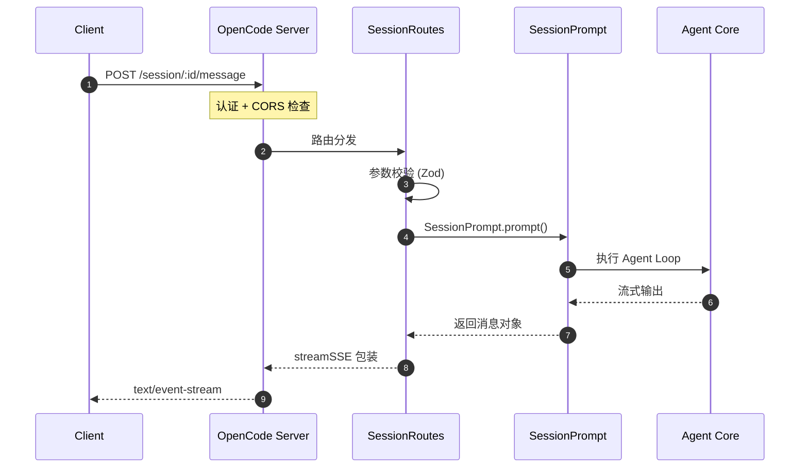
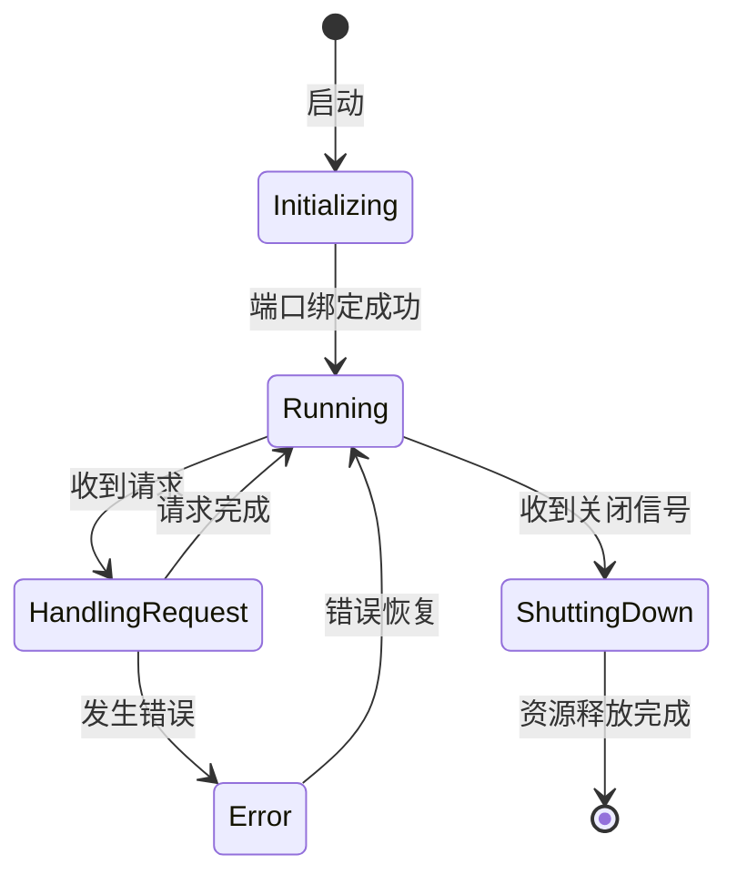
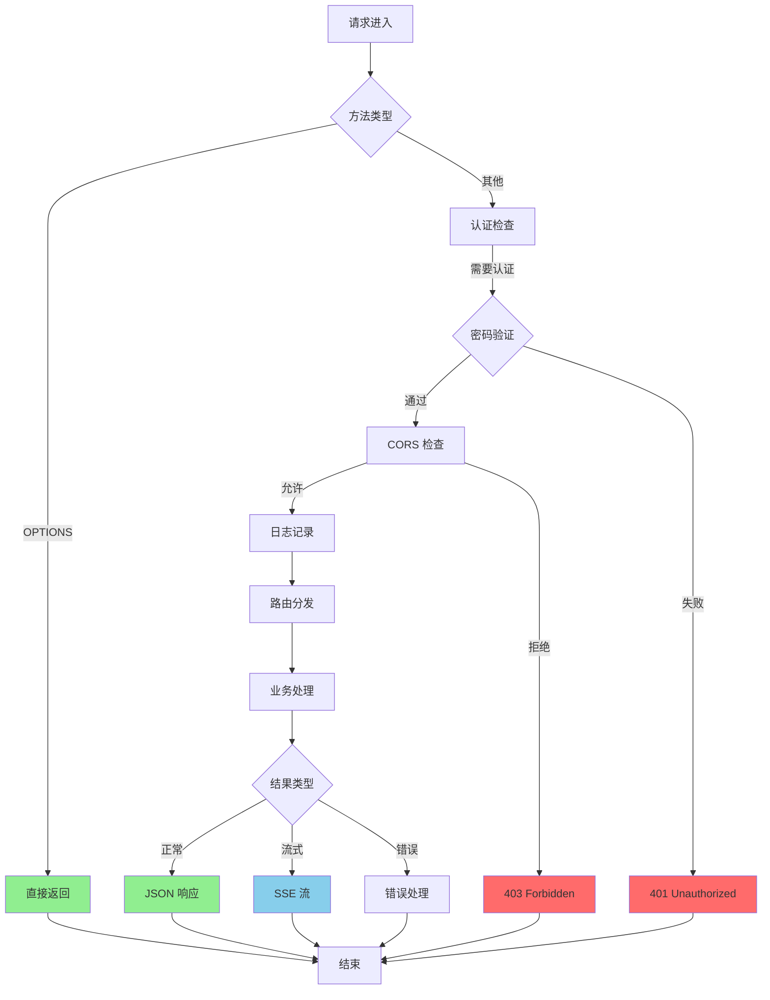
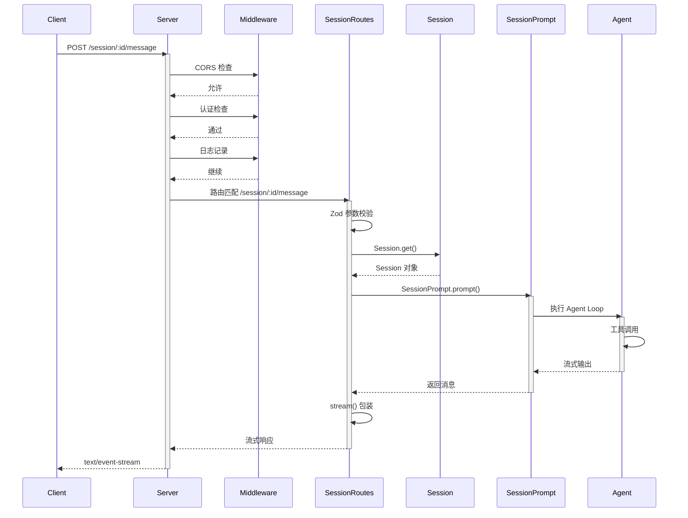
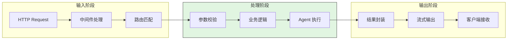
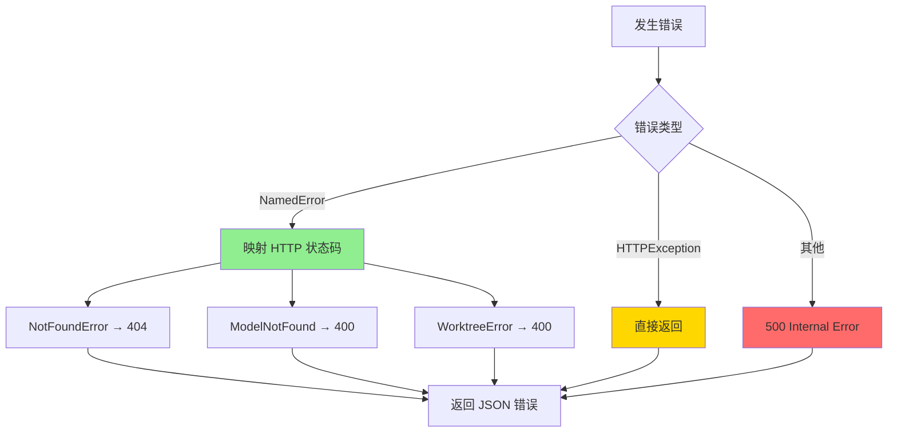
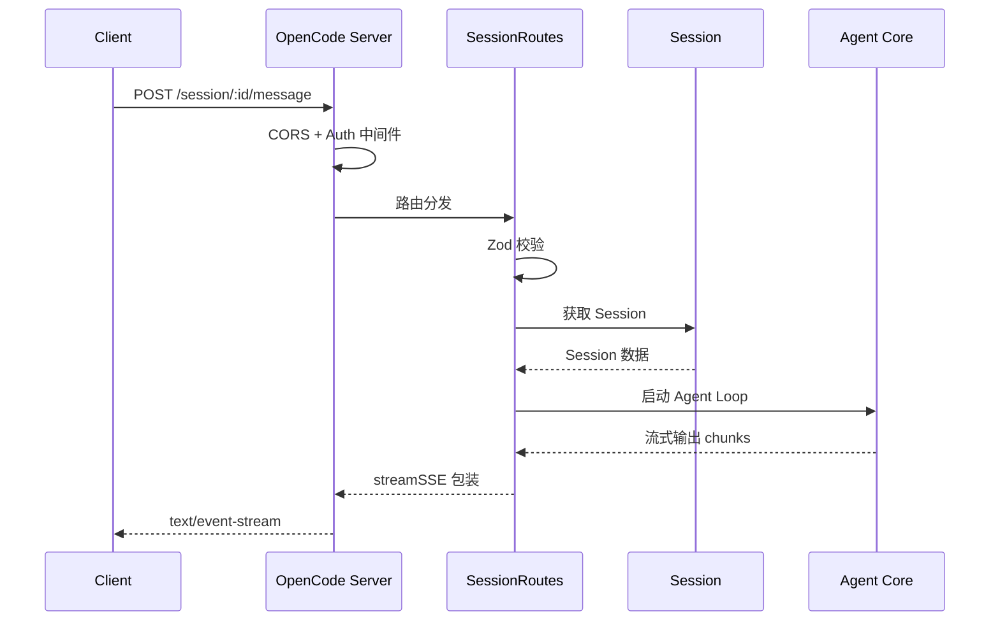
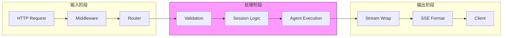
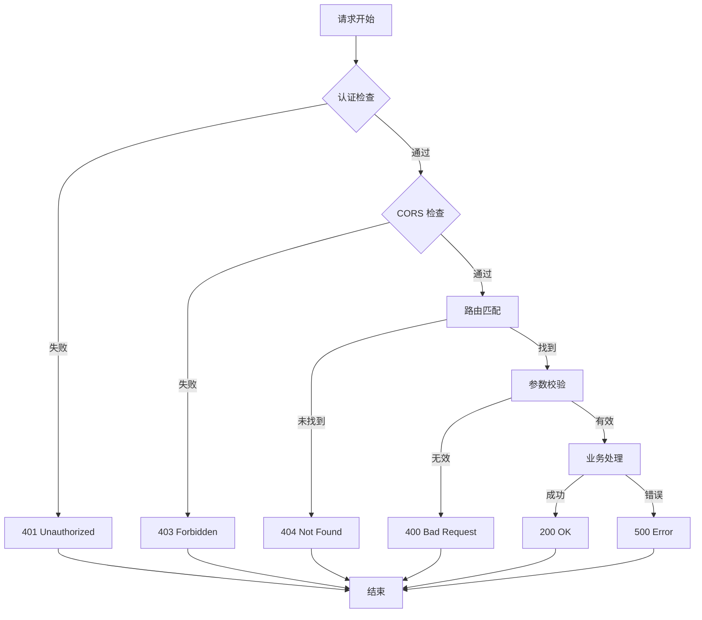
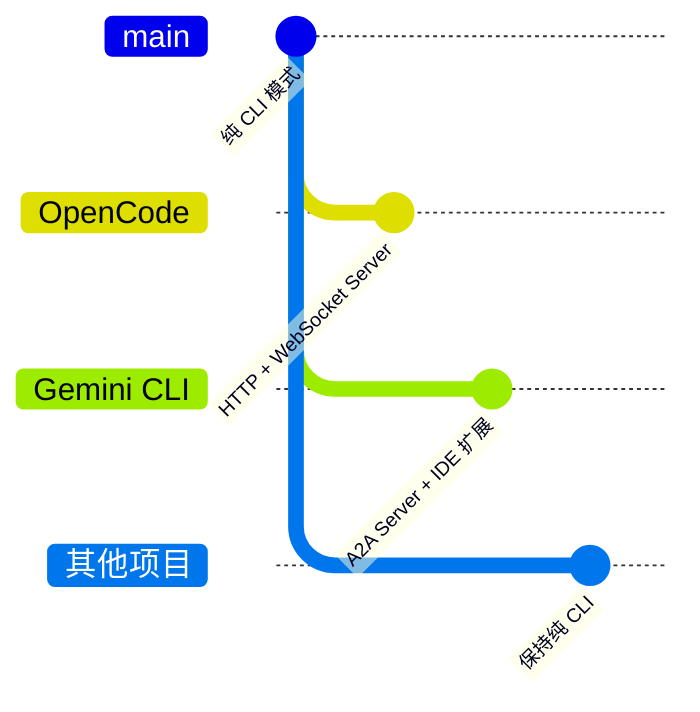

# Web Server 模式

> 📋 **阅读指南**
>
> | 属性 | 说明 |
> |-----|------|
> | 预计阅读 | 20-30 分钟 |
> | 前置文档 | `01-{project}-overview.md`、`04-{project}-agent-loop.md` |
> | 文档结构 | 速览 → 架构 → 机制 → 实现 → 对比 |
> | 代码呈现 | 关键代码直接展示，完整代码可折叠查看 |

---

## TL;DR（结论先行）

一句话定义：Web Server 模式是将 AI Coding Agent 从**本地 CLI 工具**转变为**可远程访问的服务**，支持多客户端接入和 IDE 集成。

跨项目核心取舍：**只有 OpenCode 内置完整的 HTTP + WebSocket Server**（对比 Gemini CLI 的 A2A Server 和 IDE 扩展、其他项目纯 CLI）

### 核心要点速览

| 维度 | 关键决策 | 代码位置 |
|-----|---------|---------|
| 核心机制 | Hono + Bun 构建 HTTP/WebSocket 服务 | `opencode/packages/opencode/src/server/server.ts:576` |
| 状态管理 | Session 隔离，支持多会话并发 | `opencode/packages/opencode/src/server/routes/session.ts:22` |
| 错误处理 | NamedError 映射 HTTP 状态码 | `opencode/packages/opencode/src/server/server.ts:66-78` |
| 实时通信 | SSE (text/event-stream) 流式输出 | `opencode/packages/opencode/src/server/routes/session.ts:727` |
| 认证授权 | Basic Auth (可选，支持本地开发无密码) | `opencode/packages/opencode/src/server/server.ts:84-94` |

---

## 1. 为什么需要这个机制？（解决什么问题）

### 1.1 问题场景

**不需要 Web Server 的场景：**
- 个人开发辅助（本地 CLI 足够）
- 学术研究（批量执行，无交互）

**需要 Web Server 的场景：**
- 团队共享一个 Agent 服务（集中部署）
- IDE 插件需要后台服务支持
- 构建 Agent 平台（多用户、多 session）

```
示例：
没有 Web Server：开发者必须在本地安装 CLI → 每个成员单独配置 → 无法统一管控

有 Web Server：部署一个 Agent 服务 → 团队成员通过浏览器/IDE 插件接入 → 集中管理配置和权限
```

### 1.2 核心挑战

| 挑战 | 不解决的后果 |
|-----|-------------|
| 网络暴露风险 | 本地 CLI 无网络攻击面，Web Server 需处理认证授权 |
| 多会话隔离 | 多用户同时访问时，会话数据可能相互干扰 |
| 实时通信 | HTTP 请求-响应模式无法满足流式输出需求 |
| 资源限制 | 长时间运行的服务需要处理连接管理、超时、内存泄漏 |

---

## 2. 整体架构（ASCII 图）

### 2.1 在系统中的位置

```text
┌─────────────────────────────────────────────────────────────┐
│ Client Layer (浏览器/IDE/其他客户端)                          │
│ ├── Web UI (OpenCode Web Interface)                         │
│ ├── IDE Extension (Gemini VS Code 扩展)                     │
│ └── A2A Client (Google A2A 协议客户端)                      │
└───────────────────────┬─────────────────────────────────────┘
                        │ HTTP / WebSocket / MCP
                        ▼
┌─────────────────────────────────────────────────────────────┐
│ ▓▓▓ Web Server Layer ▓▓▓                                    │
│ ┌─────────────────────────────────────────────────────────┐ │
│ │ OpenCode Server (Hono + Bun)                            │ │
│ │ packages/opencode/src/server/server.ts:47-623           │ │
│ │ - HTTP Router: REST API 路由                            │ │
│ │ - WebSocket Handler: 实时消息流                         │ │
│ │ - SSE Endpoint: /event 事件流                           │ │
│ └─────────────────────────────────────────────────────────┘ │
│ ┌─────────────────────────────────────────────────────────┐ │
│ │ Gemini A2A Server (Express)                             │ │
│ │ packages/a2a-server/src/http/app.ts:156-331             │ │
│ │ - A2A Protocol: Google Agent2Agent 协议                 │ │
│ │ - Task Management: 任务创建和状态管理                   │ │
│ └─────────────────────────────────────────────────────────┘ │
│ ┌─────────────────────────────────────────────────────────┐ │
│ │ Gemini IDE Server (Express + MCP)                       │ │
│ │ packages/vscode-ide-companion/src/ide-server.ts:120-432 │ │
│ │ - MCP Protocol: Model Context Protocol                  │ │
│ │ - IDE Context: 文件状态同步                             │ │
│ └─────────────────────────────────────────────────────────┘ │
└───────────────────────┬─────────────────────────────────────┘
                        │ 调用
                        ▼
┌─────────────────────────────────────────────────────────────┐
│ Agent Core (共享核心逻辑)                                     │
│ ├── Session Management                                      │
│ ├── Tool Execution                                          │
│ └── LLM API Integration                                     │
└─────────────────────────────────────────────────────────────┘
```

### 2.2 核心组件职责

| 组件 | 职责 | 代码位置 |
|-----|------|---------|
| `Server.listen()` | 启动 HTTP 服务器，配置 CORS、认证 | `opencode/packages/opencode/src/server/server.ts:576` |
| `SessionRoutes` | 会话 CRUD、消息发送、流式响应 | `opencode/packages/opencode/src/server/routes/session.ts:22` |
| `App` | Hono 路由组合，错误处理中间件 | `opencode/packages/opencode/src/server/server.ts:57-559` |
| `createApp()` | Gemini A2A Server 初始化 | `gemini-cli/packages/a2a-server/src/http/app.ts:156` |
| `IDEServer` | VS Code 扩展 MCP 服务 | `gemini-cli/packages/vscode-ide-companion/src/ide-server.ts:120` |

### 2.3 核心组件交互关系



**关键交互说明**：

| 步骤 | 交互内容 | 设计意图 |
|-----|---------|---------|
| 1 | 客户端发送消息请求 | 标准 HTTP POST，便于集成 |
| 2 | 中间件链处理 | 认证、CORS、日志分层处理 |
| 3 | Zod 参数校验 | 运行时类型安全 |
| 4 | 调用 Prompt 系统 | 复用 CLI 模式的核心逻辑 |
| 5 | Agent Loop 执行 | 与 CLI 共享相同执行引擎 |
| 6 | SSE 流式返回 | 实时展示 Agent 思考过程 |

---

## 3. 核心组件详细分析

### 3.1 OpenCode Server 内部结构

#### 职责定位

OpenCode Server 是完整的 HTTP + WebSocket 服务实现，提供 REST API 和 Server-Sent Events 支持。

#### 状态机图



**状态说明**：

| 状态 | 说明 | 进入条件 | 退出条件 |
|-----|------|---------|---------|
| Initializing | 初始化中 | 调用 listen() | Bun.serve() 成功 |
| Running | 运行中 | 端口绑定成功 | 关闭信号 |
| HandlingRequest | 处理请求 | 收到 HTTP 请求 | 响应发送完成 |
| Error | 错误状态 | 异常抛出 | 错误处理完成 |
| ShuttingDown | 关闭中 | 调用 stop() | 连接清理完成 |

#### 内部数据流

```text
┌─────────────────────────────────────────────────────────────┐
│  输入层                                                      │
│  ├── HTTP Request ──► Hono Router ──► 路由匹配              │
│  └── WebSocket ─────► WS Handler ───► 连接管理              │
└──────────────────────────┬──────────────────────────────────┘
                           ▼
┌─────────────────────────────────────────────────────────────┐
│  处理层                                                      │
│  ├── 中间件链: CORS → Auth → Logging                        │
│  ├── 路由处理: REST API / SSE / WebSocket                   │
│  │   └── Session / Project / File / MCP Routes              │
│  └── 错误处理: NamedError → HTTPException                   │
└──────────────────────────┬──────────────────────────────────┘
                           ▼
┌─────────────────────────────────────────────────────────────┐
│  输出层                                                      │
│  ├── JSON Response (REST)                                   │
│  ├── text/event-stream (SSE)                                │
│  └── WebSocket Message                                      │
└─────────────────────────────────────────────────────────────┘
```

#### 关键算法逻辑



**算法要点**：

1. **分层中间件**：认证 → CORS → 日志，职责分离
2. **灵活认证**：可选 basicAuth，支持无密码模式（本地开发）
3. **流式优先**：SSE 用于实时事件，WebSocket 用于双向通信

#### 关键接口

| 接口 | 输入 | 输出 | 说明 | 代码位置 |
|-----|------|------|------|---------|
| `listen()` | port, hostname, cors | Server 实例 | 启动服务器 | `server.ts:576` |
| `App()` | - | Hono 实例 | 获取配置好的路由 | `server.ts:58` |
| `event` SSE | - | EventStream | 实时事件订阅 | `server.ts:486` |

---

### 3.2 Gemini A2A Server 内部结构

#### 职责定位

实现 Google A2A (Agent2Agent) 协议，支持跨 Agent 通信和任务管理。

#### 关键接口

| 接口 | 输入 | 输出 | 说明 | 代码位置 |
|-----|------|------|------|---------|
| `createApp()` | - | Express App | 创建服务器 | `app.ts:156` |
| `POST /tasks` | agentSettings | taskId | 创建任务 | `app.ts:211` |
| `POST /executeCommand` | command, args | result/stream | 执行命令 | `app.ts:84` |

---

### 3.3 组件间协作时序

展示 OpenCode Server 如何处理一个完整的消息发送请求。



**协作要点**：

1. **中间件链**：CORS → Auth → Logging，每层可短路
2. **路由分发**：Hono 路由匹配，支持参数校验
3. **流式处理**：从 Agent 到客户端的全链路流式传输

---

### 3.4 关键数据路径

#### 主路径（正常流程）



#### 异常路径（错误恢复）



---

## 4. 端到端数据流转

### 4.1 正常流程（详细版）

展示一个消息从发送到响应的完整流程。



**数据变换详情**：

| 阶段 | 输入 | 处理 | 输出 | 代码位置 |
|-----|------|------|------|---------|
| 接收 | HTTP POST | 中间件链 | Hono Context | `server.ts:80-131` |
| 路由 | URL + Method | 路由匹配 | Route Handler | `server.ts:231` |
| 校验 | JSON Body | Zod Schema | Typed Object | `session.ts:723` |
| 处理 | PromptInput | Agent Loop | Message Stream | `session.ts:727-733` |
| 输出 | Stream | SSE 包装 | text/event-stream | `session.ts:727` |

### 4.2 数据流向图



### 4.3 异常/边界流程



---

## 5. 关键代码实现

### 5.1 核心数据结构

```typescript
// opencode/packages/opencode/src/server/server.ts:47-55
export namespace Server {
  const log = Log.create({ service: "server" })
  let _url: URL | undefined
  let _corsWhitelist: string[] = []

  export function url(): URL {
    return _url ?? new URL("http://localhost:4096")
  }
```

**字段说明**：
| 字段 | 类型 | 用途 |
|-----|------|------|
| `_url` | `URL \| undefined` | 服务器实际监听地址 |
| `_corsWhitelist` | `string[]` | 额外的 CORS 白名单 |

### 5.2 主链路代码

**关键代码**（核心逻辑）：

```typescript
// opencode/packages/opencode/src/server/routes/session.ts:694-734
.post(
  "/:sessionID/message",
  describeRoute({
    summary: "Send message",
    description: "Create and send a new message to a session, streaming the AI response.",
    operationId: "session.prompt",
  }),
  validator("json", SessionPrompt.PromptInput.omit({ sessionID: true })),
  async (c) => {
    c.status(200)
    c.header("Content-Type", "application/json")
    return stream(c, async (stream) => {
      const sessionID = c.req.valid("param").sessionID
      const body = c.req.valid("json")
      const msg = await SessionPrompt.prompt({ ...body, sessionID })
      stream.write(JSON.stringify(msg))
    })
  },
)
```

**设计意图**（非逐行解释，说明关键设计）：
1. **流式响应**：使用 `stream()` 包装，支持大消息分块传输
2. **参数校验**：Zod Schema 确保类型安全
3. **复用核心逻辑**：`SessionPrompt.prompt()` 与 CLI 模式共用

<details>
<summary>📋 查看完整实现（含错误处理、日志等）</summary>

```typescript
// opencode/packages/opencode/src/server/routes/session.ts:694-750
.post(
  "/:sessionID/message",
  describeRoute({
    summary: "Send message",
    description: "Create and send a new message to a session, streaming the AI response.",
    operationId: "session.prompt",
  }),
  validator("json", SessionPrompt.PromptInput.omit({ sessionID: true })),
  async (c) => {
    c.status(200)
    c.header("Content-Type", "application/json")
    return stream(c, async (stream) => {
      const sessionID = c.req.valid("param").sessionID
      const body = c.req.valid("json")
      const msg = await SessionPrompt.prompt({ ...body, sessionID })
      stream.write(JSON.stringify(msg))
    })
  },
)
```

</details>

### 5.3 关键调用链

```text
Server.listen()           [opencode/packages/opencode/src/server/server.ts:576]
  -> Bun.serve()          [server.ts:593]
    -> App().fetch()      [server.ts:588]
      -> Hono Router      [server.ts:57]
        -> Middleware     [server.ts:80-131]
          -> Route Handler [session.ts:694]
            - Zod Validation
            - SessionPrompt.prompt()
            - stream() response
```

---

## 6. 设计意图与 Trade-off

### 6.1 各项目的选择

| 维度 | OpenCode | Gemini CLI | 其他项目 |
|-----|----------|------------|----------|
| **Server 模式** | 内置 HTTP + WebSocket | A2A Server + IDE 扩展 | 不支持 |
| **框架选择** | Hono + Bun | Express | - |
| **实时通信** | SSE + WebSocket | A2A 协议 + MCP | - |
| **多会话支持** | 是 (Session 隔离) | 是 (Task 管理) | - |
| **认证方式** | Basic Auth (可选) | Bearer Token | - |

### 6.2 为什么这样设计？

**核心问题**：为什么大多数 Agent CLI 不内置 Web Server？

**OpenCode 的解决方案**：
- 代码依据：`opencode/packages/opencode/src/server/server.ts:47-623` ✅ Verified
- 设计意图：提供完整的 Web 集成能力，支持浏览器客户端和第三方集成
- 带来的好处：
  - 远程访问能力
  - 多客户端同时接入
  - 与现有 Web 基础设施集成
- 付出的代价：
  - 引入网络安全风险
  - 需要额外的运维管理
  - 增加代码复杂度

**Gemini CLI 的解决方案**：
- 代码依据：`gemini-cli/packages/a2a-server/src/http/app.ts:156-331` ✅ Verified
- 设计意图：通过 A2A 协议实现 Agent 间通信，IDE 扩展通过 MCP 协议集成
- 带来的好处：
  - 标准化协议（A2A、MCP）
  - 专注于 Agent 协作而非通用 Web 服务
- 付出的代价：
  - 需要专用客户端
  - 不直接支持浏览器访问

### 6.3 与其他项目的对比



| 项目 | 核心差异 | 适用场景 |
|-----|---------|---------|
| OpenCode | 完整的 Web Server，支持浏览器直接访问 | 需要 Web UI、多用户共享服务 |
| Gemini CLI | A2A 协议 + IDE 扩展，专注 Agent 协作 | IDE 集成、Agent 间通信 |
| Codex | 纯 CLI，无网络暴露；沙箱安全优先 | 本地开发、安全敏感环境 |
| Kimi CLI | 纯 CLI；Checkpoint 状态持久化 | 本地开发、需要状态回滚 |
| SWE-agent | 纯 CLI；专注代码修复任务 | 学术研究、批量代码修复 |

---

## 7. 边界情况与错误处理

### 7.1 终止条件

| 终止原因 | 触发条件 | 代码位置 |
|---------|---------|---------|
| 端口占用 | 启动时端口被占用 | `server.ts:591-599` |
| 客户端断开 | SSE 连接中断 | `server.ts:533-538` |
| 实例释放 | POST /instance/dispose | `server.ts:239-258` |
| 会话取消 | POST /session/:id/abort | `session.ts:354-382` |

### 7.2 超时/资源限制

```typescript
// opencode/packages/opencode/src/server/server.ts:523-530
// Send heartbeat every 10s to prevent stalled proxy streams.
const heartbeat = setInterval(() => {
  stream.writeSSE({
    data: JSON.stringify({
      type: "server.heartbeat",
      properties: {},
    }),
  })
}, 10_000)
```

### 7.3 错误恢复策略

| 错误类型 | 处理策略 | 代码位置 |
|---------|---------|---------|
| NamedError | 映射到对应 HTTP 状态码 | `server.ts:66-78` |
| HTTPException | 直接返回异常响应 | `server.ts:74` |
| 未知错误 | 500 + 堆栈信息 | `server.ts:75-78` |
| CORS 错误 | 403 Forbidden | `server.ts:128` |
| 认证失败 | 401 Unauthorized | `server.ts:87` |

---

## 8. 关键代码索引

| 功能 | 文件 | 行号 | 说明 |
|-----|------|------|------|
| 服务器入口 | `opencode/packages/opencode/src/server/server.ts` | 47 | Server 命名空间 |
| 启动监听 | `opencode/packages/opencode/src/server/server.ts` | 576 | listen() 方法 |
| 会话路由 | `opencode/packages/opencode/src/server/routes/session.ts` | 22 | SessionRoutes |
| 消息发送 | `opencode/packages/opencode/src/server/routes/session.ts` | 694 | POST /message |
| 错误处理 | `opencode/packages/opencode/src/server/server.ts` | 62 | onError 中间件 |
| SSE 事件 | `opencode/packages/opencode/src/server/server.ts` | 486 | /event 端点 |
| A2A Server | `gemini-cli/packages/a2a-server/src/http/app.ts` | 156 | createApp() |
| IDE Server | `gemini-cli/packages/vscode-ide-companion/src/ide-server.ts` | 120 | IDEServer 类 |

---

## 9. 延伸阅读

- 前置知识：`docs/opencode/04-opencode-agent-loop.md`
- 相关机制：`docs/opencode/07-opencode-memory-context.md`
- 深度分析：`docs/comm/06-comm-mcp-integration.md`

---

*✅ Verified: 基于 opencode/packages/opencode/src/server/server.ts、gemini-cli/packages/a2a-server/src/http/app.ts 等源码分析*
*基于版本：2026-02-08 | 最后更新：2026-03-03*
