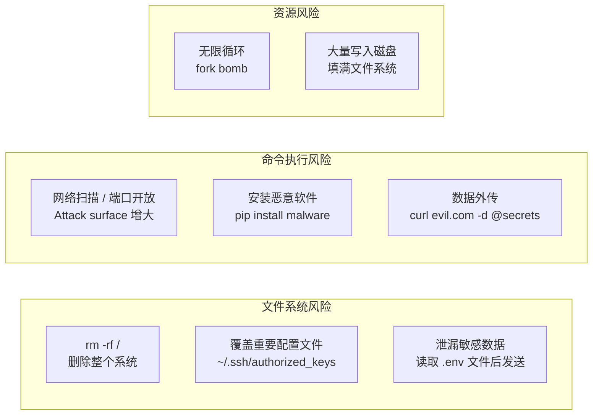
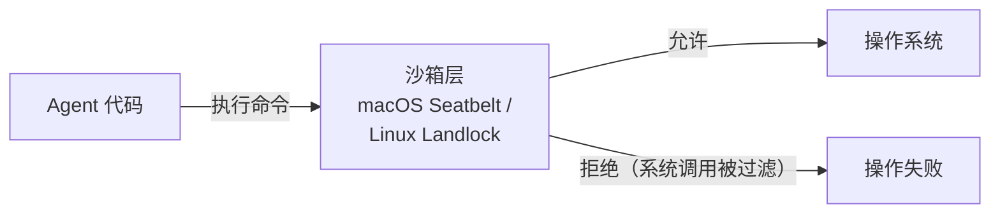
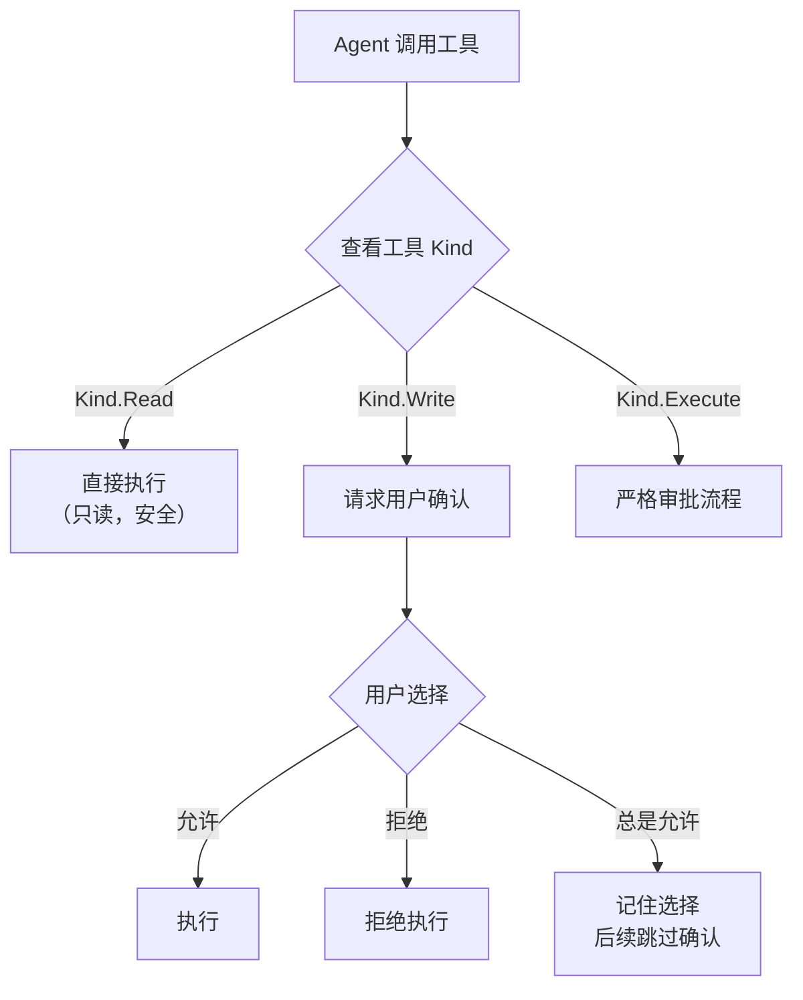
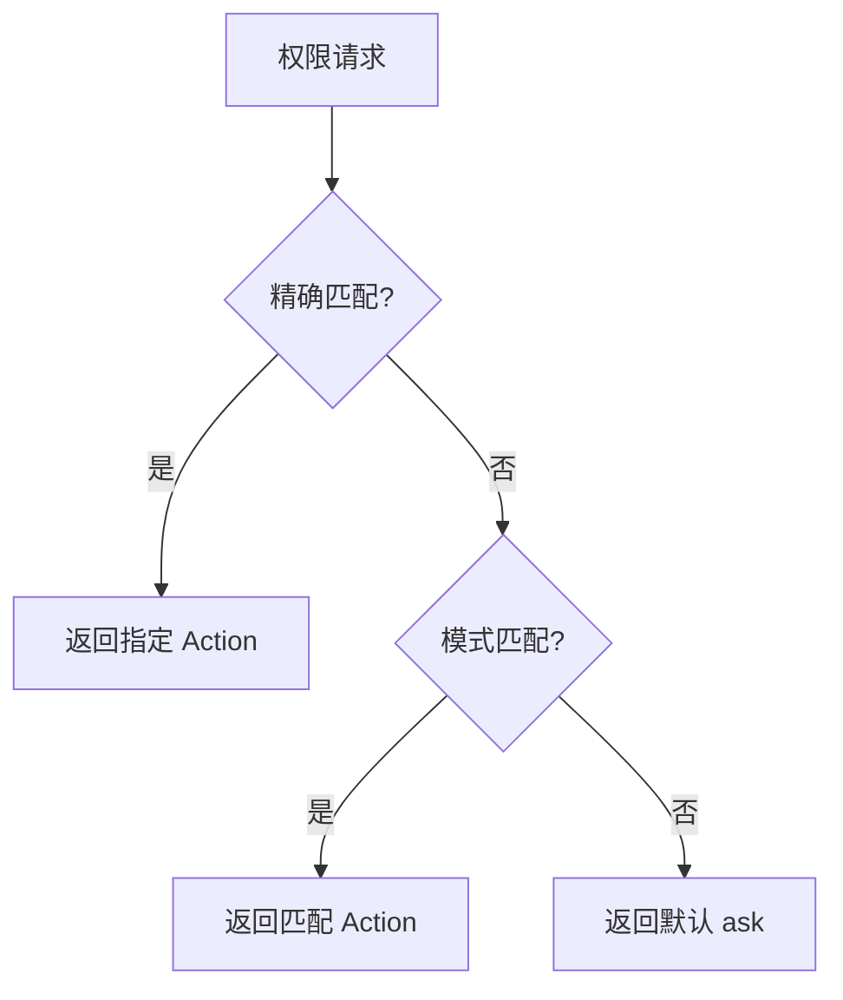
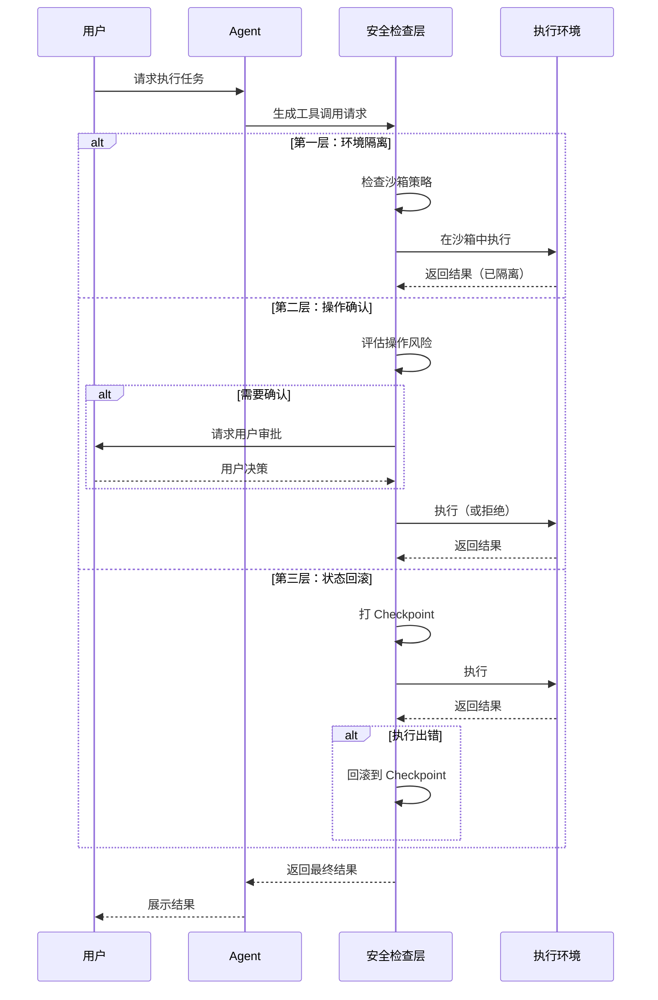
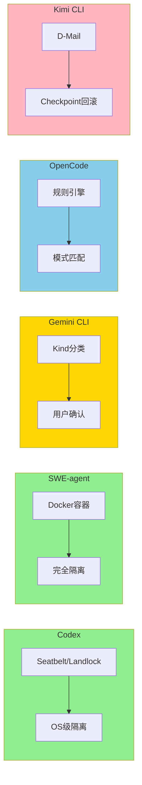

# 安全控制机制

> **文档类型说明**：本文档为跨项目对比分析，对比 5 个 AI Coding Agent 项目的安全控制实现差异。

## TL;DR（结论先行）

一句话定义：安全控制是 Code Agent 的**最后一道防线**，防止 LLM 执行危险操作（删除文件、执行恶意命令、数据外传）。

跨项目的核心取舍：**三层防御体系**——环境隔离（最强）→ 操作确认（折中）→ 状态回滚（补救）（对比各项目的不同层次选择：Codex 选 OS 级沙箱、SWE-agent 选 Docker、Gemini CLI 选 Kind 审批、OpenCode 选规则引擎、Kimi CLI 选 Checkpoint 回滚）

---

## 1. 为什么需要这个机制？（解决什么问题）

### 1.1 问题场景

Code Agent 能执行 shell 命令、读写文件 —— 这意味着一行错误指令就可能：

```
没有安全控制：
  用户: "帮我清理临时文件"
  LLM: "rm -rf /tmp/*" → 实际执行 "rm -rf / tmp/*"（空格错误）
  → 系统被删除 → 灾难

有安全控制（三层防御）：
  第一层（环境隔离）：命令在沙箱中执行，只能访问工作目录
  第二层（操作确认）：删除操作触发用户确认
  第三层（状态回滚）：误删后立即恢复到之前状态
```

### 1.2 核心挑战

| 挑战 | 不解决的后果 |
|-----|-------------|
| 文件系统风险 | `rm -rf /` 删除整个系统；覆盖 `~/.ssh/authorized_keys` 导致无法登录 |
| 命令执行风险 | 网络扫描增大攻击面；`pip install malware` 安装恶意软件；数据外传到恶意服务器 |
| 资源风险 | fork bomb 无限循环；大量写入磁盘填满文件系统 |

**核心矛盾：** Agent 需要足够多的权限才能完成任务（读写代码、运行测试），但权限太大会有风险。安全设计本质是在**能力**和**安全**之间找平衡点。

---

## 2. 整体架构（ASCII 图）

### 2.1 三层防御体系

```text
┌─────────────────────────────────────────────────────────────────────────┐
│ 第一层：环境隔离（最强，独立沙箱）                                         │
│ ┌─────────────┐  ┌─────────────────┐  ┌─────────────────────────────┐   │
│ │ Docker容器   │  │ Seatbelt/Landlock│  │  Windows 受限令牌           │   │
│ │ SWE-agent   │  │ Codex           │  │  （实验性）                  │   │
│ └─────────────┘  └─────────────────┘  └─────────────────────────────┘   │
└─────────────────────────────────┬───────────────────────────────────────┘
                                  │ 如果无法隔离，则进入第二层
                                  ▼
┌─────────────────────────────────────────────────────────────────────────┐
│ 第二层：操作确认（折中，人工审批）                                         │
│ ┌─────────────┐  ┌─────────────────┐  ┌─────────────────────────────┐   │
│ │ Kind分类    │  │ PermissionNext  │  │  简单确认列表                │   │
│ │ Gemini CLI  │  │ OpenCode        │  │  （大多数项目）               │   │
│ └─────────────┘  └─────────────────┘  └─────────────────────────────┘   │
└─────────────────────────────────┬───────────────────────────────────────┘
                                  │ 如果已执行但出错，进入第三层
                                  ▼
┌─────────────────────────────────────────────────────────────────────────┐
│ 第三层：状态回滚（补救，出错后恢复）                                       │
│ ┌─────────────────────────────────────────────────────────────────────┐ │
│ │ D-Mail / Checkpoint 回滚                                            │ │
│ │ Kimi CLI                                                            │ │
│ └─────────────────────────────────────────────────────────────────────┘ │
└─────────────────────────────────────────────────────────────────────────┘
```

### 2.2 核心组件职责

| 组件 | 职责 | 代表项目 |
|-----|------|---------|
| `Sandbox` | 在操作系统层面限制进程权限（文件访问、网络、系统调用） | Codex, SWE-agent |
| `PermissionManager` | 根据规则评估操作风险，决定允许/拒绝/询问 | Gemini CLI, OpenCode |
| `Checkpoint` | 保存对话状态，支持回滚到历史节点 | Kimi CLI |

### 2.3 威胁模型



---

## 3. 核心组件详细分析

### 3.1 环境隔离层（第一层）

#### 职责定位

在 Agent 代码运行之前就限制其能做什么，是最彻底的安全措施。

#### Codex：OS 级沙箱（macOS Seatbelt / Linux Landlock）

**架构图：**



**关键代码：**

```rust
// codex/codex-rs/core/src/seatbelt.rs:26
const MACOS_SEATBELT_BASE_POLICY: &str = include_str!("seatbelt_base_policy.sbpl");
const MACOS_SEATBELT_NETWORK_POLICY: &str = include_str!("seatbelt_network_policy.sbpl");
const MACOS_SEATBELT_PLATFORM_DEFAULTS: &str = include_str!("seatbelt_platform_defaults.sbpl");

// codex/codex-rs/core/src/seatbelt.rs:36
pub async fn spawn_command_under_seatbelt(
    command: Vec<String>,
    command_cwd: PathBuf,
    sandbox_policy: &SandboxPolicy,
    // ...
) -> anyhow::Result<Child> {
    // 通过 sandbox-exec 执行命令
}
```

**沙箱策略**（`codex/codex-rs/core/src/sandboxing/mod.rs:114-129`）：

```rust
SandboxPolicy::DangerFullAccess  // 无限制（开发调试用）
SandboxPolicy::ExternalSandbox { network_access: NetworkAccess::Enabled, .. }
SandboxPolicy::ReadOnly  // 只读模式（最安全）
```

**macOS Seatbelt 限制：**
- 只读路径：除工作目录外的大多数文件系统
- 网络隔离：三级策略 —— `full`（完全访问）/ `host-only`（仅本机）/ `none`（无网络）
- 进程限制：防止 fork bomb

**工程取舍：** 最强的隔离，但 macOS 专用（Seatbelt）或 Linux 专用（Landlock），跨平台需要多套实现。

#### SWE-agent：Docker 容器隔离

**架构图：**

```text
宿主机
├── SWE-agent 进程（控制）
└── Docker 容器（执行）
    ├── 独立文件系统（挂载的项目目录）
    ├── 独立网络（可配置）
    └── 独立进程空间
```

即使 Agent 执行了破坏性命令（如 `rm -rf /`），也只影响容器内部，宿主机安全。

**工程取舍：** 跨平台（Linux/macOS/Windows 都能用 Docker），隔离彻底；但容器启动慢（通常需要 5-30 秒），不适合轻量交互场景。

---

### 3.2 操作确认层（第二层）

#### 职责定位

当无法或不适合使用环境隔离时，通过用户审批来控制危险操作。

#### Gemini CLI：Kind 分类审批

**状态机图：**



**关键代码：**

```typescript
// gemini-cli/packages/core/src/tools/tools.ts:312
interface Tool<TParams, TResult> {
  // ...
  kind: Kind;  // 工具分类：Read / Write / Execute
  // ...
}
```

**工程取舍：** 实现简单，不需要额外依赖；但保护依赖"工具的 Kind 设置是否正确"，分错 Kind 会影响安全策略。用户确认有"确认疲劳"问题（频繁确认会让用户倾向于无脑点"允许"）。

#### OpenCode：规则引擎 + 模式匹配

**规则评估流程：**



**关键代码：**

```typescript
// opencode/packages/opencode/src/permission/next.ts:25
export const Action = z.enum(["allow", "deny", "ask"])

// opencode/packages/opencode/src/permission/next.ts:236
export function evaluate(permission: string, pattern: string, ...rulesets: Ruleset[]): Rule {
    const merged = merge(...rulesets)
    const match = merged.findLast(
      (rule) => Wildcard.match(permission, rule.permission) && Wildcard.match(pattern, rule.pattern),
    )
    return match ?? { action: "ask", permission, pattern: "*" }
}
```

**规则示例：**

```typescript
permissions = {
    "bash": {              // 工具类型
        "rm -rf *": "deny", // 精确匹配 → 总是拒绝
        "npm install": "ask", // 精确匹配 → 每次询问
        "*": "allow"        // 通配符 → 默认允许
    }
}
```

**工程取舍：** 最灵活，可以配置任意规则；但规则复杂度高，用户需要理解配置语法。

---

### 3.3 状态回滚层（第三层）

#### 职责定位

当危险操作已经执行，提供一种"反悔"机制恢复到之前状态。

#### Kimi CLI：D-Mail 回滚机制

**数据流图：**

```text
┌─────────────────────────────────────────────────────────────┐
│  执行前                                                      │
│  ├── 打 Checkpoint ──► 保存对话历史到文件                    │
│  └── 继续执行工具                                            │
└──────────────────────────┬──────────────────────────────────┘
                           ▼
┌─────────────────────────────────────────────────────────────┐
│  执行后（发现问题）                                           │
│  ├── LLM 调用 SendDMail 工具                                  │
│  │   └── 指定 checkpoint_id                                   │
│  └── 系统回滚到指定 Checkpoint                                │
│      └── 截断对话历史（但不回滚文件系统）                      │
└─────────────────────────────────────────────────────────────┘
```

**关键代码：**

```python
# kimi-cli/src/kimi_cli/soul/denwarenji.py:6-9
class DMail(BaseModel):
    message: str = Field(description="The message to send.")
    checkpoint_id: int = Field(description="The checkpoint to send the message back to.", ge=0)
    # TODO: allow restoring filesystem state to the checkpoint

# kimi-cli/src/kimi_cli/soul/context.py:80-99
async def revert_to(self, checkpoint_id: int):
    """Revert the context to the specified checkpoint."""
    if checkpoint_id >= self._next_checkpoint_id:
        raise ValueError(f"Checkpoint {checkpoint_id} does not exist")
    # rotate the context file
```

**⚠️ 重要限制：** 只回滚 LLM 看到的历史，**不回滚文件系统**。

**工程取舍：** 不是传统意义的安全隔离，而是给 LLM 一个"反悔"的能力 —— 当探索方向错误时，可以抛弃无效路径。

---

## 4. 端到端数据流转

### 4.1 安全控制完整流程



### 4.2 各项目安全控制路径对比



---

## 5. 关键代码实现

### 5.1 核心数据结构

**Codex SandboxPolicy：**

```rust
// codex/codex-rs/core/src/protocol.rs（SandboxPolicy 定义位置）
// 三种模式：DangerFullAccess / ExternalSandbox / ReadOnly
```

**OpenCode 权限规则：**

```typescript
// opencode/packages/opencode/src/permission/next.ts:30-39
export const Rule = z.object({
  permission: z.string(),
  pattern: z.string(),
  action: Action,  // "allow" | "deny" | "ask"
})
```

### 5.2 主链路代码

**Codex 沙箱执行：**

```rust
// codex/codex-rs/core/src/sandboxing/mod.rs:97-131
pub(crate) fn select_initial(
    &self,
    policy: &SandboxPolicy,
    pref: SandboxablePreference,
    windows_sandbox_level: WindowsSandboxLevel,
    has_managed_network_requirements: bool,
) -> SandboxType {
    match pref {
        SandboxablePreference::Forbid => SandboxType::None,
        SandboxablePreference::Require => {
            crate::safety::get_platform_sandbox(
                windows_sandbox_level != WindowsSandboxLevel::Disabled,
            )
            .unwrap_or(SandboxType::None)
        }
        // ...
    }
}
```

**代码要点：**
1. **三层策略选择**：根据用户偏好（Forbid/Require/Auto）和策略配置动态选择沙箱类型
2. **平台适配**：macOS 用 Seatbelt，Linux 用 Landlock，Windows 用受限令牌
3. **网络需求感知**：有网络需求时强制启用平台沙箱

### 5.3 关键调用链

```text
Codex 沙箱执行链:
  spawn_command_under_seatbelt()   [codex/codex-rs/core/src/seatbelt.rs:36]
    -> create_seatbelt_command_args()  [seatbelt.rs]
      -> 生成 sandbox-exec 命令参数
        -> spawn_child_async()         [spawn.rs]
          - 执行沙箱包装后的命令

OpenCode 权限检查链:
  PermissionNext.ask()             [opencode/packages/opencode/src/permission/next.ts:131]
    -> evaluate()                    [next.ts:236]
      - Wildcard.match() 匹配规则
      - 返回 allow/deny/ask 决策

Kimi CLI 回滚链:
  DenwaRenji.send_dmail()          [kimi-cli/src/kimi_cli/soul/denwarenji.py:21]
    -> Context.revert_to()           [kimi-cli/src/kimi_cli/soul/context.py:80]
      - 验证 checkpoint_id 有效性
      - 截断对话历史
      - 旋转上下文文件
```

---

## 6. 设计意图与 Trade-off

### 6.1 各项目的选择对比

| 维度 | Codex | SWE-agent | Gemini CLI | OpenCode | Kimi CLI |
|-----|-------|-----------|------------|----------|----------|
| **核心方案** | OS 级沙箱 | Docker 容器 | Kind 审批 | 规则引擎 | Checkpoint 回滚 |
| **隔离强度** | 强（syscall 过滤） | 最强（OS 级） | 弱（仅事前询问） | 可配置 | 无（事后补救） |
| **性能影响** | 低 | 高（容器启动慢） | 无 | 无 | 低 |
| **跨平台** | ❌ 平台限定 | ✅ | ✅ | ✅ | ✅ |
| **实现复杂度** | 高 | 中 | 低 | 中 | 低 |
| **用户干预** | 无 | 无 | 高 | 可配置 | 低 |

### 6.2 为什么这样设计？

**核心问题：** 如何在安全性和可用性之间找到平衡？

| 项目 | 设计选择 | 适用场景 |
|-----|---------|---------|
| **Codex** | OS 级沙箱（Seatbelt/Landlock） | 企业级安全需求，接受平台限定 |
| **SWE-agent** | Docker 容器 | 需要完全隔离，接受启动延迟 |
| **Gemini CLI** | Kind 分类审批 | 日常开发辅助，强调用户体验 |
| **OpenCode** | 规则引擎 | 需要精细控制特定命令 |
| **Kimi CLI** | D-Mail 回滚 | 探索性长任务，不怕文件改动但想控制上下文 |

### 6.3 工程取舍分析

**选择策略：**
- 在陌生代码库上执行任意命令 → 优先 Docker 或 Seatbelt
- 日常开发辅助、只读操作为主 → Kind 分类审批足够
- 需要精细控制特定命令 → OpenCode 规则引擎
- 探索性长任务，不怕文件改动但想控制上下文 → Kimi CLI D-Mail

---

## 7. 边界情况与错误处理

### 7.1 安全边界情况

| 边界情况 | 风险描述 | 各项目处理 |
|---------|---------|-----------|
| **沙箱逃逸** | Agent 绕过沙箱限制执行危险操作 | Codex: Seatbelt 策略文件严格限制系统调用；SWE-agent: Docker 容器边界 |
| **审批绕过** | 通过混淆命令绕过规则匹配 | OpenCode: 精确匹配 > 模式匹配优先级；Gemini CLI: Kind 由工具开发者定义，不易绕过 |
| **策略冲突** | 多条规则相互矛盾 | OpenCode: `findLast` 取最后匹配的规则；Kimi CLI: 无策略冲突问题 |
| **回滚失效** | Checkpoint 后文件被外部修改 | Kimi CLI: **不回滚文件系统**，仅回滚对话历史 |
| **确认疲劳** | 频繁确认导致用户无脑点击"允许" | Gemini CLI: "总是允许"选项减少重复确认 |

### 7.2 错误恢复策略

| 错误类型 | 处理策略 | 代码位置 |
|---------|---------|---------|
| 沙箱拒绝 | 返回错误信息，Agent 可尝试其他方法 | `codex/codex-rs/core/src/exec.rs` |
| 权限被拒绝 | 抛出 `DeniedError`，终止当前工具调用 | `opencode/packages/opencode/src/permission/next.ts:259-280` |
| Checkpoint 不存在 | 抛出 `ValueError`，拒绝回滚 | `kimi-cli/src/kimi_cli/soul/context.py:95-97` |
| D-Mail 重复发送 | 抛出 `DenwaRenjiError`，只允许一个待处理 D-Mail | `kimi-cli/src/kimi_cli/soul/denwarenji.py:23-24` |

### 7.3 资源限制

**Codex 沙箱资源限制：**
- 网络访问：三级策略（full/host-only/none）
- 文件系统：只读或受限写入
- 进程：防止 fork bomb

**SWE-agent 容器限制：**
- 通过 Docker 配置限制 CPU、内存、磁盘
- 网络隔离（可配置）

---

## 8. 关键代码索引

| 功能 | 项目 | 文件 | 行号 | 说明 |
|-----|------|------|------|------|
| 沙箱执行 | Codex | `codex/codex-rs/core/src/seatbelt.rs` | 36 | `spawn_command_under_seatbelt()` |
| 沙箱策略 | Codex | `codex/codex-rs/core/src/seatbelt.rs` | 26 | 基础沙箱策略（`.sbpl` 文件引用） |
| 策略选择 | Codex | `codex/codex-rs/core/src/sandboxing/mod.rs` | 97-131 | `SandboxPolicy` 三种模式及选择逻辑 |
| 工具分类 | Gemini CLI | `gemini-cli/packages/core/src/tools/tools.ts` | 312 | `kind` 字段 —— 工具分类 |
| 权限规则 | OpenCode | `opencode/packages/opencode/src/permission/next.ts` | 14 | `PermissionNext` 命名空间 |
| 操作类型 | OpenCode | `opencode/packages/opencode/src/permission/next.ts` | 25 | `Action` 枚举（allow/deny/ask） |
| 规则评估 | OpenCode | `opencode/packages/opencode/src/permission/next.ts` | 236 | `evaluate()` —— 规则评估 |
| D-Mail 定义 | Kimi CLI | `kimi-cli/src/kimi_cli/soul/denwarenji.py` | 6 | `DMail` 类定义 |
| D-Mail 发送 | Kimi CLI | `kimi-cli/src/kimi_cli/soul/denwarenji.py` | 21 | `send_dmail()` 方法 |
| 执行回滚 | Kimi CLI | `kimi-cli/src/kimi_cli/soul/context.py` | 80 | `revert_to()` —— 执行回滚 |

---

## 9. 延伸阅读

- 前置知识：`docs/comm/04-comm-agent-loop.md`（Agent 循环如何触发工具执行）
- 相关机制：
  - `docs/codex/10-codex-safety-control.md`（Codex 沙箱详细分析）
  - `docs/swe-agent/10-swe-agent-safety-control.md`（SWE-agent Docker 隔离）
  - `docs/gemini-cli/10-gemini-cli-safety-control.md`（Gemini CLI Kind 审批）
  - `docs/opencode/10-opencode-safety-control.md`（OpenCode 规则引擎）
  - `docs/kimi-cli/10-kimi-cli-safety-control.md`（Kimi CLI Checkpoint 回滚）
- 深度分析：`docs/kimi-cli/questions/kimi-cli-checkpoint-implementation.md`

---

*✅ Verified: 基于 codex/codex-rs/core/src/seatbelt.rs:36、opencode/packages/opencode/src/permission/next.ts:236、kimi-cli/src/kimi_cli/soul/denwarenji.py:6 等源码分析*
*基于版本：2026-02-08 | 最后更新：2026-02-25*
