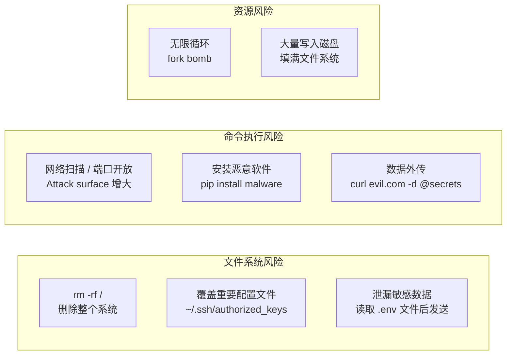
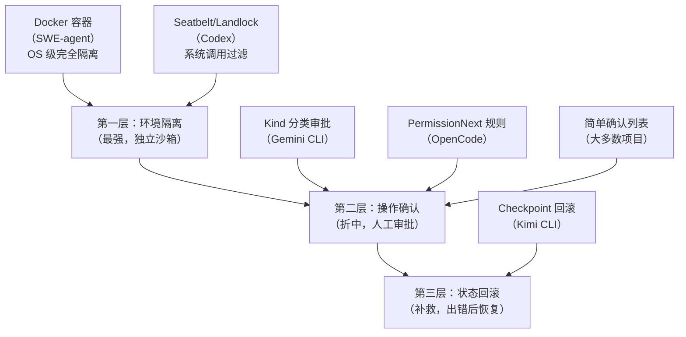
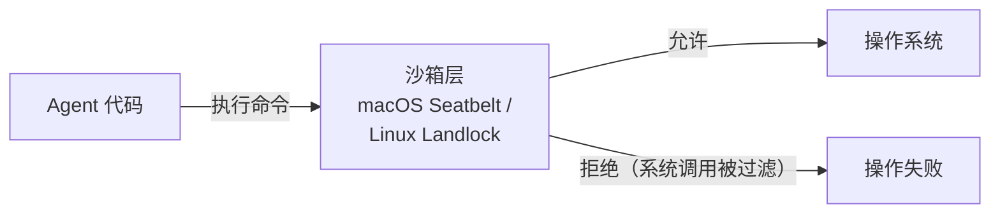
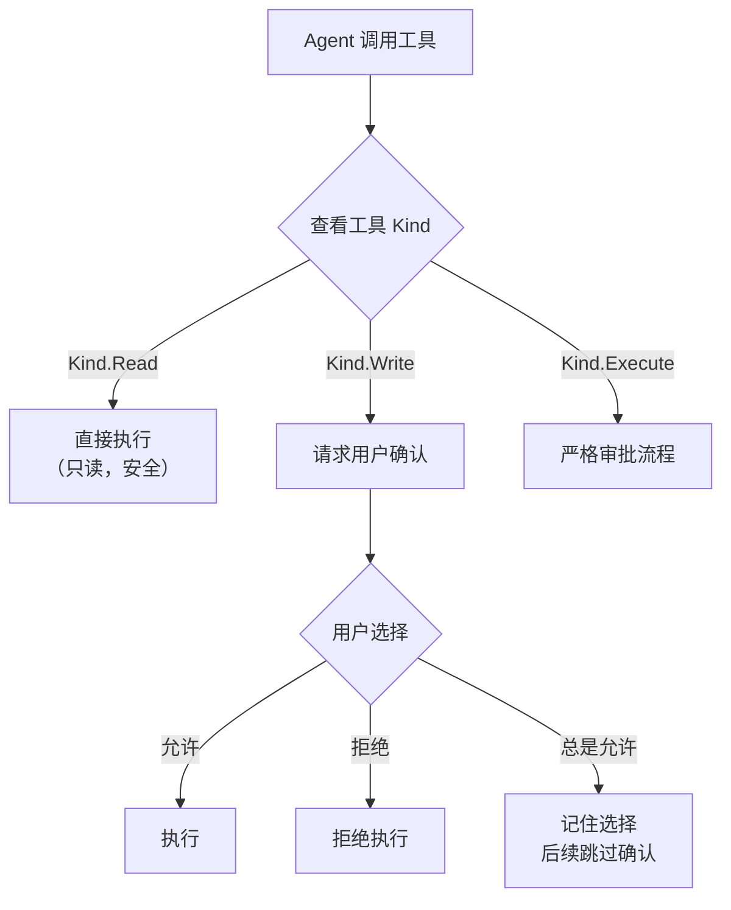

# 安全控制机制

## TL;DR

Code Agent 能执行 shell 命令、读写文件 —— 这意味着一行错误指令就可能删除重要数据或破坏系统。安全控制的核心是：**在 LLM 犯错之前拦截**。各项目选择了不同层次的防御策略，从"隔离执行环境"到"事前用户确认"再到"事后回滚"。

---

## 1. 威胁模型：Agent 的危险操作有哪些？



**核心矛盾：** Agent 需要足够多的权限才能完成任务（读写代码、运行测试），但权限太大会有风险。安全设计本质是在**能力**和**安全**之间找平衡点。

---

## 2. 三层防御体系

所有项目的安全控制都可以归纳为三层（层次越低，保护越彻底，但成本越高）：



---

## 3. 各项目的安全机制

### Codex：OS 级沙箱（最底层，最强）

Codex 是唯一实现了操作系统级沙箱的项目，**在 agent 运行之前就限制了它能做什么**。



**macOS Seatbelt**（`codex-rs/core/src/seatbelt.rs:36`）：通过 `sandbox-exec` 工具和 `.sbpl` 策略文件限制进程：
- 只读路径：除工作目录外的大多数文件系统
- 网络隔离：三级策略 —— `full`（完全访问）/ `host-only`（仅本机）/ `none`（无网络）
- 进程限制：防止 fork bomb

**关键设计**（`codex-rs/core/src/sandboxing/mod.rs:11`）：
```rust
// SandboxPolicy 枚举
SandboxPolicy::DangerFullAccess  // 无限制（开发调试用）
SandboxPolicy::ExternalSandbox { network_access: NetworkAccess::Enabled, .. }
SandboxPolicy::ReadOnly  // 只读模式（最安全）
```

**工程取舍：** 最强的隔离，但 macOS 专用（Seatbelt）或 Linux 专用（Landlock），跨平台需要两套实现。沙箱配置错误可能导致合法操作也被拦截。

---

### SWE-agent：Docker 容器隔离（跨平台）

SWE-agent 在 Docker 容器中运行所有工具。容器是完全独立的环境：

```
宿主机
├── SWE-agent 进程（控制）
└── Docker 容器（执行）
    ├── 独立文件系统（挂载的项目目录）
    ├── 独立网络（可配置）
    └── 独立进程空间
```

即使 Agent 执行了破坏性命令（如 `rm -rf /`），也只影响容器内部，宿主机安全。

**工程取舍：** 跨平台（Linux/macOS/Windows 都能用 Docker），隔离彻底；但容器启动慢（通常需要 5-30 秒），不适合轻量交互场景。

---

### Gemini CLI：Kind 分类 + 策略审批

Gemini CLI 没有环境隔离，但通过工具的 `Kind` 分类实现细粒度权限控制。



**工程取舍：** 实现简单，不需要额外依赖；但保护依赖"工具的 Kind 设置是否正确"，分错 Kind 会影响安全策略。用户确认有"确认疲劳"问题（频繁确认会让用户倾向于无脑点"允许"）。

---

### OpenCode：规则引擎 + 模式匹配

OpenCode 提供了最灵活的权限系统（`opencode/packages/opencode/src/permission/next.ts:14`）：

```typescript
// 三种操作
Action = "allow" | "deny" | "ask"

// 规则示例
permissions = {
    "bash": {              // 工具类型
        "rm -rf *": "deny", // 精确匹配 → 总是拒绝
        "npm install": "ask", // 精确匹配 → 每次询问
        "*": "allow"        // 通配符 → 默认允许
    }
}
```

**规则评估顺序**（`permission/next.ts:236`）：精确匹配 > 模式匹配 > 通配符默认值。

`ctx.ask()` 是在工具执行时动态触发的（`tool/tool.ts:22`），工具开发者决定何时请求权限，而不是统一由框架控制。

**工程取舍：** 最灵活，可以配置任意规则；但规则复杂度高，用户需要理解配置语法。

---

### Kimi CLI：D-Mail 回滚作为补充

Kimi CLI 的 D-Mail 机制（`src/kimi_cli/soul/denwarenji.py`）是独特的**事后补救**机制：

- 执行之前打 Checkpoint
- 执行有问题时，LLM 可以调用 `SendDMail` 工具回滚到之前的 Checkpoint
- **注意：** 只回滚 LLM 看到的历史，**不回滚文件系统**

这不是传统意义的安全隔离，而是给 LLM 一个"反悔"的能力 —— 当探索方向错误时，可以抛弃无效路径。

---

## 4. 核心工程取舍对比

| 方案 | 隔离强度 | 性能影响 | 跨平台 | 实现复杂度 | 用户干预 |
|------|----------|----------|--------|------------|----------|
| Docker（SWE-agent）| 最强（OS 级） | 高（容器启动慢） | ✅ | 中 | 无 |
| Seatbelt/Landlock（Codex）| 强（syscall 过滤）| 低 | ❌ 平台限定 | 高 | 无 |
| Kind 审批（Gemini CLI）| 弱（仅事前询问）| 无 | ✅ | 低 | 高 |
| 规则引擎（OpenCode）| 可配置 | 无 | ✅ | 中 | 可配置 |
| 回滚（Kimi CLI）| 无（事后补救）| 无 | ✅ | 低 | 低 |

**选择策略：**
- 在陌生代码库上执行任意命令 → 优先 Docker 或 Seatbelt
- 日常开发辅助、只读操作为主 → Kind 分类审批足够
- 需要精细控制特定命令 → OpenCode 规则引擎
- 探索性长任务，不怕文件改动但想控制上下文 → Kimi CLI D-Mail

---

## 5. 关键代码索引

| 项目 | 文件 | 行号 | 说明 |
|------|------|------|------|
| Codex | `codex-rs/core/src/seatbelt.rs` | 36 | `spawn_command_under_seatbelt()` |
| Codex | `codex-rs/core/src/seatbelt.rs` | 26 | 基础沙箱策略（`.sbpl` 文件引用） |
| Codex | `codex-rs/core/src/sandboxing/mod.rs` | 11 | `SandboxPolicy` 三种模式 |
| Gemini CLI | `packages/core/src/tools/tools.ts` | 312 | `kind` 字段 —— 工具分类 |
| OpenCode | `packages/opencode/src/permission/next.ts` | 14 | `PermissionNext` 命名空间 |
| OpenCode | `packages/opencode/src/permission/next.ts` | 25 | `Action` 枚举（allow/deny/ask）|
| OpenCode | `packages/opencode/src/permission/next.ts` | 236 | `evaluate()` —— 规则评估 |
| Kimi CLI | `src/kimi_cli/soul/denwarenji.py` | 8 | `DMail` —— 回滚触发器 |
| Kimi CLI | `src/kimi_cli/soul/context.py` | 80 | `revert_to()` —— 执行回滚 |
