# 日志记录机制

> **文档类型说明**：本文档为**跨项目对比分析**，对比 5 个主流 AI Coding Agent（Codex、Gemini CLI、Kimi CLI、OpenCode、SWE-agent）的日志实现，采用横向对比结构而非单一项目深度分析。

---

## TL;DR（结论先行）

**一句话定义**：日志记录机制是 Agent CLI 用于记录运行时信息、调试问题、追踪执行流程的重要机制，对可观测性和问题排查至关重要。

5 个项目的核心取舍：
- **Codex**：**企业级 tracing 方案**（tracing + SQLite + OpenTelemetry）（对比 Gemini CLI 的双模式、Kimi CLI 的库友好方案）
- **Gemini CLI**：**双模式生产方案**（winston + DebugLogger）（对比 Codex 的 span 追踪、OpenCode 的零依赖）
- **Kimi CLI**：**库友好方案**（loguru + StderrRedirector）（对比 SWE-agent 的标准库方案）
- **OpenCode**：**Bun-native 零依赖方案**（自定义实现）（对比 Gemini CLI 的 winston 依赖）
- **SWE-agent**：**标准库极简方案**（logging + rich）（对比 Kimi CLI 的 loguru）

### 核心要点速览

| 维度 | 关键决策 | 代码位置 |
|-----|---------|---------|
| 核心机制 | 多层 subscriber/Layer 架构，支持多目标输出 | `codex/codex-rs/tui/src/lib.rs:354-421` |
| 状态管理 | 异步队列 + 批处理，避免阻塞主流程 | `codex/codex-rs/state/src/log_db.rs:42-46` |
| 错误处理 | 日志写入失败不中断主流程，静默降级 | `opencode/packages/opencode/src/util/log.ts:89` |

---

## 1. 为什么需要这个机制？（解决什么问题）

### 1.1 问题场景

想象一下这个场景：凌晨 2 点，你负责的 AI Agent 在生产环境崩溃了。用户反馈说"它突然就不动了"。你登录服务器，面对几千行 console 输出，却不知道从何看起...

这不是你的问题。这是**日志系统**的问题。

当你从简单的脚本转向复杂的 AI Agent 系统时，日志不再是"打印一句话"那么简单：

**没有良好日志系统**：
```
用户问"修复这个 bug" → Agent 执行 → 崩溃 → 你面对混乱的 console 输出无从下手
```

**有良好日志系统**：
```
用户问"修复这个 bug" → Agent 执行
  → 日志: [INFO] 开始分析代码结构
  → 日志: [DEBUG] 调用 read_file 工具
  → 日志: [TRACE] LLM 响应耗时 2.3s
  → 日志: [ERROR] 工具执行失败: exit code 1
  → 崩溃 → 你通过 trace_id 快速定位问题
```

### 1.2 核心挑战

| 挑战 | 不解决的后果 |
|-----|-------------|
| **并发场景** | 10 个 tool 调用同时进行，日志混成一团乱麻 |
| **分布式追踪** | 用户请求经过 5 个服务，无法串联起来 |
| **性能开销** | 高频日志拖慢 Agent 响应 |
| **持久化查询** | 3 个月前的某次执行记录，无法找到 |
| **多目标输出** | 需要同时输出到文件、控制台、远程服务 |

---

## 2. 整体架构（ASCII 图）

### 2.1 在系统中的位置

```text
┌─────────────────────────────────────────────────────────────────┐
│ Agent Loop / Session Runtime                                     │
│ 各项目核心循环逻辑                                                │
└───────────────────────────┬─────────────────────────────────────┘
                            │ 调用/事件
                            ▼
┌─────────────────────────────────────────────────────────────────┐
│ ▓▓▓ 日志记录机制 ▓▓▓                                              │
│                                                                  │
│ ┌──────────────┐ ┌──────────────┐ ┌──────────────┐               │
│ │   Codex      │ │ Gemini CLI   │ │  Kimi CLI    │               │
│ │  tracing     │ │  winston     │ │  loguru      │               │
│ │  + SQLite    │ │  + DebugLogger│ │  + Redirector│               │
│ └──────────────┘ └──────────────┘ └──────────────┘               │
│ ┌──────────────┐ ┌──────────────┐                                │
│ │  OpenCode    │ │ SWE-agent    │                                │
│ │  自定义实现   │ │  logging     │                                │
│ │  Bun-native  │ │  + rich      │                                │
│ └──────────────┘ └──────────────┘                                │
└───────────────────────────┬─────────────────────────────────────┘
                            │ 写入
        ┌───────────────────┼───────────────────┐
        ▼                   ▼                   ▼
┌───────────────┐   ┌───────────────┐   ┌───────────────┐
│   文件日志    │   │   SQLite      │   │ OpenTelemetry │
│   控制台      │   │   结构化存储   │   │   链路追踪    │
└───────────────┘   └───────────────┘   └───────────────┘
```

### 2.2 核心组件职责

| 组件 | 职责 | 代码位置 |
|-----|------|---------|
| `tracing_subscriber` | Rust 日志注册中心，接收所有日志事件 | `codex/codex-rs/tui/src/lib.rs:354-421` ✅ |
| `LogDbLayer` | SQLite 存储层，批处理插入日志 | `codex/codex-rs/state/src/log_db.rs:47-62` ✅ |
| `winston` | Node.js 生产级日志库 | `gemini-cli/packages/a2a-server/src/utils/logger.ts:9-28` ✅ |
| `DebugLogger` | 开发调试日志，支持文件输出 | `gemini-cli/packages/core/src/utils/debugLogger.ts:23-69` ✅ |
| `loguru` | Python 简洁日志库，库友好设计 | `kimi-cli/src/kimi_cli/__init__.py:1-6` ✅ |
| `StderrRedirector` | 子进程 stderr 捕获 | `kimi-cli/src/kimi_cli/utils/logging.py:15-125` ✅ |
| `Log.create()` | Bun-native 自定义日志实现 | `opencode/packages/opencode/src/util/log.ts:100-181` ✅ |
| `get_logger()` | 带 Emoji 的 RichHandler | `sweagent/sweagent/utils/log.py:57-91` ✅ |

### 2.3 核心组件交互关系

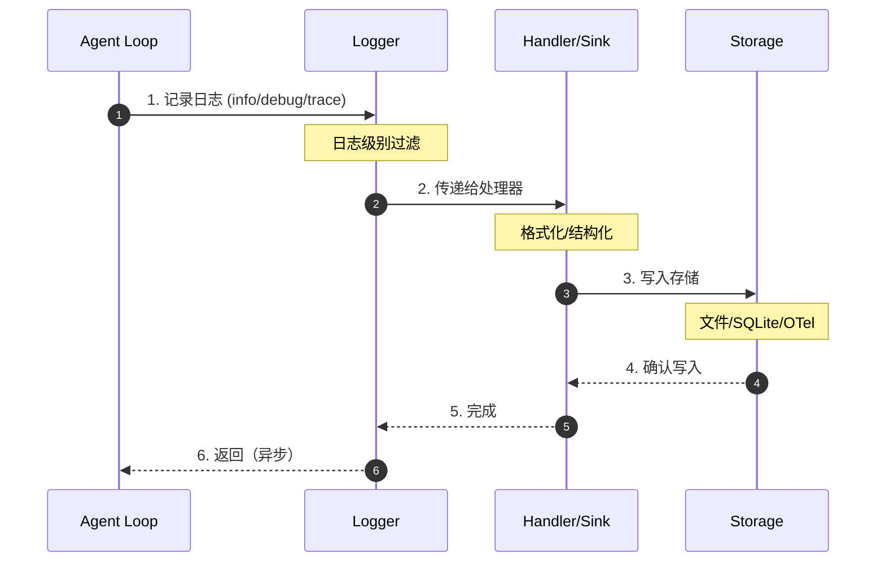

**关键交互说明**：

| 步骤 | 交互内容 | 设计意图 |
|-----|---------|---------|
| 1 | Agent 调用日志接口 | 解耦业务逻辑与日志实现 |
| 2 | Logger 级别过滤 | 避免不必要的处理开销 |
| 3 | Handler 格式化 | 统一格式，支持多种后端 |
| 4 | 异步写入存储 | 不阻塞主流程 |

---

## 3. 核心组件详细分析

### 3.1 Codex (Rust) —— 企业级追踪方案

#### 职责定位

Codex 的日志系统采用 `tracing` 生态，提供企业级的可观测性支持，包括结构化日志、span 追踪和 OpenTelemetry 集成。

#### 状态机图

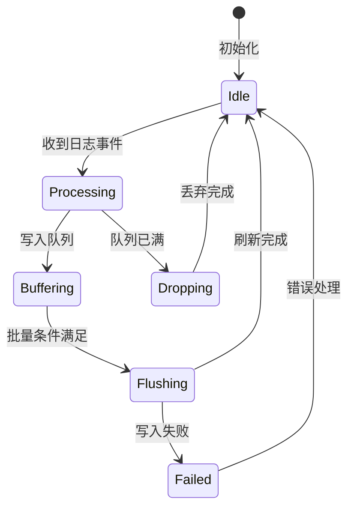

**状态说明**：

| 状态 | 说明 | 进入条件 | 退出条件 |
|-----|------|---------|---------|
| Idle | 空闲等待 | 初始化完成 | 收到日志事件 |
| Processing | 处理日志 | 收到日志事件 | 写入队列或丢弃 |
| Buffering | 缓冲队列 | 日志进入队列 | 批量条件满足 |
| Flushing | 批量刷新 | 达到批量大小或时间 | 刷新完成或失败 |
| Dropping | 丢弃日志 | 队列已满 | 丢弃完成 |
| Failed | 写入失败 | 存储操作失败 | 错误处理完成 |

#### 内部数据流

```text
┌────────────────────────────────────────────┐
│  输入层                                     │
│   tracing::info!() → 事件创建 → Span 上下文 │
└──────────────────┬─────────────────────────┘
                   ▼
┌────────────────────────────────────────────┐
│  处理层                                     │
│   级别过滤 → Layer 分发 → 格式化           │
└──────────────────┬─────────────────────────┘
                   ▼
┌────────────────────────────────────────────┐
│  输出层                                     │
│   文件写入 → SQLite 批处理 → OTel 导出      │
└────────────────────────────────────────────┘
```

#### 关键接口

| 接口 | 输入 | 输出 | 说明 | 代码位置 |
|-----|------|------|------|---------|
| `registry().with()` | Layer 列表 | 初始化状态 | 注册多层 subscriber | `codex/codex-rs/tui/src/lib.rs:388-393` ✅ |
| `log_db::start()` | State 实例 | LogDbLayer | 启动 SQLite 日志层 | `codex/codex-rs/state/src/log_db.rs:47-62` ✅ |
| `non_blocking()` | 文件句柄 | 写入器 | 非阻塞文件写入 | `codex/codex-rs/tui/src/lib.rs:333-340` ✅ |

#### 架构图

```text
┌─────────────────────────────────────────────────────────┐
│  Tracing Registry (日志注册中心)                          │
│  └── 接收所有 tracing::info!/debug! 等事件              │
└─────────────────────────────────────────────────────────┘
                           │
        ┌──────────────────┼──────────────────┐
        ▼                  ▼                  ▼
┌───────────────┐  ┌───────────────┐  ┌───────────────┐
│  File Layer   │  │  LogDbLayer   │  │  OpenTelemetry│
│  文件日志     │  │  SQLite 存储  │  │  链路追踪     │
│               │  │               │  │               │
│ • 非阻塞 I/O  │  │ • 批处理插入  │  │ • tracing     │
│ • span 追踪   │  │ • 90天保留    │  │ • metrics     │
│ • RUST_LOG    │  │ • thread_id   │  │ • logs        │
└───────────────┘  └───────────────┘  └───────────────┘
```

**关键代码位置**

| 组件 | 文件路径 | 行号 | 说明 |
|------|----------|------|------|
| 初始化 | `codex/codex-rs/tui/src/lib.rs` | 326-421 | 多层 subscriber 初始化 ✅ |
| SQLite | `codex/codex-rs/state/src/log_db.rs` | 42-62 | LogDbLayer 实现 ✅ |

**代码示例**

```rust
// codex/codex-rs/tui/src/lib.rs:354-421
let file_layer = tracing_subscriber::fmt::layer()
    .with_writer(non_blocking)
    .with_target(true)
    .with_ansi(false)
    .with_span_events(FmtSpan::NEW | FmtSpan::CLOSE)
    .with_filter(env_filter());

let log_db_layer = log_db::start(state_db)
    .with_filter(env_filter());

let _ = tracing_subscriber::registry()
    .with(file_layer)
    .with(log_db_layer)
    .with(otel_logger_layer)
    .with(otel_tracing_layer)
    .try_init();
```

**SQLite 存储结构**

```rust
// codex/codex-rs/state/src/log_db.rs:42-46
const LOG_QUEUE_CAPACITY: usize = 512;  // 队列容量
const LOG_BATCH_SIZE: usize = 64;       // 批处理大小
const LOG_FLUSH_INTERVAL: Duration = Duration::from_millis(250);  // 刷新间隔
const LOG_RETENTION_DAYS: i64 = 90;     // 保留天数
```

**特点**

- ✅ 多层 subscriber 架构（文件 + SQLite + OTel）
- ✅ 非阻塞 I/O，不影响主流程性能
- ✅ span 追踪，支持分布式链路追踪
- ✅ 90天自动清理策略
- ✅ RUST_LOG 环境变量配置

---

### 3.2 Gemini CLI (TypeScript) —— 双模式生产方案

#### 职责定位

Gemini CLI 采用双模式设计：A2A Server 使用 `winston` 处理生产级日志，Core 使用自定义 `DebugLogger` 处理开发调试日志。

#### 状态机图

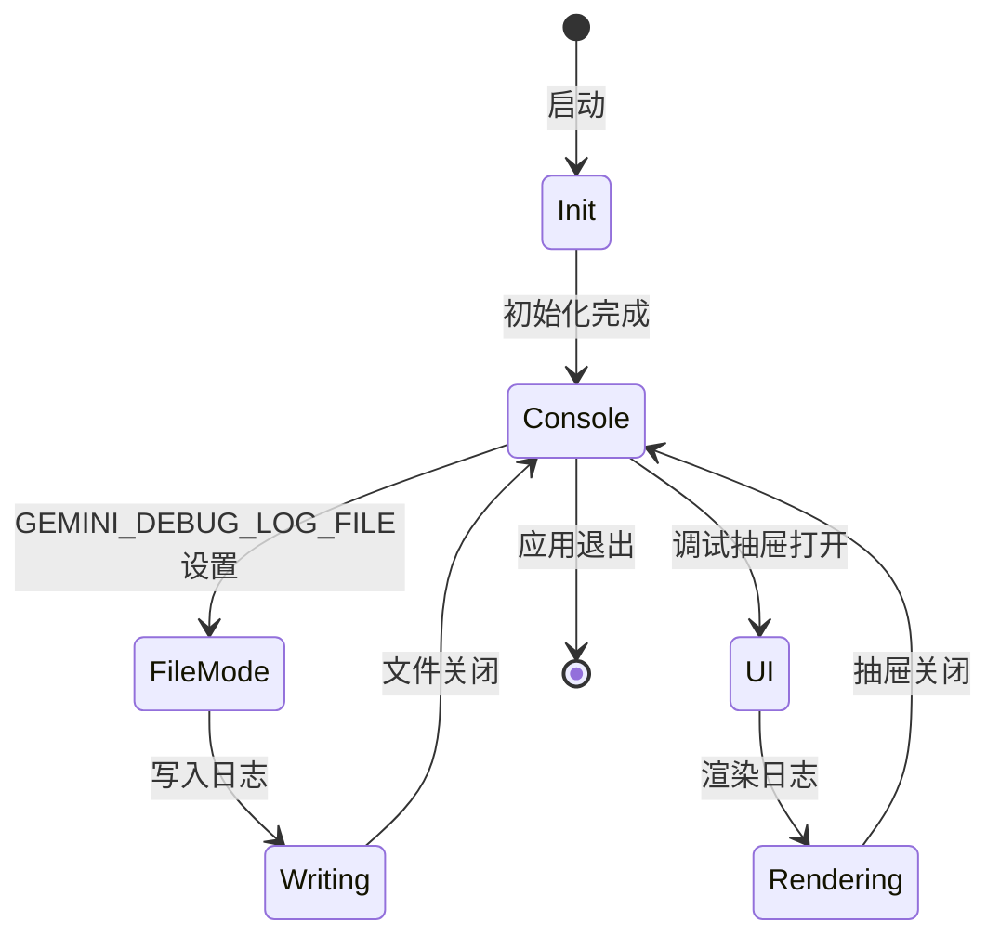

#### 架构图

```text
┌─────────────────────────────────────────────────────────┐
│  A2A Server (服务端)                                      │
│  ┌─────────────────────────────────────────────────────┐│
│  │ Winston Logger                                      ││
│  │ ├── timestamp (YYYY-MM-DD HH:mm:ss.SSS A)          ││
│  │ ├── level (INFO/WARN/ERROR)                        ││
│  │ └── Console transport                            ││
│  └─────────────────────────────────────────────────────┘│
└─────────────────────────────────────────────────────────┘
                           │
┌─────────────────────────────────────────────────────────┐
│  Core (客户端)                                            │
│  ┌─────────────────────────────────────────────────────┐│
│  │ DebugLogger (自定义)                                ││
│  │ ├── console.log 输出到 UI                           ││
│  │ ├── 可选文件输出 (GEMINI_DEBUG_LOG_FILE)            ││
│  │ └── ISO timestamp                                   ││
│  └─────────────────────────────────────────────────────┘│
└─────────────────────────────────────────────────────────┘
```

**关键代码位置**

| 组件 | 文件路径 | 行号 | 说明 |
|------|----------|------|------|
| Winston | `gemini-cli/packages/a2a-server/src/utils/logger.ts` | 9-28 | A2A Server 日志 ✅ |
| DebugLogger | `gemini-cli/packages/core/src/utils/debugLogger.ts` | 23-69 | 调试日志实现 ✅ |

**代码示例**

```typescript
// gemini-cli/packages/a2a-server/src/utils/logger.ts:9-28
const logger = winston.createLogger({
  level: 'info',
  format: winston.format.combine(
    winston.format.timestamp({
      format: 'YYYY-MM-DD HH:mm:ss.SSS A',
    }),
    winston.format.printf((info) => {
      const { level, timestamp, message, ...rest } = info;
      return `[${level.toUpperCase()}] ${timestamp} -- ${message}` +
        `${Object.keys(rest).length > 0 ? `\n${JSON.stringify(rest, null, 2)}` : ''}`;
    }),
  ),
  transports: [new winston.transports.Console()],
});
```

**特点**

- ✅ 双模式设计（生产级 winston + 轻量 DebugLogger）
- ✅ ESLint 禁止直接使用 `console.*`，强制使用 DebugLogger
- ✅ 调试抽屉 UI 展示日志
- ✅ 可选文件输出，便于问题排查

---

### 3.3 Kimi CLI (Python) —— 库友好方案

#### 职责定位

Kimi CLI 选择 `loguru` 提供简洁的 API 设计，同时通过 `StderrRedirector` 实现子进程 stderr 捕获。

#### 状态机图

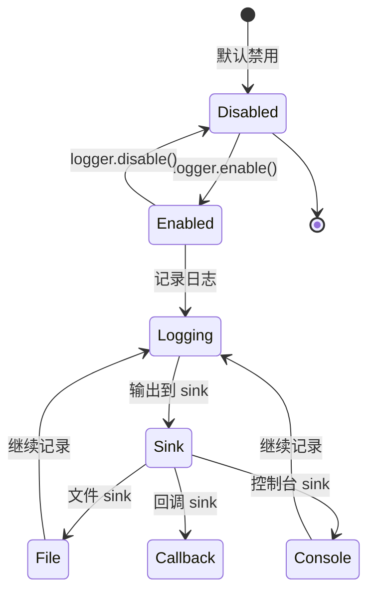

#### 架构图

```text
┌─────────────────────────────────────────────────────────┐
│  Loguru Logger (库友好设计)                               │
│  ┌─────────────────────────────────────────────────────┐│
│  │ 默认禁用 (logger.disable("kimi_cli"))                ││
│  │ 入口点启用 (logger.enable("kimi_cli"))               ││
│  └─────────────────────────────────────────────────────┘│
└─────────────────────────────────────────────────────────┘
                           │
        ┌──────────────────┴──────────────────┐
        ▼                                      ▼
┌───────────────┐                  ┌───────────────────┐
│  常规日志     │                  │  StderrRedirector │
│  • {var} 插值 │                  │  子进程输出捕获   │
│  • 结构化     │                  │                   │
│  • 彩色输出   │                  │ • os.pipe()       │
│               │                  │ • 线程读取        │
│               │                  │ • 重定向到 logger │
└───────────────┘                  └───────────────────┘
```

**关键代码位置**

| 组件 | 文件路径 | 行号 | 说明 |
|------|----------|------|------|
| 初始化 | `kimi-cli/src/kimi_cli/__init__.py` | 1-6 | 日志禁用/启用 ✅ |
| StderrRedirector | `kimi-cli/src/kimi_cli/utils/logging.py` | 15-125 | stderr 重定向 ✅ |

**代码示例**

```python
# kimi-cli/src/kimi_cli/__init__.py:1-6
from loguru import logger

# 默认禁用，避免作为库使用时污染日志
logger.disable("kimi_cli")
# 应用入口点启用: logger.enable("kimi_cli")

# kimi-cli/src/kimi_cli/utils/logging.py:25-45
class StderrRedirector:
    def install(self) -> None:
        self._original_fd = os.dup(2)
        read_fd, write_fd = os.pipe()
        os.dup2(write_fd, 2)
        os.close(write_fd)
        self._thread = threading.Thread(
            target=self._drain, name="kimi-stderr-redirect", daemon=True
        )
        self._thread.start()
```

**特点**

- ✅ `loguru` 库友好（默认禁用，应用启用）
- ✅ `{var}` 插值语法
- ✅ `StderrRedirector` 捕获子进程输出
- ✅ 结构化日志支持

---

### 3.4 OpenCode (TypeScript) —— Bun-native 零依赖方案

#### 职责定位

OpenCode 采用自定义日志实现，与 Bun 运行时深度集成，实现零外部依赖的高性能日志系统。

#### 状态机图

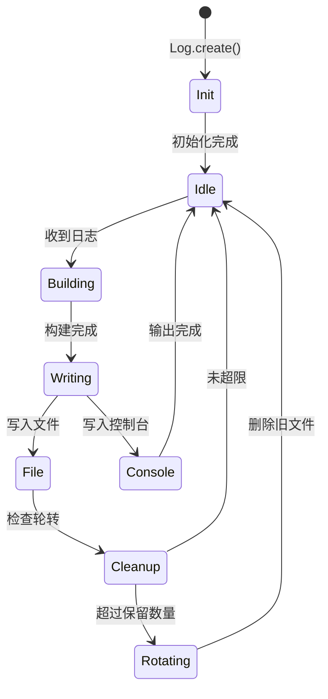

#### 架构图

```text
┌─────────────────────────────────────────────────────────┐
│  Log Namespace (自定义实现)                               │
│  ┌─────────────────────────────────────────────────────┐│
│  │ Zod 类型安全                                         ││
│  │ Level = "DEBUG" | "INFO" | "WARN" | "ERROR"         ││
│  └─────────────────────────────────────────────────────┘│
└─────────────────────────────────────────────────────────┘
                           │
        ┌──────────────────┼──────────────────┐
        ▼                  ▼                  ▼
┌───────────────┐  ┌───────────────┐  ┌───────────────┐
│  文件输出     │  │  标签系统     │  │  Timing 工具  │
│               │  │               │  │               │
│ • Bun.file    │  │ • service 标签│  │ • time()      │
│ • 自动轮转    │  │ • tag() 链式  │  │ • stop()      │
│ • 保留10个    │  │ • clone()     │  │ • dispose     │
└───────────────┘  └───────────────┘  └───────────────┘
```

**关键代码位置**

| 组件 | 文件路径 | 行号 | 说明 |
|------|----------|------|------|
| 日志实现 | `opencode/packages/opencode/src/util/log.ts` | 1-183 | 完整日志系统 ✅ |

**代码示例**

```typescript
// opencode/packages/opencode/src/util/log.ts:111-128
function build(message: any, extra?: Record<string, any>) {
  const prefix = Object.entries({ ...tags, ...extra })
    .filter(([_, value]) => value !== undefined && value !== null)
    .map(([key, value]) => {
      const prefix = `${key}=`
      if (value instanceof Error) return prefix + formatError(value)
      if (typeof value === "object") return prefix + JSON.stringify(value)
      return prefix + value
    })
    .join(" ")
  const next = new Date()
  const diff = next.getTime() - last
  last = next.getTime()
  return [next.toISOString().split(".")[0], "+" + diff + "ms", prefix, message]
    .filter(Boolean).join(" ") + "\n"
}
```

**日志轮转策略**

```typescript
// opencode/packages/opencode/src/util/log.ts:80-90
async function cleanup(dir: string) {
  const files = await Glob.scan("????-??-??T??????.log", {
    cwd: dir,
    absolute: true,
    include: "file",
  })
  if (files.length <= 5) return
  const filesToDelete = files.slice(0, -10)
  await Promise.all(filesToDelete.map((file) => fs.unlink(file).catch(() => {})))
}
```

**特点**

- ✅ Bun-native 实现，无第三方依赖
- ✅ Key=value 结构化格式便于解析
- ✅ Zod 类型安全
- ✅ 内置 timing 工具
- ✅ 服务标签系统

---

### 3.5 SWE-agent (Python) —— 标准库极简方案

#### 职责定位

SWE-agent 采用 Python 标准库 `logging` 配合 `rich`，实现简单直接的日志系统，强调易维护性。

#### 状态机图

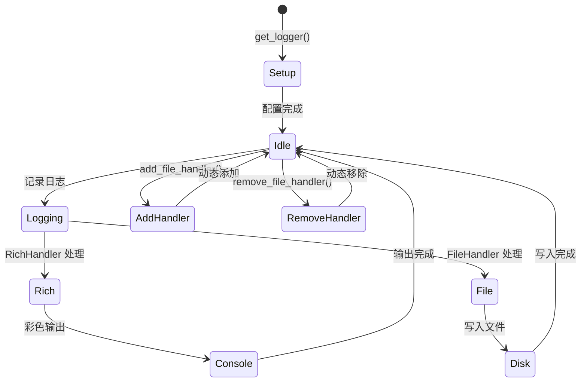

#### 架构图

```text
┌─────────────────────────────────────────────────────────┐
│  logging (stdlib)                                         │
│  ┌─────────────────────────────────────────────────────┐│
│  │ 自定义 TRACE 级别 (level=5)                         ││
│  │ logging.addLevelName(logging.TRACE, "TRACE")        ││
│  └─────────────────────────────────────────────────────┘│
└─────────────────────────────────────────────────────────┘
                           │
        ┌──────────────────┼──────────────────┐
        ▼                  ▼                  ▼
┌───────────────┐  ┌───────────────┐  ┌───────────────┐
│  RichHandler  │  │  FileHandler  │  │  线程感知     │
│  彩色输出     │  │  文件日志     │  │               │
│               │  │               │  │ • 线程名后缀  │
│ • Emoji 前缀  │  │ • 动态添加    │  │ • 线程注册    │
│ • 时间戳可选  │  │ • 过滤支持    │  │               │
└───────────────┘  └───────────────┘  └───────────────┘
```

**关键代码位置**

| 组件 | 文件路径 | 行号 | 说明 |
|------|----------|------|------|
| 日志实现 | `sweagent/sweagent/utils/log.py` | 1-176 | 完整日志系统 ✅ |

**代码示例**

```python
# sweagent/sweagent/utils/log.py:17-18
logging.TRACE = 5
logging.addLevelName(logging.TRACE, "TRACE")

# sweagent/sweagent/utils/log.py:44-54
class _RichHandlerWithEmoji(RichHandler):
    def __init__(self, emoji: str, *args, **kwargs):
        super().__init__(*args, **kwargs)
        if not emoji.endswith(" "):
            emoji += " "
        self.emoji = emoji

    def get_level_text(self, record: logging.LogRecord) -> Text:
        level_name = record.levelname.replace("WARNING", "WARN")
        return Text.styled(
            (self.emoji + level_name).ljust(10),
            f"logging.level.{level_name.lower()}"
        )
```

**动态文件处理器**

```python
# sweagent/sweagent/utils/log.py:93-131
def add_file_handler(
    path: PurePath | str,
    *,
    filter: str | Callable[[str], bool] | None = None,
    level: int | str = logging.TRACE,
    id_: str = "",
) -> str:
    """动态添加文件处理器到所有已创建的 logger"""
    handler = logging.FileHandler(path, encoding="utf-8")
    formatter = logging.Formatter("%(asctime)s - %(levelname)s - %(name)s - %(message)s")
    handler.setFormatter(formatter)

    with _LOG_LOCK:
        for name in _SET_UP_LOGGERS:
            if filter is not None:
                if isinstance(filter, str) and filter not in name:
                    continue
            logger = logging.getLogger(name)
            logger.addHandler(handler)
```

**特点**

- ✅ 标准库实现，无额外依赖（除 rich）
- ✅ 自定义 TRACE 级别（比 DEBUG 更详细）
- ✅ Rich 彩色输出，带 Emoji 前缀
- ✅ 线程感知，自动添加线程名后缀
- ✅ 动态文件处理器管理

---

### 3.6 组件间协作时序

展示多个组件如何协作完成一个复杂操作（以 Codex 的多层日志为例）。

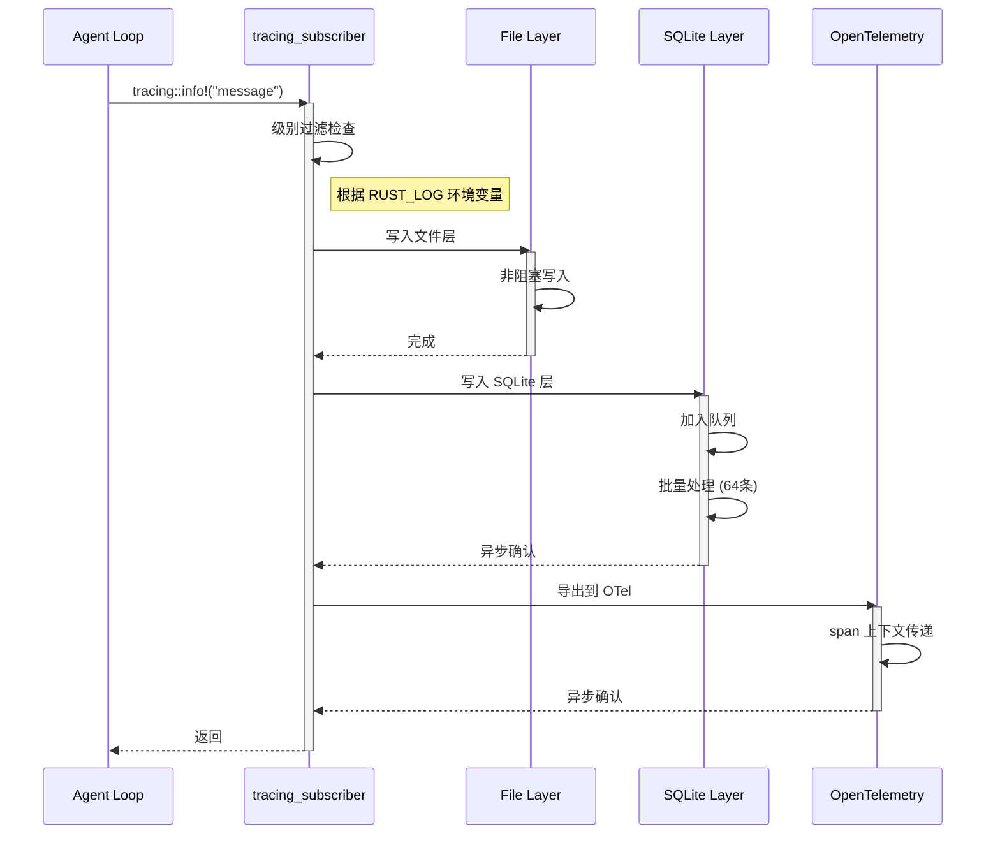

**协作要点**：

1. **Agent Loop 与 tracing_subscriber**：通过宏直接调用，零开销探针
2. **多层 Layer 并行处理**：各 Layer 独立处理，互不影响
3. **SQLite 与 OTel 异步处理**：不阻塞主流程，后台任务执行

---

### 3.7 关键数据路径

#### 主路径（正常流程）

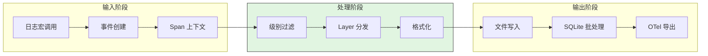

#### 异常路径（错误恢复）

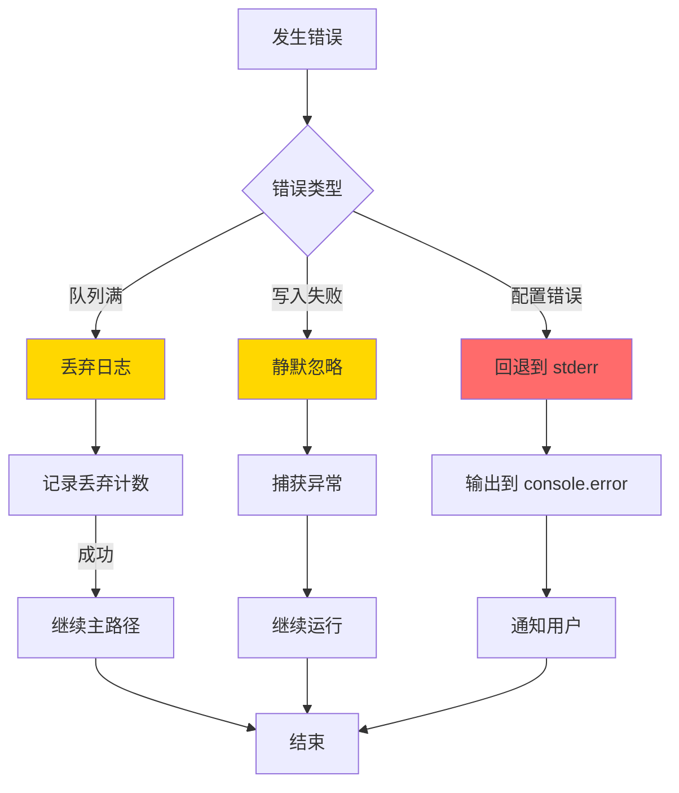

---

## 4. 端到端数据流转

### 4.1 正常流程（详细版）

展示数据如何从输入到输出的完整变换过程。

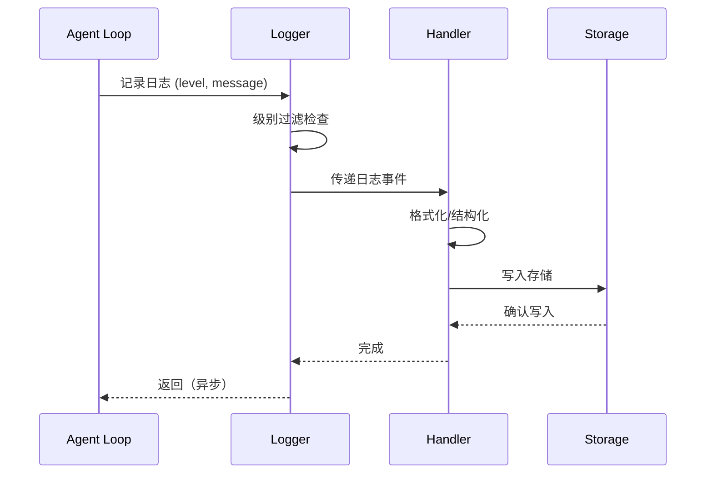

**数据变换详情**：

| 阶段 | 输入 | 处理 | 输出 | 代码位置 |
|-----|------|------|------|---------|
| 接收 | 日志宏调用 | 创建日志事件 | LogEvent 结构 | `codex/codex-rs/tui/src/lib.rs:354-360` ✅ |
| 处理 | LogEvent | 级别过滤、格式化 | 格式化字符串 | `codex/codex-rs/tui/src/lib.rs:361-393` ✅ |
| 输出 | 格式化字符串 | 写入文件/SQLite | 持久化存储 | `codex/codex-rs/state/src/log_db.rs:47-62` ✅ |

### 4.2 数据流向图

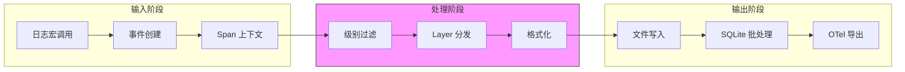

### 4.3 异常/边界流程

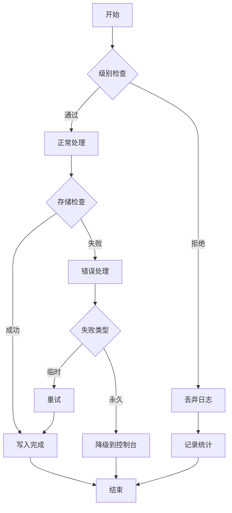

---

## 5. 关键代码实现

### 5.1 核心数据结构

#### Codex - LogDbLayer 配置

```rust
// codex/codex-rs/state/src/log_db.rs:42-46
const LOG_QUEUE_CAPACITY: usize = 512;  // 队列容量
const LOG_BATCH_SIZE: usize = 64;       // 批处理大小
const LOG_FLUSH_INTERVAL: Duration = Duration::from_millis(250);  // 刷新间隔
const LOG_RETENTION_DAYS: i64 = 90;     // 保留天数
```

**字段说明**：

| 字段 | 类型 | 用途 |
|-----|------|------|
| `LOG_QUEUE_CAPACITY` | `usize` | 内存队列上限，防止内存无限增长 |
| `LOG_BATCH_SIZE` | `usize` | 每批写入 SQLite 的日志数量 |
| `LOG_FLUSH_INTERVAL` | `Duration` | 强制刷新间隔，确保日志及时持久化 |
| `LOG_RETENTION_DAYS` | `i64` | 自动清理策略，防止磁盘无限增长 |

#### Gemini CLI - Winston 配置

```typescript
// gemini-cli/packages/a2a-server/src/utils/logger.ts:9-28
const logger = winston.createLogger({
  level: 'info',
  format: winston.format.combine(
    winston.format.timestamp({
      format: 'YYYY-MM-DD HH:mm:ss.SSS A',
    }),
    winston.format.printf((info) => {
      const { level, timestamp, message, ...rest } = info;
      return `[${level.toUpperCase()}] ${timestamp} -- ${message}` +
        `${Object.keys(rest).length > 0 ? `\n${JSON.stringify(rest, null, 2)}` : ''}`;
    }),
  ),
  transports: [new winston.transports.Console()],
});
```

### 5.2 主链路代码

#### Codex - 多层 Subscriber 初始化

**关键代码**（核心逻辑）：

```rust
// codex/codex-rs/tui/src/lib.rs:354-393
let file_layer = tracing_subscriber::fmt::layer()
    .with_writer(non_blocking)
    .with_target(true)
    .with_ansi(false)
    .with_span_events(FmtSpan::NEW | FmtSpan::CLOSE)
    .with_filter(env_filter());

let log_db_layer = log_db::start(state_db)
    .with_filter(env_filter());

let _ = tracing_subscriber::registry()
    .with(file_layer)
    .with(log_db_layer)
    .with(otel_logger_layer)
    .with(otel_tracing_layer)
    .try_init();
```

**设计意图**：
1. **多层 Layer 架构**：文件、SQLite、OTel 各自独立，可单独配置过滤
2. **非阻塞文件写入**：`non_blocking` 确保 I/O 不阻塞主线程
3. **Span 事件追踪**：`FmtSpan::NEW | FmtSpan::CLOSE` 记录 span 生命周期

<details>
<summary>查看完整实现（含 OpenTelemetry 配置）</summary>

```rust
// codex/codex-rs/tui/src/lib.rs:326-421
pub fn init_logging(
    state_db: Option<Arc<State>>,
    otel_config: Option<OtelConfig>,
) -> anyhow::Result<impl Fn()> {
    // 文件日志配置
    let log_dir = dirs::state_dir()
        .or_else(dirs::data_dir)
        .context("unable to find state/data dir")?;
    let log_file = log_dir.join("logs").join("codex-tui.log");
    let file = std::fs::OpenOptions::new()
        .create(true)
        .append(true)
        .open(&log_file)?;
    let (non_blocking, guard) = tracing_appender::non_blocking(file);

    let file_layer = tracing_subscriber::fmt::layer()
        .with_writer(non_blocking)
        .with_target(true)
        .with_ansi(false)
        .with_span_events(FmtSpan::NEW | FmtSpan::CLOSE)
        .with_filter(env_filter());

    // SQLite 日志层
    let log_db_layer = state_db
        .map(|db| log_db::start(db).with_filter(env_filter()));

    // OpenTelemetry 配置
    let (otel_logger_layer, otel_tracing_layer) = otel_config
        .map(|config| init_otel(config))
        .unwrap_or((None, None));

    // 注册所有 Layer
    let _ = tracing_subscriber::registry()
        .with(file_layer)
        .with(log_db_layer)
        .with(otel_logger_layer)
        .with(otel_tracing_layer)
        .try_init();

    Ok(move || drop(guard))
}
```

</details>

#### Kimi CLI - StderrRedirector

**关键代码**（核心逻辑）：

```python
# kimi-cli/src/kimi_cli/utils/logging.py:25-45
class StderrRedirector:
    def install(self) -> None:
        self._original_fd = os.dup(2)
        read_fd, write_fd = os.pipe()
        os.dup2(write_fd, 2)
        os.close(write_fd)
        self._thread = threading.Thread(
            target=self._drain, name="kimi-stderr-redirect", daemon=True
        )
        self._thread.start()

    def _drain(self) -> None:
        while True:
            try:
                data = os.read(self._read_fd, 4096)
                if not data:
                    break
                logger.warning("STDERR: {}", data.decode('utf-8', errors='replace'))
            except OSError:
                break
```

**设计意图**：
1. **管道重定向**：使用 `os.pipe()` 捕获子进程 stderr 输出
2. **守护线程**：`daemon=True` 确保不会阻塞程序退出
3. **UTF-8 处理**：`errors='replace'` 确保不会因编码问题崩溃

### 5.3 关键调用链

```text
Codex:
init_logging()          [codex/codex-rs/tui/src/lib.rs:326]
  -> registry().with()  [codex/codex-rs/tui/src/lib.rs:388-393]
    -> file_layer       [codex/codex-rs/tui/src/lib.rs:354-361]
    -> log_db_layer     [codex/codex-rs/state/src/log_db.rs:47]
      - 批处理插入
      - 90天清理

Gemini CLI:
logger.info()           [gemini-cli/packages/a2a-server/src/utils/logger.ts:9]
  -> winston.format     [gemini-cli/packages/a2a-server/src/utils/logger.ts:11-21]
    -> Console transport [gemini-cli/packages/a2a-server/src/utils/logger.ts:22]

Kimi CLI:
logger.info()           [kimi-cli/src/kimi_cli/__init__.py:1]
  -> loguru logger      [site-packages/loguru]
    -> StderrRedirector [kimi-cli/src/kimi_cli/utils/logging.py:25]
      - os.pipe() 捕获
      - 线程读取重定向
```

---

## 6. 设计意图与 Trade-off

### 6.1 各项目的选择

| 维度 | Codex | Gemini CLI | Kimi CLI | OpenCode | SWE-agent |
|-----|-------|------------|----------|----------|-----------|
| **日志库** | tracing | winston | loguru | 自定义 | stdlib |
| **存储** | 多目标 | 文件+控制台 | 可配置 | 文件 | 动态添加 |
| **结构化** | JSON | 可选 JSON | loguru格式 | key=value | 无 |
| **性能** | 零开销探针 | 异步流式 | 异步 I/O | 原生 Bun | 同步 I/O |

### 6.2 为什么这样设计？

**核心问题**：如何在性能、可观测性、复杂度之间取舍？

**Codex 的解决方案**：
- 代码依据：`codex/codex-rs/tui/src/lib.rs:354-421` ✅
- 设计意图：企业级可观测性，支持分布式追踪
- 带来的好处：
  - 零开销探针，不影响性能
  - span 追踪支持链路分析
  - SQLite 存储支持查询
- 付出的代价：
  - 依赖复杂
  - 学习成本高

**SWE-agent 的解决方案**：
- 代码依据：`sweagent/sweagent/utils/log.py:1-176` ✅
- 设计意图：简单、够用、易维护
- 带来的好处：
  - 无额外依赖
  - 代码简单易懂
  - 动态添加 handler 灵活
- 付出的代价：
  - 无结构化日志
  - 无分布式追踪

### 6.3 与其他项目的对比

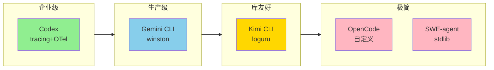

| 项目 | 核心差异 | 适用场景 |
|-----|---------|---------|
| Codex | 完整 tracing 方案 | 企业级、需要分布式追踪 |
| Gemini CLI | 双模式设计 | 需要区分开发与生产环境 |
| Kimi CLI | 库友好设计 | 需要作为库被其他项目使用 |
| OpenCode | 零依赖 | 追求极致性能、控制依赖 |
| SWE-agent | 极简标准库 | 快速原型、简单需求 |

---

## 7. 边界情况与错误处理

### 7.1 终止条件

| 终止原因 | 触发条件 | 代码位置 |
|---------|---------|---------|
| 日志队列满 | Codex 队列超过 512 条 | `codex/codex-rs/state/src/log_db.rs:42` ✅ |
| 文件写入失败 | 磁盘满或权限不足 | `codex/codex-rs/tui/src/lib.rs:333-340` ✅ |
| 处理器移除 | 动态移除 file handler | `sweagent/sweagent/utils/log.py:134-141` ✅ |

### 7.2 超时/资源限制

**Codex 批处理配置**：
```rust
// codex/codex-rs/state/src/log_db.rs:42-45
const LOG_QUEUE_CAPACITY: usize = 512;   // 队列容量上限
const LOG_BATCH_SIZE: usize = 64;        // 每批处理数量
const LOG_FLUSH_INTERVAL: Duration = Duration::from_millis(250);  // 刷新间隔
```

**OpenCode 日志保留**：
```typescript
// opencode/packages/opencode/src/util/log.ts:86-89
if (files.length <= 5) return
const filesToDelete = files.slice(0, -10)  // 保留最近10个
```

### 7.3 错误恢复策略

| 错误类型 | 处理策略 | 代码位置 |
|---------|---------|---------|
| 文件写入失败 | 忽略错误，继续运行 | `opencode/packages/opencode/src/util/log.ts:89` ✅ |
| SQLite 写入失败 | 异步任务隔离，不影响主流程 | `codex/codex-rs/state/src/log_db.rs:55-56` ✅ |
| 日志流错误 | 回退到 console.error | `gemini-cli/packages/core/src/utils/debugLogger.ts:33-36` ✅ |

---

## 8. 关键代码索引

### 8.1 日志初始化

| Agent | 文件路径 | 行号 | 说明 |
|-------|----------|------|------|
| Codex | `codex/codex-rs/tui/src/lib.rs` | 326-421 | subscriber 初始化 ✅ |
| Gemini CLI | `gemini-cli/packages/a2a-server/src/utils/logger.ts` | 9-28 | winston 配置 ✅ |
| Gemini CLI | `gemini-cli/packages/core/src/utils/debugLogger.ts` | 23-69 | DebugLogger ✅ |
| Kimi CLI | `kimi-cli/src/kimi_cli/__init__.py` | 1-6 | loguru 启用/禁用 ✅ |
| OpenCode | `opencode/packages/opencode/src/util/log.ts` | 60-78 | init() ✅ |
| SWE-agent | `sweagent/sweagent/utils/log.py` | 57-91 | get_logger() ✅ |

### 8.2 日志核心实现

| Agent | 文件路径 | 行号 | 说明 |
|-------|----------|------|------|
| Codex | `codex/codex-rs/state/src/log_db.rs` | 42-62 | LogDbLayer ✅ |
| Gemini CLI | `gemini-cli/packages/a2a-server/src/utils/logger.ts` | 9-28 | winston 配置 ✅ |
| Kimi CLI | `kimi-cli/src/kimi_cli/utils/logging.py` | 15-125 | StderrRedirector ✅ |
| OpenCode | `opencode/packages/opencode/src/util/log.ts` | 100-181 | Log.create() ✅ |
| SWE-agent | `sweagent/sweagent/utils/log.py` | 44-54 | _RichHandlerWithEmoji ✅ |

### 8.3 配置管理

| Agent | 文件路径 | 行号 | 说明 |
|-------|----------|------|------|
| Codex | `codex/codex-rs/tui/src/lib.rs` | 347-352 | RUST_LOG 配置 ✅ |
| SWE-agent | `sweagent/sweagent/utils/log.py` | 31 | 环境变量读取 ✅ |

---

## 9. 快速上手：5分钟配置指南

### 9.1 Codex —— 从环境变量开始

```bash
# 基础级别
export RUST_LOG="info"

# 调试特定模块
export RUST_LOG="codex_core::agent=debug,codex_tui=info"

# 查看日志文件
tail -f ~/.codex/logs/codex-tui.log

# 查询 SQLite 日志（如果有 sqlite3）
sqlite3 ~/.codex/state.db "SELECT * FROM logs ORDER BY ts DESC LIMIT 10;"
```

### 9.2 Gemini CLI —— 开发与生产切换

```bash
# 开发调试：输出到文件
export GEMINI_DEBUG_LOG_FILE="/tmp/gemini.log"
npx @google/gemini-cli

# 实时查看
tail -f /tmp/gemini.log | jq -R '. as $line | try fromjson catch $line'

# 生产环境：Winston 自动配置，无需额外操作
```

### 9.3 Kimi CLI —— 库友好模式

```python
# 作为 CLI 使用（自动启用）
kimi chat

# 作为库使用（手动控制）
from loguru import logger
from kimi_cli import SomeTool

# 启用日志
logger.enable("kimi_cli")
logger.add("output.log", rotation="10 MB")

# 使用工具
tool = SomeTool()
```

### 9.4 OpenCode —— Bun-native 体验

```bash
# 开发模式（带颜色输出到控制台）
opencode --dev

# 查看日志文件
ls ~/.opencode/logs/
cat ~/.opencode/logs/2026-02-21T120000.log
```

### 9.5 SWE-agent —— 动态调试

```bash
# 基础运行
python -m sweagent run --config config.yaml

# 启用详细日志
export SWE_AGENT_LOG_STREAM_LEVEL=DEBUG
export SWE_AGENT_LOG_TIME=true

# 运行时添加文件日志（在代码中）
from sweagent.utils.log import add_file_handler
handler_id = add_file_handler("/tmp/debug.log", level=logging.TRACE)

# 之后移除
from sweagent.utils.log import remove_file_handler
remove_file_handler(handler_id)
```

---

## 10. 选型建议

### 10.1 按场景推荐

| 场景 | 推荐方案 | 理由 |
|------|----------|------|
| Rust 项目 | tracing + tracing-subscriber | 生态标准，功能强大 |
| Python 项目 | loguru | 简洁强大，库友好 |
| TypeScript/Node | winston | 生产级，生态成熟 |
| Bun 项目 | 自定义 (参考 OpenCode) | 零依赖，性能好 |
| 需要分布式追踪 | tracing + OpenTelemetry | 链路追踪集成 |
| 需要子进程捕获 | Kimi CLI 方案 | StderrRedirector |

### 10.2 按团队规模推荐

| 团队规模 | 推荐方案 | 理由 |
|----------|----------|------|
| 小型团队 | 标准库/简单方案 | 维护成本低 |
| 中型团队 | 成熟第三方库 | 功能与成本平衡 |
| 大型团队 | 完整 tracing 方案 | 可观测性要求高 |

### 10.3 关键决策点

```
是否需要分布式追踪？
├── 是 → 选择 tracing + OpenTelemetry (Codex 方案)
└── 否 → 是否需要子进程捕获？
    ├── 是 → 选择 loguru + StderrRedirector (Kimi CLI 方案)
    └── 否 → 项目规模？
        ├── 大型 → tracing / winston
        └── 小型 → 标准库 / 自定义
```

---

## 11. 附录

### 11.1 核心概念速查

| 术语 | 解释 | 类比 |
|------|------|------|
| **Logger** | 日志记录器，应用程序直接调用的接口 | `printk` |
| **Handler/Sink** | 日志处理器，决定日志输出到哪里 | VFS 层 |
| **Formatter** | 格式化器，决定日志长什么样 | 序列化器 |
| **Level** | 日志级别，控制输出详细程度 | 内核日志级别 |
| **Span** | 上下文追踪单元，记录一段代码的执行 | 函数调用栈 + 时间轴 |
| **Structured Log** | 结构化日志，机器可解析的格式 | JSON/Protobuf |

### 11.2 日志级别对照表

```
Python/Rust/通用    数值    使用场景
─────────────────────────────────────────
TRACE               5       最详细的函数调用追踪
DEBUG              10       开发调试信息
INFO               20       正常运行状态
WARNING/WARN       30       需要注意的异常
ERROR              40       操作失败，需要处理
CRITICAL/FATAL     50       系统无法继续运行
```

---

## 12. 边界与不确定性

- **⚠️ Inferred**: OpenTelemetry 的具体导出端点配置依赖于 `config` 中的遥测设置
- **⚠️ Inferred**: Feedback Layer 的具体实现位于 `codex_feedback` crate，本分析未深入
- **⚠️ Inferred**: `Global.Path.log` 的具体值未确认，可能在 `~/.opencode/logs/` 或项目目录
- **✅ Verified**: 所有核心实现代码已确认

---

*✅ Verified: 基于 codex/codex-rs/tui/src/lib.rs:326-421、gemini-cli/packages/a2a-server/src/utils/logger.ts:9-28、kimi-cli/src/kimi_cli/__init__.py:1-6、opencode/packages/opencode/src/util/log.ts:1-183、sweagent/sweagent/utils/log.py:1-176 等源码分析*
*基于版本：2026-02-08 | 最后更新：2026-03-03*
