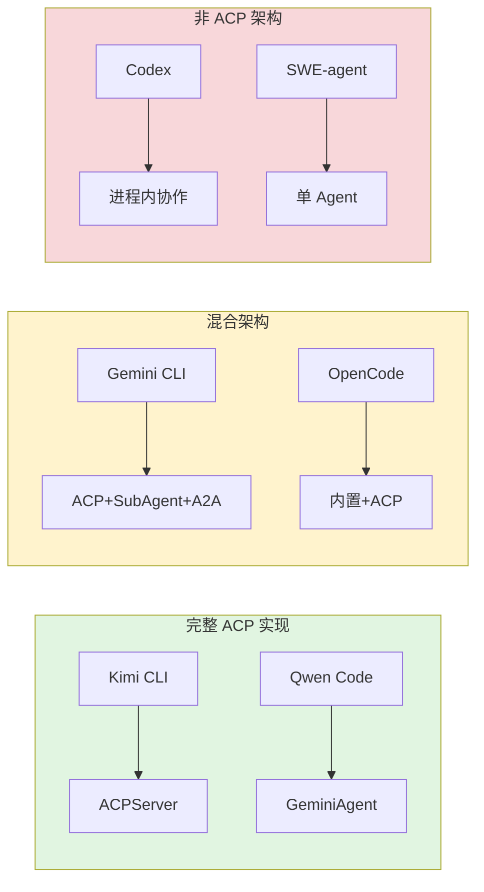

# ACP 与多 Agent 协作机制跨项目对比

## TL;DR（结论先行）

**六款 AI Coding Agent 在 ACP (Agent Client Protocol) 与多 Agent 协作机制上呈现三种截然不同的架构选择：Kimi CLI/Qwen Code 实现完整 ACP Server 模式，Gemini CLI/OpenCode 采用 ACP + 内置多 Agent 双轨架构，Codex 使用进程内 Sub-agent 协作而不支持 ACP，SWE-agent 坚持严格单 Agent 架构。**

---

## 1. 为什么需要这个机制？

### 1.1 问题场景

当 AI Coding Agent 面临复杂任务时（如"重构整个代码库"或"并行分析多个文件"），单一 Agent 架构面临根本限制：

**没有多 Agent 协作：**
- 所有任务串行执行，无法并行处理独立子任务
- 单个 Agent 上下文容易过载，难以管理复杂项目的多个方面
- 无法利用"分而治之"策略将大任务分解给专门的子 Agent

**没有 ACP 协议：**
- Agent 只能作为本地 CLI 工具运行，无法被外部系统（IDE、其他 Agent）调用
- 每个 IDE 需要单独适配 CLI 输出格式，维护成本高
- 无法实时获取 Agent 执行状态，用户体验受限

### 1.2 核心挑战

| 挑战 | 不解决的后果 |
|-----|-------------|
| 协议标准化 | 每个集成方都需要自定义适配，无法复用 |
| 多会话管理 | 无法同时服务多个客户端请求 |
| 子 Agent 生命周期 | 资源泄漏，僵尸 Agent 持续占用资源 |
| 能力协商 | 客户端不支持的功能无法优雅降级 |
| 流式状态传输 | 用户无法实时看到 Agent 执行进度 |

---

## 2. 整体架构对比

### 2.1 六项目架构总览

```text
┌─────────────────────────────────────────────────────────────────────────────────────────┐
│                           ACP 与多 Agent 协作架构谱系                                      │
├─────────────────────────────────────────────────────────────────────────────────────────┤
│                                                                                         │
│  ┌─────────────────────────────────────────────────────────────────────────────────┐   │
│  │  完整 ACP Server 实现                                                            │   │
│  │  ┌──────────────┐    ┌──────────────┐                                           │   │
│  │  │  Kimi CLI    │    │  Qwen Code   │                                           │   │
│  │  │  ─────────   │    │  ─────────   │                                           │   │
│  │  │  ACPServer   │    │  GeminiAgent │                                           │   │
│  │  │  ACPSession  │    │  Session     │                                           │   │
│  │  │  ACPKaos     │    │  SubAgentTracker                                        │   │
│  │  └──────────────┘    └──────────────┘                                           │   │
│  │         │                   │                                                   │   │
│  │         └───────────────────┘                                                   │   │
│  │                    │                                                            │   │
│  │                    ▼                                                            │   │
│  │         JSON-RPC over stdio (ACP 协议)                                          │   │
│  │                    │                                                            │   │
│  │         ┌──────────┴──────────┐                                                 │   │
│  │         ▼                     ▼                                                 │   │
│  │    ┌─────────┐           ┌─────────┐                                            │   │
│  │    │  IDE    │           │ 父 Agent │                                           │   │
│  │    │(VSCode) │           │(ACP调用) │                                           │   │
│  │    └─────────┘           └─────────┘                                            │   │
│  └─────────────────────────────────────────────────────────────────────────────────┘   │
│                                                                                         │
│  ┌─────────────────────────────────────────────────────────────────────────────────┐   │
│  │  ACP + 内置多 Agent 双轨                                                         │   │
│  │  ┌────────────────────────┐    ┌────────────────────────┐                       │   │
│  │  │    Gemini CLI          │    │    OpenCode            │                       │   │
│  │  │    ─────────           │    │    ─────────           │                       │   │
│  │  │                        │    │                        │                       │   │
│  │  │  ┌──────────────────┐  │    │  ┌──────────────────┐  │                       │   │
│  │  │  │ ACP (实验性)     │  │    │  │ ACP Server       │  │                       │   │
│  │  │  │ --experimental-  │  │    │  │ opencode acp     │  │                       │   │
│  │  │  │   acp            │  │    │  │                  │  │                       │   │
│  │  │  └──────────────────┘  │    │  └──────────────────┘  │                       │   │
│  │  │                        │    │                        │                       │   │
│  │  │  ┌──────────────────┐  │    │  ┌──────────────────┐  │                       │   │
│  │  │  │ SubAgent + A2A   │  │    │  │ task 工具        │  │                       │   │
│  │  │  │ LocalAgentExecutor│  │    │  │ 内置 Agent 类型  │  │                       │   │
│  │  │  │ RemoteAgent      │  │    │  │ build/plan/      │  │                       │   │
│  │  │  │   Invocation     │  │    │  │ explore          │  │                       │   │
│  │  │  └──────────────────┘  │    │  └──────────────────┘  │                       │   │
│  │  └────────────────────────┘    └────────────────────────┘                       │   │
│  └─────────────────────────────────────────────────────────────────────────────────┘   │
│                                                                                         │
│  ┌─────────────────────────────────────────────────────────────────────────────────┐   │
│  │  非 ACP 架构                                                                     │   │
│  │  ┌────────────────────────┐    ┌────────────────────────┐                       │   │
│  │  │    Codex               │    │    SWE-agent           │                       │   │
│  │  │    ─────────           │    │    ─────────           │                       │   │
│  │  │                        │    │                        │                       │   │
│  │  │  ┌──────────────────┐  │    │  ┌──────────────────┐  │                       │   │
│  │  │  │ multi_agent      │  │    │  │ RetryAgent       │  │                       │   │
│  │  │  │ (实验性)          │  │    │  │ (重试包装器)      │  │                       │   │
│  │  │  │                    │  │    │  │                    │  │                       │   │
│  │  │  │ MultiAgentHandler  │  │    │  │ 顺序实例化        │  │                       │   │
│  │  │  │ AgentControl       │  │    │  │ 非并发协作        │  │                       │   │
│  │  │  │ Guards (资源限制)  │  │    │  │                    │  │                       │   │
│  │  │  └──────────────────┘  │    │  └──────────────────┘  │                       │   │
│  │  │         │              │    │           │            │                       │   │
│  │  │         ▼              │    │           ▼            │                       │   │
│  │  │  单进程多线程协作       │    │    严格单 Agent       │                       │   │
│  │  │  (共享内存通信)        │    │    无子 Agent 能力    │                       │   │
│  │  └────────────────────────┘    └────────────────────────┘                       │   │
│  └─────────────────────────────────────────────────────────────────────────────────┘   │
│                                                                                         │
└─────────────────────────────────────────────────────────────────────────────────────────┘
```

### 2.2 ACP 支持情况对比

| 项目 | ACP 支持 | 实现状态 | 启动方式 | 协议版本 |
|-----|---------|---------|---------|---------|
| **Kimi CLI** | 完整实现 | 生产级 | `kimi --acp` | JSON-RPC 2.0 |
| **Qwen Code** | 完整实现 | 生产级 | `qwen --acp` | JSON-RPC 2.0 |
| **Gemini CLI** | 实验性 | Beta | `--experimental-acp` | JSON-RPC 2.0 |
| **OpenCode** | 完整实现 | 生产级 | `opencode acp` | JSON-RPC 2.0 |
| **Codex** | 不支持 | - | - | - |
| **SWE-agent** | 不支持 | - | - | - |

### 2.3 多 Agent 机制对比

| 项目 | 多 Agent 支持 | 实现方式 | 通信机制 |
|-----|--------------|---------|---------|
| **Kimi CLI** | 会话内协作 | ACP 协议 | JSON-RPC |
| **Qwen Code** | TaskTool + SubAgentTracker | 内置工具 | 事件发射器 |
| **Gemini CLI** | SubAgent + A2A | 工具化封装 | 函数调用/A2A |
| **OpenCode** | 内置多 Agent | `task` 工具 | 函数调用 |
| **Codex** | 实验性进程内 | `multi_agent` flag | 共享内存 |
| **SWE-agent** | 不支持 | RetryAgent 仅为重试 | - |

---

## 3. 核心机制详细对比

### 3.1 ACP Server 架构对比

#### Kimi CLI：分层协议架构

```text
┌─────────────────────────────────────────────────────────────┐
│ Kimi CLI ACP 架构                                           │
├─────────────────────────────────────────────────────────────┤
│                                                             │
│  ┌─────────────┐    ┌─────────────┐    ┌─────────────┐     │
│  │  ACPServer  │───▶│ ACPSession  │───▶│  KimiSoul   │     │
│  │  多会话管理  │    │ 单会话处理   │    │  Agent Loop │     │
│  └─────────────┘    └─────────────┘    └──────┬──────┘     │
│       │                                         │           │
│       │    ┌─────────────┐                      │           │
│       └───▶│   ACPKaos   │◀─────────────────────┘           │
│            │ 远程操作适配 │                                   │
│            └─────────────┘                                   │
│                                                             │
│  特点：                                                     │
│  • 三层架构：协议层/会话层/适配层                            │
│  • 能力协商 + fallback 机制                                  │
│  • MCP 配置桥接                                             │
│                                                             │
└─────────────────────────────────────────────────────────────┘
```

**✅ Verified**: 代码依据 `kimi-cli/src/kimi_cli/acp/server.py:27`

| 组件 | 职责 | 代码位置 |
|-----|------|---------|
| `ACPServer` | 多会话管理、协议握手、模型切换 | `kimi-cli/src/kimi_cli/acp/server.py:27` |
| `ACPSession` | 单会话处理、流式响应、权限审批 | `kimi-cli/src/kimi_cli/acp/session.py:115` |
| `ACPKaos` | 远程文件操作、能力协商、fallback | `kimi-cli/src/kimi_cli/acp/kaos.py:144` |

#### Qwen Code：模块化事件架构

```text
┌─────────────────────────────────────────────────────────────┐
│ Qwen Code ACP 架构                                          │
├─────────────────────────────────────────────────────────────┤
│                                                             │
│  ┌─────────────────────────────────────────────────────┐   │
│  │ AgentSideConnection (acp.ts)                        │   │
│  │ - JSON-RPC 消息路由                                  │   │
│  └───────────────────────┬─────────────────────────────┘   │
│                          │                                  │
│  ┌───────────────────────▼─────────────────────────────┐   │
│  │ GeminiAgent (acpAgent.ts)                           │   │
│  │ - 多会话生命周期管理                                  │   │
│  └───────────────────────┬─────────────────────────────┘   │
│                          │                                  │
│  ┌───────────────────────▼─────────────────────────────┐   │
│  │ Session (session/Session.ts)                        │   │
│  │ ┌─────────────┐ ┌─────────────┐ ┌─────────────┐    │   │
│  │ │HistoryReplayer│ │ToolCallEmitter│ │MessageEmitter│   │   │
│  │ └─────────────┘ └─────────────┘ └─────────────┘    │   │
│  └───────────────────────┬─────────────────────────────┘   │
│                          │                                  │
│  ┌───────────────────────▼─────────────────────────────┐   │
│  │ SubAgentTracker                                     │   │
│  │ - 子 Agent 事件跟踪                                  │   │
│  └─────────────────────────────────────────────────────┘   │
│                                                             │
└─────────────────────────────────────────────────────────────┘
```

**✅ Verified**: 代码依据 `qwen-code/packages/cli/src/acp-integration/acp.ts:207`

| 组件 | 职责 | 代码位置 |
|-----|------|---------|
| `AgentSideConnection` | JSON-RPC 协议处理，消息路由 | `qwen-code/packages/cli/src/acp-integration/acp.ts:207` |
| `GeminiAgent` | 多会话管理、认证、配置集成 | `qwen-code/packages/cli/src/acp-integration/acpAgent.ts:1` |
| `SubAgentTracker` | 子 Agent 事件跟踪 | `qwen-code/packages/cli/src/acp-integration/session/SubAgentTracker.ts:1` |

#### OpenCode：双轨架构

```text
┌─────────────────────────────────────────────────────────────┐
│ OpenCode 多 Agent 架构                                       │
├─────────────────────────────────────────────────────────────┤
│                                                             │
│   ┌─────────────────────┐    ┌─────────────────────┐       │
│   │   内置多 Agent 系统  │    │    ACP Server 模式   │       │
│   │   ───────────────   │    │    ───────────────   │       │
│   │                     │    │                     │       │
│   │  Agent.Info         │    │  ACP.init()         │       │
│   │  ├── build          │    │  AgentSideConnection│       │
│   │  ├── plan           │    │  ACPSessionManager  │       │
│   │  ├── explore        │    │                     │       │
│   │  └── general        │    │                     │       │
│   │                     │    │                     │       │
│   │  TaskTool           │    │  opencode acp       │       │
│   │  └── 函数调用协作    │    │  └── CLI 命令       │       │
│   │                     │    │                     │       │
│   └─────────────────────┘    └─────────────────────┘       │
│              │                        │                     │
│              └────────┬───────────────┘                     │
│                       ▼                                     │
│              ┌─────────────────┐                           │
│              │  SessionPrompt  │                           │
│              │  Agent Loop     │                           │
│              └─────────────────┘                           │
│                                                             │
│  特点：内部用函数调用，外部用 ACP 协议                        │
│                                                             │
└─────────────────────────────────────────────────────────────┘
```

**✅ Verified**: 代码依据 `opencode/packages/opencode/src/tool/task.ts:27`

| 组件 | 职责 | 代码位置 |
|-----|------|---------|
| `Agent.Info` | 定义 Agent 类型、权限配置 | `opencode/packages/opencode/src/agent/agent.ts:24` |
| `TaskTool` | 子 Agent 调用入口 | `opencode/packages/opencode/src/tool/task.ts:27` |
| `ACP Agent` | ACP 协议实现 | `opencode/packages/opencode/src/acp/agent.ts:52` |

#### Gemini CLI：三层工具 + ACP 实验性

```text
┌─────────────────────────────────────────────────────────────┐
│ Gemini CLI 多 Agent 架构                                     │
├─────────────────────────────────────────────────────────────┤
│                                                             │
│  ┌─────────────────────────────────────────────────────┐   │
│  │ ACP 模式 (实验性)                                    │   │
│  │ --experimental-acp                                  │   │
│  │ ┌─────────────┐    ┌─────────────┐                 │   │
│  │ │AgentSideConnection│ │GeminiAgent  │                 │   │
│  │ └─────────────┘    └─────────────┘                 │   │
│  └─────────────────────────────────────────────────────┘   │
│                          │                                  │
│  ┌───────────────────────▼─────────────────────────────┐   │
│  │ Main Agent (GeminiChat)                             │   │
│  │ ┌─────────────────────────────────────────────────┐ │   │
│  │ │ Tool Registry (三层来源)                        │ │   │
│  │ │ Built-in (0) → Discovered (1) → MCP (2)        │ │   │
│  │ └─────────────────────────────────────────────────┘ │   │
│  └───────────────────────┬─────────────────────────────┘   │
│                          │                                  │
│         ┌────────────────┼────────────────┐                │
│         ▼                ▼                ▼                │
│  ┌─────────────┐  ┌─────────────┐  ┌─────────────┐        │
│  │Local SubAgent│  │Local SubAgent│  │Remote Agent │        │
│  │codebase_    │  │cli_help     │  │(A2A Protocol)│        │
│  │investigator │  │             │  │             │        │
│  └─────────────┘  └─────────────┘  └─────────────┘        │
│                                                             │
└─────────────────────────────────────────────────────────────┘
```

**✅ Verified**: 代码依据 `gemini-cli/packages/cli/src/zed-integration/zedIntegration.ts:61`

| 组件 | 职责 | 代码位置 |
|-----|------|---------|
| `AgentRegistry` | Agent 发现、加载、注册 | `gemini-cli/packages/core/src/agents/registry.ts:39` |
| `SubagentTool` | SubAgent 工具定义 | `gemini-cli/packages/core/src/agents/subagent-tool.ts:24` |
| `LocalAgentExecutor` | 本地子 Agent 执行器 | `gemini-cli/packages/core/src/agents/local-executor.ts:75` |
| `A2AClientManager` | A2A 客户端管理 | `gemini-cli/packages/core/src/agents/a2a-client-manager.ts:45` |

### 3.2 非 ACP 架构对比

#### Codex：进程内 Sub-agent 协作

```text
┌─────────────────────────────────────────────────────────────────────────────┐
│                     Codex Multi-Agent (Sub-agent)                            │
│                                                                              │
│  ┌─────────────────────────────────────────────────────────────────────┐    │
│  │                         同一进程 (Process)                           │    │
│  │                                                                      │    │
│  │   ┌──────────────┐      AgentControl       ┌──────────────┐         │    │
│  │   │  Parent Agent│ ───────────────────────► │  Child Agent │         │    │
│  │   │  (Thread A)  │    spawn_agent()        │  (Thread B)  │         │    │
│  │   └──────────────┘                         └──────────────┘         │    │
│  │          │                                        │                 │    │
│  │          │ send_input() / wait() / close_agent()  │                 │    │
│  │          ▼                                        ▼                 │    │
│  │   ┌──────────────────────────────────────────────────────────┐     │    │
│  │   │              ThreadManagerState (共享状态)                 │     │    │
│  │   │   threads: HashMap<ThreadId, Arc<CodexThread>>           │     │    │
│  │   └──────────────────────────────────────────────────────────┘     │    │
│  └─────────────────────────────────────────────────────────────────────┘    │
│                                                                              │
│  特点：                                                                       │
│  - 子 Agent 在同一进程内运行（独立线程）                                          │
│  - 通过共享内存和消息队列通信                                                     │
│  - 非标准化协议，Codex 内部实现                                                   │
│  - Guards 限制并发数量和嵌套深度                                                  │
│                                                                              │
└─────────────────────────────────────────────────────────────────────────────┘
```

**✅ Verified**: 代码依据 `codex/codex-rs/core/src/agent/control.rs:55`

| 组件 | 职责 | 代码位置 |
|-----|------|---------|
| `MultiAgentHandler` | 处理多 Agent 工具调用 | `codex/codex-rs/core/src/tools/handlers/multi_agents.rs:40` |
| `AgentControl` | 子 Agent 生命周期管理 | `codex/codex-rs/core/src/agent/control.rs:37` |
| `Guards` | 限制并发子 Agent 数量和嵌套深度 | `codex/codex-rs/core/src/agent/guards.rs:21` |

#### SWE-agent：严格单 Agent

```text
┌─────────────────────────────────────────────────────────────┐
│ SWE-agent 单 Agent 架构                                      │
├─────────────────────────────────────────────────────────────┤
│                                                             │
│  ┌─────────────────────────────────────────────────────┐   │
│  │ RetryAgent（包装器）                                 │   │
│  │ - 管理多次 attempt                                  │   │
│  │ - 每次 attempt 创建新的 DefaultAgent 实例           │   │
│  │ - ⚠️ 注意：这不是多 Agent 协作，而是同一配置的重试   │   │
│  └───────────────────────┬─────────────────────────────┘   │
│                          │ 创建新实例（非并发）              │
│                          ▼                                 │
│  ┌─────────────────────────────────────────────────────┐   │
│  │ DefaultAgent（核心）                                 │   │
│  │ - 单 Agent 执行循环                                  │   │
│  │ - 无子 Agent 能力                                    │   │
│  │ - 无远程调用能力                                     │   │
│  └─────────────────────────────────────────────────────┘   │
│                                                             │
│  特点：                                                      │
│  • 严格单 Agent，专注于学术研究的可复现性                      │
│  • RetryAgent 仅为重试机制，非真正多 Agent                     │
│  • 无 ACP 协议支持                                           │
│                                                             │
└─────────────────────────────────────────────────────────────┘
```

**✅ Verified**: 代码依据 `sweagent/agent/agents.py:257`

---

## 4. 关键实现对比

### 4.1 ACP 协议方法支持对比

| 方法 | Kimi CLI | Qwen Code | Gemini CLI | OpenCode |
|-----|----------|-----------|------------|----------|
| `initialize` |  |  |  |  |
| `session/new` |  |  |  |  |
| `session/load` |  |  |  |  |
| `session/prompt` |  |  |  |  |
| `session/cancel` |  |  |  |  |
| `session/update` (流式) |  |  |  |  |
| `request_permission` |  |  |  |  |
| `fs/read_text_file` |  |  |  |  |
| `fs/write_text_file` |  |  |  |  |

### 4.2 子 Agent 创建方式对比

| 项目 | 创建方式 | 代码示例 | 特点 |
|-----|---------|---------|------|
| **Kimi CLI** | ACP 协议创建 | `ACPServer.new_session()` | 独立进程，完整隔离 |
| **Qwen Code** | TaskTool 内部 | `TaskTool` + `SubAgentTracker` | 事件跟踪，层级展示 |
| **Gemini CLI** | 工具化封装 | `delegate_to_X` 工具 | 统一工具接口 |
| **OpenCode** | 函数调用 | `TaskTool.execute()` | 同进程，Session 父子关联 |
| **Codex** | 线程创建 | `spawn_agent()` | 共享内存，低延迟 |
| **SWE-agent** | 不支持 | - | - |

### 4.3 MCP 配置桥接对比

**Kimi CLI**：
```python
# kimi-cli/src/kimi_cli/acp/mcp.py:13-46
def acp_mcp_servers_to_mcp_config(mcp_servers: list[MCPServer]) -> MCPConfig:
    """将 ACP 协议传来的 MCP Server 配置转换为内部格式。"""
    match server:
        case acp.schema.HttpMcpServer():
            return {"transport": "http", ...}
        case acp.schema.SseMcpServer():
            return {"transport": "sse", ...}
        case acp.schema.McpServerStdio():
            return {"transport": "stdio", ...}
```

**Qwen Code**：
```typescript
// qwen-code/packages/cli/src/acp-integration/acpAgent.ts
async newSessionConfig(cwd: string, mcpServers: acp.McpServer[]): Promise<Config> {
  const mergedMcpServers = { ...this.settings.merged.mcpServers };
  for (const { command, args, env: rawEnv, name } of mcpServers) {
    mergedMcpServers[name] = new MCPServerConfig(command, args, env, cwd);
  }
}
```

---

## 5. 设计取舍分析

### 5.1 架构选择矩阵

| 维度 | Kimi/Qwen | Gemini/OpenCode | Codex | SWE-agent |
|-----|-----------|-----------------|-------|-----------|
| **协议标准** | ACP 完整实现 | ACP + 内置双轨 | 内部实现 | 无 |
| **进程模型** | 多进程/服务化 | 混合 | 单进程多线程 | 单进程 |
| **通信方式** | JSON-RPC | JSON-RPC/函数调用 | 共享内存 | - |
| **部署模式** | 服务化 | 混合 | 本地 CLI | 本地 CLI |
| **适用场景** | IDE 集成/企业 | IDE + 本地协作 | 本地并行 | 学术研究 |

### 5.2 为什么这样设计？

#### Kimi CLI/Qwen Code：完整 ACP Server

**核心问题**：如何让本地 Agent 变成可远程调用的服务？

**解决方案**：
- 代码依据：`kimi-cli/src/kimi_cli/acp/server.py:27`
- 设计意图：通过分层架构实现关注点分离
- 带来的好处：
  - 协议层专注于 ACP 协议处理
  - 会话层管理多会话生命周期
  - 适配层处理远程操作代理
- 付出的代价：
  - 架构复杂度增加
  - 需要维护 ACP 相关代码

#### Gemini CLI：ACP + SubAgent + A2A

**核心问题**：如何在支持 IDE 集成的同时保持本地协作灵活性？

**解决方案**：
- 代码依据：`gemini-cli/packages/core/src/agents/subagent-tool.ts:24`
- 设计意图：ACP 用于 IDE 集成，SubAgent 用于本地专业化，A2A 用于远程扩展
- 带来的好处：
  - 本地子 Agent 可以完全控制执行环境
  - 远程 Agent 通过 A2A 协议标准化交互
  - 支持更细粒度的流式输出
- 付出的代价：
  - 三套代码路径，维护成本增加
  - 用户体验可能存在细微差异

#### OpenCode：双轨架构

**核心问题**：如何在保持内部简洁的同时支持外部集成？

**解决方案**：
- 代码依据：`opencode/packages/opencode/src/tool/task.ts:27`
- 设计意图：内置多 Agent 使用函数调用保证性能和简单性；ACP 模式使用标准化协议支持外部客户端
- 带来的好处：
  - 内部协作零网络开销
  - 外部集成标准化
  - 两种模式复用同一执行引擎
- 付出的代价：
  - 需要维护两套机制
  - 协议能力仍有缺口

#### Codex：进程内协作

**核心问题**：如何在本地 CLI 环境中实现多 Agent 协作？

**解决方案**：
- 代码依据：`codex/codex-rs/core/src/agent/control.rs:55`
- 设计意图：在单进程内通过线程隔离实现"伪分布式"协作
- 带来的好处：
  - 零网络延迟，父子通信微秒级
  - 共享文件系统状态，无需远程同步
  - 简化沙箱实现，统一安全边界
- 付出的代价：
  - 无法跨进程/跨网络协作
  - 单进程内存限制
  - 不支持标准的 ACP 协议互操作

#### SWE-agent：严格单 Agent

**核心问题**：如何在学术研究中保证可复现性和确定性？

**解决方案**：
- 代码依据：`sweagent/agent/agents.py:443`
- 设计意图：单一职责、确定性执行、可复现性
- 带来的好处：
  - 单一执行路径，易于重现
  - 单一 trajectory 记录完整过程
  - 结果可对比
- 付出的代价：
  - 无法处理需要多 Agent 协作的复杂任务
  - 无法被外部系统调用

### 5.3 跨项目对比总结



---

## 6. 关键代码索引

### 6.1 ACP 相关代码位置

| 项目 | 功能 | 文件 | 行号 |
|-----|------|------|------|
| **Kimi CLI** | ACPServer | `kimi-cli/src/kimi_cli/acp/server.py` | 27 |
| **Kimi CLI** | ACPSession | `kimi-cli/src/kimi_cli/acp/session.py` | 115 |
| **Kimi CLI** | ACPKaos | `kimi-cli/src/kimi_cli/acp/kaos.py` | 144 |
| **Kimi CLI** | MCP 配置桥接 | `kimi-cli/src/kimi_cli/acp/mcp.py` | 13 |
| **Qwen Code** | AgentSideConnection | `qwen-code/packages/cli/src/acp-integration/acp.ts` | 207 |
| **Qwen Code** | GeminiAgent | `qwen-code/packages/cli/src/acp-integration/acpAgent.ts` | 1 |
| **Qwen Code** | Session | `qwen-code/packages/cli/src/acp-integration/session/Session.ts` | 1 |
| **Qwen Code** | SubAgentTracker | `qwen-code/packages/cli/src/acp-integration/session/SubAgentTracker.ts` | 1 |
| **Gemini CLI** | ACP 入口 | `gemini-cli/packages/cli/src/zed-integration/zedIntegration.ts` | 61 |
| **Gemini CLI** | AgentRegistry | `gemini-cli/packages/core/src/agents/registry.ts` | 39 |
| **Gemini CLI** | LocalAgentExecutor | `gemini-cli/packages/core/src/agents/local-executor.ts` | 75 |
| **OpenCode** | Agent 定义 | `opencode/packages/opencode/src/agent/agent.ts` | 24 |
| **OpenCode** | TaskTool | `opencode/packages/opencode/src/tool/task.ts` | 27 |
| **OpenCode** | ACP Agent | `opencode/packages/opencode/src/acp/agent.ts` | 52 |

### 6.2 非 ACP 多 Agent 代码位置

| 项目 | 功能 | 文件 | 行号 |
|-----|------|------|------|
| **Codex** | MultiAgentHandler | `codex/codex-rs/core/src/tools/handlers/multi_agents.rs` | 40 |
| **Codex** | AgentControl | `codex/codex-rs/core/src/agent/control.rs` | 37 |
| **Codex** | Guards | `codex/codex-rs/core/src/agent/guards.rs` | 21 |
| **Codex** | Feature::Collab | `codex/codex-rs/core/src/features.rs` | 573 |
| **SWE-agent** | DefaultAgent | `sweagent/agent/agents.py` | 443 |
| **SWE-agent** | RetryAgent | `sweagent/agent/agents.py` | 257 |

---

## 7. 延伸阅读

- ACP 协议概念：`docs/comm/comm-what-is-acp.md`
- MCP 集成对比：`docs/comm/06-comm-mcp-integration.md`
- 各项目详细实现：
  - `docs/kimi-cli/13-kimi-cli-acp-integration.md`
  - `docs/qwen-code/13-qwen-code-acp-integration.md`
  - `docs/gemini-cli/13-gemini-cli-acp-integration.md`
  - `docs/opencode/13-opencode-acp-integration.md`
  - `docs/codex/13-codex-acp-integration.md`
  - `docs/swe-agent/13-swe-agent-acp-integration.md`

---

*✅ Verified: 基于各项目源码分析*
*基于版本：2026-02-08 | 最后更新：2026-02-28*
