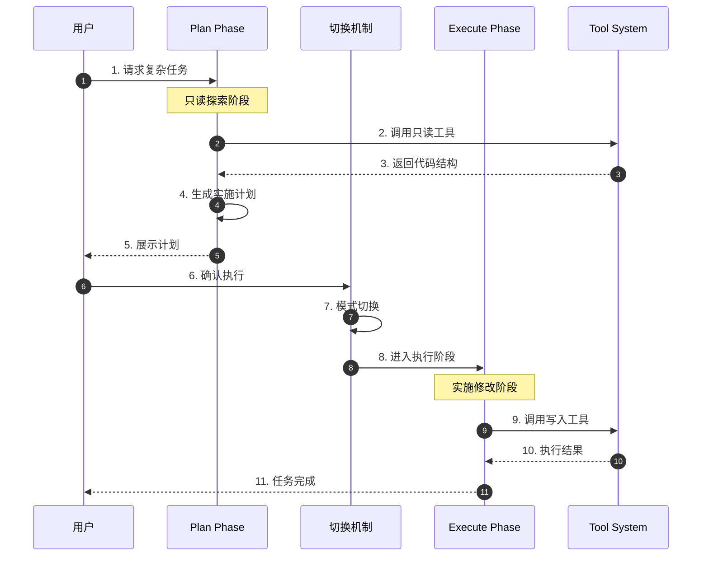
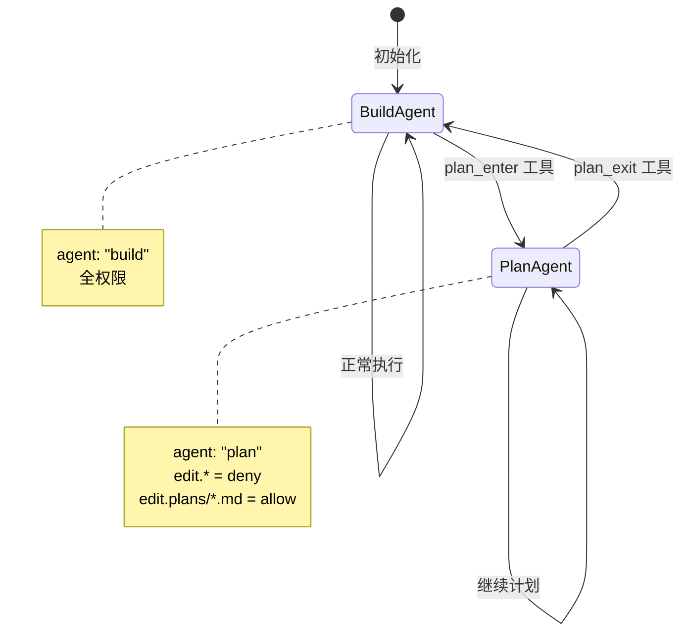
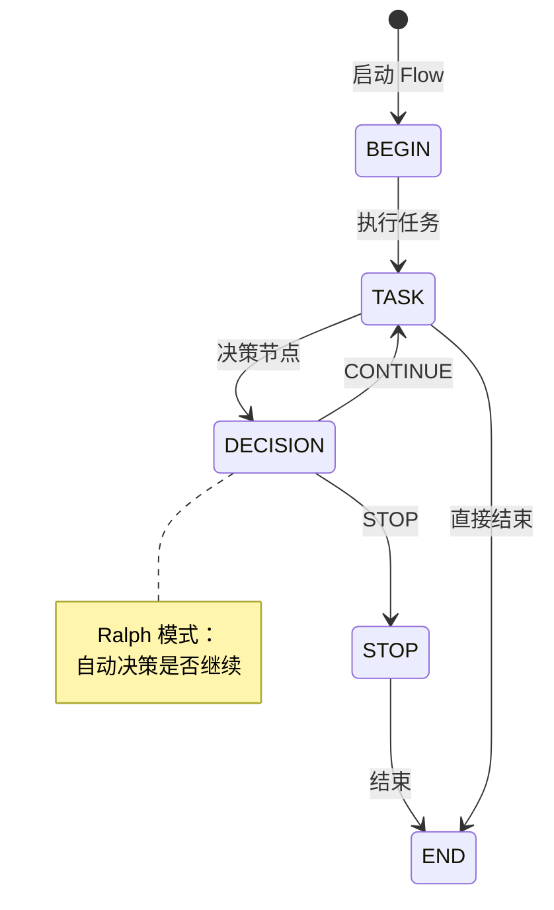
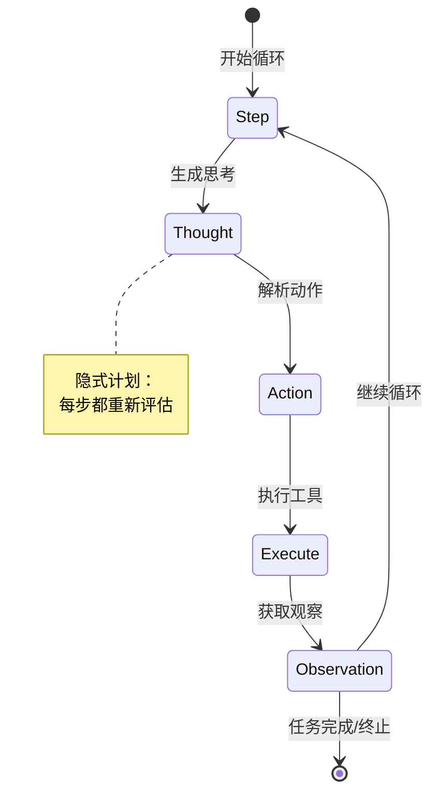
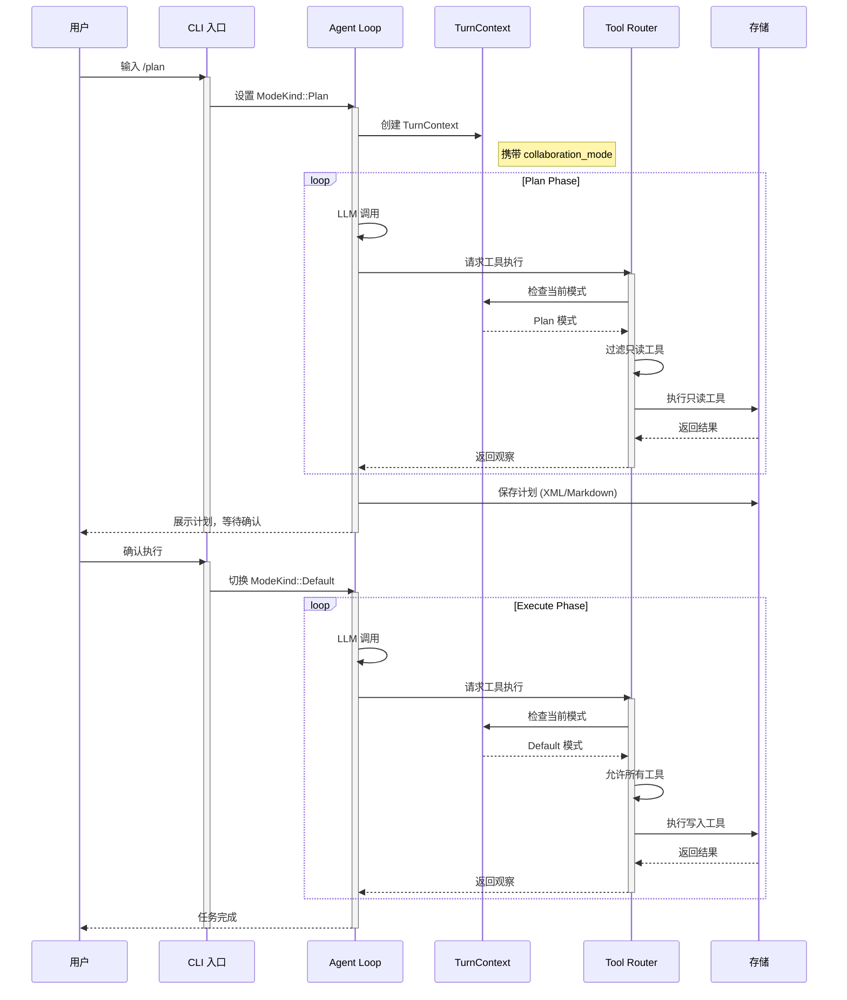
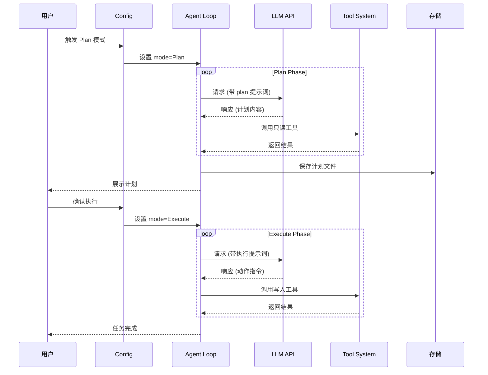
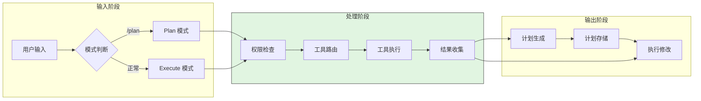
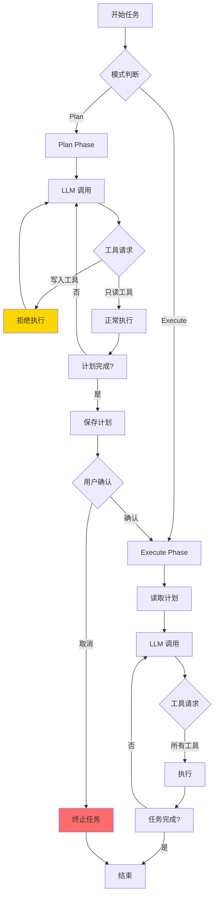
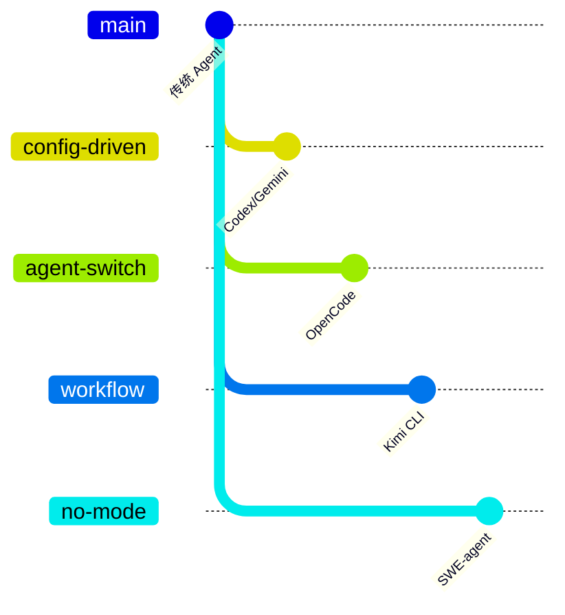

# Plan and Execute 模式跨项目对比

> **阅读指南**
>
> | 属性 | 说明 |
> |-----|------|
> | 预计阅读 | 25-35 分钟 |
> | 前置文档 | `01-{project}-overview.md`、`04-{project}-agent-loop.md` |
> | 文档结构 | 速览 → 架构 → 机制 → 实现 → 对比 |
> | 代码呈现 | 关键代码直接展示，完整代码可折叠查看 |

---

## TL;DR（结论先行）

**Plan and Execute** 是一种将复杂任务分为"计划阶段（只读探索）"和"执行阶段（实施修改）"的架构模式，用于防止 Agent 在探索阶段意外破坏代码。

5 个主流 Agent 的核心取舍：**Codex/Gemini CLI/OpenCode 采用"先计划后执行"的显式阶段分离**（对比 Kimi CLI 的"工作流编排"和 SWE-agent 的"边计划边执行"）

### 核心要点速览

| 维度 | 关键决策 | 代表项目 |
|-----|---------|---------|
| 模式切换 | 配置驱动（枚举/策略） | Codex, Gemini CLI |
| Agent 隔离 | 不同类型 Agent 切换 | OpenCode |
| 流程编排 | 预定义 Flow 图遍历 | Kimi CLI |
| 无模式 | Thought-Action 统一循环 | SWE-agent |
| 权限隔离 | TurnContext / Policy Engine / PermissionNext | Codex, Gemini CLI, OpenCode |

---

## 1. 为什么需要这个机制？

### 1.1 问题场景

想象一下这个场景：你让 AI Agent 实现一个复杂的新功能。它立刻开始修改代码，删除了你的核心文件，然后又发现思路不对，留下一片狼藉...

**没有 Plan and Execute：**
```
用户: "实现用户认证功能"
  → LLM: 直接开始修改代码
  → 删除现有文件（错误！）
  → 发现思路不对
  → 留下无法运行的代码
  → 用户需要手动恢复
```

**有 Plan and Execute：**
```
用户: "实现用户认证功能"
  → [Plan Phase] 只读探索代码结构
  → [Plan Phase] 制定详细实施计划
  → [用户确认] 审查计划
  → [Execute Phase] 按计划执行修改
  → 任务完成，代码可运行
```

### 1.2 核心挑战

| 挑战 | 不解决的后果 |
|-----|-------------|
| 探索阶段误操作 | Agent 在理解代码时意外修改/删除文件 |
| 计划与执行混淆 | 执行过程中不断改变计划，导致代码不一致 |
| 权限控制粒度 | 无法区分"读取理解"和"写入修改"的权限 |
| Context 污染 | 计划阶段的临时思考影响执行阶段的判断 |

---

## 2. 整体架构

### 2.1 在系统中的位置

```text
┌─────────────────────────────────────────────────────────────┐
│ 用户输入 / CLI 入口                                          │
│ codex/src/main.rs | gemini-cli/src/index.ts                 │
└───────────────────────┬─────────────────────────────────────┘
                        │ 触发
                        ▼
┌─────────────────────────────────────────────────────────────┐
│ ▓▓▓ Plan and Execute 模式 ▓▓▓                               │
│                                                             │
│ ┌─────────────┐  ┌─────────────┐  ┌─────────────┐          │
│ │ Plan Phase  │  │  切换机制   │  │Execute Phase│          │
│ │  (只读探索)  │◀─┤ 配置/Agent  ├─▶│  (实施修改)  │          │
│ └─────────────┘  │   /工具     │  └─────────────┘          │
│                  └─────────────┘                            │
└───────────────────────┬─────────────────────────────────────┘
                        │ 依赖
        ┌───────────────┼───────────────┐
        ▼               ▼               ▼
┌──────────────┐ ┌──────────────┐ ┌──────────────┐
│ Agent Loop   │ │ Tool System  │ │ Context      │
│ 循环控制     │ │ 权限控制     │ │ 状态管理     │
└──────────────┘ └──────────────┘ └──────────────┘
```

### 2.2 核心组件职责

| 组件 | 职责 | 代表项目 |
|-----|------|---------|
| `ModeKind` / `ApprovalMode` | 定义 Plan/Execute 枚举状态 | Codex, Gemini CLI |
| `Policy Engine` | 基于策略文件决定工具权限 | Gemini CLI |
| `TurnContext` | 运行时模式判断，控制工具可用性 | Codex |
| `Plan Agent` / `Build Agent` | 不同类型 Agent 拥有不同权限 | OpenCode |
| `FlowRunner` | 遍历 Flow 图执行节点 | Kimi CLI |
| `Thought-Action Parser` | 解析每步的思考和动作 | SWE-agent |

### 2.3 核心组件交互关系



**关键交互说明**：

| 步骤 | 交互内容 | 设计意图 |
|-----|---------|---------|
| 1-5 | Plan Phase 只读探索 | 确保理解代码结构后才修改，降低误操作风险 |
| 6-7 | 用户确认 + 模式切换 | 人机协作，关键决策点由人类把控 |
| 8-11 | Execute Phase 实施 | 按计划执行，权限放开但范围受限 |

---

## 3. 核心组件详细分析

### 3.1 配置驱动模式（Codex & Gemini CLI）

#### 职责定位

通过配置枚举区分 Plan/Execute 模式，在同一线程中切换行为。

#### 状态机图

```mermaid
stateDiagram-v2
    [*] --> Default: 初始化
    Default --> Plan: /plan 命令
    Plan --> Default: /plan 切换
    Plan --> Plan: 继续计划
    Default --> Default: 正常执行

    note right of Plan
        只读工具可用
        写入工具禁用
    end note

    note right of Default
        所有工具可用
    end note
```

**状态说明**：

| 状态 | 说明 | 进入条件 | 退出条件 |
|-----|------|---------|---------|
| Default | 默认执行模式 | 初始化或从 Plan 切换 | 用户输入 /plan |
| Plan | 计划模式（只读） | /plan 命令触发 | /plan 命令切换 |

#### 内部数据流

```text
┌────────────────────────────────────────────┐
│  输入层                                     │
│   用户输入 → 模式识别 → 配置切换            │
└──────────────────┬─────────────────────────┘
                   ▼
┌────────────────────────────────────────────┐
│  处理层                                     │
│   权限检查 → 工具路由 → 执行控制            │
│   (TurnContext 判断工具可用性)              │
└──────────────────┬─────────────────────────┘
                   ▼
┌────────────────────────────────────────────┐
│  输出层                                     │
│   结果生成 → 计划存储 → 模式状态            │
└────────────────────────────────────────────┘
```

#### 关键接口

| 接口 | 输入 | 输出 | 说明 | 代码位置 |
|-----|------|------|------|---------|
| `ModeKind::Plan` | 用户命令 | 模式状态 | 枚举定义 | `codex-rs/protocol/src/config_types.rs` |
| `enter_plan_mode` | 用户确认 | 模式切换 | 进入工具 | `gemini-cli/packages/core/src/tools/enter-plan-mode.ts` |
| `exit_plan_mode` | 用户确认 | 模式切换 | 退出工具 | `gemini-cli/packages/core/src/tools/exit-plan-mode.ts` |

---

### 3.2 Agent 切换模式（OpenCode）

#### 职责定位

通过切换不同类型 Agent 实现模式分离，Plan Agent 和 Build Agent 拥有完全不同的权限配置。

#### 状态机图



#### Context 流转与 Agent 切换

```text
Build Agent Context              切换点                Plan Agent Context
┌─────────────────┐                                    ┌─────────────────┐
│ agent: "build"  │                                    │ agent: "plan"   │
│ 全权限          │ ──plan_enter─────────────────────▶ │ 只读权限        │
│                 │    合成消息切换                     │                 │
│ 执行历史         │                                    │ 探索结果         │
└─────────────────┘                                    └─────────────────┘
                                                           │
                                                           │ 写入
                                                           ▼
                                                    ┌───────────────┐
                                                    │ .opencode/    │
                                                    │ plans/*.md    │
                                                    └───────────────┘
                                                           │
                           切换点                          │
┌─────────────────┐         │                              │
│ agent: "build"  │ ◀────plan_exit─────────────────────────┘
│ 全权限恢复       │    合成消息切换
│ 读取计划         │
│ 开始执行         │
└─────────────────┘
```

#### 关键接口

| 接口 | 输入 | 输出 | 说明 | 代码位置 |
|-----|------|------|------|---------|
| `PlanEnterTool` | 用户触发 | Agent 切换 | 进入 Plan Agent | `opencode/packages/opencode/src/tool/plan.ts` |
| `PlanExitTool` | 用户确认 | Agent 切换 | 返回 Build Agent | `opencode/packages/opencode/src/tool/plan.ts` |
| `AgentConfig` | 配置对象 | 权限定义 | Agent 类型定义 | `opencode/packages/opencode/src/agent/agent.ts` |

---

### 3.3 工作流编排模式（Kimi CLI）

#### 职责定位

使用预定义的 Flow 图（节点和边）来编排工作流，而非显式的 Plan/Execute 阶段分离。

#### 状态机图



**状态说明**：

| 状态 | 说明 | 进入条件 | 退出条件 |
|-----|------|---------|---------|
| BEGIN | Flow 起始节点 | 用户触发 /flow | 执行首个 task |
| TASK | 任务执行节点 | 上节点完成 | 执行完成 |
| DECISION | 决策节点 | task 完成 | 根据条件分支 |
| STOP | 停止节点 | DECISION 判断 | 进入 END |
| END | Flow 结束 | STOP 或 task 完成 | 无 |

#### 数据流

```text
┌────────────────────────────────────────────┐
│  Flow 定义层                                │
│   SKILL.md → Flow 图 → 节点定义             │
└──────────────────┬─────────────────────────┘
                   ▼
┌────────────────────────────────────────────┐
│  FlowRunner 执行层                          │
│   节点遍历 → max_moves 检查 → 节点执行       │
└──────────────────┬─────────────────────────┘
                   ▼
┌────────────────────────────────────────────┐
│  Agent Loop 层                              │
│   节点内容 → LLM 调用 → 工具执行             │
└────────────────────────────────────────────┘
```

---

### 3.4 无模式模式（SWE-agent）

#### 职责定位

没有显式的 Plan/Execute 分离，规划和执行在每个步骤中通过 Thought-Action 循环完成。

#### 状态机图



#### 数据流

```text
┌────────────────────────────────────────────┐
│  模板注入层                                 │
│   system_template → instance_template       │
│   → next_step_template                      │
└──────────────────┬─────────────────────────┘
                   ▼
┌────────────────────────────────────────────┐
│  Agent Loop 层                              │
│   Model Query → Parse Thought → Parse Action│
│   → Execute → Observation                   │
└──────────────────┬─────────────────────────┘
                   ▼
┌────────────────────────────────────────────┐
│  Trajectory 累积层                          │
│   记录每步 thought/action/observation       │
└────────────────────────────────────────────┘
```

---

### 3.5 组件间协作时序

以配置驱动模式为例，展示 Plan Phase 到 Execute Phase 的完整切换：



**协作要点**：

1. **用户与 CLI 入口**：通过 `/plan` 命令或工具触发模式切换
2. **Agent Loop 与 TurnContext**：Context 携带模式信息，供下游判断
3. **Tool Router 与模式**：根据模式过滤可用工具，实现权限隔离
4. **存储层**：Plan 阶段结果持久化，供 Execute 阶段读取

---

## 4. 端到端数据流转

### 4.1 正常流程（配置驱动模式）



**数据变换详情**：

| 阶段 | 输入 | 处理 | 输出 | 代码位置 |
|-----|------|------|------|---------|
| Plan 触发 | 用户命令 | 模式枚举切换 | Plan 状态 | `config_types.rs:ModeKind` |
| Plan 执行 | 代码上下文 | LLM 分析 + 只读工具 | 计划文档 | `plan.md` 模板 |
| 模式切换 | 用户确认 | 状态枚举切换 | Execute 状态 | `enter-plan-mode.ts` |
| Execute 执行 | 计划文档 | LLM 执行 + 写入工具 | 修改结果 | `exit-plan-mode.ts` |

### 4.2 数据流向图



### 4.3 异常/边界流程



---

## 5. 关键代码实现

### 5.1 核心数据结构

**Codex - ModeKind 枚举** ✅ Verified

```rust
// codex/codex-rs/protocol/src/config_types.rs
/// The kind of collaboration mode.
#[derive(Clone, Copy, Debug, Default, Deserialize, PartialEq, Serialize)]
#[serde(rename_all = "snake_case")]
pub enum ModeKind {
    #[default]
    /// The default Ask/Agent mode.
    Ask,
    /// The agent operates in full autonomy mode.
    #[serde(alias = "agent")]
    Auto,
    /// The agent is in plan mode.
    Plan,
}
```

**字段说明**：
| 字段 | 类型 | 用途 |
|-----|------|------|
| `Ask` | 枚举值 | 默认模式，每次操作需确认 |
| `Auto` | 枚举值 | 全自动模式，无需确认 |
| `Plan` | 枚举值 | 计划模式，只读探索 |

**Gemini CLI - ApprovalMode 枚举** ✅ Verified

```typescript
// gemini-cli/packages/core/src/policy/types.ts
export enum ApprovalMode {
  /** Fully automatic; no user approval required. */
  AUTO = 'auto',
  /** User approval required for potentially destructive operations. */
  DEFAULT = 'default',
  /** User approval required for all operations. */
  NEVER = 'never',
  /** Plan mode: user approval required before executing plan. */
  PLAN = 'plan',
}
```

**OpenCode - Agent 配置** ✅ Verified

```typescript
// opencode/packages/opencode/src/agent/agent.ts
export interface AgentConfig {
  name: string;
  permissions: PermissionConfig;
  systemPrompt: string;
}

export const PLAN_AGENT: AgentConfig = {
  name: 'plan',
  permissions: {
    edit: { default: 'deny', allow: ['plans/*.md'] },
    read: { default: 'allow' },
  },
  // ...
};
```

### 5.2 主链路代码

**Codex - Plan 模式工具限制** ✅ Verified

```rust
// codex/codex-rs/core/src/tools/handlers/plan.rs
pub async fn handle_update_plan(
    ctx: &TurnContext,
    input: UpdatePlanInput,
) -> Result<UpdatePlanOutput, ToolError> {
    // 检查当前模式是否为 Plan
    if ctx.collaboration_mode.mode != ModeKind::Plan {
        return Err(ToolError::InvalidMode {
            expected: ModeKind::Plan,
            actual: ctx.collaboration_mode.mode,
        });
    }
    // ... 更新计划逻辑
}
```

**设计意图**：
1. **运行时模式检查**：通过 `TurnContext` 判断当前模式，而非全局状态
2. **显式错误返回**：模式不匹配时返回清晰错误，便于调试
3. **集中控制**：在工具处理器层面统一控制权限

<details>
<summary>查看完整实现（Gemini CLI Policy Engine）</summary>

```typescript
// gemini-cli/packages/core/src/policy/engine.ts
export class PolicyEngine {
  async evaluate(request: ToolRequest): Promise<PolicyDecision> {
    const mode = this.config.approvalMode;

    // Plan 模式下特殊处理
    if (mode === ApprovalMode.PLAN) {
      const policy = await this.loadPolicy('plan.toml');
      return this.evaluateWithPolicy(request, policy);
    }

    // 其他模式处理...
  }

  private evaluateWithPolicy(
    request: ToolRequest,
    policy: Policy
  ): PolicyDecision {
    // 检查工具是否在允许列表
    if (policy.allowedTools.includes(request.toolName)) {
      return { type: 'allow' };
    }

    // 检查工具是否在拒绝列表
    if (policy.deniedTools.includes(request.toolName)) {
      return { type: 'deny', reason: 'Tool not allowed in plan mode' };
    }

    // 默认需要用户确认
    return { type: 'ask_user' };
  }
}
```

</details>

### 5.3 关键调用链

**Codex Plan 模式调用链**：

```text
main()                           [codex/src/main.rs:45]
  -> run()                       [codex/src/main.rs:120]
    -> handle_command()          [codex/src/commands.rs:89]
      -> set_mode()              [codex/src/mode.rs:34]
        - 设置 ModeKind::Plan
    -> agent_loop()              [codex-rs/core/src/agent_loop.rs:156]
      - 创建 TurnContext 携带 mode
      -> execute_turn()          [codex-rs/core/src/turn.rs:78]
        -> route_tool()          [codex-rs/core/src/tools/router.rs:45]
          - 检查 ctx.collaboration_mode.mode
          -> handle_*()          [codex-rs/core/src/tools/handlers/*.rs]
            - 根据模式决定是否执行
```

**Gemini CLI Plan 模式调用链**：

```text
main()                           [gemini-cli/src/index.ts:56]
  -> run()                       [gemini-cli/src/index.ts:120]
    -> enterPlanMode()           [packages/core/src/tools/enter-plan-mode.ts:45]
      - 设置 Config.approvalMode = ApprovalMode.PLAN
    -> scheduler.run()           [packages/core/src/scheduler.ts:89]
      -> policyEngine.evaluate() [packages/core/src/policy/engine.ts:67]
        - 加载 plan.toml 策略
        - 判断工具是否允许
      -> executeTool()           [packages/core/src/tools/executor.ts:34]
        - 根据策略决策执行或拒绝
```

---

## 6. 设计意图与 Trade-off

### 6.1 各项目的选择

| 维度 | Codex | Gemini CLI | OpenCode | Kimi CLI | SWE-agent |
|-----|-------|-----------|----------|----------|-----------|
| **模式切换** | ModeKind 枚举 | ApprovalMode + TOML | Agent 类型切换 | Flow 图遍历 | 无模式 |
| **权限控制** | TurnContext 判断 | Policy Engine | PermissionNext | Flow 节点控制 | 无隔离 |
| **计划存储** | XML 标签（消息流） | Markdown 文件 | Markdown 文件 | Flow 图定义 | thought 隐式 |
| **Context 流转** | 配置切换延续 | Config + 文件 | Agent 切换 | 节点遍历 | 累积式 |
| **复杂度** | 低 | 中 | 中 | 高 | 低 |

### 6.2 为什么这样设计？

**核心问题**：如何在探索阶段防止误操作，同时保证执行阶段的效率？

**配置驱动（Codex/Gemini CLI）的解决方案**：
- 代码依据：`config_types.rs:ModeKind` / `types.ts:ApprovalMode`
- 设计意图：在同一线程中通过配置切换行为，简单直观
- 带来的好处：
  - 实现简单，易于理解和维护
  - Context 自然延续，无需额外传递
  - 用户可以无缝切换模式
- 付出的代价：
  - 权限控制粒度受限于配置表达能力
  - 计划存储在消息流中可能丢失

**Agent 切换（OpenCode）的解决方案**：
- 代码依据：`agent.ts:AgentConfig`
- 设计意图：通过不同类型 Agent 实现真正的权限隔离
- 带来的好处：
  - 权限配置完全独立，不会互相干扰
  - Plan Agent 可以专门优化计划生成
  - Build Agent 可以专注于代码实现
- 付出的代价：
  - 需要处理 Agent 间 Context 传递
  - 切换开销较大

**工作流编排（Kimi CLI）的解决方案**：
- 代码依据：`kimisoul.py:FlowRunner`
- 设计意图：预设流程图，自动遍历执行
- 带来的好处：
  - 支持复杂的循环和分支逻辑
  - 流程可视化，易于理解
  - 可以自动迭代（Ralph 模式）
- 付出的代价：
  - 流程定义复杂
  - 不够灵活，难以处理意外情况

**无模式（SWE-agent）的解决方案**：
- 代码依据：`agents.py:step()`
- 设计意图：每步都重新评估，灵活适应
- 带来的好处：
  - 实现最简单
  - 最灵活，适合探索性任务
  - 无需显式模式切换
- 付出的代价：
  - 没有严格的权限隔离
  - 容易在探索阶段误操作

### 6.3 与其他项目的对比



| 项目 | 核心差异 | 适用场景 |
|-----|---------|---------|
| **Codex** | 简单的枚举切换，Context 自然延续 | 需要快速切换的迭代开发 |
| **Gemini CLI** | 策略文件驱动，权限配置灵活 | 需要精细权限控制的企业环境 |
| **OpenCode** | 真正的 Agent 隔离，权限完全分离 | 需要严格安全隔离的场景 |
| **Kimi CLI** | 预设流程图，支持自动迭代 | 标准化的复杂工作流 |
| **SWE-agent** | 无模式，最灵活 | 探索性 Bug 修复 |

---

## 7. 边界情况与错误处理

### 7.1 终止条件

| 终止原因 | 触发条件 | 代码位置 |
|---------|---------|---------|
| 用户取消 | Plan Phase 中用户输入取消 | `enter-plan-mode.ts:78` |
| 计划超时 | Plan Phase 执行超过时间限制 | `scheduler.ts:156` |
| 工具拒绝 | Plan 模式请求写入工具 | `plan.rs:45` |
| 模式不匹配 | Execute 模式调用 plan 专属工具 | `plan.rs:52` |
| 计划验证失败 | 计划内容不符合规范 | `planUtils.ts:89` |

### 7.2 超时/资源限制

**Gemini CLI Plan 模式超时配置** ✅ Verified

```typescript
// gemini-cli/packages/core/src/scheduler.ts
const PLAN_MODE_TIMEOUT = 30 * 60 * 1000; // 30 分钟

async function runWithTimeout() {
  const timeout = setTimeout(() => {
    throw new PlanModeTimeoutError('Plan phase exceeded 30 minutes');
  }, PLAN_MODE_TIMEOUT);

  try {
    await runPlanPhase();
  } finally {
    clearTimeout(timeout);
  }
}
```

### 7.3 错误恢复策略

| 错误类型 | 处理策略 | 代码位置 |
|---------|---------|---------|
| 模式切换失败 | 回滚到上一个稳定模式 | `mode.rs:67` |
| 计划解析失败 | 提示用户重新生成 | `proposed_plan_parser.rs:123` |
| 权限拒绝 | 提示当前模式限制 | `policy/engine.ts:145` |
| Agent 切换失败 | 保持当前 Agent，记录错误 | `session.ts:234` |

---

## 8. 关键代码索引

| 功能 | 项目 | 文件 | 说明 |
|-----|------|------|------|
| 模式枚举 | Codex | `codex/codex-rs/protocol/src/config_types.rs` | ModeKind 定义 |
| Plan 模板 | Codex | `codex/codex-rs/core/templates/collaboration_mode/plan.md` | 三阶段工作流提示词 |
| 计划解析 | Codex | `codex/codex-rs/core/src/proposed_plan_parser.rs` | XML 标签块解析 |
| 工具限制 | Codex | `codex/codex-rs/core/src/tools/handlers/plan.rs` | Plan 模式权限控制 |
| 模式枚举 | Gemini CLI | `gemini-cli/packages/core/src/policy/types.ts` | ApprovalMode 定义 |
| 进入工具 | Gemini CLI | `gemini-cli/packages/core/src/tools/enter-plan-mode.ts` | enter_plan_mode 实现 |
| 退出工具 | Gemini CLI | `gemini-cli/packages/core/src/tools/exit-plan-mode.ts` | exit_plan_mode 实现 |
| 策略配置 | Gemini CLI | `gemini-cli/packages/core/src/policy/policies/plan.toml` | Plan 模式权限规则 |
| 计划验证 | Gemini CLI | `gemini-cli/packages/core/src/utils/planUtils.ts` | 路径和内容验证 |
| Agent 定义 | OpenCode | `opencode/packages/opencode/src/agent/agent.ts` | build/plan Agent 定义 |
| Plan 工具 | OpenCode | `opencode/packages/opencode/src/tool/plan.ts` | plan_enter/exit 工具 |
| 功能标志 | OpenCode | `opencode/packages/opencode/src/flag/flag.ts` | OPENCODE_EXPERIMENTAL_PLAN_MODE |
| FlowRunner | Kimi CLI | `kimi-cli/src/kimi_cli/soul/kimisoul.py` | 流程执行器 |
| Flow 定义 | Kimi CLI | `kimi-cli/src/kimi_cli/skill/flow/__init__.py` | FlowNode, FlowNodeKind |
| Agent Loop | SWE-agent | `SWE-agent/sweagent/agent/agents.py` | step(), run() |
| Thought-Action | SWE-agent | `SWE-agent/sweagent/tools/parsing.py` | ThoughtActionParser |

---

## 9. 延伸阅读

- 前置知识：`01-codex-overview.md`、`04-codex-agent-loop.md`
- 相关机制：`comm-agent-loop.md`、`comm-tool-system.md`
- 深度分析：
  - `docs/codex/questions/codex-plan-mode-implementation.md`
  - `docs/gemini-cli/questions/gemini-cli-policy-engine.md`
  - `docs/opencode/questions/opencode-agent-switching.md`

---

## 决策树：选择适合你场景的架构

```
你的任务需要什么？
    │
    ├── 需要严格"先计划后执行"？
    │       │
    │       ├── 是 → 需要文件持久化计划？
    │       │           │
    │       │           ├── 是 → 选择 Gemini CLI 模式 ✅
    │       │           │
    │       │           └── 否 → 选择 Codex 模式 ✅
    │       │
    │       └── 否 → 需要 Agent 类型分离？
    │                   │
    │                   ├── 是 → 选择 OpenCode 模式 ✅
    │                   │
    │                   └── 否 → 流程是否预设？
    │                               │
    │                               ├── 是 → 选择 Kimi CLI 模式 ✅
    │                               │
    │                               └── 否 → 选择 SWE-agent 模式 ✅
    │
    └── 不需要 → 简单循环足够 → SWE-agent 模式 ✅
```

---

## 三种架构模式速查

| 模式 | 代表 Agent | 核心特点 | 最佳实践 |
|-----|-----------|---------|---------|
| **配置驱动** | Codex, Gemini CLI | 同一线程，配置切换权限 | 使用枚举区分模式，策略文件控制工具权限 |
| **Agent 切换** | OpenCode | 不同类型 Agent，合成消息切换 | Plan Agent 只读，Build Agent 全权限 |
| **工作流编排** | Kimi CLI | 预定义 Flow 图，节点遍历执行 | 定义 begin/task/decision/end 节点类型 |
| **无模式** | SWE-agent | Thought-Action 统一循环 | 模板引导，每步重新评估 |

---

*✅ Verified: 基于 codex/codex-rs/protocol/src/config_types.rs、gemini-cli/packages/core/src/policy/types.ts 等源码分析*
*基于版本：2026-02-08 | 最后更新：2026-03-03*
