# 单一技术点文档模板（适用于 Agent Loop、Checkpoint、Tool System 等）

存放位置：`docs/comm/comm-{技术点}-template.md`

使用方式：基于具体源码填写模板中的占位符，产出 `docs/{project}/{编号}-{project}-{技术点}.md`

---

```markdown
# {技术点名称}（如：Agent Loop / Checkpoint / Tool System）

## TL;DR（结论先行）

一句话定义该技术点：{一句话描述}

{Project} 的核心取舍：**{设计选择}**（对比其他项目的 {其他选择}）

---

## 1. 为什么需要这个机制？（解决什么问题）

### 1.1 问题场景

{描述一个具体场景，说明没有这个机制会怎样}

```
示例（Agent Loop）：
没有 Loop：用户问"修复这个 bug"→ LLM 一次回答→ 结束（可能根本没看文件）

有 Loop：
  → LLM: "先读文件" → 读文件 → 得到结果
  → LLM: "再跑测试" → 执行测试 → 得到结果
  → LLM: "修改第 42 行" → 写文件 → 成功
```

### 1.2 核心挑战

| 挑战 | 不解决的后果 |
|-----|-------------|
| {challenge1} | {consequence1} |
| {challenge2} | {consequence2} |
| {challenge3} | {consequence3} |

---

## 2. 整体架构（ASCII 图）

### 2.1 在系统中的位置

```text
┌─────────────────────────────────────────────────────────────┐
│ {上层模块}                                                   │
│ {上层文件路径}                                               │
└───────────────────────┬─────────────────────────────────────┘
                        │ 调用
                        ▼
┌─────────────────────────────────────────────────────────────┐
│ ▓▓▓ {本技术点} ▓▓▓                                          │
│ {核心文件路径}                                               │
│ - {关键类/函数1}                                            │
│ - {关键类/函数2}                                            │
└───────────────────────┬─────────────────────────────────────┘
                        │ 依赖/调用
                        ▼
┌─────────────────────────────────────────────────────────────┐
│ {下层模块1}          │ {下层模块2}          │ ...           │
│ {下层路径1}          │ {下层路径2}          │               │
└──────────────────────┴──────────────────────┴───────────────┘
```

### 2.2 核心组件职责

| 组件 | 职责 | 代码位置 |
|-----|------|---------|
| `{component1}` | {responsibility1} | `{file1}:{line1}` |
| `{component2}` | {responsibility2} | `{file2}:{line2}` |
| `{component3}` | {responsibility3} | `{file3}:{line3}` |

### 2.3 核心组件交互关系

展示组件间如何协作完成一次完整操作。

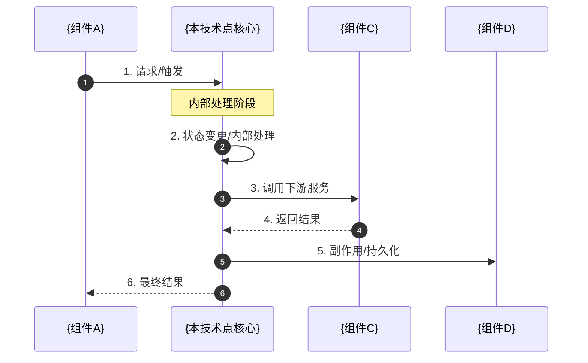

**关键交互说明**：

| 步骤 | 交互内容 | 设计意图 |
|-----|---------|---------|
| 1 | A 向核心组件发起请求 | 解耦触发与执行，支持多种触发源 |
| 2 | 核心组件内部状态流转 | 记录中间状态便于恢复和监控 |
| 3 | 调用下游组件处理 | 职责分离，核心组件协调而非包揽 |
| 4 | 同步/异步返回结果 | {选择同步或异步的原因} |
| 5 | 触发副作用 | 主流程与副作用分离，确保核心逻辑稳定 |
| 6 | 返回最终响应 | 统一输出格式，便于上层处理 |

---

## 3. 核心组件详细分析

对每个核心组件进行深入剖析，包括内部状态、算法逻辑和数据流。

### 3.1 {核心组件A} 内部结构

#### 职责定位

一句话说明该组件在本技术点中的核心职责。

#### 状态机图

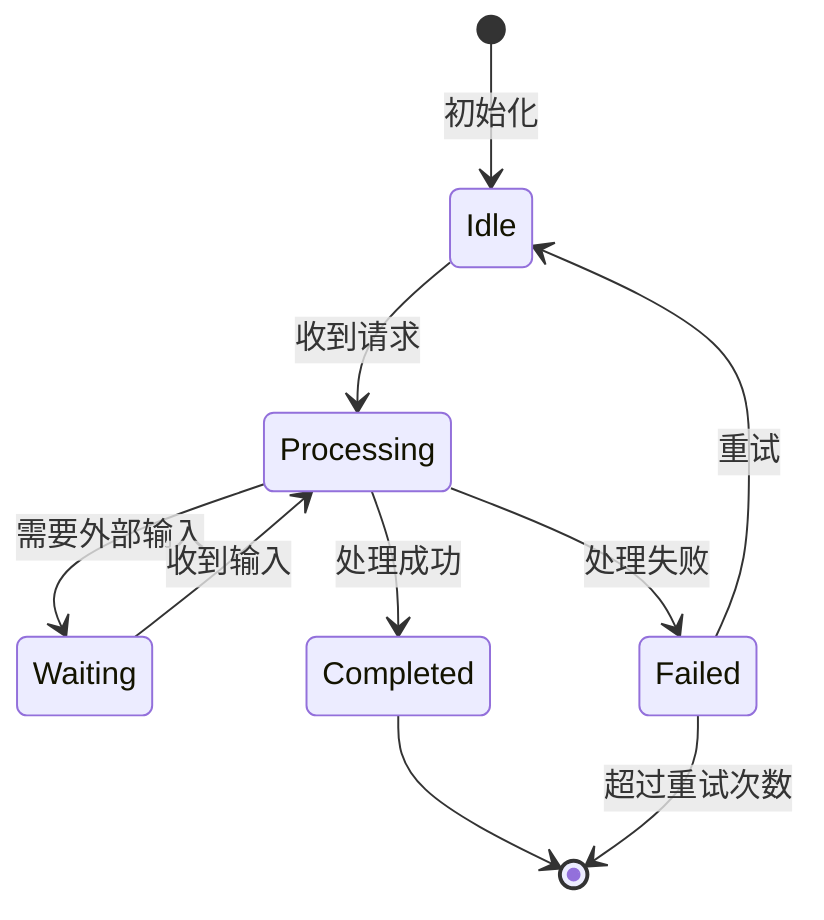

**状态说明**：

| 状态 | 说明 | 进入条件 | 退出条件 |
|-----|------|---------|---------|
| Idle | 空闲等待 | 初始化完成或处理结束 | 收到新请求 |
| Processing | 处理中 | 收到请求并开始处理 | 处理完成/失败/需要等待 |
| Waiting | 等待外部输入 | 需要额外数据才能继续 | 收到所需输入 |
| Completed | 完成 | 处理成功 | 自动返回 Idle |
| Failed | 失败 | 处理出错 | 重试或终止 |

#### 内部数据流

```text
┌─────────────────────────────────────────────────────────────┐
│  输入层                                                      │
│  ├── 原始输入 ──► 验证器 ──► 结构化数据                       │
│  └── 元数据   ──► 解析器 ──► 上下文对象                       │
└──────────────────────────┬──────────────────────────────────┘
                           ▼
┌─────────────────────────────────────────────────────────────┐
│  处理层                                                      │
│  ├── 主处理器: 核心算法逻辑                                   │
│  │   └── 子步骤1 ──► 子步骤2 ──► 子步骤3                     │
│  ├── 辅助处理器: 异常分支处理                                 │
│  │   └── 错误识别 ──► 恢复策略                                │
│  └── 协调器: 状态同步与资源管理                               │
└──────────────────────────┬──────────────────────────────────┘
                           ▼
┌─────────────────────────────────────────────────────────────┐
│  输出层                                                      │
│  ├── 结果格式化                                              │
│  ├── 副作用执行（日志、通知等）                                │
│  └── 事件通知                                                │
└─────────────────────────────────────────────────────────────┘
```

#### 关键算法逻辑

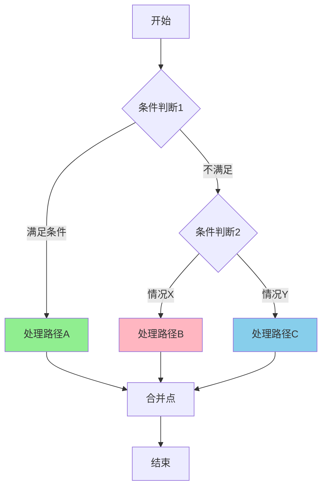

**算法要点**：

1. **分支选择逻辑**：{说明为什么这样分流}
2. **路径A 处理**：{关键操作及优化点}
3. **路径B/C 处理**：{异常情况或特殊场景}

#### 关键接口

| 接口 | 输入 | 输出 | 说明 | 代码位置 |
|-----|------|------|------|---------|
| `init()` | 配置对象 | 初始化状态 | 组件初始化 | `{file}:{line}` |
| `process()` | 请求数据 | 处理结果 | 核心处理方法 | `{file}:{line}` |
| `cleanup()` | - | 清理状态 | 资源释放 | `{file}:{line}` |

---

### 3.2 {核心组件B} 内部结构

（同 3.1 结构，针对第二个核心组件进行分析）

---

### 3.3 组件间协作时序

展示多个组件如何协作完成一个复杂操作。

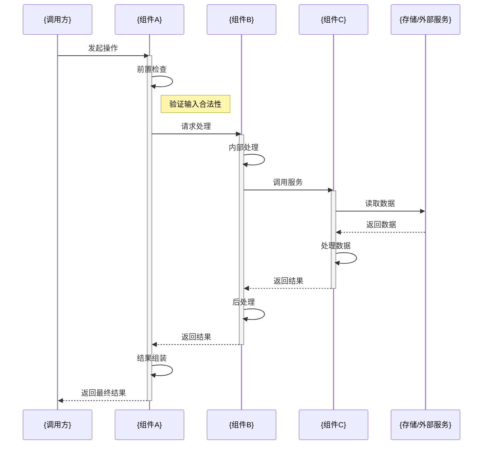

**协作要点**：

1. **调用方与组件A**：{说明调用关系和接口契约}
2. **组件A与B**：{说明数据传递格式和处理边界}
3. **组件C与外部服务**：{说明异步/同步策略、超时处理}

---

### 3.4 关键数据路径

#### 主路径（正常流程）

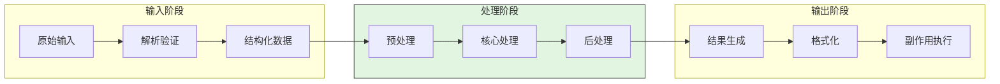

#### 异常路径（错误恢复）

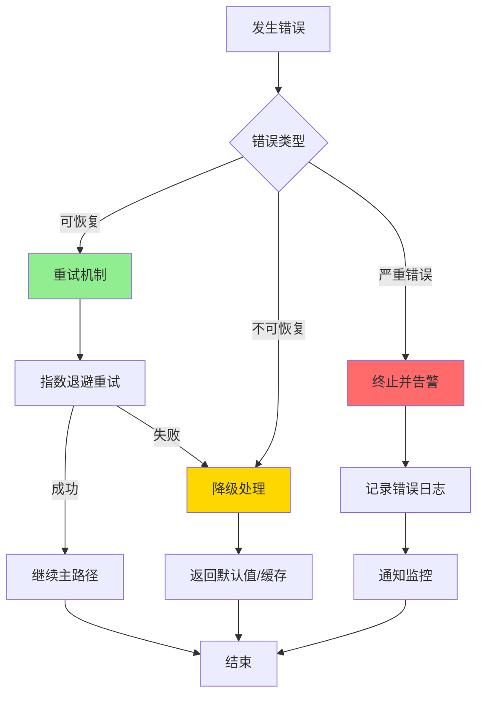

#### 优化路径（缓存/短路）

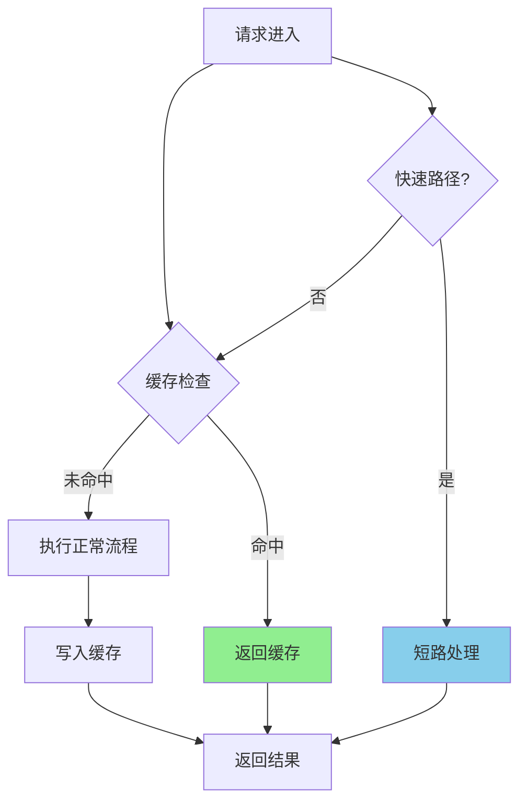

---

## 4. 端到端数据流转

### 4.1 正常流程（详细版）

展示数据如何从输入到输出的完整变换过程。

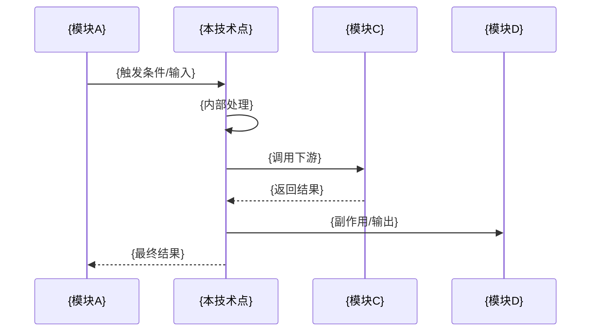

**数据变换详情**：

| 阶段 | 输入 | 处理 | 输出 | 代码位置 |
|-----|------|------|------|---------|
| 接收 | {input_type} | {validation_logic} | {validated_data} | `{file}:{line}` |
| 处理 | {validated_data} | {core_logic} | {processed_result} | `{file}:{line}` |
| 输出 | {processed_result} | {formatting} | {final_output} | `{file}:{line}` |

### 4.2 数据流向图

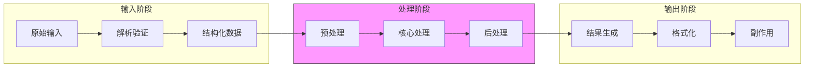

### 4.3 异常/边界流程

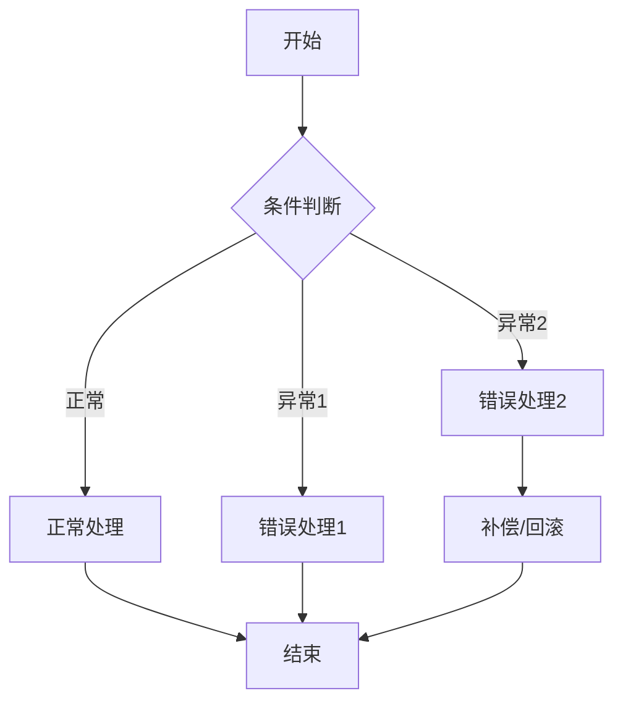

---

## 5. 关键代码实现

### 5.1 核心数据结构

```language
// {文件路径}:{行号}
{关键结构定义}
```

**字段说明**：
| 字段 | 类型 | 用途 |
|-----|------|------|
| `{field1}` | `{type1}` | {purpose1} |
| `{field2}` | `{type2}` | {purpose2} |

### 5.2 主链路代码

```language
// {文件路径}:{起始行}-{结束行}
{核心方法实现（20-40行）}
```

**代码要点**（不要逐行解释，说明关键设计）：
1. **{设计点1}**：{说明为什么这样设计}
2. **{设计点2}**：{说明为什么这样设计}
3. **{设计点3}**：{说明为什么这样设计}

### 5.3 关键调用链

```text
{entry_method}()          [{entry_file}:{line}]
  -> {method2}()          [{file2}:{line}]
    -> {method3}()        [{file3}:{line}]
      -> {core_method}()  [{core_file}:{line}]
        - {关键操作1}
        - {关键操作2}
        - {关键操作3}
```

---

## 6. 设计意图与 Trade-off

### 6.1 {Project} 的选择

| 维度 | {Project} 的选择 | 替代方案 | 取舍分析 |
|-----|-----------------|---------|---------|
| {维度1} | {choice1} | {alternative1} | {tradeoff1} |
| {维度2} | {choice2} | {alternative2} | {tradeoff2} |
| {维度3} | {choice3} | {alternative3} | {tradeoff3} |

### 6.2 为什么这样设计？

**核心问题**：{design_question}

**{Project} 的解决方案**：
- 代码依据：`{file}:{line}`
- 设计意图：{intent_explanation}
- 带来的好处：
  - {benefit1}
  - {benefit2}
- 付出的代价：
  - {cost1}
  - {cost2}

### 6.3 与其他项目的对比

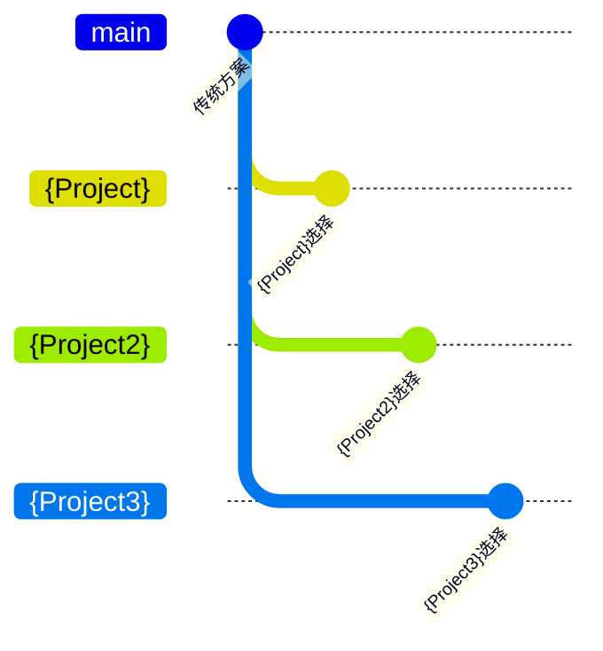

| 项目 | 核心差异 | 适用场景 |
|-----|---------|---------|
| {Project} | {difference1} | {scenario1} |
| {Project2} | {difference2} | {scenario2} |
| {Project3} | {difference3} | {scenario3} |

---

## 7. 边界情况与错误处理

### 7.1 终止条件

| 终止原因 | 触发条件 | 代码位置 |
|---------|---------|---------|
| {reason1} | {condition1} | `{file1}:{line1}` |
| {reason2} | {condition2} | `{file2}:{line2}` |
| {reason3} | {condition3} | `{file3}:{line3}` |

### 7.2 超时/资源限制

```language
// {文件路径}:{行号}
{资源限制相关代码}
```

### 7.3 错误恢复策略

| 错误类型 | 处理策略 | 代码位置 |
|---------|---------|---------|
| {error1} | {strategy1} | `{file1}:{line1}` |
| {error2} | {strategy2} | `{file2}:{line2}` |

---

## 8. 关键代码索引

| 功能 | 文件 | 行号 | 说明 |
|-----|------|------|------|
| 入口 | `{entry_file}` | {line} | {description} |
| 核心 | `{core_file}` | {line} | {description} |
| 配置 | `{config_file}` | {line} | {description} |
| 测试 | `{test_file}` | {line} | {description} |

---

## 9. 延伸阅读

- 前置知识：`{prereq_doc}`
- 相关机制：`{related_doc1}`、`{related_doc2}`
- 深度分析：`{deep_dive_doc}`

---

*✅ Verified: 基于 {project}/{file}:{line} 等源码分析*
*基于版本：{version} | 最后更新：{date}*
```

---

## 使用示例：填写 Agent Loop 模板

### TL;DR 示例

```markdown
## TL;DR

一句话定义：Agent Loop 是 Code Agent 的控制核心，让 LLM 从"一次性回答"变成"多轮执行"。

Kimi CLI 的核心取舍：**命令式 while 循环 + Checkpoint 回滚**
（对比 Gemini CLI 的递归 continuation、Codex 的 Actor 消息驱动）
```

### 2.1 整体架构示例（Agent Loop）

```text
┌─────────────────────────────────────────────────────────────┐
│ CLI 入口 / Session Runtime                                   │
│ src/kimi_cli/cli/__init__.py:457                             │
└───────────────────────┬─────────────────────────────────────┘
                        │ 用户输入
                        ▼
┌─────────────────────────────────────────────────────────────┐
│ ▓▓▓ Agent Loop ▓▓▓                                          │
│ src/kimi_cli/soul/kimisoul.py                                │
│ - run()      : 单次 Turn 入口                               │
│ - _turn()    : Checkpoint + 用户消息处理                     │
│ - _agent_loop(): 核心循环（step 计数、compaction）           │
│ - _step()    : 单次 LLM 调用 + 工具执行                      │
└───────────────────────┬─────────────────────────────────────┘
                        │
        ┌───────────────┼───────────────┐
        ▼               ▼               ▼
┌──────────────┐ ┌──────────────┐ ┌──────────────┐
│ LLM API      │ │ Tool System  │ │ Context      │
│ kosong       │ │ 工具执行     │ │ 状态管理     │
└──────────────┘ └──────────────┘ └──────────────┘
```

### 5.2 主链路代码示例（对应第 5 节）

```python
# src/kimi_cli/soul/kimisoul.py:302-382
async def _agent_loop(self, context: Context) -> None:
    """核心 Agent 循环"""
    step_count = 0
    while True:
        # 1. 检查 step 上限
        if step_count >= self.config.max_steps_per_turn:
            raise MaxStepsExceeded()

        # 2. 必要时触发 context compaction
        if context.token_count > self.config.compact_threshold:
            await self._compact_context(context)

        # 3. 执行单步
        step_result = await self._step(context)
        step_count += 1

        # 4. 检查是否完成
        if not step_result.has_tool_calls:
            break
```

**代码要点**：
1. **双层循环设计**：外层 `_turn` 管对话周期，内层 `_agent_loop` 管单次任务
2. **显式 step 计数**：防止无限循环，可配置上限
3. **compaction 前置检查**：在调用 LLM 前压缩上下文，避免 token 超限

### 6.1 Trade-off 示例（对应第 6 节）

| 维度 | Kimi CLI 的选择 | 替代方案 | 取舍分析 |
|-----|----------------|---------|---------|
| 循环结构 | while 迭代 | Gemini 的递归 continuation | 简单直观易于调试，但状态管理需手动处理 |
| 状态回滚 | Checkpoint 文件 | 无回滚（Codex）/ 内存快照 | 支持对话回滚，但文件副作用不自动回滚 |
| 并发执行 | 并发派发、顺序收集 | 完全并行 | 工具触发可以并发，但结果按序注入保持确定性 |

---

## 模板设计原则

### 1. 结构固定，内容可变
- 8 个章节顺序固定，便于读者快速定位
- 每个章节内部根据技术点灵活调整

### 2. 可视化优先
- 第 2 节必须包含 ASCII 架构图
- 第 2.3 节必须包含组件交互时序图
- 第 3 节必须包含核心组件的状态机/内部数据流图
- 第 4 节必须包含端到端数据流图
- 第 6.3 节建议包含对比图

### 3. 代码依据可信
- 每个关键声明必须带代码位置（文件:行号）
- 代码片段控制在 40 行以内
- 强调设计意图而非逐行解释

### 4. 对比视角
- 第 6.3 节必须与其他项目对比
- 说明为什么选择 A 而不是 B

---

## 图表类型选择指南

不同图表适用于展示不同类型的信息，根据内容选择合适的图表类型：

| 图表类型 | 适合展示 | 示例场景 | 模板位置 |
|---------|---------|---------|---------|
| **ASCII 架构图** | 系统层次结构、模块关系、复杂分支 | 展示技术点在系统中的位置、主循环分支 | 第 2.1 节 |
| **Mermaid Sequence** | 时序关系、组件交互、异步流程 | 组件间调用顺序、工具调用时序 | 第 2.3 节、第 3.3 节 |
| **Mermaid State Diagram** | 状态机、生命周期、转换条件 | 组件内部状态流转、连接状态 | 第 3.1/3.2 节 |
| **Mermaid Flowchart** | 状态流转、决策分支、并行处理 | 异常处理分支、数据变换流程 | 第 3.1/3.2 节、第 4.3 节 |
| **Mermaid Graph** | 架构关系、依赖关系、层次结构 | 模块依赖、调用关系 | 第 4.2 节 |
| **ASCII 数据流图** | 分层数据处理、流水线 | 组件内部数据分层处理 | 第 3.1/3.2 节 |
| **表格** | 对比分析、参数说明、索引清单 | 配置项对比、代码位置索引 | 各节说明 |

### 图表绘制建议

1. **先画架构图，再画流程图**：从宏观到微观
2. **颜色标注重点**：使用 Mermaid 的 `style` 语法高亮关键路径
3. **保持简洁**：一张图表达一个核心概念，复杂逻辑拆分为多张图
4. **图文结合**：图表后紧跟简短文字说明，解释关键设计决策

---

## 验证清单

使用该模板产出的文档应满足：

- [ ] TL;DR 能在一句话说明该技术点是什么
- [ ] 第 1 节能说明"为什么需要这个机制"
- [ ] 第 2 节包含 ASCII 架构图展示该技术点在系统中的位置
- [ ] 第 2.3 节包含组件交互时序图
- [ ] 第 3 节有核心组件详细分析（状态机、数据流、算法逻辑）
- [ ] 第 3.3 节包含组件间协作时序图
- [ ] 第 4 节包含端到端数据流图（正常流程+异常流程）
- [ ] 每个关键代码声明都有文件路径和行号
- [ ] 解释设计意图而非逐行注释代码
- [ ] 第 6 节有与其他项目的对比分析
- [ ] 第 7 节列出了终止条件和错误处理
- [ ] 第 8 节有完整的关键代码索引表

---

## 应用该模板的技术点示例

| 技术点 | 核心问题 | 主要对比维度 |
|-------|---------|-------------|
| **Agent Loop** | 如何驱动多轮 LLM 调用 | while/递归/Actor/状态机 |
| **Checkpoint** | 如何保存和恢复对话状态 | 文件/内存/数据库 |
| **Tool System** | 如何定义和执行工具 | YAML/代码/Zod Schema |
| **Context Compaction** | 如何处理 token 超限 | 摘要/截断/分层 |
| **MCP Integration** | 如何集成外部工具 | 协议实现差异 |
| **Safety Control** | 如何防止危险操作 | 沙箱/审批/静态分析 |

---

*模板版本：v2.0 | 适用于：docs/{project}/{编号}-{project}-{技术点}.md*
