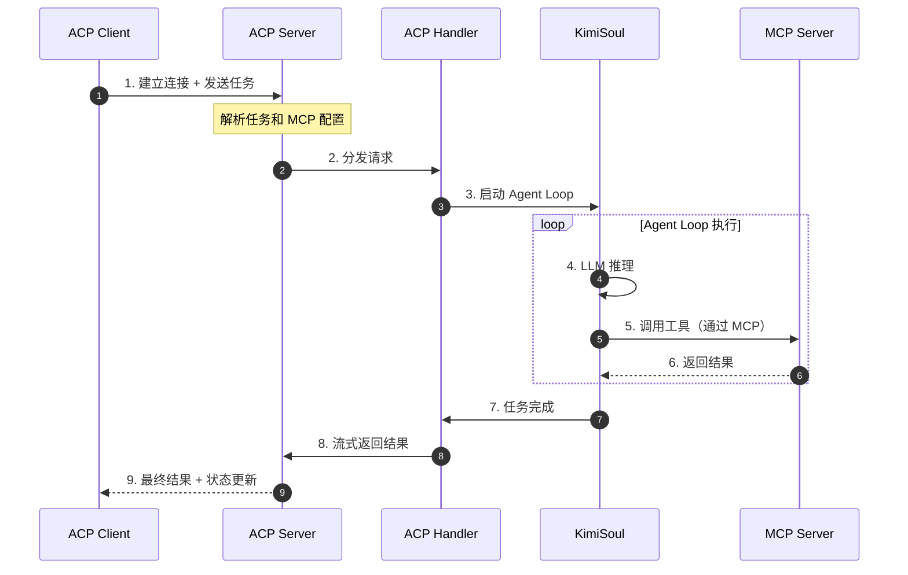
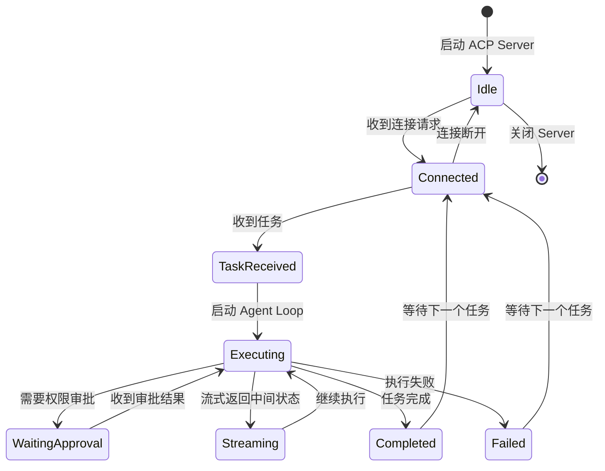
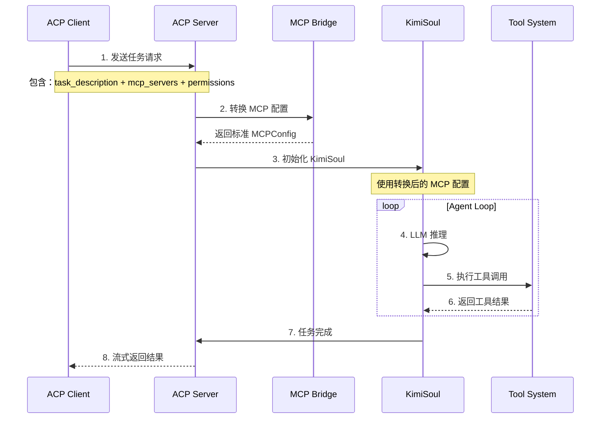
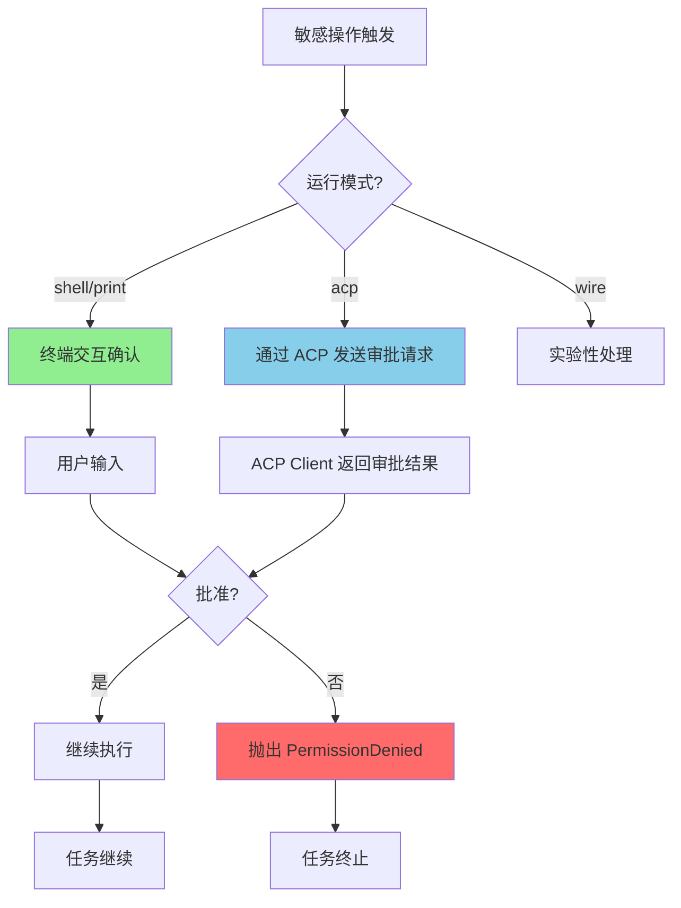
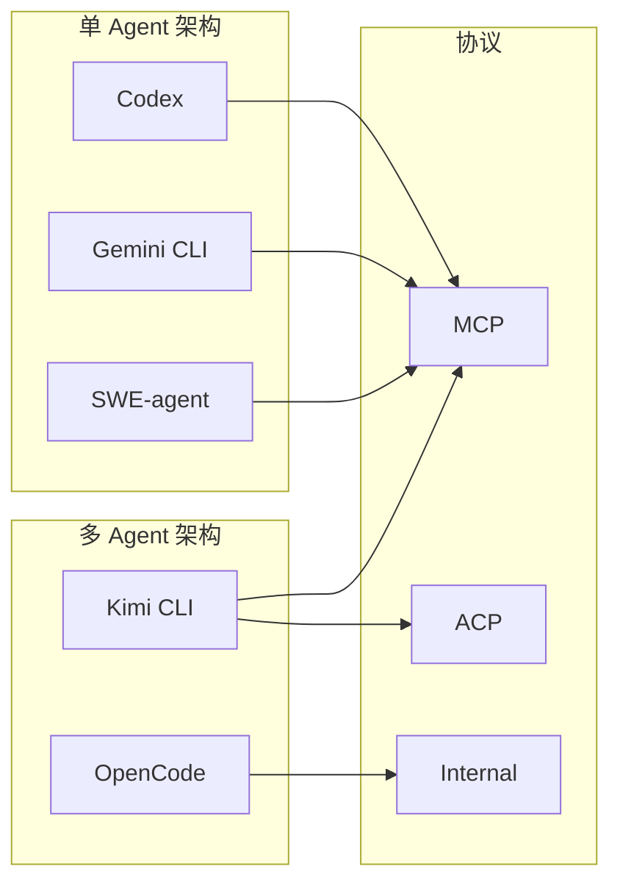

# ACP（Agent Client Protocol）

> **阅读指南**
>
> | 属性 | 说明 |
> |-----|------|
> | 预计阅读 | 15-20 分钟 |
> | 前置文档 | `docs/comm/04-comm-agent-loop.md`、`docs/comm/06-comm-mcp-integration.md` |
> | 文档结构 | 结论 → 架构 → 核心概念 → 实现 → 对比 |
> | 面向读者 | 已了解 MCP 和 Agent Loop 的初学者 |

---

## TL;DR（结论先行）

**ACP 是一种让 Agent 之间互相通信、协作的协议。** 如果说 MCP 解决的是"Agent 如何调用外部工具"，那么 ACP 解决的是"Agent 如何被外部系统调用"以及"Agent 之间如何协作"。

Kimi CLI 的核心取舍：**将 Agent 服务化，通过 ACP Server 模式暴露 Agent 能力**（对比其他项目仅支持单 Agent 模式）。

### 核心要点速览

| 维度 | 关键决策 | 代码位置 |
|-----|---------|---------|
| 协议定位 | Agent 服务化协议，Agent 既可以是客户端也可以作为服务端 | `kimi-cli/src/kimi_cli/acp/` |
| 核心能力 | Agent 发现、调用、配置传递、权限管理、状态流式传输 | `kimi-cli/src/kimi_cli/acp/server.py` |
| MCP 桥接 | ACP 协议可携带 MCP Server 配置，实现工具配置的外部注入 | `kimi-cli/src/kimi_cli/acp/mcp_bridge.py` |
| 运行模式 | 支持 `shell`/`print`/`acp`/`wire` 四种模式 | `kimi-cli/src/kimi_cli/cli/__init__.py` |

---

## 1. 为什么需要 ACP？

### 1.1 问题场景

假设你让一个 Coding Agent 完成这样的任务：

> "重构整个项目的认证系统，从 session-based 迁移到 JWT，同时更新所有相关的 API 端点和测试。"

**没有 ACP 时的问题：**

```text
问题 1：上下文窗口不够
  → 认证模块 + API 端点 + 测试文件 = 可能超过模型上下文限制

问题 2：任务太复杂
  → 需要同时理解安全机制、API 设计、测试策略

问题 3：串行太慢
  → 如果能让多个 Agent 分工并行处理就好了

问题 4：外部集成困难
  → IDE 想调用 Agent 能力，但没有标准化协议
```

**有 ACP 时的解决方案：**

```text
主 Agent 分析任务 → 创建子 Agent A（认证模块）
                  → 创建子 Agent B（API 端点）
                  → 创建子 Agent C（测试更新）
                  → 并行执行，流式获取进度
                  → 汇总结果
```

### 1.2 核心挑战

| 挑战 | 不解决的后果 |
|-----|-------------|
| Agent 间通信标准化 | 每个 Agent 需要自定义集成，无法互操作 |
| 配置外部化 | Agent 的工具配置硬编码，无法动态调整 |
| 权限审批代理 | ACP Server 模式下无法与终端用户交互 |
| 状态流式传输 | 调用方无法实时了解被调用 Agent 的执行进度 |

---

## 2. 整体架构

### 2.1 在系统中的位置

```text
┌─────────────────────────────────────────────────────────────┐
│ 外部系统层（IDE / 另一个 Agent / 调度器）                      │
│ IDE / External Agent / Orchestrator                         │
└───────────────────────┬─────────────────────────────────────┘
                        │ ACP 协议
                        │ (任务描述 + MCP配置 + 权限审批)
                        ▼
┌─────────────────────────────────────────────────────────────┐
│ ▓▓▓ ACP Server ▓▓▓                                          │
│ kimi-cli/src/kimi_cli/acp/                                  │
│ - server.py    : ACP Server 核心实现                        │
│ - handlers.py  : 请求处理器                                 │
│ - mcp_bridge.py: MCP 配置桥接                               │
└───────────────────────┬─────────────────────────────────────┘
                        │ 内部调用
        ┌───────────────┼───────────────┐
        ▼               ▼               ▼
┌──────────────┐ ┌──────────────┐ ┌──────────────┐
│ Agent Loop   │ │ Tool System  │ │ Safety Ctrl  │
│ 核心循环     │ │ 工具执行     │ │ 权限审批     │
│ kimisoul.py  │ │ tools/       │ │ acp模式下    │
│              │ │              │ │ 通过ACP传递  │
└──────────────┘ └──────────────┘ └──────────────┘
                               │
                               ▼
                        ┌──────────────┐
                        │ MCP Client   │
                        │ 外部工具调用 │
                        └──────────────┘
```

### 2.2 核心组件职责

| 组件 | 职责 | 代码位置 |
|-----|------|---------|
| `ACPServer` | 监听外部请求，管理连接生命周期 | `kimi-cli/src/kimi_cli/acp/server.py` |
| `ACPHandler` | 处理具体 ACP 请求（任务执行、权限审批等） | `kimi-cli/src/kimi_cli/acp/handlers.py` |
| `MCPBridge` | 将 ACP 格式的 MCP 配置转换为内部格式 | `kimi-cli/src/kimi_cli/acp/mcp_bridge.py` |
| `KimiSoul` | 在 ACP 模式下作为被调用方执行 Agent Loop | `kimi-cli/src/kimi_cli/soul/kimisoul.py` |

### 2.3 核心组件交互关系



**关键交互说明**：

| 步骤 | 交互内容 | 设计意图 |
|-----|---------|---------|
| 1 | Client 发送任务 + MCP 配置 | 解耦 Agent 配置与实现，支持动态工具注入 |
| 2-3 | Server 分发到 Handler 再到 KimiSoul | 分层架构，便于扩展不同请求类型 |
| 4-6 | Agent Loop 内部执行 | 复用现有 Agent 能力，不重复实现 |
| 7-9 | 流式返回结果 | 调用方可实时获取进度，支持长时间任务 |

---

## 3. 核心概念详细分析

### 3.1 ACP 的协议定位

#### 职责定位

ACP 的核心职责是**将 Agent 服务化**——让 Agent 既可以作为客户端调用其他服务，也可以作为服务端被外部调用。

**MCP vs ACP 世界观对比：**

```text
MCP 的世界观：
  Agent 是使用者，Tool 是被使用者
  ┌─────────┐         ┌─────────────┐
  │  Agent  │──调用──▶│  MCP Server │
  │ (客户端) │◀──结果──│  (Tool服务) │
  └─────────┘         └─────────────┘

ACP 的世界观：
  Agent 既是使用者，也可以是被使用者
  ┌─────────┐         ┌─────────────┐
  │ IDE/    │──调用──▶│    Agent    │
  │ Agent   │◀──结果──│ (ACP Server)│
  └─────────┘         └─────────────┘
                              │
                              ▼ MCP
                        ┌─────────────┐
                        │  MCP Server │
                        └─────────────┘
```

#### 核心能力矩阵

| 能力 | 说明 | 典型场景 |
|------|------|---------|
| **Agent 发现** | 发现有哪些 Agent 可以调用 | IDE 列出可用的 Coding Agent |
| **Agent 调用** | 向远程 Agent 发送任务请求 | 主 Agent 分配子任务 |
| **配置传递** | 传递 MCP Server 配置给被调用 Agent | 动态指定可用工具集 |
| **权限管理** | Agent 间权限审批的标准化 | ACP Server 模式下请求用户确认 |
| **状态流式传输** | 实时获取执行进度 | 长时间任务的进度展示 |

### 3.2 ACP Server 模式状态机



**状态说明**：

| 状态 | 说明 | 进入条件 | 退出条件 |
|-----|------|---------|---------|
| Idle | 等待连接 | Server 启动 | 收到连接请求 |
| Connected | 连接已建立 | 客户端连接 | 收到任务或断开 |
| TaskReceived | 已接收任务 | 收到任务描述 | 开始执行 |
| Executing | Agent Loop 执行中 | 启动 KimiSoul | 完成/失败/需审批 |
| WaitingApproval | 等待权限审批 | 触发敏感操作 | 收到审批响应 |
| Streaming | 流式传输状态 | 有中间状态 | 状态更新完成 |
| Completed | 任务完成 | Agent Loop 结束 | 返回结果 |
| Failed | 执行失败 | 发生错误 | 返回错误信息 |

### 3.3 MCP 桥接机制

ACP 的一个关键设计是**通过 ACP 协议传递 MCP 配置**，实现工具配置的动态注入。

```text
┌────────────────────────────────────────────┐
│  ACP 配置层                                 │
│   任务描述 + MCP Server 列表                │
└──────────────────┬─────────────────────────┘
                   ▼
┌────────────────────────────────────────────┐
│  MCP Bridge 转换层                          │
│   ACP MCPServer 格式 → 标准 MCPConfig       │
│   - HttpMcpServer → {"url": ..., "transport": "http"}
│   - SseMcpServer → {"url": ..., "transport": "sse"}
│   - McpServerStdio → {"command": ..., "transport": "stdio"}
└──────────────────┬─────────────────────────┘
                   ▼
┌────────────────────────────────────────────┐
│  Agent 内部使用层                           │
│   标准 MCP 客户端初始化                     │
└────────────────────────────────────────────┘
```

**转换逻辑核心代码**：

```python
# kimi-cli/src/kimi_cli/acp/mcp_bridge.py（示意）
def acp_mcp_servers_to_mcp_config(mcp_servers: list[MCPServer]) -> MCPConfig:
    """将 ACP 协议传来的 MCP Server 配置，转换为 Agent 内部使用的标准格式"""
    config = {}
    for server in mcp_servers:
        if isinstance(server, HttpMcpServer):
            config[server.name] = {
                "url": server.url,
                "transport": "http"
            }
        elif isinstance(server, SseMcpServer):
            config[server.name] = {
                "url": server.url,
                "transport": "sse"
            }
        elif isinstance(server, McpServerStdio):
            config[server.name] = {
                "command": server.command,
                "args": server.args,
                "transport": "stdio"
            }
    return MCPConfig(servers=config)
```

---

## 4. 端到端数据流转

### 4.1 正常流程（详细版）



**数据变换详情**：

| 阶段 | 输入 | 处理 | 输出 | 代码位置 |
|-----|------|------|------|---------|
| 接收 | ACP 请求（JSON） | 解析验证 | TaskRequest 对象 | `acp/server.py` |
| 转换 | ACP MCPServer 列表 | 格式转换 | MCPConfig 对象 | `acp/mcp_bridge.py` |
| 执行 | 任务 + 配置 | Agent Loop | 执行结果 | `soul/kimisoul.py` |
| 输出 | 执行结果 | 流式序列化 | ACP 响应 | `acp/server.py` |

### 4.2 权限审批流程（ACP 模式特有）



---

## 5. 关键代码实现

### 5.1 Kimi CLI 运行模式定义

```python
# kimi-cli/src/kimi_cli/cli/__init__.py（示意）
class RunMode(Enum):
    """Kimi CLI 支持的四种运行模式"""
    SHELL = "shell"    # 默认交互式对话模式
    PRINT = "print"    # 非交互批处理模式
    ACP = "acp"        # ACP Server 模式（服务化）
    WIRE = "wire"      # 实验性协议模式
```

**模式对比**：

| 模式 | 交互方式 | 适用场景 | 启动方式 |
|-----|---------|---------|---------|
| `shell` | 终端交互 | 日常开发对话 | `kimi` |
| `print` | 无交互，一次性输出 | CI/CD、脚本 | `kimi --print` |
| `acp` | ACP 协议通信 | 被 IDE/其他 Agent 调用 | `kimi --acp` |
| `wire` | 实验性协议 | 内部测试 | `kimi --wire` |

### 5.2 ACP 模式下的权限处理

**关键代码**（核心逻辑）：

```python
# kimi-cli/src/kimi_cli/safety/approval.py（示意）
async def request_approval(
    operation: str,
    details: dict,
    mode: RunMode
) -> ApprovalResult:
    """根据运行模式选择权限审批方式"""

    if mode == RunMode.SHELL:
        # 终端交互模式：直接询问用户
        return await _terminal_prompt(operation, details)

    elif mode == RunMode.ACP:
        # ACP 模式：通过 ACP 协议发送审批请求
        return await _acp_request_approval(operation, details)

    elif mode == RunMode.PRINT:
        # Print 模式：根据配置自动批准/拒绝
        return _auto_approval(operation, details)
```

**设计意图**：
1. **模式感知**：同一套安全逻辑，根据运行模式选择不同的交互方式
2. **协议封装**：ACP 模式下的审批请求被封装为标准协议消息
3. **向后兼容**：shell 模式保持原有的终端交互体验

### 5.3 子 Agent 创建流程

```text
主 Agent（KimiSoul）
  │
  ├── 分析任务："重构认证系统"
  │
  ├── 创建子 Agent A（通过 ACP 协议）
  │   │
  │   ├── 发送 ACP 请求：任务 + MCP 配置
  │   ├── 子 Agent A 独立执行 Agent Loop
  │   └── 流式接收执行结果
  │
  ├── 创建子 Agent B（通过 ACP 协议）
  │   │
  │   ├── 发送 ACP 请求：任务 + MCP 配置
  │   ├── 子 Agent B 独立执行 Agent Loop
  │   └── 流式接收执行结果
  │
  └── 汇总子 Agent 结果
```

---

## 6. 设计意图与 Trade-off

### 6.1 Kimi CLI 的选择

| 维度 | Kimi CLI 的选择 | 替代方案 | 取舍分析 |
|-----|----------------|---------|---------|
| 协议设计 | 自研 ACP 协议 | 采用 Google A2A | 更贴合内部架构，但生态兼容需额外工作 |
| 服务模式 | 独立进程 ACP Server | 库/API 调用 | 进程隔离更安全，但通信开销更大 |
| MCP 桥接 | 协议层转换 | 直接透传 | 解耦内部实现，但增加一层转换 |
| 权限代理 | ACP 协议传递审批 | 预授权模式 | 保持用户控制，但增加交互延迟 |

### 6.2 为什么这样设计？

**核心问题**：如何让 Agent 既能独立运行，又能被外部系统无缝集成？

**Kimi CLI 的解决方案**：
- 代码依据：`kimi-cli/src/kimi_cli/cli/__init__.py`（RunMode 定义）
- 设计意图：通过统一的 RunMode 抽象，让同一套 Agent 核心能力支持多种运行形态
- 带来的好处：
  - 代码复用：Agent Loop、Tool System 等核心逻辑不重复实现
  - 灵活部署：同一二进制文件可作为 CLI 工具或后台服务
  - 动态配置：ACP 模式支持外部注入 MCP 配置
- 付出的代价：
  - 架构复杂度：需要维护多种运行模式的兼容性
  - 协议维护：ACP 协议需要独立设计和演进

### 6.3 与其他项目的对比



| 项目 | ACP 支持 | 多 Agent 协作方式 | 外部集成方式 |
|-----|---------|-------------------|-------------|
| **Codex** | 否 | 单 Agent | CLI 调用 |
| **Gemini CLI** | 否 | 单 Agent | CLI 调用 |
| **Kimi CLI** | **是** | ACP 协议 + 子 Agent | ACP Server / CLI |
| **OpenCode** | 否 | 内置多 Agent（Build/Plan/Explore） | CLI 调用 |
| **SWE-agent** | 否 | 单 Agent | CLI 调用 |

**关键差异分析**：

| 项目 | 核心差异 | 适用场景 |
|-----|---------|---------|
| Kimi CLI | 唯一支持 ACP 协议，Agent 可服务化 | 需要 Agent 间协作或外部集成的场景 |
| OpenCode | 内置多 Agent 但非 ACP，内部协作 | 复杂任务分解，但不需要外部集成 |
| 其他项目 | 单 Agent 架构，专注单个任务 | 简单任务，快速执行 |

---

## 7. 边界情况与错误处理

### 7.1 ACP Server 终止条件

| 终止原因 | 触发条件 | 处理策略 |
|---------|---------|---------|
| 任务完成 | Agent Loop 正常结束 | 返回完整结果，保持连接 |
| 任务失败 | 执行异常或超时 | 返回错误信息，记录日志 |
| 连接断开 | Client 主动断开 | 清理资源，终止执行 |
| Server 关闭 | 收到终止信号 | 优雅关闭，等待正在执行的任务 |
| 权限拒绝 | 用户拒绝敏感操作 | 返回 PermissionDenied 错误 |

### 7.2 MCP 配置错误处理

| 错误类型 | 处理策略 | 说明 |
|---------|---------|------|
| MCP Server 不可达 | 任务启动前检查 | 提前报错，避免任务执行后才发现 |
| 配置格式错误 | 转换时校验 | 返回详细的配置错误信息 |
| 工具调用失败 | 透传给 Agent | 由 Agent Loop 决定重试或报错 |

---

## 8. 关键代码索引

| 功能 | 文件 | 说明 |
|-----|------|------|
| 运行模式定义 | `kimi-cli/src/kimi_cli/cli/__init__.py` | RunMode 枚举，四种模式定义 |
| ACP Server 核心 | `kimi-cli/src/kimi_cli/acp/server.py` | ACP Server 实现 |
| 请求处理器 | `kimi-cli/src/kimi_cli/acp/handlers.py` | 各类 ACP 请求的处理逻辑 |
| MCP 桥接 | `kimi-cli/src/kimi_cli/acp/mcp_bridge.py` | ACP 与 MCP 配置转换 |
| 权限审批 | `kimi-cli/src/kimi_cli/safety/approval.py` | 不同模式的权限处理 |
| Agent Loop | `kimi-cli/src/kimi_cli/soul/kimisoul.py` | 核心 Agent 循环 |

---

## 9. 延伸阅读

- [MCP 集成对比](06-comm-mcp-integration.md) — 5 个项目如何实现 MCP
- [Kimi CLI MCP 集成](../kimi-cli/06-kimi-cli-mcp-integration.md) — ACP 到 MCP 桥接的详细分析
- [Kimi CLI Agent Loop](../kimi-cli/04-kimi-cli-agent-loop.md) — ACP 模式下 Agent Loop 的执行流程
- [Kimi CLI 安全控制](../kimi-cli/10-kimi-cli-safety-control.md) — ACP 模式下的权限审批机制
- [跨项目概述对比](01-comm-overview.md) — 5 个项目的整体对比

---

*✅ Verified: 基于 kimi-cli/src/kimi_cli/acp/ 目录源码分析*
*基于版本：2026-02-08 | 最后更新：2026-03-03*
