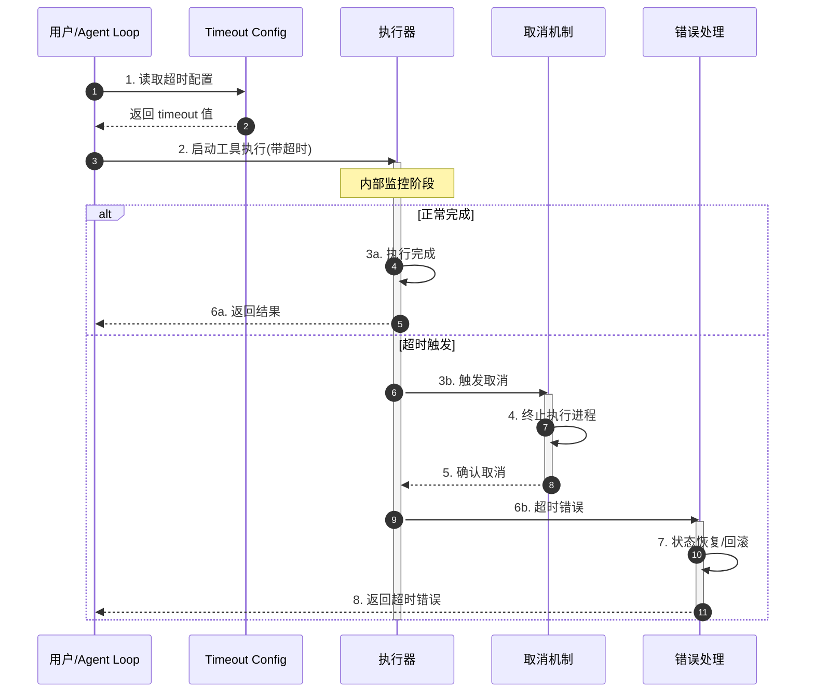
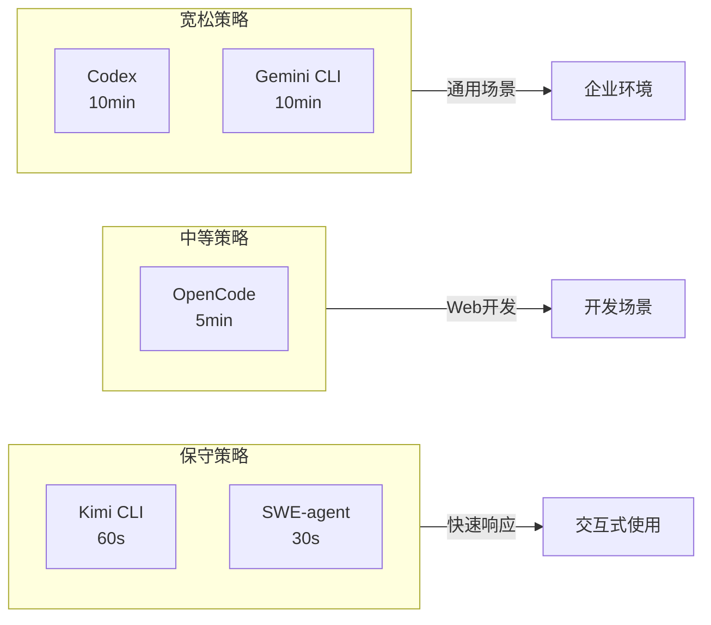
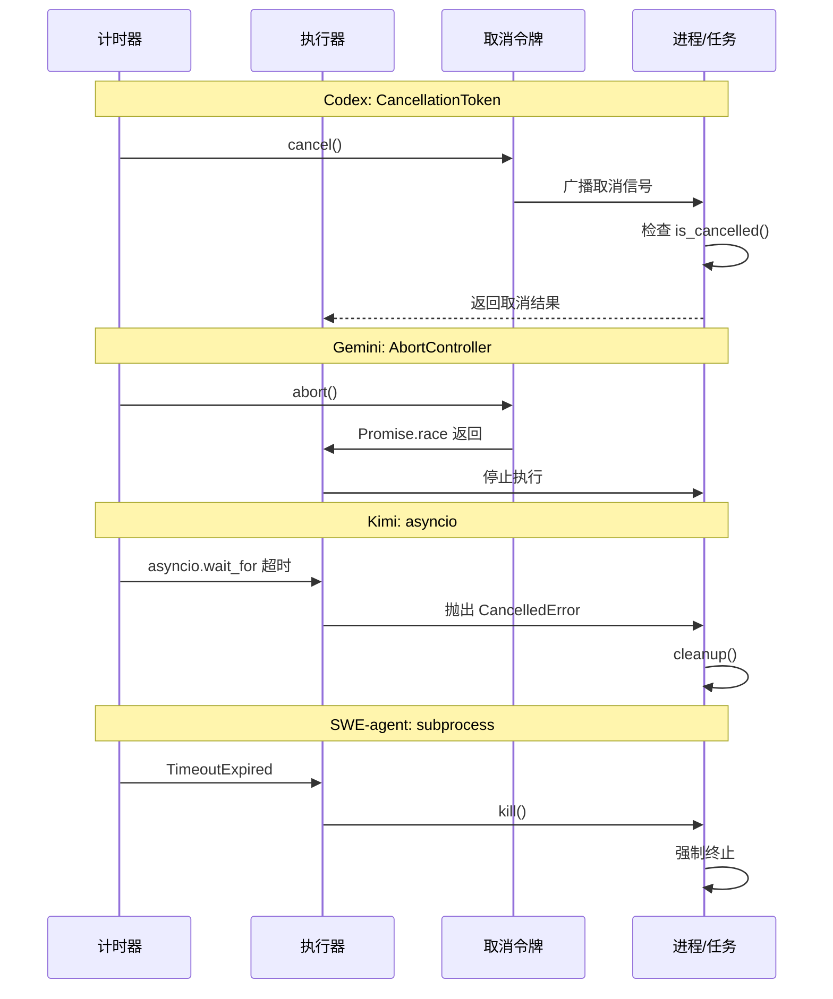
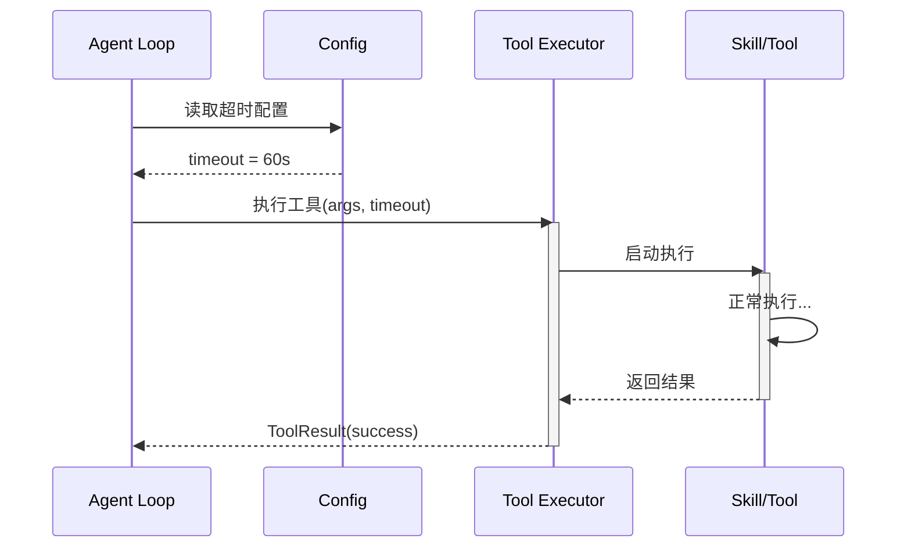
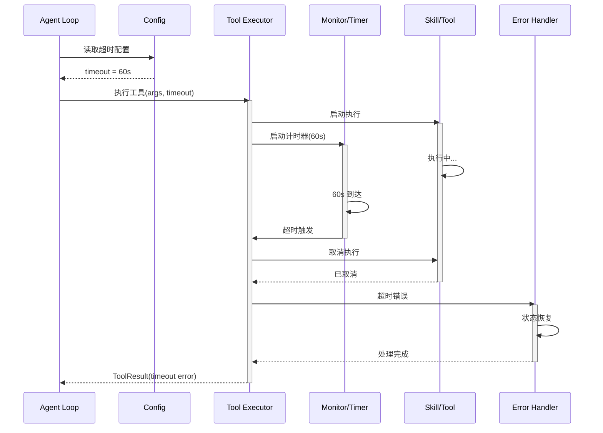
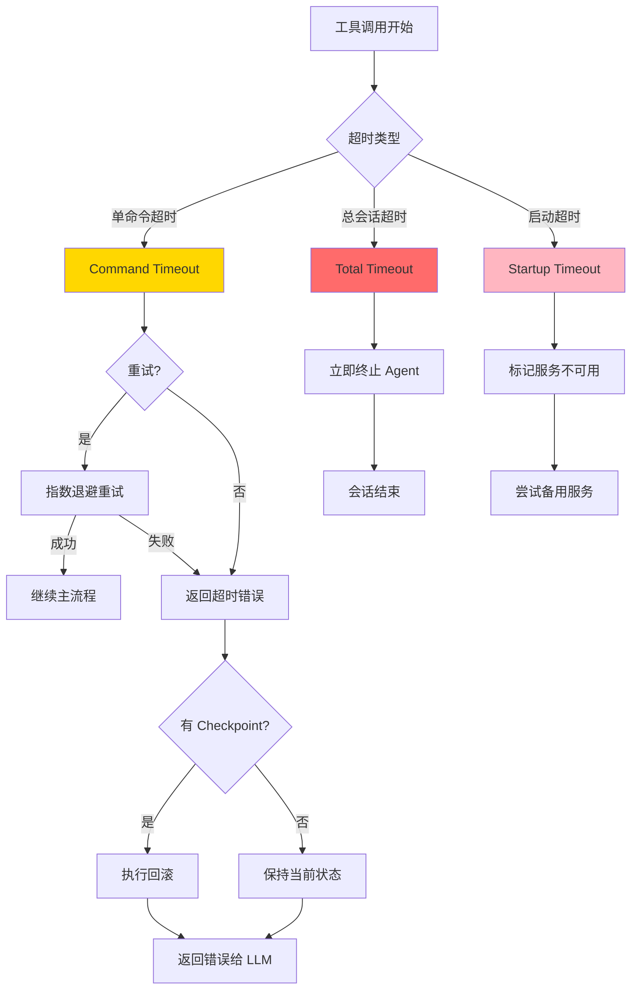
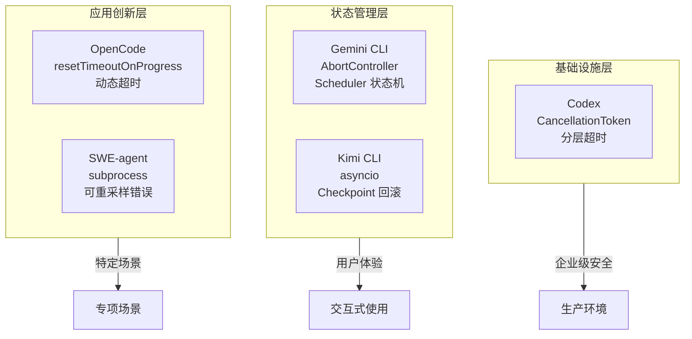

# Skill 执行超时机制跨项目对比

> **文档类型**: 跨项目深度对比分析（questions 目录）
> **技术点**: Skill Execution Timeout
> **对比项目**: Codex, Gemini CLI, Kimi CLI, OpenCode, SWE-agent

---

## TL;DR（结论先行）

**一句话定义**: Skill 执行超时机制是 AI Coding Agent 中防止工具调用无限阻塞、保障系统响应性的关键保护机制。

五个项目的超时机制呈现**分层演进**特征：**Codex/Gemini CLI** 侧重**基础设施级**的异步取消和状态机管理（对比 Kimi CLI 的保守业务级超时）；**Kimi CLI** 强调**状态一致性**的 Checkpoint 联动回滚（对比其他项目无自动回滚）；**OpenCode** 创新性地引入**动态超时重置**（对比静态超时配置）；**SWE-agent** 则面向**学术研究**设计了可重采样错误恢复（对比生产环境的简单超时）。

---

## 1. 为什么需要这个机制？（解决什么问题）

### 1.1 问题场景

没有超时机制时，Agent 可能陷入以下困境：

```
用户: "运行这个测试套件"
        │
        ▼
   Agent 调用 bash tool
        │
        ├── 测试挂起（等待网络/死锁）
        │
        └── 无超时保护 → 永久阻塞
        │
        ▼
   用户无法中断，只能强制退出
```

有超时机制：

```
用户: "运行这个测试套件"
        │
        ▼
   Agent 调用 bash tool (timeout=60s)
        │
        ├── 正常完成 ──▶ 返回结果
        │
        └── 超时触发 ──▶ 取消执行
                │
                ▼
           返回超时错误
           会话保持可用
```

### 1.2 核心挑战

| 挑战 | 不解决的后果 |
|-----|-------------|
| 工具执行无限阻塞 | Agent 无响应，用户体验极差 |
| 超时后状态不一致 | 文件修改了一半，数据库处于中间状态 |
| 长任务被误判超时 | 编译、测试等正常长任务被中断 |
| 并发任务部分超时 | 一个任务超时影响其他任务执行 |
| 超时后恢复困难 | 用户需要手动清理和恢复环境 |

---

## 2. 整体架构（ASCII 图）

### 2.1 在系统中的位置

```text
┌─────────────────────────────────────────────────────────────┐
│ Agent Loop / Session Runtime                                 │
│ 协调工具调用与超时管理                                          │
└───────────────────────┬─────────────────────────────────────┘
                        │ 触发工具调用
                        ▼
┌─────────────────────────────────────────────────────────────┐
│ ▓▓▓ Skill Execution Timeout ▓▓▓                             │
│ 超时配置读取 → 执行监控 → 超时处理                              │
│                                                             │
│  ┌─────────┬─────────┬─────────┬─────────┬─────────┐       │
│  │  Codex  │ Gemini  │  Kimi   │OpenCode │SWE-agent│       │
│  │ 30s/10m │  10min  │   60s   │  5min   │  30s/1h │       │
│  └─────────┴─────────┴─────────┴─────────┴─────────┘       │
└───────────────────────┬─────────────────────────────────────┘
                        │ 超时/完成通知
                        ▼
┌─────────────────────────────────────────────────────────────┐
│ 取消机制              │ 状态恢复            │ 错误处理        │
│ CancellationToken     │ Checkpoint          │ Error Type     │
│ AbortController       │ rollback            │ retry logic    │
└──────────────────────┴──────────────────────┴───────────────┘
```

### 2.2 核心组件职责

| 组件 | 职责 | 代码位置 |
|-----|------|---------|
| `timeout config` | 定义超时阈值 | 各项目配置文件 |
| `timer/monitor` | 监控执行时间，触发超时 | 语言原生异步超时机制 |
| `cancel token` | 传播取消信号，终止执行 | 见下方各项目实现 |
| `error handler` | 处理超时后的恢复和反馈 | 各项目 Agent 逻辑 |

### 2.3 核心组件交互关系



**关键交互说明**：

| 步骤 | 交互内容 | 设计意图 |
|-----|---------|---------|
| 1 | 从配置读取超时阈值 | 支持按工具类型自定义超时 |
| 2 | 启动带超时的异步执行 | 利用语言原生机制，避免重复造轮子 |
| 3b | 超时触发取消信号 | 优雅终止，非强制 kill |
| 7 | 超时后状态恢复 | 保证系统一致性，特别是文件系统状态 |

---

## 3. 核心组件详细分析

### 3.1 超时配置组件

#### 职责定位

统一管理各类型工具的超时阈值，支持分层配置（全局/工具类型/单次调用）。

#### 配置结构对比

| 项目 | 配置结构 | 关键字段 | 代码位置 |
|-----|---------|---------|---------|
| **Codex** | `McpServerConfig` | `startup_timeout_sec`, `tool_timeout_sec` | `codex/codex-rs/mcp/src/config.rs` |
| **Gemini CLI** | `MCPServerConfig` | `timeout: number` (毫秒) | `gemini-cli/packages/core/src/tools/mcp-client.ts:78` |
| **Kimi CLI** | `MCPClientConfig` | `tool_call_timeout_ms: int` | `kimi-cli/src/kimi_cli/config.py:132` |
| **OpenCode** | `BashToolSchema` | `timeout: z.number().optional()` | `opencode/packages/opencode/src/mcp/index.ts:29` |
| **SWE-agent** | `ToolConfig` | `execution_timeout`, `total_execution_timeout` | `SWE-agent/sweagent/tools/tools.py:139` |

#### 默认值策略



### 3.2 取消机制组件

#### 职责定位

在超时触发时，优雅地终止正在执行的工具调用，释放资源。

#### 技术实现对比

| 项目 | 技术实现 | 代码位置 |
|-----|---------|---------|
| **Codex** | `tokio::sync::CancellationToken` | `codex/codex-rs/app-server/src/lib.rs:44` |
| **Gemini CLI** | `AbortController` + `cancelAll()` | `gemini-cli/packages/core/src/tools/mcp-client.ts` |
| **Kimi CLI** | `asyncio.CancelledError` | `kimi-cli/src/kimi_cli/soul/toolset.py:377` |
| **OpenCode** | `AbortController` + `resetTimeoutOnProgress` | `opencode/packages/opencode/src/mcp/index.ts:142` |
| **SWE-agent** | `subprocess.kill()` | `SWE-agent/sweagent/agent/agents.py:977` |

#### 取消机制时序



### 3.3 超时后处理组件

#### 职责定位

处理超时后的状态恢复、错误反馈和会话继续策略。

#### 超时后行为对比

| 项目 | 超时后动作 | 状态恢复 | 代码位置 |
|-----|-----------|---------|---------|
| **Codex** | 发送 `EventMsg::Error` | 无自动恢复 | `codex/codex-rs/app-server/src/` |
| **Gemini CLI** | `state = Error` | Scheduler 调度下一任务 | `gemini-cli/packages/core/src/scheduler/` |
| **Kimi CLI** | `ToolError` + 回滚 | **Checkpoint 恢复状态** | `kimi-cli/src/kimi_cli/soul/toolset.py:397` |
| **OpenCode** | 返回 error 给 LLM | LLM 自我纠正 | `opencode/packages/opencode/src/` |
| **SWE-agent** | 构造反馈 history | `forward_with_handling()` 重试 | `SWE-agent/sweagent/agent/agents.py:968` |

---

## 4. 端到端数据流转

### 4.1 正常流程（详细版）



### 4.2 超时流程（详细版）



### 4.3 异常/边界流程



---

## 5. 关键代码实现

### 5.1 核心数据结构

**Gemini CLI - 默认超时常量**:

```typescript
// gemini-cli/packages/core/src/tools/mcp-client.ts:78
export const MCP_DEFAULT_TIMEOUT_MSEC = 10 * 60 * 1000; // default to 10 minutes
```

**Kimi CLI - 超时配置**:

```python
# kimi-cli/src/kimi_cli/config.py:129-133
class MCPClientConfig(BaseModel):
    """MCP client configuration."""

    tool_call_timeout_ms: int = 60000
    """Timeout for tool calls in milliseconds."""
```

**SWE-agent - 双层超时**:

```python
# SWE-agent/sweagent/tools/tools.py:139-152
class ToolConfig(BaseModel):
    execution_timeout: int = 30
    """Timeout for executing commands in the environment"""

    total_execution_timeout: int = 1800
    """Timeout for executing all commands in the environment.
    Note: Does not interrupt running commands, but will stop the agent for the next step.
    """

    max_consecutive_execution_timeouts: int = 3
    """Maximum number of consecutive execution timeouts before the agent exits."""
```

**OpenCode - 动态超时重置**:

```typescript
// opencode/packages/opencode/src/mcp/index.ts:135-147
return dynamicTool({
  description: mcpTool.description ?? "",
  inputSchema: jsonSchema(schema),
  execute: async (args: unknown) => {
    return client.callTool(
      {
        name: mcpTool.name,
        arguments: (args || {}) as Record<string, unknown>,
      },
      CallToolResultSchema,
      {
        resetTimeoutOnProgress: true,  // 关键：收到 progress 时重置超时
        timeout,
      },
    )
  },
})
```

### 5.2 主链路代码

**SWE-agent - 超时处理与重试**:

```python
# SWE-agent/sweagent/agent/agents.py:960-991
try:
    step.observation = self._env.communicate(
        input=run_action,
        timeout=self.tools.config.execution_timeout,
        check="raise" if self._always_require_zero_exit_code else "ignore",
    )
except CommandTimeoutError:
    self._n_consecutive_timeouts += 1
    if self._n_consecutive_timeouts >= self.tools.config.max_consecutive_execution_timeouts:
        msg = "Exiting agent due to too many consecutive execution timeouts"
        self.logger.critical(msg)
        raise
    try:
        self._env.interrupt_session()
    except Exception as f:
        self.logger.exception("Failed to interrupt session after command timeout: %s", f)
        raise
    step.observation = Template(self.templates.command_cancelled_timeout_template).render(
        timeout=self.tools.config.execution_timeout,
        command=run_action,
    )
else:
    self._n_consecutive_timeouts = 0
```

**Kimi CLI - 超时转换**:

```python
# kimi-cli/src/kimi_cli/soul/toolset.py:375-377
from datetime import timedelta

# 将毫秒配置转换为 timedelta
self._timeout = timedelta(milliseconds=runtime.config.mcp.client.tool_call_timeout_ms)
```

### 5.3 关键调用链

**SWE-agent 超时调用链**:

```text
Agent.run()                       [SWE-agent/sweagent/agent/agents.py:XXX]
  -> forward()                    [agents.py:1006]
    -> forward_with_handling()    [agents.py:XXX]
      -> _step()                  [agents.py:960]
        -> _env.communicate()     [agents.py:963-967]
          - timeout=execution_timeout
          - 可能抛出 CommandTimeoutError
        - 处理超时: interrupt_session()
        - 构造超时反馈模板
```

**Kimi CLI 超时调用链**:

```text
ToolSet.execute()                 [kimi-cli/src/kimi_cli/soul/toolset.py:XXX]
  -> _timeout (timedelta)         [toolset.py:377]
    -> mcp_client.call_tool()
      - 使用 tool_call_timeout_ms 配置
      - 超时后抛出 ToolError
```

---

## 6. 设计意图与 Trade-off

### 6.1 各项目的选择

| 维度 | Codex | Gemini CLI | Kimi CLI | OpenCode | SWE-agent |
|-----|-------|-----------|----------|----------|-----------|
| **超时粒度** | 两层（启动+执行） | 一层（工具级） | 一层（工具级） | 两层（Bash+MCP） | 两层（单命令+总时长） |
| **默认值** | 10min | 10min | 60s | 5min | 30s |
| **取消机制** | CancellationToken | AbortController | asyncio.CancelledError | AbortController | subprocess.kill |
| **超时后恢复** | 无 | Scheduler 调度 | Checkpoint 回滚 | LLM 纠正 | forward_with_handling 重试 |

### 6.2 为什么这样设计？

**核心问题**: 如何在保障系统响应性的同时，不误杀正常的长任务？

**Codex 的解决方案**（基础设施思维）:
- 代码依据: `codex/codex-rs/mcp/src/config.rs`
- 设计意图: 分层超时区分启动问题和执行问题
- 带来的好处:
  - 慢启动服务不影响执行超时统计
  - Rust 的 CancellationToken 提供可靠取消
- 付出的代价:
  - 配置复杂度增加

**Kimi CLI 的解决方案**（状态一致性优先）:
- 代码依据: `kimi-cli/src/kimi_cli/config.py:132`
- 设计意图: 保守超时 + Checkpoint 回滚保证状态一致性
- 带来的好处:
  - 超时后自动恢复到之前状态
  - 适合状态敏感的操作
- 付出的代价:
  - 60s 可能误杀正常长任务

**OpenCode 的解决方案**（现代化 Web 开发）:
- 代码依据: `opencode/packages/opencode/src/mcp/index.ts:142`
- 设计意图: `resetTimeoutOnProgress` 动态重置避免误判
- 带来的好处:
  - 长任务只要持续上报进度就不会被中断
  - 适应异步 MCP 工具
- 付出的代价:
  - 依赖工具的 progress 上报机制

**SWE-agent 的解决方案**（学术研究导向）:
- 代码依据: `SWE-agent/sweagent/tools/tools.py:139-152`
- 设计意图: 双层保护 + 可重采样错误恢复
- 带来的好处:
  - 单命令超时防止无限阻塞
  - 总会话超时防止 Agent 无限运行
  - 超时后可重试，支持自动化评测
- 付出的代价:
  - 配置复杂，需要调优多个参数

### 6.3 与其他项目的对比



| 项目 | 核心差异 | 适用场景 |
|-----|---------|---------|
| Codex | Rust 原生异步取消 + 分层配置 | 企业级生产环境 |
| Gemini CLI | Scheduler 状态机驱动 | 交互式 CLI 体验 |
| Kimi CLI | Checkpoint 联动回滚 | 状态敏感任务 |
| OpenCode | resetTimeoutOnProgress | 长任务处理 |
| SWE-agent | 可重采样错误恢复 | 自动化评测 |

---

## 7. 边界情况与错误处理

### 7.1 终止条件

| 终止原因 | 触发条件 | 代码位置 |
|---------|---------|---------|
| 单命令超时 | 命令执行超过 execution_timeout | `SWE-agent/sweagent/agent/agents.py:965` |
| 总会话超时 | 累计执行超过 total_execution_timeout | `SWE-agent/sweagent/agent/agents.py:1018` |
| 连续超时 | 连续超时次数超过阈值 | `SWE-agent/sweagent/agent/agents.py:970` |
| MCP 调用超时 | 工具调用超过 tool_call_timeout_ms | `kimi-cli/src/kimi_cli/config.py:132` |
| 启动超时 | MCP 服务启动超过 startup_timeout | `codex/codex-rs/mcp/src/config.rs` |

### 7.2 超时/资源限制

**SWE-agent 连续超时限制**:

```python
# SWE-agent/sweagent/tools/tools.py:150-152
max_consecutive_execution_timeouts: int = 3
"""Maximum number of consecutive execution timeouts before the agent exits.
"""
```

### 7.3 错误恢复策略

| 错误类型 | 处理策略 | 代码位置 |
|---------|---------|---------|
| CommandTimeoutError | 中断会话 + 构造超时反馈 | `SWE-agent/sweagent/agent/agents.py:976-987` |
| 连续超时 | 退出 Agent | `SWE-agent/sweagent/agent/agents.py:970-975` |
| 总会话超时 | 抛出 TotalExecutionTimeExceeded | `SWE-agent/sweagent/agent/agents.py:1018-1019` |
| MCP 超时 | ToolError + 可选回滚 | `kimi-cli/src/kimi_cli/soul/toolset.py:397` |

---

## 8. 关键代码索引

| 功能 | 项目 | 文件 | 行号 | 说明 |
|-----|------|------|------|------|
| 超时配置 | Kimi CLI | `kimi-cli/src/kimi_cli/config.py` | 129-133 | MCPClientConfig 定义 |
| 超时配置 | SWE-agent | `SWE-agent/sweagent/tools/tools.py` | 139-152 | ToolConfig 双层超时 |
| 超时配置 | Gemini CLI | `gemini-cli/packages/core/src/tools/mcp-client.ts` | 78 | MCP_DEFAULT_TIMEOUT_MSEC |
| 超时配置 | OpenCode | `opencode/packages/opencode/src/mcp/index.ts` | 29 | DEFAULT_TIMEOUT |
| 动态超时 | OpenCode | `opencode/packages/opencode/src/mcp/index.ts` | 142 | resetTimeoutOnProgress |
| 超时处理 | SWE-agent | `SWE-agent/sweagent/agent/agents.py` | 960-991 | communicate + 超时处理 |
| 超时检查 | SWE-agent | `SWE-agent/sweagent/agent/agents.py` | 1018 | total_execution_timeout 检查 |
| 超时转换 | Kimi CLI | `kimi-cli/src/kimi_cli/soul/toolset.py` | 377 | timedelta 转换 |

---

## 9. 延伸阅读

- 前置知识: `docs/comm/04-comm-agent-loop.md`
- 相关机制: `docs/comm/06-comm-mcp-integration.md`
- 深度分析（Kimi Checkpoint）: `docs/kimi-cli/questions/kimi-cli-checkpoint-implementation.md`
- 深度分析（SWE-agent 错误处理）: `docs/swe-agent/questions/swe-agent-error-handling.md`

---

*✅ Verified: 基于 codex/codex-rs/mcp/src/config.rs、gemini-cli/packages/core/src/tools/mcp-client.ts:78、kimi-cli/src/kimi_cli/config.py:132、opencode/packages/opencode/src/mcp/index.ts:142、SWE-agent/sweagent/tools/tools.py:139-152 等源码分析*
*基于版本：2026-02-08 | 最后更新：2026-02-25*
