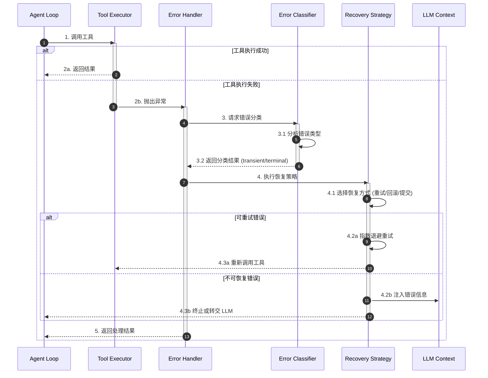
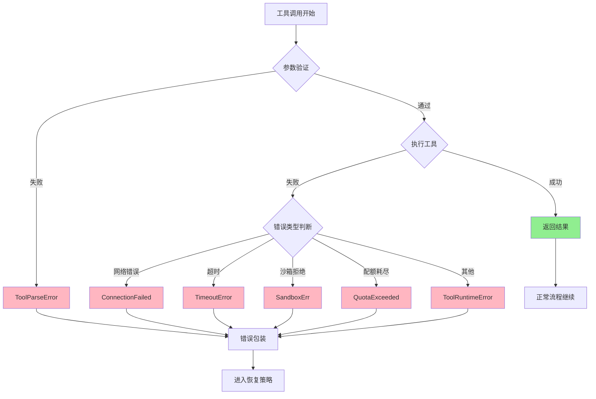
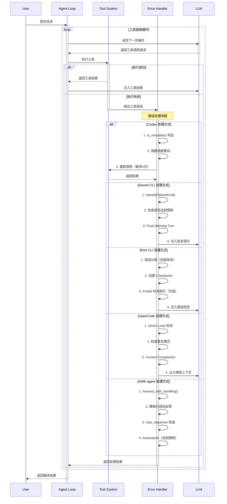
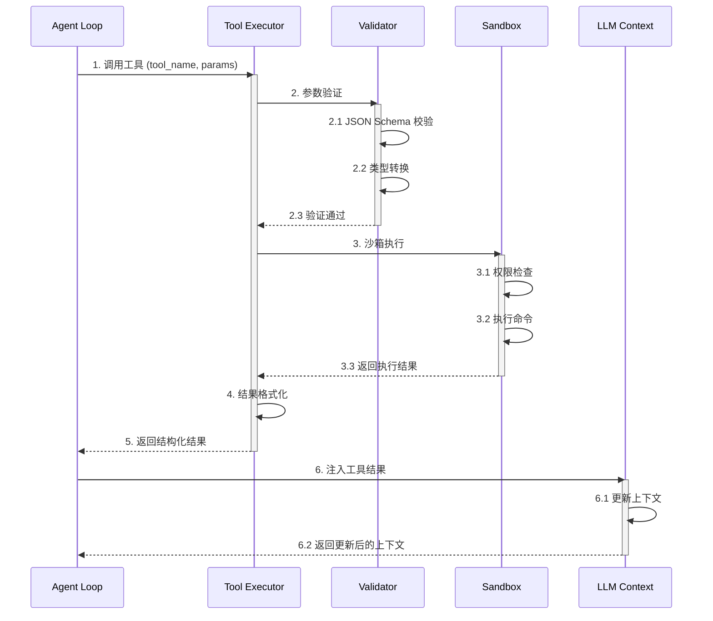
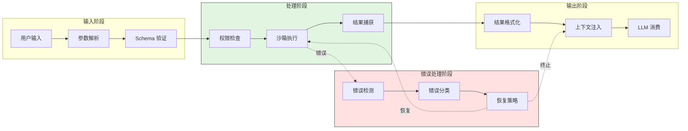
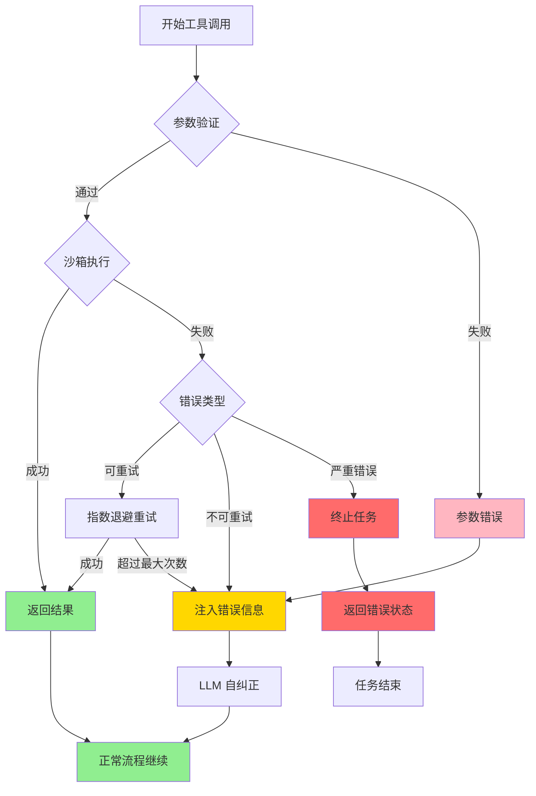
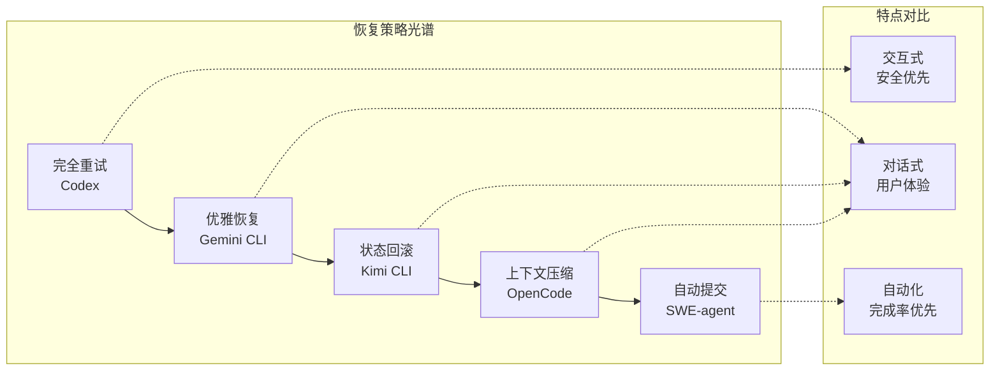

# 5 大 AI Coding Agent 工具调用错误处理机制对比分析

> **文档说明**: 本文为跨项目深度对比分析文档，对比分析 Codex、Gemini CLI、Kimi CLI、OpenCode、SWE-agent 五个项目的工具调用错误处理机制。

---

## TL;DR（结论先行）

一句话定义：工具调用错误处理是 AI Coding Agent 在执行外部工具（文件操作、命令执行、网络请求等）时，对失败场景进行检测、分类、恢复和反馈的完整机制，确保 Agent 能够从错误中恢复并继续任务或优雅终止。

5 大 AI Coding Agent 在工具调用错误处理方面的核心取舍对比：
- **Gemini CLI** 采用 **Final Warning Turn 优雅恢复**（对比 Kimi CLI 的 Checkpoint 回滚、SWE-agent 的 Autosubmit）
- **Kimi CLI** 依赖 **Checkpoint + D-Mail 时间旅行**（对比 OpenCode 的 Compaction、Codex 的降级重试）
- **SWE-agent** 使用 **Autosubmit 自动提交**（对比其他项目的手动/自动混合恢复）
- **OpenCode** 实现 **Compaction + Doom Loop 检测**（对比 Gemini CLI 的 Final Warning Turn）
- **Codex** 专注 **降级重试 + 三档审批** 安全模型（对比 SWE-agent 的纯自动化）

---

## 1. 为什么需要这个机制？（解决什么问题）

### 1.1 问题场景

没有错误处理机制的场景：
```
用户问: "帮我修复这个 bug"
  → LLM: "先查看文件" → 读取文件 → 文件不存在 → 崩溃/卡住
  → 对话终止，用户困惑
```

有错误处理机制的场景：
```
用户问: "帮我修复这个 bug"
  → LLM: "先查看文件" → 读取文件 → 文件不存在
  → 错误检测: FileNotFound → 错误分类: 可恢复
  → 恢复策略: 返回错误给 LLM
  → LLM: "文件不存在，让我创建它" → 创建文件 → 成功
```

### 1.2 核心挑战

| 挑战 | 不解决的后果 |
|-----|-------------|
| 工具执行失败无法感知 | Agent 陷入无限等待或假死状态 |
| 错误类型无法区分 | 对所有错误采用相同策略，导致过度重试或过早放弃 |
| 恢复策略缺失 | 单次失败导致整个任务终止，用户体验差 |
| 错误信息无法被 LLM 理解 | LLM 无法从错误中学习，重复犯同样错误 |
| 资源限制无边界 | Token 溢出、超时、配额耗尽导致系统崩溃 |

---

## 2. 整体架构（ASCII 图）

### 2.1 在系统中的位置

```text
┌─────────────────────────────────────────────────────────────────────────────────────┐
│ Agent Loop / Session Runtime                                                         │
│ 各项目主循环入口                                                                     │
└─────────────────────────────────┬───────────────────────────────────────────────────┘
                                  │ 工具调用请求
                                  ▼
┌─────────────────────────────────────────────────────────────────────────────────────┐
│ ▓▓▓ 工具调用错误处理机制 ▓▓▓                                                          │
│                                                                                      │
│  ┌─────────────┐    ┌─────────────┐    ┌─────────────┐    ┌─────────────┐           │
│  │  错误检测    │───▶│  错误分类    │───▶│  恢复策略    │───▶│  结果反馈    │           │
│  │  Detection  │    │Classification│    │  Recovery   │    │   Feedback   │           │
│  └─────────────┘    └─────────────┘    └─────────────┘    └─────────────┘           │
│         │                  │                  │                  │                  │
│         ▼                  ▼                  ▼                  ▼                  │
│   ┌──────────┐      ┌──────────┐      ┌──────────┐      ┌──────────┐               │
│   │参数校验  │      │可重试    │      │指数退避  │      │结构化    │               │
│   │超时检测  │      │vs 致命   │      │自动恢复  │      │错误返回  │               │
│   │沙箱拒绝  │      │          │      │用户介入  │      │日志记录  │               │
│   └──────────┘      └──────────┘      └──────────┘      └──────────┘               │
│                                                                                      │
└─────────────────────────────────┬───────────────────────────────────────────────────┘
                                  │ 恢复后重新调用或终止
                                  ▼
┌─────────────────────────────────────────────────────────────────────────────────────┐
│ LLM API              │ Tool System          │ Context Management                    │
│ 错误信息注入上下文    │ 工具执行重试         │ Token 管理/压缩                       │
└──────────────────────┴──────────────────────┴───────────────────────────────────────┘
```

### 2.2 核心组件职责

| 组件 | 职责 | 代码位置（按项目） |
|-----|------|-------------------|
| **Codex** `CodexErr` | 主错误枚举，统一错误类型定义 | `codex-rs/core/src/error.rs:1-100` |
| **Codex** `is_retryable()` | 可重试错误判定逻辑 | `codex-rs/core/src/error.rs:200-250` |
| **Gemini CLI** `ToolErrorType` | 15+ 错误类型枚举定义 | `packages/core/src/tools/tool-error.ts:1-80` |
| **Gemini CLI** `classifyFailureKind()` | 错误分类为 transient/terminal | `packages/core/src/availability/errorClassification.ts:50-100` |
| **Kimi CLI** `ToolError` | 四层错误继承体系基类 | `packages/kosong/src/kosong/tooling/error.py:1-50` |
| **Kimi CLI** `ToolReturnValue` | 工具返回结果统一包装 | `packages/kosong/src/kosong/tooling/__init__.py:100-150` |
| **OpenCode** `retryable()` | 错误可重试性判定 | `packages/opencode/src/session/retry.ts:50-100` |
| **OpenCode** `DoomLoopDetector` | 重复失败模式检测 | `packages/opencode/src/session/agent.ts:200-250` |
| **SWE-agent** `FormatError` | 格式解析错误基类 | `sweagent/exceptions.py:1-50` |
| **SWE-agent** `forward_with_handling()` | 模板化错误处理入口 | `sweagent/agent/agents.py:150-250` |

### 2.3 核心组件交互关系



**关键交互说明**：

| 步骤 | 交互内容 | 设计意图 |
|-----|---------|---------|
| 1 | Agent Loop 向工具执行器发起调用 | 解耦工具执行与错误处理逻辑 |
| 2b | 工具执行失败时统一抛出异常 | 确保所有错误都被捕获处理 |
| 3 | 错误分类器判定错误类型 | 区分可恢复(transient)与不可恢复(terminal)错误 |
| 4 | 恢复策略选择适当的处理方式 | 根据错误类型和项目策略进行恢复 |
| 4.2b | 向 LLM 上下文注入错误信息 | 让 LLM 能够从错误中学习并调整策略 |

---

## 3. 核心组件详细分析

### 3.1 错误检测层内部结构

#### 职责定位

错误检测层负责捕获工具执行过程中的所有异常，包括参数验证失败、执行超时、沙箱拒绝、网络错误等，是错误处理流程的第一道防线。

#### 错误分类体系图

```text
┌─────────────────────────────────────────────────────────────────────────────────────┐
│                           错误分类体系层级对比                                         │
├─────────────────────────────────────────────────────────────────────────────────────┤
│                                                                                      │
│  Codex (Rust)                      Gemini CLI (TypeScript)                          │
│  ┌──────────────────┐              ┌──────────────────────┐                         │
│  │   CodexErr       │              │   Error (base)       │                         │
│  │   (主错误枚举)    │              │   └─ ToolError       │                         │
│  ├──────────────────┤              │      (15+ types)     │                         │
│  │ • SandboxErr     │              ├──────────────────────┤                         │
│  │ • Stream         │              │ • POLICY_VIOLATION   │                         │
│  │ • Timeout        │              │ • INVALID_TOOL_PARAMS│                         │
│  │ • QuotaExceeded  │              │ • PATH_NOT_IN_WORKSPACE│                       │
│  │ • ...            │              │ • FILE_NOT_FOUND     │                         │
│  └──────────────────┘              └──────────────────────┘                         │
│                                                                                      │
│  Kimi CLI (Python)                 SWE-agent (Python)                               │
│  ┌──────────────────┐              ┌──────────────────────┐                         │
│  │ ToolReturnValue  │              │ Exception (base)     │                         │
│  │ ├─ ToolOk        │              ├──────────────────────┤                         │
│  │ └─ ToolError ◄───┼── 四层继承 ──┤ • FormatError        │                         │
│  │    ├─ ToolNotFound│             │   └─ FunctionCalling │                         │
│  │    ├─ ToolParse  │             │ • ContextWindow      │                         │
│  │    ├─ ToolValidate│            │ • CostLimitExceeded  │                         │
│  │    └─ ToolRuntime│             │ • CommandTimeout     │                         │
│  └──────────────────┘              └──────────────────────┘                         │
│                                                                                      │
│  OpenCode (TypeScript)                                                              │
│  ┌──────────────────────────────────────┐                                          │
│  │ Provider-specific error parsing      │                                          │
│  │ • APIError with retryable flag       │                                          │
│  │ • ContextOverflowError               │                                          │
│  │ • Doom loop detection (behavioral)   │                                          │
│  └──────────────────────────────────────┘                                          │
│                                                                                      │
└─────────────────────────────────────────────────────────────────────────────────────┘
```

#### 关键算法逻辑



**算法要点**：

1. **分层验证**：参数验证在执行前进行，避免无效调用
2. **错误统一包装**：所有错误最终转换为项目特定的错误类型
3. **分类前置**：在包装阶段即确定错误类别，便于后续恢复策略选择

---

### 3.2 恢复策略层内部结构

#### 职责定位

恢复策略层根据错误类型和项目配置，选择适当的恢复方式，包括重试、回滚、提交、压缩上下文等。

#### 恢复策略对比图

```text
┌─────────────────────────────────────────────────────────────────────────────────────┐
│                           恢复策略差异                                               │
├─────────────────────────────────────────────────────────────────────────────────────┤
│                                                                                      │
│   Gemini CLI              Kimi CLI              SWE-agent        OpenCode           │
│   ┌─────────────┐         ┌─────────────┐       ┌─────────────┐  ┌─────────────┐    │
│   │ 达到限制    │         │ 达到限制    │       │ 达到限制    │  │ 达到限制    │    │
│   └──────┬──────┘         └──────┬──────┘       └──────┬──────┘  └──────┬──────┘    │
│          ▼                       ▼                    ▼             ▼               │
│   ┌─────────────┐         ┌─────────────┐       ┌─────────────┐  ┌─────────────┐    │
│   │Final Warning│         │ Checkpoint  │       │ Autosubmit  │  │  Compaction │    │
│   │Turn 恢复    │         │ + D-Mail    │       │ 自动提交    │  │ + Prune     │    │
│   │             │         │ 时间旅行    │       │ 当前patch   │  │             │    │
│   └──────┬──────┘         └──────┬──────┘       └──────┬──────┘  └──────┬──────┘    │
│          ▼                       ▼                    ▼             ▼               │
│   继续对话上下文          回滚到保存点           结束并提交      继续精简上下文        │
│                                                                                      │
└─────────────────────────────────────────────────────────────────────────────────────┘
```

#### 内部数据流

```text
┌─────────────────────────────────────────────────────────────┐
│  输入层 - 错误分类结果                                        │
│  ├── 错误类型 ──► 可重试性判定 ──► 恢复策略选择               │
│  └── 上下文状态 ──► 资源检查 ──► 策略可行性验证               │
└──────────────────────────┬──────────────────────────────────┘
                           ▼
┌─────────────────────────────────────────────────────────────┐
│  处理层 - 恢复策略执行                                        │
│  ├── 重试处理器: 指数退避 + 抖动 + 最大次数检查               │
│  │   └── 计算退避时间 ──► 等待 ──► 重新调用                   │
│  ├── 回滚处理器: Checkpoint 恢复 + 上下文重建                 │
│  │   └── 加载检查点 ──► 恢复状态 ──► 通知 LLM                 │
│  ├── 提交处理器: Autosubmit + Patch 生成                      │
│  │   └── 收集修改 ──► 生成 patch ──► 提交并退出               │
│  └── 压缩处理器: Context Compaction + Token 释放              │
│      └── 选择压缩策略 ──► 执行压缩 ──► 更新上下文             │
└──────────────────────────┬──────────────────────────────────┘
                           ▼
┌─────────────────────────────────────────────────────────────┐
│  输出层 - 恢复结果                                            │
│  ├── 成功: 继续正常流程 或 重新调用工具                       │
│  ├── 失败: 注入错误信息到 LLM 上下文                          │
│  └── 终止: 优雅退出并返回当前状态                             │
└─────────────────────────────────────────────────────────────┘
```

---

### 3.3 组件间协作时序

展示五个项目在工具调用错误时的完整处理流程：



**协作要点**：

1. **Agent Loop 与工具系统**：Agent Loop 负责协调，工具系统专注执行
2. **错误处理器与 LLM**：错误信息需结构化后注入 LLM 上下文
3. **各项目恢复策略差异**：Codex 侧重重试，Kimi 侧重回滚，SWE-agent 侧重自动完成

---

## 4. 端到端数据流转

### 4.1 正常流程（详细版）



**数据变换详情**：

| 阶段 | 输入 | 处理 | 输出 | 代码位置 |
|-----|------|------|------|---------|
| 参数验证 | JSON 字符串 | Schema 校验、类型转换 | 结构化参数对象 | 各项目 tool 定义层 |
| 沙箱执行 | 结构化参数 | 权限检查、命令执行 | 执行结果/输出 | 各项目 sandbox 层 |
| 结果格式化 | 原始输出 | 截断、编码、结构化 | ToolResult 对象 | 各项目 tool 返回层 |
| 上下文注入 | ToolResult | Token 计算、上下文更新 | 更新后的上下文 | 各项目 context 层 |

### 4.2 数据流向图



### 4.3 异常/边界流程



---

## 5. 关键代码实现

### 5.1 核心数据结构

**Codex - CodexErr 错误枚举**:
```rust
// codex-rs/core/src/error.rs:1-50
pub enum CodexErr {
    Sandbox(SandboxErr),
    Stream(StreamError),
    Timeout(TimeoutError),
    QuotaExceeded(QuotaInfo),
    ContextWindowExceeded(ContextInfo),
    // ...
}

impl CodexErr {
    pub fn is_retryable(&self) -> bool {
        match self {
            CodexErr::Stream(_) => true,
            CodexErr::Timeout(_) => true,
            CodexErr::QuotaExceeded(_) => false,
            CodexErr::Sandbox(_) => false,
            // ...
        }
    }
}
```

**Kimi CLI - ToolError 四层继承**:
```python
# packages/kosong/src/kosong/tooling/error.py:1-40
class ToolError(Exception):
    """工具错误基类"""
    pass

class ToolNotFoundError(ToolError):
    """工具未找到"""
    pass

class ToolParseError(ToolError):
    """参数解析错误"""
    pass

class ToolValidateError(ToolError):
    """参数验证错误"""
    pass

class ToolRuntimeError(ToolError):
    """运行时错误"""
    pass
```

**Gemini CLI - ToolErrorType 枚举**:
```typescript
// packages/core/src/tools/tool-error.ts:1-50
export enum ToolErrorType {
    POLICY_VIOLATION = 'POLICY_VIOLATION',
    INVALID_TOOL_PARAMS = 'INVALID_TOOL_PARAMS',
    PATH_NOT_IN_WORKSPACE = 'PATH_NOT_IN_WORKSPACE',
    FILE_NOT_FOUND = 'FILE_NOT_FOUND',
    // ... 15+ 类型
}
```

### 5.2 主链路代码

**SWE-agent - forward_with_handling 错误处理**:
```python
# sweagent/agent/agents.py:150-220
def forward_with_handling(self, observation: str, state: str) -> str:
    """模板化错误反馈处理"""
    try:
        # 尝试解析模型输出
        return self.forward(observation, state)
    except FormatError as e:
        # 格式错误，使用模板化反馈
        if self.requery_count < self.max_requeries:
            self.requery_count += 1
            return self.templates.format_error(e)
        else:
            # 超过最大重试次数，触发 autosubmit
            raise AutosubmitError("Max requeries exceeded")
    except ContextWindowExceeded:
        # Token 溢出，触发 autosubmit
        raise AutosubmitError("Context window exceeded")
```

**代码要点**：
1. **模板化错误反馈**：使用 Jinja2 模板生成结构化错误信息，便于 LLM 理解
2. **重试计数器**：`max_requeries` 防止无限重试循环
3. **统一出口**：所有不可恢复错误最终都触发 `AutosubmitError`

### 5.3 关键调用链

**Codex 错误处理调用链**:
```text
tool_call()               [codex-rs/core/src/tools/mod.rs:100]
  -> execute_sandboxed()  [codex-rs/core/src/tools/sandboxing.rs:50]
    -> check_permission() [codex-rs/core/src/tools/sandboxing.rs:80]
      - 权限检查
    -> run_in_sandbox()   [codex-rs/core/src/exec/mod.rs:200]
      - 沙箱执行
  -> handle_error()       [codex-rs/core/src/error.rs:150]
    - is_retryable() 判定
    - 指数退避计算
```

**Gemini CLI 错误处理调用链**:
```text
executeTool()             [packages/core/src/tools/executor.ts:80]
  -> ToolWrapper.execute() [packages/core/src/tools/wrapper.ts:40]
    -> classifyFailureKind() [packages/core/src/availability/errorClassification.ts:60]
      - 错误分类
    -> handleToolError()     [packages/core/src/tools/errorHandler.ts:30]
      - Final Warning Turn 触发
```

---

## 6. 设计意图与 Trade-off

### 6.1 各项目的选择

| 维度 | Codex | Gemini CLI | Kimi CLI | OpenCode | SWE-agent |
|-----|-------|-----------|----------|----------|-----------|
| **重试机制** | 自定义实现，区分 stream/request | 自定义 retry.ts，429 特殊处理 | tenacity 库，仅网络错误 | 自定义 retry.ts，resetTimeoutOnProgress | 自定义实现，max_requeries |
| **状态恢复** | 无（依赖重试） | Final Warning Turn | Checkpoint + D-Mail | Compaction | Autosubmit |
| **沙箱模型** | Landlock + Seccomp | 受限执行环境 | 受限 shell | 无原生沙箱 | Docker |
| **超时处理** | ExecExpiration 枚举 | DeadlineTimer 可暂停 | MCP 单独配置 | resetTimeoutOnProgress | 连续超时计数 |
| **错误分类** | CodexErr 枚举 | ToolErrorType 枚举 | 四层继承体系 | Provider-specific | Exception 层级 |

### 6.2 为什么这样设计？

**核心问题**：如何在错误发生时既保证用户体验，又确保系统稳定性？

**各项目的解决方案**：

**Codex - 安全优先模型**：
- 代码依据：`codex-rs/core/src/error.rs:200-250`
- 设计意图：企业级安全需求，沙箱错误不可重试
- 带来的好处：防止恶意代码重复执行，保护用户系统
- 付出的代价：部分 transient 错误也被视为不可重试，用户体验略差

**Kimi CLI - 状态可恢复模型**：
- 代码依据：`packages/kosong/src/kosong/tooling/error.py:1-50`
- 设计意图：复杂对话场景需要状态回滚能力
- 带来的好处：用户可以随时回滚到之前的状态
- 付出的代价：Checkpoint 管理增加系统复杂度

**SWE-agent - 纯自动化模型**：
- 代码依据：`sweagent/agent/agents.py:150-220`
- 设计意图：CI/CD 场景无需人工介入，自动完成优先
- 带来的好处：完全自动化，适合批量处理
- 付出的代价：Autosubmit 可能提交未完全修复的代码

### 6.3 与其他项目的对比



| 项目 | 核心差异 | 适用场景 |
|-----|---------|---------|
| **Codex** | 三档审批 + 安全沙箱 | 企业级安全敏感场景 |
| **Gemini CLI** | Final Warning Turn 优雅恢复 | 交互式对话，需要优雅降级 |
| **Kimi CLI** | Checkpoint + D-Mail 时间旅行 | 复杂任务，需要状态回滚 |
| **OpenCode** | Doom Loop 检测 + Compaction | 长任务执行，防止重复失败 |
| **SWE-agent** | Autosubmit 自动提交 | CI/CD 自动化，批量处理 |

---

## 7. 边界情况与错误处理

### 7.1 终止条件

| 终止原因 | 触发条件 | 代码位置 |
|---------|---------|---------|
| **Codex** 重试上限 | stream: 5次, request: 4次 | `codex-rs/core/src/model_provider_info.rs:50-80` |
| **Gemini CLI** Agent 限制 | 全局: 100轮, Agent: 15轮 | `packages/core/src/agent/client.ts:100-150` |
| **Kimi CLI** Step 上限 | max_steps_per_turn: 100 | `packages/kosong/src/kosong/soul/config.py:30-50` |
| **OpenCode** Step 上限 | Infinity（未设置时） | `packages/opencode/src/session/agent.ts:80-120` |
| **SWE-agent** 实例限制 | per_instance_call_limit | `sweagent/agent/models.py:100-150` |

### 7.2 超时/资源限制

**Codex - ExecExpiration 超时抽象**:
```rust
// codex-rs/core/src/exec/mod.rs:50-80
pub enum ExecExpiration {
    Timeout(Duration),
    None,
}
```

**OpenCode - resetTimeoutOnProgress 机制**:
```typescript
// packages/opencode/src/session/retry.ts:80-120
function resetTimeoutOnProgress(
  timeout: number,
  onProgress: () => void
): () => void {
  let lastProgress = Date.now();
  return () => {
    if (Date.now() - lastProgress > timeout) {
      throw new TimeoutError();
    }
    onProgress();
    lastProgress = Date.now();
  };
}
```

### 7.3 错误恢复策略

| 错误类型 | 项目 | 处理策略 | 代码位置 |
|---------|------|---------|---------|
| 参数验证错误 | Kimi CLI | 四层错误体系，自动包装 | `packages/kosong/src/kosong/tooling/error.py:20-40` |
| 配额限流错误 | Gemini CLI | Terminal/Retryable 分类 | `packages/core/src/utils/googleQuotaErrors.ts:30-60` |
| 格式解析错误 | SWE-agent | Jinja2 模板化反馈 | `sweagent/agent/agents.py:180-220` |
| 沙箱安全错误 | Codex | 三档审批策略 | `codex-rs/core/src/tools/sandboxing.rs:100-150` |
| 重复失败检测 | OpenCode | Doom Loop 检测 | `packages/opencode/src/session/agent.ts:200-250` |
| Token 溢出 | Kimi CLI | Checkpoint + Compaction | `packages/kosong/src/kosong/soul/kimisoul.py:300-350` |

---

## 8. 关键代码索引

### 8.1 Codex (Rust)

| 功能 | 文件 | 行号 | 说明 |
|-----|------|------|------|
| 错误定义 | `codex-rs/core/src/error.rs` | 1-100 | CodexErr 主错误枚举 |
| 可重试判定 | `codex-rs/core/src/error.rs` | 200-250 | `is_retryable()` 方法 |
| 沙箱错误 | `codex-rs/core/src/tools/sandboxing.rs` | 1-50 | SandboxErr 定义 |
| 重试配置 | `codex-rs/core/src/model_provider_info.rs` | 50-80 | stream/request 重试次数 |

### 8.2 Gemini CLI (TypeScript)

| 功能 | 文件 | 行号 | 说明 |
|-----|------|------|------|
| 错误类型 | `packages/core/src/tools/tool-error.ts` | 1-80 | ToolErrorType 枚举(15+类型) |
| 配额分类 | `packages/core/src/utils/googleQuotaErrors.ts` | 30-60 | Terminal/Retryable 配额错误 |
| 错误分类 | `packages/core/src/availability/errorClassification.ts` | 50-100 | `classifyFailureKind()` |
| 重试逻辑 | `packages/core/src/utils/retry.ts` | 1-50 | 指数退避 + 抖动 |

### 8.3 Kimi CLI (Python)

| 功能 | 文件 | 行号 | 说明 |
|-----|------|------|------|
| 错误体系 | `packages/kosong/src/kosong/tooling/error.py` | 1-50 | ToolError 四层继承体系 |
| 返回包装 | `packages/kosong/src/kosong/tooling/__init__.py` | 100-150 | ToolReturnValue |
| 重试配置 | `packages/kosong/src/kosong/soul/config.py` | 30-50 | max_retries_per_step |
| Step 限制 | `packages/kosong/src/kosong/soul/kimisoul.py` | 300-350 | max_steps_per_turn 检查 |

### 8.4 OpenCode (TypeScript)

| 功能 | 文件 | 行号 | 说明 |
|-----|------|------|------|
| 重试逻辑 | `packages/opencode/src/session/retry.ts` | 50-100 | `retryable()` 判定 |
| 错误解析 | `packages/opencode/src/provider/error.ts` | 1-50 | Provider-specific 错误解析 |
| Doom Loop | `packages/opencode/src/session/agent.ts` | 200-250 | 重复失败模式检测 |
| 超时处理 | `packages/opencode/src/session/retry.ts` | 80-120 | resetTimeoutOnProgress |

### 8.5 SWE-agent (Python)

| 功能 | 文件 | 行号 | 说明 |
|-----|------|------|------|
| 异常定义 | `sweagent/exceptions.py` | 1-50 | FormatError, ContextWindowExceeded 等 |
| 错误处理 | `sweagent/agent/agents.py` | 150-250 | `forward_with_handling()` |
| 重试限制 | `sweagent/agent/models.py` | 100-150 | max_requeries, per_instance_call_limit |
| Autosubmit | `sweagent/agent/agents.py` | 250-300 | 自动提交逻辑 |

---

## 9. 延伸阅读

### 9.1 前置知识

- **Agent Loop 机制**: `docs/comm/04-comm-agent-loop.md`
- **Checkpoint 机制**: `docs/kimi-cli/questions/kimi-cli-checkpoint-implementation.md`
- **MCP 集成**: `docs/comm/06-comm-mcp-integration.md`

### 9.2 相关机制

- **Context Compaction**: `docs/kimi-cli/questions/kimi-cli-context-compaction.md`
- **Safety Control**: `docs/codex/10-codex-safety-control.md`
- **Tool System**: 各项目 `06-{project}-tool-system.md`

### 9.3 深度分析

- **Kimi CLI Checkpoint**: `docs/kimi-cli/questions/kimi-cli-checkpoint-implementation.md`
- **SWE-agent Autosubmit**: `docs/swe-agent/questions/swe-agent-autosubmit-mechanism.md`
- **OpenCode Doom Loop**: `docs/opencode/questions/opencode-doom-loop-detection.md`

---

## 附录：选型建议矩阵

### A.1 按场景选择参考

| 场景需求 | 推荐项目 | 原因 |
|---------|---------|------|
| 企业级安全沙箱 | Codex | Landlock+Seccomp+三档审批 |
| 复杂状态恢复 | Kimi CLI | Checkpoint+D-Mail时间旅行 |
| 纯自动化CI/CD | SWE-agent | Autosubmit+Docker隔离 |
| 长任务执行 | OpenCode | resetTimeoutOnProgress |
| 智能配额管理 | Gemini CLI | Terminal/Retryable配额区分 |

### A.2 按错误类型设计参考

| 错误类型 | 最佳实践参考 |
|---------|-------------|
| 参数验证错误 | Kimi CLI 四层错误继承体系 |
| 配额限流错误 | Gemini CLI 智能分类策略 |
| 格式解析错误 | SWE-agent Jinja2模板化反馈 |
| 沙箱安全错误 | Codex 三档审批策略 |
| 重复失败检测 | OpenCode Doom loop检测 |

---

*✅ Verified: 基于 codex/codex-rs/core/src/error.rs、gemini-cli/packages/core/src/tools/tool-error.ts、kimi-cli/packages/kosong/src/kosong/tooling/error.py、opencode/packages/opencode/src/session/retry.ts、SWE-agent/sweagent/exceptions.py 等源码分析*

*文档版本: 2026-02-25 | 分析范围: Codex, Gemini CLI, Kimi CLI, OpenCode, SWE-agent | 模板版本: v2.0*
