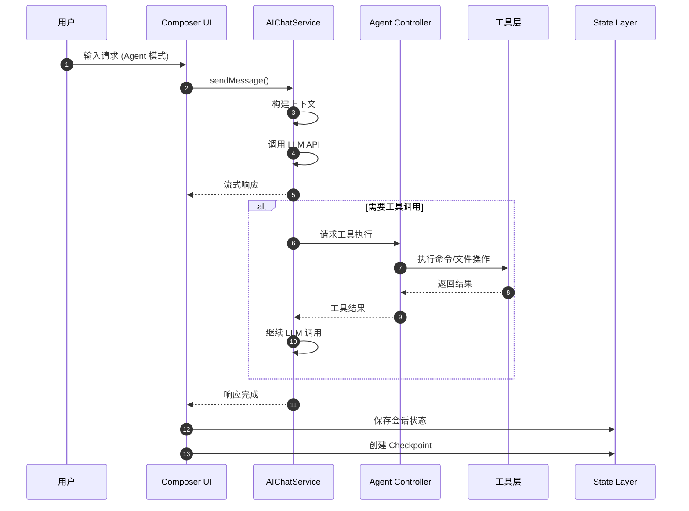
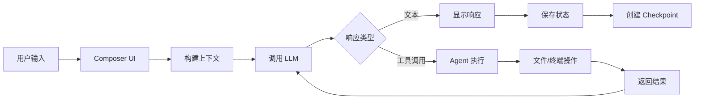
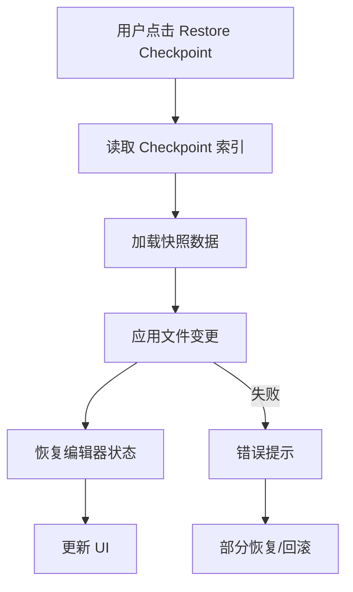
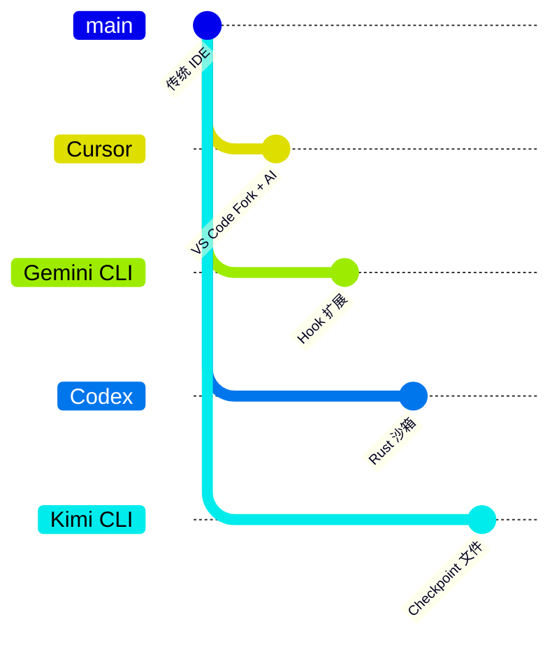

# Cursor 概述

> **阅读指南**
>
> | 属性 | 说明 |
> |-----|------|
> | 预计阅读 | 15-20 分钟 |
> | 前置文档 | 无（本文档为入口） |
> | 文档结构 | TL;DR → 架构概览 → 核心机制 → 数据流转 → 对比分析 |
> | 代码呈现 | 关键代码直接展示，完整代码可折叠查看 |

---

## TL;DR（结论先行）

一句话定义：Cursor 是基于 VS Code 构建的 AI 原生 IDE，采用「**VS Code 扩展架构 + Composer 多轮对话 + Agent 模式自动执行**」的分层设计。

Cursor 的核心取舍：**深度 IDE 集成 + 隐式 Checkpoint 回滚 + 可视化 Agent 交互**（对比 Gemini CLI 的 Hook 扩展、Codex 的 Rust 原生沙箱、Kimi CLI 的显式 Checkpoint 文件）

### 核心要点速览

| 维度 | 关键决策 | 代码位置 |
|-----|---------|---------|
| 架构基础 | VS Code 扩展架构，复用 Electron + Monaco | `src/vs/workbench/`
| Agent Loop | Composer 组件驱动多轮对话循环 | `src/vs/workbench/contrib/composer/`
| 状态持久化 | SQLite (state.vscdb) + 文件系统快照 | `~/Library/Application Support/Cursor/User/workspaceStorage/` |
| Checkpoint | 隐式自动快照，支持消息级回滚 | UI 层 `Restore Checkpoint` 按钮 |
| 工具执行 | 内置终端 + 文件系统 + 代码编辑 API | VS Code 内置 API |
| 扩展机制 | VS Code 插件生态 + 自定义 Agent 规则 | `.cursorrules` 配置文件 |

---

## 1. 为什么需要这个架构？

### 1.1 问题场景

```text
问题：开发者需要在熟悉的 IDE 环境中获得 AI 辅助编程能力，同时保持对代码的完全控制。

如果采用独立 CLI：
  - 需要切换窗口，打断开发流程
  - 无法直接利用 IDE 的语法高亮、调试等功能
  - 文件操作需要额外的权限和路径处理

Cursor 的集成做法：
  基于 VS Code 扩展架构，AI 能力深度嵌入编辑器
  - Composer：侧边栏多轮对话
  - Agent 模式：自动执行终端命令和文件修改
  - Checkpoint：自动保存代码状态，随时回滚
```

### 1.2 核心挑战

| 挑战 | 不解决的后果 |
|-----|-------------|
| IDE 深度集成 | AI 能力与编辑器功能割裂，用户体验差 |
| 代码安全控制 | Agent 自动执行可能破坏代码库 |
| 状态可恢复性 | 误操作后无法快速回滚 |
| 多模态交互 | 仅文本交互无法满足复杂编程场景 |
| 性能与响应 | AI 响应延迟影响编码流畅度 |

### 1.3 技术栈

- **基础**: VS Code (Electron + Monaco Editor)
- **语言**: TypeScript
- **状态存储**: SQLite (state.vscdb)
- **AI 模型**: OpenAI GPT-4 / Claude / 自定义模型
- **扩展机制**: VS Code Extension API

### 1.4 官方资源

- 官网: https://cursor.com
- 文档: https://docs.cursor.com

---

## 2. 整体架构

### 2.1 分层架构图

```text
┌─────────────────────────────────────────────────────────────┐
│ UI Layer（Electron 渲染层）                                  │
│ - Composer Chat 面板                                         │
│ - 编辑器内联 AI 功能 (Cmd+K)                                 │
│ - 终端集成                                                   │
└───────────────────────┬─────────────────────────────────────┘
                        │ 事件
                        ▼
┌─────────────────────────────────────────────────────────────┐
│ ▓▓▓ Core Extension Layer（Cursor 核心扩展）▓▓▓              │
│ src/vs/workbench/contrib/                                   │
│ - composer/: Composer 对话管理                               │
│ - aichat/: AI 聊天服务                                       │
│ - aiService/: 模型调用与响应处理                             │
└───────────────────────┬─────────────────────────────────────┘
                        │ 调用
                        ▼
┌─────────────────────────────────────────────────────────────┐
│ Agent Loop Layer                                            │
│ - Agent 模式状态机                                           │
│ - 工具调用队列                                               │
│ - 用户确认流程                                               │
└───────────────────────┬─────────────────────────────────────┘
                        │ 调度
                        ▼
┌─────────────────────────────────────────────────────────────┐
│ Tools Layer                                                 │
│ - 文件读写 (FileSystem API)                                  │
│ - 终端执行 (Terminal API)                                    │
│ - 代码编辑 (Editor API)                                      │
│ - Web 搜索 (内置搜索)                                        │
└───────────────────────┬─────────────────────────────────────┘
                        │ 持久化/恢复
                        ▼
┌─────────────────────────────────────────────────────────────┐
│ State Layer                                                 │
│ - state.vscdb (SQLite): 会话索引、UI 状态                    │
│ - workspaceStorage/: Checkpoint 快照、历史记录               │
│ - memento/: 用户偏好设置                                     │
└─────────────────────────────────────────────────────────────┘
```

### 2.2 核心组件职责

| 组件 | 职责 | 位置/说明 |
|-----|------|---------|
| `Composer` | 多轮对话管理、消息历史、上下文维护 | `workbench/contrib/composer/` |
| `AIChatService` | 模型调用、流式响应、事件分发 | `workbench/contrib/aichat/` |
| `Agent Controller` | Agent 模式状态管理、工具调度 | Agent 模式相关代码 |
| `Checkpoint Service` | 自动快照、回滚、版本管理 | 隐式实现，UI 层暴露 |
| `Terminal Integration` | 终端命令执行、输出捕获 | VS Code Terminal API |
| `File System` | 文件读写、目录操作 | VS Code FileSystem API |

### 2.3 组件交互时序



**关键交互说明**：

| 步骤 | 交互内容 | 设计意图 |
|-----|---------|---------|
| 1 | 用户在 Composer 输入请求 | 统一入口，支持自然语言描述任务 |
| 2-3 | 构建上下文并调用 LLM | 包含文件内容、历史对话、系统提示 |
| 4 | 流式返回响应 | 实时显示，提升用户体验 |
| 5-7 | Agent 执行工具调用 | 自动完成文件修改、命令执行等 |
| 8-9 | 保存状态和 Checkpoint | 支持随时回滚到之前状态 |

---

## 3. 核心机制概览

### 3.1 Agent 主循环（宏观）

```text
用户输入
  -> Composer 接收消息
    -> AIChatService 构建上下文
      -> 调用 LLM API (流式)
        -> 解析响应
          -> [如有工具调用] -> Agent Controller 执行
            -> 文件修改 / 终端命令 / 代码编辑
            -> 返回结果到上下文
          -> 继续 LLM 调用
        -> 响应完成
      -> 更新 UI
    -> 保存会话状态
  -> 创建 Checkpoint (自动)
```

### 3.2 Checkpoint 机制

```text
Checkpoint 触发时机:
- 每次 Agent 完成一轮操作后
- 用户手动触发 (Cmd+Shift+P "Restore Checkpoint")
- 文件修改前自动备份

Checkpoint 数据结构:
┌─────────────────┐
│ Checkpoint      │
├─────────────────┤
│ - timestamp     │
│ - composerId    │  关联的会话 ID
│ - messageId     │  关联的消息 ID
│ - fileChanges[] │  文件变更列表
│ - snapshotRef   │  快照存储引用
└─────────────────┘

存储位置:
- 索引: state.vscdb (ItemTable.cursorDiskKV)
- 快照: workspaceStorage/<id>/checkpoints/
```

### 3.3 Composer 会话管理

```typescript
// 基于 state.vscdb 分析的结构
interface ComposerData {
  allComposers: Composer[];           // 所有会话
  selectedComposerIds: string[];      // 当前选中的会话
  lastFocusedComposerIds: string[];   // 最近活跃的会话
}

interface Composer {
  composerId: string;                 // 唯一标识
  type: 'agent' | 'chat' | 'edit';    // 会话类型
  name: string;                       // 显示名称
  unifiedMode: string;                // 统一模式
  contextUsagePercent: number;        // 上下文使用率
  createdAt: number;                  // 创建时间戳
  lastUpdatedAt: number;              // 最后更新时间
}
```

### 3.4 状态持久化架构

```text
┌─────────────────────────────────────────────────────────────┐
│ state.vscdb (SQLite)                                        │
├─────────────────────────────────────────────────────────────┤
│ ItemTable                                                   │
│   - composer.composerData        会话索引                   │
│   - aiService.prompts            用户提示历史               │
│   - aiService.generations        AI 生成内容                │
│   - workbench.*                  UI 状态                    │
│   - memento/*                    用户偏好                   │
├─────────────────────────────────────────────────────────────┤
│ cursorDiskKV                                                │
│   - 扩展键值存储                                            │
└─────────────────────────────────────────────────────────────┘
                              │
                              ▼
┌─────────────────────────────────────────────────────────────┐
│ workspaceStorage/<workspace-id>/                            │
│   - state.vscdb                  工作区状态                 │
│   - checkpoints/                 Checkpoint 快照            │
│   - history/                     操作历史                   │
└─────────────────────────────────────────────────────────────┘
```

---

## 4. 端到端数据流转

### 4.1 正常流程（Agent 模式）



### 4.2 Checkpoint 恢复流程



### 4.3 数据变换详情

| 阶段 | 输入 | 处理 | 输出 | 存储位置 |
|-----|------|------|------|---------|
| 接收输入 | 用户消息 | 解析意图、提取上下文 | 结构化请求 | 内存 |
| LLM 调用 | 上下文 + 请求 | Tokenize、API 调用 | 流式响应 | 网络 |
| 工具执行 | 工具调用指令 | 权限检查、执行、捕获输出 | 执行结果 | 终端/文件系统 |
| 状态保存 | 会话数据 | 序列化、压缩 | 持久化记录 | state.vscdb |
| Checkpoint | 文件变更 | 计算 diff、创建快照 | 回滚点 | workspaceStorage |

---

## 5. 关键实现分析

### 5.1 state.vscdb 数据结构

```sql
-- 表结构（基于样本分析）
CREATE TABLE ItemTable (
    key TEXT PRIMARY KEY,
    value BLOB
);

CREATE TABLE cursorDiskKV (
    key TEXT PRIMARY KEY,
    value BLOB
);
```

**关键 Key 说明**：

| Key | 用途 | 数据类型 |
|-----|------|---------|
| `composer.composerData` | 会话索引 | JSON |
| `aiService.prompts` | 用户提示历史 | JSON |
| `aiService.generations` | AI 生成内容 | JSON |
| `workbench.panel.composerChatViewPane.*` | Pane 与会话映射 | JSON |
| `memento/*` | 用户偏好设置 | 多种 |

### 5.2 Checkpoint 存储分析

基于 `analyze_state_vscdb.py` 脚本分析结果：

```python
# 关键发现
{
  "checkpoint_key_hits": [],  # state.vscdb 中无直接 checkpoint key
  "checkpoint_leaf_hits": [...],  # 在 prompt/generation 文本中出现
  "conclusion": "state.vscdb 是会话索引层，非完整快照存储"
}
```

**设计推断**：
1. `state.vscdb` 保存会话元数据和索引
2. 完整 Checkpoint 快照存储在其他位置（如同目录下的独立文件）
3. 分层设计避免数据库过度膨胀

### 5.3 调用链示例

```text
用户点击 Restore Checkpoint
  -> Composer UI 层
    -> Checkpoint Service
      -> 读取 state.vscdb (composer.composerData)
        -> 定位 Checkpoint 引用
          -> 加载 workspaceStorage 快照
            -> 应用文件变更
              -> 更新编辑器状态
                -> 刷新 UI
```

---

## 6. 设计意图与 Trade-off

### 6.1 Cursor 的选择

| 维度 | Cursor 的选择 | 替代方案 | 取舍分析 |
|-----|----------------|---------|---------|
| 产品形态 | VS Code 扩展（Fork） | 独立 CLI / Web IDE | 深度 IDE 集成，但绑定 VS Code 生态 |
| Checkpoint 存储 | 隐式自动 + 分层存储 | 显式文件（Kimi CLI） | 用户无感知，但调试困难 |
| Agent 交互 | 可视化 UI + 确认流程 | 纯文本流 | 直观可控，但交互开销大 |
| 状态持久化 | SQLite + 文件系统 | 纯内存 / 云端 | 本地优先，隐私性好，但无法跨设备 |
| 扩展机制 | VS Code 插件 + .cursorrules | Hook 系统（Gemini CLI） | 生态丰富，但扩展点受限 |

### 6.2 为什么这样设计？

**核心问题**：如何在 IDE 中提供无缝的 AI 辅助编程体验？

**Cursor 的解决方案**：

- **深度集成**：基于 VS Code Fork，完全控制编辑器行为
- **隐式 Checkpoint**：自动保存状态，降低用户认知负担
- **可视化 Agent**：通过 UI 展示执行过程，保持用户掌控

**带来的好处**：
- 与现有开发工作流无缝融合
- 降低 AI 使用门槛
- 可视化反馈增强信任

**付出的代价**：
- 绑定 VS Code 生态
- 隐式机制难以调试
- 状态存储分散，分析困难

### 6.3 与其他项目的对比



| 项目 | 核心差异 | 适用场景 |
|-----|---------|---------|
| **Cursor** | IDE 集成 + 隐式 Checkpoint + 可视化 Agent | 日常开发、需要 IDE 功能 |
| **Gemini CLI** | Hook 系统 + 并行工具调度 | 企业扩展、审计需求 |
| **Codex** | Rust 原生 + TUI + 安全沙箱 | 高性能、安全优先 |
| **Kimi CLI** | Python + 显式 Checkpoint 回滚 | 状态恢复、灵活调试 |
| **OpenCode** | resetTimeoutOnProgress + 长任务 | 长时间运行任务 |

**详细对比**：

| 对比维度 | Cursor | Gemini CLI | Codex | Kimi CLI | OpenCode |
|---------|--------|------------|-------|----------|----------|
| **产品形态** | VS Code Fork | TypeScript CLI | Rust CLI | Python CLI | TypeScript CLI |
| **Agent Loop** | Composer 驱动 | 递归 continuation | Actor 消息驱动 | while 循环 | async/await |
| **Checkpoint** | 隐式自动快照 | JSON 文件 | SQLite + JSONL | 显式文件 | SQLite |
| **工具执行** | IDE 内置 API | Scheduler 状态机 | 沙箱进程 | 直接执行 | 直接执行 |
| **UI 交互** | 可视化 GUI | 终端流式 | TUI | 终端流式 | 终端流式 |
| **扩展机制** | VS Code 插件 | Before/After Hook | 配置驱动 | 配置驱动 | 配置驱动 |
| **状态存储** | SQLite + 文件 | JSON | SQLite | 文件 | SQLite |

---

## 7. 边界情况与错误处理

### 7.1 终止条件

| 终止原因 | 触发条件 | 处理方式 |
|---------|---------|---------|
| 用户取消 | 点击停止按钮 | 中断当前 LLM 调用或工具执行 |
| 工具执行失败 | 命令返回非零退出码 | 捕获错误，返回给 LLM |
| 上下文溢出 | Token 超过模型限制 | 触发上下文压缩或截断 |
| 网络超时 | API 调用超时 | 重试或报错 |
| 权限拒绝 | 文件操作无权限 | 提示用户授权 |

### 7.2 Checkpoint 恢复限制

| 限制类型 | 说明 |
|---------|------|
| 时间窗口 | 可能只保留最近 N 个 Checkpoint |
| 存储空间 | 大项目快照占用磁盘空间 |
| 并发冲突 | 外部修改与 Checkpoint 冲突 |
| 二进制文件 | 某些文件类型可能无法正确恢复 |

### 7.3 错误恢复策略

| 错误类型 | 处理策略 |
|---------|---------|
| Checkpoint 损坏 | 尝试恢复到上一个可用点 |
| 状态加载失败 | 创建新会话，保留历史 |
| 工具执行超时 | 取消操作，返回超时错误 |
| LLM API 错误 | 重试或切换备用模型 |

---

## 8. 关键代码索引

### 8.1 分析工具

| 功能 | 文件路径 | 说明 |
|------|----------|------|
| state.vscdb 分析 | `docs/cursor/questions/analyze_state_vscdb.py` | 数据库结构和 Checkpoint 分析 |

### 8.2 存储位置

| 类型 | 路径 | 说明 |
|------|------|------|
| 用户状态 | `~/Library/Application Support/Cursor/User/` | macOS 用户级配置 |
| 工作区状态 | `workspaceStorage/<id>/state.vscdb` | 工作区特定的状态 |
| Checkpoint | `workspaceStorage/<id>/checkpoints/` | 快照存储（推断） |

### 8.3 关键数据结构

| 结构 | 位置 | 说明 |
|------|------|------|
| `composer.composerData` | state.vscdb ItemTable | 会话索引 |
| `aiService.prompts` | state.vscdb ItemTable | 提示历史 |
| `aiService.generations` | state.vscdb ItemTable | 生成内容 |

---

## 9. 延伸阅读

- Checkpoint 深度分析: `questions/cursor-state-vscdb-checkpoint-analysis.md`
- Checkpoint 官方说明对照: `questions/cursor-checkpoint-official-description-and-state-vscdb-mapping.md`
- Gemini CLI 对比: `../gemini-cli/01-gemini-cli-overview.md`
- Kimi CLI 对比: `../kimi-cli/01-kimi-cli-overview.md`

---

*⚠️ Inferred: 基于 state.vscdb 样本分析和官方文档推断*
*基于版本：Cursor 0.45+ | 最后更新：2026-03-03*
