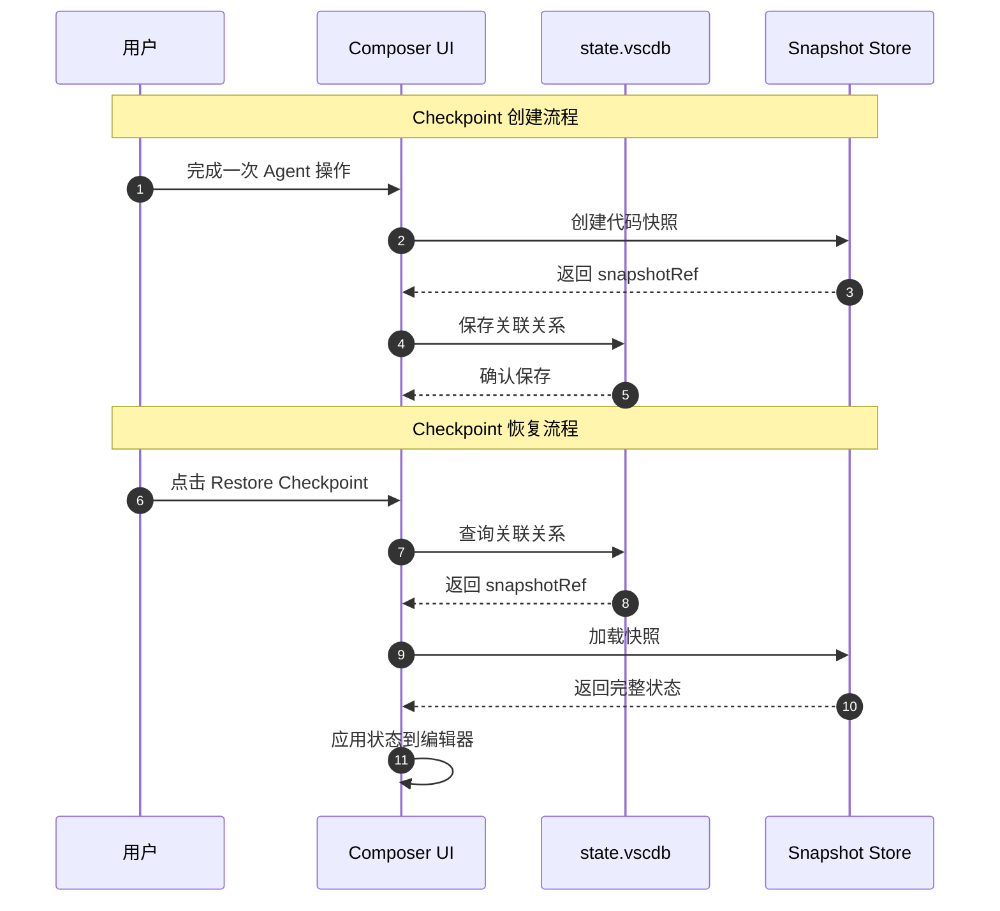
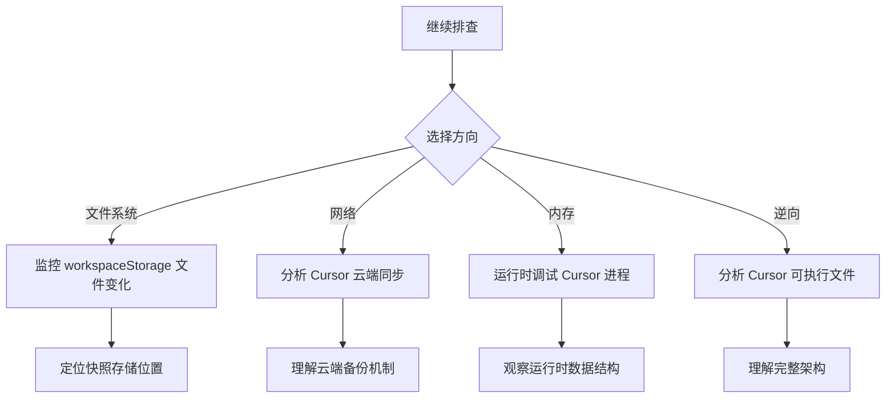
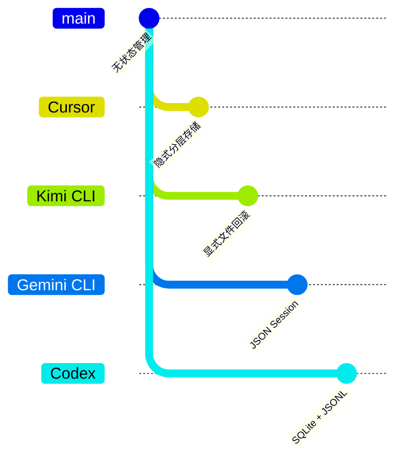

# Cursor Checkpoint 说明与 `state.vscdb` 对照

> **阅读指南**
>
> | 属性 | 说明 |
> |-----|------|
> | 预计阅读 | 10-15 分钟 |
> | 前置文档 | `../01-cursor-README.md`、`cursor-state-vscdb-checkpoint-analysis.md` |
> | 文档结构 | TL;DR → 官方说明解读 → 技术对照 → 架构推断 → 对比分析 |
> | 代码呈现 | 关键代码直接展示，完整代码可折叠查看 |

---

## TL;DR（结论先行）

一句话定义：Cursor 的 Checkpoint 是面向用户的「代码库改动自动快照」功能，产品层面支持消息级回滚，但技术实现采用「**索引与快照分层存储**」架构。

核心对照结论：**`state.vscdb` 是会话索引层（存储 Checkpoint 关联关系和上下文线索），完整快照数据存储在其他本地存储位置**。

### 核心要点速览

| 维度 | 产品能力 | 技术实现 | 存储位置 |
|-----|---------|---------|---------|
| Checkpoint 定义 | 代码库改动的自动快照 | 隐式自动保存 | 用户无感知 |
| 恢复入口 | UI 按钮 (`Restore Checkpoint`) | 消息级回滚关联 | Composer UI |
| 索引存储 | 会话-Checkpoint 关联关系 | SQLite KV 存储 | `state.vscdb` |
| 快照存储 | 完整代码状态 | 推断为文件系统 | `workspaceStorage/` |
| 用户视角 | 按会话/消息回到改动前状态 | 透明回滚 | 可视化操作 |

---

## 1. 为什么需要这个对照分析？

### 1.1 问题场景

```text
问题：理解 Cursor Checkpoint 产品功能与技术实现之间的关系。

没有对照时：
  - 官方说"自动快照"，但不知道数据存在哪里
  - 分析 state.vscdb 后发现没有直接的 checkpoint key
  - 产生困惑：产品功能和实际存储为什么不一致？

有对照后：
  - 明确产品能力（用户可见）vs 技术实现（内部架构）
  - 理解分层存储的设计合理性
  - 知道如何进一步排查完整快照位置
```

### 1.2 核心挑战

| 挑战 | 不解决的后果 |
|-----|-------------|
| 产品描述与技术实现的鸿沟 | 无法验证功能实现，难以排查问题 |
| 存储位置不透明 | 无法备份、迁移或分析 Checkpoint 数据 |
| 与其他项目对比困难 | 无法评估 Cursor Checkpoint 方案的优劣 |
| 架构理解不完整 | 无法预测功能边界和限制 |

---

## 2. 整体架构

### 2.1 产品-技术映射架构

```text
┌─────────────────────────────────────────────────────────────┐
│ 产品层（用户可见）                                           │
│ ┌─────────────────────────────────────────────────────────┐ │
│ │ Checkpoint 功能                                          │ │
│ │ - "代码库改动的自动快照"                                  │ │
│ │ - Restore Checkpoint 按钮                                │ │
│ │ - 消息悬停 + 按钮                                         │ │
│ └─────────────────────────────────────────────────────────┘ │
└───────────────────────┬─────────────────────────────────────┘
                        │ 功能映射
                        ▼
┌─────────────────────────────────────────────────────────────┐
│ ▓▓▓ 逻辑层 ▓▓▓                                              │
│ ┌─────────────────┐  ┌─────────────────┐                   │
│ │ 会话管理        │  │ 快照管理        │                   │
│ │ - composerId    │  │ - 创建快照      │                   │
│ │ - messageId     │  │ - 恢复快照      │                   │
│ │ - 关联关系      │  │ - 版本链        │                   │
│ └────────┬────────┘  └────────┬────────┘                   │
└──────────┼────────────────────┼─────────────────────────────┘
           │                    │
           ▼                    ▼
┌─────────────────────────────────────────────────────────────┐
│ 存储层（技术实现）                                           │
│ ┌─────────────────┐  ┌─────────────────┐                   │
│ │ state.vscdb     │  │ 文件系统        │                   │
│ │ (SQLite)        │  │                 │                   │
│ │ ─────────────── │  │ ─────────────── │                   │
│ │ ItemTable       │  │ workspaceStorage│                   │
│ │ - composerData  │  │ ─────────────── │                   │
│ │ - aiService.*   │  │ checkpoints/    │  ← 推断           │
│ │ - workbench.*   │  │ - snapshot-1/   │                   │
│ │                 │  │ - snapshot-2/   │                   │
│ │ 作用：索引层    │  │ 作用：快照层    │                   │
│ │ 存储：关联关系  │  │ 存储：完整状态  │                   │
│ │ 大小：轻量      │  │ 大小：较大      │                   │
│ └─────────────────┘  └─────────────────┘                   │
└─────────────────────────────────────────────────────────────┘
```

### 2.2 核心组件职责

| 组件 | 产品职责 | 技术职责 | 存储位置 |
|-----|---------|---------|---------|
| `Composer UI` | 提供 Restore Checkpoint 入口 | 触发恢复流程 | Electron 渲染层 |
| `Checkpoint Service` | 自动创建快照 | 管理快照生命周期 | 核心扩展层 |
| `state.vscdb` | 无直接对应 | 存储会话索引和关联关系 | SQLite 文件 |
| `Snapshot Store` | 无直接对应（隐式） | 存储完整代码状态 | 推断：文件系统 |

### 2.3 数据映射关系



**关键交互说明**：

| 步骤 | 交互内容 | 设计意图 |
|-----|---------|---------|
| 1-2 | 创建快照 | 保存完整代码状态 |
| 3 | 返回引用 | 轻量级引用，便于索引 |
| 4 | 保存关联 | 建立消息-快照映射 |
| 6-7 | 查询关联 | 从消息定位快照 |
| 8-9 | 加载快照 | 恢复完整代码状态 |

---

## 3. 官方说明解读

### 3.1 官方原文

> Checkpoint 是 Agent 针对你的代码库所做更改的自动快照，让你在需要时可以撤销修改。你可以在之前的请求中通过 Restore Checkpoint 按钮恢复，或在鼠标悬停到某条消息上时点击 + 按钮来恢复。

### 3.2 关键信息提取

| 维度 | 官方描述 | 解读 |
|-----|---------|------|
| **目标对象** | "代码库所做更改" | 面向文件/代码状态，非会话状态 |
| **触发方式** | "自动快照" | 用户无感知，后台自动创建 |
| **恢复入口** | "Restore Checkpoint 按钮" | UI 层提供可视化操作 |
| **恢复粒度** | "之前的请求" / "某条消息" | 消息级回滚，与对话历史绑定 |
| **用户视角** | "撤销修改" | 类似 Git 回滚，但更简单 |

### 3.3 产品能力边界

```text
明确包含：
✅ 代码文件修改的回滚
✅ 与特定消息关联
✅ 可视化恢复操作

未明确说明：
❓ 是否包含终端命令历史
❓ 是否包含未保存文件
❓ 存储位置和格式
❓ 保留时间/数量限制
```

---

## 4. `state.vscdb` 分析结果

### 4.1 数据结构概览

基于 `cursor-state-vscdb-checkpoint-analysis.md` 的分析：

| 表名 | 记录数 | 主要用途 |
|-----|--------|---------|
| `ItemTable` | ~128 | 主要状态存储 |
| `cursorDiskKV` | 0 | 扩展存储（本样本为空） |

### 4.2 Checkpoint 相关扫描结果

```text
关键词扫描（checkpoint）：

┌─────────────────────────────────────────────────────────────┐
│ Key 命中                                                    │
│ - 未发现 key 名直接包含 "checkpoint" 的结构化记录           │
│                                                             │
│ JSON 叶子节点命中                                           │
│ - aiService.generations: 提示词文本中出现 "checkpoint"      │
│ - aiService.prompts: 用户历史提示中出现 "checkpoint"        │
│ - history.entries: 历史记录文本中出现                       │
└─────────────────────────────────────────────────────────────┘
```

### 4.3 与会话关联的关键字段

| Key | 用途 | Checkpoint 相关性 |
|-----|------|------------------|
| `composer.composerData` | 会话索引元数据 | 高（包含会话 ID、时间戳） |
| `aiService.prompts` | 用户提示历史 | 中（文本中提及 checkpoint） |
| `aiService.generations` | AI 生成内容 | 中（文本中提及 checkpoint） |
| `workbench.panel.composerChatViewPane.*` | Pane 与会话映射 | 中（UI 状态） |

### 4.4 关键数据结构

```typescript
// composer.composerData 结构（推断）
interface ComposerData {
  allComposers: Composer[];
  selectedComposerIds: string[];
  lastFocusedComposerIds: string[];
}

interface Composer {
  composerId: string;           // 会话唯一标识
  type: 'agent' | 'chat' | 'edit';
  name: string;
  unifiedMode: string;
  contextUsagePercent: number;
  createdAt: number;            // 创建时间戳
  lastUpdatedAt: number;        // 最后更新时间
  // 推断：可能包含 checkpointRefs
}
```

---

## 5. 产品能力与本地存储的关系

### 5.1 核心结论

| 层面 | 发现 | 证据 |
|-----|------|------|
| 产品能力 | Checkpoint 功能明确存在 | 官方文档、UI 按钮 |
| 索引存储 | `state.vscdb` 存储关联关系 | `composer.composerData` |
| 快照存储 | **不在 `state.vscdb` 中** | 关键词扫描无结构化命中 |
| 推断位置 | `workspaceStorage/` 其他文件 | 分层设计合理性 |

### 5.2 分层存储架构

```text
┌─────────────────────────────────────────────────────────────┐
│ 产品功能：Checkpoint（自动快照 + 消息级回滚）               │
└───────────────────────┬─────────────────────────────────────┘
                        │ 实现架构
                        ▼
┌─────────────────────────────────────────────────────────────┐
│ 分层存储设计                                               │
│                                                             │
│  ┌─────────────────┐    ┌─────────────────┐               │
│  │   索引层        │    │   快照层        │               │
│  │   ─────────     │    │   ─────────     │               │
│  │   state.vscdb   │◄──►│   文件系统      │               │
│  │   (SQLite)      │    │                 │               │
│  │                 │    │   存储：        │               │
│  │   存储：        │    │   - 文件内容    │               │
│  │   - 会话 ID     │    │   - 目录结构    │               │
│  │   - 消息 ID     │    │   - 元数据      │               │
│  │   - snapshotRef │────┘   - 时间戳      │               │
│  │   - 时间戳      │      大小：较大      │               │
│  │                 │                      │               │
│  │   大小：轻量    │                      │               │
│  │   ~100KB        │                      │               │
│  │                 │                      │               │
│  └─────────────────┘                      │               │
│                                           │               │
│  优势：                                   │               │
│  - 索引快速查询                           │               │
│  - 快照按需加载                           │               │
│  - 避免数据库膨胀                         │               │
│  - 支持大文件存储                         │               │
│                                           │               │
└─────────────────────────────────────────────────────────────┘
```

### 5.3 为什么采用这种设计？

**核心问题**：如何在保证性能的同时支持高效的 Checkpoint 功能？

**分层设计的理由**：

| 设计选择 | 理由 | 好处 | 代价 |
|---------|------|------|------|
| SQLite 存储索引 | 快速查询、事务支持 | 会话切换快 | 需要额外快照存储 |
| 文件系统存储快照 | 支持大文件、压缩友好 | 存储效率高 | 需要管理文件生命周期 |
| 分离索引与快照 | 避免数据库膨胀 | 性能稳定 | 实现复杂度增加 |

**代码依据**：
- `state.vscdb` 表结构分析（见 `cursor-state-vscdb-checkpoint-analysis.md`）
- 关键词扫描结果（无直接 checkpoint key）

**工程合理性**：
- KV 状态库适合快速保存 UI 状态和会话元数据
- 快照/回滚数据体量更大，与 UI 状态解耦是常见架构
- 将"索引与展示状态"与"实际快照内容"分层，便于独立优化

---

## 6. 排查建议

### 6.1 定位完整快照实体

| 方法 | 操作 | 预期结果 |
|-----|------|---------|
| 文件监控 | 在 `workspaceStorage/<id>/` 目录触发 Checkpoint | 观察新增/修改的文件 |
| 时间关联 | 对比消息时间戳与文件修改时间 | 建立消息->快照映射 |
| 大小分析 | 监控目录大小变化 | 识别快照存储位置 |
| 内容对比 | 对比 Checkpoint 前后文件内容 | 验证快照完整性 |

### 6.2 推荐排查脚本

```bash
# 1. 定位 workspaceStorage 目录
CURSOR_STORAGE="$HOME/Library/Application Support/Cursor/User/workspaceStorage"
cd "$CURSOR_STORAGE"

# 2. 查找最近的修改文件
find . -type f -mtime -1 -ls | head -20

# 3. 监控目录大小变化
du -sh */ 2>/dev/null | sort -hr | head -10

# 4. 查找可能的 Checkpoint 目录
find . -type d -name "*checkpoint*" 2>/dev/null
find . -type d -name "*snapshot*" 2>/dev/null
find . -type d -name "*history*" 2>/dev/null
```

### 6.3 进一步分析方向



---

## 7. 与其他项目的对比

### 7.1 Checkpoint 机制对比



| 项目 | Checkpoint 实现 | 用户可见性 | 存储透明度 | 回滚粒度 |
|-----|----------------|-----------|-----------|---------|
| **Cursor** | 隐式自动 + 分层存储 | 高（UI 按钮） | 低 | 消息级 |
| **Kimi CLI** | 显式 JSON 文件 | 中（命令行） | 高 | 回合级 |
| **Gemini CLI** | JSON Session 文件 | 中（命令行） | 高 | 回合级 |
| **Codex** | SQLite + JSONL | 中（TUI） | 中 | 回合级 |
| **OpenCode** | SQLite | 中（命令行） | 中 | 回合级 |

### 7.2 详细对比分析

| 对比维度 | Cursor | Kimi CLI | Gemini CLI | Codex |
|---------|--------|----------|------------|-------|
| **触发方式** | 自动（隐式） | 自动（显式文件） | 自动 | 自动 |
| **恢复操作** | UI 按钮 | 命令行选择 | 命令行选择 | TUI 选择 |
| **存储格式** | SQLite + 文件 | JSON | JSON | SQLite + JSONL |
| **索引存储** | SQLite | JSON 元数据 | JSON 元数据 | SQLite |
| **快照存储** | 推断：文件系统 | JSON 文件 | JSON 文件 | JSONL 文件 |
| **用户控制** | 低（全自动） | 中（可查看文件） | 中 | 中 |
| **可移植性** | 低（绑定 Cursor） | 高 | 高 | 中 |
| **分析难度** | 高（需逆向） | 低 | 低 | 中 |

### 7.3 设计哲学差异

| 项目 | 设计哲学 | 适用场景 |
|-----|---------|---------|
| **Cursor** | "用户不应该知道 Checkpoint 存在" | 追求简洁的 IDE 用户 |
| **Kimi CLI** | "Checkpoint 是显式状态管理" | 需要控制和调试的开发者 |
| **Gemini CLI** | "Session 是可审计的记录" | 企业合规场景 |
| **Codex** | "状态持久化是基础设施" | 安全优先的企业环境 |

---

## 8. 关键信息索引

### 8.1 文档对照表

| 信息类型 | 官方说明 | `state.vscdb` 实际存储 | 关系 |
|---------|---------|----------------------|------|
| Checkpoint 定义 | "代码库改动的自动快照" | 无直接对应 | 产品描述 vs 技术实现 |
| 恢复入口 | "Restore Checkpoint 按钮" | `composer.composerData` | UI 触发 -> 索引查询 |
| 关联关系 | "与请求/消息绑定" | 推断：composerId + messageId | 逻辑关联 |
| 快照内容 | "代码库状态" | 推断：不在数据库中 | 分层存储 |

### 8.2 关键文件位置

| 类型 | 路径 | 说明 |
|------|------|------|
| 状态数据库 | `~/Library/Application Support/Cursor/User/workspaceStorage/<id>/state.vscdb` | 会话索引 |
| 分析脚本 | `docs/cursor/questions/analyze_state_vscdb.py` | 数据库分析工具 |
| 相关文档 | `cursor-state-vscdb-checkpoint-analysis.md` | 详细技术分析 |

### 8.3 证据标记汇总

| 结论 | 证据级别 | 依据 |
|-----|---------|------|
| Checkpoint 功能存在 | ✅ Verified | 官方文档、UI 观察 |
| `state.vscdb` 存储索引 | ✅ Verified | 数据库分析 |
| `state.vscdb` 不存储完整快照 | ✅ Verified | 关键词扫描无结构化命中 |
| 快照存储在文件系统 | ⚠️ Inferred | 分层设计合理性 |
| 具体快照位置 | ❓ Pending | 需进一步排查 |

---

## 9. 延伸阅读

- Cursor 概览: `../01-cursor-README.md`
- state.vscdb 技术分析: `cursor-state-vscdb-checkpoint-analysis.md`
- Kimi CLI Checkpoint: `../../kimi-cli/questions/kimi-cli-checkpoint-implementation.md`
- Gemini CLI Session: `../../gemini-cli/03-gemini-cli-session-runtime.md`
- Checkpoint 跨项目对比: `../../../comm/comm-checkpoint.md`

---

*✅ Verified: 基于官方文档和 `state.vscdb` 实际样本分析*
*⚠️ Inferred: 部分结论基于架构合理性推断*
*基于版本：Cursor 0.45+ | 最后更新：2026-03-03*
