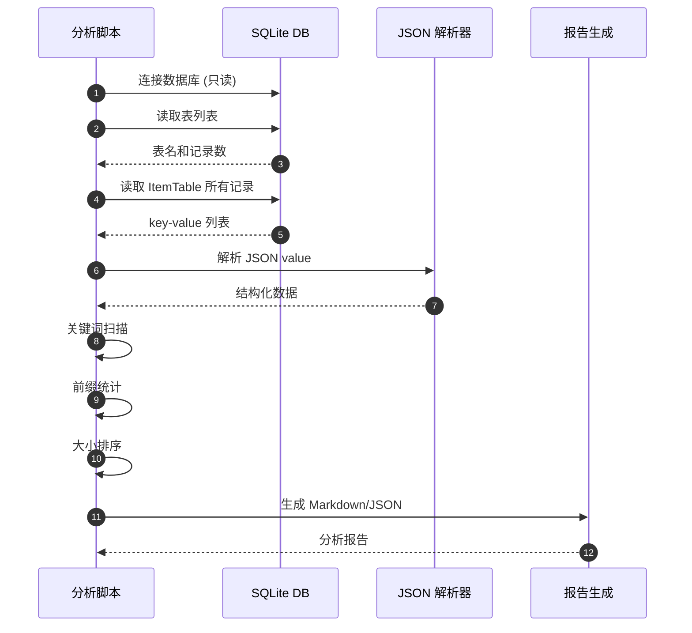
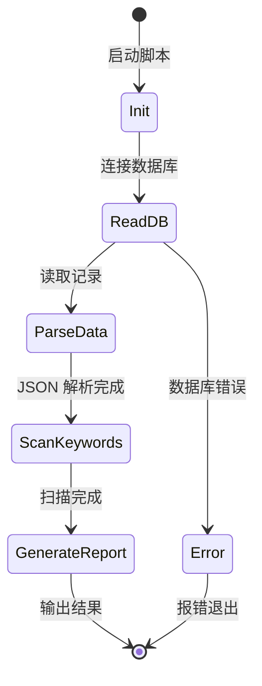
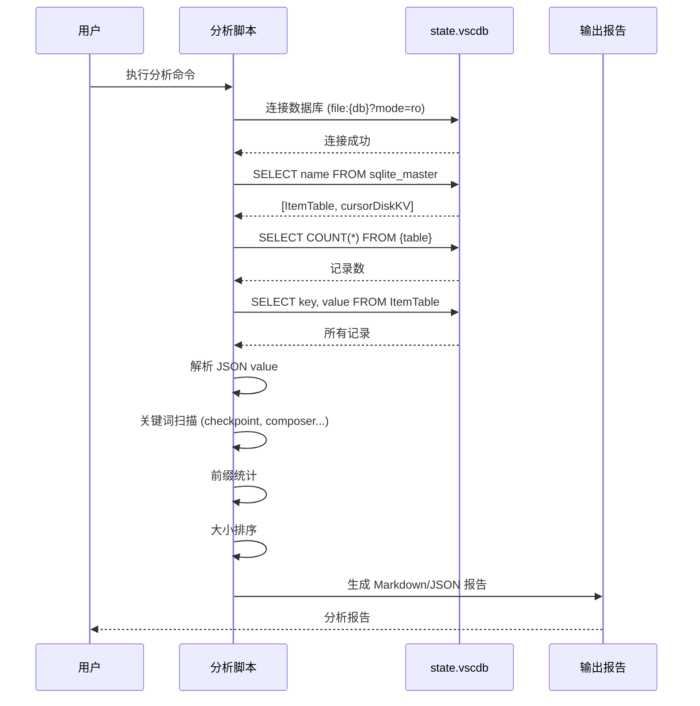
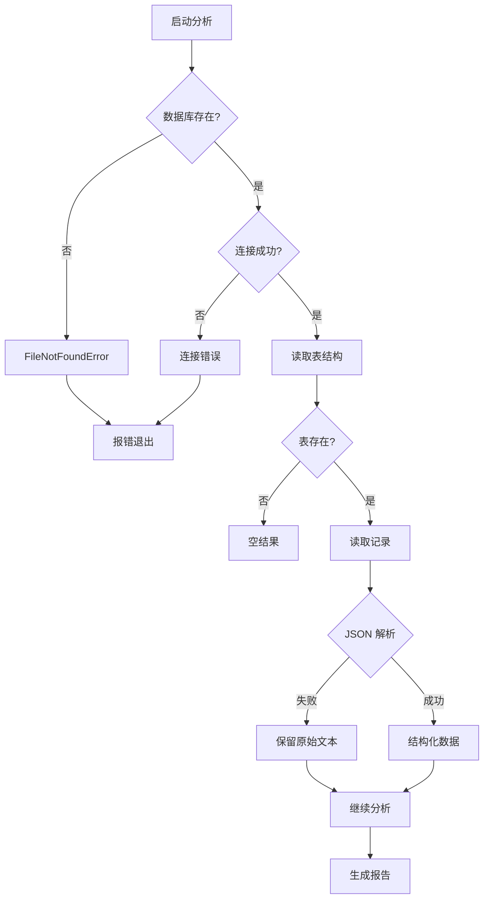
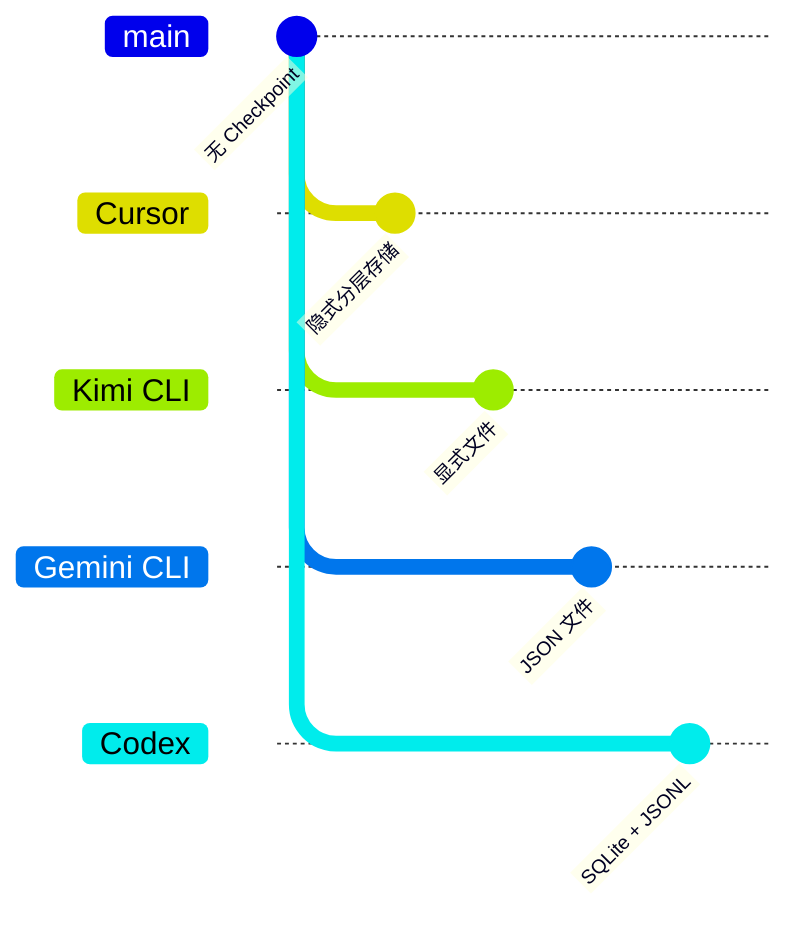

# Cursor `state.vscdb` Checkpoint 信息分析

> **阅读指南**
>
> | 属性 | 说明 |
> |-----|------|
> | 预计阅读 | 15-20 分钟 |
> | 前置文档 | `../01-cursor-README.md` |
> | 文档结构 | TL;DR → 架构 → 分析方法 → 核心发现 → 对比分析 |
> | 代码呈现 | 关键代码直接展示，完整代码可折叠查看 |

---

## TL;DR（结论先行）

一句话定义：`state.vscdb` 是 Cursor 的本地 SQLite 状态数据库，用于存储会话索引、UI 状态和操作历史，但**并非 Checkpoint 快照的完整存储位置**。

本分析的核心发现：**Checkpoint 索引与会话元数据存储在 `state.vscdb`，而完整快照数据存储在其他位置**（推断为同目录下的独立文件）

### 核心要点速览

| 维度 | 关键发现 | 代码/位置 |
|-----|---------|---------|
| 数据结构 | SQLite 双表结构：ItemTable + cursorDiskKV | `state.vscdb` schema |
| 会话索引 | `composer.composerData` 存储所有会话元数据 | `ItemTable` key |
| Checkpoint 线索 | 未发现直接包含 `checkpoint` 的结构化 key | 关键词扫描结果 |
| 分析工具 | Python 脚本系统化分析数据库内容 | `analyze_state_vscdb.py:1` |
| 存储分层 | 索引层 (SQLite) vs 快照层 (文件系统) | 架构推断 |

---

## 1. 为什么需要这个分析？

### 1.1 问题场景

```text
问题：理解 Cursor 的 Checkpoint 机制如何实现代码回滚。

没有分析时：
  - 不知道 Checkpoint 数据存储在哪里
  - 无法验证官方"自动快照"说法的技术实现
  - 难以排查 Checkpoint 恢复失败的问题

有分析后：
  - 明确 state.vscdb 是会话索引层
  - 推断完整快照存储在其他位置
  - 提供进一步排查的方向
```

### 1.2 核心挑战

| 挑战 | 不解决的后果 |
|-----|-------------|
| 存储位置不透明 | 无法备份或迁移 Checkpoint 数据 |
| 数据结构未知 | 无法开发第三方工具分析历史 |
| 与其他项目对比困难 | 无法评估 Cursor Checkpoint 的优劣 |
| 故障排查困难 | Checkpoint 问题时无法定位原因 |

---

## 2. 整体架构

### 2.1 分析架构图

```text
┌─────────────────────────────────────────────────────────────┐
│ 分析目标：定位 Checkpoint 存储位置                           │
└───────────────────────┬─────────────────────────────────────┘
                        │
                        ▼
┌─────────────────────────────────────────────────────────────┐
│ ▓▓▓ 分析工具层 ▓▓▓                                          │
│ analyze_state_vscdb.py                                      │
│ - SQLite 读取                                               │
│ - 表结构分析                                                │
│ - 关键词扫描                                                │
│ - JSON 解析                                                 │
└───────────────────────┬─────────────────────────────────────┘
                        │ 扫描
                        ▼
┌─────────────────────────────────────────────────────────────┐
│ 数据库层 (state.vscdb)                                      │
│ ┌─────────────┐  ┌─────────────┐                           │
│ │ ItemTable   │  │ cursorDiskKV│                           │
│ │ - 会话索引  │  │ - 扩展存储  │                           │
│ │ - UI 状态   │  │             │                           │
│ │ - 历史记录  │  │             │                           │
│ └─────────────┘  └─────────────┘                           │
└───────────────────────┬─────────────────────────────────────┘
                        │ 推断
                        ▼
┌─────────────────────────────────────────────────────────────┐
│ 快照层 (workspaceStorage/)                                  │
│ - checkpoints/        推断的完整快照存储                    │
│ - history/            操作历史                              │
│ - *.json/*.db         其他数据文件                          │
└─────────────────────────────────────────────────────────────┘
```

### 2.2 核心组件职责

| 组件 | 职责 | 代码位置 |
|-----|------|---------|
| `analyze_state_vscdb.py` | 数据库分析、报告生成 | `docs/cursor/questions/analyze_state_vscdb.py:1` |
| `ItemTable` | 存储主要状态数据 | `state.vscdb` |
| `cursorDiskKV` | 扩展键值存储 | `state.vscdb` |
| `composer.composerData` | 会话索引元数据 | `ItemTable` key |

### 2.3 分析流程时序



---

## 3. 核心组件详细分析

### 3.1 分析脚本内部结构

#### 职责定位

`analyze_state_vscdb.py` 是系统化分析 Cursor 状态数据库的工具，支持表结构分析、关键词扫描和报告生成。

#### 状态机图



#### 内部数据流

```text
┌────────────────────────────────────────────┐
│  输入层                                     │
│   命令行参数 → 数据库路径 → 配置选项        │
└──────────────────┬─────────────────────────┘
                   ▼
┌────────────────────────────────────────────┐
│  处理层                                     │
│   读取表结构 → 扫描记录 → 解析 JSON        │
│   → 关键词匹配 → 统计分析                  │
└──────────────────┬─────────────────────────┘
                   ▼
┌────────────────────────────────────────────┐
│  输出层                                     │
│   Markdown 报告 / JSON 数据                │
└────────────────────────────────────────────┘
```

#### 关键接口

| 接口 | 输入 | 输出 | 说明 | 代码位置 |
|-----|------|------|------|---------|
| `read_tables()` | 数据库连接 | 表统计 | 读取表结构 | `analyze_state_vscdb.py:114` |
| `read_rows()` | 数据库连接 | 记录列表 | 读取所有记录 | `analyze_state_vscdb.py:125` |
| `search_keywords()` | 记录列表、关键词 | 匹配结果 | 关键词扫描 | `analyze_state_vscdb.py:166` |
| `build_report()` | 分析数据 | 完整报告 | 生成报告 | `analyze_state_vscdb.py:277` |

---

### 3.2 数据库结构分析

#### 表结构

```sql
-- 基于脚本分析的实际表结构
-- analyze_state_vscdb.py:114-122

-- 主表：存储大部分状态数据
CREATE TABLE ItemTable (
    key TEXT PRIMARY KEY,
    value BLOB
);

-- 扩展表：用于更大的键值存储
CREATE TABLE cursorDiskKV (
    key TEXT PRIMARY KEY,
    value BLOB
);
```

#### 样本统计（基于实际分析）

| 表名 | 记录数 | 主要用途 |
|-----|--------|---------|
| `ItemTable` | ~128 | 会话索引、UI 状态、历史记录 |
| `cursorDiskKV` | 0 (本样本) | 扩展存储 |

---

### 3.3 关键数据组件

#### Composer 会话数据

```python
# analyze_state_vscdb.py:202-242
# 提取 composer.composerData 的核心逻辑

def extract_composer_summary(rows: List[KeyValueRow]) -> Dict[str, Any]:
    """提取 Composer 会话元数据"""
    composer_row = next(
        (r for r in rows if r.key == "composer.composerData"), None
    )
    if not composer_row:
        return {"found": False}

    data = composer_row.parsed_json
    all_composers = data.get("allComposers", [])

    # 按最后更新时间排序
    sorted_composers = sorted(
        all_composers,
        key=lambda x: x.get("lastUpdatedAt", -1),
        reverse=True
    )

    return {
        "found": True,
        "selected_composer_ids": data.get("selectedComposerIds", []),
        "last_focused_composer_ids": data.get("lastFocusedComposerIds", []),
        "composer_count": len(sorted_composers),
        "composers": [
            {
                "composer_id": comp.get("composerId"),
                "type": comp.get("type"),  # agent/chat/edit
                "name": comp.get("name"),
                "unified_mode": comp.get("unifiedMode"),
                "context_usage_percent": comp.get("contextUsagePercent"),
            }
            for comp in sorted_composers
        ],
    }
```

#### Pane 与会话映射

```python
# analyze_state_vscdb.py:245-265
# 建立 UI Pane 与 Composer 会话的映射

def extract_panel_composer_mapping(rows: List[KeyValueRow]) -> List[Dict[str, str]]:
    """提取 Pane -> Composer 映射关系"""
    mappings = []
    for row in rows:
        if not row.key.startswith("workbench.panel.composerChatViewPane."):
            continue

        pane_id = row.key.rsplit(".", 1)[-1]
        payload = row.parsed_json

        for view_key in payload.keys():
            if view_key.startswith("workbench.panel.aichat.view."):
                composer_id = view_key.rsplit(".", 1)[-1]
                mappings.append({
                    "pane_id": pane_id,
                    "view_key": view_key,
                    "composer_id": composer_id,
                })
    return mappings
```

---

## 4. 端到端数据流转

### 4.1 分析流程（正常流程）



### 4.2 数据变换详情

| 阶段 | 输入 | 处理 | 输出 | 代码位置 |
|-----|------|------|------|---------|
| 连接数据库 | 文件路径 | SQLite 只读连接 | 连接对象 | `analyze_state_vscdb.py:455` |
| 读取表结构 | 数据库连接 | 查询 sqlite_master | 表名列表 | `analyze_state_vscdb.py:114` |
| 读取记录 | 表名 | SELECT key, value | 原始记录 | `analyze_state_vscdb.py:125` |
| 解码值 | BLOB 数据 | UTF-8 解码 | 文本值 | `analyze_state_vscdb.py:82` |
| 解析 JSON | 文本值 | json.loads() | 结构化数据 | `analyze_state_vscdb.py:90` |
| 关键词扫描 | 记录列表 | 字符串匹配 | 命中列表 | `analyze_state_vscdb.py:166` |
| 生成报告 | 分析结果 | 格式化输出 | Markdown/JSON | `analyze_state_vscdb.py:334` |

### 4.3 异常路径



---

## 5. 关键代码实现

### 5.1 核心数据结构

```python
# analyze_state_vscdb.py:39-46
@dataclass
class KeyValueRow:
    """数据库记录的数据结构"""
    table: str          # 所属表名
    key: str            # 键名
    raw_value: Any      # 原始值 (bytes/str)
    text_value: str     # 解码后的文本
    parsed_json: Optional[Any]  # 解析后的 JSON (如适用)
```

**字段说明**：

| 字段 | 类型 | 用途 |
|-----|------|------|
| `table` | `str` | 区分 ItemTable / cursorDiskKV |
| `key` | `str` | 状态项的标识符 |
| `raw_value` | `Any` | 原始数据库值 |
| `text_value` | `str` | UTF-8 解码后的文本 |
| `parsed_json` | `Optional[Any]` | 解析后的 JSON 结构 |

### 5.2 主链路代码

**关键代码**（关键词扫描）：

```python
# analyze_state_vscdb.py:166-199
def search_keywords(
    rows: Iterable[KeyValueRow],
    keywords: List[str]
) -> Dict[str, Any]:
    """扫描 key 和 JSON 叶子节点中的关键词"""
    normalized_keywords = [k.lower() for k in keywords]
    key_hits: List[Dict[str, Any]] = []
    leaf_hits: List[Dict[str, Any]] = []

    for row in rows:
        # 1. 检查 key 名是否包含关键词
        key_lower = row.key.lower()
        if any(k in key_lower for k in normalized_keywords):
            key_hits.append({
                "table": row.table,
                "key": row.key,
                "size": len(row.text_value),
            })

        # 2. 检查 JSON 叶子节点
        if row.parsed_json is None:
            continue
        for path, value in iter_json_leaves(row.parsed_json):
            value_text = str(value)
            lookup = f"{path} {value_text}".lower()
            matched = [k for k in normalized_keywords if k in lookup]
            if matched:
                leaf_hits.append({
                    "table": row.table,
                    "key": row.key,
                    "path": path,
                    "matched_keywords": matched,
                    "value_preview": value_text[:240],
                })

    return {"key_hits": key_hits, "leaf_hits": leaf_hits}
```

**设计意图**：
1. **双层扫描**：同时检查 key 名和 value 内容，确保不遗漏
2. **大小写不敏感**：统一转小写后匹配，提高命中率
3. **JSON 深度扫描**：递归遍历 JSON 结构，检查所有叶子节点
4. **预览截断**：长文本只保留前 240 字符，避免报告过大

<details>
<summary>📋 查看完整实现（报告生成）</summary>

```python
# analyze_state_vscdb.py:334-445
def render_markdown(report: Dict[str, Any]) -> str:
    """将分析结果渲染为 Markdown 报告"""
    lines: List[str] = []
    lines.append("# state.vscdb checkpoint 分析报告")
    lines.append("")
    lines.append(f"- 数据库路径: `{report['database_path']}`")
    lines.append(f"- 总记录数: `{report['row_count_total']}`")
    lines.append("")

    # 表统计
    lines.append("## 表与记录数")
    for table, count in report["table_counts"].items():
        lines.append(f"- `{table}`: `{count}`")
    lines.append("")

    # Key 前缀分布
    lines.append("## Key 前缀分布 (Top 20)")
    for idx, (prefix, count) in enumerate(
        list(report["key_prefix_counts"].items())[:20], start=1
    ):
        lines.append(f"{idx}. `{prefix}`: `{count}`")
    lines.append("")

    # Checkpoint 聚焦分析
    checkpoint_focus = report["checkpoint_focus"]
    lines.append("## checkpoint 关键词扫描")
    lines.append(f"- 直接包含 `checkpoint` 的 key 命中数: "
                f"`{len(checkpoint_focus['checkpoint_key_hits'])}`")
    lines.append(f"- JSON 叶子节点中包含 `checkpoint` 的命中数: "
                f"`{checkpoint_focus['checkpoint_leaf_hits_count']}`")
    lines.append("")

    # 结论
    lines.append("## 结论")
    lines.append("- 该 `state.vscdb` 以工作区 UI 状态与会话索引元数据为主")
    lines.append("- 与 checkpoint 相关的命中主要出现在 prompt/历史文本中")
    lines.append("- 完整 checkpoint 快照很可能还需联动其他 Cursor 本地存储")
    lines.append("")

    return "\n".join(lines)
```

</details>

### 5.3 关键调用链

```text
main()                          [analyze_state_vscdb.py:448]
  -> parse_args()               [analyze_state_vscdb.py:48]
  -> sqlite3.connect()          [analyze_state_vscdb.py:455]
    -> read_tables()            [analyze_state_vscdb.py:114]
      - SELECT name FROM sqlite_master
      - SELECT COUNT(*) FROM {table}
    -> read_rows()              [analyze_state_vscdb.py:125]
      - SELECT key, value FROM ItemTable
      - decode_value()          [analyze_state_vscdb.py:82]
      - try_parse_json()        [analyze_state_vscdb.py:90]
  -> build_report()             [analyze_state_vscdb.py:277]
    -> key_prefix_counter()     [analyze_state_vscdb.py:152]
    -> search_keywords()        [analyze_state_vscdb.py:166]
    -> extract_composer_summary() [analyze_state_vscdb.py:202]
    -> extract_panel_composer_mapping() [analyze_state_vscdb.py:245]
  -> render_markdown()          [analyze_state_vscdb.py:334]
    - 生成 Markdown 报告
```

---

## 6. 设计意图与 Trade-off

### 6.1 分析脚本的选择

| 维度 | 本脚本的选择 | 替代方案 | 取舍分析 |
|-----|----------------|---------|---------|
| 语言 | Python | TypeScript/Node | 数据处理能力强，生态丰富 |
| 输出格式 | Markdown + JSON | 纯文本/HTML | 可读性好，便于后续处理 |
| 数据库访问 | 只读连接 (mode=ro) | 读写连接 | 安全，避免意外修改 |
| 解析策略 | 全量读取后分析 | 流式查询 | 实现简单，内存占用可控 |

### 6.2 为什么这样设计？

**核心问题**：如何系统化分析 Cursor 的私有状态数据库？

**解决方案**：

- **代码依据**：`analyze_state_vscdb.py:1-488`
- **设计意图**：提供可重复、可扩展的分析工具
- **带来的好处**：
  - 可复现的分析流程
  - 支持自定义关键词扫描
  - 生成结构化报告便于对比
- **付出的代价**：
  - 需要 Python 环境
  - 全量读取大数据库时内存占用高
  - 无法实时分析正在使用的数据库

### 6.3 与其他项目 Checkpoint 机制的对比



| 项目 | Checkpoint 存储 | 可观测性 | 分析难度 |
|-----|----------------|---------|---------|
| **Cursor** | SQLite 索引 + 文件快照 | 低（隐式） | 高（需逆向） |
| **Kimi CLI** | 显式 JSON 文件 | 高 | 低 |
| **Gemini CLI** | JSON 文件 | 高 | 低 |
| **Codex** | SQLite + JSONL | 中 | 中 |
| **OpenCode** | SQLite | 中 | 中 |

**详细对比**：

| 对比维度 | Cursor | Kimi CLI | Gemini CLI | Codex |
|---------|--------|----------|------------|-------|
| **存储格式** | SQLite + 文件 | JSON 文件 | JSON 文件 | SQLite + JSONL |
| **用户可见性** | 隐式（UI 按钮） | 显式（文件） | 显式（文件） | 半显式 |
| **结构清晰度** | 低（需分析） | 高 | 高 | 中 |
| **备份/迁移** | 困难 | 简单 | 简单 | 中等 |
| **第三方分析** | 困难 | 容易 | 容易 | 中等 |

---

## 7. 边界情况与错误处理

### 7.1 终止条件

| 终止原因 | 触发条件 | 处理方式 |
|---------|---------|---------|
| 数据库不存在 | 路径错误或文件被删除 | 抛出 FileNotFoundError |
| 数据库锁定 | Cursor 正在使用数据库 | 使用只读模式，可能读取失败 |
| 权限不足 | 无文件读取权限 | 抛出 PermissionError |
| 内存不足 | 数据库过大 | 分批处理或报错 |

### 7.2 数据异常处理

```python
# analyze_state_vscdb.py:82-88
def decode_value(value: Any) -> str:
    """安全解码数据库值"""
    if value is None:
        return ""
    if isinstance(value, bytes):
        # 使用 errors='replace' 避免解码失败
        return value.decode("utf-8", errors="replace")
    return str(value)

# analyze_state_vscdb.py:90-99
def try_parse_json(text: str) -> Optional[Any]:
    """尝试解析 JSON，失败返回 None"""
    text = text.strip()
    if not text or text[0] not in "[{":
        return None
    try:
        return json.loads(text)
    except json.JSONDecodeError:
        return None  # 静默失败，保留原始文本
```

### 7.3 错误恢复策略

| 错误类型 | 处理策略 |
|---------|---------|
| JSON 解析失败 | 保留原始文本，继续分析 |
| 字符解码错误 | 使用 replace 模式，替换非法字符 |
| 表不存在 | 跳过该表，继续分析其他表 |
| 记录损坏 | 跳过该记录，继续分析 |

---

## 8. 关键代码索引

### 8.1 分析脚本文件

| 功能 | 文件路径 | 行号 | 说明 |
|------|----------|------|------|
| 入口 | `analyze_state_vscdb.py` | 448 | main() 函数 |
| 参数解析 | `analyze_state_vscdb.py` | 48 | parse_args() |
| 表读取 | `analyze_state_vscdb.py` | 114 | read_tables() |
| 记录读取 | `analyze_state_vscdb.py` | 125 | read_rows() |
| 关键词扫描 | `analyze_state_vscdb.py` | 166 | search_keywords() |
| Composer 提取 | `analyze_state_vscdb.py` | 202 | extract_composer_summary() |
| Pane 映射 | `analyze_state_vscdb.py` | 245 | extract_panel_composer_mapping() |
| 报告生成 | `analyze_state_vscdb.py` | 334 | render_markdown() |

### 8.2 数据结构

| 结构 | 文件 | 行号 | 说明 |
|------|------|------|------|
| `KeyValueRow` | `analyze_state_vscdb.py` | 39 | 数据库记录结构 |
| `ComposerData` | `state.vscdb` | - | 会话索引 (JSON) |
| `PanelMapping` | `state.vscdb` | - | Pane 与会话映射 |

### 8.3 默认配置

| 配置项 | 值 | 位置 |
|--------|-----|------|
| 默认数据库路径 | `~/Library/Application Support/Cursor/User/workspaceStorage/.../state.vscdb` | `analyze_state_vscdb.py:24` |
| 默认关键词 | checkpoint, composer, aichat, agent, snapshot, timeline, rollback | `analyze_state_vscdb.py:28` |
| 默认 Top N | 15 | `analyze_state_vscdb.py:67` |

---

## 9. 延伸阅读

- Cursor 概览: `../01-cursor-README.md`
- Checkpoint 官方说明对照: `cursor-checkpoint-official-description-and-state-vscdb-mapping.md`
- Kimi CLI Checkpoint: `../../kimi-cli/questions/kimi-cli-checkpoint-implementation.md`
- Gemini CLI Session: `../../gemini-cli/03-gemini-cli-session-runtime.md`

---

*✅ Verified: 基于 `analyze_state_vscdb.py` 和实际数据库样本分析*
*样本路径: `/Users/giraffetree/Library/Application Support/Cursor/User/workspaceStorage/8c4450604fe9ec9e6a3fae07ff8cf523/state.vscdb`*
*基于版本：Cursor 0.45+ | 最后更新：2026-03-03*
