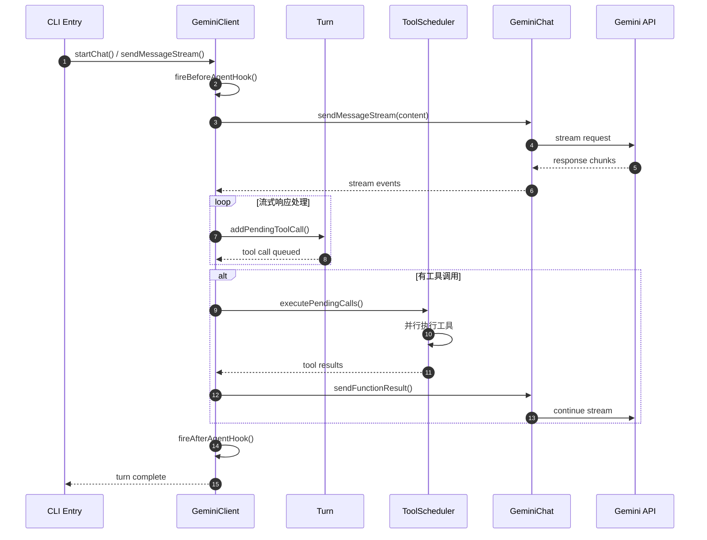
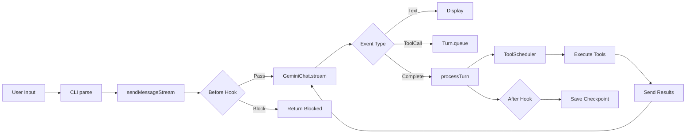

# gemini-cli 概述

## TL;DR（结论先行）

一句话定义：gemini-cli 是 Google 官方推出的 TypeScript CLI Agent，采用「**CLI 命令层 + GeminiClient 核心 + Turn 回合管理 + ToolScheduler 工具调度**」的分层架构。

核心取舍：
- Hook 系统支持 Before/After Agent 扩展点
- 基于事件的流式响应处理（GeminiEventType）
- 并行工具执行 + Checkpoint 会话持久化

---

## 1. 项目定位

### 1.1 为什么需要这个项目？

```text
问题：企业级 CLI Agent 需要兼顾交互体验、工具扩展性和会话可恢复性。

如果单层混合：
  命令解析、UI 渲染、Agent 循环、工具执行耦合在一起
  -> 难以扩展 Hook、难以审计、状态管理混乱

gemini-cli 的分层做法：
  CLI 层负责命令解析与配置管理
  GeminiClient 负责事件循环与流处理
  Turn 层负责回合状态与工具队列
  ToolScheduler 负责并行工具调度与执行
```

### 1.2 核心挑战

| 挑战 | 不解决的后果 |
|-----|-------------|
| 工具扩展性 | 新增工具需要修改核心代码，难以维护 |
| 流式响应处理 | 大模型响应卡顿，用户体验差 |
| 会话可恢复性 | 崩溃后丢失上下文，需要重新开始 |
| 企业合规 | 无法审计和干预 Agent 执行过程 |

### 1.3 技术栈

- **语言**: TypeScript
- **运行时**: Node.js 20+
- **核心依赖**:
  - `@google/genai` - Google GenAI SDK
  - `commander` - CLI 框架
  - `zod` - 数据验证
  - `picocolors` - 终端颜色
  - `marked` - Markdown 渲染

### 1.4 官方仓库

- https://github.com/google-gemini/gemini-cli
- 文档: https://github.com/google-gemini/gemini-cli/tree/main/docs

---

## 2. 整体架构

### 2.1 分层架构图

```text
┌─────────────────────────────────────────────────────────────┐
│ CLI Layer（packages/cli）                                   │
│ index.ts:1                                                   │
│ - main()                                                     │
│ - 异常处理 (uncaughtException)                               │
│ - 子命令分发 (chat, config, skills)                         │
└───────────────────────┬─────────────────────────────────────┘
                        │ 分发
                        ▼
┌─────────────────────────────────────────────────────────────┐
│ Commands Layer（packages/cli/src/gemini.ts）                │
│ - Commander 参数解析                                         │
│ - 配置管理                                                   │
│ - 子命令实现                                                 │
└───────────────────────┬─────────────────────────────────────┘
                        │ 初始化
                        ▼
┌─────────────────────────────────────────────────────────────┐
│ ▓▓▓ GeminiClient Layer（packages/core/src/core/client.ts）▓▓▓│
│ - GeminiClient:83 主客户端类                                 │
│ - sendMessageStream():350 流式消息处理                       │
│ - processTurn():450 单回合处理                               │
│ - Hook 系统 (Before/After Agent)                            │
└───────────────────────┬─────────────────────────────────────┘
                        │ 创建/管理
                        ▼
┌─────────────────────────────────────────────────────────────┐
│ Turn Layer（packages/core/src/core/turn.ts）                │
│ - Turn: 回合管理                                             │
│ - GeminiEventType: 事件类型                                  │
│ - 工具调用队列                                               │
└───────────────────────┬─────────────────────────────────────┘
                        │ 调度执行
                        ▼
┌─────────────────────────────────────────────────────────────┐
│ Tools Layer（packages/core/src/tools/）                     │
│ - tool-registry.ts: 工具注册                                 │
│ - scheduler.ts: 工具调度                                     │
│ - handlers/: 工具实现                                        │
└───────────────────────┬─────────────────────────────────────┘
                        │ 调用
                        ▼
┌─────────────────────────────────────────────────────────────┐
│ Model Layer（packages/core/src/core/geminiChat.ts）         │
│ - 模型调用封装                                               │
│ - 流式响应处理                                               │
│ - Token 管理                                                 │
└───────────────────────┬─────────────────────────────────────┘
                        │ 持久化
                        ▼
┌─────────────────────────────────────────────────────────────┐
│ Checkpoint Layer（packages/core/src/utils/checkpointUtils.ts）│
│ - 状态持久化                                                 │
│ - 会话恢复                                                   │
│ - 压缩管理                                                   │
└─────────────────────────────────────────────────────────────┘
```

### 2.2 核心组件职责

| 组件 | 职责 | 代码位置 |
|-----|------|---------|
| `CLI Entry` | 入口、异常处理、主函数调用 | `packages/cli/index.ts:1` |
| `Commander` | 命令解析、配置管理、子命令分发 | `packages/cli/src/gemini.ts` |
| `GeminiClient` | Agent 核心、事件循环、流处理 | `packages/core/src/core/client.ts:83` |
| `Turn` | 回合管理、事件类型、工具队列 | `packages/core/src/core/turn.ts` |
| `ToolRegistry` | 工具注册、Schema 管理 | `packages/core/src/tools/tool-registry.ts` |
| `ToolScheduler` | 工具调度、并行执行 | `packages/core/src/tools/scheduler.ts` |
| `GeminiChat` | 模型调用、流式响应 | `packages/core/src/core/geminiChat.ts` |
| `CheckpointManager` | 状态持久化、会话恢复 | `packages/core/src/utils/checkpointUtils.ts` |

### 2.3 组件交互时序



---

## 3. 核心机制概览

### 3.1 Agent 主循环（宏观）

```text
GeminiClient.initialize()
  -> startChat() 启动交互
    -> sendMessageStream(userInput)
      -> fireBeforeAgentHook()
      -> chat.sendMessageStream()
        -> processTurn() (如有工具调用)
          -> ToolScheduler.executePendingCalls()
            -> 并行执行工具
            -> 发送结果到模型
      -> fireAfterAgentHook()
    -> 保存 Checkpoint
```

代码依据：
- `packages/core/src/core/client.ts:83`（`GeminiClient` 类）
- `packages/core/src/core/client.ts:350`（`sendMessageStream`）
- `packages/core/src/core/client.ts:450`（`processTurn`）

### 3.2 工具系统（并行调度）

```text
ToolScheduler.executePendingCalls
  -> 获取待执行工具调用列表
  -> Promise.all() 并行执行
    -> 每个工具: registry.get() -> handler.handle()
  -> 收集所有结果
  -> 返回 ToolResult[]
```

代码依据：`packages/core/src/tools/scheduler.ts`

### 3.3 事件驱动架构

```typescript
// packages/core/src/core/turn.ts
enum GeminiEventType {
  TextDelta = 'text-delta',           // 文本增量
  ToolCall = 'tool-call',             // 工具调用
  ToolResult = 'tool-result',         // 工具结果
  TurnComplete = 'turn-complete',     // 回合完成
  AgentExecutionStopped = 'agent-stopped',
  AgentExecutionBlocked = 'agent-blocked',
}
```

### 3.4 Checkpoint 机制

```text
自动保存触发条件:
- 每 N 个回合
- 会话正常退出时
- 用户手动触发

保存内容:
┌─────────────────┐
│ Checkpoint      │
├─────────────────┤
│ - sessionId     │
│ - timestamp     │
│ - history[]     │  完整对话历史
│ - config        │  配置快照
│ - compressed    │  是否已压缩
└─────────────────┘
```

代码依据：`packages/core/src/utils/checkpointUtils.ts`

---

## 4. 端到端数据流

### 4.1 数据流转图



### 4.2 关键数据结构

```typescript
// packages/core/src/core/turn.ts
interface ServerGeminiStreamEvent {
  type: GeminiEventType;
  text?: string;
  toolCall?: ToolCall;
  toolResult?: ToolResult;
  finishReason?: string;
}

interface ToolCall {
  id: string;
  name: string;
  args: Record<string, unknown>;
}

interface ToolResult {
  toolCallId: string;
  output: string;
  error?: string;
}
```

---

## 5. 设计意图与 Trade-off

### 5.1 gemini-cli 的选择

| 维度 | gemini-cli 的选择 | 替代方案 | 取舍分析 |
|-----|------------------|---------|---------|
| 循环结构 | 事件驱动 + while 循环 | 递归 continuation | 流式处理更自然，但状态管理稍复杂 |
| 工具执行 | 并行调度 (Promise.all) | 顺序执行 | 效率更高，但结果顺序需保证 |
| 扩展机制 | Hook 系统 (Before/After) | 中间件链 | 扩展点明确，但灵活性稍低 |
| 状态持久化 | Checkpoint 文件 | 内存快照 | 支持跨进程恢复，但有 IO 成本 |
| 响应处理 | 流式事件 (GeminiEventType) | 批量响应 | 实时性好，但需处理事件顺序 |

### 5.2 与其他项目的对比

| 项目 | 核心差异 | 适用场景 |
|-----|---------|---------|
| **gemini-cli** | Hook 系统 + 并行工具调度 + Checkpoint | 企业级扩展、审计需求 |
| **Codex** | Rust 原生 + TUI 层 + Rollout 事件流 | 高性能、安全优先 |
| **Kimi CLI** | Python + Checkpoint 回滚 + D-Mail | 状态恢复、灵活调试 |
| **OpenCode** | resetTimeoutOnProgress + 长任务优化 | 长时间运行任务 |

---

## 6. 快速开始

### 6.1 安装

```bash
npm install -g @google/gemini-cli
```

### 6.2 基本使用

```bash
# 交互式聊天
gemini chat

# 使用特定模型
gemini chat --model gemini-2.0-pro

# 自动批准所有操作 (YOLO 模式)
gemini chat --yolo

# 管理配置
gemini config

# 管理技能
gemini skills
```

### 6.3 配置示例

```json
// ~/.gemini/config.json
{
  "model": "gemini-2.0-flash",
  "apiKey": "your-api-key",
  "autoApprove": false,
  "checkpointEnabled": true,
  "maxTurns": 100
}
```

---

## 7. 关键代码索引

### 7.1 核心文件

| 组件 | 文件路径 | 行号 | 说明 |
|------|----------|------|------|
| CLI 入口 | `packages/cli/index.ts` | 1 | 主入口 |
| 命令解析 | `packages/cli/src/gemini.ts` | - | Commander 配置 |
| GeminiClient | `packages/core/src/core/client.ts` | 83 | 主客户端 |
| sendMessageStream | `packages/core/src/core/client.ts` | 350+ | 流式消息 |
| processTurn | `packages/core/src/core/client.ts` | 450+ | 回合处理 |
| Turn | `packages/core/src/core/turn.ts` | - | 回合管理 |
| GeminiChat | `packages/core/src/core/geminiChat.ts` | - | 模型封装 |
| ToolRegistry | `packages/core/src/tools/tool-registry.ts` | - | 工具注册 |
| ToolScheduler | `packages/core/src/tools/scheduler.ts` | - | 工具调度 |
| Checkpoint | `packages/core/src/utils/checkpointUtils.ts` | - | 检查点 |

### 7.2 配置类

| 配置 | 文件路径 | 说明 |
|------|----------|------|
| Config | `packages/core/src/config/config.ts` | 主配置 |
| ModelConfig | `packages/core/src/config/models.ts` | 模型配置 |

### 7.3 内置工具

| 工具 | 文件路径 | 说明 |
|------|----------|------|
| File | `packages/core/src/tools/handlers/file.ts` | 文件操作 |
| Shell | `packages/core/src/tools/handlers/shell.ts` | Shell 执行 |
| Search | `packages/core/src/tools/handlers/search.ts` | 搜索 |
| Code | `packages/core/src/tools/handlers/code.ts` | 代码编辑 |

---

## 8. 延伸阅读

- Agent Loop: `04-gemini-cli-agent-loop.md`
- MCP Integration: `06-gemini-cli-mcp-integration.md`
- Memory Context: `07-gemini-cli-memory-context.md`
- Checkpoint: `docs/gemini-cli/questions/gemini-cli-checkpoint-implementation.md`

---

*✅ Verified: 基于 gemini-cli/packages/core/src/ 源码分析*
*基于版本：2026-02-08 | 最后更新：2026-02-24*
