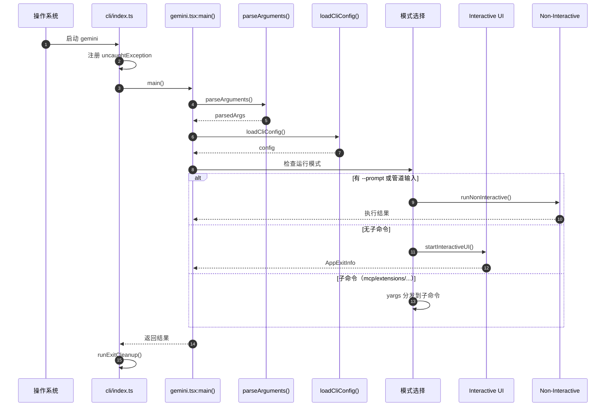
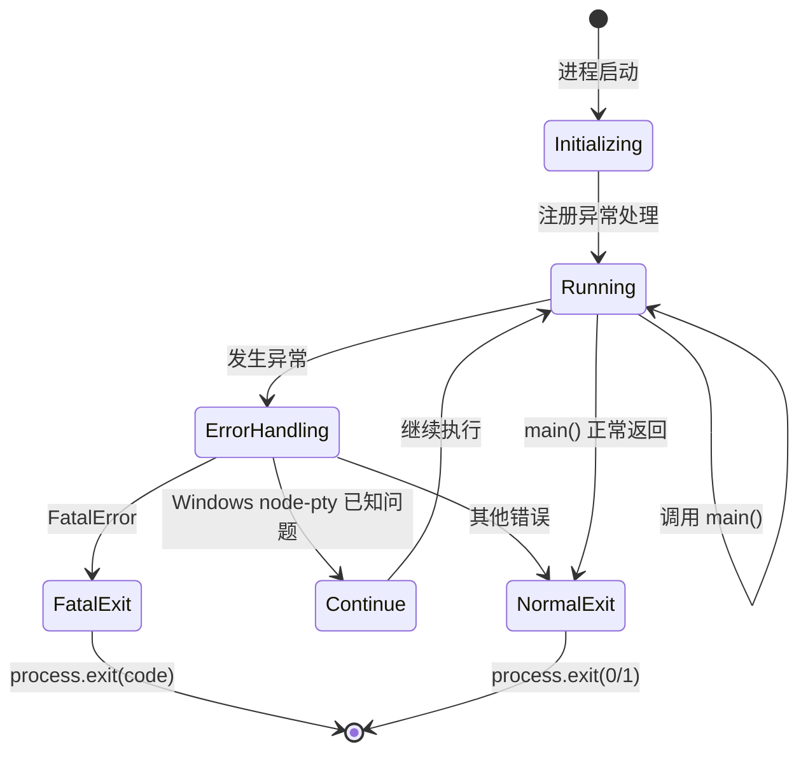
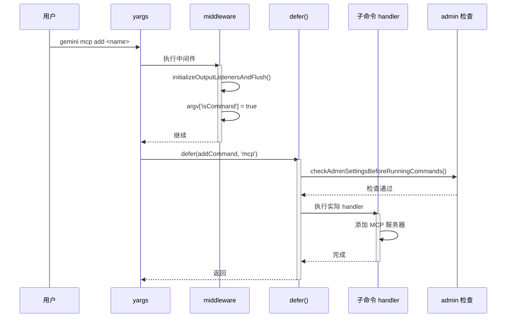
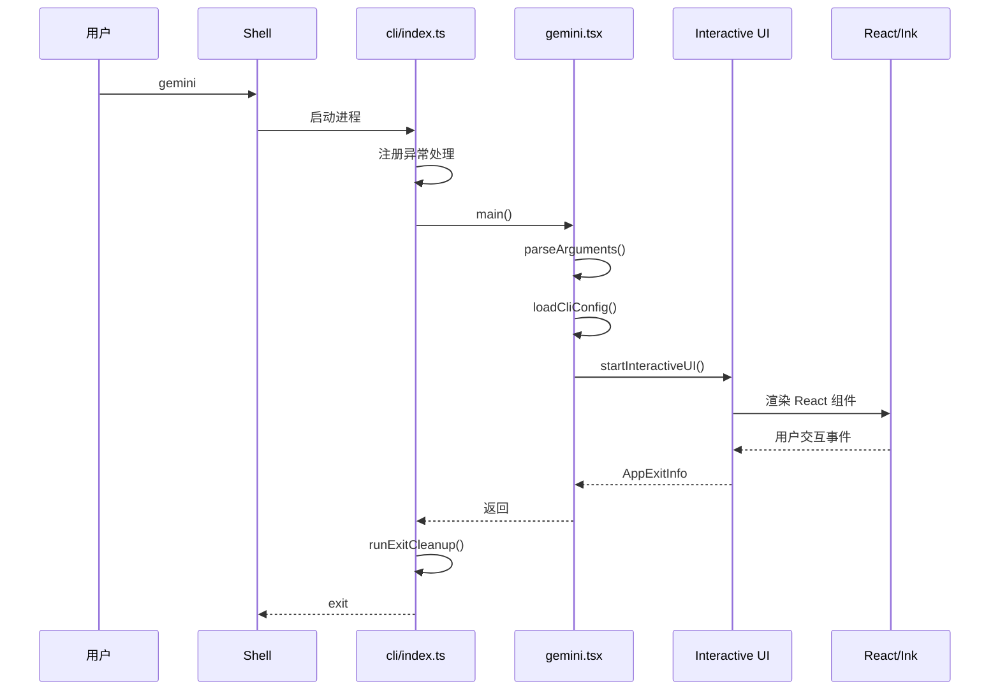
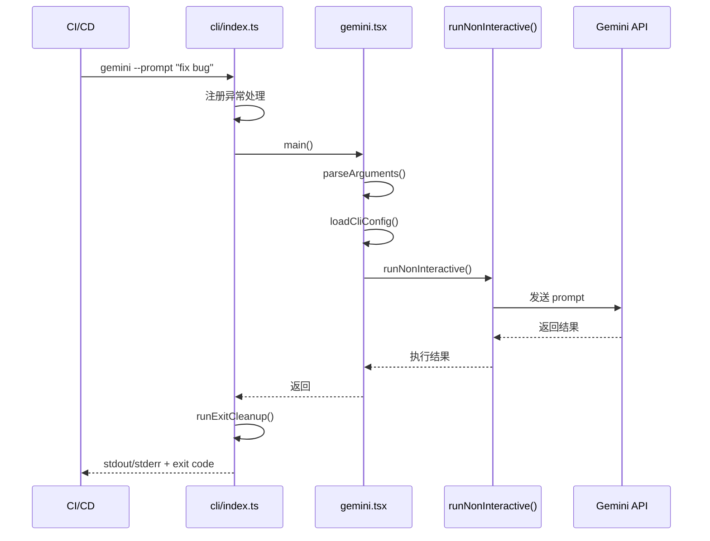
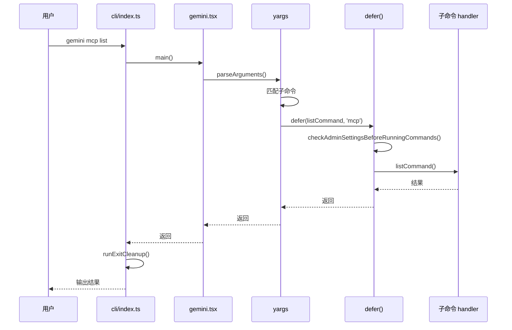
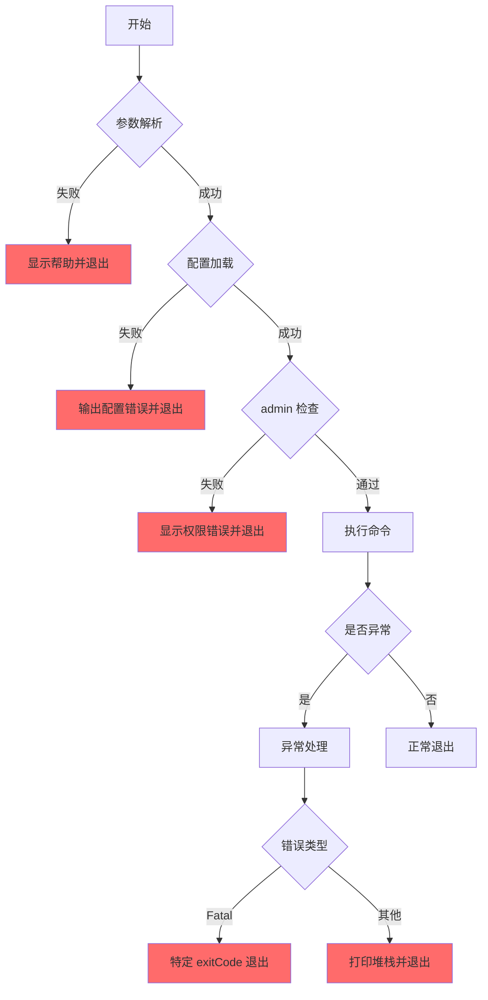
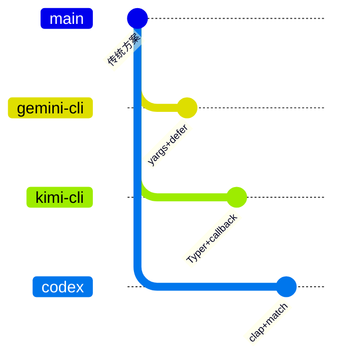

# CLI Entry（gemini-cli）

> **阅读指南**
>
> | 属性 | 说明 |
> |-----|------|
> | 预计阅读 | 15-20 分钟 |
> | 前置文档 | `01-gemini-cli-overview.md` |
> | 文档结构 | TL;DR → 架构 → 机制 → 实现 → 对比 |
> | 代码呈现 | 关键代码直接展示，完整代码可折叠查看 |

---

## TL;DR（结论先行）

一句话定义：Gemini CLI Entry 是 `gemini` 命令的总入口与分发层，采用「**yargs Command Module + 双模式架构**」设计，支持交互式 TUI（React/Ink）和非交互式 CLI 两种运行模式。

gemini-cli 的核心取舍：**延迟执行包装器 + 显式模式检测**（对比 Kimi CLI 的 Typer callback、Codex 的 clap 子命令枚举）

### 核心要点速览

| 维度 | 关键决策 | 代码位置 |
|-----|---------|---------|
| CLI 框架 | yargs Command Module | `packages/cli/src/gemini.tsx:45` |
| 模式检测 | `--prompt` / 管道输入检测 | `packages/cli/src/gemini.tsx:93` |
| 前置检查 | `defer()` 高阶函数包装 | `packages/cli/src/deferred.ts:15` |
| TUI 实现 | React/Ink 组件化渲染 | `packages/cli/src/gemini.tsx:156` |
| 异常处理 | 全局 `uncaughtException` | `packages/cli/index.ts:12` |

---

## 1. 为什么需要这个机制？

### 1.1 问题场景

```text
场景：同一个 gemini 命令既要支持日常交互式开发，也要支持 CI/CD 自动化调用

如果没有显式分发：
  gemini 在 CI 中可能意外进入 TUI -> 卡住等待用户输入

Gemini CLI 的做法：
  顶层 main 只做参数解析与模式分发
  - 无 --prompt 且非管道输入 -> 进入交互式 TUI
  - 有 --prompt 或管道输入 -> 非交互式执行后退出
  - 子命令（mcp/extensions/...）-> 对应命令处理
```

### 1.2 核心挑战

| 挑战 | 不解决的后果 |
|-----|-------------|
| 模式区分 | 交互模式与自动化模式互相干扰，CI 环境挂起 |
| 配置合并 | 不同来源配置冲突导致行为不确定 |
| 命令扩展 | 新增子命令需要修改核心入口，破坏封装 |
| 前置检查 | 每个子命令重复实现权限验证逻辑 |

---

## 2. 整体架构

### 2.1 在系统中的位置

```text
┌─────────────────────────────────────────────────────────────┐
│ 操作系统 / Shell                                             │
│ 用户输入: gemini [OPTIONS] [PROMPT] / gemini <SUBCOMMAND>    │
└───────────────────────┬─────────────────────────────────────┘
                        │ 启动进程
                        ▼
┌─────────────────────────────────────────────────────────────┐
│ ▓▓▓ Top-level CLI（packages/cli）▓▓▓                        │
│ packages/cli/index.ts                                        │
│ - 全局异常处理（uncaughtException）                          │
│ - main() 入口                                                │
└───────────────────────┬─────────────────────────────────────┘
                        │
                        ▼
┌─────────────────────────────────────────────────────────────┐
│ 主逻辑与模式分发                                             │
│ packages/cli/src/gemini.tsx                                  │
│ - parseArguments()    : yargs 参数解析                       │
│ - loadCliConfig()     : 配置加载                             │
│ - 模式选择: 交互式 vs 非交互式                               │
└───────────────────────┬─────────────────────────────────────┘
                        │
        ┌───────────────┼────────────────┬──────────────────┐
        ▼               ▼                ▼                  ▼
┌──────────────┐ ┌──────────────┐ ┌──────────────┐ ┌──────────────┐
│ Interactive  │ │ Non-Interac  │ │ 子命令        │ │ 其他         │
│ TUI 模式     │ │ tive 模式    │ │ mcp/ext/...  │ │ 配置命令     │
│              │ │              │ │              │ │              │
│ React/Ink    │ │ 单轮执行     │ │ defer()包装  │ │              │
│ 实时渲染     │ │ 输出后退出   │ │ 前置检查     │ │              │
└──────────────┘ └──────────────┘ └──────────────┘ └──────────────┘
```

### 2.2 核心组件职责

| 组件 | 职责 | 代码位置 |
|-----|------|---------|
| `index.ts` | 入口文件、全局异常处理 | `packages/cli/index.ts:1` |
| `main()` | 主逻辑入口、模式分发 | `packages/cli/src/gemini.tsx:89` |
| `parseArguments()` | yargs 参数解析 | `packages/cli/src/gemini.tsx:45` |
| `startInteractiveUI()` | 启动交互式 TUI | `packages/cli/src/gemini.tsx:156` |
| `runNonInteractive()` | 非交互式执行 | `packages/cli/src/gemini.tsx:203` |
| `defer()` | 延迟执行包装器（前置检查） | `packages/cli/src/deferred.ts:15` |
| `mcpCommand` | MCP 子命令组 | `packages/cli/src/commands/mcp.ts:23` |

### 2.3 组件交互时序



**关键交互说明**：

| 步骤 | 交互内容 | 设计意图 |
|-----|---------|---------|
| 1 | 注册全局异常处理 | 捕获未处理错误，统一格式化输出 |
| 2-3 | 参数解析与配置加载 | 分离关注点，配置可覆盖 |
| 4 | 模式选择 | 显式区分交互/非交互，避免 CI 挂起 |
| 5-6 | 执行对应模式 | 职责分离，TUI 与非交互独立实现 |

---

## 3. 核心组件详细分析

### 3.1 入口文件（index.ts）

#### 职责定位

入口文件负责全局异常处理和进程生命周期管理，将具体业务逻辑委托给 `gemini.tsx` 的 `main()` 函数。

#### 状态机图



**状态说明**：

| 状态 | 说明 | 进入条件 | 退出条件 |
|-----|------|---------|---------|
| Initializing | 初始化中 | 进程启动 | 异常处理注册完成 |
| Running | 正常运行 | main() 被调用 | 正常返回或异常 |
| ErrorHandling | 错误处理 | 发生未捕获异常 | 根据错误类型决定 |
| FatalExit | 致命退出 | FatalError | 进程终止 |
| NormalExit | 正常退出 | main() 完成 | 进程终止 |

#### 全局异常处理流程

```mermaid
flowchart TD
    Start[进程启动] --> Register[注册 uncaughtException]
    Register --> Main[调用 main()]

    Main --> Catch{是否抛出异常?}
    Catch -->|否| Normal[正常退出]
    Catch -->|是| ErrorType{错误类型}

    ErrorType -->|FatalError| Fatal[使用 exitCode 退出]
    ErrorType -->|Windows node-pty 已知问题| Ignore[忽略错误]
    ErrorType -->|其他| Stack[打印堆栈并退出]

    Fatal --> Exit[process.exit]
    Stack --> Exit
    Normal --> Exit
    Ignore --> Continue[继续运行]

    style Fatal fill:#FFB6C1
    style Ignore fill:#90EE90
```

**Windows node-pty 特殊处理**：

```typescript
// packages/cli/index.ts:12-18
process.on('uncaughtException', (error) => {
  // Windows node-pty 特殊处理
  if (process.platform === 'win32' &&
      error.message === 'Cannot resize a pty that has already exited') {
    return;  // 忽略已知 race condition
  }
  // ... 其他错误处理
});
```

#### 关键接口

| 接口 | 输入 | 输出 | 说明 | 代码位置 |
|-----|------|------|------|---------|
| `main()` | - | Promise<void> | 主逻辑入口 | `gemini.tsx:89` |
| `runExitCleanup()` | - | Promise<void> | 退出清理 | `utils/cleanup.ts:23` |

---

### 3.2 主逻辑与模式分发（gemini.tsx）

#### 职责定位

`main()` 函数是 CLI 的核心控制器，负责参数解析、配置加载和运行模式选择。

#### 内部数据流

```text
┌─────────────────────────────────────────────────────────────┐
│  输入层                                                      │
│  ├── 命令行参数 ──► parseArguments() ──► parsedArgs          │
│  └── 配置文件   ──► loadCliConfig()  ──► config              │
└──────────────────────────┬──────────────────────────────────┘
                           ▼
┌─────────────────────────────────────────────────────────────┐
│  处理层                                                      │
│  ├── 模式检测: --prompt? 管道输入? 子命令?                    │
│  ├── 交互式模式 ──► startInteractiveUI()                     │
│  │   └── React/Ink TUI 渲染                                  │
│  ├── 非交互式模式 ──► runNonInteractive()                    │
│  │   └── 单轮执行，输出后退出                                 │
│  └── 子命令模式 ──► yargs 分发到对应 handler                  │
└──────────────────────────┬──────────────────────────────────┘
                           ▼
┌─────────────────────────────────────────────────────────────┐
│  输出层                                                      │
│  ├── TUI 渲染结果                                            │
│  ├── 非交互式 stdout/stderr 输出                             │
│  └── 进程退出码                                              │
└─────────────────────────────────────────────────────────────┘
```

#### 关键算法逻辑

```mermaid
flowchart TD
    A[main() 开始] --> B[parseArguments]
    B --> C[loadCliConfig]
    C --> D{检查运行条件}

    D -->|有 --prompt| E[非交互式模式]
    D -->|管道输入| E
    D -->|有子命令| F[yargs 子命令分发]
    D -->|默认| G[交互式 TUI 模式]

    E --> H[runNonInteractive]
    G --> I[startInteractiveUI]
    F --> J[子命令处理]

    H --> K[输出结果并退出]
    I --> L[持续交互直到退出]
    J --> K

    K --> M[main() 结束]
    L --> M

    style G fill:#90EE90
    style E fill:#87CEEB
    style F fill:#FFD700
```

---

### 3.3 延迟执行包装器（deferred.ts）

#### 职责定位

`defer()` 是一个高阶函数，用于在子命令执行前统一执行前置检查（如 admin 设置验证）。

#### 实现原理

```typescript
// packages/cli/src/deferred.ts:15-28
export function defer<T>(
  handler: (args: ArgumentsCamelCase<T>) => void | Promise<void>,
  commandName: string,
): (args: ArgumentsCamelCase<T>) => Promise<void> {
  return async (args: ArgumentsCamelCase<T>): Promise<void> => {
    // 检查 admin 设置
    await checkAdminSettingsBeforeRunningCommands(commandName);
    return handler(args);
  };
}
```

**设计意图**：
1. **关注点分离**：将权限检查从业务逻辑中剥离
2. **代码复用**：所有子命令共享同一套检查逻辑
3. **延迟执行**：yargs 解析完成后才执行检查，避免无效开销

#### 使用示例

```typescript
// packages/cli/src/commands/mcp.ts:35-42
export const mcpCommand: CommandModule = {
  command: 'mcp',
  describe: 'Manage MCP servers',
  builder: (yargs: Argv) =>
    yargs
      .command(defer(addCommand, 'mcp'))      // 包装 add 命令
      .command(defer(removeCommand, 'mcp'))   // 包装 remove 命令
      .command(defer(listCommand, 'mcp'))     // 包装 list 命令
      // ...
};
```

---

### 3.4 子命令系统（Command Module 模式）

#### 职责定位

使用 yargs 的 Command Module 模式组织子命令，每个子命令独立定义在 `commands/` 目录下。

#### 子命令结构

```text
packages/cli/src/commands/
├── mcp.ts           # MCP 服务器管理
│   ├── mcp add      # 添加服务器
│   ├── mcp remove   # 移除服务器
│   ├── mcp list     # 列出服务器
│   ├── mcp enable   # 启用服务器
│   └── mcp disable  # 禁用服务器
├── extensions.tsx   # 扩展管理
│   ├── extensions install
│   ├── extensions uninstall
│   ├── extensions list
│   └── ...
├── skills.tsx       # 技能管理
├── hooks.tsx        # 钩子管理
└── ...
```

#### 组件间协作时序



---

## 4. 端到端数据流转

### 4.1 交互模式（TUI）



### 4.2 非交互模式



### 4.3 子命令模式



### 4.4 异常/边界流程



---

## 5. 关键代码实现

### 5.1 核心数据结构

```typescript
// packages/cli/src/config/config.ts
// 运行模式参数
interface CliConfig {
  // 运行模式
  prompt?: string;           // 非交互式执行后退出
  promptInteractive?: boolean;  // 执行后继续交互
  model?: string;            // 指定模型
  debug?: boolean;           // 调试模式
  yolo?: boolean;            // 自动接受所有操作
  approvalMode?: 'default' | 'auto_edit' | 'yolo' | 'plan';

  // 扩展与配置
  extensions?: string[];     // 指定扩展列表
  resume?: string;           // 恢复会话
  listSessions?: boolean;    // 列出会话
  outputFormat?: 'text' | 'json' | 'stream-json';
  sandbox?: boolean;         // 沙箱运行
}
```

### 5.2 主链路代码

```typescript
// packages/cli/src/gemini.tsx:89-150
async function main(): Promise<void> {
  // 1. 解析命令行参数
  const argv = await parseArguments();

  // 2. 加载配置
  const config = await loadCliConfig();

  // 3. 模式选择
  if (argv.prompt || isPipedInput()) {
    // 非交互式模式
    await runNonInteractive({
      prompt: argv.prompt,
      config,
      // ...
    });
  } else if (argv._.length === 0) {
    // 交互式 TUI 模式
    await startInteractiveUI({
      config,
      // ...
    });
  }
  // 子命令由 yargs 直接分发
}
```

**代码要点**：
1. **显式模式检测**：通过 `--prompt` 和管道输入检测区分交互/非交互模式
2. **配置分离**：参数解析和配置加载分离，支持配置覆盖
3. **子命令委托**：yargs 自动处理子命令分发，主逻辑只处理默认模式

### 5.3 关键调用链

```text
main()                          [packages/cli/index.ts:12]
  -> main()                     [packages/cli/src/gemini.tsx:89]
    -> parseArguments()         [packages/cli/src/gemini.tsx:45]
      - yargs 参数解析
    -> loadCliConfig()          [packages/cli/src/config/config.ts:23]
      - 加载多层配置
    -> 模式选择
      -> startInteractiveUI()   [packages/cli/src/gemini.tsx:156]
        - React/Ink TUI 渲染
      -> runNonInteractive()    [packages/cli/src/gemini.tsx:203]
        - 单轮执行
```

---

## 6. 设计意图与 Trade-off

### 6.1 Gemini CLI 的选择

| 维度 | Gemini CLI 的选择 | 替代方案 | 取舍分析 |
|-----|------------------|---------|---------|
| CLI 框架 | yargs (Node.js) | Typer (Python)、clap (Rust) | 生态丰富，但类型安全较弱 |
| 命令组织 | Command Module 模式 | 单一文件处理所有命令 | 模块清晰，但文件分散 |
| 前置检查 | defer() 高阶函数 | 中间件或装饰器 | 灵活可组合，但增加调用层级 |
| 模式区分 | 显式参数检测 | 自动检测 TTY | 可预测性高，但命令面更大 |
| TUI 实现 | React/Ink | 原生终端库 | 组件化开发，但有运行时开销 |

### 6.2 为什么这样设计？

**核心问题**：如何在支持丰富子命令的同时，保持代码可维护性和扩展性？

**Gemini CLI 的解决方案**：
- **代码依据**：`packages/cli/src/commands/mcp.ts:35-42`
- **设计意图**：使用 yargs Command Module + defer 包装器实现关注点分离
- **带来的好处**：
  - 每个子命令独立文件，职责清晰
  - 统一前置检查，避免重复代码
  - 延迟执行，按需加载
- **付出的代价**：
  - 函数嵌套层级增加
  - 调试时需要跟踪包装器

### 6.3 与其他项目的对比



| 项目 | CLI 框架 | 命令组织 | 前置检查 | 适用场景 |
|-----|---------|---------|---------|---------|
| **Gemini CLI** | yargs | Command Module + defer() | 高阶函数包装 | Node.js 生态，React TUI |
| **Kimi CLI** | Typer | Typer 子命令组 | callback 参数验证 | Python 类型安全 |
| **Codex** | clap | 子命令枚举显式分发 | 顶层 match 分发 | Rust 性能与安全 |
| **OpenCode** | commander | 子命令注册 | 中间件 | TypeScript 生态 |
| **SWE-agent** | argparse | 子命令解析器 | 直接验证 | Python 简单场景 |

**关键差异**：
- **Gemini CLI** 使用 yargs 的 Command Module 模式，通过 `defer()` 实现统一前置检查
- **Kimi CLI** 使用 Typer 的类型安全参数解析，通过 `callback` 实现主命令逻辑
- **Codex** 使用 Rust 的 clap，通过显式的 `match` 分发子命令，编译期检查更严格
- **OpenCode** 使用 commander，通过中间件实现前置处理
- **SWE-agent** 使用 argparse，简单直接但功能有限

---

## 7. 边界情况与错误处理

### 7.1 终止条件

| 终止原因 | 触发条件 | 代码位置 |
|---------|---------|---------|
| 正常退出 | 用户退出 TUI 或非交互式执行完成 | `gemini.tsx:156` |
| 参数错误 | yargs 解析失败 | `gemini.tsx:45` |
| 配置错误 | 配置文件格式非法 | `config/config.ts:23` |
| 权限错误 | admin 检查失败 | `deferred.ts:19` |
| 未捕获异常 | 运行时错误 | `index.ts:12` |

### 7.2 平台适配

```typescript
// packages/cli/index.ts:12-18
process.on('uncaughtException', (error) => {
  // Windows node-pty 特殊处理
  if (process.platform === 'win32' &&
      error.message === 'Cannot resize a pty that has already exited') {
    return;  // 忽略已知 race condition
  }
  // ... 其他错误处理
});
```

### 7.3 错误恢复策略

| 错误类型 | 处理策略 | 代码位置 |
|---------|---------|---------|
| FatalError | 使用特定 exitCode 退出 | `index.ts:25` |
| Windows node-pty | 静默忽略 | `index.ts:15` |
| 其他异常 | 打印堆栈并退出码 1 | `index.ts:27` |

---

## 8. 关键代码索引

| 功能 | 文件 | 行号 | 说明 |
|-----|------|------|------|
| 入口 | `packages/cli/index.ts` | 1 | 全局异常处理、进程入口 |
| 主逻辑 | `packages/cli/src/gemini.tsx` | 89 | 参数解析、模式分发 |
| 参数解析 | `packages/cli/src/gemini.tsx` | 45 | yargs 配置 |
| 配置加载 | `packages/cli/src/config/config.ts` | 23 | 多层配置合并 |
| 延迟执行 | `packages/cli/src/deferred.ts` | 15 | defer() 包装器 |
| MCP 命令 | `packages/cli/src/commands/mcp.ts` | 23 | 子命令示例 |
| 扩展命令 | `packages/cli/src/commands/extensions.tsx` | 1 | 扩展管理 |
| 技能命令 | `packages/cli/src/commands/skills.tsx` | 1 | 技能管理 |
| 退出清理 | `packages/cli/src/utils/cleanup.ts` | 23 | runExitCleanup() |

---

## 9. 延伸阅读

- 概览：`01-gemini-cli-overview.md`
- Session Runtime: `03-gemini-cli-session-runtime.md`
- Agent Loop：`04-gemini-cli-agent-loop.md`
- MCP Integration：`06-gemini-cli-mcp-integration.md`
- 对比参考：
  - Codex CLI Entry：`docs/codex/02-codex-cli-entry.md`
  - Kimi CLI Entry：`docs/kimi-cli/02-kimi-cli-cli-entry.md`

---

*✅ Verified: 基于 gemini-cli/packages/cli 源码分析*
*基于版本：2026-02-08 | 最后更新：2026-03-03*
