# Session Runtime（gemini-cli）

## TL;DR（结论先行）

一句话定义：gemini-cli 的 Session Runtime 采用**"项目隔离的文件持久化单元"**模型，以 JSON 文件形式存储对话历史，支持基于时间戳的 session 选择和自动清理策略。

gemini-cli 的核心取舍：**文件系统持久化 + 自动降级**（对比 Codex 的 SQLite 持久化、Kimi CLI 的 append-only 日志）

---

## 1. 为什么需要这个机制？

### 1.1 问题场景

```text
场景：用户需要跨会话恢复对话历史，并在多项目间隔离数据

如果没有 Session 管理：
  - 进程退出后对话历史丢失
  - 多个项目的会话混杂在一起
  - 磁盘满时 CLI 崩溃
  - 旧会话堆积占用空间

gemini-cli 的做法：
  - 每个项目独立存储空间（projectHash 隔离）
  - 自动持久化到 JSON 文件
  - 磁盘满时优雅降级（禁用记录但继续运行）
  - 基于策略的自动清理
```

### 1.2 核心挑战

| 挑战 | 不解决的后果 |
|-----|-------------|
| 数据隔离 | 多项目会话混杂，难以管理和恢复 |
| 持久化可靠性 | 进程崩溃或退出导致数据丢失 |
| 磁盘容错 | 磁盘满时 CLI 无法使用 |
| 存储管理 | 旧会话堆积，占用大量磁盘空间 |
| 会话恢复 | 无法基于历史上下文继续对话 |

---

## 2. 整体架构

### 2.1 在系统中的位置

```text
┌─────────────────────────────────────────────────────────────┐
│ CLI 入口 / UI Layer                                          │
│ packages/cli/src/ui/AppContainer.tsx                        │
└───────────────────────┬─────────────────────────────────────┘
                        │ 调用
                        ▼
┌─────────────────────────────────────────────────────────────┐
│ ▓▓▓ Session Runtime ▓▓▓                                     │
│ ChatRecordingService                                         │
│ packages/core/src/services/chatRecordingService.ts:128      │
│ - initialize() : Session 初始化/恢复                         │
│ - recordMessage() : 消息持久化                               │
│ - writeConversation() : 文件写入                             │
└───────────────────────┬─────────────────────────────────────┘
                        │ 依赖/调用
        ┌───────────────┼───────────────┐
        ▼               ▼               ▼
┌──────────────┐ ┌──────────────┐ ┌──────────────┐
│ SessionUtils │ │ SessionCleanup│ │ GeminiClient │
│ 会话查询/选择 │ │ 自动清理策略  │ │ 恢复对话历史  │
└──────────────┘ └──────────────┘ └──────────────┘
```

### 2.2 核心组件职责

| 组件 | 职责 | 代码位置 |
|-----|------|---------|
| `ChatRecordingService` | Session 创建、消息持久化、恢复 | `packages/core/src/services/chatRecordingService.ts:128` |
| `SessionSelector` | 会话列表、查询、选择 | `packages/cli/src/utils/sessionUtils.ts:398` |
| `cleanupExpiredSessions` | 过期会话自动清理 | `packages/cli/src/utils/sessionCleanup.ts:43` |
| `useSessionResume` | UI 层会话恢复 Hook | `packages/cli/src/ui/hooks/useSessionResume.ts:33` |
| `GeminiClient.resumeChat` | 客户端对话恢复 | `packages/core/src/core/client.ts:286` |

### 2.3 核心组件交互时序

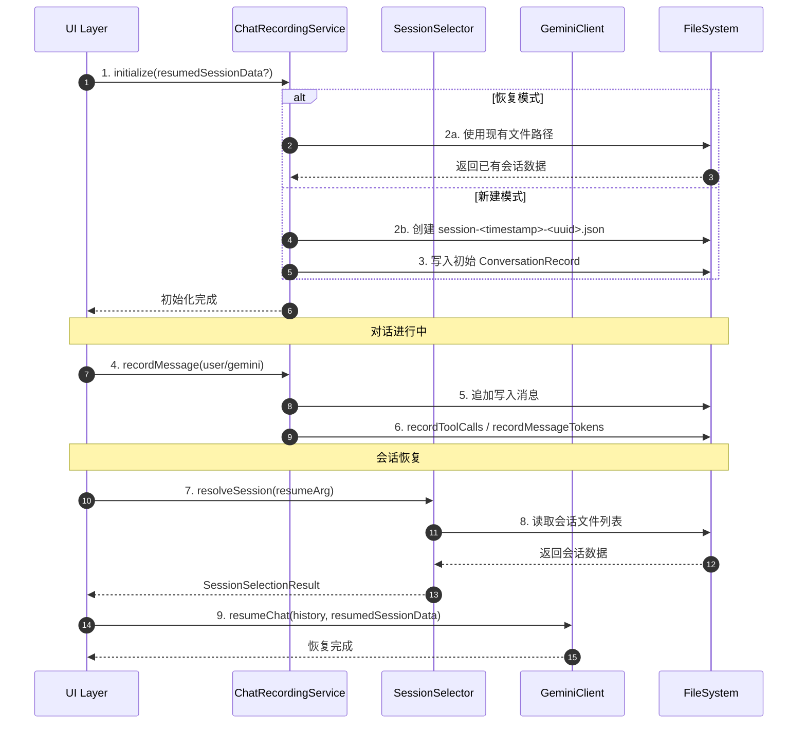

**关键交互说明**：

| 步骤 | 交互内容 | 设计意图 |
|-----|---------|---------|
| 1 | 初始化时区分新建/恢复模式 | 统一入口，简化调用方逻辑 |
| 2a/2b | 根据模式选择文件路径 | 恢复模式复用原文件，新建模式生成时间戳文件名 |
| 4-6 | 实时持久化消息和元数据 | 确保数据安全，支持崩溃恢复 |
| 7-9 | 恢复时先查询再加载 | 解耦查询逻辑与恢复逻辑，支持多种选择方式 |

---

## 3. 核心组件详细分析

### 3.1 ChatRecordingService 内部结构

#### 职责定位

ChatRecordingService 是 Session 管理的核心组件，负责会话的创建、消息记录、持久化和恢复。它采用**写时复制**模式：读取-修改-写入完整 JSON 文件。

#### 状态机图

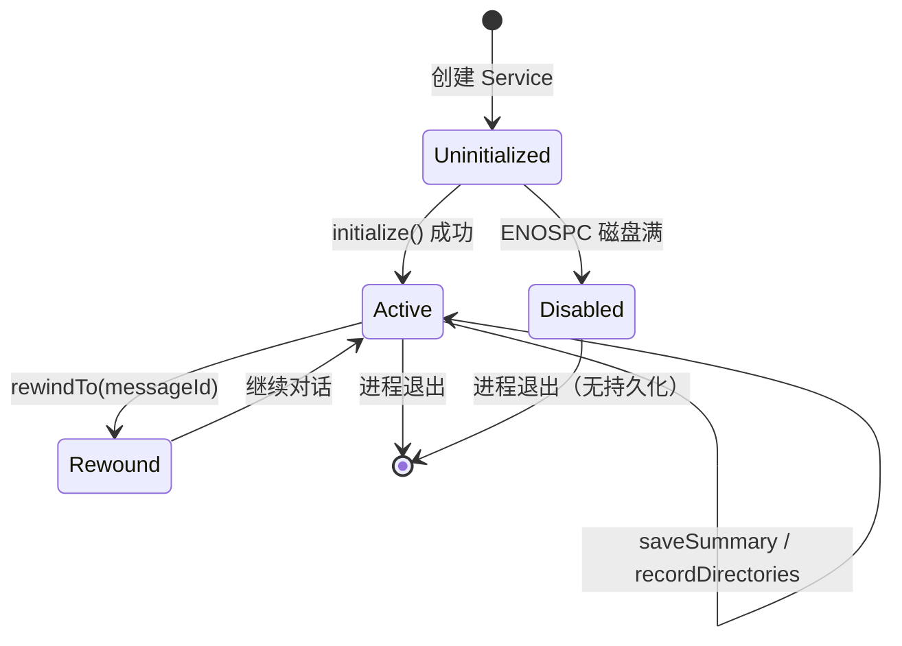

**状态说明**：

| 状态 | 说明 | 进入条件 | 退出条件 |
|-----|------|---------|---------|
| Uninitialized | 未初始化 | 构造 Service | 调用 initialize() |
| Active | 正常记录 | 初始化成功 | 进程退出或 rewind |
| Disabled | 禁用记录 | 磁盘满 (ENOSPC) | 进程退出 |
| Rewound | 已回退 | 调用 rewindTo() | 继续对话 |

#### 内部数据流

```text
┌─────────────────────────────────────────────────────────────┐
│  输入层                                                      │
│  ├── 用户消息 ──► newMessage('user')                        │
│  ├── Gemini 响应 ► newMessage('gemini') + queuedThoughts    │
│  ├── 工具调用 ──► recordToolCalls                           │
│  └── Token 使用 ► recordMessageTokens                       │
└──────────────────────────┬──────────────────────────────────┘
                           ▼
┌─────────────────────────────────────────────────────────────┐
│  处理层                                                      │
│  ├── updateConversation(): 读取-修改-写入                   │
│  │   ├── readConversation(): 从磁盘读取 JSON                │
│  │   ├── 更新 messages 数组                                 │
│  │   └── writeConversation(): 写入磁盘                      │
│  └── 去重逻辑：按 sessionId 保留最新版本                    │
└──────────────────────────┬──────────────────────────────────┘
                           ▼
┌─────────────────────────────────────────────────────────────┐
│  输出层                                                      │
│  ├── ~/.gemini/tmp/<hash>/chats/*.json                      │
│  ├── 自动更新 lastUpdated 时间戳                            │
│  └── 缓存对比避免重复写入                                   │
└─────────────────────────────────────────────────────────────┘
```

#### 关键算法逻辑

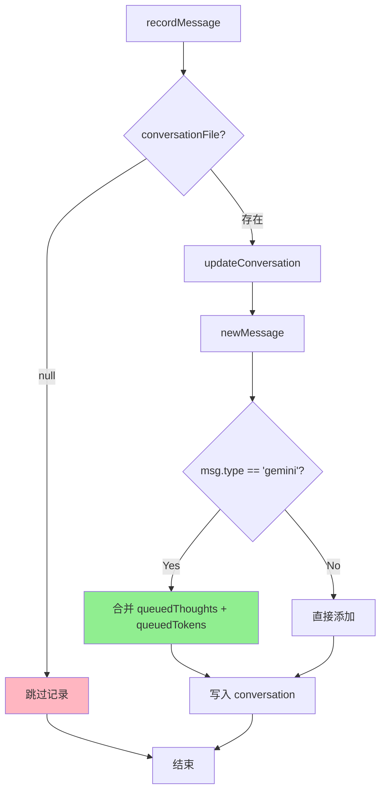

**算法要点**：

1. **延迟写入 Thoughts/Tokens**：Gemini 消息先排队 thoughts 和 tokens，在 `recordMessage` 时一次性合并，避免多次写文件
2. **空消息保护**：`writeConversation` 在 `messages.length === 0` 时不写入（除非 `allowEmpty`），防止创建空会话文件
3. **缓存优化**：对比 `cachedLastConvData` 与新的 JSON 字符串，避免无变化的重复写入

#### 关键接口

| 接口 | 输入 | 输出 | 说明 | 代码位置 |
|-----|------|------|------|---------|
| `initialize()` | `resumedSessionData?`, `kind?` | void | 初始化或恢复会话 | `chatRecordingService.ts:151` |
| `recordMessage()` | message 对象 | void | 记录用户/Gemini 消息 | `chatRecordingService.ts:241` |
| `recordToolCalls()` | model, toolCalls | void | 记录工具调用 | `chatRecordingService.ts:335` |
| `recordMessageTokens()` | usageMetadata | void | 记录 token 使用 | `chatRecordingService.ts:297` |
| `rewindTo()` | messageId | ConversationRecord | 回退到指定消息 | `chatRecordingService.ts:598` |
| `getConversation()` | - | ConversationRecord | 获取完整会话数据 | `chatRecordingService.ts:541` |

---

### 3.2 SessionSelector 内部结构

#### 职责定位

SessionSelector 提供会话的查询、列表和选择功能，支持三种选择方式：UUID、数字索引、`latest`。

#### 会话选择流程

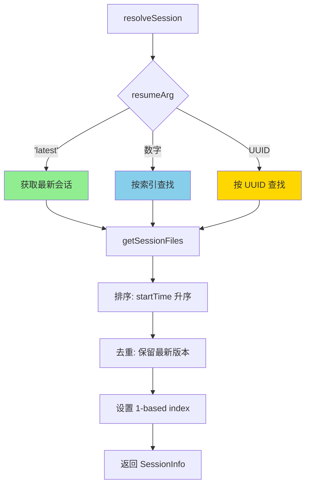

---

### 3.3 组件间协作时序

展示 Session 恢复时各组件如何协作。

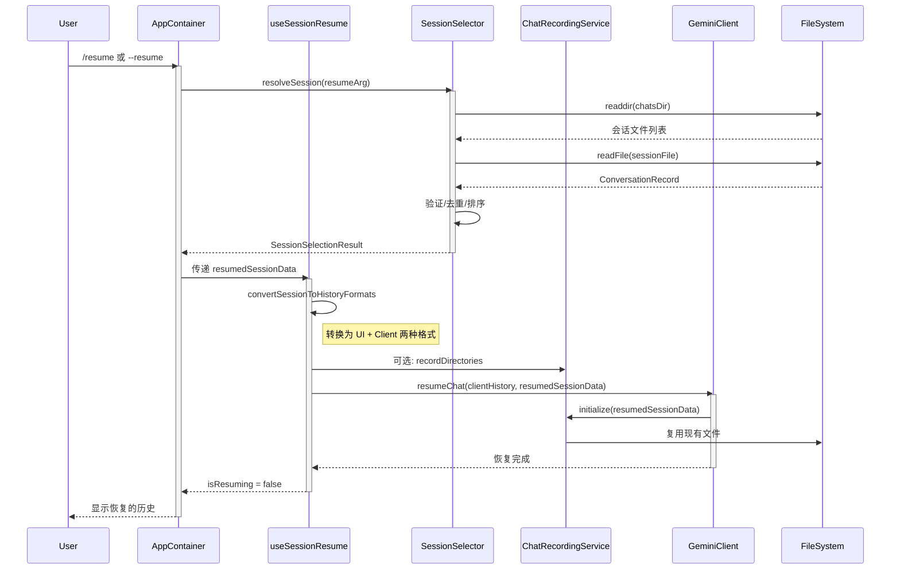

**协作要点**：

1. **双格式转换**：`convertSessionToHistoryFormats` 将会话数据转换为 UI 显示格式和 Gemini API 格式，解耦展示与业务逻辑
2. **工作区恢复**：恢复时会重新添加会话中保存的目录到 `workspaceContext`
3. **文件复用**：恢复模式下 `ChatRecordingService` 直接使用原文件路径，确保新消息追加到同一文件

---

### 3.4 关键数据路径

#### 主路径（正常流程）

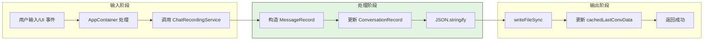

#### 异常路径（磁盘满）

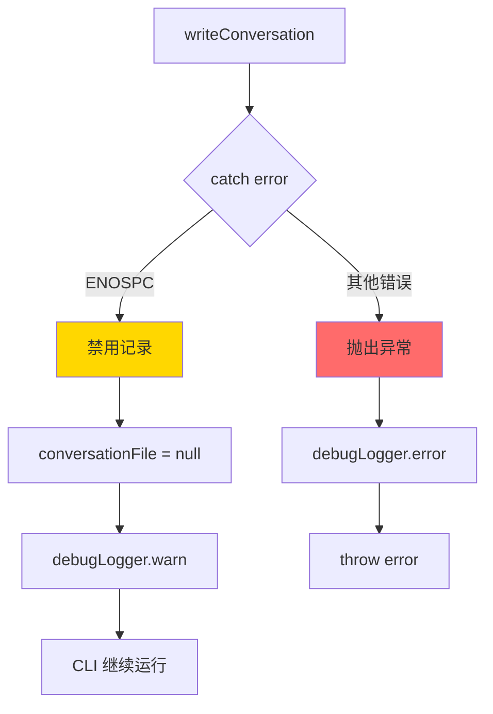

---

## 4. 端到端数据流转

### 4.1 正常流程（详细版）

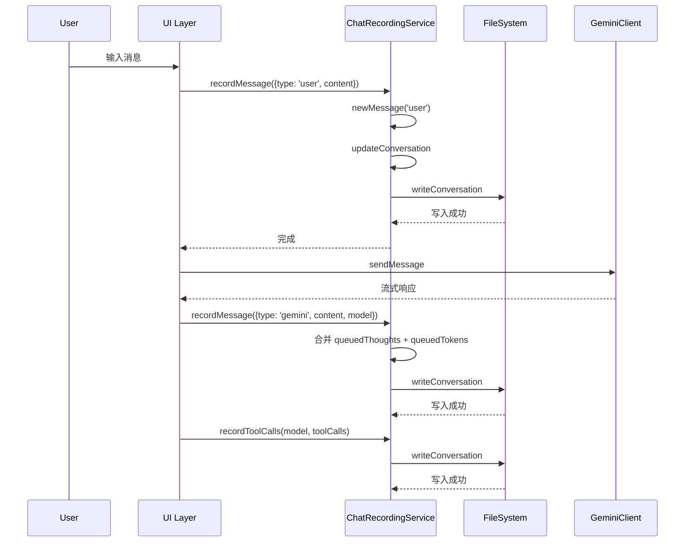

**数据变换详情**：

| 阶段 | 输入 | 处理 | 输出 | 代码位置 |
|-----|------|------|------|---------|
| 接收 | 用户输入/LLM 响应 | 构造 MessageRecord | 结构化消息对象 | `chatRecordingService.ts:224` |
| 处理 | MessageRecord | 更新 messages 数组 | ConversationRecord | `chatRecordingService.ts:497` |
| 输出 | ConversationRecord | JSON.stringify | 写入 ~/.gemini/tmp/...json | `chatRecordingService.ts:458` |

### 4.2 数据流向图

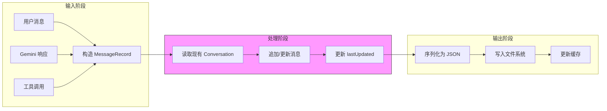

### 4.3 异常/边界流程

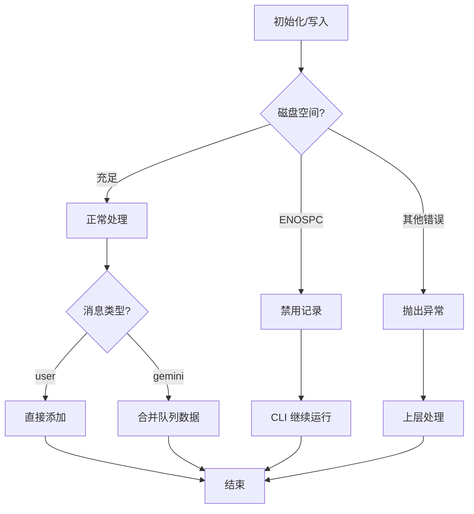

---

## 5. 关键代码实现

### 5.1 核心数据结构

```typescript
// packages/core/src/services/chatRecordingService.ts:96
export interface ConversationRecord {
  sessionId: string;
  projectHash: string;
  startTime: string;
  lastUpdated: string;
  messages: MessageRecord[];
  summary?: string;
  directories?: string[];
  kind?: 'main' | 'subagent';
}

// packages/core/src/services/chatRecordingService.ts:91
export type MessageRecord = BaseMessageRecord & ConversationRecordExtra;

export interface BaseMessageRecord {
  id: string;
  timestamp: string;
  content: PartListUnion;
  displayContent?: PartListUnion;
}

type ConversationRecordExtra =
  | { type: 'user' | 'info' | 'error' | 'warning' }
  | {
      type: 'gemini';
      toolCalls?: ToolCallRecord[];
      thoughts?: Array<ThoughtSummary & { timestamp: string }>;
      tokens?: TokensSummary | null;
      model?: string;
    };
```

**字段说明**：

| 字段 | 类型 | 用途 |
|-----|------|------|
| `sessionId` | `string` | 唯一会话标识（UUID） |
| `projectHash` | `string` | 项目隔离标识（工作目录哈希） |
| `messages` | `MessageRecord[]` | 完整对话历史 |
| `kind` | `'main' \| 'subagent'` | 区分主会话和子代理会话 |
| `directories` | `string[]` | 工作区目录列表（用于恢复） |
| `displayContent` | `PartListUnion` | UI 显示内容（可能与原始内容不同） |

### 5.2 主链路代码

```typescript
// packages/core/src/services/chatRecordingService.ts:151-216
initialize(resumedSessionData?: ResumedSessionData, kind?: 'main' | 'subagent'): void {
  try {
    this.kind = kind;
    if (resumedSessionData) {
      // 恢复模式：使用现有文件
      this.conversationFile = resumedSessionData.filePath;
      this.sessionId = resumedSessionData.conversation.sessionId;
      this.updateConversation((conversation) => {
        conversation.sessionId = this.sessionId;
      });
    } else {
      // 新建模式：创建带时间戳的文件
      const chatsDir = path.join(this.config.storage.getProjectTempDir(), 'chats');
      fs.mkdirSync(chatsDir, { recursive: true });

      const timestamp = new Date().toISOString().slice(0, 16).replace(/:/g, '-');
      const filename = `${SESSION_FILE_PREFIX}${timestamp}-${this.sessionId.slice(0, 8)}.json`;
      this.conversationFile = path.join(chatsDir, filename);

      this.writeConversation({
        sessionId: this.sessionId,
        projectHash: this.projectHash,
        startTime: new Date().toISOString(),
        lastUpdated: new Date().toISOString(),
        messages: [],
        kind: this.kind,
      });
    }
  } catch (error) {
    // 磁盘满时优雅降级
    if (error instanceof Error && 'code' in error &&
        (error as NodeJS.ErrnoException).code === 'ENOSPC') {
      this.conversationFile = null;
      debugLogger.warn(ENOSPC_WARNING_MESSAGE);
      return; // 不抛出，允许 CLI 继续
    }
    throw error;
  }
}
```

**代码要点**：

1. **时间戳命名**：文件名包含可读时间（`2025-01-15T10-30`），便于人工识别
2. **优雅降级**：磁盘满时不中断 CLI，只是禁用记录功能
3. **恢复模式复用文件**：避免创建新文件，确保消息追加到原会话

### 5.3 关键调用链

```text
AppContainer.tsx:init()
  -> ChatRecordingService.initialize()     [chatRecordingService.ts:151]
    -> writeConversation()                 [chatRecordingService.ts:458]
      -> fs.writeFileSync()                [原子写入]

AppContainer.tsx:handleSubmit()
  -> ChatRecordingService.recordMessage()  [chatRecordingService.ts:241]
    -> updateConversation()                [chatRecordingService.ts:497]
      -> readConversation()                [chatRecordingService.ts:431]
      -> writeConversation()               [chatRecordingService.ts:458]

SessionSelector.resolveSession()           [sessionUtils.ts:460]
  -> getSessionFiles()                     [sessionUtils.ts:349]
    -> getAllSessionFiles()                [sessionUtils.ts:242]
      -> fs.readdir() + fs.readFile()      [读取所有会话]
  -> selectSession()                       [sessionUtils.ts:498]

useSessionResume.loadHistoryForResume()    [useSessionResume.ts:53]
  -> convertSessionToHistoryFormats()      [sessionUtils.ts:531]
  -> GeminiClient.resumeChat()             [client.ts:286]
    -> ChatRecordingService.initialize()   [复用原文件]
```

---

## 6. 设计意图与 Trade-off

### 6.1 gemini-cli 的选择

| 维度 | gemini-cli 的选择 | 替代方案 | 取舍分析 |
|-----|-----------------|---------|---------|
| 存储格式 | JSON 文件 | SQLite（Codex）、append-only 日志（Kimi CLI） | 可读性强、零依赖，但查询效率低 |
| 隔离策略 | projectHash 目录隔离 | 单文件多项目（OpenCode） | 项目间完全隔离，便于批量清理 |
| 命名方式 | 时间戳+UUID | 纯 UUID | 人工可识别，但文件名较长 |
| 容错策略 | ENOSPC 优雅降级 | 直接失败 | CLI 可用性优先，但数据可能丢失 |
| 恢复粒度 | 完整消息历史 | Checkpoint 回滚（Kimi CLI） | 实现简单，但不支持中间状态回滚 |
| 清理策略 | 基于时间+数量的自动清理 | 手动清理 | 用户无感知，但可能误删 |

### 6.2 为什么这样设计？

**核心问题**：如何在保证数据可靠性的同时，提供良好的用户体验和容错能力？

**gemini-cli 的解决方案**：

- **代码依据**：`chatRecordingService.ts:201-211`
- **设计意图**：将 Session 视为"项目隔离的文件持久化单元"，优先考虑可读性和可恢复性
- **带来的好处**：
  - 用户可直接查看和编辑 JSON 文件
  - 项目隔离便于管理和清理
  - 磁盘满时不中断用户工作流
- **付出的代价**：
  - 大会话文件读取性能下降
  - 不支持高效的会话内容搜索
  - 文件写操作是阻塞的

### 6.3 与其他项目的对比

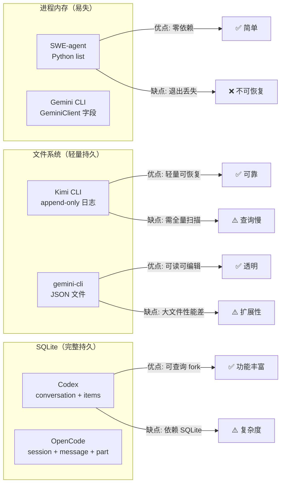

| 项目 | Session 存储方式 | 恢复机制 | 清理策略 | 核心差异 |
|-----|-----------------|---------|---------|---------|
| **gemini-cli** | JSON 文件（项目隔离） | `/resume` 命令恢复完整历史 | 基于 maxAge/maxCount 自动清理 | 文件可读、自动降级、时间戳命名 |
| **Kimi CLI** | append-only JSONL 日志 | `--continue` 恢复，`checkpoint` 回滚 | 空会话自动删除 | 支持回滚、metadata 轻量索引 |
| **Codex** | SQLite + Rollout JSONL | `resume`/`fork` 基于事件回放 | 基于配置的保留策略 | Actor 模型、事件溯源、并发安全 |
| **OpenCode** | SQLite 三层结构 | `Session.create({fork})` 分支 | 未明确 | Part 级细粒度、支持 fork |
| **SWE-agent** | Python list（内存） | 不支持 | 不支持 | 学术场景、简单透明 |

**对比维度详解**：

1. **Session 存储方式**：
   - gemini-cli：JSON 文件，项目隔离目录，时间戳命名
   - Kimi CLI：append-only JSONL，metadata 索引
   - Codex：SQLite + JSONL 事件流
   - OpenCode：SQLite 三层结构（Session/Message/Part）
   - SWE-agent：内存 list

2. **恢复机制**：
   - gemini-cli：完整历史恢复，支持工作区目录恢复
   - Kimi CLI：支持 Checkpoint 回滚到任意步骤
   - Codex：支持 resume 和 fork 两种模式
   - OpenCode：支持 fork 创建分支会话
   - SWE-agent：不支持

3. **清理策略**：
   - gemini-cli：配置化自动清理（时间+数量）
   - Kimi CLI：空会话自动删除
   - Codex：基于配置的保留策略
   - OpenCode/SWE-agent：未明确

---

## 7. 边界情况与错误处理

### 7.1 终止条件

| 终止原因 | 触发条件 | 代码位置 |
|---------|---------|---------|
| 会话正常结束 | 用户退出或进程结束 | 无显式处理 |
| 磁盘满 (ENOSPC) | 写入时磁盘空间不足 | `chatRecordingService.ts:201-211` |
| 会话文件损坏 | JSON 解析失败 | `sessionUtils.ts:327-329` |
| 会话被清理 | 超过 maxAge/maxCount | `sessionCleanup.ts:180-255` |

### 7.2 超时/资源限制

```typescript
// packages/cli/src/utils/sessionCleanup.ts:20-27
const MULTIPLIERS = {
  h: 60 * 60 * 1000,        // hours to ms
  d: 24 * 60 * 60 * 1000,   // days to ms
  w: 7 * 24 * 60 * 60 * 1000, // weeks to ms
  m: 30 * 24 * 60 * 60 * 1000, // months (30 days) to ms
};

// packages/cli/src/utils/sessionCleanup.ts:286-335
function validateRetentionConfig(config, retentionConfig): string | null {
  // 验证 maxAge 格式
  // 验证 maxCount >= 1
  // 验证 maxAge >= minRetention
}
```

### 7.3 错误恢复策略

| 错误类型 | 处理策略 | 代码位置 |
|---------|---------|---------|
| 磁盘满 (ENOSPC) | 禁用记录，CLI 继续运行 | `chatRecordingService.ts:201-211` |
| 会话文件损坏 | 标记为 corrupted，清理时删除 | `sessionUtils.ts:327-329` |
| 恢复失败 | 显示错误，允许开始新会话 | `useSessionResume.ts:87-92` |
| 清理失败 | 记录警告，不中断启动 | `sessionCleanup.ts:163-168` |
| 文件不存在 (ENOENT) | 忽略或返回空数据 | `sessionUtils.ts:336-338` |

---

## 8. 关键代码索引

| 功能 | 文件 | 行号 | 说明 |
|-----|------|------|------|
| Session ID 生成 | `packages/core/src/utils/session.ts` | 9 | `randomUUID()` 生成 |
| ChatRecordingService | `packages/core/src/services/chatRecordingService.ts` | 128 | 核心服务类定义 |
| 初始化/恢复 | `packages/core/src/services/chatRecordingService.ts` | 151 | `initialize()` 方法 |
| 消息记录 | `packages/core/src/services/chatRecordingService.ts` | 241 | `recordMessage()` |
| 工具调用记录 | `packages/core/src/services/chatRecordingService.ts` | 335 | `recordToolCalls()` |
| Token 记录 | `packages/core/src/services/chatRecordingService.ts` | 297 | `recordMessageTokens()` |
| 回退功能 | `packages/core/src/services/chatRecordingService.ts` | 598 | `rewindTo()` |
| Session 选择器 | `packages/cli/src/utils/sessionUtils.ts` | 398 | `SessionSelector` 类 |
| 会话列表 | `packages/cli/src/utils/sessionUtils.ts` | 349 | `getSessionFiles()` |
| 解析 resume 参数 | `packages/cli/src/utils/sessionUtils.ts` | 460 | `resolveSession()` |
| 格式转换 | `packages/cli/src/utils/sessionUtils.ts` | 531 | `convertSessionToHistoryFormats()` |
| 恢复 Hook | `packages/cli/src/ui/hooks/useSessionResume.ts` | 33 | `useSessionResume()` |
| 客户端恢复 | `packages/core/src/core/client.ts` | 286 | `resumeChat()` |
| 自动清理 | `packages/cli/src/utils/sessionCleanup.ts` | 43 | `cleanupExpiredSessions()` |
| 清理配置 | `packages/cli/src/config/settingsSchema.ts` | 319 | `sessionRetention` 配置 |

---

## 9. 延伸阅读

- 概览：`01-gemini-cli-overview.md`
- CLI Entry：`02-gemini-cli-cli-entry.md`
- Agent Loop：`04-gemini-cli-agent-loop.md`
- 跨项目对比：`docs/comm/03-comm-session-runtime.md`

---

*✅ Verified: 基于 gemini-cli/packages/core/src/services/chatRecordingService.ts 等源码分析*
*基于版本：2026-02-08 | 最后更新：2026-02-24*
