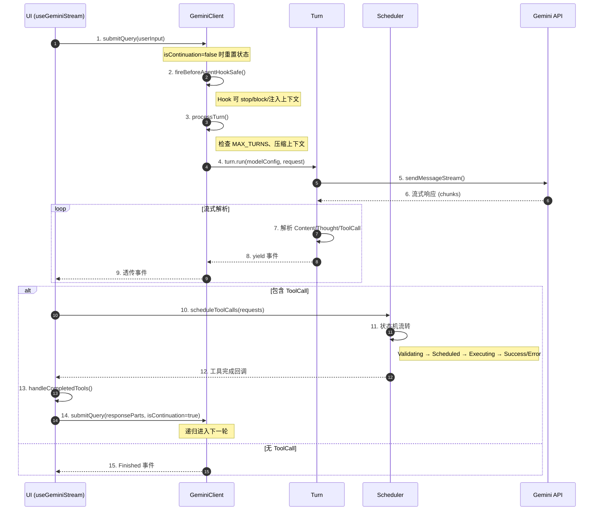
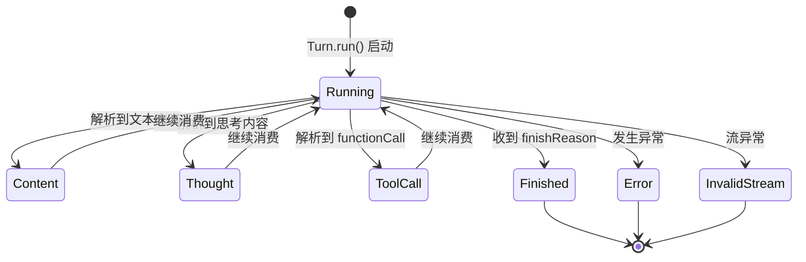
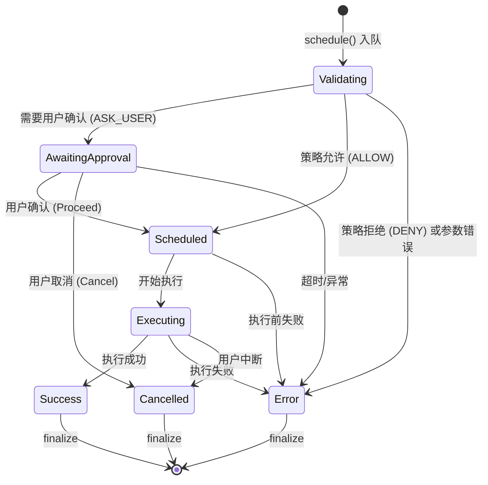
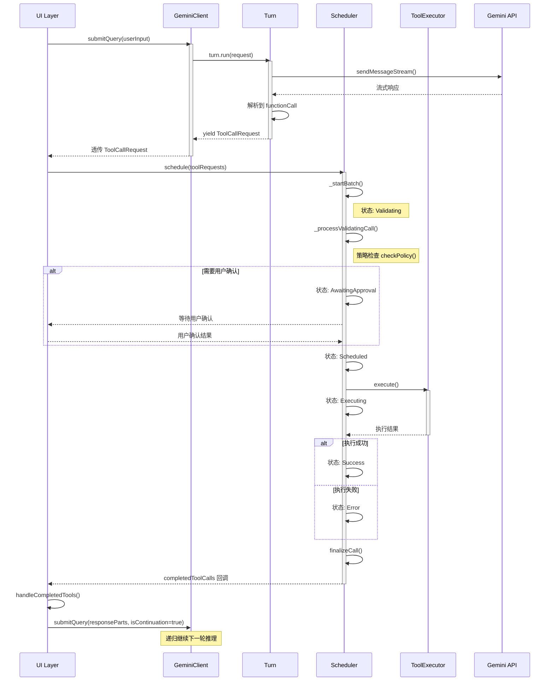
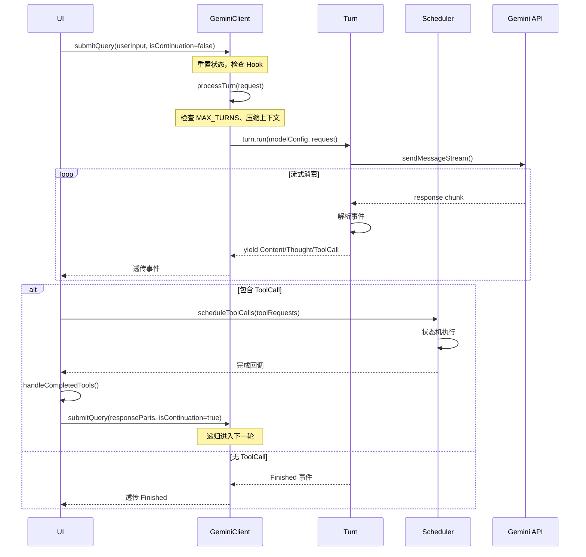
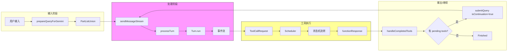
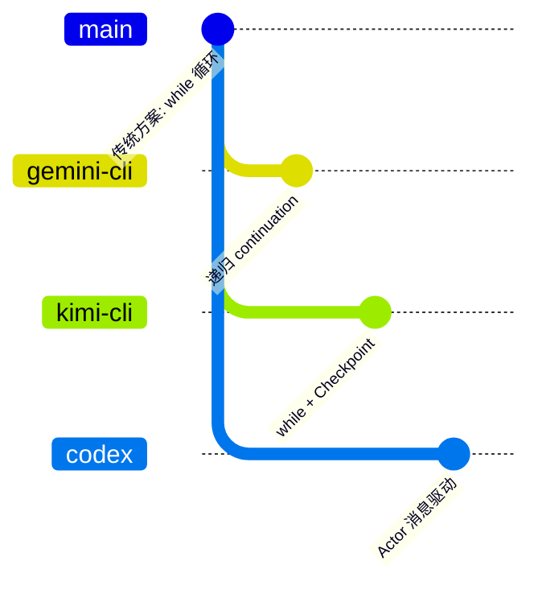

# Agent Loop（Gemini CLI）

## TL;DR（结论先行）

一句话定义：Agent Loop 是驱动多轮 LLM 调用与工具执行的循环控制机制，让模型从"一次性回答"变成"多轮迭代执行"。

Gemini CLI 的核心取舍：**递归 continuation 驱动 + Scheduler 状态机**（对比 Kimi CLI 的 while 循环 + Checkpoint、Codex 的 Actor 消息驱动）

---

## 1. 为什么需要这个机制？（解决什么问题）

### 1.1 问题场景

没有 Agent Loop：用户问"修复这个 bug" → LLM 一次回答 → 结束（可能根本没看文件）

有 Agent Loop：
- LLM: "先读文件" → 执行 `read_file` → 得到文件内容
- LLM: "再跑测试" → 执行 `run_test` → 得到测试结果
- LLM: "修改第 42 行" → 执行 `write_file` → 成功

### 1.2 核心挑战

| 挑战 | 不解决的后果 |
|-----|-------------|
| 循环驱动 | 无法自动继续下一轮推理 |
| 工具执行编排 | 多个工具并发/串行执行混乱 |
| 状态管理 | 工具执行状态丢失或冲突 |
| 终止条件 | 无限循环导致资源耗尽 |
| 异常恢复 | 单点失败导致整个任务终止 |

---

## 2. 整体架构

### 2.1 在系统中的位置

```text
┌─────────────────────────────────────────────────────────────┐
│ UI 层                                                        │
│ packages/cli/src/ui/hooks/useGeminiStream.ts                 │
│ - submitQuery()        : 用户输入入口                        │
│ - handleCompletedTools(): 工具完成回调                       │
└───────────────────────┬─────────────────────────────────────┘
                        │ 调用
                        ▼
┌─────────────────────────────────────────────────────────────┐
│ ▓▓▓ Agent Loop ▓▓▓                                          │
│ packages/core/src/core/client.ts                             │
│ - sendMessageStream()  : 递归入口（核心循环）                │
│ - processTurn()        : 单轮处理                            │
│                                                              │
│ packages/core/src/core/turn.ts                               │
│ - Turn.run()           : 流式事件解析                        │
│                                                              │
│ packages/core/src/scheduler/scheduler.ts                     │
│ - Scheduler.schedule() : 工具执行状态机                      │
└───────────────────────┬─────────────────────────────────────┘
                        │
        ┌───────────────┼───────────────┐
        ▼               ▼               ▼
┌──────────────┐ ┌──────────────┐ ┌──────────────┐
│ Gemini API   │ │ Tool System  │ │ Context      │
│ 模型调用     │ │ 工具执行     │ │ 状态管理     │
└──────────────┘ └──────────────┘ └──────────────┘
```

### 2.2 核心组件职责

| 组件 | 职责 | 代码位置 |
|-----|------|---------|
| `GeminiClient` | 会话级编排器，管理递归 continuation | `packages/core/src/core/client.ts:82` |
| `sendMessageStream` | Agent Loop 递归入口，控制循环继续/终止 | `packages/core/src/core/client.ts:789` |
| `processTurn` | 单轮处理，包含上下文保护与模型选择 | `packages/core/src/core/client.ts:550` |
| `Turn` | 单轮模型流解析器，转换原始流为标准事件 | `packages/core/src/core/turn.ts:239` |
| `Scheduler` | 工具执行状态机，管理工具生命周期 | `packages/core/src/scheduler/scheduler.ts:90` |
| `SchedulerStateManager` | 工具调用状态管理，维护状态流转 | `packages/core/src/scheduler/state-manager.ts:43` |

### 2.3 核心组件交互关系



**关键交互说明**：

| 步骤 | 交互内容 | 设计意图 |
|-----|---------|---------|
| 1 | UI 提交用户查询 | 统一入口，支持初始请求和 continuation |
| 2-3 | BeforeAgent Hook 检查 | 解耦业务逻辑，支持扩展拦截 |
| 4-6 | Turn 层流式处理 | 将底层模型流转换为标准事件协议 |
| 10-12 | Scheduler 状态机 | 工具执行生命周期管理，支持审批/策略 |
| 14 | 递归 continuation | 工具结果回注后继续推理，形成循环 |

---

## 3. 核心组件详细分析

### 3.1 Turn 层内部结构

#### 职责定位

Turn 是"模型响应协议"到"Agent 运行事件协议"的转换层，负责：
- 流式消费 Gemini API 响应
- 解析并产出标准事件（Content/Thought/ToolCallRequest/Finished）
- 维护 pendingToolCalls 列表

#### 状态流转

Turn 本身不是状态机，而是事件生成器，其内部关键状态：



**关键字段说明**：

| 字段 | 类型 | 用途 | 代码位置 |
|-----|------|------|---------|
| `pendingToolCalls` | `ToolCallRequestInfo[]` | 累积当前轮次的工具调用 | `packages/core/src/core/turn.ts:242` |
| `callCounter` | `number` | 生成唯一 callId | `packages/core/src/core/turn.ts:240` |
| `finishReason` | `FinishReason` | 记录模型结束原因 | `packages/core/src/core/turn.ts:245` |

#### 关键接口

| 接口 | 输入 | 输出 | 说明 | 代码位置 |
|-----|------|------|------|---------|
| `run()` | modelConfig, request, signal | AsyncGenerator<ServerGeminiStreamEvent> | 核心流处理方法 | `packages/core/src/core/turn.ts:253` |
| `handlePendingFunctionCall()` | FunctionCall | ToolCallRequest 事件 | 转换 functionCall 为内部格式 | `packages/core/src/core/turn.ts:406` |

---

### 3.2 Scheduler 状态机

#### 职责定位

Scheduler 是工具执行的**事件驱动状态机**，协调工具从请求到完成的完整生命周期。

#### 状态机图



**状态说明**：

| 状态 | 说明 | 进入条件 | 退出条件 |
|-----|------|---------|---------|
| Validating | 参数校验与策略检查 | 工具请求入队 | 策略决策完成 |
| AwaitingApproval | 等待用户确认 | 策略要求 ASK_USER | 用户响应或超时 |
| Scheduled | 等待执行 | 策略允许或用户确认 | 开始执行 |
| Executing | 执行中 | 调度器分配执行资源 | 执行完成/失败/取消 |
| Success | 执行成功 | 工具返回结果 | 自动 finalize |
| Error | 执行失败 | 校验/策略/执行错误 | 自动 finalize |
| Cancelled | 已取消 | 用户取消或中断 | 自动 finalize |

#### 核心状态定义

```typescript
// packages/core/src/scheduler/types.ts:25-33
export enum CoreToolCallStatus {
  Validating = 'validating',
  Scheduled = 'scheduled',
  Error = 'error',
  Success = 'success',
  Executing = 'executing',
  Cancelled = 'cancelled',
  AwaitingApproval = 'awaiting_approval',
}
```

#### 状态流转核心逻辑

```typescript
// packages/core/src/scheduler/state-manager.ts:247-305
private transitionCall(call: ToolCall, newStatus: Status, auxiliaryData?: unknown): ToolCall {
  switch (newStatus) {
    case CoreToolCallStatus.Success:
      return this.toSuccess(call, auxiliaryData as ToolCallResponseInfo);
    case CoreToolCallStatus.Error:
      return this.toError(call, auxiliaryData as ToolCallResponseInfo);
    case CoreToolCallStatus.AwaitingApproval:
      return this.toAwaitingApproval(call, auxiliaryData);
    case CoreToolCallStatus.Scheduled:
      return this.toScheduled(call);
    case CoreToolCallStatus.Cancelled:
      return this.toCancelled(call, auxiliaryData as string);
    case CoreToolCallStatus.Executing:
      return this.toExecuting(call, auxiliaryData);
    // ...
  }
}
```

---

### 3.3 组件间协作时序

一次完整的"工具调用 → 执行 → 回注 → 继续"流程：



---

### 3.4 关键数据路径

#### 主路径（正常流程）

```mermaid
flowchart LR
    subgraph Input["输入阶段"]
        I1[用户输入] --> I2[prepareQueryForGemini]
        I2 --> I3[结构化请求]
    end

    subgraph Process["处理阶段"]
        P1[sendMessageStream] --> P2[processTurn]
        P2 --> P3[Turn.run 流式解析]
        P3 --> P4[产出事件]
    end

    subgraph Tool["工具阶段"]
        T1[ToolCallRequest] --> T2[Scheduler.schedule]
        T2 --> T3[状态机执行]
        T3 --> T4[functionResponse]
    end

    subgraph Output["输出阶段"]
        O1[handleCompletedTools] --> O2[submitQuery isContinuation=true]
        O2 --> O3[递归继续或结束]
    end

    I3 --> P1
    P4 --> T1
    T4 --> O1

    style Process fill:#e1f5e1,stroke:#333
    style Tool fill:#fff4e1,stroke:#333
```



#### 异常路径（错误恢复）

```mermaid
flowchart TD
    E[发生异常] --> E1{异常类型}

    E1 -->|InvalidStream| R1[流异常恢复]
    E1 -->|LoopDetected| R2[循环检测终止]
    E1 -->|网络错误| R3[指数退避重试]
    E1 -->|严重错误| R4[终止并返回错误]

    R1 --> R1A{允许继续?}
    R1A -->|是| R1B[注入"Please continue"]
    R1B --> R1C[递归 sendMessageStream]
    R1A -->|否| R4

    R2 --> R2A[终止当前递归链]
    R2A --> R2B[UI 显示循环检测提示]

    R3 -->|成功| R3A[继续主路径]
    R3 -->|失败| R4

    R1C --> End[继续循环]
    R2B --> End2[循环结束]
    R3A --> End
    R4 --> End2

    style R1 fill:#90EE90
    style R2 fill:#FFD700
    style R4 fill:#FF6B6B
```

---

## 4. 端到端数据流转

### 4.1 正常流程（详细版）



**数据变换详情**：

| 阶段 | 输入 | 处理 | 输出 | 代码位置 |
|-----|------|------|------|---------|
| 接收 | 用户输入字符串 | prepareQueryForGemini | PartListUnion | `packages/cli/src/ui/hooks/useGeminiStream.ts:657` |
| 流式解析 | Gemini API 响应 | Turn.run 解析 | ServerGeminiStreamEvent | `packages/core/src/core/turn.ts:253` |
| 工具执行 | ToolCallRequestInfo | Scheduler.schedule | CompletedToolCall[] | `packages/core/src/scheduler/scheduler.ts:169` |
| 结果回注 | functionResponse | submitQuery(isContinuation=true) | 下一轮推理输入 | `packages/cli/src/ui/hooks/useGeminiStream.ts:1654` |

### 4.2 数据流向图



### 4.3 异常/边界流程

```mermaid
flowchart TD
    A[processTurn] --> B{终止条件检查}

    B -->|MAX_TURNS| C1[终止递归]
    B -->|maxSessionTurns| C2[终止会话]
    B -->|用户中断| C3[取消执行]
    B -->|正常| D[继续处理]

    D --> E[Turn.run] --> F{流事件}

    F -->|InvalidStream| G{允许续跑?}
    G -->|是| H[注入"Please continue"]
    H --> I[递归 sendMessageStream]
    G -->|否| J[终止]

    F -->|LoopDetected| K[终止递归]
    F -->|正常事件| L[继续消费]

    I --> A
    L --> M{有 ToolCall?}
    M -->|是| N[Scheduler 执行]
    M -->|否| O[Finished]
    N --> P[handleCompletedTools]
    P --> Q{全部完成?}
    Q -->|是| R[submitQuery isContinuation=true]
    Q -->|否| S[等待]
    R --> A

    style C1 fill:#FF6B6B
    style C2 fill:#FF6B6B
    style C3 fill:#FF6B6B
    style K fill:#FFD700
    style H fill:#90EE90
```

---

## 5. 关键代码实现

### 5.1 核心数据结构

```typescript
// packages/core/src/scheduler/types.ts:25-33
export enum CoreToolCallStatus {
  Validating = 'validating',      // 参数校验与策略检查
  Scheduled = 'scheduled',        // 等待执行
  Error = 'error',                // 执行失败
  Success = 'success',            // 执行成功
  Executing = 'executing',        // 执行中
  Cancelled = 'cancelled',        // 已取消
  AwaitingApproval = 'awaiting_approval', // 等待用户确认
}

// packages/core/src/core/turn.ts:53-72
export enum GeminiEventType {
  Content = 'content',            // 文本内容
  ToolCallRequest = 'tool_call_request',  // 工具调用请求
  ToolCallResponse = 'tool_call_response', // 工具调用响应
  Finished = 'finished',          // 完成
  LoopDetected = 'loop_detected', // 循环检测
  InvalidStream = 'invalid_stream', // 流异常
  // ...
}
```

### 5.2 主链路代码

**递归入口 sendMessageStream**：

```typescript
// packages/core/src/core/client.ts:789-925
async *sendMessageStream(
  request: PartListUnion,
  signal: AbortSignal,
  prompt_id: string,
  turns: number = MAX_TURNS,        // 默认最大 100 轮
  isInvalidStreamRetry: boolean = false,
  displayContent?: PartListUnion,
): AsyncGenerator<ServerGeminiStreamEvent, Turn> {
  // 重置 prompt 级状态
  if (this.lastPromptId !== prompt_id) {
    this.loopDetector.reset(prompt_id);
    this.currentSequenceModel = null;
  }

  // BeforeAgent Hook 检查
  if (hooksEnabled && messageBus) {
    const hookResult = await this.fireBeforeAgentHookSafe(request, prompt_id);
    if (hookResult?.type === GeminiEventType.AgentExecutionStopped) {
      yield hookResult;
      return new Turn(this.getChat(), prompt_id);
    }
  }

  const boundedTurns = Math.min(turns, MAX_TURNS);
  let turn = new Turn(this.getChat(), prompt_id);

  try {
    // 核心：执行单轮
    turn = yield* this.processTurn(
      request, signal, prompt_id, boundedTurns, isInvalidStreamRetry, displayContent
    );

    // AfterAgent Hook
    if (hooksEnabled && messageBus) {
      const hookOutput = await this.fireAfterAgentHookSafe(request, prompt_id, turn);
      // 处理 stop/block/continue
    }
  } finally {
    // 清理 hook 状态
  }

  return turn;
}
```

**单轮处理 processTurn**：

```typescript
// packages/core/src/core/client.ts:550-787
private async *processTurn(
  request: PartListUnion,
  signal: AbortSignal,
  prompt_id: string,
  boundedTurns: number,
  isInvalidStreamRetry: boolean,
  displayContent?: PartListUnion,
): AsyncGenerator<ServerGeminiStreamEvent, Turn> {
  // 1. 轮次检查
  this.sessionTurnCount++;
  if (this.config.getMaxSessionTurns() > 0 &&
      this.sessionTurnCount > this.config.getMaxSessionTurns()) {
    yield { type: GeminiEventType.MaxSessionTurns };
    return turn;
  }

  // 2. 上下文压缩
  const compressed = await this.tryCompressChat(prompt_id, false);

  // 3. Token 限制检查
  const estimatedRequestTokenCount = await calculateRequestTokenCount(...);
  if (estimatedRequestTokenCount > remainingTokenCount) {
    yield { type: GeminiEventType.ContextWindowWillOverflow, ... };
    return turn;
  }

  // 4. 循环检测
  const loopDetected = await this.loopDetector.turnStarted(signal);
  if (loopDetected) {
    yield { type: GeminiEventType.LoopDetected };
    return turn;
  }

  // 5. 模型选择（粘性模型）
  if (this.currentSequenceModel) {
    modelToUse = this.currentSequenceModel;
  } else {
    const decision = await router.route(routingContext);
    modelToUse = decision.model;
  }
  this.currentSequenceModel = modelToUse;

  // 6. 执行 Turn
  const resultStream = turn.run(modelConfigKey, request, linkedSignal, displayContent);

  // 7. 消费事件流
  for await (const event of resultStream) {
    if (this.loopDetector.addAndCheck(event)) {
      yield { type: GeminiEventType.LoopDetected };
      return turn;
    }
    yield event;
  }

  // 8. InvalidStream 续跑
  if (isInvalidStream && this.config.getContinueOnFailedApiCall()) {
    const nextRequest = [{ text: 'System: Please continue.' }];
    turn = yield* this.sendMessageStream(nextRequest, signal, prompt_id, boundedTurns - 1, true);
  }

  // 9. 检查是否需要继续（无 pending tools 但 next-speaker 是 model）
  if (!turn.pendingToolCalls.length) {
    const nextSpeakerCheck = await checkNextSpeaker(...);
    if (nextSpeakerCheck?.next_speaker === 'model') {
      const nextRequest = [{ text: 'Please continue.' }];
      turn = yield* this.sendMessageStream(nextRequest, signal, prompt_id, boundedTurns - 1, false);
    }
  }

  return turn;
}
```

**Scheduler 处理循环**：

```typescript
// packages/core/src/scheduler/scheduler.ts:373-492
private async _processQueue(signal: AbortSignal): Promise<void> {
  while (this.state.queueLength > 0 || this.state.isActive) {
    const shouldContinue = await this._processNextItem(signal);
    if (!shouldContinue) break;
  }
}

private async _processNextItem(signal: AbortSignal): Promise<boolean> {
  // 1. 处理 Validating 状态的调用
  const validatingCalls = activeCalls.filter(c => c.status === CoreToolCallStatus.Validating);
  if (validatingCalls.length > 0) {
    await Promise.all(validatingCalls.map(c => this._processValidatingCall(c, signal)));
  }

  // 2. 执行 Scheduled 状态的调用
  const scheduledCalls = activeCalls.filter(c => c.status === CoreToolCallStatus.Scheduled);
  const allReady = activeCalls.every(c =>
    c.status === CoreToolCallStatus.Scheduled || this.isTerminal(c.status)
  );
  if (allReady && scheduledCalls.length > 0) {
    await Promise.all(scheduledCalls.map(c => this._execute(c, signal)));
  }

  // 3. Finalize 终端状态的调用
  for (const call of activeCalls) {
    if (this.isTerminal(call.status)) {
      this.state.finalizeCall(call.request.callId);
    }
  }

  // 4. 检查是否需要等待外部事件
  const isWaitingForExternal = activeCalls.some(c =>
    c.status === CoreToolCallStatus.AwaitingApproval ||
    c.status === CoreToolCallStatus.Executing
  );
  if (isWaitingForExternal && this.state.isActive) {
    await new Promise(resolve => queueMicrotask(() => resolve(true)));
    return true;
  }

  return madeProgress || anyStatusChanged;
}
```

### 5.3 关键调用链

```text
UI: submitQuery()                    [packages/cli/src/ui/hooks/useGeminiStream.ts:1254]
  -> Client: sendMessageStream()     [packages/core/src/core/client.ts:789]
    -> Client: processTurn()         [packages/core/src/core/client.ts:550]
      -> Turn: run()                 [packages/core/src/core/turn.ts:253]
        -> GeminiChat: sendMessageStream()
          - 流式消费模型响应
          - 产出 Content/Thought/ToolCall 事件
      -> UI: scheduleToolCalls()     [packages/cli/src/ui/hooks/useGeminiStream.ts:241]
        -> Scheduler: schedule()     [packages/core/src/scheduler/scheduler.ts:169]
          - _startBatch()            [packages/core/src/scheduler/scheduler.ts:265]
          - _processQueue()          [packages/core/src/scheduler/scheduler.ts:373]
          - _processNextItem()       [packages/core/src/scheduler/scheduler.ts:384]
        -> UI: handleCompletedTools() [packages/cli/src/ui/hooks/useGeminiStream.ts:1479]
          - 提取 responseParts
          - submitQuery(responseParts, isContinuation=true)  [递归]
```

---

## 6. 设计意图与 Trade-off

### 6.1 Gemini CLI 的选择

| 维度 | Gemini CLI 的选择 | 替代方案 | 取舍分析 |
|-----|-----------------|---------|---------|
| 循环结构 | 递归 continuation（`yield*` + 递归调用） | while 循环 | 代码更函数式，状态随调用栈隐式传递；但递归深度受限（MAX_TURNS=100） |
| 状态管理 | Scheduler 状态机 + 事件驱动 | 集中式状态存储 | 工具执行状态清晰可观测，支持复杂审批流程；但代码复杂度较高 |
| 工具执行 | 并发派发、按序收集 | 完全串行/完全并行 | 读工具并发提升效率，但结果按序注入保持确定性 |
| 模型选择 | 粘性模型（currentSequenceModel） | 每轮重新路由 | 减少行为抖动，但可能错过更优模型切换时机 |
| 异常恢复 | InvalidStream 续跑（注入提示词） | 直接终止 | 提升任务完成率，但可能产生非预期行为 |

### 6.2 为什么这样设计？

**核心问题**：如何在保持代码可维护性的同时，支持复杂的多轮工具调用和审批流程？

**Gemini CLI 的解决方案**：

- **代码依据**：`packages/core/src/core/client.ts:789-925`
- **设计意图**：
  1. **递归驱动**：使用 `yield*` 和递归调用实现循环，使每次 continuation 都有独立的调用上下文
  2. **事件驱动**：Turn 层产出标准事件，UI 和 Scheduler 基于事件协作，解耦核心与 UI
  3. **状态机管理**：Scheduler 使用显式状态机管理工具生命周期，支持复杂的策略和审批流程

- **带来的好处**：
  - 流式处理与工具执行解耦，UI 可以灵活控制展示
  - 工具执行状态完全可观测，便于调试和监控
  - 支持复杂的审批策略（ASK_USER/ALLOW/DENY）

- **付出的代价**：
  - 递归深度受限（MAX_TURNS=100）
  - 调用链较长，调试时需要理解多层协作
  - 事件驱动增加了一定的代码复杂度

### 6.3 与其他项目的对比



| 项目 | 核心差异 | 适用场景 |
|-----|---------|---------|
| **Gemini CLI** | 递归 continuation + Scheduler 状态机 + 事件驱动 | 需要复杂审批流程和精细状态管理的场景 |
| **Kimi CLI** | while 循环 + Checkpoint 文件回滚 | 需要对话状态持久化和回滚的场景 |
| **Codex** | Actor 模型 + 消息驱动 + 原生沙箱 | 需要高安全性和隔离性的企业场景 |

**详细对比**：

| 对比维度 | Gemini CLI | Kimi CLI | Codex |
|---------|------------|----------|-------|
| **循环结构** | 递归 continuation (`yield* sendMessageStream`) | while 循环 (`_agent_loop`) | Actor 消息循环 |
| **状态管理** | 调用栈隐式传递 + Scheduler 状态机 | Checkpoint 文件持久化 | Actor 状态 + 消息邮箱 |
| **工具执行** | Scheduler 状态机（Validating → Scheduled → Executing） | 直接执行 + 并发控制 | 沙箱进程隔离执行 |
| **继续条件** | `isContinuation=true` 递归调用 | while 循环条件判断 | 消息驱动继续 |
| **终止条件** | MAX_TURNS (100)、maxSessionTurns、用户中断、loop detection | max_steps_per_turn、用户中断 | 类似 |
| **异常恢复** | InvalidStream 续跑（注入提示词） | Checkpoint 回滚 | 沙箱重启 |

**代码对比**：

```typescript
// Gemini CLI: 递归 continuation
// packages/core/src/core/client.ts:741-749
if (isInvalidStream && this.config.getContinueOnFailedApiCall()) {
  const nextRequest = [{ text: 'System: Please continue.' }];
  turn = yield* this.sendMessageStream(nextRequest, signal, prompt_id, boundedTurns - 1, true);
}

// Kimi CLI: while 循环
// src/kimi_cli/soul/kimisoul.py:302-382
async def _agent_loop(self, context: Context) -> None:
    step_count = 0
    while True:
        if step_count >= self.config.max_steps_per_turn:
            raise MaxStepsExceeded()
        step_result = await self._step(context)
        step_count += 1
        if not step_result.has_tool_calls:
            break
```

---

## 7. 边界情况与错误处理

### 7.1 终止条件

| 终止原因 | 触发条件 | 代码位置 |
|---------|---------|---------|
| MAX_TURNS | 单轮递归深度超过 100 | `packages/core/src/core/client.ts:68` |
| maxSessionTurns | 会话总轮次超过配置 | `packages/core/src/core/client.ts:563-567` |
| 用户中断 | AbortSignal / ESC 键 | `packages/cli/src/ui/hooks/useGeminiStream.ts:557` |
| Loop 检测 | 连续相同工具调用、内容重复、LLM 语义判定 | `packages/core/src/core/client.ts:637-640` |
| Hook stop/block | BeforeAgent/AfterAgent Hook 返回停止 | `packages/core/src/core/client.ts:811-839` |
| 上下文溢出 | 预估 token 超过剩余窗口 | `packages/core/src/core/client.ts:596-601` |
| 无 pending tools | 当前轮次无待执行工具 | `packages/core/src/core/client.ts:753` |

### 7.2 超时/资源限制

```typescript
// packages/core/src/core/client.ts:68
const MAX_TURNS = 100;

// packages/core/src/core/client.ts:563-567
if (this.config.getMaxSessionTurns() > 0 &&
    this.sessionTurnCount > this.config.getMaxSessionTurns()) {
  yield { type: GeminiEventType.MaxSessionTurns };
  return turn;
}
```

### 7.3 错误恢复策略

| 错误类型 | 处理策略 | 代码位置 |
|---------|---------|---------|
| InvalidStream | 注入"Please continue"后递归续跑 | `packages/core/src/core/client.ts:726-750` |
| LoopDetected | 终止当前递归链，UI 提示用户 | `packages/core/src/core/client.ts:637-640` |
| 网络错误 | 指数退避重试 | `packages/core/src/core/geminiChat.ts` |
| 工具执行错误 | 封装为 Error 状态返回 | `packages/core/src/scheduler/scheduler.ts:311-327` |
| 用户取消 | 标记 Cancelled 状态，清理队列 | `packages/core/src/scheduler/scheduler.ts:225-249` |

---

## 8. 关键代码索引

| 功能 | 文件 | 行号 | 说明 |
|-----|------|------|------|
| 入口 | `packages/cli/src/ui/hooks/useGeminiStream.ts` | 1254 | submitQuery 函数 |
| 核心递归 | `packages/core/src/core/client.ts` | 789 | sendMessageStream 方法 |
| 单轮处理 | `packages/core/src/core/client.ts` | 550 | processTurn 方法 |
| Turn 层 | `packages/core/src/core/turn.ts` | 253 | Turn.run 方法 |
| Scheduler | `packages/core/src/scheduler/scheduler.ts` | 169 | schedule 方法 |
| 状态管理 | `packages/core/src/scheduler/state-manager.ts` | 43 | SchedulerStateManager 类 |
| 工具完成回调 | `packages/cli/src/ui/hooks/useGeminiStream.ts` | 1479 | handleCompletedTools 函数 |
| 状态定义 | `packages/core/src/scheduler/types.ts` | 25 | CoreToolCallStatus 枚举 |
| 事件定义 | `packages/core/src/core/turn.ts` | 53 | GeminiEventType 枚举 |
| Loop 检测 | `packages/core/src/services/loopDetectionService.ts` | - | LoopDetectionService 类 |

---

## 9. 延伸阅读

- 前置知识：`docs/gemini-cli/03-gemini-cli-session-runtime.md`
- 相关机制：`docs/gemini-cli/05-gemini-cli-tools-system.md`
- 深度分析：`docs/gemini-cli/questions/gemini-cli-scheduler-state-machine.md`（待创建）
- 对比文档：`docs/comm/comm-agent-loop-comparison.md`（待创建）

---

## 附录：关键分支流程图（ASCII）

以下保留原文中有价值的 ASCII 流程图作为补充参考：

### [A] Scheduler 状态机 —— 工具执行生命周期

```text
                    ┌─────────────────┐
                    │ ToolCallRequest │ ◄── Turn 产出工具请求
                    └────────┬────────┘
                             │
                             ▼
                    ┌─────────────────┐
                    │ Scheduler.      │
                    │   schedule()    │
                    └────────┬────────┘
                             │
            ┌────────────────┼────────────────┐
            ▼                ▼                ▼
   ┌────────────────┐ ┌──────────────┐ ┌─────────────┐
   │  🔍 Validating │ │ ⏳ Scheduled │ │ ❌ Error    │
   └───────┬────────┘ └──────┬───────┘ └─────────────┘
           │                 │
           ▼                 ▼
   ┌────────────────┐ ┌──────────────┐
   │ 👤 Awaiting    │ │ ⚙️ Executing │
   │    Approval    │ └──────┬───────┘
   └────────────────┘        │
                             ▼
              ┌─────────────┼─────────────┐
              ▼             ▼             ▼
        ┌─────────┐   ┌─────────┐   ┌───────────┐
        │ ✅ Success│   │ ❌ Error │   │ 🚫 Cancelled│
        └────┬────┘   └────┬────┘   └───────────┘
             │             │
             └──────┬──────┘
                    ▼
         ┌─────────────────────┐
         │ 生成 functionResponse │ ──► 回注模型
         └─────────────────────┘
```

### [B] Loop Detection 分支 —— 防止无限循环

```text
                         ┌─────────────────┐
                         │   Turn 执行中    │
                         └────────┬────────┘
                                  │
              ┌───────────────────┼───────────────────┐
              ▼                   ▼                   ▼
    ┌─────────────────┐ ┌─────────────────┐ ┌─────────────────┐
    │ 连续相同工具调用? │ │ 内容分块重复     │ │ LLM 语义判定    │
    │ (相同参数阈值)   │ │ (chanting)      │ │ (长轮次后双模型)│
    └────────┬────────┘ └────────┬────────┘ └────────┬────────┘
             │                   │                   │
             └───────────────────┼───────────────────┘
                                 │Yes
                                 ▼
                    ┌─────────────────────┐
                    │   🔄 Loop 检测触发   │
                    │   ────────────────  │
                    │   终止当前递归链     │
                    └─────────────────────┘
```

### [C] 终止条件分支 —— 何时结束递归

```text
                    ┌─────────────────┐
                    │ processTurn()   │
                    │ 终止条件检查     │
                    └────────┬────────┘
                             │
        ┌────────────────────┼────────────────────┐
        │                    │                    │
        ▼                    ▼                    ▼
┌───────────────┐   ┌───────────────┐   ┌───────────────────┐
│  硬性限制      │   │  用户干预      │   │  正常收敛          │
├───────────────┤   ├───────────────┤   ├───────────────────┤
│ • MAX_TURNS   │   │ • 中断信号     │   │ • 无 pending tools│
│ • maxSession  │   │   (AbortSignal)│   │ • 模型自然完成     │
│   Turns       │   │ • hook stop/   │   │                   │
│               │   │   block        │   │                   │
└───────┬───────┘   └───────┬───────┘   └─────────┬─────────┘
        │                   │                     │
        └───────────────────┼─────────────────────┘
                            │
                            ▼
                   ┌─────────────────┐
                   │   终止递归链     │ ──► Finished
                   └─────────────────┘
```

### [D] InvalidStream 续跑分支 —— 流异常恢复

```text
                    ┌─────────────────┐
                    │   Turn.run()    │
                    └────────┬────────┘
                             │
                             ▼
                    ┌─────────────────┐
                    │ InvalidStream   │
                    │    事件?        │
                    └────────┬────────┘
                             │
              ┌──────────────┴──────────────┐
              │Yes                          │No
              ▼                             ▼
    ┌─────────────────────┐       ┌─────────────────────┐
    │  允许继续?          │       │  其他正常事件       │
    │  (在重试上限内)     │       │                     │
    └──────────┬──────────┘       └─────────────────────┘
               │
        ┌──────┴──────┐
        ▼             ▼
   ┌─────────┐   ┌─────────┐
   │  允许   │   │ 不允许  │
   └────┬────┘   └────┬────┘
        │             │
        ▼             ▼
┌─────────────────┐ ┌─────────────────┐
│ 注入:           │ │ 终止当前轮次     │
│ "Please         │ │                 │
│  continue."     │ │                 │
└────────┬────────┘ └─────────────────┘
         │
         ▼
┌─────────────────────────────────┐
│ 递归调用:                       │ ──► 新一轮
│ sendMessageStream()             │     processTurn
│ (带 retry 计数)                 │
└─────────────────────────────────┘
```

---

*✅ Verified: 基于 gemini-cli/packages/core/src/core/client.ts、turn.ts、scheduler/scheduler.ts 等源码分析*
*基于版本：2026-02-08 | 最后更新：2026-02-24*
