# Tool System（gemini-cli）

> **阅读指南**
>
> | 属性 | 说明 |
> |-----|------|
> | 预计阅读 | 20-30 分钟 |
> | 前置文档 | `04-gemini-cli-agent-loop.md`、`03-gemini-cli-session-runtime.md` |
> | 文档结构 | 速览 → 架构 → 机制 → 实现 → 对比 |
> | 代码呈现 | 关键代码直接展示，完整代码可折叠查看 |

---

## TL;DR（结论先行）

一句话定义：Gemini CLI 的 Tool System 是「**声明式定义 + 分离式执行 + 三层工具来源**」的架构，工具通过 `DeclarativeTool` 声明式定义，执行拆分为 `validate` → `build` → `execute` 三阶段，支持 Built-in、Discovered、MCP 三类工具来源。

Gemini CLI 的核心取舍：**TypeScript 类型安全 + 事件驱动确认 + 三层工具优先级**（对比 Codex 的配置驱动 Handler 模式、Kimi CLI 的模块化功能域组织）

### 核心要点速览

| 维度 | 关键决策 | 代码位置 |
|-----|---------|---------|
| 核心机制 | 声明式工具定义 + 三阶段执行流程 | `tools.ts:353` |
| 状态管理 | ToolRegistry 统一管理工具注册与发现 | `tool-registry.ts:197` |
| 错误处理 | 双层验证 + 错误隔离包装 | `tools.ts:495` |
| 权限控制 | MessageBus 事件驱动确认流程 | `tools.ts:102` |
| 工具来源 | Built-in < Discovered < MCP 三层优先级 | `tool-registry.ts:253` |

---

## 1. 为什么需要这个机制？（解决什么问题）

### 1.1 问题场景

没有 Tool System：模型输出工具调用指令 → 需要手动解析参数 → 手动执行命令 → 手动格式化结果返回

```
模型输出: {"name": "shell", "arguments": "{\"command\": \"ls\"}"}
  ↓ 手动解析 JSON
  ↓ 手动验证参数合法性
  ↓ 手动执行命令
  ↓ 手动格式化结果
  ↓ 容易出错，难以维护
```

有 Tool System：
```
模型输出: {"name": "shell", "arguments": "{\"command\": \"ls\"}"}
  ↓ ToolRegistry.getTool() 查找工具定义
  ↓ DeclarativeTool.build() 验证参数并构建调用
  ↓ ToolInvocation.shouldConfirmExecute() 确认流程
  ↓ ToolInvocation.execute() 执行工具
  ↓ ToolResult 自动格式化返回给模型
```

### 1.2 核心挑战

| 挑战 | 不解决的后果 |
|-----|-------------|
| 工具发现 | 模型不知道有哪些工具可用 |
| 参数验证 | 无效参数导致工具执行失败 |
| 权限控制 | 危险操作（删除、执行）无确认 |
| 工具扩展 | 新增工具需要修改核心代码 |
| MCP 集成 | 无法使用外部工具服务 |

---

## 2. 整体架构（ASCII 图）

### 2.1 在系统中的位置

```text
┌─────────────────────────────────────────────────────────────┐
│ Agent Loop / Session Runtime                                 │
│ gemini-cli/packages/core/src/chat.ts                         │
└───────────────────────┬─────────────────────────────────────┘
                        │ 调用
                        ▼
┌─────────────────────────────────────────────────────────────┐
│ ▓▓▓ Tool System ▓▓▓                                         │
│ gemini-cli/packages/core/src/tools/                          │
│ - ToolRegistry    : 工具注册与发现 (tool-registry.ts:197)    │
│ - DeclarativeTool : 声明式工具基类 (tools.ts:353)            │
│ - ToolInvocation  : 工具调用执行 (tools.ts:27)               │
│ - McpClientManager: MCP 管理 (mcp-client-manager.ts:28)      │
└───────────────────────┬─────────────────────────────────────┘
                        │ 依赖/调用
        ┌───────────────┼───────────────┐
        ▼               ▼               ▼
┌──────────────┐ ┌──────────────┐ ┌──────────────┐
│ MessageBus   │ │ MCP Client   │ │ SchemaValidator│
│ 确认流程     │ │ 外部工具     │ │ 参数验证     │
└──────────────┘ └──────────────┘ └──────────────┘
```

### 2.2 核心组件职责

| 组件 | 职责 | 代码位置 |
|-----|------|---------|
| `ToolRegistry` | 工具注册、发现、排序、查找 | `gemini-cli/packages/core/src/tools/tool-registry.ts:197` |
| `DeclarativeTool` | 声明式工具定义基类 | `gemini-cli/packages/core/src/tools/tools.ts:353` |
| `ToolInvocation` | 工具调用执行接口 | `gemini-cli/packages/core/src/tools/tools.ts:27` |
| `McpClientManager` | MCP 客户端生命周期管理 | `gemini-cli/packages/core/src/tools/mcp-client-manager.ts:28` |
| `BaseToolInvocation` | 工具调用基类（含确认逻辑） | `gemini-cli/packages/core/src/tools/tools.ts:83` |
| `DiscoveredTool` | 项目发现工具实现 | `gemini-cli/packages/core/src/tools/tool-registry.ts:134` |
| `DiscoveredMCPTool` | MCP 工具实现 | `gemini-cli/packages/core/src/tools/mcp-tool.ts` |

### 2.3 核心组件交互关系

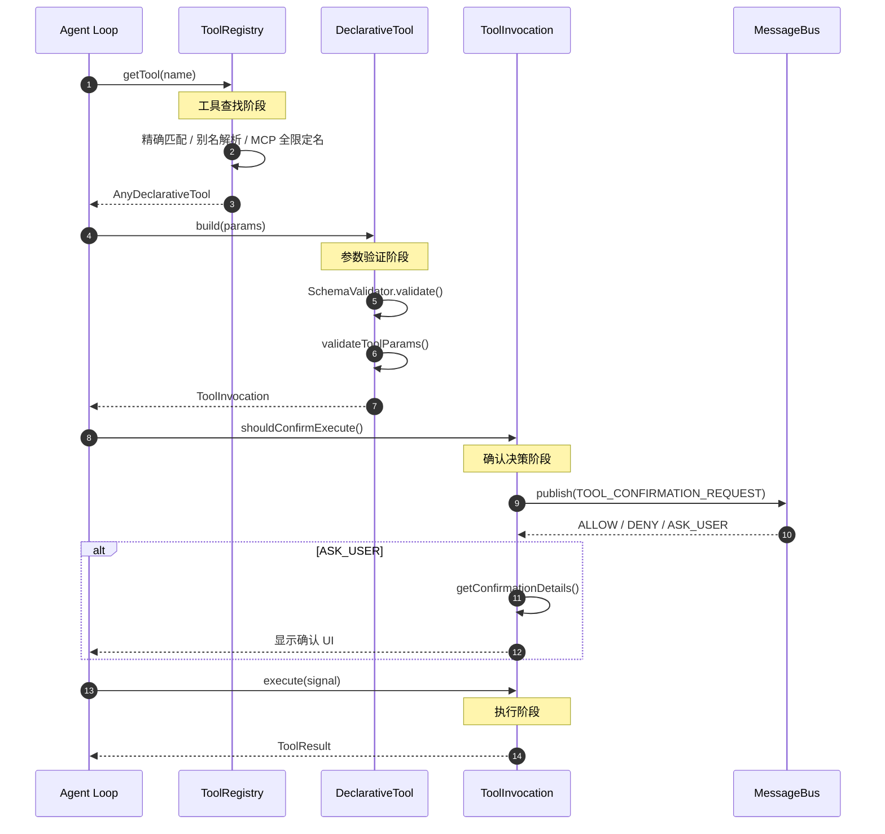

**关键交互说明**：

| 步骤 | 交互内容 | 设计意图 |
|-----|---------|---------|
| 1-2 | Agent Loop 请求工具 | 统一入口，解耦工具查找与执行 |
| 3-4 | 多层查找策略 | 支持工具别名和 MCP 全限定名 |
| 5-6 | 参数验证 | JSON Schema + 自定义验证双重检查 |
| 7-9 | 确认决策 | MessageBus 事件驱动，解耦 UI 与核心 |
| 10 | 实际执行 | 异步执行，支持取消信号 |

---

## 3. 核心组件详细分析

### 3.1 DeclarativeTool 内部结构

#### 职责定位

`DeclarativeTool` 是 Gemini CLI 工具系统的核心抽象，提供类型安全的声明式工具定义方式，将工具定义与执行分离。

#### 状态机图

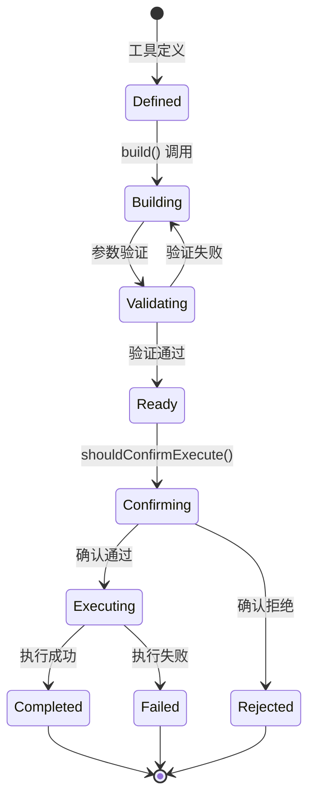

**状态说明**：

| 状态 | 说明 | 进入条件 | 退出条件 |
|-----|------|---------|---------|
| Defined | 工具已定义 | 构造函数完成 | 调用 build() |
| Building | 构建调用对象 | 开始构建 | 验证完成 |
| Validating | 验证参数 | 开始验证 | 验证通过/失败 |
| Ready | 调用对象就绪 | 验证通过 | 开始确认流程 |
| Confirming | 等待确认决策 | 调用确认方法 | 得到决策结果 |
| Executing | 执行中 | 确认通过 | 执行完成 |
| Completed | 执行完成 | 执行成功 | 自动结束 |
| Rejected | 被拒绝 | 确认拒绝 | 结束 |
| Failed | 执行失败 | 执行出错 | 结束 |

#### 内部数据流

```text
┌────────────────────────────────────────────┐
│  输入层                                     │
│   原始输入 → 验证解析 → 结构化数据          │
└──────────────────┬─────────────────────────┘
                   ▼
┌────────────────────────────────────────────┐
│  处理层                                     │
│   预处理 → 核心处理 → 后处理               │
└──────────────────┬─────────────────────────┘
                   ▼
┌────────────────────────────────────────────┐
│  输出层                                     │
│   结果格式化 → 副作用执行 → 事件通知        │
└────────────────────────────────────────────┘
```

#### 关键算法逻辑

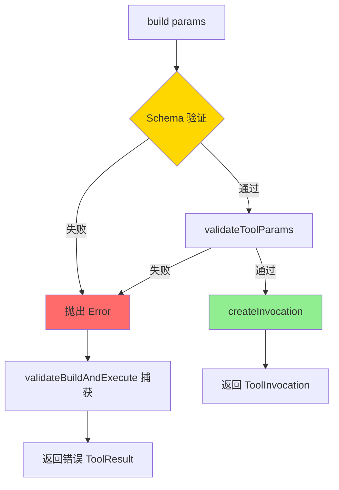

**算法要点**：

1. **双层验证**：先 JSON Schema 验证，再自定义参数值验证
2. **错误隔离**：`validateBuildAndExecute` 包装确保错误不抛出
3. **延迟执行**：`build` 只创建调用对象，不立即执行

#### 关键接口

| 接口 | 输入 | 输出 | 说明 | 代码位置 |
|-----|------|------|------|---------|
| `getSchema()` | modelId? | FunctionDeclaration | 获取工具 Schema | `tools.ts:375` |
| `build()` | params | ToolInvocation | 构建调用对象 | `tools.ts:406` |
| `validateToolParams()` | params | string \| null | 自定义验证 | `tools.ts:394` |
| `buildAndExecute()` | params + signal | Promise<TResult> | 便捷执行 | `tools.ts:416` |

---

### 3.2 ToolRegistry 内部结构

#### 职责定位

`ToolRegistry` 管理所有工具的注册、发现、排序和查找，支持 Built-in、Discovered、MCP 三层工具来源。

#### 状态机图

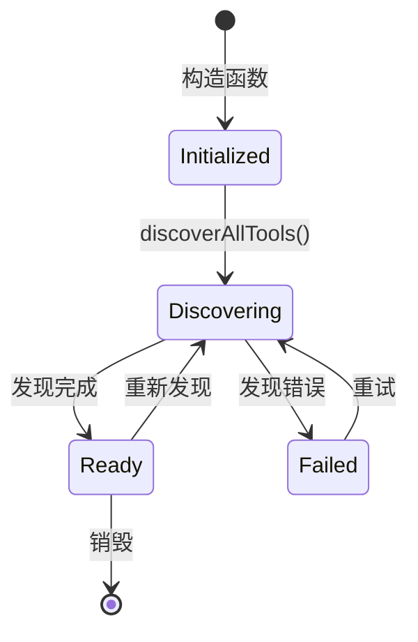

#### 工具来源优先级

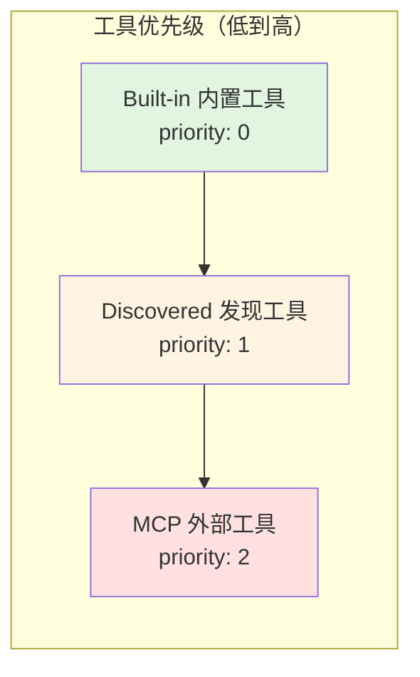

#### 关键算法逻辑

```typescript
// gemini-cli/packages/core/src/tools/tool-registry.ts:253-282
sortTools(): void {
  const getPriority = (tool: AnyDeclarativeTool): number => {
    if (tool instanceof DiscoveredMCPTool) return 2;
    if (tool instanceof DiscoveredTool) return 1;
    return 0; // Built-in
  };

  this.allKnownTools = new Map(
    Array.from(this.allKnownTools.entries()).sort((a, b) => {
      const priorityA = getPriority(a[1]);
      const priorityB = getPriority(b[1]);
      if (priorityA !== priorityB) {
        return priorityA - priorityB;
      }
      // MCP 工具按 serverName 排序
      if (priorityA === 2) {
        return serverA.localeCompare(serverB);
      }
      return 0;
    }),
  );
}
```

**算法要点**：

1. **优先级分层**：Built-in < Discovered < MCP
2. **稳定排序**：同优先级保持原有顺序
3. **MCP 分组**：相同 server 的工具有序排列

---

### 3.3 组件间协作时序

展示多个组件如何协作完成一个复杂操作。

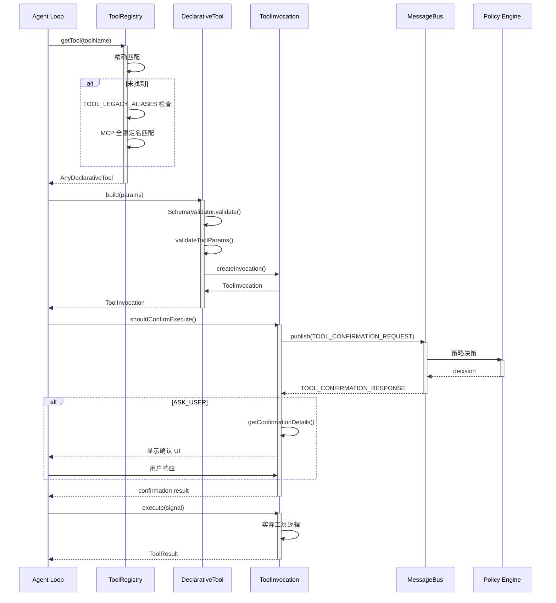

**协作要点**：

1. **调用方与 ToolRegistry**：{说明调用关系和接口契约}
2. **ToolRegistry 与 DeclarativeTool**：{说明数据传递格式和处理边界}
3. **ToolInvocation 与 MessageBus**：{说明异步/同步策略、超时处理}

---

### 3.4 关键数据路径

#### 主路径（正常流程）

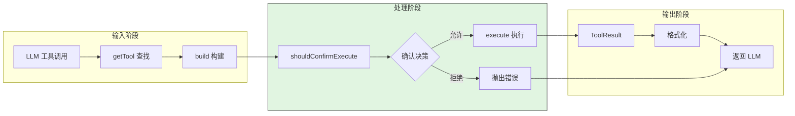

#### 异常路径（错误恢复）

```mermaid
flowchart TD
    E[参数验证失败] --> E1{处理方式}
    E1 -->|build 抛出| R1[validateBuildAndExecute 捕获]
    E1 -->|validateToolParams 失败| R1
    R1 --> R2[返回错误 ToolResult]
    R2 --> R3[llmContent: 错误信息]
    R2 --> R4[error: { type, message }]

    E2[执行错误] --> E3[execute 捕获]
    E3 --> R5[ToolResult.error]

    style R1 fill:#FFD700
    style R2 fill:#90EE90
```

#### 优化路径（缓存/短路）

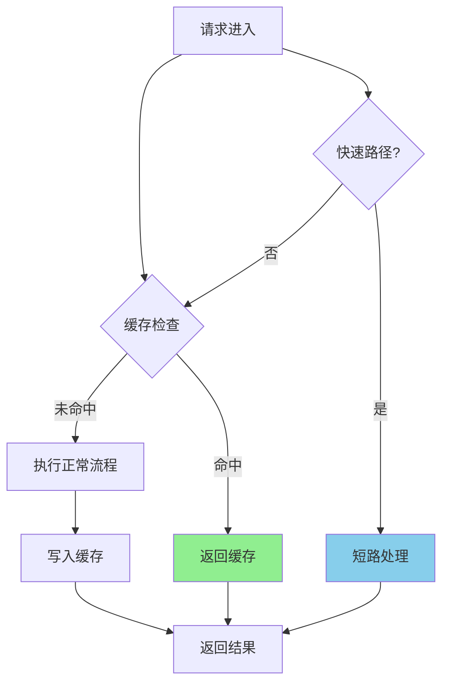

---

## 4. 端到端数据流转

### 4.1 正常流程（详细版）

展示数据如何从输入到输出的完整变换过程。

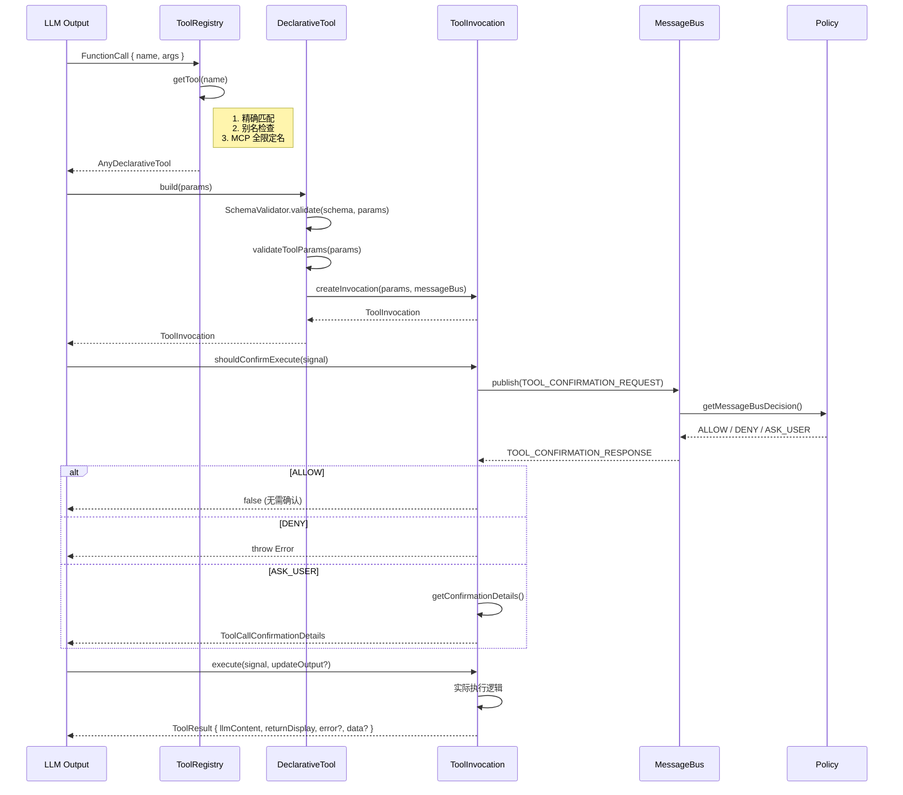

**数据变换详情**：

| 阶段 | 输入 | 处理 | 输出 | 代码位置 |
|-----|------|------|------|---------|
| 查找 | toolName | 多层匹配策略 | AnyDeclarativeTool | `tool-registry.ts:614` |
| 构建 | raw params | Schema + 自定义验证 | ToolInvocation | `tools.ts:495` |
| 确认 | AbortSignal | MessageBus 事件驱动 | boolean / details | `tools.ts:102` |
| 执行 | signal + callback | 异步执行 | ToolResult | `tools.ts:275` |

### 4.2 数据流向图

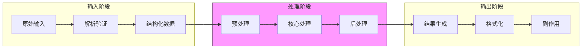

### 4.3 异常/边界流程

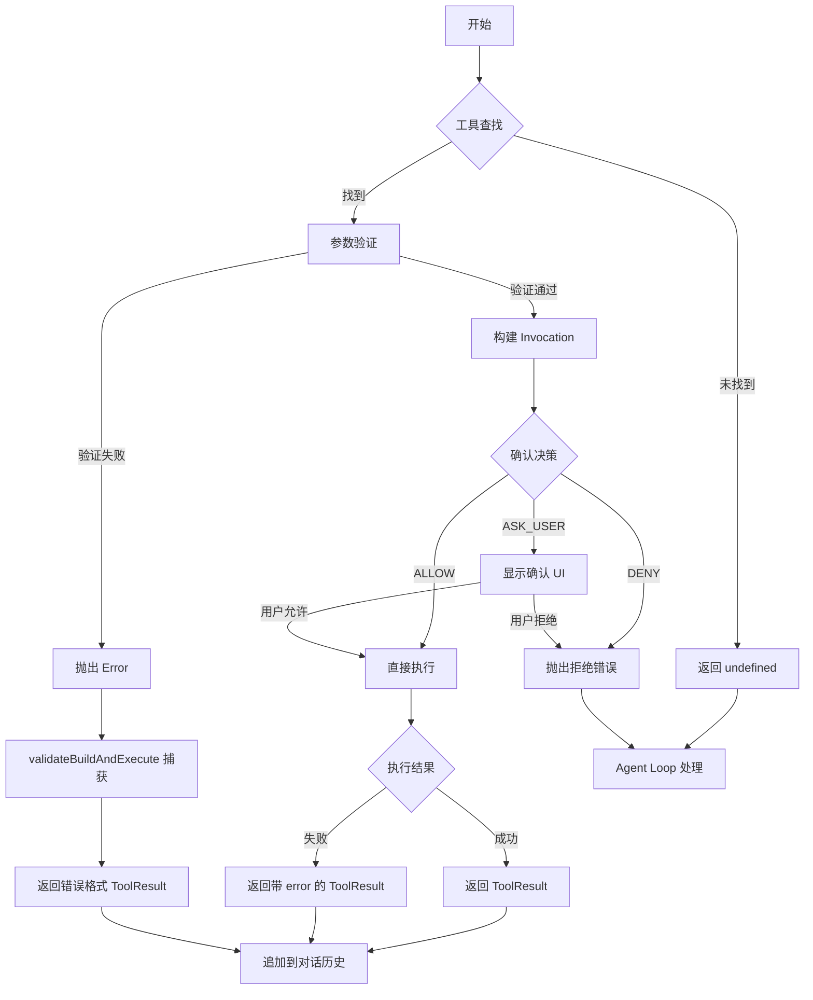

---

## 5. 关键代码实现

### 5.1 核心数据结构

```typescript
// gemini-cli/packages/core/src/tools/tools.ts:27-70
export interface ToolInvocation<TParams, TResult> {
  params: TParams;
  getDescription(): string;
  toolLocations(): ToolLocation[];
  shouldConfirmExecute(
    abortSignal: AbortSignal,
  ): Promise<ToolCallConfirmationDetails | false>;
  execute(
    signal: AbortSignal,
    updateOutput?: (output: string | AnsiOutput) => void,
    shellExecutionConfig?: ShellExecutionConfig,
  ): Promise<TResult>;
}

// gemini-cli/packages/core/src/tools/tools.ts:353-407
export abstract class DeclarativeTool<TParams, TResult>
  implements ToolBuilder<TParams, TResult>
{
  constructor(
    readonly name: string,
    readonly displayName: string,
    readonly description: string,
    readonly kind: Kind,
    readonly parameterSchema: unknown,
    readonly messageBus: MessageBus,
    readonly isOutputMarkdown: boolean = true,
    readonly canUpdateOutput: boolean = false,
    readonly extensionName?: string,
    readonly extensionId?: string,
  ) {}

  abstract build(params: TParams): ToolInvocation<TParams, TResult>;

  async buildAndExecute(
    params: TParams,
    signal: AbortSignal,
    updateOutput?: (output: string | AnsiOutput) => void,
  ): Promise<TResult> {
    const invocation = this.build(params);
    return invocation.execute(signal, updateOutput);
  }
}
```

**字段说明**：

| 字段 | 类型 | 用途 |
|-----|------|------|
| `name` | `string` | API 调用名称 |
| `displayName` | `string` | UI 展示名称 |
| `kind` | `Kind` | 工具分类（Read/Edit/Execute 等） |
| `parameterSchema` | `unknown` | JSON Schema 参数定义 |
| `messageBus` | `MessageBus` | 确认流程事件总线 |
| `isReadOnly` | `boolean` | 是否只读（由 kind 推导） |

### 5.2 主链路代码

**关键代码**（核心逻辑）：

```typescript
// gemini-cli/packages/core/src/tools/tools.ts:495-531
export abstract class BaseDeclarativeTool<TParams, TResult>
  extends DeclarativeTool<TParams, TResult>
{
  build(params: TParams): ToolInvocation<TParams, TResult> {
    const validationError = this.validateToolParams(params);
    if (validationError) {
      throw new Error(validationError);
    }
    return this.createInvocation(
      params,
      this.messageBus,
      this.name,
      this.displayName,
    );
  }

  override validateToolParams(params: TParams): string | null {
    const errors = SchemaValidator.validate(
      this.schema.parametersJsonSchema,
      params,
    );
    if (errors) {
      return errors;
    }
    return this.validateToolParamValues(params);
  }

  protected abstract createInvocation(
    params: TParams,
    messageBus: MessageBus,
    _toolName?: string,
    _displayName?: string,
  ): ToolInvocation<TParams, TResult>;
}
```

**设计意图**（非逐行解释, 说明关键设计）：
1. **模板方法模式**：`build` 定义流程，`createInvocation` 子类实现
2. **验证分离**：Schema 验证 + 值验证双层保障
3. **错误抛出**：验证失败抛出 Error，由上层捕获处理

<details>
<summary>查看完整实现</summary>

```typescript
// gemini-cli/packages/core/src/tools/tools.ts:495-614
export abstract class BaseDeclarativeTool<TParams, TResult>
  extends DeclarativeTool<TParams, TResult>
{
  build(params: TParams): ToolInvocation<TParams, TResult> {
    const validationError = this.validateToolParams(params);
    if (validationError) {
      throw new Error(validationError);
    }
    return this.createInvocation(
      params,
      this.messageBus,
      this.name,
      this.displayName,
    );
  }

  override validateToolParams(params: TParams): string | null {
    const errors = SchemaValidator.validate(
      this.schema.parametersJsonSchema,
      params,
    );
    if (errors) {
      return errors;
    }
    return this.validateToolParamValues(params);
  }

  protected abstract createInvocation(
    params: TParams,
    messageBus: MessageBus,
    _toolName?: string,
    _displayName?: string,
  ): ToolInvocation<TParams, TResult>;

  async validateBuildAndExecute(
    params: TParams,
    signal: AbortSignal,
    updateOutput?: (output: string | AnsiOutput) => void,
  ): Promise<TResult> {
    try {
      const invocation = this.build(params);
      return await invocation.execute(signal, updateOutput);
    } catch (error) {
      // 包装错误为 ToolResult
      return {
        error: {
          type: 'EXECUTION_FAILED',
          message: error instanceof Error ? error.message : String(error),
        },
      } as TResult;
    }
  }
}
```

</details>

### 5.3 关键调用链

```text
Agent Loop
  -> ToolRegistry.getTool(name)          [tool-registry.ts:614]
    -> 精确匹配
    -> TOOL_LEGACY_ALIASES 检查          [tool-names.ts]
    -> MCP 全限定名匹配
  -> DeclarativeTool.build(params)        [tools.ts:406]
    -> validateToolParams()               [tools.ts:508]
      - SchemaValidator.validate()        [utils/schemaValidator.ts]
      - validateToolParamValues()         [子类实现]
    -> createInvocation()                 [子类实现]
  -> ToolInvocation.shouldConfirmExecute() [tools.ts:102]
    -> getMessageBusDecision()            [tools.ts:183]
      - MessageBus.publish/subscribe      [confirmation-bus/message-bus.ts]
  -> ToolInvocation.execute(signal)       [子类实现]
```

---

## 6. 设计意图与 Trade-off

### 6.1 Gemini CLI 的选择

| 维度 | Gemini CLI 的选择 | 替代方案 | 取舍分析 |
|-----|------------------|---------|---------|
| 工具定义 | TypeScript 类 + 抽象方法 | YAML 配置 (Kimi) / Rust Trait (Codex) | 编译期类型安全，但需要重新编译 |
| 执行流程 | validate → build → execute 三阶段 | 直接执行 | 支持预执行确认，但增加复杂度 |
| 确认机制 | MessageBus 事件驱动 | 同步回调 / 无确认 | 解耦 UI 与核心，但增加异步复杂度 |
| 工具来源 | 三层优先级（Built-in/Discovered/MCP） | 单层注册表 | 灵活扩展，但查找逻辑复杂 |
| MCP 集成 | 原生 `McpClientManager` | 插件化 (Kimi ACP) | 开箱即用，但核心代码量增加 |

### 6.2 为什么这样设计？

**核心问题**：如何在保证类型安全的前提下，支持灵活的扩展和精细的权限控制？

**Gemini CLI 的解决方案**：
- 代码依据：`tools.ts:353` 的 `DeclarativeTool` 抽象类设计
- 设计意图：通过 TypeScript 类型系统确保工具定义的正确性
- 带来的好处：
  - 编译期捕获类型错误
  - IDE 自动补全和提示
  - 子类只需关注业务逻辑
- 付出的代价：
  - 需要重新编译才能添加新工具
  - 学习成本高于配置驱动

**确认流程设计**：
- 代码依据：`tools.ts:102-124` 的 `shouldConfirmExecute`
- 设计意图：通过 MessageBus 解耦确认 UI 与工具执行
- 带来的好处：
  - 支持多种确认策略（自动允许/拒绝/询问用户）
  - UI 层可独立演进
- 付出的代价：
  - 异步流程增加调试难度
  - 需要处理超时和取消

### 6.3 与其他项目的对比

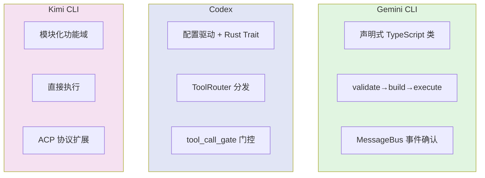

| 项目 | 工具定义方式 | 执行流程 | 确认机制 | 适用场景 |
|-----|-------------|---------|---------|---------|
| **Gemini CLI** | TypeScript 抽象类 + JSON Schema | validate → build → execute 三阶段 | MessageBus 事件驱动 | 需要精细权限控制和类型安全的场景 |
| **Codex** | Rust Trait + ToolsConfig | ToolRouter 解析 → Registry 分发 → Handler 执行 | tool_call_gate 门控 + 变异检测 | 需要精细并发控制和高性能的场景 |
| **Kimi CLI** | Python 模块化功能域 | 直接执行 | 简单确认流程 | 快速原型和简单工具场景 |

**详细对比分析**：

| 对比维度 | Gemini CLI | Codex | Kimi CLI |
|---------|------------|-------|----------|
| **工具定义** | `DeclarativeTool` 抽象类，子类实现 `createInvocation` | `ToolHandler` Trait，实现 `handle` 方法 | 模块化函数，直接注册 |
| **参数验证** | JSON Schema + 自定义验证 | 运行时类型检查 | 依赖 LLM 生成正确参数 |
| **执行流程** | 显式三阶段分离 | Router → Registry → Handler 链式 | 直接调用 |
| **确认机制** | MessageBus 事件驱动，支持策略配置 | 变异检测 + 门控等待 | 简单确认对话框 |
| **MCP 支持** | 原生 `McpClientManager` | 原生 `McpHandler` | ACP 协议适配层 |
| **扩展方式** | 继承基类 + 注册 | 实现 Trait + 注册 | 添加模块 + 注册 |
| **类型安全** | 编译期（TypeScript） | 编译期（Rust） | 运行时（Python） |

---

## 7. 边界情况与错误处理

### 7.1 终止条件

| 终止原因 | 触发条件 | 代码位置 |
|---------|---------|---------|
| 工具未找到 | name 不在 registry 中且无别名 | `tool-registry.ts:614` |
| 参数验证失败 | Schema 验证或自定义验证失败 | `tools.ts:497` |
| 用户拒绝 | shouldConfirmExecute 返回 DENY | `tools.ts:110` |
| 执行取消 | AbortSignal 触发 | `tools.ts:225` |
| 超时 | 30 秒确认超时 | `tools.ts:251` |

### 7.2 超时/资源限制

```typescript
// gemini-cli/packages/core/src/tools/tools.ts:250-253
timeoutId = setTimeout(() => {
  cleanup();
  resolve('ASK_USER'); // Default to ASK_USER on timeout
}, 30000);
```

### 7.3 错误恢复策略

| 错误类型 | 处理策略 | 代码位置 |
|---------|---------|---------|
| `INVALID_TOOL_PARAMS` | 返回错误 ToolResult，LLM 可重试 | `tools.ts:461` |
| `EXECUTION_FAILED` | 返回错误 ToolResult，包含错误详情 | `tools.ts:476` |
| `DISCOVERED_TOOL_EXECUTION_ERROR` | 返回 stdout/stderr/exit code 详情 | `tool-registry.ts:117` |
| 确认超时 | 默认转为 ASK_USER | `tools.ts:252` |

---

## 8. 关键代码索引

| 功能 | 文件 | 行号 | 说明 |
|-----|------|------|------|
| 入口 | `tools/tool-registry.ts` | 614 | getTool 工具查找 |
| 核心 | `tools/tools.ts` | 353 | DeclarativeTool 基类定义 |
| 构建 | `tools/tools.ts` | 495 | BaseDeclarativeTool.build |
| 确认 | `tools/tools.ts` | 102 | shouldConfirmExecute |
| 执行 | `tools/tools.ts` | 275 | execute 抽象方法 |
| 注册 | `tools/tool-registry.ts` | 222 | registerTool |
| 发现 | `tools/tool-registry.ts` | 309 | discoverAllTools |
| MCP 管理 | `tools/mcp-client-manager.ts` | 28 | McpClientManager 类 |
| 确认总线 | `confirmation-bus/message-bus.ts` | - | MessageBus 接口 |
| 工具分类 | `tools/tools.ts` | 809 | Kind 枚举定义 |
| 错误类型 | `tools/tool-error.ts` | - | ToolErrorType 枚举 |

---

## 9. 延伸阅读

- 前置知识：`04-gemini-cli-agent-loop.md`
- 相关机制：`06-gemini-cli-mcp-integration.md`
- 深度分析：`docs/comm/05-comm-tools-system.md`（跨项目工具系统对比）
- 其他项目：
  - `docs/codex/05-codex-tools-system.md`
  - `docs/kimi-cli/05-kimi-cli-tools-system.md`

---

*✅ Verified: 基于 gemini-cli/packages/core/src/tools/ 源码分析*
*基于版本：2026-02-08 | 最后更新：2026-02-24*
