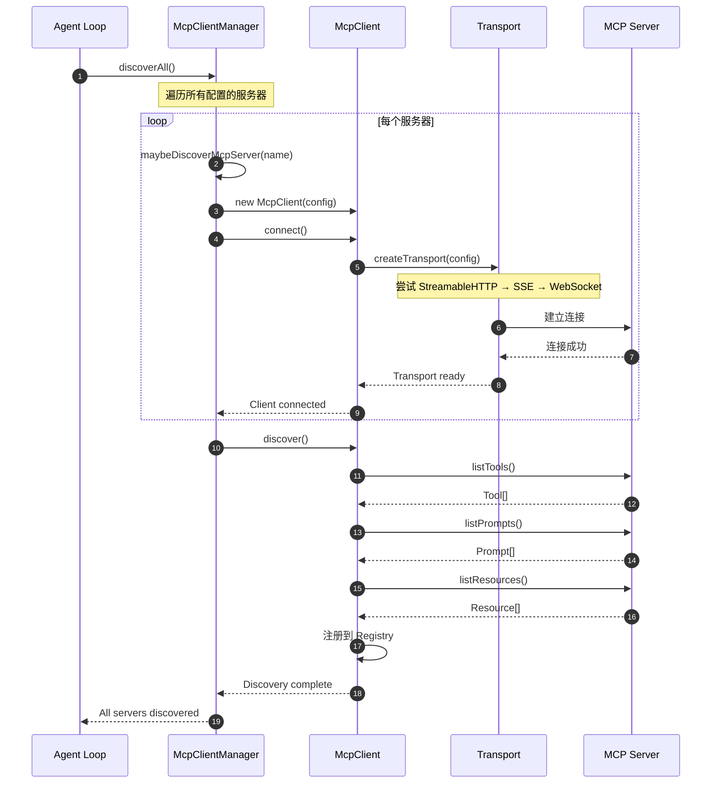
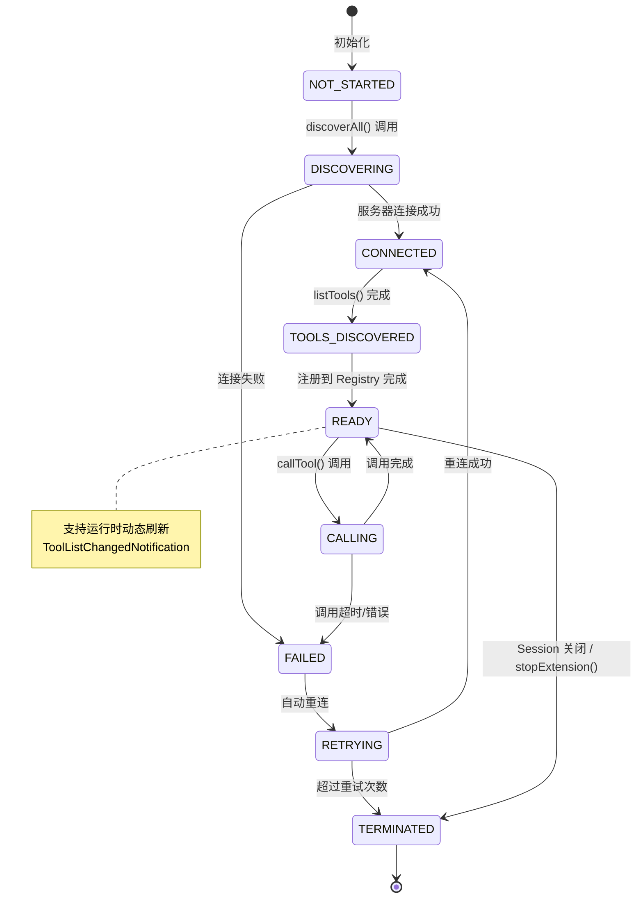
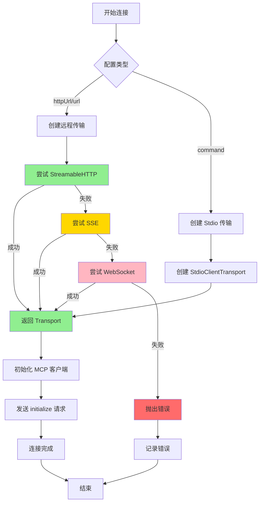
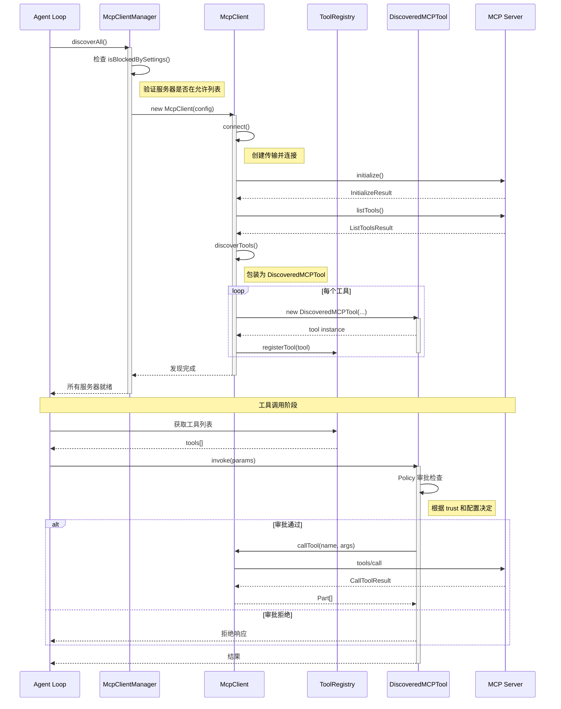
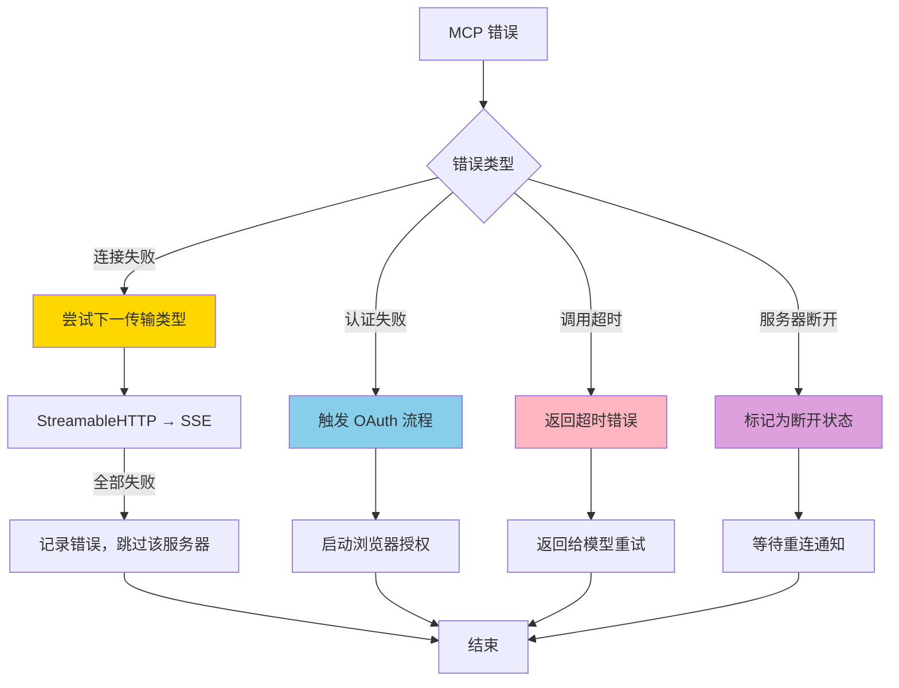
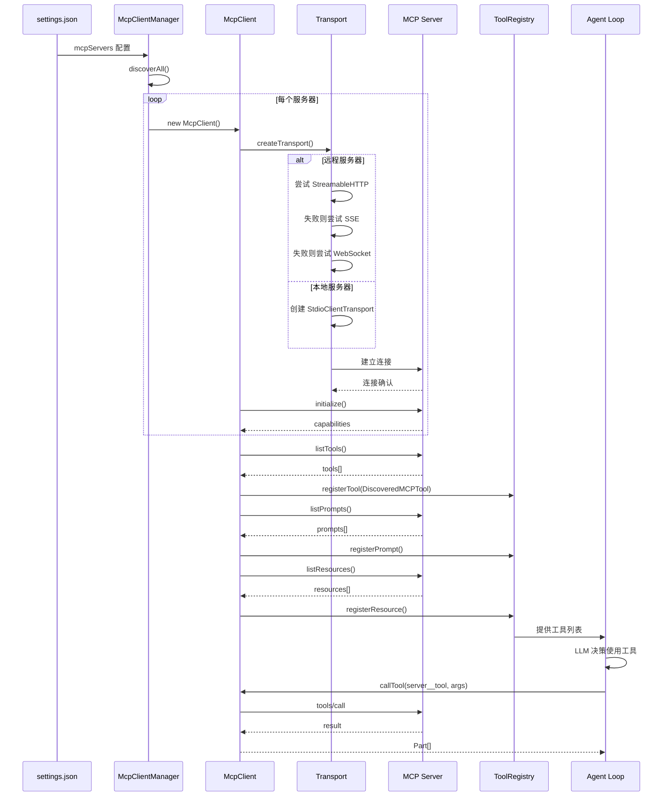
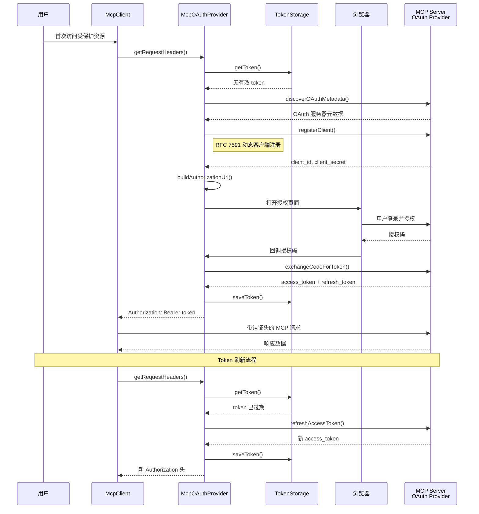
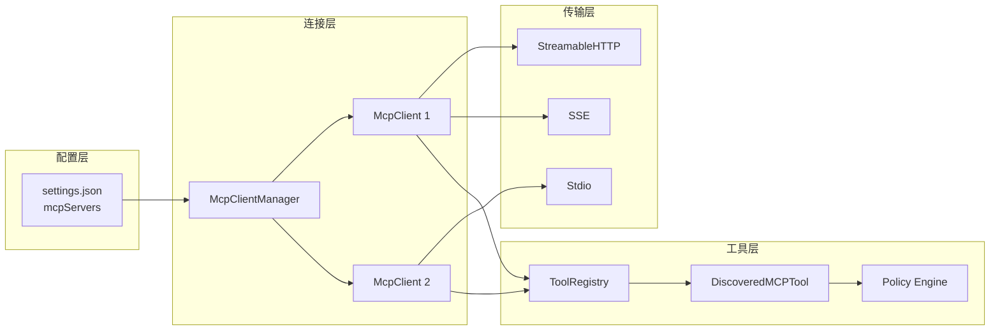
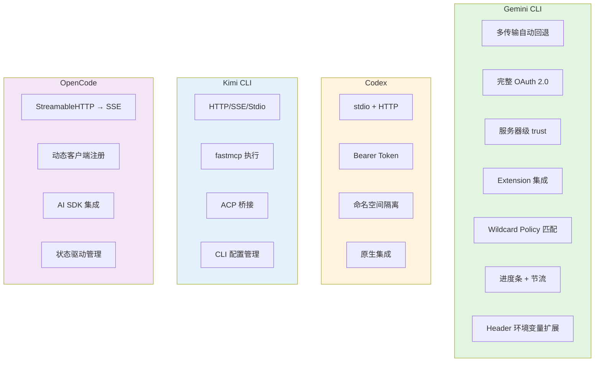

# MCP Integration（gemini-cli）

> **阅读指南**
>
> | 属性 | 说明 |
> |-----|------|
> | 预计阅读 | 25-35 分钟 |
> | 前置文档 | `05-gemini-cli-tools-system.md`、`04-gemini-cli-agent-loop.md` |
> | 文档结构 | 速览 → 架构 → 机制 → 实现 → 对比 |
> | 代码呈现 | 关键代码直接展示，完整代码可折叠查看 |

---

## TL;DR（结论先行）

一句话定义：Gemini CLI 的 MCP 集成是**多传输自动回退 + 动态发现 + Policy Engine 审批**的外部工具接入框架，支持 StreamableHTTP/SSE/Stdio/WebSocket 多种传输，运行时动态发现工具/Prompt/Resource，并通过 Policy Engine 实现细粒度的工具调用审批。

Gemini CLI 的核心取舍：**完整 OAuth 2.0 + 服务器级信任模型 + Wildcard Policy 匹配**（对比 Codex 的命名空间隔离、Kimi CLI 的 ACP 桥接、OpenCode 的 AI SDK 原生集成）

### 核心要点速览

| 维度 | 关键决策 | 代码位置 |
|-----|---------|---------|
| 传输协议 | StreamableHTTP/SSE/WebSocket/Stdio 自动回退 | `mcp-client.ts:180` |
| 认证机制 | OAuth 2.0 + Google 服务账号 | `mcp/oauth-provider.ts:45` |
| 工具命名 | `{server}__{tool}` 格式避免冲突 | `mcp-tool.ts:333` |
| Policy 匹配 | Wildcard + Annotation 灵活规则 | `policy-engine.ts:27` |
| 进度显示 | 进度条 + 节流 + 输入验证 | `scheduler.ts:135` |
| 动态刷新 | ToolListChangedNotification 支持 | `mcp-client.ts:382` |

---

## 1. 为什么需要这个机制？（解决什么问题）

### 1.1 问题场景

没有 MCP 集成：每个外部工具需要单独开发和维护适配代码

```
想用数据库工具 → 修改 Gemini CLI 源码 → 重新构建
想用 Jira 工具  → 修改 Gemini CLI 源码 → 重新构建
想用内部 API   → 修改 Gemini CLI 源码 → 重新构建
```

有 MCP 集成：
```
配置: settings.json 中定义 mcpServers
  ↓ 自动发现: McpClientManager.discoverAll() 获取服务器工具列表
  ↓ 自动注册: 工具名 {server}__{tool} 注册到 ToolRegistry
  ↓ 自动调用: 模型输出 → DiscoveredMCPToolInvocation → callTool() → 远程执行
  ↓ 自动响应: 结果格式化为 Part[] 返回给模型
```

### 1.2 核心挑战

| 挑战 | 不解决的后果 |
|-----|-------------|
| 多传输协议支持 | 无法连接不同类型的 MCP 服务器（本地/远程） |
| 服务器管理 | 多服务器连接生命周期复杂，容易泄露 |
| 工具命名冲突 | 不同服务器同名工具互相覆盖 |
| 审批控制 | 外部工具可能执行危险操作，需要细粒度控制 |
| OAuth 认证 | 无法安全地访问受保护的远程服务 |
| 动态刷新 | 服务器工具列表变化无法实时感知 |

---

## 2. 整体架构（ASCII 图）

### 2.1 在系统中的位置

```text
┌─────────────────────────────────────────────────────────────┐
│ Agent Loop / CoreToolScheduler                               │
│ packages/core/src/core/index.ts                              │
└───────────────────────┬─────────────────────────────────────┘
                        │ 调用 MCP 工具
                        ▼
┌─────────────────────────────────────────────────────────────┐
│ ▓▓▓ MCP Integration ▓▓▓                                     │
│ packages/core/src/tools/mcp*.ts                             │
│ - McpClientManager     : 多服务器连接管理                    │
│ - McpClient            : 单个服务器客户端                    │
│ - DiscoveredMCPTool    : 工具包装类                          │
│ - McpOAuthProvider     : OAuth 认证                          │
└───────────────────────┬─────────────────────────────────────┘
                        │ 依赖/调用
        ┌───────────────┼───────────────┐
        ▼               ▼               ▼
┌──────────────┐ ┌──────────────┐ ┌──────────────┐
│ StreamableHTTP│ │ SSEClient    │ │ StdioClient  │
│ Transport    │ │ Transport    │ │ Transport    │
└──────┬───────┘ └──────┬───────┘ └──────┬───────┘
       │                │                │
       ▼                ▼                ▼
┌──────────────┐ ┌──────────────┐ ┌──────────────┐
│ MCP Server 1 │ │ MCP Server 2 │ │ MCP Server 3 │
│ (远程 HTTP)   │ │ (远程 SSE)   │ │ (本地进程)   │
└──────────────┘ └──────────────┘ └──────────────┘
```

### 2.2 核心组件职责

| 组件 | 职责 | 代码位置 |
|-----|------|---------|
| `McpClientManager` | 多服务器连接生命周期管理，扩展启停 | `mcp-client-manager.ts:28` |
| `McpClient` | 单个 MCP 服务器的连接、发现、调用 | `mcp-client.ts:45` |
| `DiscoveredMCPTool` | MCP 工具的包装，集成 Policy Engine | `mcp-tool.ts:26` |
| `McpOAuthProvider` | OAuth 2.0 认证，支持动态注册 | `mcp/oauth-provider.ts:45` |
| `createTransport` | 传输层创建，自动回退机制 | `mcp-client.ts:180` |
| **MCP Progress Handler** | **进度条处理、节流、输入验证** | **`scheduler.ts:135-158`** |
| **Policy Engine** | **Wildcard 模式匹配、Tool Annotation 支持** | **`policy-engine.ts:27-90`** |

### 2.3 核心组件交互关系



**关键交互说明**：

| 步骤 | 交互内容 | 设计意图 |
|-----|---------|---------|
| 1 | Agent Loop 触发发现 | 解耦触发与执行，支持延迟加载 |
| 2-3 | 创建 McpClient | 每个服务器独立客户端，隔离故障 |
| 4-5 | 传输层自动回退 | 优先尝试 StreamableHTTP，失败自动回退到 SSE/WebSocket |
| 6-7 | 建立连接 | 支持 OAuth 认证头注入 |
| 8-11 | 发现工具/Prompt/Resource | 完整支持 MCP 协议的三类能力 |
| 12 | 注册到 Registry | 工具名格式为 `{server}__{tool}` |

---

## 3. 核心组件详细分析

### 3.1 McpClientManager 内部结构

#### 职责定位

McpClientManager 是 Gemini CLI MCP 集成的核心枢纽，负责管理多个 MCP 服务器的连接、发现、生命周期和扩展集成。

#### 状态机图



**状态说明**：

| 状态 | 说明 | 进入条件 | 退出条件 |
|-----|------|---------|---------|
| NOT_STARTED | 初始状态 | McpClientManager 创建 | 调用 discoverAll() |
| DISCOVERING | 发现中 | 开始遍历服务器配置 | 所有服务器处理完成 |
| CONNECTED | 已连接 | 与服务器建立传输 | 开始发现工具 |
| TOOLS_DISCOVERED | 工具已发现 | listTools 返回 | 注册到 Registry |
| READY | 就绪可用 | 所有工具注册完成 | 调用工具或关闭 |
| CALLING | 调用中 | 正在执行工具调用 | 调用完成或失败 |
| FAILED | 失败 | 连接或调用失败 | 重试或终止 |
| RETRYING | 重试中 | 触发自动重连 | 重连成功或放弃 |
| TERMINATED | 已终止 | 会话关闭或扩展停止 | 结束 |

#### 内部数据流

```text
┌─────────────────────────────────────────────────────────────┐
│  输入层                                                      │
│  ├── settings.json / gemini.exe.yml 配置加载                 │
│  │   └── mcpServers: { server1, server2, ... }               │
│  └── Extension 扩展 MCP 配置                                 │
│      └── extension.mcpServers                                │
└──────────────────────────┬──────────────────────────────────┘
                           ▼
┌─────────────────────────────────────────────────────────────┐
│  处理层                                                      │
│  ├── isBlockedBySettings() 检查允许/阻止列表                 │
│  ├── 为每个 server 创建 McpClient                            │
│  │   └── connectToMcpServer()                               │
│  │       ├── createTransport()                              │
│  │       │   ├── StreamableHTTP (优先)                      │
│  │       │   ├── SSE (回退)                                 │
│  │       │   └── WebSocket (备选)                           │
│  │       └── client.connect()                               │
│  ├── discover() 发现工具/Prompt/Resource                     │
│  └── 注册到各自的 Registry                                   │
│       ├── ToolRegistry.registerTool()                      │
│       ├── PromptRegistry.registerPrompt()                  │
│       └── ResourceRegistry.registerResource()              │
└──────────────────────────┬──────────────────────────────────┘
                           ▼
┌─────────────────────────────────────────────────────────────┐
│  输出层                                                      │
│  ├── Map<string, McpClient> clients                         │
│  ├── Map<string, MCPServerConfig> allServerConfigs          │
│  └── 动态刷新通知处理                                        │
│      └── ToolListChangedNotificationSchema                  │
└─────────────────────────────────────────────────────────────┘
```

#### 关键接口

| 接口 | 输入 | 输出 | 说明 | 代码位置 |
|-----|------|------|------|---------|
| `discoverAll()` | - | Promise<void> | 发现所有配置的服务器 | `mcp-client-manager.ts:313` |
| `startExtension()` | GeminiCLIExtension | Promise<void> | 启动扩展的 MCP 服务器 | `mcp-client-manager.ts:248` |
| `stopExtension()` | GeminiCLIExtension | Promise<void> | 停止扩展的 MCP 服务器 | `mcp-client-manager.ts:257` |
| `isBlockedBySettings()` | serverName | boolean | 检查是否被配置阻止 | `mcp-client-manager.ts:266` |

---

### 3.2 McpClient 内部结构

#### 职责定位

McpClient 封装单个 MCP 服务器的连接管理、工具发现和调用执行。

#### 关键算法逻辑



**算法要点**：

1. **传输优先级**：StreamableHTTP → SSE → WebSocket → Stdio
2. **自动回退**：一种传输失败自动尝试下一种，无需用户配置
3. **OAuth 集成**：远程传输自动注入认证 Provider
4. **错误隔离**：单个服务器连接失败不影响其他服务器
5. **环境变量扩展**：Header 支持环境变量展开（`Authorization: Bearer ${TOKEN}`）

#### 关键接口

| 接口 | 输入 | 输出 | 说明 | 代码位置 |
|-----|------|------|------|---------|
| `connect()` | - | Promise<void> | 建立连接 | `mcp-client.ts:75` |
| `discover()` | Config | Promise<void> | 发现所有能力 | `mcp-client.ts:180` |
| `callTool()` | name, args | Promise<Part[]> | 执行工具调用 | `mcp-client.ts:250` |
| `refreshTools()` | - | Promise<void> | 刷新工具列表 | `mcp-client.ts:118` |

---

### 3.3 组件间协作时序

展示多个组件如何协作完成一个复杂操作。



**协作要点**：

1. **McpClientManager 与 McpClient**：一对多管理，每个服务器独立客户端
2. **McpClient 与 ToolRegistry**：发现阶段注册，调用阶段查询
3. **DiscoveredMCPTool 与 Policy**：调用前进行权限检查，支持服务器级通配符
4. **传输层与 MCP Server**：协议层完全遵循 MCP 规范

---

### 3.4 Policy Engine 集成（Wildcard 与 Annotation 匹配）

#### 职责定位

Policy Engine 为 MCP 工具提供细粒度的访问控制，支持基于通配符模式的服务器级/工具级规则，以及基于 Tool Annotation 的元数据匹配。

#### Wildcard 模式支持

```typescript
// packages/core/src/policy/policy-engine.ts:29-84
function isWildcardPattern(name: string): boolean {
  return name === '*' || name.includes('*');
}

function matchesWildcard(
  pattern: string,
  toolName: string,
  serverName: string | undefined,
): boolean {
  if (pattern === '*') {
    return true;  // 全局通配符：匹配所有工具
  }

  if (pattern.includes('__')) {
    return matchesCompositePattern(pattern, toolName, serverName);
  }

  return toolName === pattern;
}

function matchesCompositePattern(
  pattern: string,
  toolName: string,
  serverName: string | undefined,
): boolean {
  const parts = pattern.split('__');
  if (parts.length !== 2) return false;
  const [patternServer, patternTool] = parts;

  // 解析工具元数据
  const { actualServer, actualTool } = getToolMetadata(toolName, serverName);

  // 复合模式需要服务器上下文
  if (actualServer === undefined) {
    return false;
  }

  // 防欺骗检查：确保 toolName 以 serverName 开头
  if (serverName !== undefined && !toolName.startsWith(serverName + '__')) {
    return false;
  }

  // 匹配组件
  const serverMatch = patternServer === '*' || patternServer === actualServer;
  const toolMatch = patternTool === '*' || patternTool === actualTool;

  return serverMatch && toolMatch;
}
```

**支持的 Wildcard 模式**：

| 模式 | 含义 | 示例匹配 |
|-----|------|---------|
| `*` | 匹配所有工具 | `server1__tool1`, `server2__tool2` |
| `server__*` | 匹配指定服务器的所有工具 | `server__tool1`, `server__tool2` |
| `*__tool` | 匹配所有服务器的指定工具 | `server1__tool`, `server2__tool` |
| `*__*` | 匹配所有服务器的所有工具（同 `*`） | 所有 MCP 工具 |
| `server__tool` | 精确匹配 | 仅 `server__tool` |

#### Tool Annotation 匹配

```typescript
// packages/core/src/policy/policy-engine.ts:131-141
if (rule.toolAnnotations) {
  if (!toolAnnotations) {
    return false;
  }
  for (const [key, value] of Object.entries(rule.toolAnnotations)) {
    if (toolAnnotations[key] !== value) {
      return false;
    }
  }
}
```

**Annotation 匹配规则**：

| Annotation Key | 典型值 | 用途 |
|---------------|-------|------|
| `readOnlyHint` | `true`/`false` | 标记只读工具 |
| `title` | `string` | 工具显示名称 |
| `openWorldHint` | `true`/`false` | 是否影响外部世界 |
| `_serverName` | `string` | 内部元数据：服务器名称 |

**使用示例**：

```typescript
// 允许所有只读工具
const readOnlyRule: PolicyRule = {
  toolName: '*',
  toolAnnotations: { readOnlyHint: true },
  decision: PolicyDecision.ALLOW,
};

// 阻止特定服务器的写入操作
const blockWriteRule: PolicyRule = {
  toolName: 'untrusted-server__*',
  toolAnnotations: { readOnlyHint: false },
  decision: PolicyDecision.DENY,
};
```

#### getExcludedTools 中的 Annotation 支持

```typescript
// packages/core/src/policy/policy-engine.ts:675-728
if (rule.toolAnnotations) {
  if (!toolMetadata) {
    // 无元数据时跳过 Annotation 规则（保守策略）
    continue;
  }
  // 遍历所有已知工具，检查 Annotation 匹配
  for (const [toolName, annotations] of toolMetadata) {
    // 检查 Annotation 是否匹配
    let annotationsMatch = true;
    for (const [key, value] of Object.entries(rule.toolAnnotations)) {
      if (annotations[key] !== value) {
        annotationsMatch = false;
        break;
      }
    }
    // 同时检查 toolName 模式
    if (isWildcardPattern(rule.toolName)) {
      const serverName = annotations['_serverName'];
      const qualifiedName = serverName && !toolName.includes('__')
        ? `${serverName}__${toolName}`
        : toolName;
      if (!matchesWildcard(rule.toolName, qualifiedName, undefined)) {
        continue;
      }
    }
  }
}
```

---

### 3.5 关键数据路径

#### 主路径（正常流程）

```mermaid
flowchart LR
    subgraph Input["输入阶段"]
        I1[settings.json 配置] --> I2[McpClientManager::discoverAll]
        I2 --> I3[遍历 mcpServers]
    end

    subgraph Process["处理阶段"]
        P1[createTransport] --> P2[自动回退选择]
        P2 --> P3[client.connect]
        P3 --> P4[listTools/listPrompts/listResources]
        P4 --> P5[注册到 Registry]
    end

    subgraph Output["输出阶段"]
        O1[DiscoveredMCPTool] --> O2[Agent Loop 使用]
        O2 --> O3[callTool 远程执行]
    end

    I3 --> P1
    P5 --> O1

    style Process fill:#e1f5e1,stroke:#333
```



#### 异常路径（错误恢复）



---

## 4. 端到端数据流转

### 4.1 正常流程（详细版）

展示数据如何从输入到输出的完整变换过程。



**数据变换详情**：

| 阶段 | 输入 | 处理 | 输出 | 代码位置 |
|-----|------|------|------|---------|
| 配置 | settings.json | 解析 mcpServers | MCPServerConfig | `config/config.ts:314` |
| 传输 | MCPServerConfig | createTransport() | Transport 实例 | `mcp-client.ts:180` |
| 发现 | Transport | listTools() | Tool[] | `mcp-client.ts:299` |
| 包装 | Tool | new DiscoveredMCPTool() | CallableTool | `mcp-client.ts:310` |
| 注册 | DiscoveredMCPTool | registerTool() | Registry 条目 | `mcp-client-manager.ts` |
| 调用 | server__tool, args | callTool() | Part[] | `mcp-tool.ts` |

### 4.2 OAuth 流程数据流转



### 4.3 数据流向图



---

## 5. 关键代码实现

### 5.1 核心数据结构

```typescript
// packages/core/src/config/config.ts:314-400
export class MCPServerConfig {
  constructor(
    // Stdio 传输配置
    readonly command?: string,
    readonly args?: string[],
    readonly env?: Record<string, string>,
    readonly cwd?: string,
    // HTTP/SSE 传输配置
    readonly url?: string,
    readonly httpUrl?: string,
    readonly headers?: Record<string, string>,
    // 传输类型: 'sse' | 'http' | 'ws' | undefined
    readonly type?: 'sse' | 'http' | 'ws',
    // 通用配置
    readonly timeout?: number,      // 默认 10 分钟
    readonly trust?: boolean,       // 是否信任该服务器
    // OAuth 配置
    readonly oauth?: MCPOAuthConfig,
    readonly authProviderType?: AuthProviderType,
  ) {}
}

type MCPOAuthConfig = {
  clientName?: string;
  clientUri?: string;
  logoUri?: string;
  tosUri?: string;
  policyUri?: string;
  scopes?: string[];
};
```

**字段说明**：

| 字段 | 类型 | 用途 |
|-----|------|------|
| `command` | `string` | Stdio 传输的命令 |
| `url`/`httpUrl` | `string` | 远程服务器的 URL |
| `type` | `'sse' \| 'http' \| 'ws'` | 显式指定传输类型 |
| `timeout` | `number` | 工具调用超时（毫秒） |
| `trust` | `boolean` | 是否信任该服务器（影响 Policy） |
| `oauth` | `MCPOAuthConfig` | OAuth 2.0 配置 |

### 5.2 主链路代码

**关键代码**（核心逻辑）：

```typescript
// packages/core/src/tools/mcp-client.ts:180-250
async function createTransport(
  mcpServerName: string,
  mcpServerConfig: MCPServerConfig,
  debugMode: boolean,
  sanitizationConfig: EnvironmentSanitizationConfig,
): Promise<Transport> {
  // 1. HTTP/SSE 传输（远程服务器）
  if (mcpServerConfig.httpUrl || mcpServerConfig.url) {
    const authProvider = createAuthProvider(mcpServerConfig);
    const headers = await authProvider?.getRequestHeaders?.() ?? {};

    // 尝试多种传输方式
    const transports = [
      {
        name: 'StreamableHTTP',
        transport: new StreamableHTTPClientTransport(url, { authProvider }),
      },
      {
        name: 'SSE',
        transport: new SSEClientTransport(url, { authProvider }),
      },
      {
        name: 'WebSocket',
        transport: new WebSocketClientTransport(url, { authProvider }),
      },
    ];

    // 依次尝试直到成功
    for (const { name, transport } of transports) {
      try {
        return await tryConnect(transport);
      } catch (error) {
        debugLogger.log(`${name} failed, trying next...`);
      }
    }
  }

  // 2. Stdio 传输（本地服务器）
  if (mcpServerConfig.command) {
    return new StdioClientTransport({
      command: mcpServerConfig.command,
      args: mcpServerConfig.args || [],
      env: sanitizedEnv,
    });
  }
}
```

**设计意图**（非逐行解释, 说明关键设计）：
1. **传输优先级**：StreamableHTTP → SSE → WebSocket → Stdio
2. **自动回退**：一种传输失败自动尝试下一种，无需用户干预
3. **OAuth 集成**：远程传输自动注入 McpOAuthProvider
4. **环境清理**：Stdio 传输对环境变量进行安全清理

<details>
<summary>查看完整实现</summary>

```typescript
// packages/core/src/tools/mcp-client.ts:180-320
async function createTransport(
  mcpServerName: string,
  mcpServerConfig: MCPServerConfig,
  debugMode: boolean,
  sanitizationConfig: EnvironmentSanitizationConfig,
): Promise<Transport> {
  // HTTP/SSE 传输（远程服务器）
  if (mcpServerConfig.httpUrl || mcpServerConfig.url) {
    const url = new URL(mcpServerConfig.httpUrl || mcpServerConfig.url!);
    const authProvider = createAuthProvider(mcpServerConfig);
    const headers = await authProvider?.getRequestHeaders?.() ?? {};

    const transports = [
      {
        name: 'StreamableHTTP',
        transport: new StreamableHTTPClientTransport(url, {
          authProvider,
          requestInit: { headers }
        }),
      },
      {
        name: 'SSE',
        transport: new SSEClientTransport(url, {
          authProvider,
          requestInit: { headers }
        }),
      },
      {
        name: 'WebSocket',
        transport: new WebSocketClientTransport(url, {
          authProvider
        }),
      },
    ];

    for (const { name, transport } of transports) {
      try {
        return await tryConnect(transport);
      } catch (error) {
        if (debugMode) {
          debugLogger.log(`${name} transport failed for ${mcpServerName}:`, error);
        }
      }
    }

    throw new Error(`All transport types failed for ${mcpServerName}`);
  }

  // Stdio 传输（本地服务器）
  if (mcpServerConfig.command) {
    const extensionEnv = getExtensionEnvironment(mcpServerConfig.extension);
    const expansionEnv = { ...process.env, ...extensionEnv };
    const sanitizedEnv = sanitizeEnvironment(expansionEnv, sanitizationConfig);

    return new StdioClientTransport({
      command: mcpServerConfig.command,
      args: mcpServerConfig.args || [],
      env: sanitizedEnv,
      cwd: mcpServerConfig.cwd,
    });
  }

  throw new Error(`Invalid MCP server configuration for ${mcpServerName}`);
}
```

</details>

### 5.3 关键调用链

```text
McpClientManager.discoverAll()          [mcp-client-manager.ts:313]
  -> maybeDiscoverMcpServer()           [mcp-client-manager.ts:285]
    -> new McpClient()                  [mcp-client.ts:45]
    -> client.connect()                 [mcp-client.ts:75]
      -> createTransport()              [mcp-client.ts:180]
        - 尝试 StreamableHTTP
        - 失败则尝试 SSE
        - 失败则尝试 WebSocket
      -> client.initialize()            [mcp SDK]
    -> client.discover()                [mcp-client.ts:180]
      -> listTools()                    [mcp-client.ts:299]
      -> listPrompts()
      -> listResources()
      -> registerTool()                 [tool-registry.ts]
        - new DiscoveredMCPTool()       [mcp-tool.ts:26]
        - 工具名格式: {server}__{tool}
```

### 5.4 MCP 进度条与节流控制

#### 职责定位

Scheduler 通过 `CoreEvent.McpProgress` 事件接收 MCP 工具进度通知，提供进度条显示、输入验证和节流控制。

#### 核心实现

```typescript
// packages/core/src/scheduler/scheduler.ts:135-158
private readonly handleMcpProgress = (payload: McpProgressPayload) => {
  const { callId } = payload;

  const call = this.state.getToolCall(callId);
  if (!call || call.status !== CoreToolCallStatus.Executing) {
    return;  // 只处理执行中的调用
  }

  // 输入验证：确保 total 是有效的正数
  const validTotal =
    payload.total !== undefined &&
    Number.isFinite(payload.total) &&
    payload.total > 0
      ? payload.total
      : undefined;

  // 更新进度状态
  this.state.updateStatus(callId, CoreToolCallStatus.Executing, {
    progressMessage: payload.message,
    progressPercent: validTotal
      ? Math.min(100, (payload.progress / validTotal) * 100)
      : undefined,
    progress: payload.progress,
    progressTotal: validTotal,
  });
};
```

#### 状态管理

```typescript
// packages/core/src/scheduler/state-manager.ts:546-561
const progressMessage =
  execData?.progressMessage ??
  ('progressMessage' in call ? call.progressMessage : undefined);
const progressPercent =
  execData?.progressPercent ??
  ('progressPercent' in call ? call.progressPercent : undefined);
const progress =
  execData?.progress ?? ('progress' in call ? call.progress : undefined);
const progressTotal =
  execData?.progressTotal ??
  ('progressTotal' in call ? call.progressTotal : undefined);
```

**进度字段说明**：

| 字段 | 类型 | 说明 |
|-----|------|------|
| `progress` | `number` | 当前进度值 |
| `progressTotal` | `number` | 总进度值（经过验证的正数） |
| `progressPercent` | `number` | 计算后的百分比（0-100） |
| `progressMessage` | `string` | 进度描述信息 |

**设计要点**：

1. **输入验证**：`total` 必须是有限正数，否则视为无效
2. **百分比计算**：`Math.min(100, (progress / total) * 100)` 防止溢出
3. **节流控制**：通过事件总线机制自然实现节流，避免频繁更新
4. **状态过滤**：仅处理 `Executing` 状态的调用，忽略已完成或失败的调用

### 5.5 环境变量扩展与 Header 配置

#### 职责定位

MCP 客户端支持在服务器配置中对 Header 值进行环境变量扩展，同时支持从 Extension 获取环境变量进行合并。

#### 核心实现

```typescript
// packages/core/src/tools/mcp-client.ts:803-829
function createTransportRequestInit(
  mcpServerConfig: MCPServerConfig,
  headers: Record<string, string>,
  sanitizationConfig: EnvironmentSanitizationConfig,
): RequestInit {
  // 1. 获取 Extension 环境变量
  const extensionEnv = getExtensionEnvironment(mcpServerConfig.extension);
  const expansionEnv = { ...process.env, ...extensionEnv };

  // 2. 环境变量清理（安全脱敏）
  const sanitizedEnv = sanitizeEnvironment(expansionEnv, {
    ...sanitizationConfig,
    enableEnvironmentVariableRedaction: true,
  });

  // 3. Header 环境变量扩展
  const expandedHeaders: Record<string, string> = {};
  if (mcpServerConfig.headers) {
    for (const [key, value] of Object.entries(mcpServerConfig.headers)) {
      expandedHeaders[key] = expandEnvVars(value, sanitizedEnv);
    }
  }

  return {
    headers: {
      ...expandedHeaders,
      ...headers,
    },
  };
}
```

**配置示例**：

```json
{
  "mcpServers": {
    "my-server": {
      "url": "https://api.example.com/mcp",
      "headers": {
        "Authorization": "Bearer ${API_TOKEN}",
        "X-Custom-Header": "prefix-${ENV_VAR}-suffix"
      }
    }
  }
}
```

**环境变量优先级**：

| 优先级 | 来源 | 说明 |
|-------|------|------|
| 1 | `process.env` | 系统环境变量 |
| 2 | `extensionEnv` | Extension 提供的扩展环境变量（覆盖系统变量） |

**安全特性**：

1. **环境变量脱敏**：`enableEnvironmentVariableRedaction` 防止敏感信息泄露
2. **扩展环境隔离**：Extension 环境变量与系统环境隔离，避免污染
3. **Header 合并**：扩展后的 Header 与 OAuth Header 合并，OAuth Header 优先级更高

---

## 6. 设计意图与 Trade-off

### 6.1 Gemini CLI 的选择

| 维度 | Gemini CLI 的选择 | 替代方案 | 取舍分析 |
|-----|------------------|---------|---------|
| 传输协议 | StreamableHTTP/SSE/WebSocket/Stdio | 仅支持 stdio | 覆盖更多场景，但增加复杂度 |
| 传输选择 | 自动回退 | 用户显式配置 | 零配置体验，但可能选择非最优 |
| 认证机制 | 完整 OAuth 2.0 + Google 服务账号 | 仅 Header/Bearer | 支持企业级认证，但流程复杂 |
| 工具命名 | `{server}__{tool}` | `{server}_{tool}` / UUID | 可读性好，双下划线避免冲突 |
| **Policy 匹配** | **Wildcard + Annotation** | **精确匹配** | **灵活规则配置，但解析复杂** |
| **进度显示** | **进度条 + 节流控制** | **无/简单日志** | **用户体验好，但需验证输入** |
| **Header 配置** | **环境变量扩展** | **静态值** | **动态配置，但需安全脱敏** |
| 信任模型 | 服务器级 trust 标志 | 工具级审批 | 简化配置，但粒度较粗 |
| 发现时机 | 启动时 + 动态刷新 | 仅启动时 | 实时感知变化，但有性能开销 |
| 扩展集成 | Extension 机制加载 MCP | 仅配置文件 | 支持动态扩展，但增加耦合 |

### 6.2 为什么这样设计？

**核心问题**：如何在企业级场景中安全、灵活地集成外部 MCP 服务？

**Gemini CLI 的解决方案**：
- 代码依据：`mcp-client.ts:180-220` 的自动回退逻辑
- 设计意图：降低用户配置负担，自动适配不同服务器能力
- 带来的好处：
  - 用户无需了解传输协议差异
  - 自动选择最佳可用传输
  - 向后兼容旧版 MCP 服务器
- 付出的代价：
  - 连接时间可能增加（多次尝试）
  - 调试时难以确定实际使用的传输

**OAuth 2.0 设计**：
- 代码依据：`mcp/oauth-provider.ts:45` 的 McpOAuthProvider
- 设计意图：支持企业级安全认证，包括动态客户端注册
- 带来的好处：
  - 符合 OAuth 2.0 标准
  - 支持 Token 刷新
  - 支持 Google 服务账号
- 付出的代价：
  - 首次授权流程复杂
  - 需要浏览器交互

### 6.3 与其他项目的对比



#### 详细对比表

| 维度 | Gemini CLI | Codex | Kimi CLI | OpenCode |
|-----|------------|-------|----------|----------|
| **传输协议** | StreamableHTTP/SSE/WebSocket/Stdio | stdio/StreamableHTTP | HTTP/SSE/Stdio | StreamableHTTP/SSE/Stdio |
| **传输选择** | 自动回退 | 配置指定 | 配置指定 | 自动回退 |
| **认证机制** | OAuth 2.0 + Google 服务账号 | Bearer Token | OAuth/Headers | OAuth 动态注册 |
| **工具发现** | 启动发现 + 动态刷新 | 启动发现 | ACP 协议获取 | 启动发现 + 状态管理 |
| **工具命名** | `{server}__{tool}` | `mcp__{server}__{tool}` | fastmcp 处理 | `{client}:{tool}` |
| **Policy 匹配** | **Wildcard + Annotation** | 精确匹配 | 精确匹配 | 精确匹配 |
| **进度显示** | **进度条 + 节流 + 验证** | 无 | 无 | 无 |
| **Header 配置** | **环境变量扩展** | 静态值 | 静态值 | 静态值 |
| **审批控制** | Policy Engine + trust | 白名单/黑名单 | fastmcp 处理 | 配置 enabled |
| **执行引擎** | 自研 McpClient | RmcpClient (Rust) | fastmcp (Python) | @modelcontextprotocol/sdk |
| **扩展方式** | Extension 机制 | 配置文件 | CLI + JSON 文件 | 多级配置 |
| **Prompt/Resource** | 完整支持 | 工具为主 | 依赖 fastmcp | 完整支持 |

#### 各项目适用场景

| 项目 | 核心差异 | 适用场景 |
|-----|---------|---------|
| **Gemini CLI** | 完整 OAuth 2.0 + 服务器级信任模型 + Wildcard Policy | 需要访问 Google Workspace 等企业服务 |
| **Codex** | 原生 Rust 实现 + 命名空间隔离 | 追求高性能和稳定性的企业场景 |
| **Kimi CLI** | ACP 桥接 + fastmcp 执行 | 已使用 Moonshot ACP 生态的用户 |
| **OpenCode** | AI SDK 原生集成 + 状态驱动 | 使用 Vercel AI SDK 的项目 |

---

## 7. 边界情况与错误处理

### 7.1 终止条件

| 终止原因 | 触发条件 | 代码位置 |
|---------|---------|---------|
| 服务器被阻止 | isBlockedBySettings() 返回 true | `mcp-client-manager.ts:266` |
| 连接超时 | 所有传输类型都失败 | `mcp-client.ts:180` |
| 认证失败 | OAuth 流程未完成 | `mcp/oauth-provider.ts` |
| 工具调用超时 | 超过 timeout 配置（默认 10 分钟） | `mcp-client.ts:75` |
| 扩展停止 | 调用 stopExtension() | `mcp-client-manager.ts:257` |
| 服务器断开 | 收到断开通知 | `mcp-client.ts:118` |

### 7.2 超时/资源限制

```typescript
// 配置层超时设置
export class MCPServerConfig {
  readonly timeout?: number;  // 工具调用超时，默认 10 分钟
}

const MCP_DEFAULT_TIMEOUT_MSEC = 600000;  // 10 分钟

// 传输层超时
async function tryConnect(transport: Transport): Promise<Transport> {
  const timeout = setTimeout(() => {
    // 连接超时处理
  }, CONNECT_TIMEOUT_MS);
}
```

### 7.3 错误恢复策略

| 错误类型 | 处理策略 | 代码位置 |
|---------|---------|---------|
| 连接失败 | 尝试下一传输类型，全部失败则跳过该服务器 | `mcp-client.ts:180` |
| 认证失败 | 触发 OAuth 流程，等待用户授权 | `mcp/oauth-provider.ts` |
| 调用超时 | 返回超时错误给模型 | `mcp-client.ts:250` |
| 服务器断开 | 标记为断开，等待重连通知 | `mcp-client.ts:118` |
| 工具列表变化 | 触发 refreshTools() 重新发现 | `mcp-client.ts:382` |
| 命名冲突 | 使用 `{server}__{tool}` 格式避免 | `mcp-tool.ts:333` |

---

## 8. 关键代码索引

| 功能 | 文件 | 行号 | 说明 |
|-----|------|------|------|
| 配置 | `config/config.ts` | 314 | MCPServerConfig 结构定义 |
| 连接管理 | `tools/mcp-client-manager.ts` | 28 | McpClientManager 类 |
| 发现入口 | `tools/mcp-client-manager.ts` | 313 | discoverAll() 方法 |
| 扩展启动 | `tools/mcp-client-manager.ts` | 248 | startExtension() 方法 |
| 扩展停止 | `tools/mcp-client-manager.ts` | 257 | stopExtension() 方法 |
| 阻止检查 | `tools/mcp-client-manager.ts` | 266 | isBlockedBySettings() |
| 客户端 | `tools/mcp-client.ts` | 45 | McpClient 类 |
| 连接 | `tools/mcp-client.ts` | 75 | connect() 方法 |
| 传输创建 | `tools/mcp-client.ts` | 180 | createTransport() 自动回退 |
| 工具发现 | `tools/mcp-client.ts` | 299 | discoverTools() 方法 |
| 动态刷新 | `tools/mcp-client.ts` | 118 | refreshTools() 方法 |
| 通知处理 | `tools/mcp-client.ts` | 382 | 注册 ToolListChangedNotification |
| 工具包装 | `tools/mcp-tool.ts` | 26 | DiscoveredMCPTool 类 |
| 工具命名 | `tools/mcp-tool.ts` | 333 | MCP_QUALIFIED_NAME_SEPARATOR |
| 调用执行 | `tools/mcp-tool.ts` | 75 | callTool() 方法 |
| **环境变量扩展** | **`tools/mcp-client.ts`** | **`803`** | **`createTransportRequestInit()`** |
| **Wildcard 匹配** | **`policy/policy-engine.ts`** | **`29`** | **`isWildcardPattern()`** |
| **Annotation 匹配** | **`policy/policy-engine.ts`** | **`131`** | **`ruleMatches()` 中的 toolAnnotations 检查** |
| **进度处理** | **`scheduler/scheduler.ts`** | **`135`** | **`handleMcpProgress()`** |
| **进度状态** | **`scheduler/state-manager.ts`** | **`546`** | **进度字段更新** |
| OAuth | `mcp/oauth-provider.ts` | 45 | McpOAuthProvider 类 |
| Google 认证 | `mcp/google-auth-provider.ts` | 45 | GoogleCredentialProvider 类 |

---

## 9. 延伸阅读

- 前置知识：`05-gemini-cli-tools-system.md`
- 相关机制：`04-gemini-cli-agent-loop.md`
- 传输协议：[MCP Specification](https://modelcontextprotocol.io/specification)
- 跨项目对比：`../comm/06-comm-mcp-integration.md`
- Codex MCP：`../codex/06-codex-mcp-integration.md`
- Kimi CLI MCP：`../kimi-cli/06-kimi-cli-mcp-integration.md`
- OpenCode MCP：`../opencode/06-opencode-mcp-integration.md`

---

*✅ Verified: 基于 gemini-cli/packages/core/src/tools/mcp*.ts 和 mcp/*.ts 源码分析*
*基于版本：2026-02-08 | 最后更新：2026-03-02*

**本次更新内容**（基于 analysis-report 2026-03-02）：
- ✅ 新增 MCP 环境变量扩展支持（Header 中的 `${VAR}` 展开）
- ✅ 新增 Policy Engine Wildcard 模式匹配（`*`, `server__*`, `*__tool`）
- ✅ 新增 Tool Annotation 匹配支持（`readOnlyHint` 等元数据）
- ✅ 新增 MCP 进度条与节流控制（输入验证、百分比计算）
