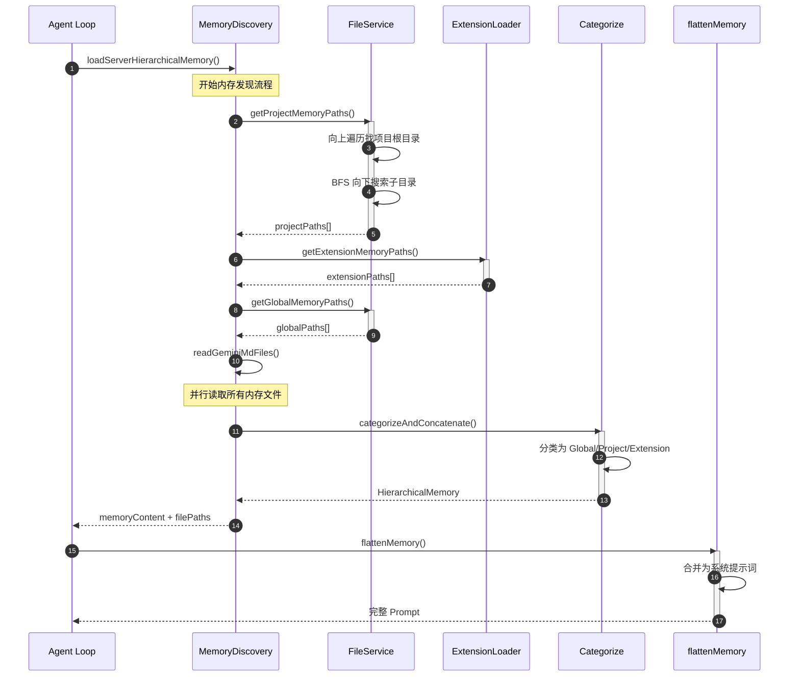
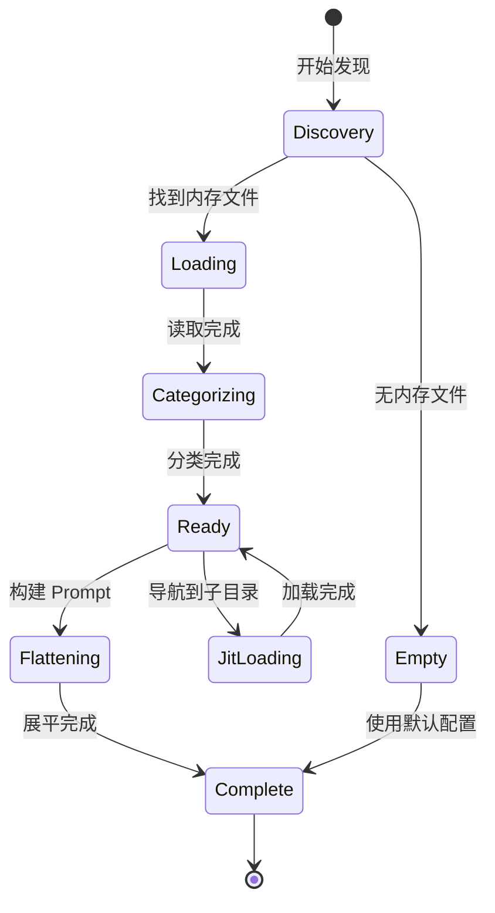
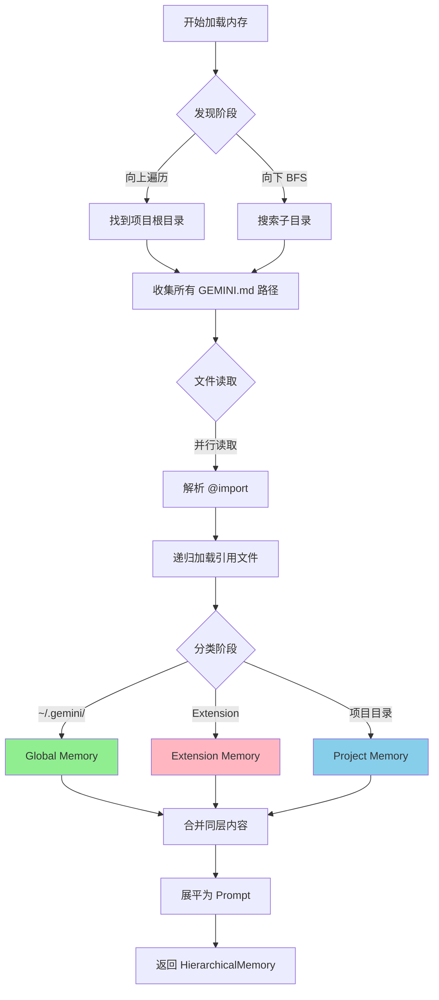
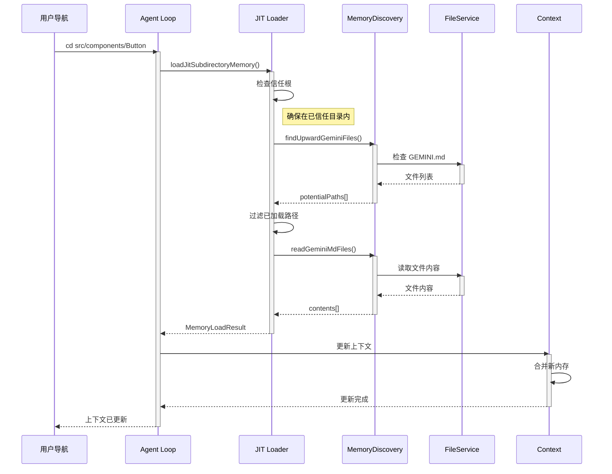
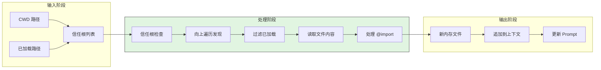
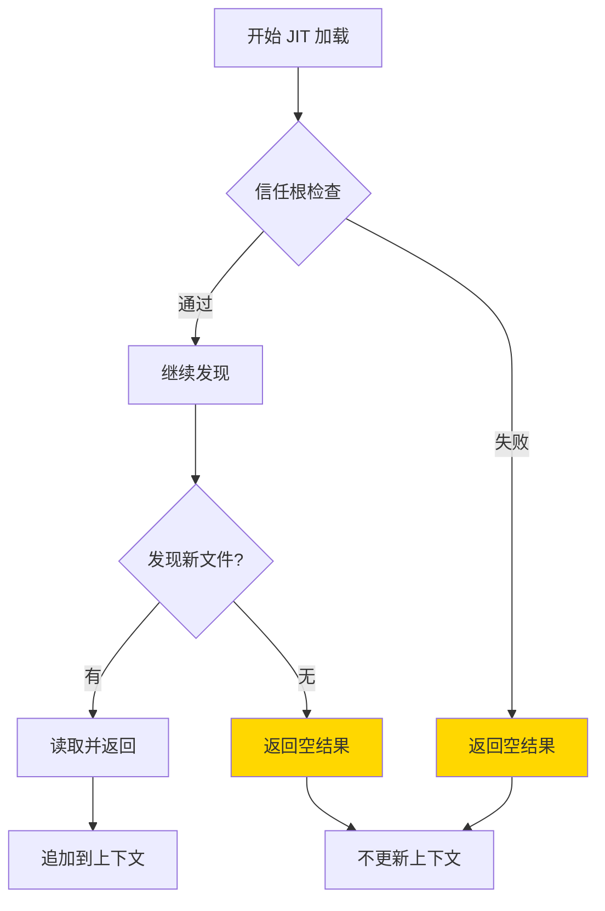
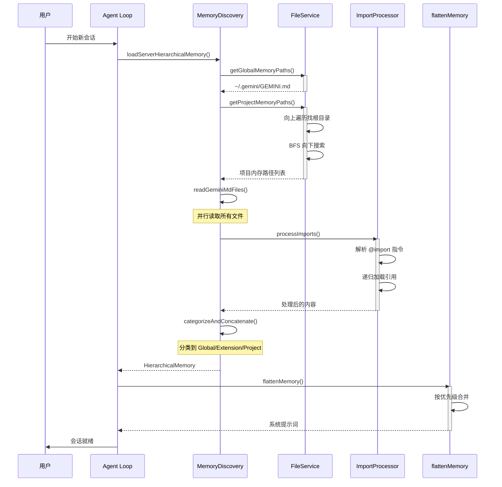
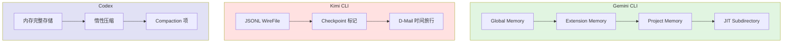

# Memory Context 管理（gemini-cli）

## TL;DR（结论先行）

一句话定义：Gemini CLI 的 Memory Context 采用"**三层分层 + JIT 动态加载 + 双向发现**"的设计，通过 Global/Extension/Project 三级 GEMINI.md 文件构建上下文，支持向上遍历和向下 BFS 搜索的内存发现机制，并在用户导航时动态加载子目录内存。

Gemini CLI 的核心取舍：**文件分层记忆 + JIT 动态加载**（对比 Kimi CLI 的 Checkpoint 回滚、Codex 的惰性压缩）

---

## 1. 为什么需要这个机制？（解决什么问题）

### 1.1 问题场景

没有 Memory Context 管理：
```
用户提问 → LLM 缺乏项目背景 → 回答泛泛而谈 → 需要反复解释项目规范
```

有 Memory Context 管理：
```
用户提问 → 自动加载 GEMINI.md → LLM 了解项目规范 → 精准回答
              ↓ 导航到子目录
              自动加载子目录 GEMINI.md → 获得更精确的上下文
```

### 1.2 核心挑战

| 挑战 | 不解决的后果 |
|-----|-------------|
| 项目上下文发现 | LLM 不了解项目规范，每次都需要重新说明 |
| 多层级记忆管理 | 全局/项目/扩展的上下文冲突或遗漏 |
| 动态子目录加载 | 进入子目录后上下文丢失，需要重新加载 |
| 记忆文件格式 | 不同格式（.md/.yml）需要统一处理 |
| 文件引用解析 | GEMINI.md 中的 @import 需要递归处理 |

---

## 2. 整体架构（ASCII 图）

### 2.1 在系统中的位置

```text
┌─────────────────────────────────────────────────────────────┐
│ Agent Loop / Session Runtime                                 │
│ packages/core/src/services/chatService.ts                    │
└───────────────────────┬─────────────────────────────────────┘
                        │
        ┌───────────────┼───────────────┐
        ▼               ▼               ▼
┌──────────────┐ ┌──────────────┐ ┌──────────────┐
│ Memory Tool  │ │ JIT Loader   │ │ Import       │
│ 内存工具     │ │ 动态加载     │ │ Processor    │
└──────┬───────┘ └──────┬───────┘ └──────┬───────┘
       │                │                │
       ▼                ▼                ▼
┌─────────────────────────────────────────────────────────────┐
│ ▓▓▓ Memory Context ▓▓▓                                      │
│ packages/core/src/                                           │
│ - config/memory.ts        : HierarchicalMemory 结构         │
│ - utils/memoryDiscovery.ts: 内存发现服务                     │
│ - utils/memoryImportProcessor.ts: Import 处理               │
│ - tools/memoryTool.ts     : 内存工具实现                     │
└───────────────────────┬─────────────────────────────────────┘
                        │ 依赖
        ┌───────────────┼───────────────┐
        ▼               ▼               ▼
┌──────────────┐ ┌──────────────┐ ┌──────────────┐
│ FileService  │ │ Extension    │ │ ChatRecording│
│ 文件发现     │ │ Loader       │ │ Service      │
└──────────────┘ └──────────────┘ └──────────────┘
```

### 2.2 核心组件职责

| 组件 | 职责 | 代码位置 |
|-----|------|---------|
| `HierarchicalMemory` | 定义三层内存结构 | `packages/core/src/config/memory.ts:14` |
| `loadServerHierarchicalMemory` | 发现并加载所有内存文件 | `packages/core/src/utils/memoryDiscovery.ts:155` |
| `getGeminiMdFilePathsInternal` | 向上遍历 + 向下 BFS 发现 | `packages/core/src/utils/memoryDiscovery.ts:42` |
| `loadJitSubdirectoryMemory` | JIT 动态加载子目录内存 | `packages/core/src/utils/memoryDiscovery.ts:606` |
| `processImports` | 解析 @import 指令 | `packages/core/src/utils/memoryImportProcessor.ts` |
| `flattenMemory` | 合并三层内存为 Prompt | `packages/core/src/config/memory.ts:123` |

### 2.3 核心组件交互关系



**关键交互说明**：

| 步骤 | 交互内容 | 设计意图 |
|-----|---------|---------|
| 1 | Agent Loop 请求加载内存 | 统一入口，解耦发现与使用 |
| 2-3 | 项目内存发现 | 双向搜索确保找到所有相关 GEMINI.md |
| 4-5 | 扩展内存发现 | 支持插件提供额外上下文 |
| 6-7 | 全局内存发现 | 加载用户级默认配置 |
| 8 | 并行读取文件 | 提高加载效率 |
| 9-11 | 分类合并 | 按优先级组织内存层次 |
| 12-14 | 展平为 Prompt | 生成 LLM 可用的系统提示词 |

---

## 3. 核心组件详细分析

### 3.1 HierarchicalMemory 内部结构

#### 职责定位

HierarchicalMemory 是 Gemini CLI 内存管理的核心抽象，定义了三层内存结构，支持优先级递增的上下文叠加。

#### 状态机图



**状态说明**：

| 状态 | 说明 | 进入条件 | 退出条件 |
|-----|------|---------|---------|
| Discovery | 发现内存文件 | 开始加载 | 找到/未找到文件 |
| Loading | 读取文件内容 | 发现文件 | 读取完成 |
| Categorizing | 分类到三层 | 读取完成 | 分类完成 |
| Ready | 就绪状态 | 分类完成 | 收到新请求 |
| JitLoading | JIT 动态加载 | 导航到子目录 | 加载完成 |
| Flattening | 合并为 Prompt | 需要构建提示词 | 展平完成 |

#### 内部数据流

```text
┌─────────────────────────────────────────────────────────────┐
│  输入层                                                      │
│  ├── ~/.gemini/GEMINI.md        → Global Memory             │
│  ├── Extension.contextFiles     → Extension Memory          │
│  └── ./GEMINI.md (项目根)        → Project Memory            │
│  └── ./src/components/GEMINI.md → Project Memory (子目录)   │
└──────────────────────────┬──────────────────────────────────┘
                           ▼
┌─────────────────────────────────────────────────────────────┐
│  处理层                                                      │
│  ├── categorizeAndConcatenate()                             │
│  │   └── 按路径分类到 global/extension/project              │
│  ├── processImports()                                       │
│  │   └── 解析 @import 递归加载                              │
│  └── deduplicateContents()                                  │
│      └── 去重处理                                           │
└──────────────────────────┬──────────────────────────────────┘
                           ▼
┌─────────────────────────────────────────────────────────────┐
│  输出层                                                      │
│  ├── HierarchicalMemory {                                   │
│  │     global?: string,                                     │
│  │     extension?: string,                                  │
│  │     project?: string                                     │
│  │   }                                                      │
│  └── flattenMemory() → "--- Global ---\n..."                │
└─────────────────────────────────────────────────────────────┘
```

#### 关键算法逻辑



**算法要点**：

1. **双向发现**：向上遍历到项目根（.git 所在），向下 BFS 搜索子目录
2. **并行读取**：使用 Promise.all 并行加载所有内存文件
3. **分层优先级**：Global < Extension < Project，后者覆盖前者
4. **Import 递归**：支持 GEMINI.md 引用其他文件

#### 关键接口

| 接口 | 输入 | 输出 | 说明 | 代码位置 |
|-----|------|------|------|---------|
| `loadServerHierarchicalMemory()` | cwd, options | HierarchicalMemory | 主入口 | `memoryDiscovery.ts:155` |
| `categorizeAndConcatenate()` | paths, contents | HierarchicalMemory | 分类合并 | `memoryDiscovery.ts:400` |
| `flattenMemory()` | HierarchicalMemory | string | 展平为 Prompt | `config/memory.ts:123` |
| `processImports()` | content, basePath | processedContent | 处理引用 | `memoryImportProcessor.ts` |

---

### 3.2 内存发现服务内部结构

#### 职责定位

内存发现服务负责从文件系统中发现和收集所有 GEMINI.md 文件，实现双向搜索策略。

#### 关键算法逻辑

```typescript
// packages/core/src/utils/memoryDiscovery.ts:42-154
async function getGeminiMdFilePathsInternal(
  currentWorkingDirectory: string,
  includeDirectories: readonly string[],
  fileService: FileDiscoveryService,
  folderTrust: boolean,
  maxDirs: number = 200,
): Promise<MemoryDiscoveryResult> {
  // 1. 向上遍历找到项目根目录
  const projectRoot = await findProjectRoot(
    currentWorkingDirectory,
    fileService,
  );

  // 2. 从 CWD 向上收集 GEMINI.md
  const upwardPaths = await collectUpwardGeminiFiles(
    currentWorkingDirectory,
    projectRoot,
  );

  // 3. 从 CWD 向下 BFS 搜索
  const downwardPaths = await bfsSearchGeminiFiles(
    currentWorkingDirectory,
    maxDirs,
    fileService,
  );

  return { projectRoot, filePaths: [...upwardPaths, ...downwardPaths] };
}
```

**算法要点**：

1. **项目根目录检测**：通过 .git、package.json 等标记识别
2. **向上遍历**：从 CWD 向上到项目根，收集沿途 GEMINI.md
3. **向下 BFS**：从 CWD 开始广度优先搜索子目录
4. **目录限制**：默认最多搜索 200 个目录，防止性能问题

---

### 3.3 JIT 子目录内存加载内部结构

#### 职责定位

当用户导航到项目的子目录时，动态加载该子目录相关的 GEMINI.md 文件，实现上下文的渐进式增强。

#### 关键算法逻辑

```typescript
// packages/core/src/utils/memoryDiscovery.ts:606-676
export async function loadJitSubdirectoryMemory(
  targetPath: string,
  trustedRoots: string[],
  alreadyLoadedPaths: Set<string>,
  debugMode: boolean = false,
): Promise<MemoryLoadResult> {
  // 1. 找到包含 targetPath 的最深信任根目录
  let bestRoot: string | null = null;
  for (const root of trustedRoots) {
    if (resolvedTarget.startsWith(resolvedRootWithTrailing)) {
      if (!bestRoot || resolvedRoot.length > bestRoot.length) {
        bestRoot = resolvedRoot;
      }
    }
  }

  if (!bestRoot) {
    return { files: [] };  // 不在信任根目录中
  }

  // 2. 从 targetPath 向上遍历到 bestRoot
  const potentialPaths = await findUpwardGeminiFiles(
    resolvedTarget,
    bestRoot,
    debugMode,
  );

  // 3. 过滤已加载的路径
  const newPaths = potentialPaths.filter((p) => !alreadyLoadedPaths.has(p));

  // 4. 读取新发现的内存文件
  const contents = await readGeminiMdFiles(newPaths, debugMode, 'tree');
  return { files: contents.filter(...) };
}
```

**算法要点**：

1. **信任根检查**：确保目标路径在已信任的项目根目录内
2. **向上发现**：从目标子目录向上收集 GEMINI.md
3. **去重过滤**：避免重复加载已存在的内存文件
4. **动态追加**：将新发现的内存追加到现有上下文

---

### 3.4 组件间协作时序



**协作要点**：

1. **用户导航触发**：目录切换触发 JIT 加载
2. **信任根验证**：安全检查防止加载未授权目录
3. **向上发现策略**：从当前目录向上收集内存文件
4. **上下文更新**：动态追加到现有对话上下文

---

### 3.4 关键数据路径

#### 主路径（正常流程）



#### 异常路径（不在信任根中）



---

## 4. 端到端数据流转

### 4.1 正常流程（详细版）



**数据变换详情**：

| 阶段 | 输入 | 处理 | 输出 | 代码位置 |
|-----|------|------|------|---------|
| 发现 | CWD, options | 向上遍历 + BFS | 文件路径列表 | `memoryDiscovery.ts:42` |
| 读取 | 路径列表 | 并行读取 | 原始内容 | `memoryDiscovery.ts:300` |
| Import 处理 | 原始内容 | 解析 @import | 展开内容 | `memoryImportProcessor.ts` |
| 分类 | 展开内容 | 按路径分类 | HierarchicalMemory | `memoryDiscovery.ts:400` |
| 展平 | HierarchicalMemory | 按优先级合并 | 系统提示词 | `config/memory.ts:123` |

### 4.2 数据流向图

```mermaid
flowchart LR
    subgraph Input["输入"]
        I1[GEMINI.md 文件]
        I2[@import 引用]
        I3[Extension 配置]
    end

    subgraph Discovery["发现层"]
        D1[向上遍历]
        D2[向下 BFS]
        D3[信任根检查]
    end

    subgraph Processing["处理层"]
        P1[读取文件]
        P2[处理 Import]
        P3[分类合并]
    end

    subgraph Output["输出"]
        O1[HierarchicalMemory]
        O2[系统提示词]
    end

    I1 --> D1
    I1 --> D2
    I3 --> D3

    D1 --> P1
    D2 --> P1
    D3 --> P1

    I2 --> P2
    P1 --> P2
    P2 --> P3

    P3 --> O1
    O1 --> O2
```

### 4.3 异常/边界流程

```mermaid
flowchart TD
    A[开始加载] --> B{找到项目根?}
    B -->|是| C[正常发现]
    B -->|否| D[仅使用全局内存]

    C --> E{发现内存文件?}
    E -->|有| F[读取文件]
    E -->|无| G[使用默认配置]

    F --> H{@import 解析?}
    H -->|成功| I[递归加载]
    H -->|循环引用| J[跳过重复]
    H -->|文件不存在| K[记录警告]

    I --> L[分类合并]
    J --> L
    K --> L
    G --> M[返回空内存]
    D --> N[仅 Global]
    L --> O[返回 HierarchicalMemory]

    style D fill:#FFD700
    style G fill:#FFD700
    style J fill:#87CEEB
    style K fill:#FFB6C1
```

---

## 5. 关键代码实现

### 5.1 核心数据结构

```typescript
// packages/core/src/config/memory.ts:14-20
export interface HierarchicalMemory {
  global?: string;      // ~/.gemini/GEMINI.md
  extension?: string;   // 扩展提供的内存
  project?: string;     // 工作目录的 GEMINI.md
}

// packages/core/src/utils/memoryDiscovery.ts:149-154
export interface LoadServerHierarchicalMemoryResponse {
  memoryContent: HierarchicalMemory;
  fileCount: number;
  filePaths: string[];
}
```

**字段说明**：

| 字段 | 类型 | 用途 |
|-----|------|------|
| `global` | `string?` | 用户级全局内存内容 |
| `extension` | `string?` | 扩展提供的上下文 |
| `project` | `string?` | 项目级内存内容（最高优先级） |
| `fileCount` | `number` | 加载的文件数量统计 |
| `filePaths` | `string[]` | 加载的文件路径列表 |

### 5.2 主链路代码

```typescript
// packages/core/src/config/memory.ts:123-141
export function flattenMemory(memory?: string | HierarchicalMemory): string {
  if (!memory) return '';
  if (typeof memory === 'string') return memory;

  const sections: Array<{ name: string; content: string }> = [];
  if (memory.global?.trim()) {
    sections.push({ name: 'Global', content: memory.global.trim() });
  }
  if (memory.extension?.trim()) {
    sections.push({ name: 'Extension', content: memory.extension.trim() });
  }
  if (memory.project?.trim()) {
    sections.push({ name: 'Project', content: memory.project.trim() });
  }

  return sections
    .map((s) => `--- ${s.name} ---\n${s.content}`)
    .join('\n\n');
}
```

**代码要点**：

1. **优先级顺序**：Global → Extension → Project，后者覆盖前者
2. **空值过滤**：跳过空内容，避免冗余分隔符
3. **格式统一**：使用 `--- Name ---` 格式清晰区分来源
4. **字符串拼接**：简单高效的字符串连接

### 5.3 关键调用链

```text
ChatService.initializeSession()
  -> loadServerHierarchicalMemory()     [memoryDiscovery.ts:155]
    -> getGeminiMdFilePathsInternal()   [memoryDiscovery.ts:42]
      -> findProjectRoot()              [memoryDiscovery.ts]
      -> collectUpwardGeminiFiles()     [memoryDiscovery.ts]
      -> bfsSearchGeminiFiles()         [memoryDiscovery.ts]
    -> readGeminiMdFiles()              [memoryDiscovery.ts:300]
      -> processImports()               [memoryImportProcessor.ts]
    -> categorizeAndConcatenate()       [memoryDiscovery.ts:400]
  -> flattenMemory()                    [config/memory.ts:123]
    -> 合并为系统提示词

// JIT 加载路径
ChatService.onDirectoryChange()
  -> loadJitSubdirectoryMemory()        [memoryDiscovery.ts:606]
    -> findBestRoot()                   [memoryDiscovery.ts]
    -> findUpwardGeminiFiles()          [memoryDiscovery.ts]
    -> 追加到现有上下文
```

---

## 6. 设计意图与 Trade-off

### 6.1 Gemini CLI 的选择

| 维度 | Gemini CLI 的选择 | 替代方案 | 取舍分析 |
|-----|------------------|---------|---------|
| 记忆结构 | 三层分层（Global/Extension/Project） | 单层统一存储 | 层次清晰可扩展，但合并逻辑复杂 |
| 发现机制 | 双向发现（向上遍历 + 向下 BFS） | 仅向上或仅向下 | 发现全面，但可能加载过多文件 |
| 动态加载 | JIT 按需加载 | 一次性全量加载 | 启动快，但导航时有延迟 |
| 文件格式 | .md/.yml/.yaml 多格式 | 单一格式 | 灵活性好，但解析复杂 |
| Import 系统 | @import 递归引用 | 无引用系统 | 支持模块化，但需处理循环引用 |
| 压缩策略 | 两阶段验证（轻量 + 主模型） | 单阶段压缩 | 摘要质量高，但成本更高 |

### 6.2 为什么这样设计？

**核心问题**：如何在多项目、多层级的工作环境中提供一致的上下文管理？

**Gemini CLI 的解决方案**：
- 代码依据：`memoryDiscovery.ts:42` 的双向发现逻辑
- 设计意图：通过分层记忆解决全局配置与项目特定需求的冲突
- 带来的好处：
  - 用户级全局配置自动应用
  - 项目级配置精确控制
  - 扩展可提供额外上下文
  - 子目录动态加载适应导航
- 付出的代价：
  - 内存发现逻辑复杂
  - 可能存在层级冲突
  - JIT 加载引入异步延迟

### 6.3 与其他项目的对比



| 项目 | 内存层次 | 发现机制 | 压缩策略 | 适用场景 |
|-----|---------|---------|---------|---------|
| **Gemini CLI** | 三层分层（Global/Extension/Project） | 双向发现（向上遍历 + 向下 BFS） | 两阶段验证压缩 | 多项目、需要精细记忆管理 |
| **Kimi CLI** | 单层 JSONL | 文件路径直接映射 | SimpleCompaction（保留最近 N 条） | 需要精确状态恢复、时间旅行 |
| **Codex** | 单层内存存储 | 内存直接管理 | 惰性压缩（触发式 Compaction） | 通用场景、平衡性能与精度 |

**核心差异分析**：

| 对比维度 | Gemini CLI | Kimi CLI | Codex |
|---------|-----------|----------|-------|
| **内存层次** | 三层分层，优先级递增 | 单层扁平，Checkpoint 标记 | 单层存储，Compaction 替换 |
| **发现机制** | 文件系统自动发现 | 固定路径加载 | 内存直接管理 |
| **压缩策略** | 两阶段验证（轻量+主模型） | 保留最近 N 条 + LLM 摘要 | 惰性触发 + 渐进式移除 |
| **持久化** | 无（每次重新发现） | JSONL 文件 + Checkpoint | JSON Lines Rollout |
| **动态加载** | JIT 子目录加载 | 无（固定路径） | 无 |
| **回滚能力** | 无 | Checkpoint + D-Mail | 无 |

**选择建议**：

- **Gemini CLI**：适合需要在多个项目间切换，且每个项目有复杂目录结构的用户
- **Kimi CLI**：适合需要精确控制对话历史、经常需要回滚到之前状态的用户
- **Codex**：适合追求简单高效，不需要复杂记忆管理的通用场景

---

## 7. 边界情况与错误处理

### 7.1 终止条件

| 终止原因 | 触发条件 | 代码位置 |
|---------|---------|---------|
| 不在信任根目录 | targetPath 不在 trustedRoots 中 | `memoryDiscovery.ts:630` |
| 超过目录限制 | BFS 搜索超过 maxDirs（默认 200） | `memoryDiscovery.ts:maxDirs` |
| 无内存文件 | 未发现任何 GEMINI.md 文件 | `memoryDiscovery.ts` |
| Import 循环引用 | @import 形成循环依赖 | `memoryImportProcessor.ts` |
| 文件读取失败 | 权限不足或文件不存在 | `memoryDiscovery.ts:300` |

### 7.2 目录限制

```typescript
// packages/core/src/utils/memoryDiscovery.ts:155
export async function loadServerHierarchicalMemory(
  ...
  maxDirs: number = 200,  // 默认限制
): Promise<LoadServerHierarchicalMemoryResponse> {
  // BFS 搜索时限制目录数量，防止性能问题
}
```

### 7.3 错误恢复策略

| 错误类型 | 处理策略 | 代码位置 |
|---------|---------|---------|
| 信任根检查失败 | 返回空结果，不加载内存 | `memoryDiscovery.ts:630` |
| 文件读取失败 | 跳过该文件，继续处理其他 | `memoryDiscovery.ts:300` |
| Import 文件不存在 | 记录警告，保留原 @import 行 | `memoryImportProcessor.ts` |
| 循环引用 | 检测并跳过已处理文件 | `memoryImportProcessor.ts` |
| 解析失败 | 返回原始内容，不做处理 | `memoryDiscovery.ts` |

---

## 8. 关键代码索引

| 功能 | 文件 | 行号 | 说明 |
|-----|------|------|------|
| 核心结构 | `packages/core/src/config/memory.ts` | 14 | HierarchicalMemory 接口 |
| 内存展平 | `packages/core/src/config/memory.ts` | 123 | flattenMemory 函数 |
| 内存发现入口 | `packages/core/src/utils/memoryDiscovery.ts` | 155 | loadServerHierarchicalMemory |
| 文件路径发现 | `packages/core/src/utils/memoryDiscovery.ts` | 42 | getGeminiMdFilePathsInternal |
| JIT 加载 | `packages/core/src/utils/memoryDiscovery.ts` | 606 | loadJitSubdirectoryMemory |
| 分类合并 | `packages/core/src/utils/memoryDiscovery.ts` | 400 | categorizeAndConcatenate |
| Import 处理 | `packages/core/src/utils/memoryImportProcessor.ts` | - | processImports |
| 内存工具 | `packages/core/src/tools/memoryTool.ts` | - | getAllGeminiMdFilenames |
| Session 恢复 | `packages/core/src/services/chatRecordingService.ts` | - | 会话恢复时重新加载内存 |

---

## 9. 延伸阅读

- 前置知识：`04-gemini-cli-agent-loop.md`（Agent Loop 如何使用内存）
- 相关机制：`03-gemini-cli-session-runtime.md`（Session 如何管理内存生命周期）
- 深度分析：`docs/gemini-cli/questions/gemini-cli-memory-discovery.md`（内存发现算法详解）
- 跨项目对比：`docs/comm/comm-memory-context.md`（多项目 Memory 对比）

---

*✅ Verified: 基于 gemini-cli/packages/core/src/utils/memoryDiscovery.ts 等源码分析*
*基于版本：2026-02-08 | 最后更新：2026-02-24*
