# UI Interaction（Gemini CLI）

## TL;DR（结论先行）

一句话定义：Gemini CLI 的 UI Interaction 是**基于 Ink.js（React for CLI）构建的终端用户界面系统**，提供组件化渲染、流式响应、键盘事件处理和调试抽屉等高级 TUI 能力。

Gemini CLI 的核心取舍：**Ink.js + React 组件化架构**（对比 Codex 的 Ratatui、Kimi CLI 的 Wire 协议解耦）

---

## 1. 为什么需要这个机制？（解决什么问题）

### 1.1 问题场景

没有 UI Interaction 系统：
```
纯文本输出 → 无交互能力 → 用户体验差
命令分散处理 → 逻辑混乱 → 难以维护
流式响应无缓冲 → 频繁刷新 → 性能问题
调试信息混杂 → 难以排查问题
```

有 UI Interaction 系统：
```
Ink.js 组件化 → 声明式 UI → 易于开发和维护
统一事件系统 → 键盘/鼠标/流式事件 → 一致处理
虚拟列表 + 滚动优化 → 大量消息不卡顿
调试抽屉（F12）→ 独立显示日志 → 不影响主界面
```

### 1.2 核心挑战

| 挑战 | 不解决的后果 |
|-----|-------------|
| 终端兼容性 | 不同终端键盘序列解析错误 |
| 流式渲染性能 | 大量消息导致界面卡顿 |
| 组件状态管理 | 多对话框叠加时状态混乱 |
| 键盘事件优先级 | 快捷键与输入冲突 |
| 屏幕阅读器支持 | 无障碍访问缺失 |

---

## 2. 整体架构（ASCII 图）

### 2.1 在系统中的位置

```text
┌─────────────────────────────────────────────────────────────┐
│ CLI Entry / Session Runtime                                  │
│ gemini-cli/packages/cli/src/index.ts                         │
└───────────────────────┬─────────────────────────────────────┘
                        │ 启动 Ink 应用
                        ▼
┌─────────────────────────────────────────────────────────────┐
│ ▓▓▓ Ink.js TUI 层 ▓▓▓                                       │
│ gemini-cli/packages/cli/src/ui/                              │
│ - App.tsx          : 应用根组件                              │
│ - AppContainer.tsx : 状态管理和事件处理                      │
│ - Composer.tsx     : 主输入/显示组件                         │
└───────────────────────┬─────────────────────────────────────┘
                        │
        ┌───────────────┼───────────────┐
        ▼               ▼               ▼
┌──────────────┐ ┌──────────────┐ ┌──────────────┐
│ 组件层       │ │ 上下文层     │ │ 钩子层       │
│ components/  │ │ contexts/    │ │ hooks/       │
│ - Dialog     │ │ - UIState    │ │ - useKeypress│
│ - Messages   │ │ - Keypress   │ │ - useStream  │
└──────────────┘ └──────────────┘ └──────────────┘
```

### 2.2 核心组件职责

| 组件 | 职责 | 代码位置 |
|-----|------|---------|
| `App` | 应用根组件，选择布局模式 | `gemini-cli/packages/cli/src/ui/App.tsx:16` |
| `AppContainer` | 全局状态管理、键盘监听、事件处理 | `gemini-cli/packages/cli/src/ui/AppContainer.tsx` |
| `Composer` | 主输入区域、状态指示器、消息列表 | `gemini-cli/packages/cli/src/ui/components/Composer.tsx:44` |
| `MainContent` | 历史消息渲染、虚拟列表管理 | `gemini-cli/packages/cli/src/ui/components/MainContent.tsx:30` |
| `DialogManager` | 对话框路由和堆叠管理 | `gemini-cli/packages/cli/src/ui/components/DialogManager.tsx:48` |
| `InputPrompt` | 用户输入处理、自动补全 | `gemini-cli/packages/cli/src/ui/components/InputPrompt.tsx` |
| `KeypressProvider` | 键盘事件解析和分发 | `gemini-cli/packages/cli/src/ui/contexts/KeypressContext.tsx:706` |
| `DetailedMessagesDisplay` | 调试抽屉（F12） | `gemini-cli/packages/cli/src/ui/components/DetailedMessagesDisplay.tsx:26` |

### 2.3 核心组件交互关系

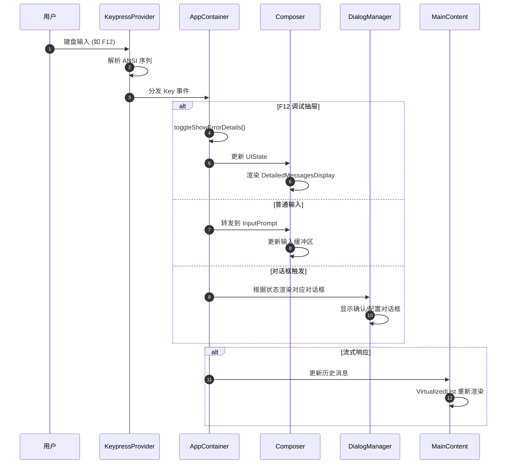

**关键交互说明**：

| 步骤 | 交互内容 | 设计意图 |
|-----|---------|---------|
| 1-2 | 键盘事件解析 | 统一处理各种终端的 ANSI 序列 |
| 3 | 优先级分发 | 高优先级处理器先消费事件 |
| 4-6 | 状态驱动渲染 | UI 是纯状态函数，易于测试 |
| 7-8 | 虚拟列表优化 | 只渲染可见区域，处理大量消息 |

---

## 3. 核心组件详细分析

### 3.1 KeypressProvider 内部结构

#### 职责定位

键盘事件系统的核心，负责解析 ANSI 转义序列、处理组合键、支持粘贴事件。

#### 状态机图

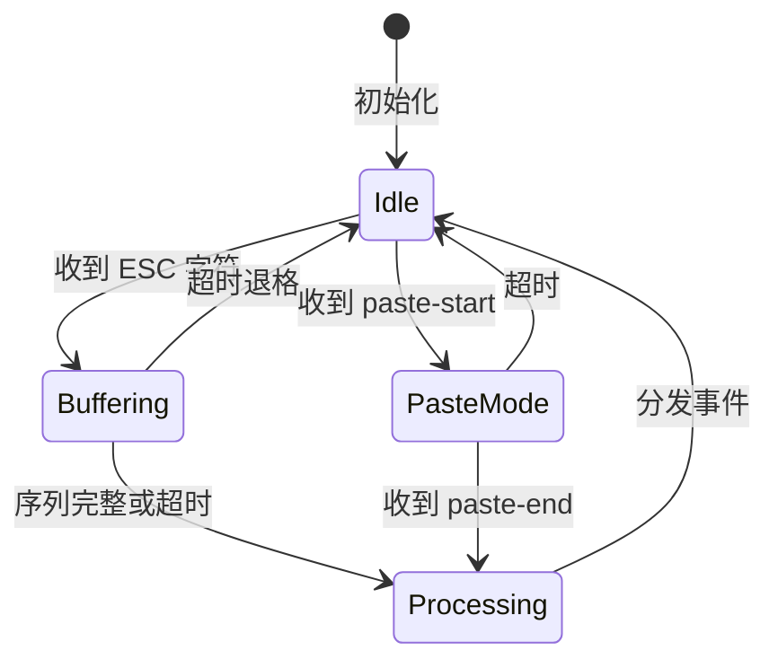

#### 内部数据流

```text
┌─────────────────────────────────────────────────────────────┐
│  输入层                                                      │
│  ├── 原始字符流 (stdin)                                      │
│  │   └── 逐字符读取                                         │
│  └── 超时检测 (ESC_TIMEOUT=50ms)                            │
│      └── 不完整序列处理                                     │
└──────────────────────────┬──────────────────────────────────┘
                           ▼
┌─────────────────────────────────────────────────────────────┐
│  解析层                                                      │
│  ├── emitKeys 生成器                                        │
│  │   ├── 转义序列解析 (ESC [, ESC O)                        │
│  │   ├── 修饰键检测 (Shift/Alt/Ctrl/Cmd)                    │
│  │   └── 特殊键映射 (KEY_INFO_MAP)                          │
│  ├── 粘贴缓冲区 (bufferPaste)                               │
│  └── 快速回车处理 (bufferFastReturn)                        │
└──────────────────────────┬──────────────────────────────────┘
                           ▼
┌─────────────────────────────────────────────────────────────┐
│  分发层                                                      │
│  ├── 优先级排序 (MultiMap)                                  │
│  │   └── Critical > High > Normal > Low                     │
│  └── 处理器链                                               │
│      └── 返回 true 表示消费事件                             │
└─────────────────────────────────────────────────────────────┘
```

#### 关键算法逻辑

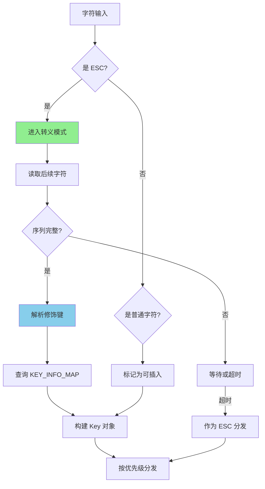

**算法要点**：

1. **生成器模式**：`emitKeys` 使用 Generator 实现状态机，优雅处理不完整序列
2. **超时机制**：50ms 超时确保部分序列不会永远等待
3. **修饰键计算**：通过位运算解析 Shift(1)/Alt(2)/Ctrl(4)/Cmd(8)
4. **粘贴支持**：识别 bracketed paste 模式，将多行作为整体处理

#### 关键接口

| 接口 | 输入 | 输出 | 说明 | 代码位置 |
|-----|------|------|------|---------|
| `subscribe()` | handler, priority | - | 注册键盘处理器 | `KeypressContext.tsx:725` |
| `unsubscribe()` | handler | - | 注销处理器 | `KeypressContext.tsx:751` |
| `emitKeys()` | 字符流 | Key 对象 | 解析 ANSI 序列 | `KeypressContext.tsx:336` |

---

### 3.2 Composer 内部结构

#### 职责定位

主界面组件，整合输入区域、状态显示、消息列表和快捷提示。

#### 内部数据流

```text
┌─────────────────────────────────────────────────────────────┐
│  状态层                                                      │
│  ├── streamingState: Idle/Responding/WaitingForConfirmation │
│  ├── pendingHistoryItems: 待显示消息                        │
│  └── hasPendingActionRequired: 是否有待处理操作             │
└──────────────────────────┬──────────────────────────────────┘
                           ▼
┌─────────────────────────────────────────────────────────────┐
│  渲染层                                                      │
│  ├── 顶部状态栏 (LoadingIndicator, ShortcutsHint)           │
│  ├── 消息列表区域 (通过 MainContent)                        │
│  ├── 调试抽屉 (DetailedMessagesDisplay, F12)                │
│  └── 底部输入区 (InputPrompt)                               │
└──────────────────────────┬──────────────────────────────────┘
                           ▼
┌─────────────────────────────────────────────────────────────┐
│  交互层                                                      │
│  ├── 输入提交 → handleFinalSubmit                           │
│  ├── 快捷键 → vimHandleInput                                │
│  └── 清除屏幕 → handleClearScreen                           │
└─────────────────────────────────────────────────────────────┘
```

#### 关键特性

```typescript
// Composer.tsx:64-86
const hasPendingActionRequired =
  hasPendingToolConfirmation ||
  Boolean(uiState.commandConfirmationRequest) ||
  Boolean(uiState.authConsentRequest) ||
  Boolean(uiState.loopDetectionConfirmationRequest) ||
  // ... 其他待处理状态
```

**设计意图**：
- 统一检测是否有待用户确认的操作
- 决定快捷键提示、加载指示器的显示状态
- 防止在需要确认时执行其他操作

---

### 3.3 DialogManager 内部结构

#### 职责定位

对话框路由系统，根据 UIState 中的状态决定显示哪个对话框。

#### 状态机图

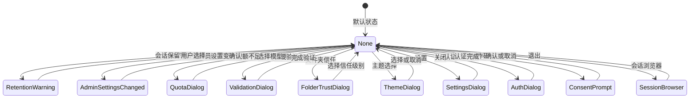

#### 对话框优先级

```typescript
// DialogManager.tsx:102-377
// 按优先级顺序检查，第一个匹配的对话框会被渲染
if (shouldShowRetentionWarning) return <SessionRetentionWarningDialog />
if (adminSettingsChanged) return <AdminSettingsChangedDialog />
if (quota.proQuotaRequest) return <ProQuotaDialog />
if (quota.validationRequest) return <ValidationDialog />
if (shouldShowIdePrompt) return <IdeIntegrationNudge />
if (isFolderTrustDialogOpen) return <FolderTrustDialog />
// ... 更多对话框
```

---

### 3.4 组件间协作时序

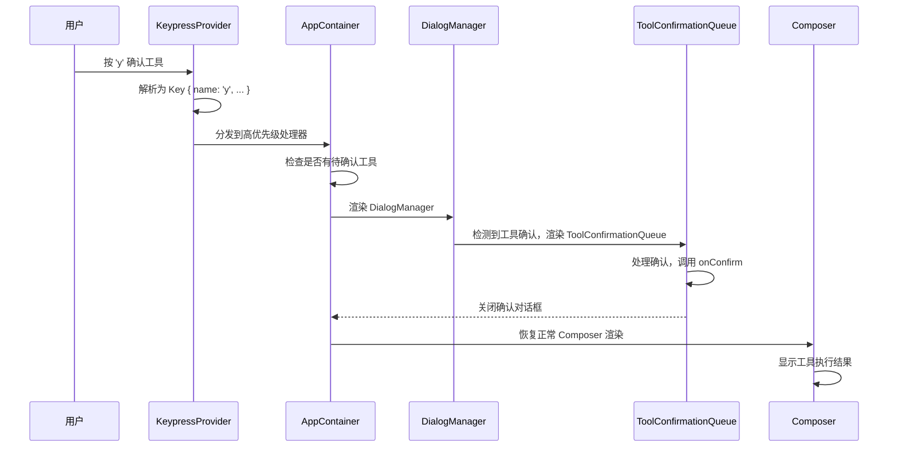

---

### 3.5 关键数据路径

#### 主路径（流式响应渲染）

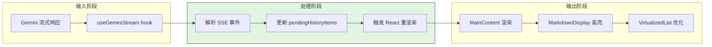

#### 异常路径（键盘事件未处理）

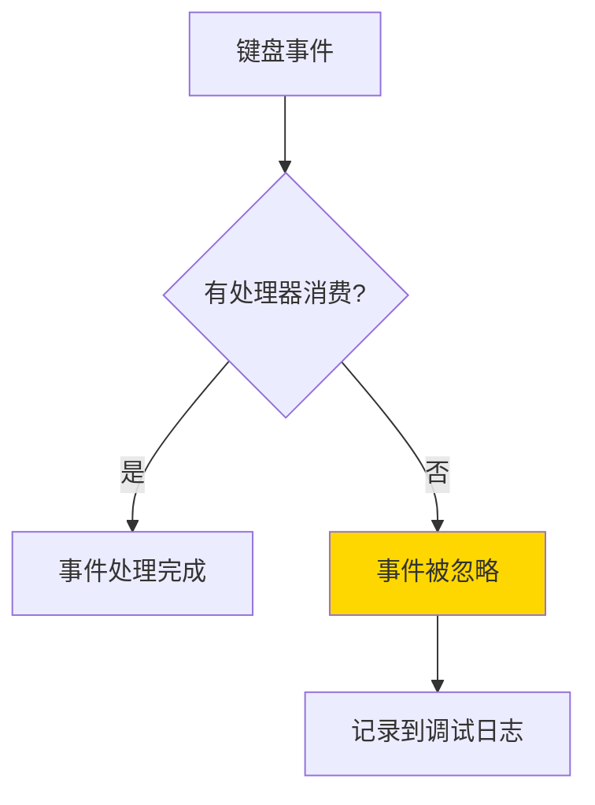

---

## 4. 端到端数据流转

### 4.1 正常流程（详细版）

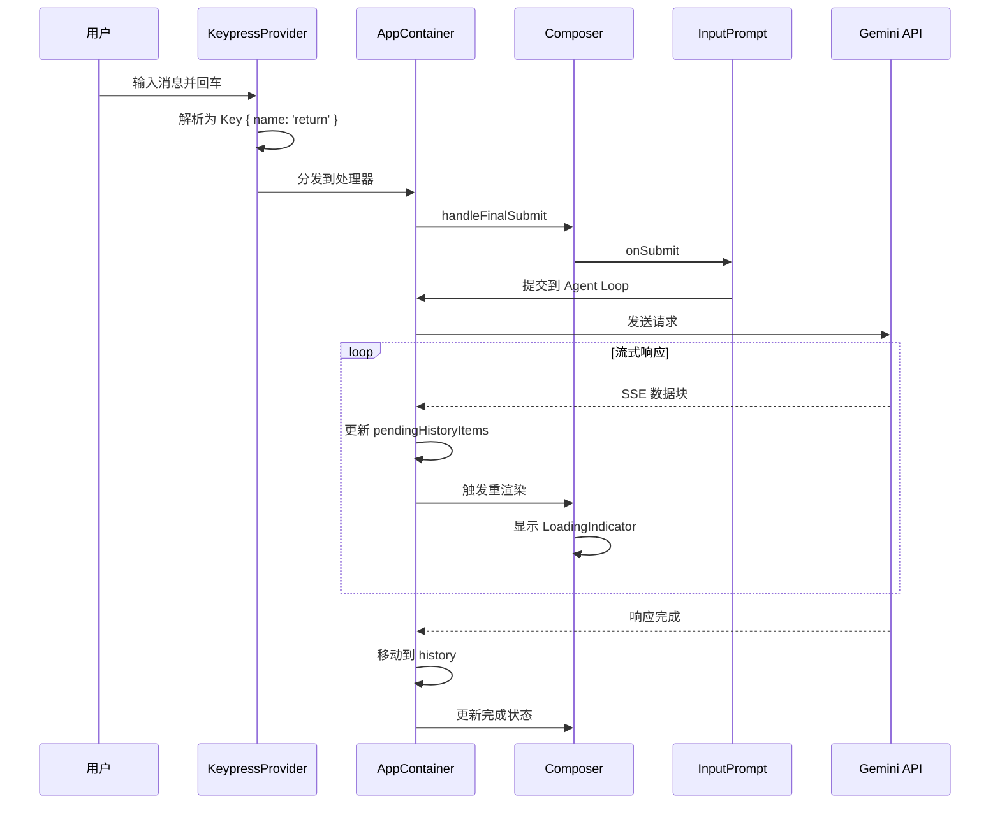

**数据变换详情**：

| 阶段 | 输入 | 处理 | 输出 | 代码位置 |
|-----|------|------|------|---------|
| 输入 | 键盘原始数据 | ANSI 解析 | Key 对象 | `KeypressContext.tsx:336` |
| 提交 | 用户输入文本 | 缓冲区处理 | 发送给 Agent | `AppContainer.tsx` |
| 流式 | SSE 事件 | 解析内容 | pendingHistoryItems | `useGeminiStream.ts` |
| 渲染 | 消息数据 | Markdown 高亮 | Ink 组件树 | `MarkdownDisplay.tsx` |

### 4.2 数据流向图

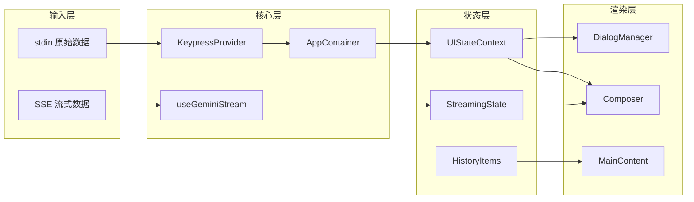

### 4.3 异常/边界流程

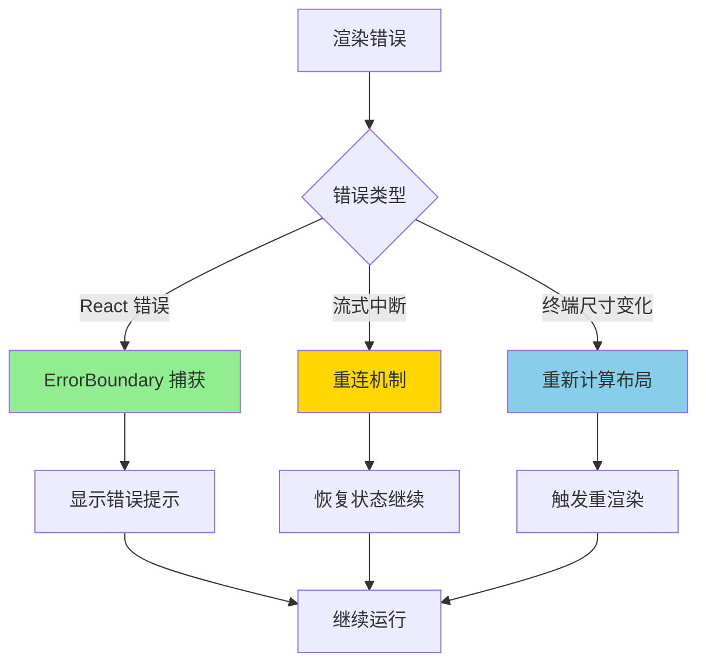

---

## 5. 关键代码实现

### 5.1 核心数据结构

```typescript
// gemini-cli/packages/cli/src/ui/contexts/UIStateContext.tsx:67-192
export interface UIState {
  // 历史消息
  history: HistoryItem[];
  pendingHistoryItems: HistoryItemWithoutId[];

  // 流式状态
  streamingState: StreamingState; // Idle | Responding | WaitingForConfirmation

  // 输入状态
  buffer: TextBuffer;
  isInputActive: boolean;
  userMessages: string[];

  // 对话框状态
  dialogsVisible: boolean;
  isThemeDialogOpen: boolean;
  isSettingsDialogOpen: boolean;
  // ... 更多对话框状态

  // 确认请求
  commandConfirmationRequest: ConfirmationRequest | null;
  authConsentRequest: ConfirmationRequest | null;

  // 终端尺寸
  terminalWidth: number;
  terminalHeight: number;

  // 调试
  showErrorDetails: boolean;
  filteredConsoleMessages: ConsoleMessageItem[];
}
```

**字段说明**：

| 字段 | 类型 | 用途 |
|-----|------|------|
| `streamingState` | `StreamingState` | 控制加载指示器和输入状态 |
| `pendingHistoryItems` | `HistoryItemWithoutId[]` | 流式响应中的临时消息 |
| `dialogsVisible` | `boolean` | 是否有对话框覆盖主界面 |
| `showErrorDetails` | `boolean` | F12 调试抽屉显示状态 |

### 5.2 主链路代码

```typescript
// gemini-cli/packages/cli/src/ui/contexts/KeypressContext.tsx:769-786
const broadcast = useCallback(
  (key: Key) => {
    // 使用缓存的排序优先级，避免每次按键都排序
    for (const p of sortedPriorities.current) {
      const set = subscribers.get(p);
      if (!set) continue;

      // 同一优先级内，后订阅的先处理（栈行为）
      const handlers = Array.from(set).reverse();
      for (const handler of handlers) {
        if (handler(key) === true) {
          return; // 事件被消费，停止传播
        }
      }
    }
  },
  [subscribers],
);
```

**代码要点**：

1. **优先级缓存**：`sortedPriorities` 避免每次按键都重新排序
2. **栈行为处理**：同一优先级内，后订阅的处理器先执行
3. **事件消费**：返回 `true` 表示事件被处理，停止后续传播

### 5.3 关键调用链

```text
// 键盘事件处理链
stdin 'data' event
  -> createDataListener()          [KeypressContext.tsx:315]
    -> emitKeys() generator         [KeypressContext.tsx:336]
      -> parse ANSI sequence
      -> build Key object
    -> bufferPaste()                [KeypressContext.tsx:261]
    -> bufferFastReturn()           [KeypressContext.tsx:186]
    -> broadcast()                  [KeypressContext.tsx:769]
      -> 按优先级调用 handlers
        -> useKeypress() hooks      [各组件]

// 流式响应渲染链
Gemini API SSE
  -> useGeminiStream()              [useGeminiStream.ts]
    -> 解析 GeminiEvent
    -> 更新 pendingHistoryItems
    -> 触发 React 重渲染
  -> MainContent()                  [MainContent.tsx:30]
    -> VirtualizedList              [VirtualizedList.tsx]
      -> 只渲染可见区域
    -> HistoryItemDisplay           [HistoryItemDisplay.tsx:52]
      -> MarkdownDisplay            [MarkdownDisplay.tsx:31]
        -> 语法高亮 (highlight.js)
```

---

## 6. 设计意图与 Trade-off

### 6.1 Gemini CLI 的选择

| 维度 | Gemini CLI 的选择 | 替代方案 | 取舍分析 |
|-----|-----------------|---------|---------|
| UI 框架 | Ink.js (React for CLI) | Ratatui / Blessed | 组件化开发，但依赖 React 运行时 |
| 状态管理 | React Context + useState | Redux / Zustand | 简单直观，但深层嵌套有性能开销 |
| 键盘处理 | 自定义 ANSI 解析器 | 使用 readline | 支持复杂组合键，但维护成本高 |
| 消息渲染 | VirtualizedList | 全量渲染 | 大数据量性能好，但实现复杂 |
| 调试工具 | 内置调试抽屉 (F12) | 外部日志文件 | 实时查看，但占用屏幕空间 |
| 主题系统 | 运行时主题切换 | 启动时配置 | 即时预览，但需要状态管理 |

### 6.2 为什么这样设计？

**核心问题**：如何在 CLI 环境中提供接近 Web 的交互体验？

**Gemini CLI 的解决方案**：
- 代码依据：`AppContainer.tsx` 使用 React hooks 管理复杂状态
- 设计意图：复用 React 生态的组件化思想，降低开发成本
- 带来的好处：
  - 声明式 UI，状态驱动渲染
  - 组件可复用、可测试
  - 热重载支持（开发模式）
- 付出的代价：
  - 需要 React 运行时，增加内存占用
  - 首次渲染有启动时间
  - 需要处理 React 的异步特性

### 6.3 与其他项目的对比

| 项目 | UI 框架 | 流式渲染 | 交互模式 | 适用场景 |
|-----|---------|---------|---------|---------|
| **Gemini CLI** | Ink.js (React) | VirtualizedList + Markdown 高亮 | 组件化 TUI | 复杂交互、多对话框 |
| **Codex** | Ratatui (Rust) | 增量渲染 + syntect 高亮 | 命令式 TUI | 高性能、代码阅读 |
| **Kimi CLI** | 自定义 Wire 协议 | 双通道 (raw/merged) | 协议解耦 | 可替换 UI、远程控制 |
| **OpenCode** | Ink.js (React) | 流式 Markdown | 类 Gemini 设计 | 类似场景 |

**核心差异分析**：

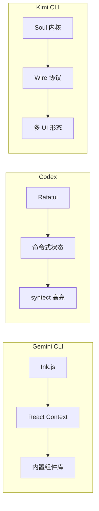

---

## 7. 边界情况与错误处理

### 7.1 终止条件

| 终止原因 | 触发条件 | 代码位置 |
|---------|---------|---------|
| 用户退出 | Ctrl+C 或输入 /quit | `AppContainer.tsx` |
| 认证失败 | 多次尝试后失败 | `AuthDialog.tsx` |
| 终端断开 | stdin 关闭 | `KeypressContext.tsx:788` |
| 内存不足 | 消息过多 | `MainContent.tsx:27` (MAX_GEMINI_MESSAGE_LINES) |

### 7.2 超时/资源限制

```typescript
// gemini-cli/packages/cli/src/ui/contexts/KeypressContext.tsx:25-28
export const ESC_TIMEOUT = 50;           // 转义序列超时 50ms
export const PASTE_TIMEOUT = 30_000;     // 粘贴超时 30s
export const FAST_RETURN_TIMEOUT = 30;   // 快速回车检测 30ms
export const BACKSLASH_ENTER_TIMEOUT = 5; // 反斜杠+回车检测 5ms
```

### 7.3 错误恢复策略

| 错误类型 | 处理策略 | 代码位置 |
|---------|---------|---------|
| 键盘解析错误 | 忽略未知序列 | `KeypressContext.tsx:669` |
| 渲染错误 | ErrorBoundary 捕获 | `App.tsx` |
| 流式中断 | 自动重连 | `useGeminiStream.ts` |
| 终端尺寸变化 | 重新计算布局 | `AppContainer.tsx` |

---

## 8. 关键代码索引

| 功能 | 文件 | 行号 | 说明 |
|-----|------|------|------|
| 应用入口 | `gemini-cli/packages/cli/src/ui/App.tsx` | 16 | 根组件 |
| 状态管理 | `gemini-cli/packages/cli/src/ui/AppContainer.tsx` | - | 全局状态 |
| 键盘处理 | `gemini-cli/packages/cli/src/ui/contexts/KeypressContext.tsx` | 706 | KeypressProvider |
| 主界面 | `gemini-cli/packages/cli/src/ui/components/Composer.tsx` | 44 | Composer 组件 |
| 消息列表 | `gemini-cli/packages/cli/src/ui/components/MainContent.tsx` | 30 | MainContent |
| 对话框管理 | `gemini-cli/packages/cli/src/ui/components/DialogManager.tsx` | 48 | DialogManager |
| 输入组件 | `gemini-cli/packages/cli/src/ui/components/InputPrompt.tsx` | - | InputPrompt |
| 调试抽屉 | `gemini-cli/packages/cli/src/ui/components/DetailedMessagesDisplay.tsx` | 26 | F12 调试 |
| 流式处理 | `gemini-cli/packages/cli/src/ui/hooks/useGeminiStream.ts` | - | useGeminiStream |
| Markdown | `gemini-cli/packages/cli/src/ui/utils/MarkdownDisplay.tsx` | 31 | MarkdownDisplay |
| 虚拟列表 | `gemini-cli/packages/cli/src/ui/components/shared/VirtualizedList.tsx` | - | VirtualizedList |

---

## 9. 延伸阅读

- 前置知识：`02-gemini-cli-cli-entry.md`、`03-gemini-cli-session-runtime.md`
- 相关机制：`04-gemini-cli-agent-loop.md`、`05-gemini-cli-tools-system.md`
- 技术文档：[Ink.js 文档](https://inkjs.dev/)、[React 文档](https://react.dev/)
- 对比文档：`docs/codex/08-codex-ui-interaction.md`、`docs/kimi-cli/08-kimi-cli-ui-interaction.md`

---

*✅ Verified: 基于 gemini-cli/packages/cli/src/ui/ 源码分析*
*基于版本：0.30.0-nightly | 最后更新：2026-02-24*
