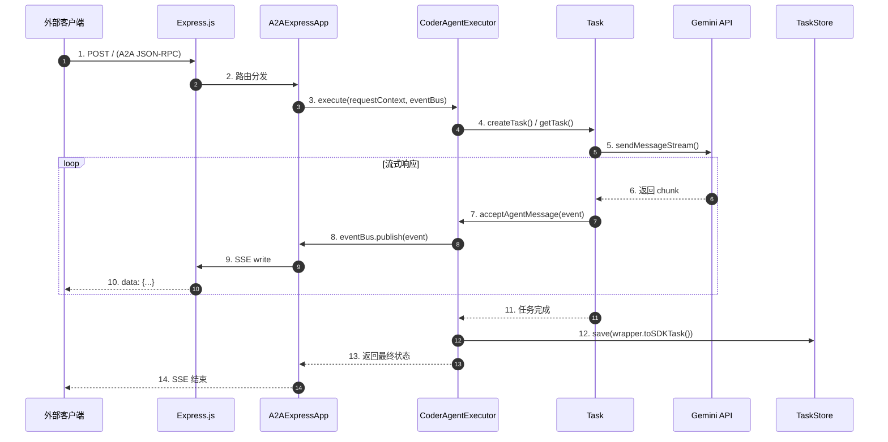
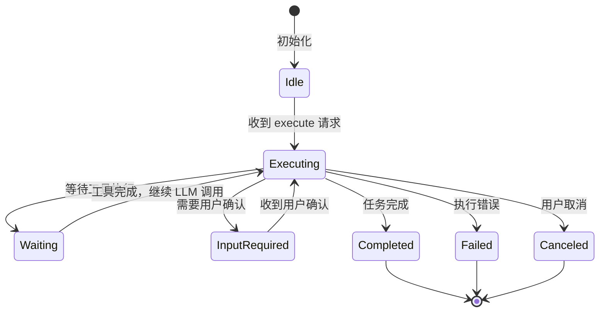
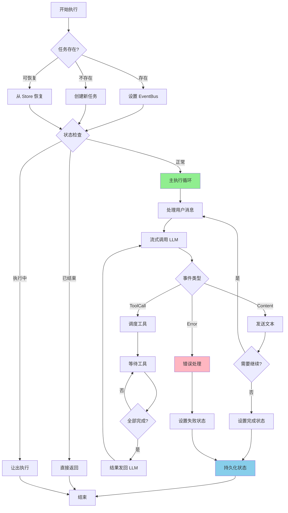
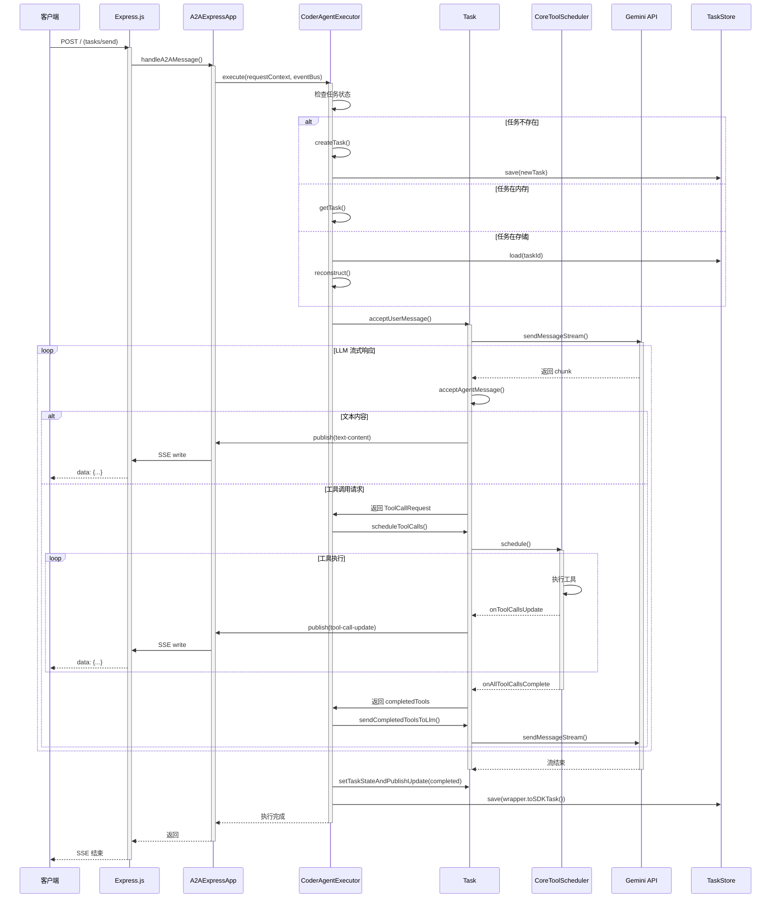
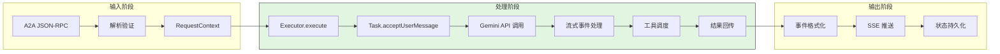
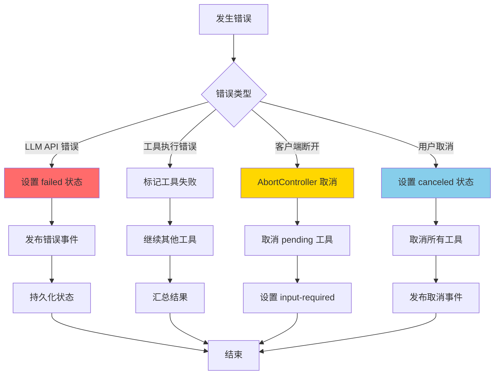
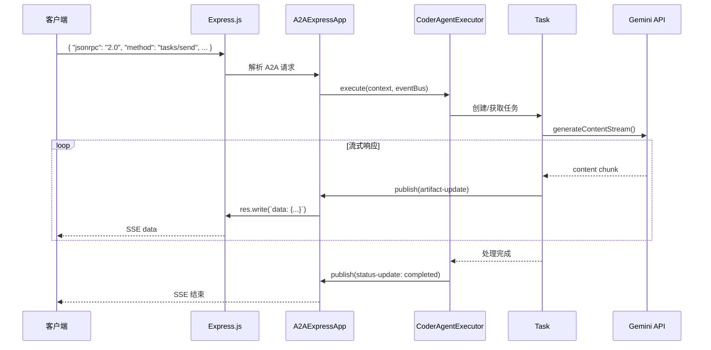
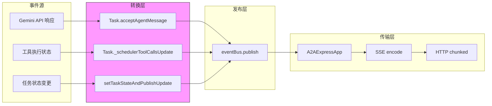
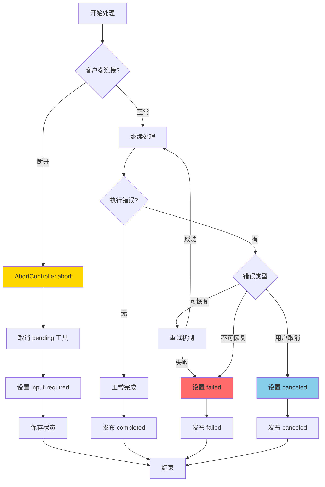
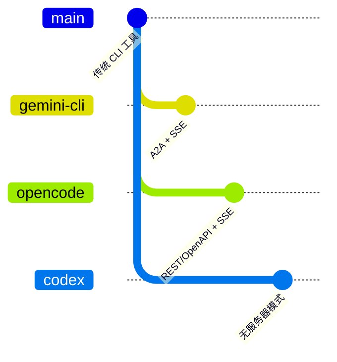

# Web Server（gemini-cli）

## TL;DR（结论先行）

一句话定义：gemini-cli 的 Web Server 是一个**基于 Express.js 的 A2A（Agent-to-Agent）协议实现**，使用 **Server-Sent Events (SSE)** 实现流式响应，支持 **JSON-RPC 2.0** 格式的 agent 间通信。

gemini-cli 的核心取舍：**A2A 标准协议 + SSE 流式通信**（对比 opencode 的 REST/OpenAPI + SSE、codex 的无服务器模式）

---

## 1. 为什么需要这个机制？（解决什么问题）

### 1.1 问题场景

没有 Web Server：
- gemini-cli 只能作为本地 CLI 工具使用
- 无法被其他 Agent 或系统集成
- 每次交互都需要启动新进程，状态无法持久化

有 Web Server：
- 其他 Agent 可以通过 HTTP API 调用 gemini-cli
- 支持长时间运行的任务，状态保存在内存或 GCS
- 流式响应让用户可以实时看到执行进度
- 符合 Google A2A 协议标准，便于生态集成

### 1.2 核心挑战

| 挑战 | 不解决的后果 |
|-----|-------------|
| Agent 间通信标准化 | 每个集成需要定制开发，无法复用 |
| 流式响应实时性 | 用户等待长时间任务时无反馈，体验差 |
| 状态持久化 | 服务重启后任务状态丢失 |
| 并发任务管理 | 多个任务互相干扰，资源冲突 |
| 客户端断开处理 | 任务继续运行但无人接收结果，资源浪费 |

---

## 2. 整体架构（ASCII 图）

### 2.1 在系统中的位置

```text
┌─────────────────────────────────────────────────────────────┐
│ 外部 Agent / 客户端                                          │
│ 通过 A2A 协议调用                                             │
└───────────────────────┬─────────────────────────────────────┘
                        │ HTTP + SSE
                        ▼
┌─────────────────────────────────────────────────────────────┐
│ ▓▓▓ A2A Web Server ▓▓▓                                      │
│ packages/a2a-server/src/http/app.ts                         │
│ - createApp(): Express 应用创建                             │
│ - A2AExpressApp: A2A 协议路由                               │
│ - CoderAgentExecutor: 任务执行器                            │
└───────────────────────┬─────────────────────────────────────┘
                        │
        ┌───────────────┼───────────────┐
        ▼               ▼               ▼
┌──────────────┐ ┌──────────────┐ ┌──────────────┐
│ Task Store   │ │ Task         │ │ Gemini API   │
│ (内存/GCS)   │ │ (状态机)     │ │ (流式调用)   │
└──────────────┘ └──────────────┘ └──────────────┘
```

### 2.2 核心组件职责

| 组件 | 职责 | 代码位置 |
|-----|------|---------|
| `createApp()` | Express 应用创建、中间件配置、路由注册 | `packages/a2a-server/src/http/app.ts:156` |
| `CoderAgentExecutor` | 任务生命周期管理、执行调度、状态持久化 | `packages/a2a-server/src/agent/executor.ts:83` |
| `Task` | 任务状态机、工具调度、消息处理 | `packages/a2a-server/src/agent/task.ts:61` |
| `A2AExpressApp` | A2A 协议端点实现、SSE 流管理 | `@a2a-js/sdk/server/express` |
| `TaskStore` | 任务状态持久化（内存/GCS） | `packages/a2a-server/src/persistence/gcs.ts` |
| `CoreToolScheduler` | 工具调用调度、确认处理 | `@google/gemini-cli-core` |

### 2.3 核心组件交互关系



**关键交互说明**：

| 步骤 | 交互内容 | 设计意图 |
|-----|---------|---------|
| 1 | 客户端发送 A2A 格式请求 | 遵循 A2A 协议标准，支持多语言集成 |
| 3 | Executor 接收请求和事件总线 | 解耦业务逻辑与通信层，便于测试 |
| 5-7 | 流式处理 Gemini 响应 | 实时转发，降低延迟 |
| 8-10 | 通过 SSE 推送事件 | 单向流式通信，自动重连友好 |
| 12 | 持久化任务状态 | 支持任务恢复和查询 |

---

## 3. 核心组件详细分析

### 3.1 CoderAgentExecutor 内部结构

#### 职责定位

CoderAgentExecutor 是 A2A 服务器的核心执行器，负责管理任务生命周期、协调 Task 实例、处理客户端连接断开等边界情况。

#### 状态机图



**状态说明**：

| 状态 | 说明 | 进入条件 | 退出条件 |
|-----|------|---------|---------|
| Idle | 空闲等待 | Executor 初始化 | 收到新任务请求 |
| Executing | 执行中 | 开始处理用户消息 | 需要等待工具/用户输入 |
| Waiting | 等待工具 | 工具调用已调度 | 所有工具完成 |
| InputRequired | 等待输入 | 工具需要确认 | 收到确认/取消 |
| Completed | 完成 | 正常结束 | 自动清理 |
| Failed | 失败 | 执行出错 | 自动清理 |
| Canceled | 取消 | 用户取消 | 自动清理 |

#### 内部数据流

```text
┌─────────────────────────────────────────────────────────────┐
│  输入层                                                      │
│  ├── A2A JSON-RPC 请求 ──► 解析验证 ──► RequestContext      │
│  └── 元数据 (taskId/contextId) ──► 任务定位/创建              │
└──────────────────────────┬──────────────────────────────────┘
                           ▼
┌─────────────────────────────────────────────────────────────┐
│  处理层                                                      │
│  ├── 主循环: while (agentTurnActive)                        │
│  │   ├── acceptUserMessage() ──► 处理用户输入               │
│  │   ├── sendMessageStream() ──► 调用 Gemini API            │
│  │   ├── acceptAgentMessage() ──► 处理 LLM 响应             │
│  │   └── scheduleToolCalls() ──► 调度工具执行               │
│  ├── 工具等待: waitForPendingTools()                        │
│  └── 状态管理: setTaskStateAndPublishUpdate()               │
└──────────────────────────┬──────────────────────────────────┘
                           ▼
┌─────────────────────────────────────────────────────────────┐
│  输出层                                                      │
│  ├── 事件发布: eventBus.publish() ──► SSE 推送              │
│  ├── 状态持久化: taskStore.save()                           │
│  └── 最终响应: TaskStatusUpdateEvent                        │
└─────────────────────────────────────────────────────────────┘
```

#### 关键算法逻辑



**算法要点**：

1. **双层任务管理**：内存 Map 缓存 + TaskStore 持久化，支持快速访问和故障恢复
2. **执行去重**：`executingTasks` Set 防止同一任务并发执行
3. **优雅取消**：通过 `AbortController` 信号传递，确保资源清理
4. **工具批处理**：收集所有工具调用后统一调度，减少 LLM 往返

#### 关键接口

| 接口 | 输入 | 输出 | 说明 | 代码位置 |
|-----|------|------|------|---------|
| `execute()` | RequestContext, ExecutionEventBus | void | 核心执行入口 | `executor.ts:284` |
| `createTask()` | taskId, contextId, agentSettings | TaskWrapper | 创建新任务 | `executor.ts:138` |
| `reconstruct()` | SDKTask, eventBus | TaskWrapper | 从存储恢复任务 | `executor.ts:104` |
| `cancelTask()` | taskId, eventBus | void | 取消任务 | `executor.ts:170` |

---

### 3.2 Task 内部结构

#### 职责定位

Task 是任务状态机的具体实现，管理单个任务的完整生命周期，包括与 Gemini API 的交互、工具调度、消息处理等。

#### 关键数据结构

```typescript
// packages/a2a-server/src/agent/task.ts:61-109
class Task {
  id: string;                          // 任务唯一标识
  contextId: string;                   // 上下文 ID（关联对话历史）
  scheduler: CoreToolScheduler;        // 工具调度器
  geminiClient: GeminiClient;          // Gemini API 客户端
  taskState: TaskState;                // 当前状态
  pendingToolCalls: Map<string, string>; // 待处理工具调用
  completedToolCalls: CompletedToolCall[]; // 已完成工具调用
  autoExecute: boolean;                // 是否自动执行工具
}
```

#### 状态转换详解

```mermaid
stateDiagram-v2
    [*] --> submitted: 创建任务
    submitted --> working: 开始处理

    working --> working: LLM 流式响应
    working --> working: 工具执行中
    working --> input-required: 需要确认
    working --> completed: 正常结束
    working --> failed: 执行错误
    working --> canceled: 用户取消

    input-required --> working: 用户确认/取消
    input-required --> canceled: 取消所有

    completed --> [*]
    failed --> [*]
    canceled --> [*]
```

---

### 3.3 组件间协作时序

展示多个组件如何协作完成一个完整的 A2A 请求处理。



**协作要点**：

1. **客户端与 Express**：HTTP 长连接，SSE 格式响应
2. **Executor 与 Task**：Executor 管理多任务，Task 专注单任务状态机
3. **Task 与 Scheduler**：异步工具调度，支持并发和确认等待
4. **事件总线**：所有状态变更通过 eventBus 发布，解耦生产者和消费者

---

### 3.4 关键数据路径

#### 主路径（正常流程）



#### 异常路径（错误恢复）



---

## 4. 端到端数据流转

### 4.1 正常流程（详细版）

展示数据如何从输入到输出的完整变换过程。



**数据变换详情**：

| 阶段 | 输入 | 处理 | 输出 | 代码位置 |
|-----|------|------|------|---------|
| 接收 | HTTP POST + JSON body | 验证 JSON-RPC 格式 | RequestContext | `app.ts:196` |
| 处理 | userMessage + task | 调用 LLM + 工具调度 | AgentExecutionEvent 流 | `executor.ts:284` |
| 格式化 | AgentExecutionEvent | 包装为 A2A 格式 | JSON-RPC 响应 | `@a2a-js/sdk` |
| 输出 | JSON 对象 | SSE 编码 | text/event-stream | `app.ts:119` |

### 4.2 SSE 数据流向图



### 4.3 异常/边界流程



---

## 5. 关键代码实现

### 5.1 核心数据结构

```typescript
// packages/a2a-server/src/agent/executor.ts:44-78
/**
 * Provides a wrapper for Task. Passes data from Task to SDKTask.
 */
class TaskWrapper {
  task: Task;
  agentSettings: AgentSettings;

  toSDKTask(): SDKTask {
    const persistedState: PersistedStateMetadata = {
      _agentSettings: this.agentSettings,
      _taskState: this.task.taskState,
    };

    return {
      id: this.task.id,
      contextId: this.task.contextId,
      kind: 'task',
      status: {
        state: this.task.taskState,
        timestamp: new Date().toISOString(),
      },
      metadata: setPersistedState({}, persistedState),
      history: [],
      artifacts: [],
    };
  }
}
```

**字段说明**：

| 字段 | 类型 | 用途 |
|-----|------|------|
| `task` | `Task` | 运行时任务实例 |
| `agentSettings` | `AgentSettings` | Agent 配置（工作区路径等） |
| `_agentSettings` | `AgentSettings` | 持久化配置，用于任务恢复 |
| `_taskState` | `TaskState` | 持久化状态，用于任务恢复 |

### 5.2 主链路代码

```typescript
// packages/a2a-server/src/agent/executor.ts:467-550
async execute(requestContext: RequestContext, eventBus: ExecutionEventBus): Promise<void> {
  // 1. 获取或创建任务
  let wrapper = this.tasks.get(taskId);
  if (!wrapper && sdkTask) {
    wrapper = await this.reconstruct(sdkTask, eventBus);
  } else if (!wrapper) {
    wrapper = await this.createTask(taskId, contextId, agentSettings, eventBus);
  }

  // 2. 检查任务状态
  if (['canceled', 'failed', 'completed'].includes(currentTask.taskState)) {
    return; // 已结束任务不再执行
  }

  // 3. 处理正在执行的任务
  if (this.executingTasks.has(taskId)) {
    for await (const _ of currentTask.acceptUserMessage(requestContext, abortSignal)) {
      // 让出执行，等待原执行完成
    }
    return;
  }

  // 4. 主执行循环
  this.executingTasks.add(taskId);
  try {
    let agentTurnActive = true;
    let agentEvents = currentTask.acceptUserMessage(requestContext, abortSignal);

    while (agentTurnActive) {
      const toolCallRequests: ToolCallRequestInfo[] = [];

      // 4.1 处理 LLM 流式响应
      for await (const event of agentEvents) {
        if (event.type === GeminiEventType.ToolCallRequest) {
          toolCallRequests.push(event.value);
        } else {
          await currentTask.acceptAgentMessage(event);
        }
      }

      // 4.2 调度工具调用
      if (toolCallRequests.length > 0) {
        await currentTask.scheduleToolCalls(toolCallRequests, abortSignal);
      }

      // 4.3 等待工具完成
      await currentTask.waitForPendingTools();
      const completedTools = currentTask.getAndClearCompletedTools();

      // 4.4 判断下一步
      if (completedTools.length > 0) {
        if (completedTools.every(tool => tool.status === 'cancelled')) {
          agentTurnActive = false;
          currentTask.setTaskStateAndPublishUpdate('input-required', ...);
        } else {
          agentEvents = currentTask.sendCompletedToolsToLlm(completedTools, abortSignal);
          // 继续循环，处理 LLM 对工具结果的响应
        }
      } else {
        agentTurnActive = false;
      }
    }

    // 5. 任务完成
    currentTask.setTaskStateAndPublishUpdate('input-required', ..., /*final*/ true);
  } finally {
    this.executingTasks.delete(taskId);
    await this.taskStore?.save(wrapper.toSDKTask());
  }
}
```

**代码要点**：

1. **任务去重机制**：`executingTasks` Set 确保同一任务不会并发执行，后续请求让出等待
2. **工具批处理**：收集所有工具调用后统一调度，减少 LLM 往返次数
3. **取消传播**：通过 `AbortSignal` 将客户端断开传递到所有异步操作
4. **状态持久化**：finally 块确保无论成功失败，状态都被保存

### 5.3 关键调用链

```text
main()                          [app.ts:333]
  -> createApp()                [app.ts:156]
    -> loadConfig()             [config.ts]
    -> new CoderAgentExecutor() [executor.ts:88]
    -> A2AExpressApp.setupRoutes() [@a2a-js/sdk]
      -> DefaultRequestHandler  [@a2a-js/sdk]
        -> executor.execute()   [executor.ts:284]
          -> task.acceptUserMessage() [task.ts:947]
            -> geminiClient.sendMessageStream() [@google/gemini-cli-core]
          -> task.scheduleToolCalls() [task.ts:568]
            -> scheduler.schedule() [@google/gemini-cli-core]
          -> taskStore.save()   [gcs.ts / memory]
```

---

## 6. 设计意图与 Trade-off

### 6.1 gemini-cli 的选择

| 维度 | gemini-cli 的选择 | 替代方案 | 取舍分析 |
|-----|-----------------|---------|---------|
| 协议标准 | A2A (JSON-RPC 2.0 + SSE) | REST/OpenAPI | 标准化 Agent 间通信，但生态尚不成熟 |
| 流式通信 | SSE (Server-Sent Events) | WebSocket/gRPC | 简单、自动重连，但仅支持服务端推送 |
| 服务器框架 | Express.js | Fastify/Hono | 生态成熟，但性能非最优 |
| 状态存储 | 内存 + GCS 可选 | 数据库 (PostgreSQL/Mongo) | 简单无依赖，但查询能力弱 |
| 任务恢复 | 全状态序列化 | 事件溯源 | 实现简单，但存储量大 |

### 6.2 为什么这样设计？

**核心问题**：如何让 gemini-cli 从本地 CLI 工具升级为可集成的 Agent 服务？

**gemini-cli 的解决方案**：

- **代码依据**：`packages/a2a-server/src/http/app.ts:156-331`
- **设计意图**：
  - 采用 Google 主导的 A2A 协议，确保与 Google Agent 生态兼容
  - SSE 流式通信让用户可以实时看到执行进度
  - Express.js 框架降低开发和维护成本
  - 可选 GCS 持久化支持云端部署
- **带来的好处**：
  - 标准化协议降低集成成本
  - 流式响应提升用户体验
  - 状态持久化支持长时间任务
  - 与 gemini-cli 核心逻辑复用
- **付出的代价**：
  - A2A 协议生态尚不成熟
  - SSE 不支持双向实时通信
  - 内存存储限制单机容量

### 6.3 与其他项目的对比



| 项目 | 协议设计 | 通信方式 | 部署模式 | 适用场景 |
|-----|---------|---------|---------|---------|
| gemini-cli | A2A (JSON-RPC 2.0) | SSE 流式 | Express.js，支持 GCS 持久化 | Google 生态集成、Agent 间协作 |
| opencode | REST + OpenAPI | SSE 流式 | Hono (Bun)，内存状态 | 高性能 API、本地开发 |
| codex | 无（纯 CLI） | N/A | N/A | 本地使用、无需服务化 |

**详细对比**：

| 维度 | gemini-cli | opencode | codex |
|-----|------------|----------|-------|
| **协议标准** | A2A (Agent-to-Agent) | OpenAPI 3.1 | 无 |
| **RPC 格式** | JSON-RPC 2.0 | RESTful JSON | N/A |
| **流式技术** | SSE | SSE | N/A |
| **Web 框架** | Express.js | Hono | N/A |
| **运行时** | Node.js | Bun | N/A |
| **状态持久化** | 内存 / GCS | 内存 | N/A |
| **服务发现** | Agent Card (/.well-known) | mDNS | N/A |
| **认证方式** | 无（内网部署） | Basic Auth | N/A |
| **水平扩展** | 需外部负载均衡 | 需外部负载均衡 | N/A |

**设计选择分析**：

1. **gemini-cli 选择 A2A**：Google 主导的标准化协议，支持 Agent Card 服务发现，适合构建 Agent 生态
2. **opencode 选择 REST/OpenAPI**：更通用的 API 设计，便于与现有系统集成，OpenAPI 文档自动生成
3. **codex 无服务器**：专注本地 CLI 体验，通过 TUI 提供交互，无需考虑分布式问题

---

## 7. 边界情况与错误处理

### 7.1 终止条件

| 终止原因 | 触发条件 | 代码位置 |
|---------|---------|---------|
| 任务正常完成 | LLM 响应结束且无工具调用 | `executor.ts:548` |
| 任务失败 | LLM API 错误或工具执行错误 | `executor.ts:565` |
| 用户取消 | 调用 cancelTask() | `executor.ts:170` |
| 客户端断开 | socket 'end' 事件 | `executor.ts:322` |
| 超时 | AbortSignal 触发 | `executor.ts:481` |
| 所有工具取消 | 用户拒绝所有工具调用 | `executor.ts:517` |

### 7.2 超时/资源限制

```typescript
// packages/a2a-server/src/agent/executor.ts:316-343
const abortController = new AbortController();
const abortSignal = abortController.signal;

if (store) {
  const socket = store.req.socket;
  const onClientEnd = () => {
    if (!abortController.signal.aborted) {
      abortController.abort();
    }
    socket.removeListener('close', onClientEnd);
  };
  socket.on('end', onClientEnd);
  abortSignal.addEventListener('abort', () => {
    socket.removeListener('end', onClientEnd);
  });
}
```

**资源限制说明**：
- 无全局超时设置，依赖客户端断开触发取消
- 工具执行有独立超时控制（在 CoreToolScheduler 中）
- 内存限制：任务数量受限于内存大小

### 7.3 错误恢复策略

| 错误类型 | 处理策略 | 代码位置 |
|---------|---------|---------|
| LLM API 错误 | 设置 failed 状态，发布错误事件 | `task.ts:725` |
| 工具执行错误 | 标记工具失败，继续其他工具 | `scheduler` |
| 客户端断开 | 取消 pending 工具，设置 input-required | `executor.ts:566` |
| 任务恢复失败 | 设置 failed 状态，返回错误 | `executor.ts:354` |
| 存储保存失败 | 记录错误日志，不影响执行 | `executor.ts:607` |

---

## 8. 关键代码索引

| 功能 | 文件 | 行号 | 说明 |
|-----|------|------|------|
| 入口 | `packages/a2a-server/src/http/server.ts` | 1-35 | 服务器启动入口 |
| 应用创建 | `packages/a2a-server/src/http/app.ts` | 156-331 | Express 应用配置 |
| Agent Card | `packages/a2a-server/src/http/app.ts` | 42-78 | A2A 协议 Agent 元数据 |
| 执行器 | `packages/a2a-server/src/agent/executor.ts` | 83-618 | CoderAgentExecutor 实现 |
| 任务状态机 | `packages/a2a-server/src/agent/task.ts` | 61-1086 | Task 类实现 |
| 任务创建 | `packages/a2a-server/src/agent/executor.ts` | 138-160 | createTask() 方法 |
| 任务恢复 | `packages/a2a-server/src/agent/executor.ts` | 104-136 | reconstruct() 方法 |
| 取消任务 | `packages/a2a-server/src/agent/executor.ts` | 170-282 | cancelTask() 方法 |
| 工具调度 | `packages/a2a-server/src/agent/task.ts` | 568-650 | scheduleToolCalls() |
| GCS 存储 | `packages/a2a-server/src/persistence/gcs.ts` | 1-100 | GCSTaskStore 实现 |
| 类型定义 | `packages/a2a-server/src/types.ts` | 1-141 | CoderAgentEvent 等 |
| 配置加载 | `packages/a2a-server/src/config/config.ts` | - | 服务器配置 |

---

## 9. 延伸阅读

- 前置知识：[A2A 协议规范](https://github.com/google/A2A)
- 相关机制：[03-gemini-cli-session-runtime.md](./03-gemini-cli-session-runtime.md)
- 相关机制：[04-gemini-cli-agent-loop.md](./04-gemini-cli-agent-loop.md)
- 深度分析：[Gemini API 流式处理](../questions/gemini-cli-streaming.md)

---

*✅ Verified: 基于 gemini-cli/packages/a2a-server/src/http/app.ts、executor.ts、task.ts 等源码分析*
*基于版本：2025-02 | 最后更新：2025-02*
