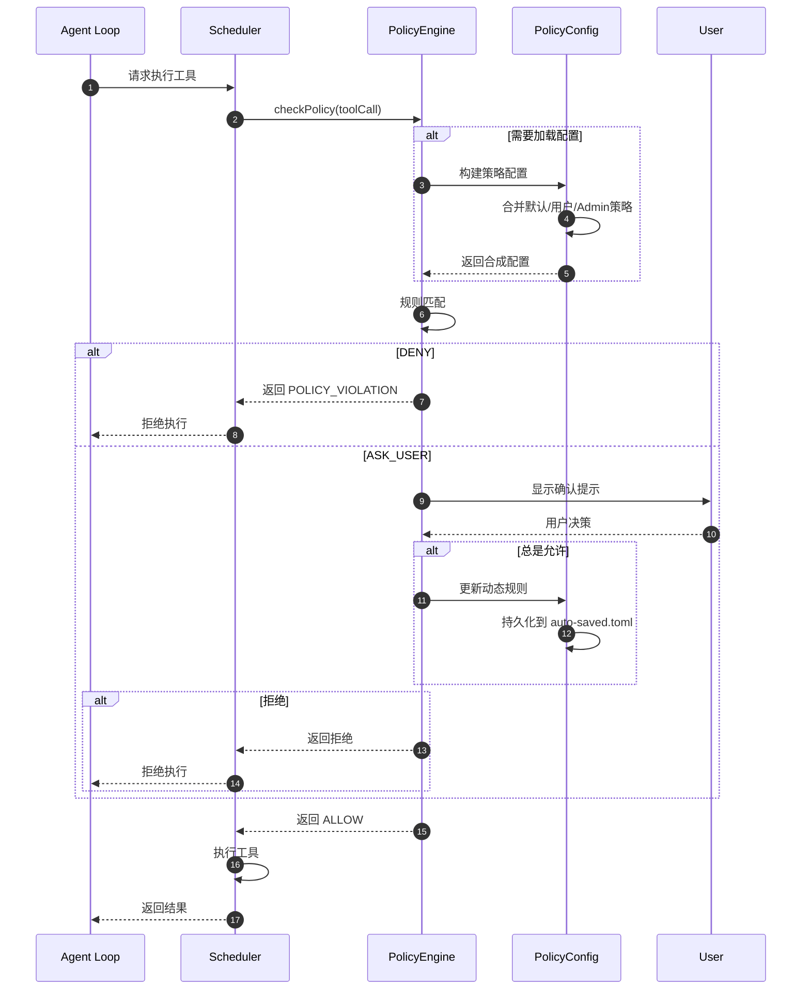
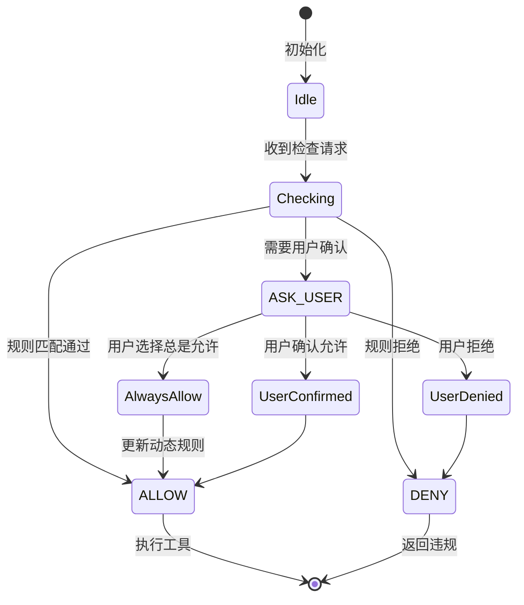
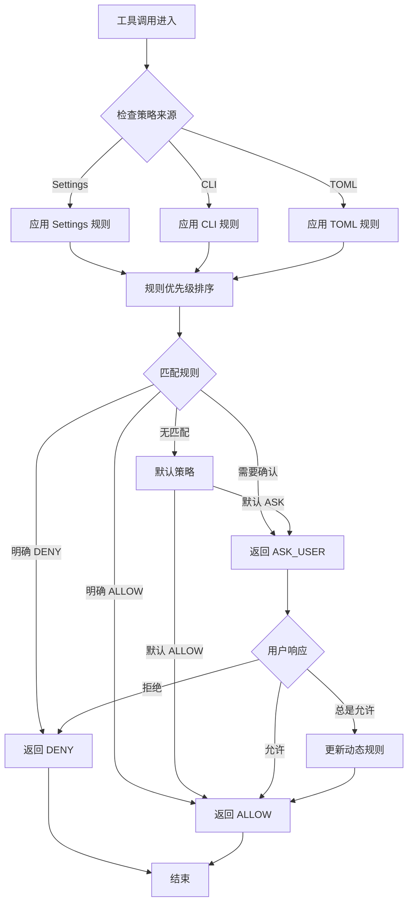
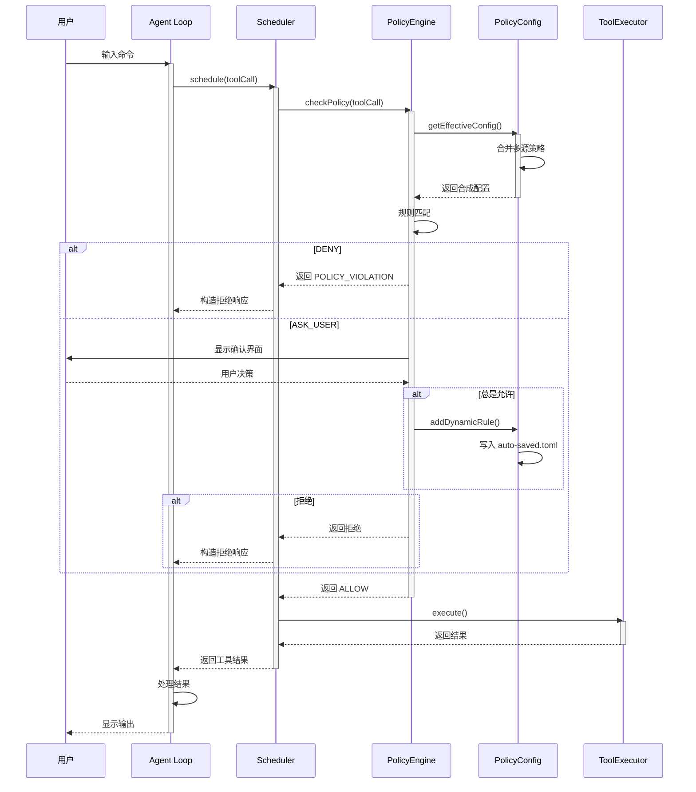
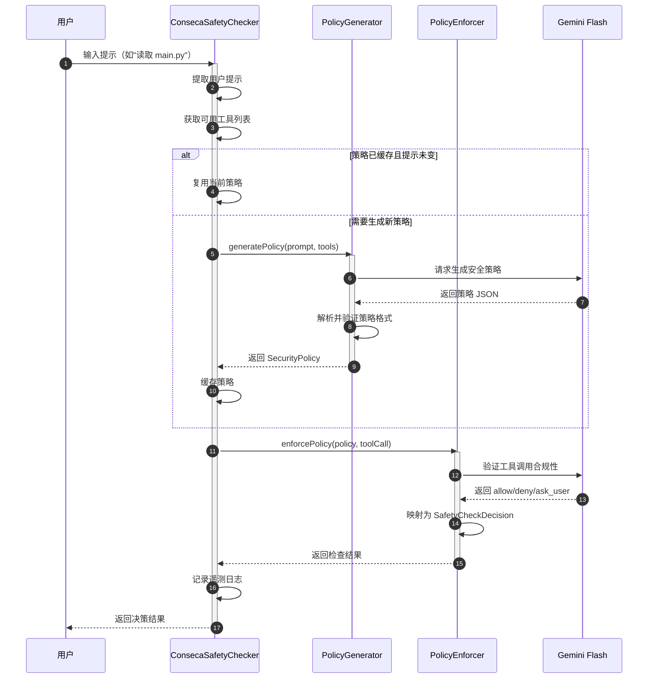
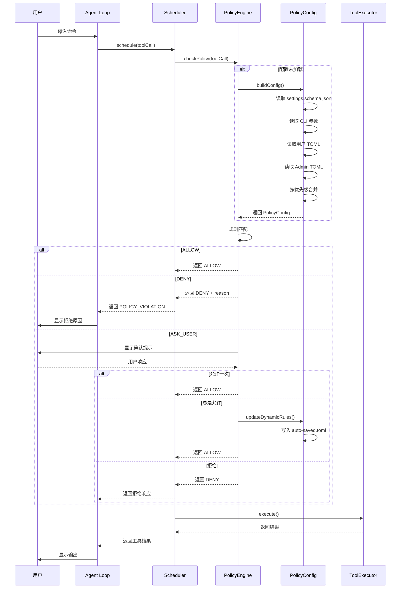
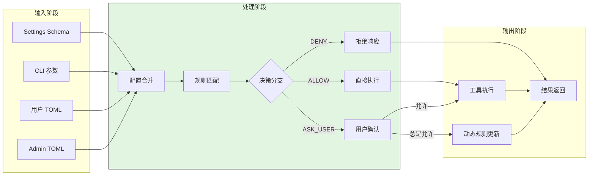
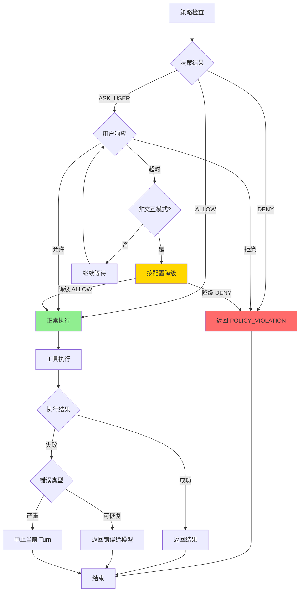
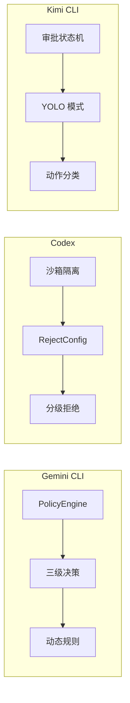

# Safety Control（gemini-cli）

> **阅读指南**
>
> | 属性 | 说明 |
> |-----|------|
> | 预计阅读 | 20-30 分钟 |
> | 前置文档 | `01-gemini-cli-overview.md`、`05-gemini-cli-tools-system.md`、`06-gemini-cli-mcp-integration.md` |
> | 文档结构 | TL;DR → 架构 → 机制 → 实现 → 对比 |
> | 代码呈现 | 关键代码直接展示，完整代码可折叠查看 |

---

## TL;DR（结论先行）

一句话定义：Gemini CLI 的 Safety Control 是**规则引擎主导的前置拦截模型**，核心链路为 `Settings/CLI/TOML -> PolicyEngine -> Scheduler.checkPolicy -> ALLOW | ASK_USER | DENY`，并支持动态规则沉淀（会话级或落盘）。新增 **Conseca 安全框架** 提供基于 LLM 的动态策略生成能力。

Gemini CLI 的核心取舍：**中心化策略引擎 + 显式审批门控 + LLM 动态策略生成**（对比 Codex 的沙箱隔离 + 分级拒绝、Kimi CLI 的审批状态机 + YOLO 模式）

### 核心要点速览

| 维度 | 关键决策 | 代码位置 |
|-----|---------|---------|
| 核心机制 | PolicyEngine 三级决策（ALLOW/ASK_USER/DENY） | `packages/core/src/policy/policy-engine.ts` |
| 策略来源 | Settings + CLI + TOML 多层配置 | `packages/core/src/policy/config.ts` |
| 动态规则 | 用户"总是允许"沉淀为持久化规则 | `packages/core/src/policy/config.ts` |
| LLM 动态策略 | Conseca 框架基于用户提示生成策略 | `packages/core/src/safety/conseca/conseca.ts:24` |
| URL 安全 | 欺骗性 URL 检测（Punycode/Unicode） | `packages/cli/src/ui/utils/urlSecurityUtils.ts:25` |
| 终端安全 | Unicode 控制字符过滤 | `packages/cli/src/ui/utils/textUtils.ts:120` |

---

## 1. 为什么需要这个机制？（解决什么问题）

### 1.1 问题场景

没有 Safety Control：
```
模型生成危险命令 → 无检查直接执行 → 数据丢失/系统损坏
MCP 工具过度授权 → 无审批直接调用 → 敏感信息泄露
欺骗性 URL 点击 → 无提示直接访问 → 钓鱼攻击成功
恶意 Unicode 输出 → 无过滤直接显示 → 终端被操控
```

有 Safety Control：
```
危险命令 → 策略引擎检查 → 审批请求 → 用户确认 → 执行
MCP 调用 → 作用域验证 → 授权检查 → 受控执行 → 返回
可疑 URL → 欺骗性检测 → 安全警告 → 用户确认 → 访问
控制字符 → Unicode 过滤 → 清理输出 → 安全显示 → 结束
```

### 1.2 核心挑战

| 挑战 | 不解决的后果 |
|-----|-------------|
| 策略一致性 | 不同入口策略不统一，出现安全漏洞 |
| 审批用户体验 | 过度审批导致用户疲劳，降低效率 |
| MCP 工具隔离 | 外部工具过度授权，风险不可控 |
| 欺骗性攻击 | 用户无法识别 Punycode 等欺骗性 URL |
| 终端注入攻击 | 恶意控制字符操控终端显示 |

---

## 2. 整体架构（ASCII 图）

### 2.1 在系统中的位置

```text
┌─────────────────────────────────────────────────────────────┐
│ Agent Loop / Scheduler                                       │
│ packages/core/src/scheduler/scheduler.ts                     │
│ packages/core/src/scheduler/policy.ts                        │
└───────────────────────┬─────────────────────────────────────┘
                        │ 调用 checkPolicy
                        ▼
┌─────────────────────────────────────────────────────────────┐
│ ▓▓▓ Safety Control ▓▓▓                                      │
│ packages/core/src/policy/                                    │
│ - policy-engine.ts    : 规则匹配与决策引擎                   │
│ - config.ts           : 策略配置构建与合成                   │
│ - toml-loader.ts      : TOML 策略文件解析                    │
│ packages/cli/src/config/policy.ts : CLI 配置映射             │
│ packages/core/src/safety/conseca/ : Conseca 动态策略框架     │
└───────────────────────┬─────────────────────────────────────┘
                        │ 依赖
        ┌───────────────┼───────────────┐
        ▼               ▼               ▼
┌──────────────┐ ┌──────────────┐ ┌──────────────┐
│ Settings     │ │ TOML Rules   │ │ UI Utils     │
│ 配置层       │ │ 规则文件     │ │ URL/文本安全 │
│ schema.json  │ │ *.toml       │ │ urlSecurity  │
└──────────────┘ └──────────────┘ └──────────────┘
```

### 2.2 核心组件职责

| 组件 | 职责 | 代码位置 |
|-----|------|---------|
| `PolicyEngine` | 规则匹配与 `ALLOW/ASK_USER/DENY` 决策 | `packages/core/src/policy/policy-engine.ts` |
| `PolicyConfig` | 策略配置构建、规则合成、动态持久化 | `packages/core/src/policy/config.ts` |
| `TOMLLoader` | TOML 策略文件解析、校验、优先级处理 | `packages/core/src/policy/toml-loader.ts` |
| `CLIToPolicyConfig` | CLI 配置到 PolicySettings 的映射 | `packages/cli/src/config/policy.ts` |
| `Scheduler.checkPolicy` | 工具执行前策略检查主流程 | `packages/core/src/scheduler/scheduler.ts` |
| `URLSecurityUtils` | 欺骗性 URL 检测 | `packages/cli/src/ui/utils/urlSecurityUtils.ts:25` |
| `TextUtils` | Unicode 字符过滤 | `packages/cli/src/ui/utils/textUtils.ts:120` |
| `ConsecaSafetyChecker` | 基于 LLM 的动态安全策略生成与执行 | `packages/core/src/safety/conseca/conseca.ts:24` |
| `PolicyGenerator` | 根据用户提示生成上下文相关的安全策略 | `packages/core/src/safety/conseca/policy-generator.ts:100` |
| `PolicyEnforcer` | 执行生成的安全策略并返回决策 | `packages/core/src/safety/conseca/policy-enforcer.ts:53` |

### 2.3 核心组件交互关系



**关键交互说明**：

| 步骤 | 交互内容 | 设计意图 |
|-----|---------|---------|
| 1-2 | Agent Loop 请求工具执行 | 统一入口，集中安全控制 |
| 3-4 | 策略配置按需加载 | 延迟加载，避免重复构建 |
| 5 | 规则匹配 | 基于多源策略进行决策 |
| 6-8 | DENY 分支 | 立即拦截，避免副作用 |
| 9-14 | ASK_USER 分支 | 交互式确认，支持动态规则更新 |
| 15-16 | ALLOW 分支 | 正常执行工具 |

---

## 3. 核心组件详细分析

### 3.1 PolicyEngine 内部结构

#### 职责定位

PolicyEngine 是 Gemini CLI 安全控制的核心决策组件，负责根据多源策略对工具调用进行 `ALLOW | ASK_USER | DENY` 三级决策。

#### 状态机图



**状态说明**：

| 状态 | 说明 | 进入条件 | 退出条件 |
|-----|------|---------|---------|
| Idle | 空闲等待 | 初始化完成 | 收到检查请求 |
| Checking | 规则匹配中 | 收到工具调用 | 匹配完成 |
| ALLOW | 允许执行 | 规则明确允许或无限制 | 执行工具 |
| ASK_USER | 需要确认 | 规则要求确认 | 用户响应 |
| DENY | 拒绝执行 | 规则明确拒绝 | 返回违规响应 |

#### 关键算法逻辑



**算法要点**：

1. **多源策略合并**：Settings、CLI、TOML 三层策略按优先级合成
2. **规则优先级**：更具体的规则优先于通用规则
3. **动态规则更新**：用户"总是允许"可沉淀为持久化规则

#### 关键接口

| 接口 | 输入 | 输出 | 说明 | 代码位置 |
|-----|------|------|------|---------|
| `checkPolicy()` | ToolCall | PolicyDecision | 核心决策方法 | `policy-engine.ts` |
| `updateDynamicRule()` | Rule | void | 更新运行时规则 | `config.ts` |
| `persistRules()` | - | void | 持久化到 TOML | `config.ts` |

---

### 3.2 策略配置构建流程

#### 职责定位

PolicyConfig 负责从多源配置构建最终生效的策略集合，支持动态规则更新和持久化。

#### 内部数据流

```text
┌─────────────────────────────────────────────────────────────┐
│  输入层                                                      │
│  ├── Settings Schema ──► 解析器 ──► 配置对象                 │
│  ├── CLI 参数       ──► 解析器 ──► 配置对象                  │
│  ├── 用户 TOML      ──► TOMLLoader ──► 规则集                │
│  └── Admin TOML     ──► TOMLLoader ──► 规则集                │
└──────────────────────────┬──────────────────────────────────┘
                           ▼
┌─────────────────────────────────────────────────────────────┐
│  合成层                                                      │
│  ├── 优先级排序: Admin > 用户 TOML > CLI > Settings          │
│  ├── 规则冲突检测与解决                                       │
│  └── 默认策略填充                                             │
└──────────────────────────┬──────────────────────────────────┘
                           ▼
┌─────────────────────────────────────────────────────────────┐
│  输出层                                                      │
│  ├── PolicyEngine 配置对象                                   │
│  ├── 动态规则缓存                                            │
│  └── 持久化接口 (auto-saved.toml)                            │
└─────────────────────────────────────────────────────────────┘
```

---

### 3.3 权限边界控制

#### 文件系统边界

- `validatePathAccess` 限制访问工作区与受控临时目录
- 工作目录外写入会被标记并单独审批

#### Shell 命令边界

- 复合命令、子命令、重定向解析
- 不可解析场景降级为 `ASK_USER`
- 非交互模式可配置转 `DENY`

#### MCP 边界

- 服务启停受 `allow/exclude/admin allowlist/session disable` 多层限制
- `trust` 与 `includeTools/excludeTools` 决定可暴露工具面

---

### 3.4 组件间协作时序



**协作要点**：

1. **Agent Loop 与 Scheduler**：统一调度入口，解耦安全控制与业务逻辑
2. **PolicyEngine 与 PolicyConfig**：配置按需加载，支持动态更新
3. **用户确认流程**：交互式确认支持三种决策（允许一次/总是允许/拒绝）

---

### 3.5 Conseca 安全框架

#### 职责定位

Conseca（Contextual Security）是 Gemini CLI 新增的**动态安全策略框架**，通过 LLM 根据用户提示生成上下文相关的安全策略，实现最小权限原则的动态执行。

#### 架构设计

```text
┌─────────────────────────────────────────────────────────────┐
│ Conseca 安全框架                                             │
│ packages/core/src/safety/conseca/                            │
└───────────────────────┬─────────────────────────────────────┘
                        │
        ┌───────────────┼───────────────┐
        ▼               ▼               ▼
┌──────────────┐ ┌──────────────┐ ┌──────────────┐
│ Policy       │ │ Policy       │ │ Policy       │
│ Generator    │ │ Enforcer     │ │ Types        │
│ 策略生成器   │ │ 策略执行器   │ │ 类型定义     │
│ generator.ts │ │ enforcer.ts  │ │ types.ts     │
└──────────────┘ └──────────────┘ └──────────────┘
```

#### 核心组件

| 组件 | 职责 | 代码位置 |
|-----|------|---------|
| `ConsecaSafetyChecker` | 单例模式安全检测器，协调策略生成与执行 | `packages/core/src/safety/conseca/conseca.ts:24` |
| `generatePolicy()` | 基于用户提示和工具列表生成安全策略 | `packages/core/src/safety/conseca/policy-generator.ts:100` |
| `enforcePolicy()` | 验证工具调用是否符合生成的安全策略 | `packages/core/src/safety/conseca/policy-enforcer.ts:53` |
| `SecurityPolicy` | 工具级权限、约束条件、决策理由的类型定义 | `packages/core/src/safety/conseca/types.ts:18` |

#### 工作流程



#### 策略生成提示词设计

```typescript
// packages/core/src/safety/conseca/policy-generator.ts:17-72

const CONSECA_POLICY_GENERATION_PROMPT = `
You are a security expert responsible for generating fine-grained security policies...

### Output Format
You must return a JSON object with a "policies" key, which is an array of objects:
- "tool_name": The name of the tool.
- "policy": An object with:
  - "permissions": "allow" | "deny" | "ask_user"
  - "constraints": A detailed description of conditions
  - "rationale": Explanation for the policy

### Guiding Principles:
1. **Permissions:**
   * **allow:** Required tools for the task.
   * **deny:** Tools clearly outside the scope.
   * **ask_user:** Destructive actions or ambiguity.

2. **Constraints:**
   * Be specific! Restrict file paths, command arguments, etc.
`;
```

**设计要点**：

1. **最小权限原则**：策略尽可能严格，仅允许完成任务必需的工具
2. **结构化输出**：使用 Zod Schema 确保 LLM 返回格式一致的 JSON
3. **上下文感知**：结合用户提示和可用工具列表生成针对性策略

---

## 4. 端到端数据流转

### 4.1 正常流程（详细版）



**数据变换详情**：

| 阶段 | 输入 | 处理 | 输出 | 代码位置 |
|-----|------|------|------|---------|
| 配置构建 | Settings/CLI/TOML | 多源合并、优先级排序 | PolicyConfig | `packages/core/src/policy/config.ts` |
| 策略检查 | ToolCall + PolicyConfig | 规则匹配 | PolicyDecision | `packages/core/src/policy/policy-engine.ts` |
| 用户确认 | ASK_USER 决策 | 交互式确认 | 用户响应 | `packages/core/src/scheduler/policy.ts` |
| 动态更新 | 用户"总是允许" | 规则持久化 | auto-saved.toml | `packages/core/src/policy/config.ts` |

### 4.2 数据流向图



### 4.3 异常/边界流程



---

## 5. 关键代码实现

### 5.1 核心数据结构

```typescript
// packages/core/src/policy/policy-engine.ts

export enum PolicyDecision {
  ALLOW = 'allow',
  ASK_USER = 'ask_user',
  DENY = 'deny',
}

export interface PolicyRule {
  pattern: string;           // 匹配模式
  action: PolicyDecision;    // 决策动作
  priority: number;          // 优先级
  description?: string;      // 规则描述
}

export interface PolicyConfig {
  rules: PolicyRule[];       // 静态规则
  dynamicRules: PolicyRule[]; // 动态规则（用户确认产生）
  defaultAction: PolicyDecision; // 默认决策
}
```

**字段说明**：

| 字段 | 类型 | 用途 |
|-----|------|------|
| `pattern` | `string` | 工具名称或命令模式匹配 |
| `action` | `PolicyDecision` | 三级决策：ALLOW/ASK_USER/DENY |
| `priority` | `number` | 规则优先级，高优先级覆盖低优先级 |
| `dynamicRules` | `PolicyRule[]` | 用户"总是允许"产生的动态规则 |

### 5.2 主链路代码

**关键代码**（核心逻辑）：

```typescript
// packages/core/src/scheduler/scheduler.ts

async function executeToolWithSafety(
  toolCall: ToolCall,
  context: ExecutionContext
): Promise<ToolResult> {
  // 1. 策略检查
  const decision = await policyEngine.checkPolicy(toolCall);

  switch (decision.action) {
    case PolicyDecision.DENY:
      // 2a. 拒绝路径
      return {
        type: 'error',
        error: `POLICY_VIOLATION: ${decision.reason}`,
      };

    case PolicyDecision.ASK_USER:
      // 2b. 确认路径
      const userChoice = await requestUserConfirmation(toolCall);

      if (userChoice === 'always_allow') {
        // 更新动态规则
        await policyEngine.addDynamicRule(toolCall);
      }

      if (userChoice === 'reject') {
        return {
          type: 'error',
          error: 'USER_REJECTED',
        };
      }
      // 继续执行
      break;

    case PolicyDecision.ALLOW:
      // 2c. 允许路径 - 直接执行
      break;
  }

  // 3. 执行工具
  return await toolExecutor.execute(toolCall);
}
```

**设计意图**：

1. **三级决策分支**：清晰的 ALLOW/ASK_USER/DENY 处理路径
2. **动态规则沉淀**：用户"总是允许"即时生效并持久化
3. **统一错误格式**：策略违规和用户拒绝有明确区分

### 5.3 欺骗性 URL 检测

```typescript
// packages/cli/src/ui/utils/urlSecurityUtils.ts:25-45

export interface DeceptiveUrlDetails {
  originalUrl: string;    // 原始 Unicode URL
  punycodeUrl: string;    // Punycode ASCII 形式
  warning: string;        // 安全警告
}

function containsDeceptiveMarkers(hostname: string): boolean {
  return (
    // Punycode 标记 (xn--)
    hostname.toLowerCase().includes('xn--') ||
    // 非 ASCII 字符
    /[^\x00-\x7F]/.test(hostname)
  );
}

export function checkDeceptiveUrl(urlString: string): DeceptiveUrlDetails | null {
  try {
    const url = new URL(urlString);

    if (containsDeceptiveMarkers(url.hostname)) {
      return {
        originalUrl: urlString,
        punycodeUrl: url.hostname,
        warning: 'This URL contains Unicode characters that may be deceptive.',
      };
    }

    return null;
  } catch {
    return null;
  }
}
```

**代码要点**：

1. **双重检测**：Punycode 标记 + 非 ASCII 字符
2. **用户提示**：显示原始 URL 和 Punycode 形式对比
3. **集成确认流**：在工具确认界面显示安全警告

### 5.4 Unicode 字符过滤

```typescript
// packages/cli/src/ui/utils/textUtils.ts:120-134

export function stripUnsafeCharacters(str: string): string {
  const strippedAnsi = stripAnsi(str);
  const strippedVT = stripVTControlCharacters(strippedAnsi);

  // 过滤以下字符:
  // - C0 控制字符 (0x00-0x1F) 除 TAB(0x09), LF(0x0A), CR(0x0D)
  // - C1 控制字符 (0x80-0x9F)
  // - BiDi 控制字符 (U+200E, U+200F, U+202A-U+202E, U+2066-U+2069)
  // - 零宽字符 (U+200B ZWSP, U+FEFF BOM)
  return strippedVT.replace(
    /[\x00-\x08\x0B\x0C\x0E-\x1F\x80-\x9F\u200E\u200F\u202A-\u202E\u2066-\u2069\u200B\uFEFF]/g,
    '',
  );
}
```

**字符分类说明**：

| 类别 | 范围 | 处理方式 |
|------|------|----------|
| C0 控制字符 | 0x00-0x1F (除 0x09, 0x0A, 0x0D) | 移除 |
| C1 控制字符 | 0x80-0x9F | 移除 |
| BiDi 覆盖字符 | U+202A-U+202E, U+2066-U+2069 | 移除 |
| 零宽空格 | U+200B | 移除 |
| BOM | U+FEFF | 移除 |
| **保留** | | |
| 可打印 ASCII | 0x20-0x7E | 保留 |
| Tab/换行 | 0x09, 0x0A, 0x0D | 保留 |
| Unicode 文字 | U+00A0 及以上 | 保留 |
| ZWJ (表情符号) | U+200D | 保留 |

### 5.5 Conseca 安全框架实现

```typescript
// packages/core/src/safety/conseca/conseca.ts:24-70

export class ConsecaSafetyChecker implements InProcessChecker {
  private static instance: ConsecaSafetyChecker | undefined;
  private currentPolicy: SecurityPolicy | null = null;
  private activeUserPrompt: string | null = null;
  private config: Config | null = null;

  static getInstance(): ConsecaSafetyChecker {
    if (!ConsecaSafetyChecker.instance) {
      ConsecaSafetyChecker.instance = new ConsecaSafetyChecker();
    }
    return ConsecaSafetyChecker.instance;
  }

  async check(input: SafetyCheckInput): Promise<SafetyCheckResult> {
    if (!this.config?.enableConseca) {
      return { decision: SafetyCheckDecision.ALLOW, reason: 'Conseca is disabled' };
    }

    const userPrompt = this.extractUserPrompt(input);
    const trustedContent = this.getTrustedToolsContent();

    if (userPrompt) {
      await this.getPolicy(userPrompt, trustedContent, this.config);
    }

    if (!this.currentPolicy) {
      return { decision: SafetyCheckDecision.ALLOW, reason: 'No policy generated' };
    }

    const result = await enforcePolicy(this.currentPolicy, input.toolCall, this.config);

    // 记录遥测日志
    logConsecaVerdict(this.config, new ConsecaVerdictEvent(...));
    return result;
  }
}
```

**代码要点**：

1. **单例模式**：确保全局唯一的策略状态管理
2. **策略缓存**：相同用户提示复用已生成策略，避免重复调用 LLM
3. **遥测集成**：完整记录策略生成和执行过程，支持审计

### 5.6 Policy Engine 通配符与注解匹配

```typescript
// packages/core/src/policy/policy-engine.ts:29-97

function isWildcardPattern(name: string): boolean {
  return name === '*' || name.includes('*');
}

/**
 * Supports global (*) and composite (server__*, *__tool, *__*) patterns.
 */
function matchesWildcard(
  pattern: string,
  toolName: string,
  serverName: string | undefined,
): boolean {
  if (pattern === '*') return true;

  if (pattern.includes('__')) {
    return matchesCompositePattern(pattern, toolName, serverName);
  }
  return toolName === pattern;
}

/**
 * Matches composite patterns like "server__*", "*__tool", or "*__*".
 */
function matchesCompositePattern(
  pattern: string,
  toolName: string,
  serverName: string | undefined,
): boolean {
  const parts = pattern.split('__');
  const [patternServer, patternTool] = parts;

  const { actualServer, actualTool } = getToolMetadata(toolName, serverName);

  // Security: prevent spoofing by requiring toolName to start with serverName
  if (serverName !== undefined && !toolName.startsWith(serverName + '__')) {
    return false;
  }

  const serverMatch = patternServer === '*' || patternServer === actualServer;
  const toolMatch = patternTool === '*' || patternTool === actualTool;
  return serverMatch && toolMatch;
}
```

**通配符模式支持**：

| 模式 | 示例 | 匹配范围 |
|-----|------|---------|
| `*` | `*` | 所有工具 |
| `server__*` | `mcp-server__*` | 指定服务器的所有工具 |
| `*__tool` | `*__read_file` | 所有服务器的指定工具 |
| `*__*` | `*__*` | 所有服务器的所有工具（需 server 上下文） |

### 5.7 工具注解匹配

```typescript
// packages/core/src/policy/policy-engine.ts:131-141

// Check annotations if specified
if (rule.toolAnnotations) {
  if (!toolAnnotations) return false;
  for (const [key, value] of Object.entries(rule.toolAnnotations)) {
    if (toolAnnotations[key] !== value) {
      return false;
    }
  }
}
```

**应用场景**：

1. **Plan Mode 工具可见性**：通过 `toolAnnotations: { planMode: true }` 控制工具在 Plan Mode 中的显示
2. **MCP 工具分类**：基于注解（如 `destructive: true`）批量应用安全策略
3. **动态规则管理**：支持按来源（source）移除规则，便于扩展管理

### 5.8 关键调用链

```text
Agent Loop
  -> Scheduler.schedule()              [packages/core/src/scheduler/scheduler.ts]
    -> PolicyEngine.checkPolicy()       [packages/core/src/policy/policy-engine.ts]
      -> PolicyConfig.getEffectiveConfig() [packages/core/src/policy/config.ts]
        - 合并 Settings/CLI/TOML 配置
        - 按优先级排序规则
      -> 规则匹配
        - 匹配 pattern (支持通配符)
        - 匹配 toolAnnotations
        - 返回 PolicyDecision
      -> ConsecaSafetyChecker.check()   [packages/core/src/safety/conseca/conseca.ts:54]
        - 生成动态安全策略
        - 执行策略验证
    -> 决策分支处理
      - DENY: 返回 POLICY_VIOLATION
      - ASK_USER: 调用 UI 确认
        - URL 安全检查 (urlSecurityUtils.ts)
        - 文本过滤 (textUtils.ts)
      - ALLOW: 继续执行
    -> ToolExecutor.execute()
```

---

## 6. 设计意图与 Trade-off

### 6.1 Gemini CLI 的选择

| 维度 | Gemini CLI 的选择 | 替代方案 | 取舍分析 |
|-----|-----------------|---------|---------|
| 策略架构 | 中心化 PolicyEngine | 分布式检查 | 统一决策逻辑，但增加单点复杂度 |
| 配置来源 | Settings + CLI + TOML 多层 | 单一配置源 | 灵活性高，但合并逻辑复杂 |
| 审批模式 | 显式三级决策 (ALLOW/ASK/DENY) | 布尔通过/拒绝 | 用户可控性强，但实现复杂 |
| 动态规则 | 支持运行时更新和持久化 | 静态配置 | 适应用户习惯，但需持久化管理 |
| **LLM 动态策略** | **Conseca 框架** | **静态规则配置** | **上下文感知，但增加 LLM 调用开销** |
| **通配符匹配** | **支持 MCP 工具通配符** | **精确匹配** | **批量管理方便，但需防 spoofing** |
| URL 安全 | 欺骗性检测 + 用户提示 | 完全阻止/完全放行 | 平衡安全与可用性 |
| 终端安全 | Unicode 字符过滤 | 原始输出 | 防止注入攻击，但可能影响合法内容 |

### 6.2 为什么这样设计？

**核心问题**：如何在保证安全的前提下，提供灵活的配置和良好的用户体验？

**Gemini CLI 的解决方案**：
- **代码依据**：`packages/core/src/policy/policy-engine.ts` 的三级决策设计
- **设计意图**：通过 PolicyEngine 集中管理多源策略，支持灵活的配置组合
- **带来的好处**：
  - 企业环境可通过 Admin TOML 统一管控
  - 个人用户可通过 CLI 参数快速调整
  - 用户习惯可沉淀为动态规则
- **付出的代价**：
  - 策略合并逻辑复杂
  - 需要理解多层配置的优先级

**Conseca 框架的设计动机**：
- **代码依据**：`packages/core/src/safety/conseca/conseca.ts:24-170`
- **核心问题**：静态规则难以适应复杂多变的用户场景
- **设计意图**：利用 LLM 理解用户意图，动态生成最小权限策略
- **带来的好处**：
  - **上下文感知**：策略基于实际用户请求生成，避免过度授权
  - **最小权限**：自动限制工具使用范围（如仅允许读取特定文件）
  - **动态适应**：不同任务自动应用不同安全策略
- **付出的代价**：
  - 增加 LLM 调用开销（策略生成 + 执行验证各一次）
  - 策略生成延迟（首次调用时）
  - 依赖 LLM 可靠性（失败时回退到 ALLOW）

### 6.3 与其他项目的对比



| 项目 | 核心机制 | 安全策略 | 审批机制 | 边界控制 | 适用场景 |
|-----|---------|---------|---------|---------|---------|
| **Gemini CLI** | PolicyEngine 规则引擎 + **Conseca LLM 动态策略** | 多源配置 + 动态规则 + **上下文感知策略生成** | ALLOW/ASK/DENY 三级 | 路径验证 + 命令解析 + **通配符规则** | 需要灵活策略配置的场景 |
| **Codex** | 沙箱 + 策略配置 | RejectConfig 分级拒绝 | AskForApproval 五级 | Linux Proxy-Only + Seccomp | 需要强隔离的企业环境 |
| **Kimi CLI** | 审批状态机 | YOLO 模式 + 动作分类 | approve/approve_for_session/reject | 路径边界 + 工作区限制 | 开发效率优先的场景 |

**详细对比分析**：

| 对比维度 | Gemini CLI | Codex | Kimi CLI |
|---------|------------|-------|----------|
| **安全策略核心** | 规则引擎（PolicyEngine）+ **Conseca LLM 动态策略** | 沙箱隔离 + 策略配置 | 审批状态机 |
| **策略配置方式** | Settings + CLI + TOML 多层 + **LLM 动态生成** | TurnContext 注入 | CLI 参数 + 配置 |
| **审批粒度** | 工具级三级决策 | 五级策略（Never 到 Reject） | 动作分类级 |
| **动态规则** | 支持（auto-saved.toml）+ **上下文策略缓存** | 不支持 | 支持（会话级 auto_approve_actions） |
| **沙箱机制** | 无原生沙箱 | Linux Proxy-Only + Seccomp | 无原生沙箱 |
| **非交互处理** | 可配置降级 | RejectConfig 自动拒绝 | YOLO 模式绕过 |
| **MCP 工具管控** | **通配符模式 + 注解匹配** | 无 MCP 支持 | 无 MCP 支持 |
| **URL 安全** | 欺骗性检测 + 提示 | 无特殊处理 | 无特殊处理 |
| **终端安全** | Unicode 过滤 | 无特殊处理 | 无特殊处理 |

---

## 7. 边界情况与错误处理

### 7.1 终止条件

| 终止原因 | 触发条件 | 代码位置 |
|---------|---------|---------|
| 策略拒绝 | 规则匹配 DENY | `packages/core/src/policy/policy-engine.ts` |
| 用户拒绝 | 确认界面选择拒绝 | `packages/core/src/scheduler/policy.ts` |
| 非交互降级 | ASK_USER 但无法交互 | `packages/core/src/scheduler/scheduler.ts` |
| 配置错误 | TOML 解析失败 | `packages/core/src/policy/toml-loader.ts` |
| 规则冲突 | 同优先级规则冲突 | `packages/core/src/policy/config.ts` |

### 7.2 超时/资源限制

```typescript
// packages/core/src/scheduler/scheduler.ts

// 用户确认超时配置
const USER_CONFIRMATION_TIMEOUT = 300000; // 5分钟

// 非交互模式处理
if (!isInteractive() && decision.action === PolicyDecision.ASK_USER) {
  // 按配置降级：ALLOW 或 DENY
  return config.nonInteractiveFallback === 'deny'
    ? createDenyResponse()
    : executeWithCaution(toolCall);
}
```

### 7.3 错误恢复策略

| 错误类型 | 处理策略 | 代码位置 |
|---------|---------|---------|
| 策略违规 | 返回 POLICY_VIOLATION 给模型 | `packages/core/src/scheduler/scheduler.ts` |
| 用户拒绝 | 返回 USER_REJECTED，继续对话 | `packages/core/src/scheduler/policy.ts` |
| 配置加载失败 | 使用默认策略，记录警告 | `packages/core/src/policy/config.ts` |
| 规则解析错误 | 跳过错误规则，继续加载 | `packages/core/src/policy/toml-loader.ts` |
| 持久化失败 | 内存中保留规则，下次重试 | `packages/core/src/policy/config.ts` |

---

## 8. 关键代码索引

| 功能 | 文件 | 行号 | 说明 |
|-----|------|------|------|
| 策略决策 | `packages/core/src/policy/policy-engine.ts` | - | PolicyEngine 核心实现 |
| 通配符匹配 | `packages/core/src/policy/policy-engine.ts` | 29-97 | MCP 工具通配符模式匹配 |
| 注解匹配 | `packages/core/src/policy/policy-engine.ts` | 131-141 | ToolAnnotations 规则匹配 |
| 规则移除 | `packages/core/src/policy/policy-engine.ts` | 568-588 | 按 source 移除规则/checker |
| 配置构建 | `packages/core/src/policy/config.ts` | - | 多源策略合成 |
| TOML 加载 | `packages/core/src/policy/toml-loader.ts` | - | 策略文件解析 |
| CLI 配置映射 | `packages/cli/src/config/policy.ts` | - | CLI 到 PolicySettings |
| 调度器检查 | `packages/core/src/scheduler/scheduler.ts` | - | 工具执行前检查 |
| 策略确认 | `packages/core/src/scheduler/policy.ts` | - | 用户确认流程 |
| Shell 路径校验 | `packages/core/src/tools/shell.ts` | - | 执行前路径验证 |
| MCP 治理 | `packages/core/src/tools/mcp-client-manager.ts` | - | MCP 服务启用限制 |
| MCP 工具确认 | `packages/core/src/tools/mcp-tool.ts` | - | MCP 调用确认 |
| **Conseca 检测器** | `packages/core/src/safety/conseca/conseca.ts` | 24-170 | **LLM 动态策略安全检测器** |
| **策略生成器** | `packages/core/src/safety/conseca/policy-generator.ts` | 100-178 | **基于用户提示生成安全策略** |
| **策略执行器** | `packages/core/src/safety/conseca/policy-enforcer.ts` | 53-164 | **执行安全策略验证工具调用** |
| **策略类型** | `packages/core/src/safety/conseca/types.ts` | 9-18 | **SecurityPolicy 类型定义** |
| URL 安全检测 | `packages/cli/src/ui/utils/urlSecurityUtils.ts` | 25-45 | 欺骗性 URL 检测 |
| Unicode 过滤 | `packages/cli/src/ui/utils/textUtils.ts` | 120-134 | 控制字符过滤 |
| 配置 Schema | `schemas/settings.schema.json` | - | 安全策略配置项 |
| 有效配置 | `packages/cli/src/config/config.ts` | - | effectiveSettings 汇总 |

---

## 9. 延伸阅读

- 前置知识：`05-gemini-cli-tools-system.md`、`06-gemini-cli-mcp-integration.md`
- 相关机制：`04-gemini-cli-agent-loop.md`、`03-gemini-cli-session-runtime.md`
- 跨项目对比：
  - Codex Safety Control: `docs/codex/10-codex-safety-control.md`
  - Kimi CLI Safety Control: `docs/kimi-cli/10-kimi-cli-safety-control.md`
- 通用安全控制流程: `docs/comm/10-comm-safety-control.md`

---

*基于版本：2026-02-08 | 最后更新：2026-03-02*
