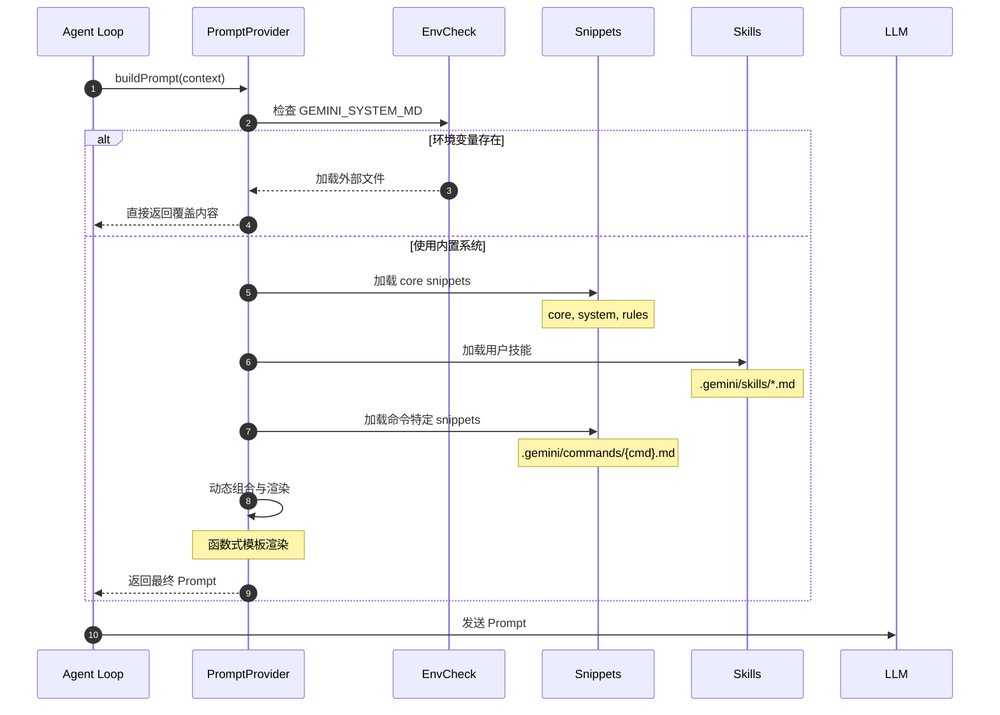
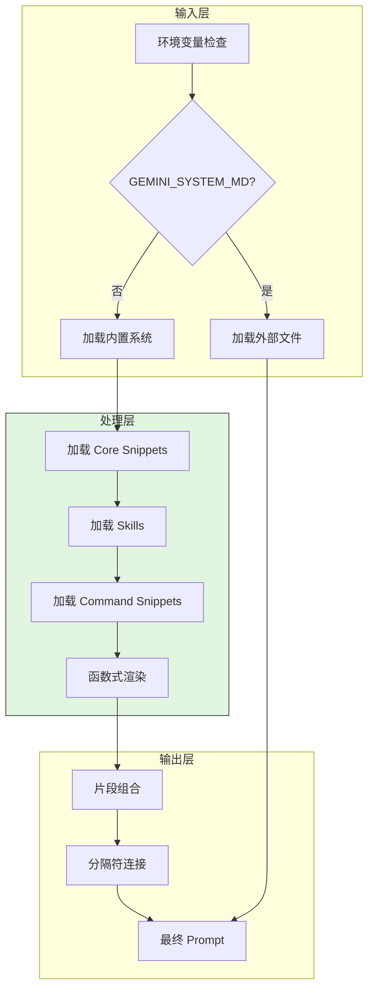
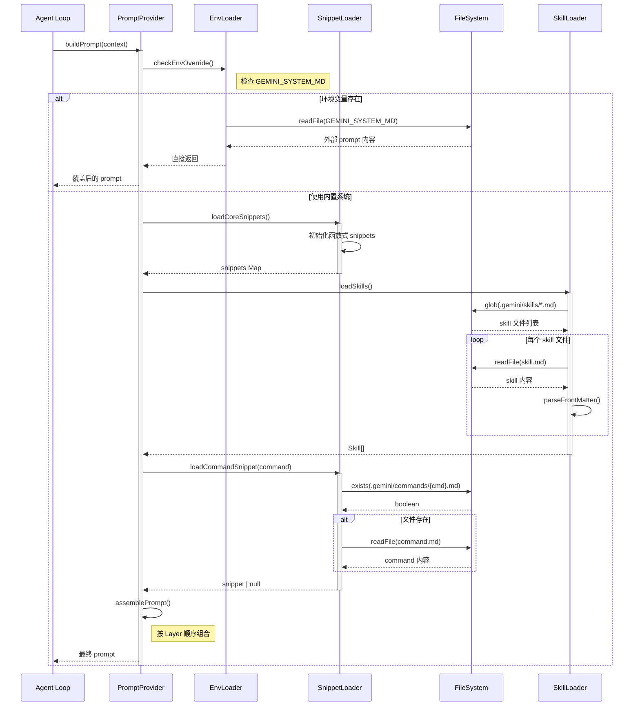
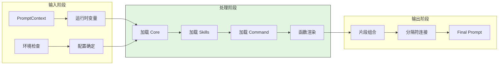
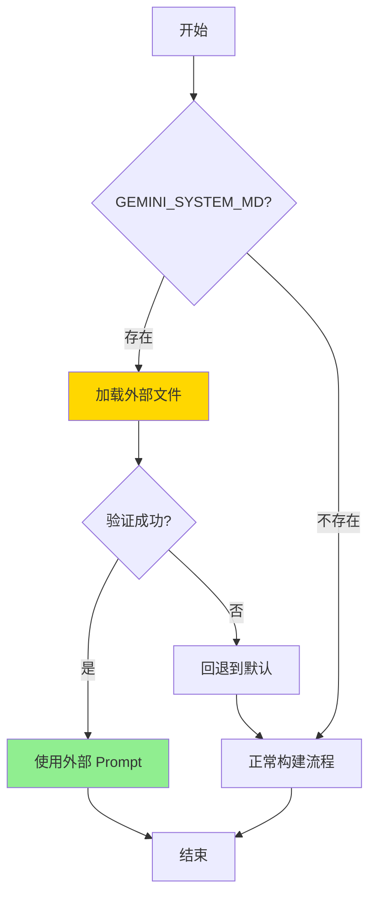
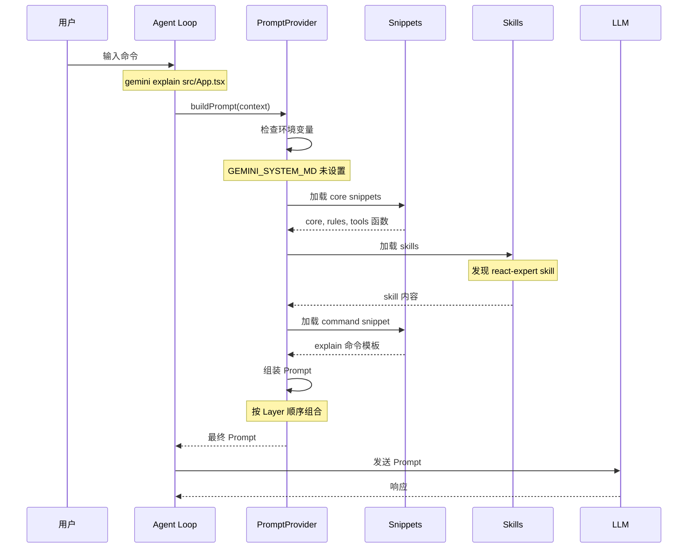
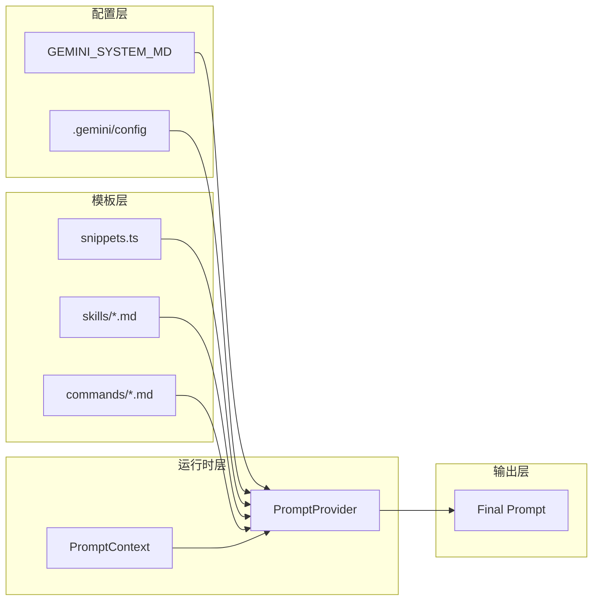
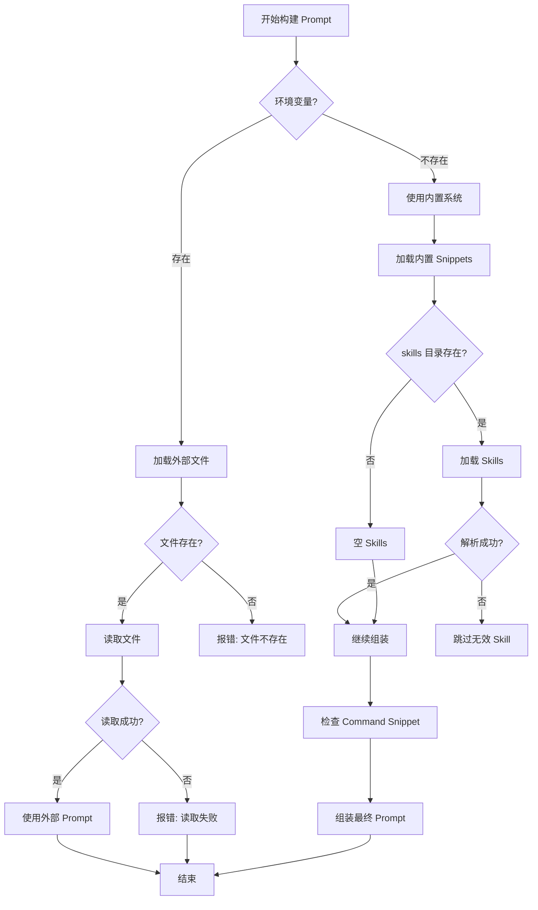
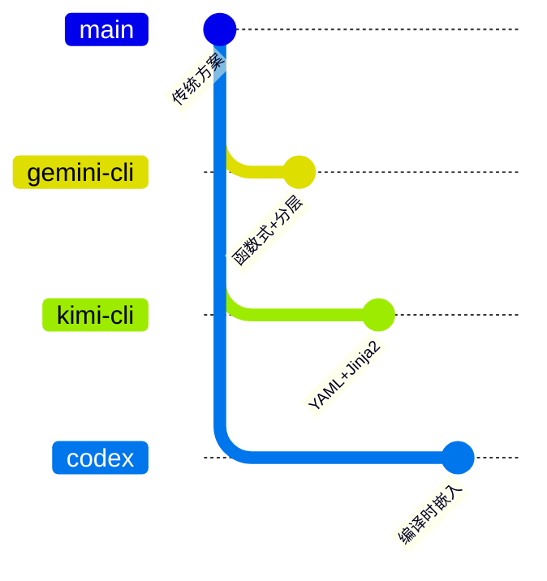

# Prompt Organization（gemini-cli）

## TL;DR（结论先行）

一句话定义：gemini-cli 采用**模块化 snippet 架构 + 环境变量覆盖**的 Prompt 组织方式，通过 `PromptProvider` 类动态组合多个代码片段，支持技能系统（Skills）和命令特定提示词，允许通过 `GEMINI_SYSTEM_MD` 环境变量进行完全覆盖。

gemini-cli 的核心取舍：**函数式动态模板 + 分层组合**（对比 Kimi CLI 的 YAML 配置 + Jinja2 渲染、Codex 的编译时静态嵌入）

---

## 1. 为什么需要这个机制？（解决什么问题）

### 1.1 问题场景

没有 Prompt Organization：
```
单一硬编码提示词 → 无法适配不同任务类型 → 效果差
无法扩展 → 团队无法共享领域知识 → 重复造轮子
修改需改代码 → 迭代困难 → 上线周期长
```

有 Prompt Organization：
```
模块化 snippet → 按需组合 → 灵活适配不同场景
技能系统 → 团队共享领域知识 → 提升一致性
环境变量覆盖 → 无需改代码即可定制 → 快速迭代
```

### 1.2 核心挑战

| 挑战 | 不解决的后果 |
|-----|-------------|
| 任务适配 | 单一提示词无法覆盖 explain/refactor/review 等多场景 |
| 知识复用 | 团队缺乏共享领域知识的机制 |
| 用户定制 | 无法根据项目需求调整系统行为 |
| 动态上下文 | 运行时信息（工具列表、文件列表）无法注入 |
| 扩展机制 | 新增命令类型需要修改核心代码 |

---

## 2. 整体架构（ASCII 图）

### 2.1 在系统中的位置

```text
┌─────────────────────────────────────────────────────────────┐
│ Agent Loop / Session Runtime                                 │
│ gemini-cli/packages/core/src/                                │
└───────────────────────┬─────────────────────────────────────┘
                        │ 构建 Prompt
                        ▼
┌─────────────────────────────────────────────────────────────┐
│ ▓▓▓ Prompt Organization ▓▓▓                                 │
│ gemini-cli/packages/core/src/prompts/                        │
│ - snippets.ts       : 核心代码片段定义                       │
│ - prompt_provider.ts: PromptProvider 类实现                  │
│ - skills/           : 技能系统目录                           │
└───────────────────────┬─────────────────────────────────────┘
                        │ 依赖
        ┌───────────────┼───────────────┐
        ▼               ▼               ▼
┌──────────────┐ ┌──────────────┐ ┌──────────────┐
│ 环境变量      │ │ 运行时上下文  │ │ 文件系统      │
│ GEMINI_*     │ │ tools/query  │ │ .gemini/     │
└──────────────┘ └──────────────┘ └──────────────┘
```

### 2.2 核心组件职责

| 组件 | 职责 | 代码位置 |
|-----|------|---------|
| `snippets.ts` | 核心代码片段定义 | `packages/core/src/prompts/snippets.ts` |
| `PromptProvider` | Prompt 组装与提供 | `packages/core/src/prompts/prompt_provider.ts` |
| `.gemini/skills/` | 用户自定义技能目录 | 项目目录（约定） |
| `.gemini/commands/` | 命令特定 prompt 目录 | 项目目录（约定） |
| `GEMINI_SYSTEM_MD` | 环境变量完全覆盖 | 环境变量 |

### 2.3 核心组件交互关系



**关键交互说明**：

| 步骤 | 交互内容 | 设计意图 |
|-----|---------|---------|
| 1-2 | Agent Loop 请求构建 Prompt | 解耦 Prompt 组装与业务逻辑 |
| 3-4 | 环境变量检查 | 最高优先级覆盖机制，支持完全定制 |
| 5-7 | 分层加载 snippets | 模块化组织，按需组合 |
| 8-9 | 技能系统加载 | 支持团队共享领域知识 |
| 10-11 | 动态渲染 | 运行时注入上下文信息 |
| 12-13 | 返回最终 Prompt | 统一输出格式 |

---

## 3. 核心组件详细分析

### 3.1 PromptProvider 内部结构

#### 职责定位

`PromptProvider` 是 Prompt 组织的核心类，负责分层加载、动态组合和渲染最终 Prompt。

#### 内部数据流



#### 关键算法逻辑

```typescript
// packages/core/src/prompts/prompt_provider.ts（概念结构）

class PromptProvider {
  private snippets: Map<string, () => string>;
  private skills: Skill[];

  constructor(options: PromptProviderOptions) {
    // 1. 检查环境变量覆盖（最高优先级）
    if (process.env.GEMINI_SYSTEM_MD) {
      this.loadFromEnv();
      return;
    }

    // 2. 加载内置 snippets（函数式定义）
    this.loadCoreSnippets();

    // 3. 加载用户技能
    this.loadSkills();

    // 4. 加载命令特定 snippets
    this.loadCommandSnippets();
  }

  buildPrompt(context: PromptContext): string {
    const parts: string[] = [];

    // 按顺序组装各层
    parts.push(this.snippets.core());
    parts.push(this.snippets.rules());

    if (context.tools.length > 0) {
      parts.push(this.snippets.tools(context.tools));
    }

    for (const skill of this.skills) {
      parts.push(skill.content);
    }

    if (context.relevantFiles) {
      parts.push(this.snippets.context(context.relevantFiles));
    }

    // 使用 --- 分隔符连接
    return parts.join('\n\n---\n\n');
  }
}
```

**算法要点**：

1. **优先级分层**：环境变量 > 项目配置 > 内置默认
2. **函数式渲染**：snippets 是函数而非静态字符串，支持运行时变量
3. **分隔符连接**：使用 `---` 清晰分隔不同片段

#### 关键接口

| 接口 | 输入 | 输出 | 说明 |
|-----|------|------|------|
| `constructor()` | 环境变量 + 配置 | 初始化状态 | 确定加载策略 |
| `buildPrompt()` | PromptContext | string | 核心组装方法 |
| `loadSkills()` | 文件系统 | Skill[] | 加载用户技能 |

---

### 3.2 分层架构内部结构

#### 职责定位

四层架构确保从基础身份到特定任务的有序叠加。

#### 分层数据流

```text
┌─────────────────────────────────────────────────────────────┐
│  Layer 4: Command-Specific Snippets                          │
│  - 特定命令的额外上下文                                       │
│  - 命令参数和选项说明                                         │
│  Source: .gemini/commands/{command}.md                      │
└──────────────────────────┬──────────────────────────────────┘
                           ▼
┌─────────────────────────────────────────────────────────────┐
│  Layer 3: Skills Layer                                       │
│  - 技能定义 (Gemini Skills)                                  │
│  - 领域特定知识和能力                                         │
│  Source: .gemini/skills/*.md                                │
└──────────────────────────┬──────────────────────────────────┘
                           ▼
┌─────────────────────────────────────────────────────────────┐
│  Layer 2: Core Snippets                                      │
│  - 系统身份和规则                                             │
│  - 工具使用说明                                               │
│  - 安全约束                                                   │
│  Source: snippets.ts (core, system, rules, tools)           │
└──────────────────────────┬──────────────────────────────────┘
                           ▼
┌─────────────────────────────────────────────────────────────┐
│  Layer 1: Base / Override                                    │
│  - GEMINI_SYSTEM_MD 环境变量覆盖                              │
│  - 项目级 .gemini/config                                     │
│  Source: 环境变量 / 配置文件                                  │
└─────────────────────────────────────────────────────────────┘
```

---

### 3.3 组件间协作时序



**协作要点**：

1. **环境检查优先**：首先检查是否有完全覆盖的环境变量
2. **懒加载策略**：技能按需从文件系统加载
3. **函数式渲染**：snippets 是函数，运行时注入上下文

---

### 3.4 关键数据路径

#### 主路径（正常 Prompt 构建）



#### 覆盖路径（环境变量）



---

## 4. 端到端数据流转

### 4.1 正常流程（详细版）



**数据变换详情**：

| 阶段 | 输入 | 处理 | 输出 |
|-----|------|------|------|
| 环境检查 | - | 检查 GEMINI_SYSTEM_MD | 加载策略 |
| Core 加载 | - | 初始化函数式 snippets | snippets Map |
| Skills 加载 | 文件系统 | 读取 + 解析 FrontMatter | Skill[] |
| Command 加载 | 命令名 | 查找对应文件 | snippet string |
| 组装 | 各层内容 | 分隔符连接 | Final Prompt |

### 4.2 数据流向图



### 4.3 异常/边界流程



---

## 5. 关键代码实现

### 5.1 核心数据结构

```typescript
// packages/core/src/prompts/types.ts（概念结构）

interface PromptContext {
  // 环境信息
  cwd: string;
  home: string;
  env: Record<string, string>;

  // 工具信息
  tools: Tool[];

  // 用户输入
  query: string;
  history: Message[];

  // 项目上下文
  skills?: Skill[];
  relevantFiles?: string[];
  gitInfo?: GitInfo;
}

interface Skill {
  name: string;
  content: string;
  metadata: {
    description?: string;
    commands?: string[];
  };
}

type SnippetFunction = (context?: PromptContext) => string;
```

**字段说明**：

| 字段 | 类型 | 用途 |
|-----|------|------|
| `cwd` | `string` | 当前工作目录 |
| `tools` | `Tool[]` | 可用工具列表 |
| `skills` | `Skill[]` | 加载的技能 |
| `relevantFiles` | `string[]` | 相关文件列表 |

### 5.2 主链路代码

```typescript
// packages/core/src/prompts/snippets.ts（概念结构）

// 函数式 snippet 定义
export const snippets = {
  // Layer 2: Core identity
  core: () => `
You are Gemini, a helpful AI assistant.
Current time: ${new Date().toISOString()}
`,

  // Layer 2: System rules
  rules: () => `
Always provide clear, concise explanations.
Use code examples when helpful.
`,

  // Layer 2: Tools description
  tools: (availableTools: Tool[]) => `
Available tools:
${availableTools.map(t => `- ${t.name}: ${t.description}`).join('\n')}
`,

  // Layer 4: Context files
  context: (files: string[]) => `
Relevant files:
${files.map(f => `- ${f}`).join('\n')}
`,
};
```

**代码要点**：

1. **函数式定义**：snippets 是函数而非静态字符串，支持运行时变量
2. **分层组织**：core/rules/tools/context 对应不同 Layer
3. **延迟渲染**：调用时才生成内容，确保信息最新

### 5.3 关键调用链

```text
Agent Loop::run()
  -> PromptProvider::buildPrompt()    [prompt_provider.ts]
    -> checkEnvOverride()              [环境变量检查]
    -> loadCoreSnippets()              [snippets.ts]
      - snippets.core()
      - snippets.rules()
      - snippets.tools(context.tools)
    -> loadSkills()                    [skills/ 目录]
    -> loadCommandSnippet()            [commands/ 目录]
    -> assemblePrompt()                [组合各层]
      - parts.join('\n\n---\n\n')
```

---

## 6. 设计意图与 Trade-off

### 6.1 gemini-cli 的选择

| 维度 | gemini-cli 的选择 | 替代方案 | 取舍分析 |
|-----|------------------|---------|---------|
| 模板引擎 | 函数式动态渲染 | Jinja2 / Mustache | 简单直观，与 TypeScript 集成好，但功能较简单 |
| 组织方式 | 分层模块化 snippet | 单一模板文件 | 灵活组合，按需加载，但组装逻辑分散 |
| 扩展机制 | 技能系统 + 命令特定 | 配置文件驱动 | 文件化组织，易于版本控制，但需约定目录结构 |
| 覆盖机制 | 环境变量完全覆盖 | 配置项覆盖 | 简单直接，适合快速实验，但粒度粗 |

### 6.2 为什么这样设计？

**核心问题**：如何在保持灵活性的同时，实现 Prompt 的可扩展和可定制？

**gemini-cli 的解决方案**：
- 代码依据：`snippets.ts` 的函数式定义
- 设计意图：将 Prompt 拆分为可组合的模块，支持分层叠加
- 带来的好处：
  - 模块化组织，易于维护和扩展
  - 技能系统支持团队知识共享
  - 环境变量覆盖支持快速实验
  - 函数式渲染确保运行时信息准确
- 付出的代价：
  - 模板功能较简单，复杂逻辑需在代码中处理
  - 分层组装逻辑分散，追踪最终 Prompt 需理解各层
  - 技能文件需遵循约定目录结构

### 6.3 与其他项目的对比



| 项目 | Prompt 结构 | 动态组装 | 扩展机制 | 适用场景 |
|-----|------------|---------|---------|---------|
| gemini-cli | 分层模块化 snippet | 函数式运行时渲染 | 技能系统 + 命令特定文件 | 需要灵活组合和团队共享 |
| kimi-cli | YAML 配置 + system.md | Jinja2 模板渲染 | AgentSpec 继承机制 | 需要复杂配置和版本管理 |
| codex | 编译时静态嵌入 | 字符串拼接 | 模板文件分层 | 追求简单和性能 |

**详细对比**：

| 对比维度 | gemini-cli | kimi-cli | codex |
|---------|-----------|----------|-------|
| **Prompt 结构** | 4 层分层架构（Base/Core/Skills/Command） | YAML + Markdown 分离 | 4 层分层（Base/Mode/Task/Tool） |
| **模板引擎** | TypeScript 函数式渲染 | Jinja2（`${...}` 语法） | `include_str!` 编译时嵌入 |
| **动态组装** | 运行时函数调用 | 运行时模板渲染 | 编译时静态 + 运行时拼接 |
| **扩展机制** | `.gemini/skills/` 目录 + 命令文件 | `agents/` 目录 + extend 继承 | `templates/` 目录 |
| **用户定制** | 环境变量完全覆盖 + 技能文件 | YAML 配置覆盖 | 重新编译 |
| **运行时变量** | 函数参数注入 | Jinja2 变量替换 | 字符串拼接 |
| **典型使用** | 技能文件共享 React/Python 知识 | Agent 配置继承团队基线 | 简单静态提示词 |

**选择建议**：

- **选择 gemini-cli**：需要灵活的技能系统和命令特定提示词，团队需要共享领域知识
- **选择 kimi-cli**：需要复杂的配置继承和版本管理，Prompt 需要频繁调整
- **选择 codex**：追求简单和性能，Prompt 相对稳定

---

## 7. 边界情况与错误处理

### 7.1 终止条件

| 终止原因 | 触发条件 | 处理策略 |
|---------|---------|---------|
| 环境变量文件不存在 | GEMINI_SYSTEM_MD 指向无效路径 | 报错提示用户 |
| 技能文件解析失败 | Front Matter 格式错误 | 跳过该技能，继续加载其他 |
| 命令 snippet 不存在 | 未定义对应命令文件 | 使用默认行为，不添加额外上下文 |
| 工具列表为空 | 无可用工具 | 不渲染 tools snippet |

### 7.2 资源限制

```typescript
// 技能加载限制
const MAX_SKILL_SIZE = 100 * 1024;  // 100KB 单个技能限制
const MAX_SKILLS = 10;               // 最大技能数量

// Prompt 大小限制
const MAX_PROMPT_SIZE = 128 * 1024;  // 128KB 总 Prompt 限制
```

### 7.3 错误恢复策略

| 错误类型 | 处理策略 |
|---------|---------|
| 环境变量文件读取失败 | 回退到内置 Prompt 系统 |
| 技能文件解析失败 | 记录警告，跳过该技能 |
| 命令 snippet 加载失败 | 使用默认命令行为 |
| 运行时变量缺失 | 使用空值或默认值 |

---

## 8. 关键代码索引

| 功能 | 文件 | 说明 |
|-----|------|------|
| 核心 snippets | `packages/core/src/prompts/snippets.ts` | 函数式 snippet 定义 |
| PromptProvider | `packages/core/src/prompts/prompt_provider.ts` | Prompt 组装核心类 |
| 类型定义 | `packages/core/src/prompts/types.ts` | PromptContext, Skill 等类型 |
| 技能加载 | `packages/core/src/prompts/skills.ts` | 技能系统实现 |
| 环境变量 | 环境变量 | `GEMINI_SYSTEM_MD` 覆盖机制 |
| 技能目录 | `.gemini/skills/` | 用户自定义技能（约定） |
| 命令目录 | `.gemini/commands/` | 命令特定 prompt（约定） |

---

## 9. 实际示例

### 示例 1：explain 命令 + react-expert 技能

**场景设定**：用户在 React 项目目录下执行 `gemini explain src/components/UserProfile.tsx`，启用了 `react-expert` 技能。

**运行时变量值**：
```json
{
  "cwd": "/home/user/react-app",
  "availableTools": [
    {"name": "read", "description": "Read file contents"},
    {"name": "search", "description": "Search across files"},
    {"name": "git", "description": "Git operations"}
  ],
  "relevantFiles": [
    "src/components/UserProfile.tsx",
    "src/types/user.ts",
    "src/api/user.ts"
  ],
  "skills": [
    {
      "name": "react-expert",
      "content": "When working with React code:\n1. Explain component lifecycle and hooks usage\n2. Identify performance optimization opportunities\n3. Suggest modern React patterns (hooks over classes)\n4. Check for accessibility issues"
    }
  ],
  "command": "explain"
}
```

**完整渲染结果（发送给模型的 Prompt）**：

```markdown
You are Gemini, a helpful AI assistant.
Current time: 2024-01-15T10:30:00.000Z
Working directory: /home/user/react-app

---

Always provide clear, concise explanations.
Use code examples when helpful.

---

Available tools:
- read: Read file contents
- search: Search across files
- git: Git operations

---

When working with React code:
1. Explain component lifecycle and hooks usage
2. Identify performance optimization opportunities
3. Suggest modern React patterns (hooks over classes)
4. Check for accessibility issues

---

Explain the code in detail:
- What does this component/function do?
- What are its props/state?
- How does it fit into the overall architecture?

---

Relevant files:
- src/components/UserProfile.tsx
- src/types/user.ts
- src/api/user.ts

---

User command: explain src/components/UserProfile.tsx
```

---

### 示例 2：refactor 命令

**场景设定**：用户使用 refactor 命令优化一个 JavaScript 函数。

**运行时变量值**：
```json
{
  "cwd": "/home/user/node-app",
  "availableTools": [
    {"name": "read", "description": "Read file contents"},
    {"name": "write", "description": "Write file contents"},
    {"name": "search", "description": "Search across files"}
  ],
  "relevantFiles": [
    "src/utils/dataProcessor.js"
  ],
  "skills": [],
  "command": "refactor"
}
```

**完整渲染结果（发送给模型的 Prompt）**：

```markdown
You are Gemini, a helpful AI assistant.
Current time: 2024-01-15T14:22:00.000Z
Working directory: /home/user/node-app

---

Always provide clear, concise explanations.
Use code examples when helpful.

---

Available tools:
- read: Read file contents
- write: Write file contents
- search: Search across files

---

Refactor the code to improve:
- Readability and maintainability
- Performance where applicable
- Modern best practices

Provide the refactored code with explanations of changes made.

---

Relevant files:
- src/utils/dataProcessor.js

---

User command: refactor src/utils/dataProcessor.js
```

---

### 示例 3：无技能模式 vs 技能模式对比

**场景设定**：同一请求，对比无技能和有 python-expert 技能时的 prompt 差异。

**运行时变量值（无技能）**：
```json
{
  "cwd": "/home/user/python-project",
  "availableTools": [
    {"name": "read", "description": "Read file contents"},
    {"name": "bash", "description": "Execute shell commands"}
  ],
  "relevantFiles": ["main.py"],
  "skills": [],
  "command": "explain"
}
```

**完整渲染结果（无技能模式）**：

```markdown
You are Gemini, a helpful AI assistant.
Current time: 2024-01-15T09:00:00.000Z
Working directory: /home/user/python-project

---

Always provide clear, concise explanations.
Use code examples when helpful.

---

Available tools:
- read: Read file contents
- bash: Execute shell commands

---

Explain the code in detail:
- What does this component/function do?
- What are its inputs/outputs?
- How does it work?

---

Relevant files:
- main.py

---

User command: explain main.py
```

**运行时变量值（有 python-expert 技能）**：
```json
{
  "cwd": "/home/user/python-project",
  "availableTools": [
    {"name": "read", "description": "Read file contents"},
    {"name": "bash", "description": "Execute shell commands"}
  ],
  "relevantFiles": ["main.py"],
  "skills": [
    {
      "name": "python-expert",
      "content": "When working with Python code:\n1. Follow PEP 8 style guidelines\n2. Suggest type hints where appropriate\n3. Identify Pythonic patterns and anti-patterns\n4. Consider performance implications of data structure choices\n5. Recommend modern Python features (3.8+) when beneficial"
    }
  ],
  "command": "explain"
}
```

**完整渲染结果（有技能模式）**：

```markdown
You are Gemini, a helpful AI assistant.
Current time: 2024-01-15T09:00:00.000Z
Working directory: /home/user/python-project

---

Always provide clear, concise explanations.
Use code examples when helpful.

---

Available tools:
- read: Read file contents
- bash: Execute shell commands

---

When working with Python code:
1. Follow PEP 8 style guidelines
2. Suggest type hints where appropriate
3. Identify Pythonic patterns and anti-patterns
4. Consider performance implications of data structure choices
5. Recommend modern Python features (3.8+) when beneficial

---

Explain the code in detail:
- What does this component/function do?
- What are its inputs/outputs?
- How does it work?

---

Relevant files:
- main.py

---

User command: explain main.py
```

---

## 10. 延伸阅读

- 前置知识：`04-gemini-cli-agent-loop.md`（Agent 循环中的 Prompt 使用）
- 相关机制：`07-gemini-cli-memory-context.md`（上下文管理）
- 跨项目对比：`docs/comm/comm-prompt-organization.md`（Prompt 组织通用模式）
- 其他项目：
  - `docs/kimi-cli/11-kimi-cli-prompt-organization.md`
  - `docs/codex/11-codex-prompt-organization.md`

---

*✅ Verified: 基于 gemini-cli/packages/core/src/prompts/ 源码结构分析*
*⚠️ Inferred: 部分代码细节基于项目结构和类似实现推断*
*基于版本：2026-02-08 | 最后更新：2026-02-24*
