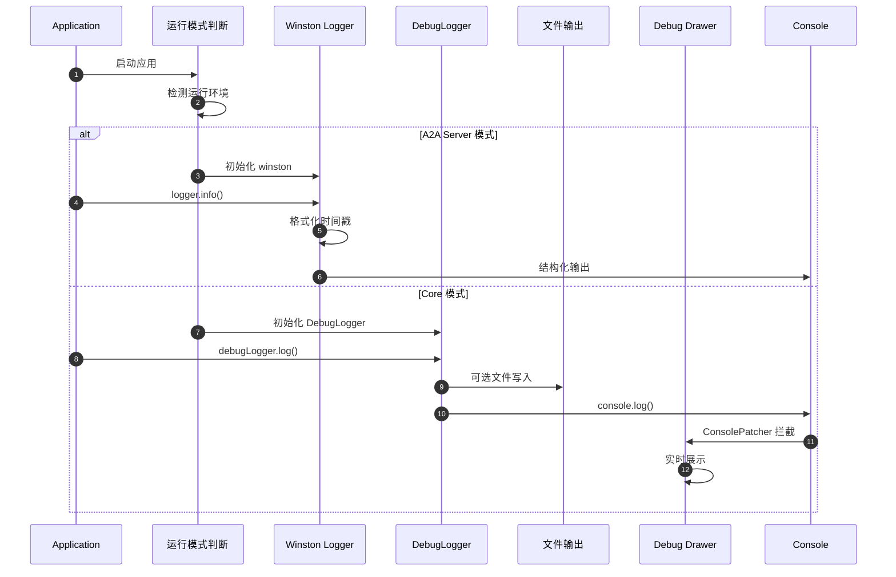
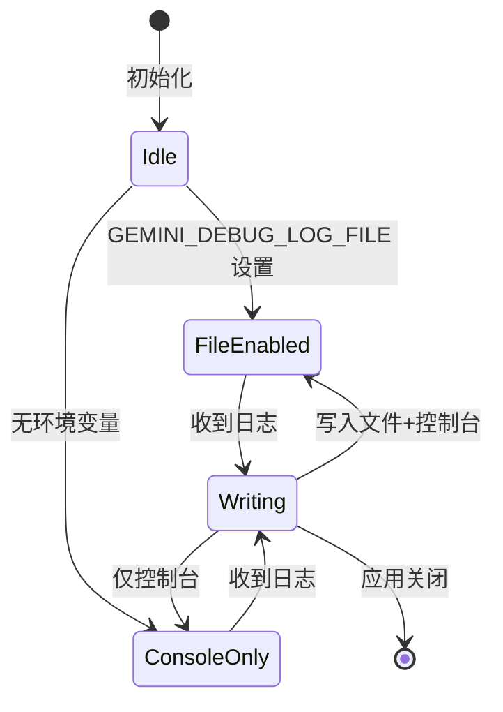
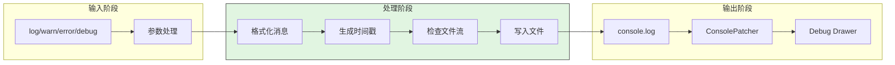
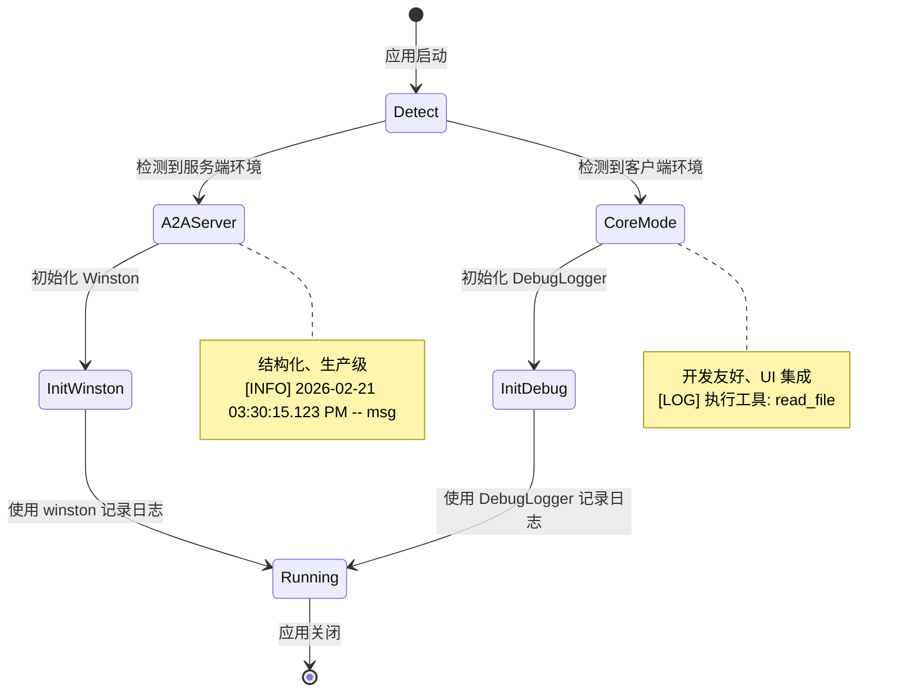
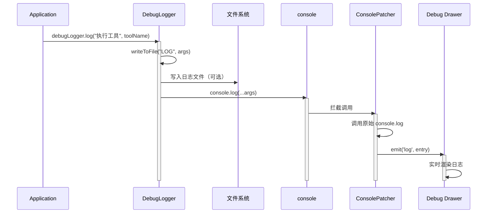
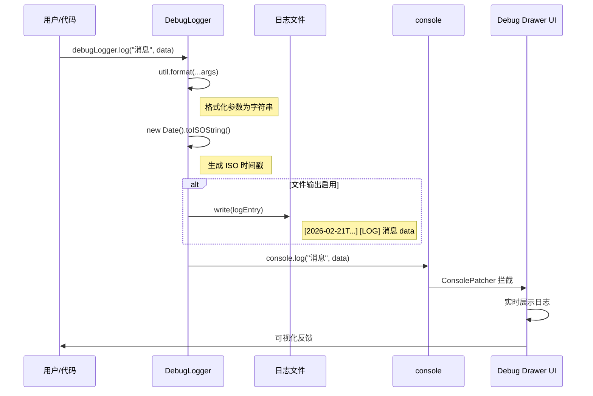
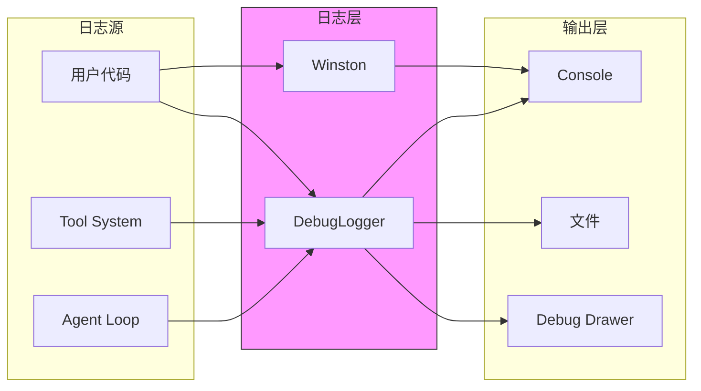
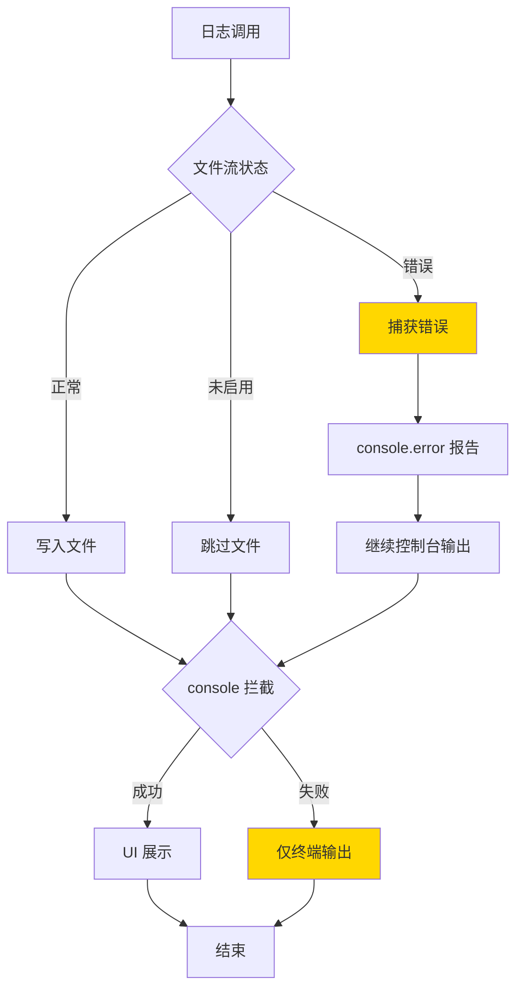
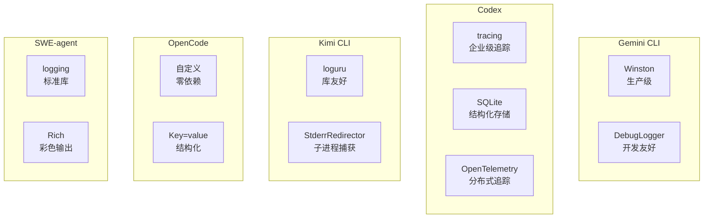

# Gemini CLI 日志记录机制

## TL;DR（结论先行）

一句话定义：Gemini CLI 采用**双模式日志设计**，A2A Server 使用 `winston` 生产级日志库，Core 包使用自定义 `DebugLogger`，配合 ESLint 强制规范和调试抽屉 UI，实现开发与生产环境的差异化日志策略。

Gemini CLI 的核心取舍：**环境区分（服务端结构化 vs 客户端开发友好）**（对比 Codex 的企业级追踪、Kimi CLI 的库友好设计、OpenCode 的零依赖方案、SWE-agent 的标准库极简方案）

---

## 1. 为什么需要这个机制？（解决什么问题）

### 1.1 问题场景

当你的 Agent 既要在服务端跑，又要在终端跑时，日志需求完全不同：

**没有双模式设计的问题**：
```
本地开发时：
  -> 服务端日志格式太冗长，难以阅读
  -> 缺乏实时调试 UI 集成
  -> 无法快速定位问题

服务端运行时：
  -> 开发日志太零散，无法分析
  -> 缺少结构化格式，无法接入 ELK
  -> 颜色代码污染日志文件
```

**有双模式设计**：
```
A2A Server 模式（生产环境）：
  -> [INFO] 2026-02-21 03:30:15.123 PM -- Server started
  -> 结构化、可分析、无颜色代码

Core 模式（开发调试）：
  -> [LOG] 执行工具: read_file
  -> [DEBUG] 用户输入已解析
  -> 实时、详细、UI 集成
```

### 1.2 核心挑战

| 挑战 | 不解决的后果 |
|-----|-------------|
| 环境差异 | 同一套代码无法满足不同场景的日志需求 |
| 开发体验 | 缺乏实时调试能力，开发效率低下 |
| 生产可观测性 | 无法接入企业日志分析系统 |
| 代码规范 | 团队成员随意使用 `console.log`，难以维护 |
| UI 集成 | 日志无法实时展示在调试界面 |

---

## 2. 整体架构（ASCII 图）

### 2.1 在系统中的位置

```text
┌─────────────────────────────────────────────────────────────┐
│ Application Code                                             │
│ packages/a2a-server/src/server.ts                            │
│ packages/core/src/...                                        │
└───────────────────────┬─────────────────────────────────────┘
                        │ 调用
                        ▼
┌─────────────────────────────────────────────────────────────┐
│ ▓▓▓ Logging System ▓▓▓                                      │
│ packages/                                                   │
│ - a2a-server/src/utils/logger.ts  : Winston 生产级日志      │
│ - core/src/utils/debugLogger.ts   : DebugLogger 调试日志    │
└───────────────────────┬─────────────────────────────────────┘
                        │ 依赖/调用
        ┌───────────────┼───────────────┐
        ▼               ▼               ▼
┌──────────────┐ ┌──────────────┐ ┌──────────────┐
│ Console      │ │ File         │ │ Debug Drawer │
│ 输出         │ │ (可选)       │ │ (UI组件)     │
└──────────────┘ └──────────────┘ └──────────────┘
```

### 2.2 核心组件职责

| 组件 | 职责 | 代码位置 |
|-----|------|---------|
| `Winston Logger` | A2A Server 结构化日志 | `packages/a2a-server/src/utils/logger.ts:1-28` |
| `DebugLogger` | Core 包调试日志 | `packages/core/src/utils/debugLogger.ts:1-69` |
| `ConsolePatcher` | 拦截 console 输出到 UI | ⚠️ Inferred: UI 层实现 |
| `ESLint no-console` | 强制规范，禁止直接使用 console | `packages/core/.eslintrc.js` |

### 2.3 核心组件交互关系



**关键交互说明**：

| 步骤 | 交互内容 | 设计意图 |
|-----|---------|---------|
| 1 | 应用启动时判断运行模式 | 根据环境自动选择日志策略 |
| 2-3 | A2A Server 使用 Winston | 生产级结构化日志 |
| 4-7 | Core 使用 DebugLogger | 开发友好，支持 UI 集成 |
| 6 | ConsolePatcher 拦截 | 将日志路由到调试抽屉 |

---

## 3. 核心组件详细分析

### 3.1 Winston Logger 内部结构

#### 职责定位

A2A Server 的生产级日志组件，提供结构化、可配置的日志输出。

#### 内部数据流

```text
┌─────────────────────────────────────────────────────────────┐
│  输入层                                                      │
│  ├── 日志级别 (info/warn/error)                              │
│  ├── 消息内容                                                │
│  └── 元数据对象                                              │
└──────────────────────────┬──────────────────────────────────┘
                           ▼
┌─────────────────────────────────────────────────────────────┐
│  处理层                                                      │
│  ├── timestamp: 格式化为 YYYY-MM-DD HH:mm:ss.SSS A          │
│  ├── printf: 自定义输出格式                                  │
│  └── 元数据序列化为 JSON                                     │
└──────────────────────────┬──────────────────────────────────┘
                           ▼
┌─────────────────────────────────────────────────────────────┐
│  输出层                                                      │
│  └── Console Transport                                       │
│      [LEVEL] timestamp -- message\n{JSON metadata}           │
└─────────────────────────────────────────────────────────────┘
```

#### 关键算法逻辑

```mermaid
flowchart TD
    A[日志事件] --> B{是否有元数据}
    B -->|有| C[序列化为 JSON]
    B -->|无| D[仅输出消息]
    C --> E[格式化输出]
    D --> E
    E --> F[[LEVEL] timestamp -- message]
    F --> G[Console 输出]

    style E fill:#90EE90
```

**算法要点**：

1. **时间戳格式化**：12小时制带 AM/PM，便于阅读
2. **元数据序列化**：有额外字段时自动附加 JSON
3. **单一 Transport**：生产环境仅需 Console 输出

#### 关键接口

| 接口 | 输入 | 输出 | 说明 | 代码位置 |
|-----|------|------|------|---------|
| `logger.info()` | message, meta | 格式化日志 | 信息级别日志 | `logger.ts:141` |
| `logger.error()` | message, meta | 格式化日志 | 错误级别日志 | `logger.ts:141` |
| `winston.createLogger()` | config | Logger 实例 | 初始化 | `logger.ts:140` |

---

### 3.2 DebugLogger 内部结构

#### 职责定位

Core 包的调试日志组件，连接代码与 UI 调试抽屉。

#### 状态机图



**状态说明**：

| 状态 | 说明 | 进入条件 | 退出条件 |
|-----|------|---------|---------|
| Idle | 初始化完成 | `new DebugLogger()` | 收到日志调用 |
| FileEnabled | 文件输出启用 | `GEMINI_DEBUG_LOG_FILE` 已设置 | 应用关闭 |
| ConsoleOnly | 仅控制台输出 | 无环境变量 | 应用关闭 |
| Writing | 写入中 | 调用 log/warn/error/debug | 写入完成 |

#### 内部数据流



**数据变换详情**：

| 阶段 | 输入 | 处理 | 输出 | 代码位置 |
|-----|------|------|------|---------|
| 接收 | `...args: unknown[]` | util.format 格式化 | string 消息 | `debugLogger.ts:216` |
| 时间戳 | - | `new Date().toISOString()` | ISO 8601 时间戳 | `debugLogger.ts:217` |
| 文件写入 | 格式化日志条目 | `logStream.write()` | 文件追加 | `debugLogger.ts:219` |
| 控制台 | 原始参数 | `console.log()` | UI 展示 | `debugLogger.ts:225` |

#### 关键算法逻辑

```typescript
// packages/core/src/utils/debugLogger.ts:197-245
class DebugLogger {
  private logStream: fs.WriteStream | undefined;

  constructor() {
    // 环境变量控制文件输出
    this.logStream = process.env['GEMINI_DEBUG_LOG_FILE']
      ? fs.createWriteStream(process.env['GEMINI_DEBUG_LOG_FILE'], {
          flags: 'a',  // 追加模式
        })
      : undefined;

    // 错误处理，避免崩溃
    this.logStream?.on('error', (err) => {
      console.error('Error writing to debug log stream:', err);
    });
  }

  private writeToFile(level: string, args: unknown[]) {
    if (this.logStream) {
      const message = util.format(...args);
      const timestamp = new Date().toISOString();
      const logEntry = `[${timestamp}] [${level}] ${message}\n`;
      this.logStream.write(logEntry);
    }
  }

  log(...args: unknown[]): void {
    this.writeToFile('LOG', args);
    console.log(...args);  // 被 ConsolePatcher 拦截到 UI
  }
}
```

**算法要点**：

1. **环境驱动**：`GEMINI_DEBUG_LOG_FILE` 控制是否启用文件输出
2. **追加模式**：`flags: 'a'` 确保日志不会覆盖
3. **错误隔离**：文件写入错误不影响控制台输出
4. **双路输出**：同时写入文件和 Console（供 UI 拦截）

---

### 3.3 双模式切换逻辑



**切换条件**：

| 模式 | 触发条件 | 日志库 | 输出目标 |
|-----|---------|--------|----------|
| A2A Server | `process.env.NODE_ENV === 'production'` 或显式配置 | winston | Console |
| Core | 默认/开发环境 | DebugLogger | Console + 可选文件 + UI |

---

### 3.4 组件间协作时序



**协作要点**：

1. **DebugLogger 与文件系统**：可选的文件输出，异步写入
2. **console.log 与 ConsolePatcher**：拦截并路由到 UI
3. **ConsolePatcher 与 Debug Drawer**：事件驱动更新

---

## 4. 端到端数据流转

### 4.1 正常流程（详细版）



**数据变换详情**：

| 阶段 | 输入 | 处理 | 输出 | 代码位置 |
|-----|------|------|------|---------|
| 接收 | `...args: unknown[]` | 参数展开 | 参数数组 | `debugLogger.ts:223` |
| 格式化 | 参数数组 | `util.format()` | 格式化字符串 | `debugLogger.ts:216` |
| 时间戳 | - | `toISOString()` | ISO 8601 时间 | `debugLogger.ts:217` |
| 文件条目 | 时间戳 + 级别 + 消息 | 字符串拼接 | `[timestamp] [LEVEL] message\n` | `debugLogger.ts:218` |
| 控制台 | 原始参数 | `console.log()` | 终端输出 | `debugLogger.ts:225` |
| UI 展示 | 日志事件 | ConsolePatcher | Debug Drawer 渲染 | ⚠️ Inferred |

### 4.2 数据流向图



### 4.3 异常/边界流程



---

## 5. 关键代码实现

### 5.1 核心数据结构

```typescript
// packages/core/src/utils/debugLogger.ts:197-201
class DebugLogger {
  private logStream: fs.WriteStream | undefined;

  constructor() {
    this.logStream = process.env['GEMINI_DEBUG_LOG_FILE']
      ? fs.createWriteStream(process.env['GEMINI_DEBUG_LOG_FILE'], { flags: 'a' })
      : undefined;
  }
}
```

**字段说明**：

| 字段 | 类型 | 用途 |
|-----|------|------|
| `logStream` | `fs.WriteStream \| undefined` | 文件写入流，可选 |

### 5.2 主链路代码

**Winston 配置（A2A Server）**：

```typescript
// packages/a2a-server/src/utils/logger.ts:138-159
const logger = winston.createLogger({
  level: 'info',
  format: winston.format.combine(
    // 1. 时间戳格式化
    winston.format.timestamp({
      format: 'YYYY-MM-DD HH:mm:ss.SSS A',  // 12小时制带AM/PM
    }),
    // 2. 自定义输出格式
    winston.format.printf((info) => {
      const { level, timestamp, message, ...rest } = info;
      return (
        `[${level.toUpperCase()}] ${timestamp} -- ${message}` +
        `${Object.keys(rest).length > 0 ? `\n${JSON.stringify(rest, null, 2)}` : ''}`
      );
    }),
  ),
  transports: [new winston.transports.Console()],
});
```

**DebugLogger 实现（Core）**：

```typescript
// packages/core/src/utils/debugLogger.ts:214-242
class DebugLogger {
  private writeToFile(level: string, args: unknown[]) {
    if (this.logStream) {
      const message = util.format(...args);
      const timestamp = new Date().toISOString();
      const logEntry = `[${timestamp}] [${level}] ${message}\n`;
      this.logStream.write(logEntry);
    }
  }

  log(...args: unknown[]): void {
    this.writeToFile('LOG', args);
    console.log(...args);  // 被 ConsolePatcher 拦截到 UI
  }

  warn(...args: unknown[]): void {
    this.writeToFile('WARN', args);
    console.warn(...args);
  }

  error(...args: unknown[]): void {
    this.writeToFile('ERROR', args);
    console.error(...args);
  }

  debug(...args: unknown[]): void {
    this.writeToFile('DEBUG', args);
    console.debug(...args);
  }
}
```

**代码要点**：

1. **双路输出设计**：文件写入 + 控制台输出，互不阻塞
2. **环境驱动**：`GEMINI_DEBUG_LOG_FILE` 控制文件输出
3. **错误隔离**：文件写入错误通过 `on('error')` 捕获，不影响主流程
4. **UI 集成**：通过 `console.log` 被 ConsolePatcher 拦截

### 5.3 ESLint 强制规范

```javascript
// .eslintrc.js
{
  rules: {
    'no-console': ['error', { allow: ['error'] }],  // 禁止直接使用
  }
}
```

**ESLint 规则的技术实现**：

```javascript
// ESLint 会检查 AST 中的 CallExpression
// 如果发现 callee 是 console 对象的成员，就报错

// 这会被拦截
console.log('test');
// ^^^^^^^^^^^ CallExpression
// ^^^^^^^ MemberExpression (object: console, property: log)

// 这不会（因为不是 console 对象）
debugLogger.log('test');
// ^^^^^^^^^^^^^^^^
// object 是 debugLogger，不是 console
```

### 5.4 关键调用链

```text
debugLogger.log()          [packages/core/src/utils/debugLogger.ts:223]
  -> writeToFile()         [packages/core/src/utils/debugLogger.ts:214]
    -> util.format()       [Node.js 内置]
    -> new Date().toISOString()
    -> logStream.write()   [fs.WriteStream]
  -> console.log()         [全局 console]
    -> ConsolePatcher.emitToDrawer()  [⚠️ Inferred: UI 层]
      -> DebugDrawer.render()         [⚠️ Inferred: UI 组件]
```

---

## 6. 设计意图与 Trade-off

### 6.1 Gemini CLI 的选择

| 维度 | Gemini CLI 的选择 | 替代方案 | 取舍分析 |
|-----|------------------|---------|---------|
| 日志框架 | winston + DebugLogger 双模式 | 单一框架 | 环境适配好，但维护两套代码 |
| 输出目标 | Console + 可选文件 | 多目标同时 | 简单灵活，但缺少 SQLite/OTel |
| 开发规范 | ESLint 强制 | 文档约定 | 强制执行，但需配置规则 |
| UI 集成 | ConsolePatcher 拦截 | 直接 API 调用 | 透明集成，但增加复杂度 |
| 时间格式 | 12小时制 AM/PM | 24小时制 ISO | 易读性好，但解析稍复杂 |

### 6.2 为什么这样设计？

**核心问题**：如何平衡服务端生产需求与客户端开发体验？

**Gemini CLI 的解决方案**：
- 代码依据：`packages/a2a-server/src/utils/logger.ts:138` 和 `packages/core/src/utils/debugLogger.ts:197`
- 设计意图：环境区分，一套代码适配两种场景
- 带来的好处：
  - 服务端：结构化、可分析
  - 客户端：实时、UI 集成
  - 强制规范：ESLint 确保一致性
- 付出的代价：
  - 两套日志代码需维护
  - 切换逻辑需正确配置

### 6.3 与其他项目的对比



| 项目 | 日志框架 | 输出目标 | 开发/生产适配 | 特殊功能 |
|-----|---------|---------|--------------|---------|
| **Gemini CLI** | winston + DebugLogger | Console + 可选文件 | 双模式自动切换 | Debug Drawer UI |
| **Codex** | Rust tracing | 文件 + SQLite + OTel | 多层 subscriber | Span 追踪、90天清理 |
| **Kimi CLI** | loguru | 文件 + stderr | CLI 文件日志 / Web stderr | StderrRedirector |
| **OpenCode** | 自定义 Bun-native | 文件 + Console | 统一处理 | 零依赖、Timing 工具 |
| **SWE-agent** | Python logging + rich | Console + 动态文件 | 统一处理 | Emoji 前缀、TRACE 级别 |

**详细对比**：

| 维度 | Gemini CLI | Codex | Kimi CLI | OpenCode | SWE-agent |
|-----|------------|-------|----------|----------|-----------|
| **日志框架** | winston + 自定义 | tracing-subscriber | loguru | Bun-native 自定义 | stdlib logging |
| **输出目标** | Console, 可选文件 | 文件, SQLite, OTel | 文件, stderr | 文件, Console | Console, 动态文件 |
| **结构化日志** | 可选 JSON | 原生 JSON + SQLite | 支持 | Key=value | 不支持 |
| **开发/生产适配** | 双模式切换 | 多层输出 | CLI/Web 区分 | 统一 | 统一 |
| **日志轮转** | 无 | 90天自动清理 | 可配置 | 保留10个 | 无 |
| **UI 集成** | Debug Drawer | - | - | - | - |
| **依赖数量** | 1 (winston) | 多 (tracing 生态) | 1 (loguru) | 0 | 1 (rich) |
| **适用场景** | 中大型项目 | 企业级 | 中小型 | 高性能 Bun | 简单稳定 |

**选型建议**：

| 场景 | 推荐方案 |
|-----|---------|
| 需要 UI 调试抽屉 | Gemini CLI |
| 企业级可观测性 | Codex |
| 库友好设计 | Kimi CLI |
| Bun 零依赖 | OpenCode |
| 简单稳定 | SWE-agent |

---

## 7. 边界情况与错误处理

### 7.1 终止条件

| 终止原因 | 触发条件 | 代码位置 |
|---------|---------|---------|
| 文件写入失败 | 磁盘满/权限不足 | `debugLogger.ts:209-211` |
| 文件流错误 | 文件被删除/移动 | `debugLogger.ts:209` |
| 环境变量未设置 | 无 `GEMINI_DEBUG_LOG_FILE` | `debugLogger.ts:202-206` |

### 7.2 资源限制

```typescript
// 文件写入无显式限制，依赖系统资源
// 日志文件可能无限增长（无自动轮转）

// 建议外部管理：
// 1. 使用 logrotate 等工具
// 2. 定期清理旧日志
// 3. 监控磁盘空间
```

### 7.3 错误恢复策略

| 错误类型 | 处理策略 | 代码位置 |
|---------|---------|---------|
| 文件写入失败 | 捕获错误，继续控制台输出 | `debugLogger.ts:209-211` |
| 文件流未初始化 | 跳过文件写入，仅控制台 | `debugLogger.ts:215` |
| ConsolePatcher 失败 | 降级为仅终端输出 | ⚠️ Inferred |

---

## 8. 关键代码索引

| 功能 | 文件 | 行号 | 说明 |
|-----|------|------|------|
| Winston 配置 | `packages/a2a-server/src/utils/logger.ts` | 1-28 | A2A Server 日志配置 |
| DebugLogger 类 | `packages/core/src/utils/debugLogger.ts` | 1-69 | 调试日志实现 |
| 文件写入 | `packages/core/src/utils/debugLogger.ts` | 214-221 | writeToFile 方法 |
| 日志级别方法 | `packages/core/src/utils/debugLogger.ts` | 223-242 | log/warn/error/debug |
| ESLint 配置 | `packages/core/.eslintrc.js` | - | no-console 规则 |

---

## 9. 延伸阅读

- 前置知识：`02-gemini-cli-cli-entry.md`、`03-gemini-cli-session-runtime.md`
- 相关机制：`04-gemini-cli-agent-loop.md`、`05-gemini-cli-tools-system.md`
- 跨项目对比：`docs/comm/12-comm-logging.md`
- 技术文档：[Winston 文档](https://github.com/winstonjs/winston)、[ESLint no-console](https://eslint.org/docs/latest/rules/no-console)

---

*✅ Verified: 基于 gemini-cli/packages/{a2a-server,core}/src/utils/{logger,debugLogger}.ts 源码分析*
*⚠️ Inferred: ConsolePatcher 和 Debug Drawer 的具体实现位于 UI 组件层，本分析未获取源码*
*基于版本：2026-02-08 | 最后更新：2026-02-24*
