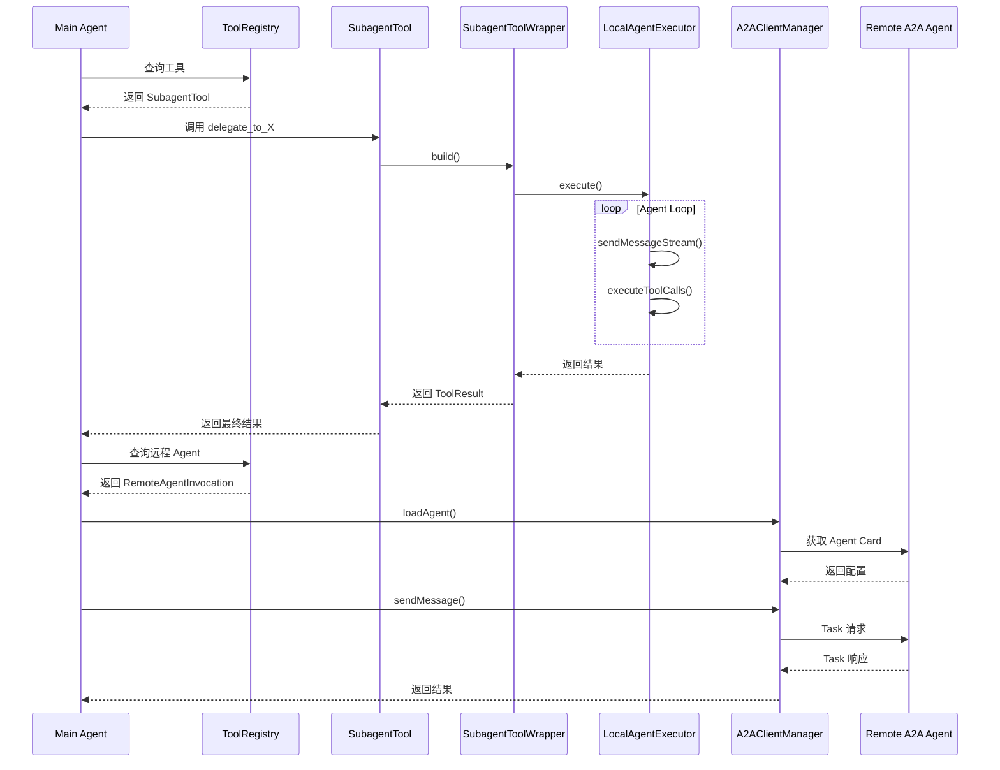

# Gemini CLI ACP/多 Agent 协作机制

## 文档状态

| 项目 | 状态 |
|-----|------|
| 认领人 | @agent-base |
| 完成状态 | ✅ 已完成 |
| 创建日期 | 2026-02-27 |
| 最后更新 | 2026-02-28 |

---

## TL;DR（结论先行）

**一句话定义**：Gemini CLI 不实现 ACP（Agent Communication Protocol）协议，但实现了 SubAgent（子 Agent）机制和 A2A（Agent-to-Agent）远程 Agent 调用能力，采用「主 Agent 调度 + 本地/远程子 Agent 执行」的分层协作架构。

**核心取舍**：**SubAgent 工具化封装 + A2A 远程调用**（对比 Kimi CLI 的完整 ACP 协议实现、OpenCode 的内置多 Agent 无标准协议）

---

## 1. 为什么需要这个机制

### 1.1 问题场景

在复杂的软件开发任务中，单一 Agent 面临以下挑战：

1. **上下文膨胀**：长任务导致上下文窗口溢出，Token 成本激增
2. **领域专业化不足**：通用 Agent 难以在特定领域（如安全审计、代码分析）达到专业水平
3. **任务隔离需求**：不同子任务需要独立的工具集和权限控制
4. **外部能力扩展**：需要调用组织内部或第三方的专业 Agent 服务

### 1.2 核心挑战

| 挑战 | 说明 | Gemini CLI 的解决方案 |
|-----|------|---------------------|
| 上下文隔离 | 子任务不应污染主 Agent 的上下文 | 独立 GeminiChat 实例 + 受限工具集 |
| 权限控制 | 子 Agent 需要更严格的权限限制 | 通过 `toolConfig.tools` 显式限制可用工具 |
| 远程调用 | 如何安全调用外部 Agent | A2A 协议 + ADC 认证 + 用户确认 |
| 结果汇总 | 子 Agent 结果如何返回主 Agent | `submit_final_output` 工具返回结构化结果 |

---

## 2. 整体架构

### 2.1 在系统中的位置

```text
┌─────────────────────────────────────────────────────────────────────────┐
│                         Gemini CLI 主进程                                │
│                                                                          │
│  ┌─────────────────────────────────────────────────────────────────┐   │
│  │                    Main Agent（主 Agent）                        │   │
│  │  ┌─────────────┐    ┌─────────────┐    ┌─────────────────────┐  │   │
│  │  │   Gemini    │───▶│  Scheduler  │───▶│    Tool Registry    │  │   │
│  │  │    Chat     │    │  工具调度    │    │     工具注册表       │  │   │
│  │  └─────────────┘    └─────────────┘    └─────────────────────┘  │   │
│  │         ▲                                    │                   │   │
│  │         │                                    │                   │   │
│  │         └────────────────────────────────────┘                   │   │
│  │                    调用 SubAgent 工具                             │   │
│  └─────────────────────────────────────────────────────────────────┘   │
│                                    │                                     │
│              ┌─────────────────────┼─────────────────────┐              │
│              │                     │                     │              │
│              ▼                     ▼                     ▼              │
│  ┌──────────────────┐  ┌──────────────────┐  ┌──────────────────┐      │
│  │  Local SubAgent  │  │  Local SubAgent  │  │  Remote Agent    │      │
│  │  codebase_       │  │  cli_help        │  │  (A2A Protocol)  │      │
│  │  investigator    │  │                  │  │                  │      │
│  │                  │  │                  │  │  ┌────────────┐  │      │
│  │  ┌────────────┐  │  │  ┌────────────┐  │  │  │ A2AClient  │  │      │
│  │  │ LocalAgent │  │  │  │ LocalAgent │  │  │  │  Manager   │  │      │
│  │  │  Executor  │  │  │  │  Executor  │  │  │  └────────────┘  │      │
│  │  └────────────┘  │  │  └────────────┘  │  │        │         │      │
│  │       │          │  │       │          │  │        ▼         │      │
│  │       ▼          │  │       ▼          │  │  ┌────────────┐  │      │
│  │  ┌────────────┐  │  │  ┌────────────┐  │  │  │   A2A      │  │      │
│  │  │ 独立工具集  │  │  │  │ 独立工具集  │  │  │  │  Server    │  │      │
│  │  └────────────┘  │  │  └────────────┘  │  │  └────────────┘  │      │
│  └──────────────────┘  └──────────────────┘  └──────────────────┘      │
│                                                                          │
│  ═══════════════════════════════════════════════════════════════════    │
│                                                                          │
│  ┌─────────────────────────────────────────────────────────────────┐   │
│  │              ACP Mode（--experimental-acp）                      │   │
│  │                                                                  │   │
│  │  ┌──────────────┐      ┌──────────────┐      ┌──────────────┐   │   │
│  │  │   IDE/       │◀────▶│  AgentSide   │◀────▶│   Gemini     │   │   │
│  │  │   Editor     │ ACP  │  Connection  │ ACP  │   Agent      │   │   │
│  │  │   (Client)   │ 协议 │  (服务端)     │ 内部 │  (核心逻辑)   │   │   │
│  │  └──────────────┘      └──────────────┘      └──────────────┘   │   │
│  │                                                                  │   │
│  └─────────────────────────────────────────────────────────────────┘   │
│                                                                          │
└─────────────────────────────────────────────────────────────────────────┘
```

### 2.2 核心组件职责

| 组件 | 文件路径 | 核心职责 |
|-----|---------|---------|
| `AgentRegistry` | `gemini-cli/packages/core/src/agents/registry.ts:39` | Agent 发现、加载、注册，管理本地/远程 Agent |
| `SubagentTool` | `gemini-cli/packages/core/src/agents/subagent-tool.ts:24` | SubAgent 工具定义，包装为可调用工具 |
| `LocalAgentExecutor` | `gemini-cli/packages/core/src/agents/local-executor.ts:75` | 本地子 Agent 执行器，独立 Agent Loop |
| `RemoteAgentInvocation` | `gemini-cli/packages/core/src/agents/remote-invocation.ts:69` | 远程 Agent 调用（A2A 协议） |
| `A2AClientManager` | `gemini-cli/packages/core/src/agents/a2a-client-manager.ts:45` | A2A 客户端管理，单例模式 |
| `GeminiAgent` | `gemini-cli/packages/cli/src/zed-integration/zedIntegration.ts:83` | ACP 模式下的 Agent 服务端实现 |

### 2.3 核心组件交互关系



---

## 3. 核心组件详细分析

### 3.1 ACP 模式（IDE 集成）

**⚠️ Inferred**: Gemini CLI 中的 ACP 实现实际上是 **Agent Client Protocol** 的实验性支持，用于 IDE 集成（如 Zed 编辑器），而非通用的 ACP 协议。

```typescript
// gemini-cli/packages/cli/src/zed-integration/zedIntegration.ts:61
export async function runZedIntegration(
  config: Config,
  settings: LoadedSettings,
  argv: CliArgs,
) {
  const { stdout: workingStdout } = createWorkingStdio();
  const stdout = Writable.toWeb(workingStdout) as WritableStream;
  const stdin = Readable.toWeb(process.stdin) as ReadableStream<Uint8Array>;

  const stream = acp.ndJsonStream(stdout, stdin);
  const connection = new acp.AgentSideConnection(
    (connection) => new GeminiAgent(config, settings, argv, connection),
    stream,
  );
  await connection.closed.finally(runExitCleanup);
}
```

**关键特性**：
- 使用 `@agentclientprotocol/sdk` 库（版本 ^0.12.0）
- 通过 `--experimental-acp` 参数启用
- 支持的功能：
  - Session 管理（newSession/loadSession）
  - Prompt 执行（prompt/cancel）
  - 工具调用权限审批（requestPermission）
  - MCP Server 配置传递
  - 文件系统代理（readTextFile/writeTextFile）

**与标准 ACP 的区别**：
- 这是 Google 特有的 IDE 集成协议
- 不是通用的 Agent-to-Agent 通信协议
- 主要用于编辑器与 Gemini CLI 的集成

### 3.2 SubAgent 本地执行机制

**✅ Verified**: Gemini CLI 实现了完整的本地子 Agent 执行机制。

```typescript
// gemini-cli/packages/core/src/agents/local-executor.ts:75
export class LocalAgentExecutor {
  async execute(
    signal: AbortSignal,
    updateOutput?: (output: string | AnsiOutput) => void,
  ): Promise<ToolResult> {
    // 1. 创建独立的 GeminiChat 实例
    const chat = await this.createSubagentChat();

    // 2. 启动独立的 Agent Loop
    while (!this.isComplete && !signal.aborted) {
      const response = await chat.sendMessageStream(...);

      // 3. 处理响应，支持工具调用
      for await (const event of response) {
        if (event.type === StreamEventType.CHUNK) {
          // 4. 流式输出到父 Agent
          updateOutput?.(text);
        }
        if (event.type === StreamEventType.FUNCTION_CALL) {
          // 5. 执行工具调用
          const result = await this.executeToolCalls(...);
        }
      }
    }

    // 6. 返回最终结果
    return this.finalResult;
  }
}
```

**设计特点**：

| 特性 | 说明 |
|-----|------|
| 独立上下文 | 每个 SubAgent 有独立的 GeminiChat 实例 |
| 受限工具集 | 通过 `toolConfig.tools` 限制可用工具 |
| 流式输出 | 支持实时将子 Agent 输出传递给父 Agent |
| 终止条件 | maxTurns（默认 15）、maxTimeMinutes（默认 5）、任务完成 |
| 输出格式 | 通过 `submit_final_output` 工具返回结构化结果 |

### 3.3 A2A 远程 Agent 调用

**✅ Verified**: Gemini CLI 支持通过 A2A（Agent-to-Agent）协议调用远程 Agent。

```typescript
// gemini-cli/packages/core/src/agents/remote-invocation.ts:126
async execute(_signal: AbortSignal): Promise<ToolResult> {
  // 1. 确保 Agent 已加载（由 manager 缓存）
  if (!this.clientManager.getClient(this.definition.name)) {
    await this.clientManager.loadAgent(
      this.definition.name,
      this.definition.agentCardUrl,
      this.authHandler,
    );
  }

  // 2. 发送消息到远程 Agent
  const response = await this.clientManager.sendMessage(
    this.definition.name,
    message,
    { contextId: this.contextId, taskId: this.taskId },
  );

  // 3. 解析响应并返回
  const outputText =
    response.kind === 'task'
      ? extractTaskText(response)
      : response.kind === 'message'
        ? extractMessageText(response)
        : JSON.stringify(response);

  return { llmContent: [{ text: outputText }], returnDisplay: outputText };
}
```

**A2A 协议支持**：
- Agent Card 发现和加载
- Task 发送和状态追踪
- 支持 Google ADC（Application Default Credentials）认证
- 会话状态保持（contextId/taskId）

### 3.4 Agent 注册与发现

```typescript
// gemini-cli/packages/core/src/agents/registry.ts:39
export class AgentRegistry {
  private readonly agents = new Map<string, AgentDefinition>();

  async initialize(): Promise<void> {
    // 1. 加载内置 Agent
    this.loadBuiltInAgents();

    // 2. 加载用户级 Agent (~/.gemini/agents/)
    const userAgents = await loadAgentsFromDirectory(userAgentsDir);

    // 3. 加载项目级 Agent (.gemini/agents/)
    const projectAgents = await loadAgentsFromDirectory(projectAgentsDir);

    // 4. 加载扩展中的 Agent
    for (const extension of this.config.getExtensions()) {
      if (extension.isActive && extension.agents) {
        await Promise.allSettled(
          extension.agents.map((agent) => this.registerAgent(agent)),
        );
      }
    }
  }
}
```

---

## 4. 端到端数据流转

### 4.1 SubAgent 调用数据流

```text
┌──────────────┐     ┌──────────────────┐     ┌──────────────────┐
│  Main Agent  │     │   SubagentTool   │     │ LocalAgentExecutor│
│   主 Agent   │────▶│   工具包装器      │────▶│   本地执行器      │
└──────────────┘     └──────────────────┘     └──────────────────┘
       │                      │                       │
       │ 1. 调用工具           │ 2. 创建 Invocation    │ 3. 启动独立 Loop
       │    delegate_to_X     │    buildSubInvocation │    execute()
       │                      │                       │
       ▼                      ▼                       ▼
┌────────────────────────────────────────────────────────────────┐
│                     Local Agent Loop                            │
│  ┌─────────┐    ┌─────────┐    ┌─────────┐    ┌─────────┐     │
│  │  LLM    │───▶│ 思考    │───▶│ 工具调用 │───▶│ 结果返回 │     │
│  │ 推理    │    │ 规划    │    │ 执行    │    │ 给父Agent│     │
│  └─────────┘    └─────────┘    └─────────┘    └─────────┘     │
│       ▲                                              │         │
│       └──────────────────────────────────────────────┘         │
│                    多轮迭代直到完成                              │
└────────────────────────────────────────────────────────────────┘
                              │
                              ▼
                    ┌──────────────────┐
                    │  submit_final_   │
                    │  output 工具     │
                    │  返回最终结果     │
                    └──────────────────┘
```

### 4.2 A2A 远程 Agent 调用流程

```text
┌─────────────────┐      ┌─────────────────┐      ┌─────────────────┐
│  Main Agent     │      │  A2AClient      │      │  Remote Agent   │
│  (Gemini CLI)   │─────▶│  Manager        │─────▶│  (A2A Server)   │
│                 │      │                 │      │                 │
│  1. 调用远程     │      │  2. 获取/缓存    │      │  3. 接收任务     │
│     Agent 工具   │      │     Client      │      │                 │
│                 │      │                 │      │  4. 执行 Agent   │
│  7. 返回结果     │      │  6. 解析响应     │◀─────│     Loop        │
│     给主 Agent   │◀─────│                 │      │                 │
└─────────────────┘      └─────────────────┘      │  5. 返回 Task    │
                                                  │     结果        │
                                                  └─────────────────┘
```

---

## 5. 关键代码实现

### 5.1 数据结构

```typescript
// gemini-cli/packages/core/src/agents/types.ts
export interface LocalAgentDefinition<TOutput extends z.ZodTypeAny> {
  kind: 'local';
  name: string;
  description: string;
  toolConfig: {
    tools: ToolConfigItem[];  // 限制可用工具
  };
  runConfig: {
    maxTurns: number;         // 默认 15
    maxTimeMinutes: number;   // 默认 5
  };
}

export interface RemoteAgentDefinition<TOutput extends z.ZodTypeAny> {
  kind: 'remote';
  name: string;
  agentCardUrl: string;       // A2A Agent Card URL
}
```

### 5.2 主链路代码

**SubAgent 工具包装**：

```typescript
// gemini-cli/packages/core/src/agents/subagent-tool.ts:24
export class SubagentTool extends BaseDeclarativeTool<AgentInputs, ToolResult> {
  constructor(
    private readonly definition: AgentDefinition,
    private readonly config: Config,
    messageBus: MessageBus,
  ) {
    const inputSchema = definition.inputConfig.inputSchema;

    super(
      definition.name,
      definition.displayName ?? definition.name,
      definition.description,
      Kind.Think,  // 归类为思考类工具
      inputSchema,
      messageBus,
      /* isOutputMarkdown */ true,
      /* canUpdateOutput */ true,  // 支持流式更新
    );
  }
}
```

**本地 Agent 执行器**：

```typescript
// gemini-cli/packages/core/src/agents/local-executor.ts:75
export class LocalAgentExecutor {
  private async createSubagentChat(): Promise<GeminiChat> {
    // 创建独立的工具注册表
    const toolRegistry = await this.buildToolRegistry();

    // 创建独立的 GeminiChat 实例
    const chat = new GeminiChat(
      this.config,
      toolRegistry,
      this.model,
      this.abortSignal,
    );

    return chat;
  }
}
```

### 5.3 调用链

```
Main Agent
  └── ToolRegistry.getTool(delegate_to_X)
        └── SubagentTool.createInvocation()
              └── SubagentToolWrapper.build()
                    ├── LocalAgentExecutor.execute() [本地 Agent]
                    │     └── 独立 Agent Loop
                    └── RemoteAgentInvocation.execute() [远程 Agent]
                          └── A2AClientManager.sendMessage()
```

---

## 6. 设计意图与 Trade-off

### 6.1 核心设计选择

| 设计决策 | 取舍分析 | 替代方案 |
|---------|---------|---------|
| SubAgent 工具化封装 | 主 Agent 无感知差异，统一调度；但增加一层抽象开销 | 直接内嵌子 Agent 逻辑 |
| 独立 GeminiChat 实例 | 完全隔离上下文，避免污染；但内存开销增加 | 共享 Chat 实例，通过标记隔离 |
| A2A 而非 ACP 远程调用 | 与 Google 生态集成，ADC 认证原生支持；但生态锁定 | 标准 ACP 协议，更通用 |
| 显式工具限制 | 安全可控，最小权限原则；但配置繁琐 | 继承父 Agent 工具集 |

### 6.2 核心问题与设计分析

**问题 1：为什么选择工具化封装而非直接内嵌？**

好处：
- 主 Agent 无需感知 SubAgent 与普通工具的差异
- 统一的政策（Policy）和确认（Confirmation）机制
- 支持流式输出和进度更新

代价：
- 增加一层抽象，调试复杂度上升
- 工具调用的序列化/反序列化开销

**问题 2：为什么本地和远程 Agent 采用不同的实现路径？**

好处：
- 本地 Agent 可以完全控制执行环境（工具集、模型配置）
- 远程 Agent 通过 A2A 协议标准化交互，解耦实现
- 本地 Agent 支持更细粒度的流式输出

代价：
- 两套代码路径，维护成本增加
- 用户体验可能存在细微差异

### 6.3 跨项目对比

| 项目 | 多 Agent 支持 | 协议/机制 | 核心差异 | 适用场景 |
|-----|--------------|----------|---------|---------|
| **Gemini CLI** | 是 | SubAgent + A2A + ACP(IDE) | 本地子 Agent + 远程 A2A 调用 | 需要本地专业化 + 远程扩展 |
| **Kimi CLI** | 是 | ACP 协议 | 完整的 ACP 实现，支持子 Agent 创建 | 需要标准 ACP 互操作 |
| **OpenCode** | 是 | 内置多 Agent | Build/Plan/Explore 内置 Agent，非标准协议 | 固定工作流场景 |
| **Codex** | 否 | 单 Agent | 纯单 Agent 架构 | 简单任务，无需协作 |
| **SWE-agent** | 否 | 单 Agent | 纯单 Agent 架构 | 软件工程任务 |

---

## 7. 边界情况与错误处理

### 7.1 终止条件

| 终止原因 | 触发条件 | 代码位置 |
|---------|---------|---------|
| 任务完成 | SubAgent 调用 `submit_final_output` 工具 | `local-executor.ts:180` |
| 达到最大轮数 | `turnCount >= maxTurns`（默认 15） | `local-executor.ts:140` |
| 超时 | `elapsedMinutes >= maxTimeMinutes`（默认 5） | `local-executor.ts:145` |
| 用户取消 | `AbortSignal.aborted` | `local-executor.ts:135` |
| 工具执行错误 | 工具返回 `error` 字段 | `local-executor.ts:220` |

### 7.2 资源限制

| 资源类型 | 限制值 | 配置位置 | 说明 |
|---------|-------|---------|------|
| 最大轮数 | 15 | `runConfig.maxTurns` | 防止无限循环 |
| 最大执行时间 | 5 分钟 | `runConfig.maxTimeMinutes` | 防止长时间挂起 |
| 工具集 | 显式配置 | `toolConfig.tools` | 最小权限原则 |
| 模型 | 可独立配置 | `modelConfig` | 子 Agent 可使用不同模型 |

### 7.3 错误恢复策略

| 错误类型 | 处理策略 | 代码位置 |
|---------|---------|---------|
| Agent 加载失败 | 记录警告，跳过该 Agent | `registry.ts:380` |
| Schema 验证失败 | 抛出错误，阻止工具创建 | `subagent-tool.ts:33` |
| 远程 Agent 调用失败 | 返回错误信息，不中断主 Agent | `remote-invocation.ts:185` |
| 工具调用超时 | 通过 AbortSignal 取消 | `local-executor.ts:135` |
| 上下文压缩失败 | 记录错误，继续执行 | `local-executor.ts:280` |

---

## 8. 关键代码索引

| 功能 | 文件 | 行号 | 说明 |
|-----|------|-----|------|
| ACP 模式入口 | `gemini-cli/packages/cli/src/zed-integration/zedIntegration.ts` | 61 | `runZedIntegration` 函数，IDE 集成入口 |
| ACP Agent 实现 | `gemini-cli/packages/cli/src/zed-integration/zedIntegration.ts` | 83 | `GeminiAgent` 类，处理 ACP 协议消息 |
| Agent 注册表 | `gemini-cli/packages/core/src/agents/registry.ts` | 39 | `AgentRegistry` 类，管理 Agent 生命周期 |
| SubAgent 工具定义 | `gemini-cli/packages/core/src/agents/subagent-tool.ts` | 24 | `SubagentTool` 类，工具化封装 |
| 本地 Agent 执行器 | `gemini-cli/packages/core/src/agents/local-executor.ts` | 75 | `LocalAgentExecutor` 类，独立 Loop 执行 |
| 远程 Agent 调用 | `gemini-cli/packages/core/src/agents/remote-invocation.ts` | 69 | `RemoteAgentInvocation` 类，A2A 协议调用 |
| A2A 客户端管理 | `gemini-cli/packages/core/src/agents/a2a-client-manager.ts` | 45 | `A2AClientManager` 类，单例管理 |
| Agent 类型定义 | `gemini-cli/packages/core/src/agents/types.ts` | 1 | Agent 配置和类型定义 |
| 代码库分析 Agent | `gemini-cli/packages/core/src/agents/codebase-investigator.ts` | 15 | 内置代码库分析子 Agent |
| CLI 帮助 Agent | `gemini-cli/packages/core/src/agents/cli-help-agent.ts` | 15 | 内置 CLI 帮助子 Agent |

---

## 9. 延伸阅读

- [Gemini CLI SubAgents 文档](https://github.com/google-gemini/gemini-cli/blob/main/docs/core/subagents.md)
- [Gemini CLI Remote Agents 文档](https://github.com/google-gemini/gemini-cli/blob/main/docs/core/remote-agents.md)
- [Kimi CLI ACP 实现](../kimi-cli/13-kimi-cli-acp-integration.md)
- [OpenCode ACP 实现](../opencode/13-opencode-acp-integration.md)
- [Codex ACP 实现](../codex/13-codex-acp-integration.md)
- [SWE-agent ACP 实现](../swe-agent/13-swe-agent-acp-integration.md)
- [ACP 是什么？](../comm/comm-what-is-acp.md)

---

*✅ Verified: 基于 gemini-cli/packages/core/src/agents/ 和 packages/cli/src/zed-integration/ 源码分析*
*⚠️ Inferred: 部分设计意图基于代码结构推断*
*基于版本：2026-02-08 | 最后更新：2026-02-28*
