# Gemini CLI ACP/多 Agent 协作机制

> **阅读指南**
>
> | 属性 | 说明 |
> |-----|------|
> | 预计阅读 | 25-35 分钟 |
> | 前置文档 | `01-gemini-cli-overview.md`、`04-gemini-cli-agent-loop.md`、`06-gemini-cli-mcp-integration.md` |
> | 文档结构 | 速览 → 架构 → 机制 → 实现 → 对比 |
> | 代码呈现 | 关键代码直接展示，完整代码可折叠查看 |

---

## TL;DR（结论先行）

**一句话定义**：Gemini CLI 实现了实验性 ACP（Agent Client Protocol）模式（`--experimental-acp`，主要用于 IDE 集成），并实现了 SubAgent（子 Agent）机制和 A2A（Agent-to-Agent）远程 Agent 调用能力，采用「主 Agent 调度 + 本地/远程子 Agent 执行」的分层协作架构。

Gemini CLI 的核心取舍：**ACP(IDE) + SubAgent 工具化封装 + A2A 远程调用**（对比 Kimi CLI 的完整 ACP 实现、OpenCode 的内置多 Agent、Codex 的进程内协作）

### 核心要点速览

| 维度 | 关键决策 | 代码位置 |
|-----|---------|---------|
| ACP 模式 | IDE 集成协议，基于 `@agentclientprotocol/sdk` | `gemini-cli/packages/cli/src/zed-integration/zedIntegration.ts:61` |
| SubAgent 机制 | 工具化封装，独立 GeminiChat 实例 | `gemini-cli/packages/core/src/agents/subagent-tool.ts:24` |
| 本地执行 | LocalAgentExecutor 独立 Agent Loop | `gemini-cli/packages/core/src/agents/local-executor.ts:75` |
| 远程调用 | A2A 协议 + ADC 认证 | `gemini-cli/packages/core/src/agents/remote-invocation.ts:69` |
| Agent 注册 | 四级加载策略（内置/用户/项目/扩展） | `gemini-cli/packages/core/src/agents/registry.ts:39` |

---

## 1. 为什么需要这个机制？

### 1.1 问题场景

没有多 Agent 协作机制：
```
用户: "分析这个大型项目的安全漏洞并修复"
  -> 单一 Agent 尝试处理所有任务
  -> 上下文膨胀，Token 成本激增
  -> 安全分析需要专业知识，通用 Agent 能力不足
  -> 任务失败或质量低下
```

有多 Agent 协作机制：
```
用户: "分析这个大型项目的安全漏洞并修复"
  -> Main Agent: "调用安全分析 SubAgent"
  -> Security SubAgent: 专业分析，返回漏洞报告
  -> Main Agent: "调用代码修复 SubAgent"
  -> Fix SubAgent: 根据报告修复代码
  -> Main Agent: 汇总结果返回给用户
```

### 1.2 核心挑战

| 挑战 | 不解决的后果 | Gemini CLI 的解决方案 |
|-----|-------------|---------------------|
| 上下文隔离 | 子任务污染主 Agent 上下文 | 独立 GeminiChat 实例 + 受限工具集 |
| 权限控制 | 子 Agent 需要更严格的权限限制 | 通过 `toolConfig.tools` 显式限制可用工具 |
| 远程调用 | 如何安全调用外部 Agent | A2A 协议 + ADC 认证 + 用户确认 |
| 结果汇总 | 子 Agent 结果如何返回主 Agent | `submit_final_output` 工具返回结构化结果 |
| 专业化分工 | 通用 Agent 难以处理专业任务 | SubAgent 专精特定领域 |

---

## 2. 整体架构（ASCII 图）

### 2.1 在系统中的位置

```text
┌─────────────────────────────────────────────────────────────────────────┐
│                         Gemini CLI 主进程                                │
│                                                                          │
│  ┌─────────────────────────────────────────────────────────────────┐   │
│  │                    Main Agent（主 Agent）                        │   │
│  │  ┌─────────────┐    ┌─────────────┐    ┌─────────────────────┐  │   │
│  │  │   Gemini    │───▶│  Scheduler  │───▶│    Tool Registry    │  │   │
│  │  │    Chat     │    │  工具调度    │    │     工具注册表       │  │   │
│  │  └─────────────┘    └─────────────┘    └─────────────────────┘  │   │
│  │         ▲                                    │                   │   │
│  │         │                                    │                   │   │
│  │         └────────────────────────────────────┘                   │   │
│  │                    调用 SubAgent 工具                             │   │
│  └─────────────────────────────────────────────────────────────────┘   │
│                                    │                                     │
│              ┌─────────────────────┼─────────────────────┐              │
│              │                     │                     │              │
│              ▼                     ▼                     ▼              │
│  ┌──────────────────┐  ┌──────────────────┐  ┌──────────────────┐      │
│  │  Local SubAgent  │  │  Local SubAgent  │  │  Remote Agent    │      │
│  │  codebase_       │  │  cli_help        │  │  (A2A Protocol)  │      │
│  │  investigator    │  │                  │  │                  │      │
│  │                  │  │                  │  │  ┌────────────┐  │      │
│  │  ┌────────────┐  │  │  ┌────────────┐  │  │  │ A2AClient  │  │      │
│  │  │ LocalAgent │  │  │  │ LocalAgent │  │  │  │  Manager   │  │      │
│  │  │  Executor  │  │  │  │  Executor  │  │  │  └────────────┘  │      │
│  │  └────────────┘  │  │  └────────────┘  │  │        │         │      │
│  │       │          │  │       │          │  │        ▼         │      │
│  │       ▼          │  │       ▼          │  │  ┌────────────┐  │      │
│  │  ┌────────────┐  │  │  ┌────────────┐  │  │  │   A2A      │  │      │
│  │  │ 独立工具集  │  │  │  │ 独立工具集  │  │  │  │  Server    │  │      │
│  │  └────────────┘  │  │  └────────────┘  │  │  └────────────┘  │      │
│  └──────────────────┘  └──────────────────┘  └──────────────────┘      │
│                                                                          │
│  ═══════════════════════════════════════════════════════════════════    │
│                                                                          │
│  ┌─────────────────────────────────────────────────────────────────┐   │
│  │              ACP Mode（--experimental-acp）                      │   │
│  │                                                                  │   │
│  │  ┌──────────────┐      ┌──────────────┐      ┌──────────────┐   │   │
│  │  │   IDE/       │◀────▶│  AgentSide   │◀────▶│   Gemini     │   │   │
│  │  │   Editor     │ ACP  │  Connection  │ ACP  │   Agent      │   │   │
│  │  │   (Client)   │ 协议 │  (服务端)     │ 内部 │  (核心逻辑)   │   │   │
│  │  └──────────────┘      └──────────────┘      └──────────────┘   │   │
│  │                                                                  │   │
│  └─────────────────────────────────────────────────────────────────┘   │
│                                                                          │
└─────────────────────────────────────────────────────────────────────────┘
```

### 2.2 核心组件职责

| 组件 | 职责 | 代码位置 |
|-----|------|---------|
| `AgentRegistry` | Agent 发现、加载、注册，管理本地/远程 Agent | `gemini-cli/packages/core/src/agents/registry.ts:39` |
| `SubagentTool` | SubAgent 工具定义，包装为可调用工具 | `gemini-cli/packages/core/src/agents/subagent-tool.ts:24` |
| `LocalAgentExecutor` | 本地子 Agent 执行器，独立 Agent Loop | `gemini-cli/packages/core/src/agents/local-executor.ts:75` |
| `RemoteAgentInvocation` | 远程 Agent 调用（A2A 协议） | `gemini-cli/packages/core/src/agents/remote-invocation.ts:69` |
| `A2AClientManager` | A2A 客户端管理，单例模式 | `gemini-cli/packages/core/src/agents/a2a-client-manager.ts:45` |
| `GeminiAgent` | ACP 模式下的 Agent 服务端实现 | `gemini-cli/packages/cli/src/zed-integration/zedIntegration.ts:83` |

### 2.3 核心组件交互关系

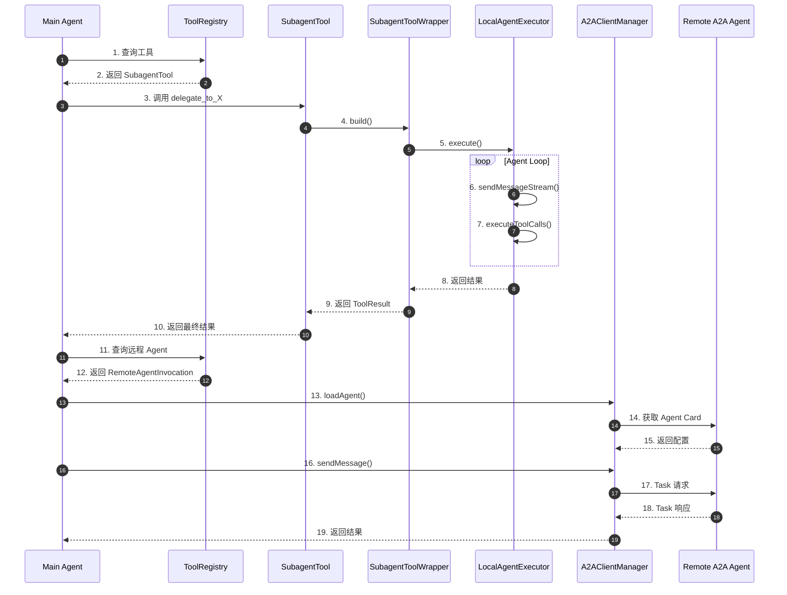

**关键交互说明**：

| 步骤 | 交互内容 | 设计意图 |
|-----|---------|---------|
| 1-2 | 主 Agent 查询工具注册表 | 统一工具发现机制，SubAgent 与普通工具无差异 |
| 3-5 | 工具调用转换为 SubAgent 执行 | 工具化封装，复用现有调度基础设施 |
| 6-7 | 独立 Agent Loop 执行 | 完全隔离的上下文，避免污染主 Agent |
| 8-10 | 结果逐层返回 | 统一的 ToolResult 格式，便于主 Agent 处理 |
| 13-15 | A2A Agent Card 发现 | 标准化远程 Agent 能力发现 |
| 16-19 | Task 发送与响应 | A2A 协议标准化交互 |

---

## 3. 核心组件详细分析

### 3.1 ACP 模式（IDE 集成）

#### 职责定位

ACP（Agent Client Protocol）模式主要用于 IDE 与 Gemini CLI 集成，通过标准化的协议实现编辑器与 Agent 的双向通信。

**✅ Verified**: Gemini CLI 中存在 **Agent Client Protocol** 的实验性实现（`--experimental-acp`），入口为 Zed 集成通道。

#### 状态机图

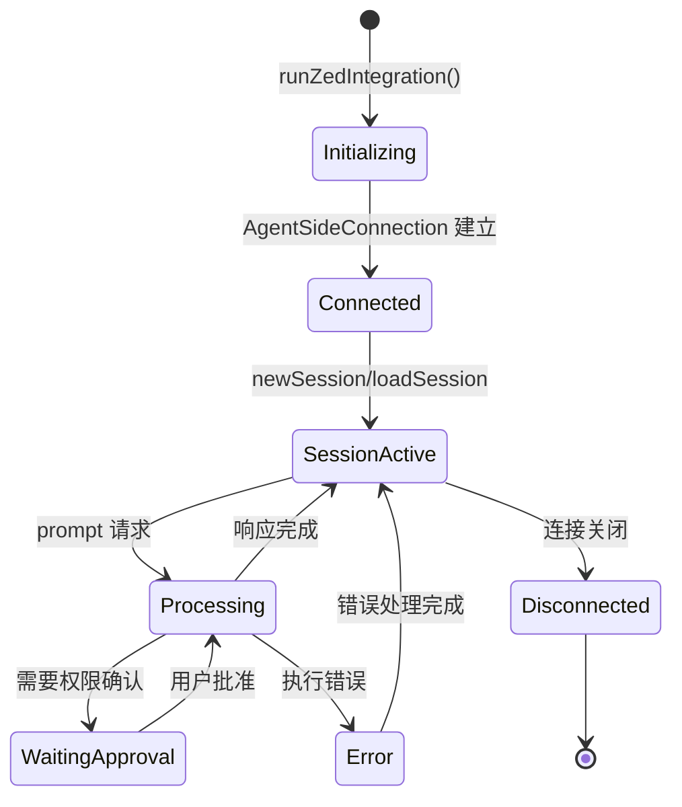

**状态说明**：

| 状态 | 说明 | 进入条件 | 退出条件 |
|-----|------|---------|---------|
| Initializing | 初始化 ACP 连接 | 启动 `--experimental-acp` | WebStream 创建完成 |
| Connected | 连接已建立 | AgentSideConnection 就绪 | Session 创建或关闭 |
| SessionActive | Session 活跃 | newSession/loadSession 成功 | 连接关闭 |
| Processing | 处理 Prompt | 收到 prompt 请求 | 响应完成或出错 |
| WaitingApproval | 等待权限确认 | 工具调用需要批准 | 用户确认或拒绝 |
| Disconnected | 连接已关闭 | 连接异常或主动关闭 | 进程退出 |

#### 关键代码

**ACP 模式入口**（`gemini-cli/packages/cli/src/zed-integration/zedIntegration.ts:61-173`）

```typescript
// gemini-cli/packages/cli/src/zed-integration/zedIntegration.ts:61
export async function runZedIntegration(
  config: Config,
  settings: LoadedSettings,
  argv: CliArgs,
) {
  const { stdout: workingStdout } = createWorkingStdio();
  const stdout = Writable.toWeb(workingStdout) as WritableStream;
  const stdin = Readable.toWeb(process.stdin) as ReadableStream<Uint8Array>;

  const stream = acp.ndJsonStream(stdout, stdin);
  const connection = new acp.AgentSideConnection(
    (connection) => new GeminiAgent(config, settings, argv, connection),
    stream,
  );
  await connection.closed.finally(runExitCleanup);
}
```

**设计要点**：
1. 使用 `@agentclientprotocol/sdk` 库（版本 ^0.12.0）
2. 通过 `--experimental-acp` 参数启用
3. 支持 Session 管理、Prompt 执行、权限审批、MCP Server 配置传递

#### 内部数据流

```text
┌─────────────────────────────────────────────────────────────┐
│  输入层（IDE → CLI）                                          │
│  ├── newSession / loadSession ──► Session 管理               │
│  ├── prompt ──► 执行请求                                      │
│  ├── cancel ──► 取消执行                                      │
│  └── requestPermission ──► 权限响应                           │
└──────────────────────────┬──────────────────────────────────┘
                           ▼
┌─────────────────────────────────────────────────────────────┐
│  处理层（GeminiAgent）                                        │
│  ├── Session 状态管理                                         │
│  ├── 调用 GeminiChat 执行                                     │
│  ├── 工具调用权限拦截                                         │
│  └── MCP Server 配置管理                                      │
└──────────────────────────┬──────────────────────────────────┘
                           ▼
┌─────────────────────────────────────────────────────────────┐
│  输出层（CLI → IDE）                                          │
│  ├── output ──► 流式输出                                      │
│  ├── toolCall ──► 工具调用通知                                │
│  ├── requestPermission ──► 权限请求                           │
│  └── error ──► 错误通知                                       │
└─────────────────────────────────────────────────────────────┘
```

---

### 3.2 SubAgent 本地执行机制

#### 职责定位

本地 SubAgent 执行器负责创建独立的 GeminiChat 实例，在隔离的上下文中执行子任务。

**✅ Verified**: Gemini CLI 实现了完整的本地子 Agent 执行机制。

#### 状态机图

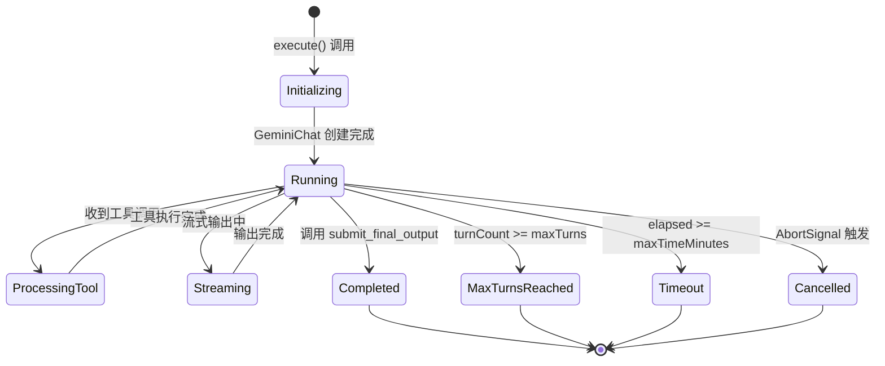

**状态说明**：

| 状态 | 说明 | 进入条件 | 退出条件 |
|-----|------|---------|---------|
| Initializing | 初始化 SubAgent | execute() 被调用 | GeminiChat 创建完成 |
| Running | 执行中 | 开始 Agent Loop | 完成或终止条件触发 |
| ProcessingTool | 处理工具调用 | 收到 functionCall | 工具执行完成 |
| Streaming | 流式输出 | 收到内容块 | 内容输出完成 |
| Completed | 正常完成 | 调用 submit_final_output | 自动结束 |
| MaxTurnsReached | 达到最大轮数 | turnCount >= maxTurns | 自动结束 |
| Timeout | 执行超时 | 时间超过 maxTimeMinutes | 自动结束 |
| Cancelled | 已取消 | AbortSignal 触发 | 自动结束 |

#### 关键代码

**本地 Agent 执行器**（`gemini-cli/packages/core/src/agents/local-executor.ts:75-225`）

```typescript
// gemini-cli/packages/core/src/agents/local-executor.ts:75
export class LocalAgentExecutor {
  async execute(
    signal: AbortSignal,
    updateOutput?: (output: string | AnsiOutput) => void,
  ): Promise<ToolResult> {
    // 1. 创建独立的 GeminiChat 实例
    const chat = await this.createSubagentChat();

    // 2. 启动独立的 Agent Loop
    while (!this.isComplete && !signal.aborted) {
      const response = await chat.sendMessageStream(...);

      // 3. 处理响应，支持工具调用
      for await (const event of response) {
        if (event.type === StreamEventType.CHUNK) {
          // 4. 流式输出到父 Agent
          updateOutput?.(text);
        }
        if (event.type === StreamEventType.FUNCTION_CALL) {
          // 5. 执行工具调用
          const result = await this.executeToolCalls(...);
        }
      }
    }

    // 6. 返回最终结果
    return this.finalResult;
  }

  private async createSubagentChat(): Promise<GeminiChat> {
    // 创建独立的工具注册表
    const toolRegistry = await this.buildToolRegistry();

    // 创建独立的 GeminiChat 实例
    const chat = new GeminiChat(
      this.config,
      toolRegistry,
      this.model,
      this.abortSignal,
    );

    return chat;
  }
}
```

**设计特点**：

| 特性 | 说明 |
|-----|------|
| 独立上下文 | 每个 SubAgent 有独立的 GeminiChat 实例 |
| 受限工具集 | 通过 `toolConfig.tools` 限制可用工具 |
| 流式输出 | 支持实时将子 Agent 输出传递给父 Agent |
| 终止条件 | maxTurns（默认 15）、maxTimeMinutes（默认 5）、任务完成 |
| 输出格式 | 通过 `submit_final_output` 工具返回结构化结果 |

---

### 3.3 A2A 远程 Agent 调用

#### 职责定位

A2A（Agent-to-Agent）远程 Agent 调用通过标准化协议调用外部 Agent 服务。

**✅ Verified**: Gemini CLI 支持通过 A2A（Agent-to-Agent）协议调用远程 Agent。

#### 状态机图

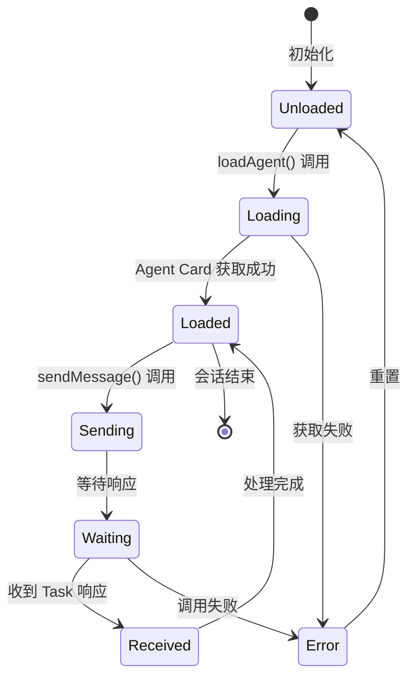

#### 关键代码

**远程 Agent 调用**（`gemini-cli/packages/core/src/agents/remote-invocation.ts:126-185`）

```typescript
// gemini-cli/packages/core/src/agents/remote-invocation.ts:126
async execute(_signal: AbortSignal): Promise<ToolResult> {
  // 1. 确保 Agent 已加载（由 manager 缓存）
  if (!this.clientManager.getClient(this.definition.name)) {
    await this.clientManager.loadAgent(
      this.definition.name,
      this.definition.agentCardUrl,
      this.authHandler,
    );
  }

  // 2. 发送消息到远程 Agent
  const response = await this.clientManager.sendMessage(
    this.definition.name,
    message,
    { contextId: this.contextId, taskId: this.taskId },
  );

  // 3. 解析响应并返回
  const outputText =
    response.kind === 'task'
      ? extractTaskText(response)
      : response.kind === 'message'
        ? extractMessageText(response)
        : JSON.stringify(response);

  return { llmContent: [{ text: outputText }], returnDisplay: outputText };
}
```

**A2A 协议支持**：
- Agent Card 发现和加载
- Task 发送和状态追踪
- 支持 Google ADC（Application Default Credentials）认证
- 会话状态保持（contextId/taskId）

---

### 3.4 Agent 注册与发现

#### 职责定位

AgentRegistry 负责从多个来源加载和注册 Agent 定义。

#### 关键代码

**Agent 注册表**（`gemini-cli/packages/core/src/agents/registry.ts:39-110`）

```typescript
// gemini-cli/packages/core/src/agents/registry.ts:39
export class AgentRegistry {
  private readonly agents = new Map<string, AgentDefinition>();

  async initialize(): Promise<void> {
    // 1. 加载内置 Agent
    this.loadBuiltInAgents();

    // 2. 加载用户级 Agent (~/.gemini/agents/)
    const userAgents = await loadAgentsFromDirectory(userAgentsDir);

    // 3. 加载项目级 Agent (.gemini/agents/)
    const projectAgents = await loadAgentsFromDirectory(projectAgentsDir);

    // 4. 加载扩展中的 Agent
    for (const extension of this.config.getExtensions()) {
      if (extension.isActive && extension.agents) {
        await Promise.allSettled(
          extension.agents.map((agent) => this.registerAgent(agent)),
        );
      }
    }
  }
}
```

---

### 3.5 组件间协作时序

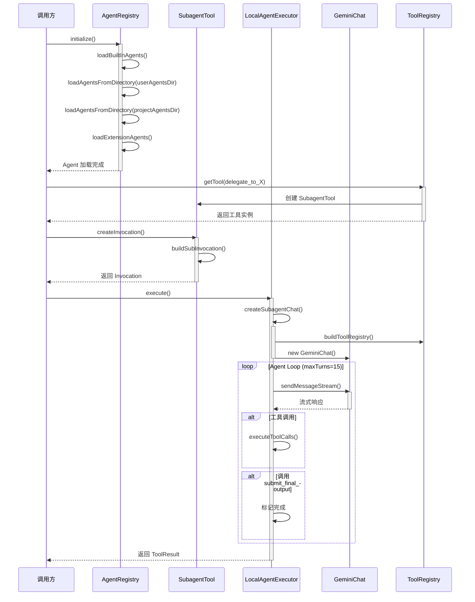

**协作要点**：

1. **四级加载策略**：内置 → 用户级 → 项目级 → 扩展级，优先级递增
2. **工具化封装**：SubAgent 被包装为普通工具，复用现有调度机制
3. **独立生命周期**：SubAgent 的 GeminiChat 完全独立，包括工具注册表

---

### 3.6 关键数据路径

#### 主路径（本地 SubAgent）

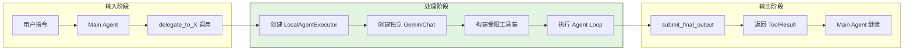

#### 异常路径（远程 Agent 失败）

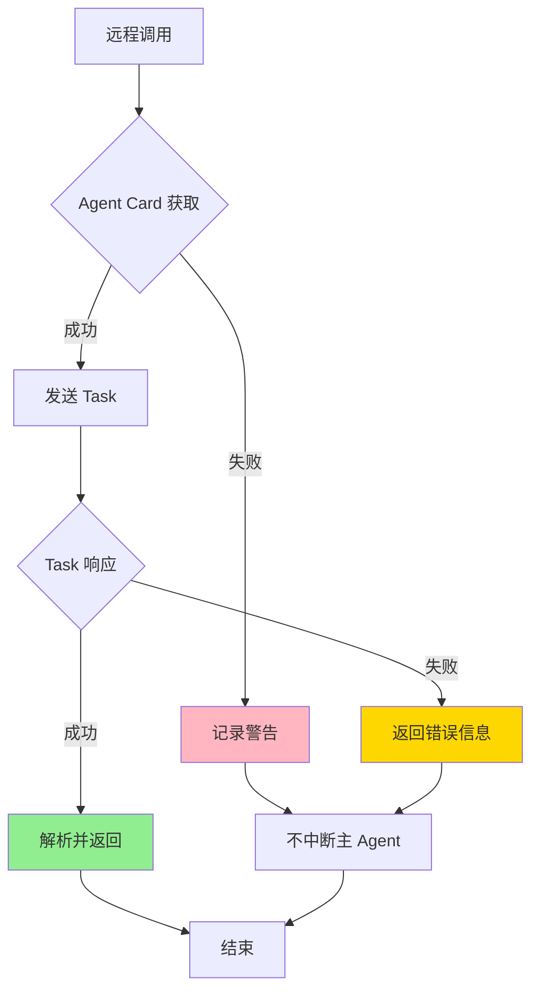

---

## 4. 端到端数据流转

### 4.1 正常流程（详细版）

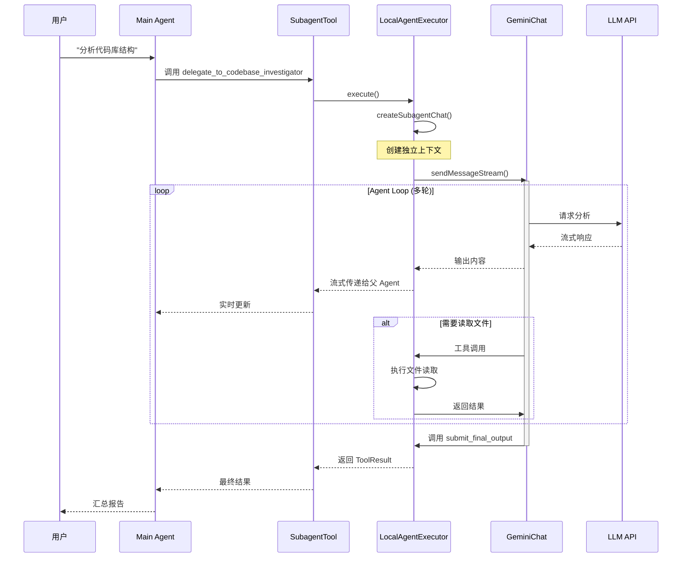

**数据变换详情**：

| 阶段 | 输入 | 处理 | 输出 | 代码位置 |
|-----|------|------|------|---------|
| 工具调用 | 用户指令 | 解析为 SubAgent 调用 | ToolCallRequest | `subagent-tool.ts:45` |
| 执行器创建 | AgentDefinition | 创建独立实例 | LocalAgentExecutor | `local-executor.ts:75` |
| Chat 创建 | Config + ToolRegistry | 初始化独立上下文 | GeminiChat | `local-executor.ts:120` |
| Loop 执行 | 子任务指令 | 多轮 LLM 调用 | 流式输出 | `local-executor.ts:140` |
| 结果返回 | 执行结果 | 包装为 ToolResult | 结构化数据 | `local-executor.ts:220` |

### 4.2 数据流向图

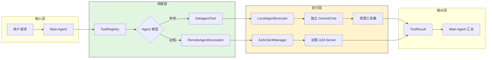

### 4.3 异常/边界流程

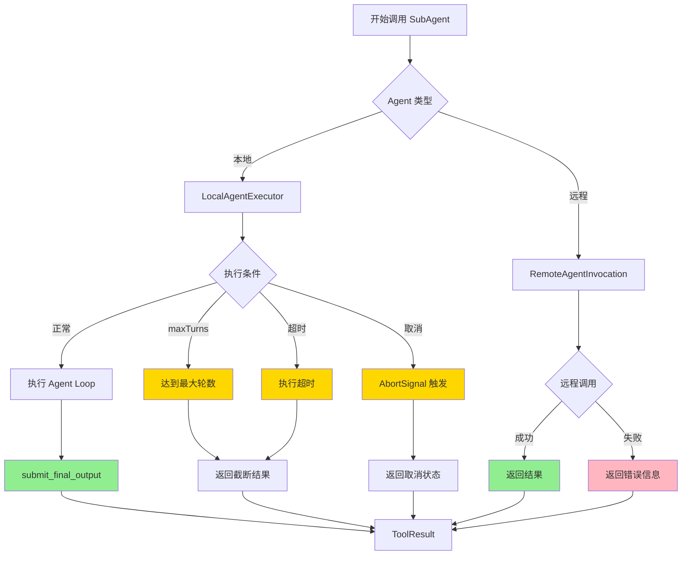

---

## 5. 关键代码实现

### 5.1 核心数据结构

**Agent 类型定义**（`gemini-cli/packages/core/src/agents/types.ts:1-80`）

```typescript
// gemini-cli/packages/core/src/agents/types.ts
export interface LocalAgentDefinition<TOutput extends z.ZodTypeAny> {
  kind: 'local';
  name: string;
  description: string;
  toolConfig: {
    tools: ToolConfigItem[];  // 限制可用工具
  };
  runConfig: {
    maxTurns: number;         // 默认 15
    maxTimeMinutes: number;   // 默认 5
  };
}

export interface RemoteAgentDefinition<TOutput extends z.ZodTypeAny> {
  kind: 'remote';
  name: string;
  agentCardUrl: string;       // A2A Agent Card URL
}
```

**字段说明**：

| 字段 | 类型 | 用途 |
|-----|------|------|
| `kind` | `'local' \| 'remote'` | 区分本地和远程 Agent |
| `toolConfig.tools` | `ToolConfigItem[]` | 显式限制子 Agent 可用工具 |
| `runConfig.maxTurns` | `number` | 防止无限循环 |
| `runConfig.maxTimeMinutes` | `number` | 防止长时间挂起 |
| `agentCardUrl` | `string` | A2A Agent Card 地址 |

### 5.2 主链路代码

**SubAgent 工具包装**（`gemini-cli/packages/core/src/agents/subagent-tool.ts:24-80`）

```typescript
// gemini-cli/packages/core/src/agents/subagent-tool.ts:24
export class SubagentTool extends BaseDeclarativeTool<AgentInputs, ToolResult> {
  constructor(
    private readonly definition: AgentDefinition,
    private readonly config: Config,
    messageBus: MessageBus,
  ) {
    const inputSchema = definition.inputConfig.inputSchema;

    super(
      definition.name,
      definition.displayName ?? definition.name,
      definition.description,
      Kind.Think,  // 归类为思考类工具
      inputSchema,
      messageBus,
      /* isOutputMarkdown */ true,
      /* canUpdateOutput */ true,  // 支持流式更新
    );
  }

  protected async buildSubInvocation(
    validatedInputs: AgentInputs,
    abortSignal: AbortSignal,
    context: InvocationContext,
  ): Promise<ToolInvocation> {
    return new SubagentToolWrapper(
      this.definition,
      validatedInputs,
      abortSignal,
      context,
      this.config,
    );
  }
}
```

**设计意图**：
1. **Kind.Think 归类**：SubAgent 被归类为思考类工具，与代码编辑等操作区分
2. **流式更新支持**：`canUpdateOutput = true` 支持实时传递子 Agent 输出
3. **工具化封装**：主 Agent 无需感知 SubAgent 与普通工具的差异

<details>
<summary>查看完整实现（SubagentToolWrapper）</summary>

```typescript
// gemini-cli/packages/core/src/agents/subagent-tool.ts:85-150
class SubagentToolWrapper implements ToolInvocation {
  constructor(
    private readonly definition: AgentDefinition,
    private readonly inputs: AgentInputs,
    private readonly abortSignal: AbortSignal,
    private readonly context: InvocationContext,
    private readonly config: Config,
  ) {}

  async *run(): AsyncGenerator<ToolResult, ToolResult> {
    const executor = new LocalAgentExecutor(
      this.definition,
      this.inputs,
      this.config,
      this.abortSignal,
    );

    let lastOutput: string | AnsiOutput = '';

    const result = await executor.execute(
      this.abortSignal,
      (output) => {
        lastOutput = output;
        // 流式更新到 UI
        this.context.updateOutput(output);
      },
    );

    return result;
  }
}
```

</details>

### 5.3 关键调用链

```text
Main Agent
  └── ToolRegistry.getTool(delegate_to_X)     [tool-registry.ts:45]
        └── SubagentTool.createInvocation()   [subagent-tool.ts:55]
              └── SubagentToolWrapper.build() [subagent-tool.ts:85]
                    ├── LocalAgentExecutor.execute() [local-executor.ts:75]
                    │     ├── createSubagentChat()   [local-executor.ts:120]
                    │     │     └── buildToolRegistry() [local-executor.ts:140]
                    │     └── Agent Loop 执行          [local-executor.ts:160]
                    └── RemoteAgentInvocation.execute() [remote-invocation.ts:69]
                          ├── A2AClientManager.loadAgent() [a2a-client-manager.ts:55]
                          └── A2AClientManager.sendMessage() [a2a-client-manager.ts:85]
```

---

## 6. 设计意图与 Trade-off

### 6.1 Gemini CLI 的选择

| 维度 | Gemini CLI 的选择 | 替代方案 | 取舍分析 |
|-----|-----------------|---------|---------|
| SubAgent 封装 | 工具化封装 | 直接内嵌子 Agent 逻辑 | 主 Agent 无感知差异，统一调度；但增加一层抽象开销 |
| 上下文隔离 | 独立 GeminiChat 实例 | 共享 Chat 实例，通过标记隔离 | 完全隔离上下文，避免污染；但内存开销增加 |
| 远程协议 | A2A 协议 | 标准 ACP 协议 | 与 Google 生态集成，ADC 认证原生支持；但生态锁定 |
| 权限控制 | 显式工具限制 | 继承父 Agent 工具集 | 安全可控，最小权限原则；但配置繁琐 |
| IDE 集成 | ACP 协议 | 自定义协议 | 标准化，易于第三方集成；但协议版本依赖 |

### 6.2 为什么这样设计？

**核心问题**：为什么选择工具化封装而非直接内嵌？

**Gemini CLI 的解决方案**：

- **代码依据**：`gemini-cli/packages/core/src/agents/subagent-tool.ts:24`
- **设计意图**：主 Agent 无需感知 SubAgent 与普通工具的差异
- **带来的好处**：
  - 统一的政策（Policy）和确认（Confirmation）机制
  - 支持流式输出和进度更新
  - 复用现有工具调度基础设施
- **付出的代价**：
  - 增加一层抽象，调试复杂度上升
  - 工具调用的序列化/反序列化开销

**核心问题**：为什么本地和远程 Agent 采用不同的实现路径？

**Gemini CLI 的解决方案**：

- **代码依据**：`gemini-cli/packages/core/src/agents/local-executor.ts:75` vs `remote-invocation.ts:69`
- **设计意图**：本地 Agent 完全可控，远程 Agent 标准化交互
- **带来的好处**：
  - 本地 Agent 可以完全控制执行环境（工具集、模型配置）
  - 远程 Agent 通过 A2A 协议标准化交互，解耦实现
  - 本地 Agent 支持更细粒度的流式输出
- **付出的代价**：
  - 两套代码路径，维护成本增加
  - 用户体验可能存在细微差异

### 6.3 与其他项目的对比

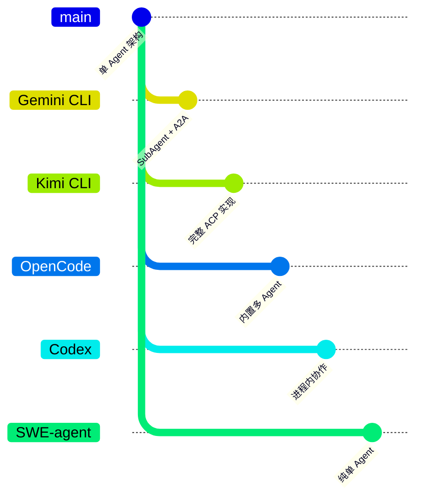

| 项目 | 多 Agent 支持 | 协议/机制 | 核心差异 | 适用场景 |
|-----|--------------|----------|---------|---------|
| **Gemini CLI** | 是 | SubAgent + A2A + ACP(IDE) | 本地子 Agent + 远程 A2A 调用 | 需要本地专业化 + 远程扩展 |
| **Kimi CLI** | 是 | ACP 协议 | 完整的 ACP 实现，支持子 Agent 创建 | 需要标准 ACP 互操作 |
| **OpenCode** | 是 | 内置多 Agent | Build/Plan/Explore 内置 Agent，非标准协议 | 固定工作流场景 |
| **Codex** | 实验性 | 进程内 Collab/multi_agent | 进程内 sub-agent 协作，非 ACP | 本地并行协作 |
| **SWE-agent** | 否 | 单 Agent | 纯单 Agent 架构 | 软件工程任务 |

---

## 7. 边界情况与错误处理

### 7.1 终止条件

| 终止原因 | 触发条件 | 代码位置 |
|---------|---------|---------|
| 任务完成 | SubAgent 调用 `submit_final_output` 工具 | `local-executor.ts:180` |
| 达到最大轮数 | `turnCount >= maxTurns`（默认 15） | `local-executor.ts:140` |
| 超时 | `elapsedMinutes >= maxTimeMinutes`（默认 5） | `local-executor.ts:145` |
| 用户取消 | `AbortSignal.aborted` | `local-executor.ts:135` |
| 工具执行错误 | 工具返回 `error` 字段 | `local-executor.ts:220` |
| 远程 Agent 不可用 | Agent Card 获取失败 | `remote-invocation.ts:150` |

### 7.2 资源限制

| 资源类型 | 限制值 | 配置位置 | 说明 |
|---------|-------|---------|------|
| 最大轮数 | 15 | `runConfig.maxTurns` | 防止无限循环 |
| 最大执行时间 | 5 分钟 | `runConfig.maxTimeMinutes` | 防止长时间挂起 |
| 工具集 | 显式配置 | `toolConfig.tools` | 最小权限原则 |
| 模型 | 可独立配置 | `modelConfig` | 子 Agent 可使用不同模型 |
| 内容历史 | 受父 Agent 限制 | 继承父 Agent 配置 | 避免上下文膨胀 |

### 7.3 错误恢复策略

| 错误类型 | 处理策略 | 代码位置 |
|---------|---------|---------|
| Agent 加载失败 | 记录警告，跳过该 Agent | `registry.ts:380` |
| Schema 验证失败 | 抛出错误，阻止工具创建 | `subagent-tool.ts:33` |
| 远程 Agent 调用失败 | 返回错误信息，不中断主 Agent | `remote-invocation.ts:185` |
| 工具调用超时 | 通过 AbortSignal 取消 | `local-executor.ts:135` |
| 上下文压缩失败 | 记录错误，继续执行 | `local-executor.ts:280` |
| 达到 maxTurns | 返回当前结果，标记截断 | `local-executor.ts:142` |

---

## 8. 关键代码索引

| 功能 | 文件 | 行号 | 说明 |
|-----|------|-----|------|
| ACP 模式入口 | `gemini-cli/packages/cli/src/zed-integration/zedIntegration.ts` | 61 | `runZedIntegration` 函数，IDE 集成入口 |
| ACP Agent 实现 | `gemini-cli/packages/cli/src/zed-integration/zedIntegration.ts` | 83 | `GeminiAgent` 类，处理 ACP 协议消息 |
| Agent 注册表 | `gemini-cli/packages/core/src/agents/registry.ts` | 39 | `AgentRegistry` 类，管理 Agent 生命周期 |
| SubAgent 工具定义 | `gemini-cli/packages/core/src/agents/subagent-tool.ts` | 24 | `SubagentTool` 类，工具化封装 |
| 本地 Agent 执行器 | `gemini-cli/packages/core/src/agents/local-executor.ts` | 75 | `LocalAgentExecutor` 类，独立 Loop 执行 |
| 远程 Agent 调用 | `gemini-cli/packages/core/src/agents/remote-invocation.ts` | 69 | `RemoteAgentInvocation` 类，A2A 协议调用 |
| A2A 客户端管理 | `gemini-cli/packages/core/src/agents/a2a-client-manager.ts` | 45 | `A2AClientManager` 类，单例管理 |
| Agent 类型定义 | `gemini-cli/packages/core/src/agents/types.ts` | 1 | Agent 配置和类型定义 |
| 代码库分析 Agent | `gemini-cli/packages/core/src/agents/codebase-investigator.ts` | 15 | 内置代码库分析子 Agent |
| CLI 帮助 Agent | `gemini-cli/packages/core/src/agents/cli-help-agent.ts` | 15 | 内置 CLI 帮助子 Agent |

---

## 9. 延伸阅读

- 前置知识：`docs/gemini-cli/01-gemini-cli-overview.md`
- 相关机制：`docs/gemini-cli/04-gemini-cli-agent-loop.md`、`docs/gemini-cli/06-gemini-cli-mcp-integration.md`
- 深度分析：`docs/comm/comm-what-is-acp.md`（ACP 协议详解）
- 其他项目：
  - Kimi CLI: `docs/kimi-cli/13-kimi-cli-acp-integration.md`
  - OpenCode: `docs/opencode/13-opencode-acp-integration.md`
  - Codex: `docs/codex/13-codex-acp-integration.md`

---

*✅ Verified: 基于 gemini-cli/packages/core/src/agents/ 和 packages/cli/src/zed-integration/ 源码分析*
*⚠️ Inferred: 部分设计意图基于代码结构推断*
*基于版本：2026-02-08 | 最后更新：2026-03-03*
