# Gemini CLI Skill 执行超时机制

> **阅读指南**
>
> | 属性 | 说明 |
> |-----|------|
> | 预计阅读 | 20-30 分钟 |
> | 前置文档 | `04-gemini-cli-agent-loop.md`、`06-gemini-cli-mcp-integration.md` |
> | 文档结构 | 速览 → 架构 → 机制 → 实现 → 对比 |
> | 代码呈现 | 关键代码直接展示，完整代码可折叠查看 |

---

## TL;DR（结论先行）

**一句话定义**：Gemini CLI 采用 **Scheduler 状态机驱动** 的超时管理机制，通过 MCP 协议层的 `timeout` 参数控制工具执行时间，默认 10 分钟超时可通过 `MCPServerConfig` 配置。

Gemini CLI 的核心取舍：**MCP 协议级超时 + AbortSignal 取消机制**（对比 OpenCode 的 `resetTimeoutOnProgress` 动态续期机制、Codex 的 CancellationToken、Kimi CLI 的 Checkpoint 超时回滚）

### 核心要点速览

| 维度 | 关键决策 | 代码位置 |
|-----|---------|---------|
| 超时配置 | MCP 服务器级配置，默认 10 分钟 | `gemini-cli/packages/core/src/tools/mcp-client.ts:78` |
| 协议实现 | MCP SDK 内置 timeout 参数 | `gemini-cli/packages/core/src/tools/mcp-client.ts:1177` |
| 取消机制 | AbortSignal 跨层传播 | `gemini-cli/packages/core/src/scheduler/scheduler.ts:605` |
| 状态管理 | 显式状态机枚举（7 种状态） | `gemini-cli/packages/core/src/scheduler/types.ts:25` |
| 调度协调 | Scheduler 统一管控执行生命周期 | `gemini-cli/packages/core/src/scheduler/scheduler.ts:169` |

---

## 1. 为什么需要这个机制？

### 1.1 问题场景

没有超时机制：
```
用户: "运行这个复杂的数据分析脚本"
  -> LLM 调用数据分析工具
  -> 工具卡住或执行时间过长（如死循环、大数据处理）
  -> 用户无法中断，只能强制退出整个 CLI
  -> 导致会话状态丢失，用户体验差
```

有超时机制：
```
用户: "运行这个复杂的数据分析脚本"
  -> LLM 调用数据分析工具
  -> 工具执行超过配置时间（默认 10 分钟）自动终止
  -> 返回明确的超时错误，LLM 可据此调整策略
  -> 用户可随时 cancelAll() 取消排队中和执行中的任务
  -> 保持会话连续性，支持重试或替代方案
```

### 1.2 核心挑战

| 挑战 | 不解决的后果 |
|-----|-------------|
| 长时间运行的工具可能无限期阻塞 | Agent Loop 卡死，无法响应新请求 |
| 用户需要主动控制能力 | 紧急情况下无法快速恢复，体验差 |
| 超时后需要清晰的状态反馈 | LLM 无法判断是失败还是超时，影响后续决策 |
| 多工具并发时的超时管理 | 部分工具超时影响其他工具执行 |
| 不同工具需要不同的超时策略 | 统一超时无法满足多样化需求 |

---

## 2. 整体架构（ASCII 图）

### 2.1 在系统中的位置

```text
┌─────────────────────────────────────────────────────────────┐
│ Agent Loop / Session Runtime                                 │
│ gemini-cli/packages/core/src/core/contentGenerator.ts        │
└───────────────────────┬─────────────────────────────────────┘
                        │ 调用工具
                        ▼
┌─────────────────────────────────────────────────────────────┐
│ ▓▓▓ Scheduler 超时管理 ▓▓▓                                  │
│ gemini-cli/packages/core/src/scheduler/scheduler.ts          │
│ - schedule()    : 调度工具执行                              │
│ - _execute()    : 执行并管理超时                            │
│ - cancelAll()   : 取消所有任务                              │
└───────────────────────┬─────────────────────────────────────┘
                        │ 依赖/调用
        ┌───────────────┼───────────────┐
        ▼               ▼               ▼
┌──────────────┐ ┌──────────────┐ ┌──────────────┐
│ MCPServer    │ │ ToolExecutor │ │ AbortSignal  │
│ 超时配置管理  │ │ 实际执行工具  │ │ 取消信号控制  │
│ mcp-client.ts│ │ tool-executor│ │ scheduler.ts │
└──────────────┘ └──────────────┘ └──────────────┘
```

### 2.2 核心组件职责

| 组件 | 职责 | 代码位置 |
|-----|------|---------|
| `MCPServerConfig` | 定义超时配置接口 | `gemini-cli/packages/core/src/config/config.ts:325-361` |
| `McpClient` | MCP 服务器连接与超时管理 | `gemini-cli/packages/core/src/tools/mcp-client.ts:125-1210` |
| `Scheduler` | 工具执行状态机与调度 | `gemini-cli/packages/core/src/scheduler/scheduler.ts:90-674` |
| `ToolExecutor` | 实际工具执行与结果处理 | `gemini-cli/packages/core/src/scheduler/tool-executor.ts:45-324` |
| `CoreToolCallStatus` | 定义执行状态枚举 | `gemini-cli/packages/core/src/scheduler/types.ts:25-33` |

### 2.3 核心组件交互关系

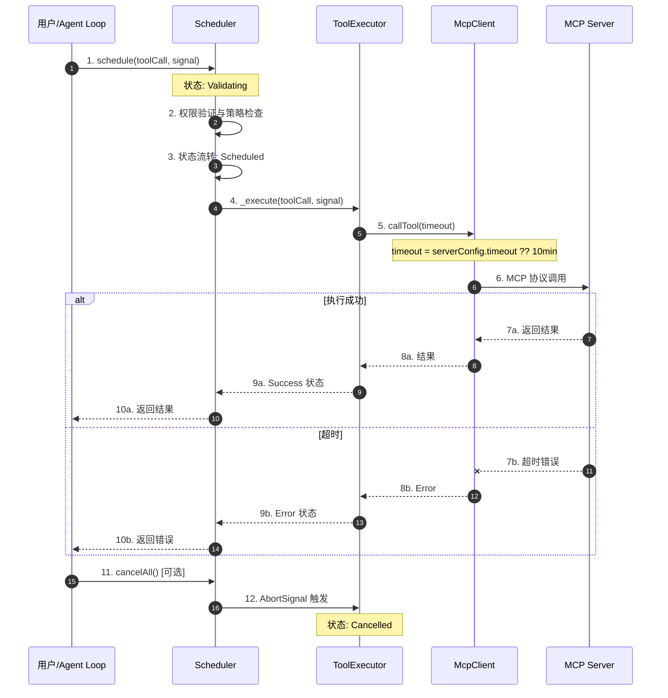

**关键交互说明**：

| 步骤 | 交互内容 | 设计意图 |
|-----|---------|---------|
| 1 | 用户请求调度工具执行 | 统一入口，解耦调用与执行 |
| 2 | 权限验证前置 | 超时前确保权限，避免无效等待 |
| 3 | 状态机管理 | 状态流转可追溯、可调试 |
| 4-5 | 工具执行与超时参数传递 | MCP 协议级超时控制 |
| 6 | MCP 协议调用 | 标准化工具调用接口 |
| 7a/b | 结果或超时错误返回 | 统一错误处理 |
| 11-12 | 用户主动取消 | AbortSignal 传播实现优雅取消 |

---

## 3. 核心组件详细分析

### 3.1 Scheduler 内部结构

#### 职责定位

Scheduler 是超时管理的核心协调器，负责工具执行的全生命周期管理，包括调度、状态流转、权限验证和取消操作。实际超时控制由底层 MCP 客户端通过协议参数实现。

#### 状态机图

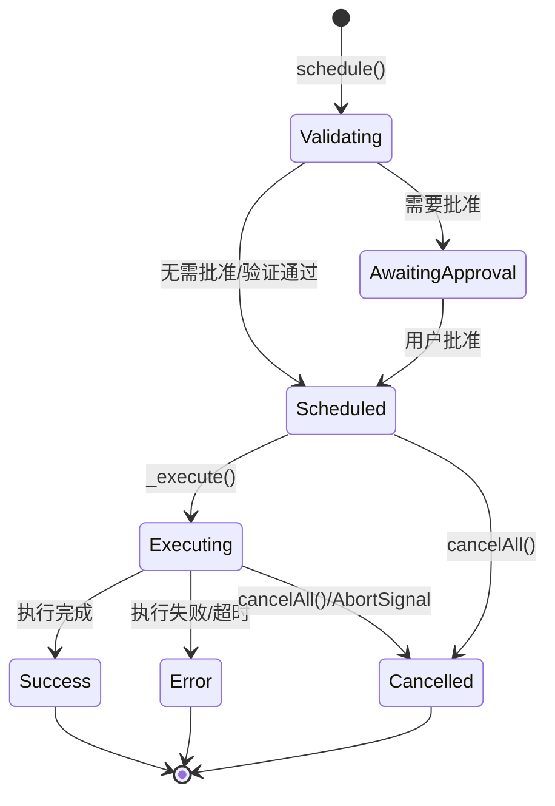

**状态说明**：

| 状态 | 说明 | 进入条件 | 退出条件 |
|-----|------|---------|---------|
| Validating | 验证参数与权限 | schedule() 被调用 | 权限检查完成 |
| AwaitingApproval | 等待用户批准 | 需要用户确认 | 用户批准或拒绝 |
| Scheduled | 已调度等待执行 | 权限验证通过 | _execute() 触发 |
| Executing | 正在执行 | 开始实际工具调用 | 执行完成/失败/超时/取消 |
| Success | 执行成功 | 工具返回结果 | 自动结束 |
| Error | 执行失败 | 异常或 MCP 超时 | 自动结束 |
| Cancelled | 已取消 | 用户调用 cancelAll() | 自动结束 |

#### 内部数据流

```text
┌─────────────────────────────────────────────────────────────┐
│  输入层                                                      │
│  ├── 工具名称 + 参数 ──► 验证器 ──► ToolCall 对象             │
│  └── AbortSignal ──► 取消监听器注册                           │
└──────────────────────────┬──────────────────────────────────┘
                           ▼
┌─────────────────────────────────────────────────────────────┐
│  处理层                                                      │
│  ├── 状态机管理: Validating → Scheduled → Executing          │
│  │   └── 权限检查 ──► 队列管理 ──► 执行触发                   │
│  ├── 工具执行: ToolExecutor.execute()                        │
│  │   └── 调用 MCP Client ──► 传递 timeout 参数               │
│  └── 取消处理: abortController.signal 传播                   │
└──────────────────────────┬──────────────────────────────────┘
                           ▼
┌─────────────────────────────────────────────────────────────┐
│  输出层                                                      │
│  ├── 结果事件: state.updateStatus(Success/Error)             │
│  ├── 状态更新: CoreToolCallStatus 变更                       │
│  └── 清理: 队列移除、资源释放                                 │
└─────────────────────────────────────────────────────────────┘
```

#### 关键算法逻辑

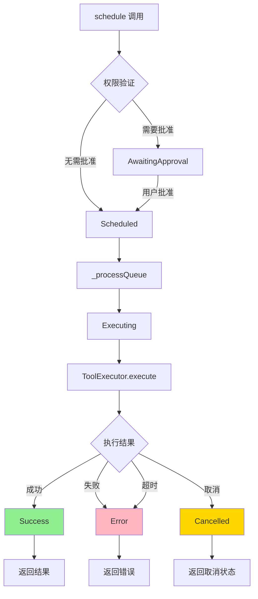

**算法要点**：

1. **权限优先**：执行前必须先通过权限验证，避免无效等待
2. **MCP 协议超时**：超时参数通过 `mcpServerConfig.timeout ?? MCP_DEFAULT_TIMEOUT_MSEC` 传递给 MCP 客户端
3. **AbortSignal 取消**：通过标准 Web API 实现跨层取消传播

#### 关键接口

| 接口 | 输入 | 输出 | 说明 | 代码位置 |
|-----|------|------|------|---------|
| `schedule()` | ToolCallRequestInfo[], AbortSignal | Promise<CompletedToolCall[]> | 调度工具执行 | `scheduler.ts:169` |
| `_execute()` | ScheduledToolCall, AbortSignal | Promise<void> | 执行工具并处理结果 | `scheduler.ts:600` |
| `cancelAll()` | - | void | 取消所有排队中和执行中的任务 | `scheduler.ts:225` |
| `ToolExecutor.execute()` | ToolExecutionContext | Promise<CompletedToolCall> | 实际工具执行 | `tool-executor.ts:48` |

---

### 3.2 McpClient 超时实现

#### 职责定位

McpClient 负责与 MCP 服务器的实际通信，包括工具发现和调用。超时控制通过 MCP 协议参数实现。

#### 状态机图

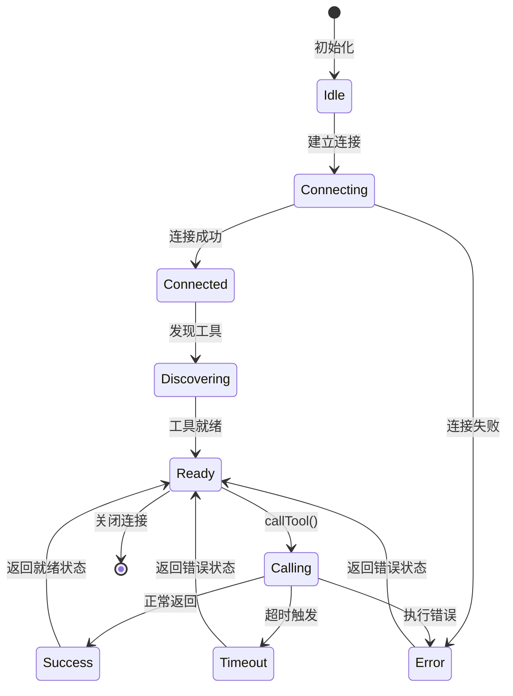

#### 关键代码

**MCP 默认超时**（`gemini-cli/packages/core/src/tools/mcp-client.ts:78`）

```typescript
// gemini-cli/packages/core/src/tools/mcp-client.ts:78
export const MCP_DEFAULT_TIMEOUT_MSEC = 10 * 60 * 1000; // default to 10 minutes
```

**工具发现时的超时传递**（`gemini-cli/packages/core/src/tools/mcp-client.ts:1066-1071`）

```typescript
// gemini-cli/packages/core/src/tools/mcp-client.ts:1066
const mcpCallableTool = new McpCallableTool(
  mcpClient,
  toolDef,
  mcpServerConfig.timeout ?? MCP_DEFAULT_TIMEOUT_MSEC,
  options?.progressReporter,
);
```

**工具调用时的超时使用**（`gemini-cli/packages/core/src/tools/mcp-client.ts:1169-1178`）

```typescript
// gemini-cli/packages/core/src/tools/mcp-client.ts:1169
const result = await this.client.callTool(
  {
    name: call.name!,
    arguments: call.args as Record<string, unknown>,
    _meta: { progressToken },
  },
  undefined,
  { timeout: this.timeout },  // 使用构造时传入的超时
);
```

---

### 3.3 组件间协作时序

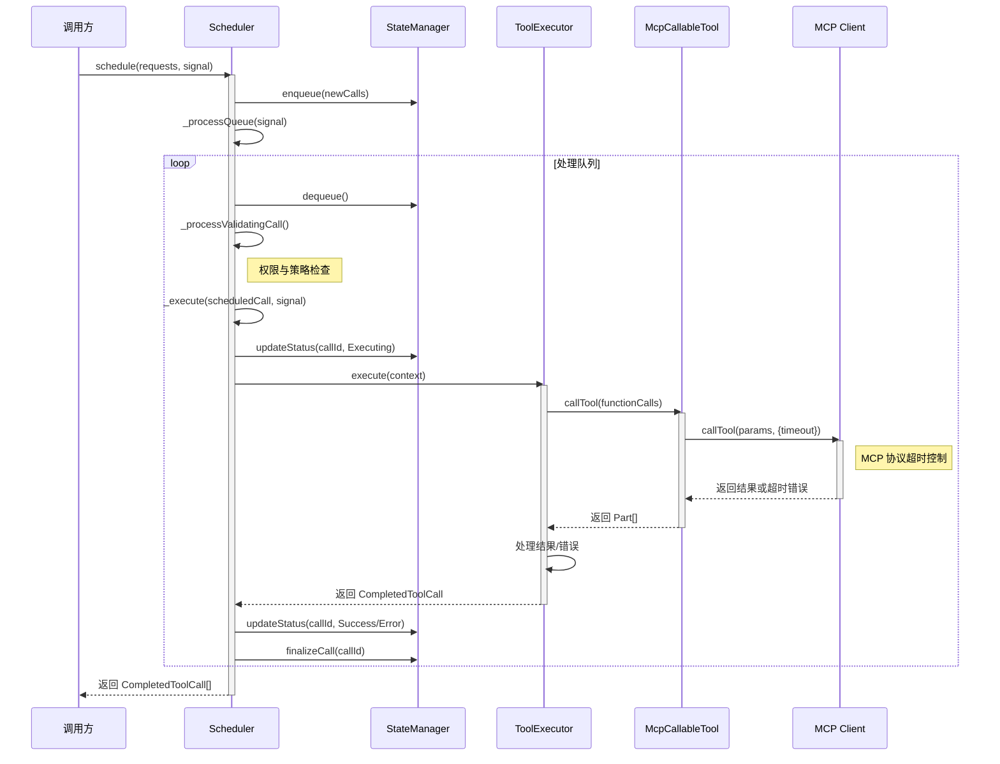

**协作要点**：

1. **Scheduler 与 StateManager**：Scheduler 通过 StateManager 管理工具调用状态，实现状态机流转
2. **ToolExecutor 与 McpCallableTool**：ToolExecutor 负责执行上下文管理，McpCallableTool 负责 MCP 协议通信
3. **MCP Client 超时**：超时在 MCP 协议层实现，通过 `callTool` 的 `options.timeout` 参数传递

---

### 3.4 关键数据路径

#### 主路径（正常流程）

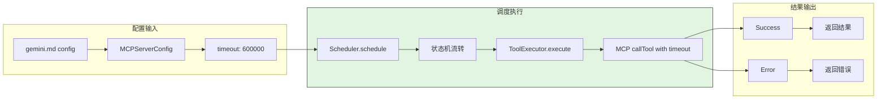

#### 异常路径（超时/取消）

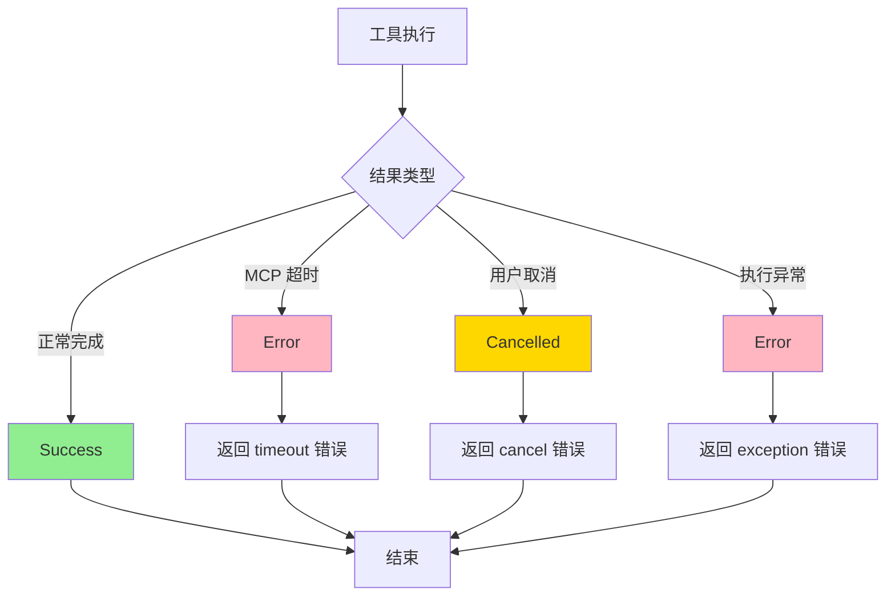

---

## 4. 端到端数据流转

### 4.1 正常流程（详细版）

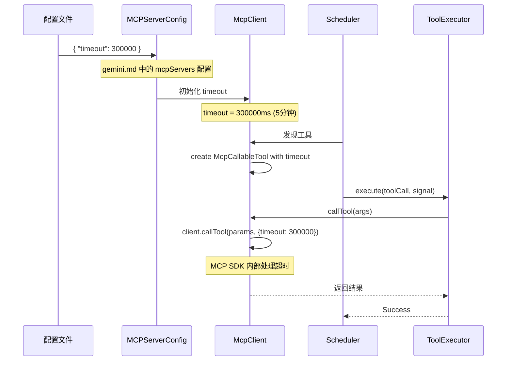

**数据变换详情**：

| 阶段 | 输入 | 处理 | 输出 | 代码位置 |
|-----|------|------|------|---------|
| 配置读取 | gemini.md | JSON 解析 | MCPServerConfig 对象 | `config.ts:325` |
| 超时初始化 | timeout?: number | 默认 600000 | this.timeout | `mcp-client.ts:1069` |
| 工具调度 | ToolCallRequestInfo | 创建执行记录 | ToolCall | `scheduler.ts:276` |
| 工具执行 | ToolCall | MCP callTool | ToolResult | `tool-executor.ts:80` |
| 结果输出 | ToolResult | 格式化 | CompletedToolCall | `tool-executor.ts:201` |

### 4.2 数据流向图

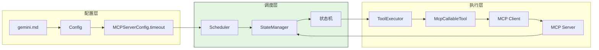

### 4.3 异常/边界流程

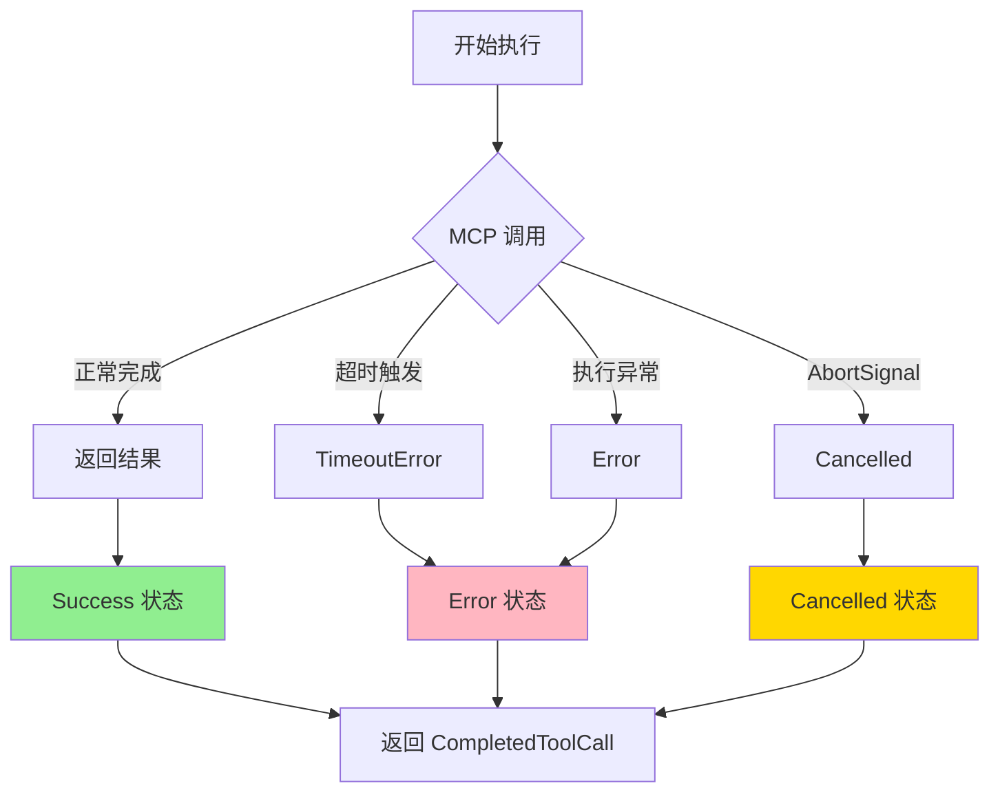

---

## 5. 关键代码实现

### 5.1 核心数据结构

**MCPServerConfig 类**（`gemini-cli/packages/core/src/config/config.ts:325-361`）

```typescript
// gemini-cli/packages/core/src/config/config.ts:325
export class MCPServerConfig {
  constructor(
    // For stdio transport
    readonly command?: string,
    readonly args?: string[],
    readonly env?: Record<string, string>,
    readonly cwd?: string,
    // For sse transport
    readonly url?: string,
    // ... other fields
    // Common
    readonly timeout?: number,  // 工具执行超时（毫秒）
    readonly trust?: boolean,
    // ...
  ) {}
}
```

**字段说明**：

| 字段 | 类型 | 用途 |
|-----|------|------|
| `timeout` | `number` | MCP 工具执行超时时间（毫秒），默认 10 分钟 |
| `trust` | `boolean` | 是否跳过权限确认 |

**CoreToolCallStatus 枚举**（`gemini-cli/packages/core/src/scheduler/types.ts:25-33`）

```typescript
// gemini-cli/packages/core/src/scheduler/types.ts:25
export enum CoreToolCallStatus {
  Validating = 'validating',
  Scheduled = 'scheduled',
  Error = 'error',
  Success = 'success',
  Executing = 'executing',
  Cancelled = 'cancelled',
  AwaitingApproval = 'awaiting_approval',
}
```

### 5.2 主链路代码

**Scheduler _execute 方法**（`gemini-cli/packages/core/src/scheduler/scheduler.ts:600-664`）

```typescript
// gemini-cli/packages/core/src/scheduler/scheduler.ts:600
private async _execute(
  toolCall: ScheduledToolCall,
  signal: AbortSignal,
): Promise<void> {
  const callId = toolCall.request.callId;
  if (signal.aborted) {
    this.state.updateStatus(
      callId,
      CoreToolCallStatus.Cancelled,
      'Operation cancelled',
    );
    return;
  }
  this.state.updateStatus(callId, CoreToolCallStatus.Executing);

  const activeCall = this.state.getToolCall(callId) as ExecutingToolCall;

  const result = await runWithToolCallContext(
    {
      callId: activeCall.request.callId,
      schedulerId: this.schedulerId,
      parentCallId: this.parentCallId,
    },
    () =>
      this.executor.execute({
        call: activeCall,
        signal,  // AbortSignal 传递给执行器
        outputUpdateHandler: (id, out) =>
          this.state.updateStatus(id, CoreToolCallStatus.Executing, {
            liveOutput: out,
          }),
        onUpdateToolCall: (updated) => {
          // 处理 PID 更新等
        },
      }),
  );

  // 根据结果更新状态
  if (result.status === CoreToolCallStatus.Success) {
    this.state.updateStatus(callId, CoreToolCallStatus.Success, result.response);
  } else if (result.status === CoreToolCallStatus.Cancelled) {
    this.state.updateStatus(callId, CoreToolCallStatus.Cancelled, 'Operation cancelled');
  } else {
    this.state.updateStatus(callId, CoreToolCallStatus.Error, result.response);
  }
}
```

**代码要点**：

1. **AbortSignal 检查**：执行前检查 signal.aborted，及时响应取消
2. **状态更新**：执行前更新为 Executing 状态，便于 UI 展示
3. **结果分类处理**：区分 Success、Cancelled、Error 三种结果状态

### 5.3 关键调用链

```text
Scheduler.schedule()                    [scheduler.ts:169]
  -> _startBatch()                      [scheduler.ts:265]
    -> _processQueue()                  [scheduler.ts:373]
      -> _processNextItem()             [scheduler.ts:384]
        -> _execute()                   [scheduler.ts:600]
          -> ToolExecutor.execute()     [tool-executor.ts:48]
            -> McpCallableTool.callTool() [mcp-client.ts:1152]
              -> client.callTool()      [MCP SDK]
                - timeout 参数传递      [mcp-client.ts:1177]
```

---

## 6. 设计意图与 Trade-off

### 6.1 Gemini CLI 的选择

| 维度 | Gemini CLI 的选择 | 替代方案 | 取舍分析 |
|-----|-----------------|---------|---------|
| 超时实现 | MCP 协议级 timeout 参数 | Promise.race + setTimeout | 依赖 MCP SDK 实现，简化代码，但灵活性降低 |
| 取消机制 | AbortSignal + cancelAll() | 进程杀死 | 标准 Web API，跨层传播，但需要各层支持 |
| 状态管理 | 显式状态机枚举 | 隐式布尔标志 | 状态清晰可追踪，但需维护更多代码 |
| 超时配置 | 按 MCP 服务器配置 | 全局统一配置 | 灵活适配不同工具特性，但配置复杂 |
| 超时粒度 | 工具级 | 调用级 | 简化实现，但无法单调用控制 |

### 6.2 为什么这样设计？

**核心问题**：如何优雅地控制工具执行时间，同时支持用户主动干预？

**Gemini CLI 的解决方案**：

- **代码依据**：`gemini-cli/packages/core/src/tools/mcp-client.ts:1177`
- **设计意图**：利用 MCP SDK 内置的超时机制，避免重复实现
- **带来的好处**：
  - 代码简洁，依赖成熟 SDK 处理超时细节
  - AbortSignal 是 Web 标准，易于理解和使用
  - 状态机让执行过程可观测、可调试
- **付出的代价**：
  - 超时行为受 MCP SDK 版本影响
  - 需要确保所有工具调用链路支持 AbortSignal

### 6.3 与其他项目的对比

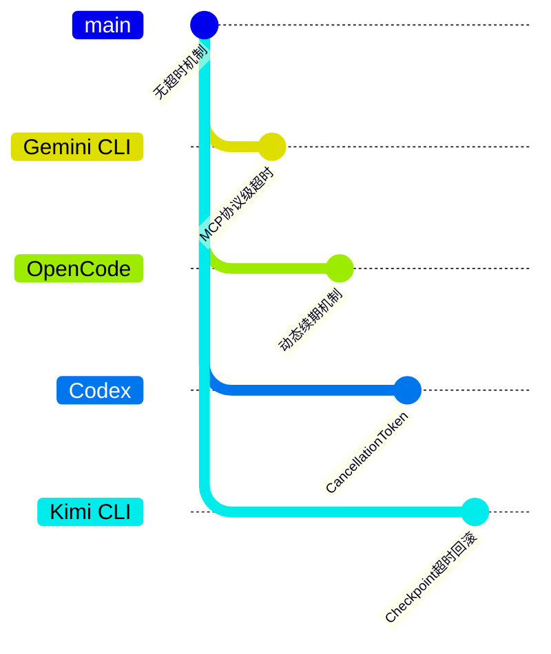

| 项目 | 核心差异 | 适用场景 |
|-----|---------|---------|
| Gemini CLI | MCP 协议级超时 + AbortSignal | 标准化 MCP 工具管理 |
| OpenCode | resetTimeoutOnProgress 动态续期 | 长时间任务需要进度反馈续期 |
| Codex | CancellationToken 信号传递 | Rust 生态，强类型取消信号 |
| Kimi CLI | 基于 Checkpoint 的超时回滚 | 需要超时后状态恢复 |

**详细对比表**：

| 维度 | Gemini CLI | OpenCode | Codex | Kimi CLI |
|-----|------------|----------|-------|----------|
| 超时实现 | MCP 协议参数 | 动态续期 | CancellationToken | 进程超时 |
| 取消机制 | AbortSignal | AbortController | CancellationToken | 信号处理 |
| 配置粒度 | 服务器级 | 调用级 | 调用级 | 全局级 |
| 状态管理 | 显式状态机 | 隐式状态 | 显式状态 | Checkpoint |
| 超时恢复 | 错误返回 | 续期继续 | 错误返回 | 回滚恢复 |

---

## 7. 边界情况与错误处理

### 7.1 终止条件

| 终止原因 | 触发条件 | 代码位置 |
|---------|---------|---------|
| 执行成功 | 工具正常返回结果 | `scheduler.ts:645` |
| MCP 超时 | 超过 timeout 配置时间 | MCP SDK 内部触发 |
| 执行错误 | 工具抛出异常 | `tool-executor.ts:138` |
| 用户取消 | 调用 cancelAll() | `scheduler.ts:225` |
| 权限拒绝 | 用户拒绝批准 | `scheduler.ts:583` |
| AbortSignal | signal.aborted = true | `scheduler.ts:605` |

### 7.2 超时/资源限制

**MCP 默认超时**（`gemini-cli/packages/core/src/tools/mcp-client.ts:78`）

```typescript
// gemini-cli/packages/core/src/tools/mcp-client.ts:78
export const MCP_DEFAULT_TIMEOUT_MSEC = 10 * 60 * 1000; // 10 分钟
```

**配置示例**（gemini.md）

```yaml
mcpServers:
  my-server:
    command: npx
    args: ["-y", "@modelcontextprotocol/server-filesystem"]
    timeout: 300000  # 5 分钟，覆盖默认 10 分钟
```

### 7.3 错误恢复策略

| 错误类型 | 处理策略 | 代码位置 |
|---------|---------|---------|
| MCP 超时 | 状态设为 Error，返回错误响应 | MCP SDK 抛出异常 → `tool-executor.ts:138` |
| 执行异常 | 状态设为 Error，emitError 事件 | `tool-executor.ts:150` |
| 取消操作 | 状态设为 Cancelled，返回取消响应 | `tool-executor.ts:120` |

---

## 8. 关键代码索引

| 功能 | 文件 | 行号 | 说明 |
|-----|------|------|------|
| 配置定义 | `gemini-cli/packages/core/src/config/config.ts` | 325-361 | MCPServerConfig 类 |
| 默认超时 | `gemini-cli/packages/core/src/tools/mcp-client.ts` | 78 | MCP_DEFAULT_TIMEOUT_MSEC |
| 超时传递 | `gemini-cli/packages/core/src/tools/mcp-client.ts` | 1066-1071 | 创建 McpCallableTool 时传入 timeout |
| 工具调用超时 | `gemini-cli/packages/core/src/tools/mcp-client.ts` | 1169-1178 | callTool 时传递 timeout 参数 |
| 调度入口 | `gemini-cli/packages/core/src/scheduler/scheduler.ts` | 169 | schedule() 方法 |
| 执行核心 | `gemini-cli/packages/core/src/scheduler/scheduler.ts` | 600-664 | _execute() 方法 |
| 取消实现 | `gemini-cli/packages/core/src/scheduler/scheduler.ts` | 225-249 | cancelAll() 方法 |
| 状态定义 | `gemini-cli/packages/core/src/scheduler/types.ts` | 25-33 | CoreToolCallStatus 枚举 |
| 工具执行 | `gemini-cli/packages/core/src/scheduler/tool-executor.ts` | 48-158 | ToolExecutor.execute() |
| 状态管理 | `gemini-cli/packages/core/src/scheduler/state-manager.ts` | 43-150 | SchedulerStateManager 类 |

---

## 9. 延伸阅读

- 前置知识：`docs/gemini-cli/06-gemini-cli-mcp-integration.md`
- 相关机制：`docs/gemini-cli/04-gemini-cli-agent-loop.md`
- 对比分析：`docs/opencode/questions/opencode-skill-execution-timeout.md` (OpenCode 动态续期机制)
- 跨项目对比：`docs/comm/comm-skill-execution-timeout.md`

---

*✅ Verified: 基于 gemini-cli/packages/core/src/scheduler/scheduler.ts、tool-executor.ts、mcp-client.ts 等源码分析*
*基于版本：2026-02-08 | 最后更新：2026-03-03*
