# Gemini CLI 上下文压缩机制

## TL;DR（结论先行）

**一句话定义**：Context Compaction 是 AI Coding Agent 解决上下文窗口超限的核心机制，通过将历史消息压缩为摘要（state_snapshot）来释放 token 预算。

Gemini CLI 的核心取舍：**三阶段压缩流程（工具输出截断 + 摘要生成 + 自我验证）**（对比 Kimi CLI 的强制保留最近 N 条、Codex 的单次生成无验证）

---

## 1. 为什么需要这个机制？

### 1.1 问题场景

没有 Context Compaction：
```
用户: "分析这个大型项目并修复 bug"
  -> LLM 调用工具读取文件（产生大量输出）
  -> Token 数迅速达到 128K 上限
  -> 后续无法继续对话，任务中断
```

有 Context Compaction：
```
用户: "分析这个大型项目并修复 bug"
  -> LLM 调用工具读取文件
  -> Token 接近上限，触发压缩
  -> 历史消息被摘要替换，释放预算
  -> 任务继续完成
```

### 1.2 核心挑战

| 挑战 | 不解决的后果 |
|-----|-------------|
| Token 上限硬性限制 | 长对话无法完成，任务中断 |
| 压缩可能丢失关键信息 | 丢失用户原始需求或技术决策 |
| 工具输出过大 | 单次工具调用挤占全部上下文空间 |
| 压缩时机选择 | 过早压缩浪费上下文，过晚导致失败 |

---

## 2. 整体架构

### 2.1 在系统中的位置

```text
┌─────────────────────────────────────────────────────────────┐
│ Agent Loop / GeminiClient                                    │
│ gemini-cli/packages/core/src/core/client.ts:1045             │
└───────────────────────┬─────────────────────────────────────┘
                        │ 调用 tryCompressChat()
                        ▼
┌─────────────────────────────────────────────────────────────┐
│ ▓▓▓ Context Compaction ▓▓▓                                  │
│ gemini-cli/packages/core/src/services/                       │
│   chatCompressionService.ts                                  │
│ - compress(): 主入口（第 232 行）                           │
│ - truncateHistoryToBudget(): 工具输出截断（第 132 行）      │
│ - findCompressSplitPoint(): 分割点选择（第 59 行）          │
│                                                              │
│ gemini-cli/packages/core/src/core/turn.ts                    │
│ - CompressionStatus: 压缩状态枚举（第 168 行）               │
│ - ChatCompressionInfo: 压缩信息接口（第 188 行）             │
└───────────────────────┬─────────────────────────────────────┘
                        │ 依赖/调用
        ┌───────────────┼───────────────┐
        ▼               ▼               ▼
┌──────────────┐ ┌──────────────┐ ┌──────────────┐
│ LLM API      │ │ Token Counter│ │ GeminiChat   │
│ Gemini API   │ │ estimateToken│ │ 消息历史管理 │
│              │ │ CountSync    │ │              │
└──────────────┘ └──────────────┘ └──────────────┘
```

### 2.2 核心组件职责

| 组件 | 职责 | 代码位置 |
|-----|------|---------|
| `ChatCompressionService` | 压缩服务主类，协调完整压缩流程 | `gemini-cli/packages/core/src/services/chatCompressionService.ts:231` ✅ Verified |
| `compress()` | 核心压缩方法，执行三阶段流程 | `gemini-cli/packages/core/src/services/chatCompressionService.ts:232` ✅ Verified |
| `truncateHistoryToBudget()` | 反向遍历截断工具输出 | `gemini-cli/packages/core/src/services/chatCompressionService.ts:132` ✅ Verified |
| `findCompressSplitPoint()` | 基于字符数选择分割点 | `gemini-cli/packages/core/src/services/chatCompressionService.ts:59` ✅ Verified |
| `CompressionStatus` | 压缩结果状态枚举 | `gemini-cli/packages/core/src/core/turn.ts:168` ✅ Verified |
| `ChatCompressionInfo` | 压缩信息数据结构 | `gemini-cli/packages/core/src/core/turn.ts:188` ✅ Verified |

### 2.3 核心组件交互关系

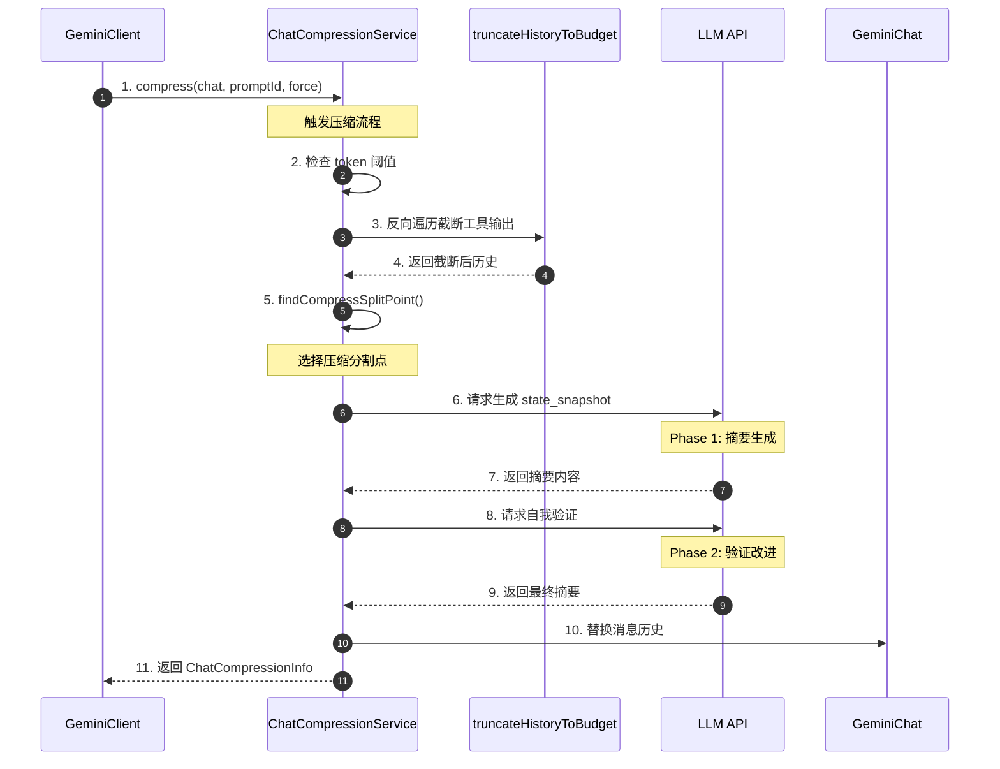

**关键交互说明**：

| 步骤 | 交互内容 | 设计意图 |
|-----|---------|---------|
| 1 | Client 调用 compress 方法 | 解耦触发与执行，支持强制/自动触发 |
| 2 | 检查 token 阈值 | 避免不必要的压缩开销 |
| 3-4 | 工具输出截断 | 优先处理大工具输出，释放空间 |
| 5 | 智能选择分割点 | 避免在 functionCall 中间分割 |
| 6-7 | 生成 state_snapshot | 使用 LLM 理解并压缩历史信息 |
| 8-9 | 自我验证改进 | 确保关键信息不丢失 |
| 10 | 替换消息历史 | 原子性更新对话状态 |

---

## 3. 核心组件详细分析

### 3.1 ChatCompressionService 内部结构

#### 职责定位

一句话说明：协调上下文压缩的完整生命周期，包括工具输出截断、分割点选择、摘要生成、自我验证和结果应用。

#### 状态机图

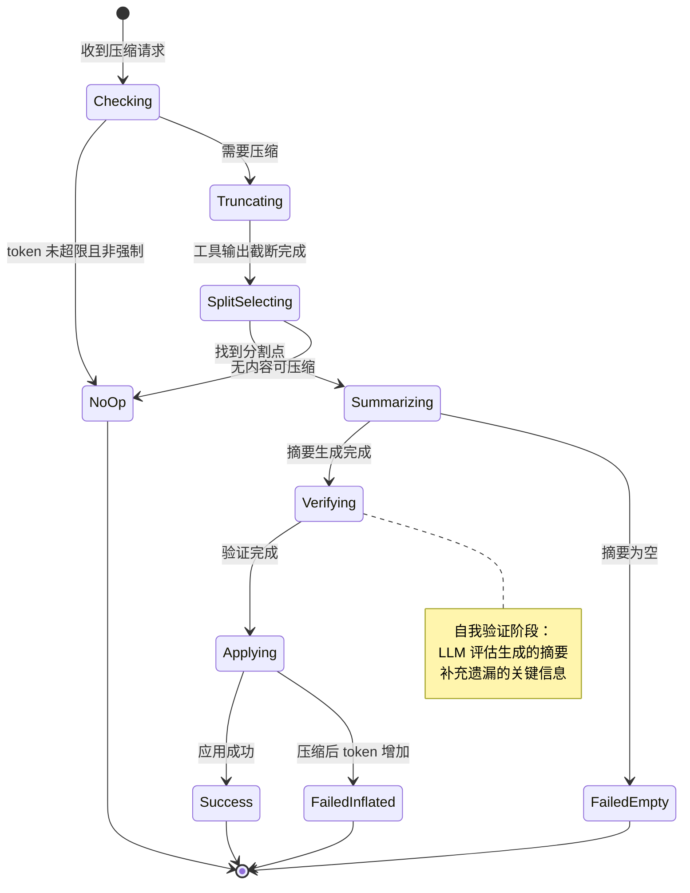

**状态说明**：

| 状态 | 说明 | 进入条件 | 代码位置 |
|-----|------|---------|---------|
| Checking | 检查是否需要压缩 | 收到压缩请求 | `chatCompressionService.ts:263` |
| NoOp | 无需压缩 | token 未超限 | `chatCompressionService.ts:273` |
| Truncating | 工具输出截断 | 需要压缩 | `chatCompressionService.ts:281` |
| SplitSelecting | 选择分割点 | 截断完成 | `chatCompressionService.ts:315` |
| Summarizing | 生成摘要 | 分割点确定 | `chatCompressionService.ts:353` |
| Verifying | 自我验证 | 摘要生成完成 | `chatCompressionService.ts:376` |
| Applying | 应用压缩 | 验证完成 | `chatCompressionService.ts:423` |
| Success | 压缩成功 | token 减少 | `chatCompressionService.ts:463` |
| FailedInflated | 压缩失败 | token 增加 | `chatCompressionService.ts:452` |
| FailedEmpty | 摘要为空 | 生成失败 | `chatCompressionService.ts:405` |

#### 内部数据流

```text
┌─────────────────────────────────────────────────────────────┐
│  输入层                                                      │
│  ├── 消息历史 ──► Token 估算 ──► 当前 token 数               │
│  └── 配置参数 ──► 阈值检查 ──► 是否强制压缩                  │
└──────────────────────────┬──────────────────────────────────┘
                           ▼
┌─────────────────────────────────────────────────────────────┐
│  处理层                                                      │
│  ├── 阶段1: 工具输出截断 (truncateHistoryToBudget)           │
│  │   └── 反向遍历 ──► 预算检查 ──► 大输出截断                │
│  ├── 阶段2: 分割点选择 (findCompressSplitPoint)              │
│  │   └── 字符计数 ──► 阈值计算 ──► 避开 functionCall         │
│  ├── 阶段3: 摘要生成 (LLM 调用)                              │
│  │   └── 生成 state_snapshot                                 │
│  └── 阶段4: 自我验证 (LLM 调用)                              │
│      └── 评估摘要 ──► 补充遗漏信息                           │
└──────────────────────────┬──────────────────────────────────┘
                           ▼
┌─────────────────────────────────────────────────────────────┐
│  输出层                                                      │
│  ├── 压缩后消息列表 (包含 state_snapshot)                    │
│  ├── ChatCompressionInfo 统计信息                            │
│  └── CompressionStatus 状态码                                │
└─────────────────────────────────────────────────────────────┘
```

#### 关键算法逻辑

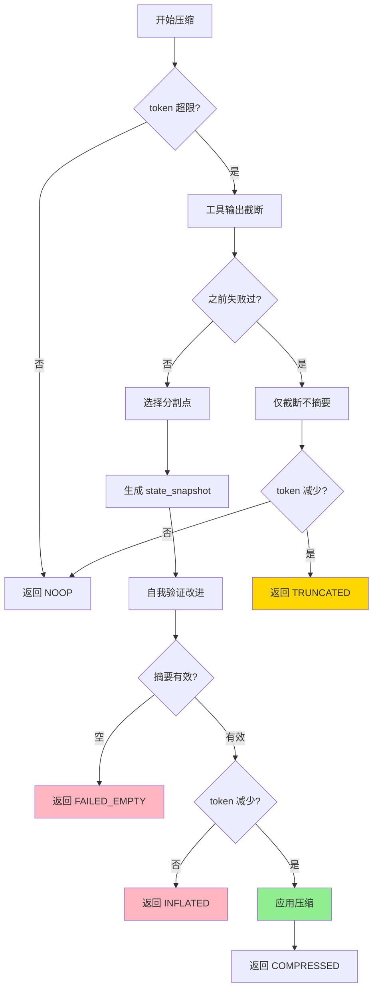

**算法要点**：

1. **三阶段设计**：工具截断 → 摘要生成 → 自我验证，确保压缩质量
2. **失败安全**：压缩后 token 增加时自动放弃，避免劣化
3. **渐进降级**：之前失败过则仅做截断，避免重复失败

---

### 3.2 工具输出截断（Reverse Token Budget）内部结构

#### 职责定位

一句话说明：从最新消息反向遍历，优先保留近期工具输出，截断超出预算的历史大输出。

#### 关键算法逻辑

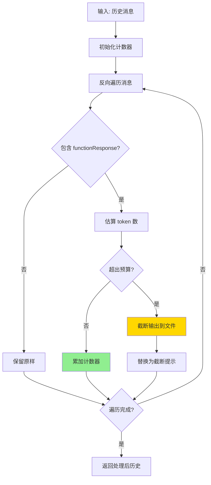

**算法要点**：

1. **反向遍历**：从最新消息开始，确保最近上下文优先保留
2. **独立预算**：`COMPRESSION_FUNCTION_RESPONSE_TOKEN_BUDGET = 50000`，专门用于工具输出
3. **文件截断**：大输出保存到临时文件，替换为提示信息

#### 关键代码

```typescript
// gemini-cli/packages/core/src/services/chatCompressionService.ts:132-229
async function truncateHistoryToBudget(
  history: Content[],
  config: Config,
): Promise<Content[]> {
  let functionResponseTokenCounter = 0;
  const truncatedHistory: Content[] = [];

  // Iterate backwards: newest messages first
  for (let i = history.length - 1; i >= 0; i--) {
    const content = history[i];
    // ... 处理每个消息的工具输出
    if (functionResponseTokenCounter + tokens > COMPRESSION_FUNCTION_RESPONSE_TOKEN_BUDGET) {
      // 截断并保存到文件
      const { outputFile } = await saveTruncatedToolOutput(...);
      // 替换为截断提示
    }
  }
  return truncatedHistory;
}
```

---

### 3.3 组件间协作时序

展示完整压缩流程的组件协作：

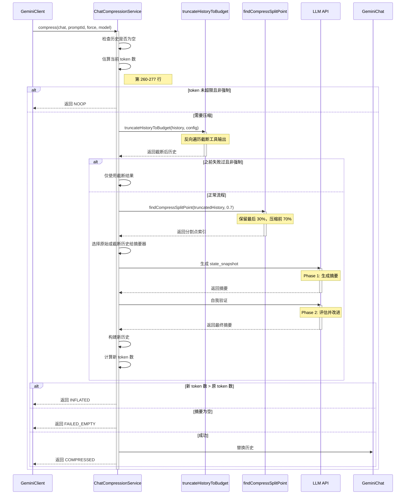

**协作要点**：

1. **Client 与 Service**：Client 负责决策何时压缩，Service 负责执行压缩
2. **截断与摘要**：先截断工具输出释放空间，再生成摘要进一步压缩
3. **两次 LLM 调用**：生成摘要 + 自我验证，确保质量

---

### 3.4 关键数据路径

#### 主路径（正常流程）

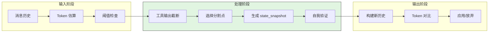

#### 异常路径（错误恢复）

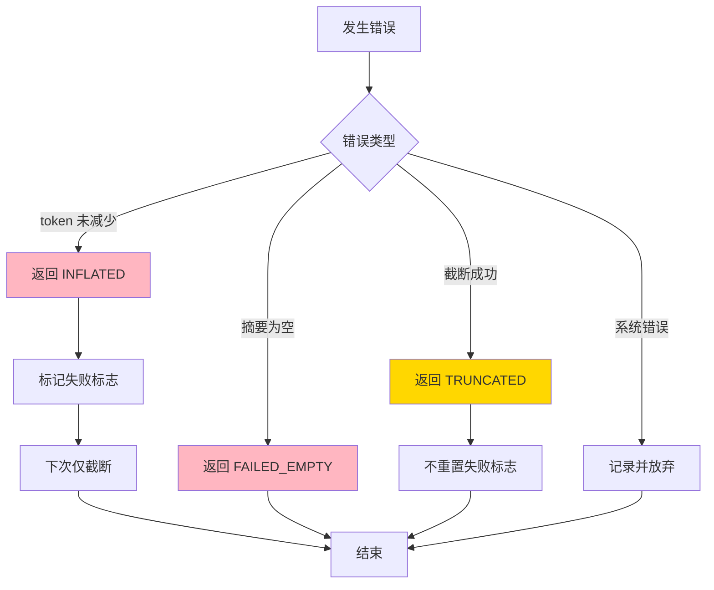

---

## 4. 端到端数据流转

### 4.1 正常流程（详细版）

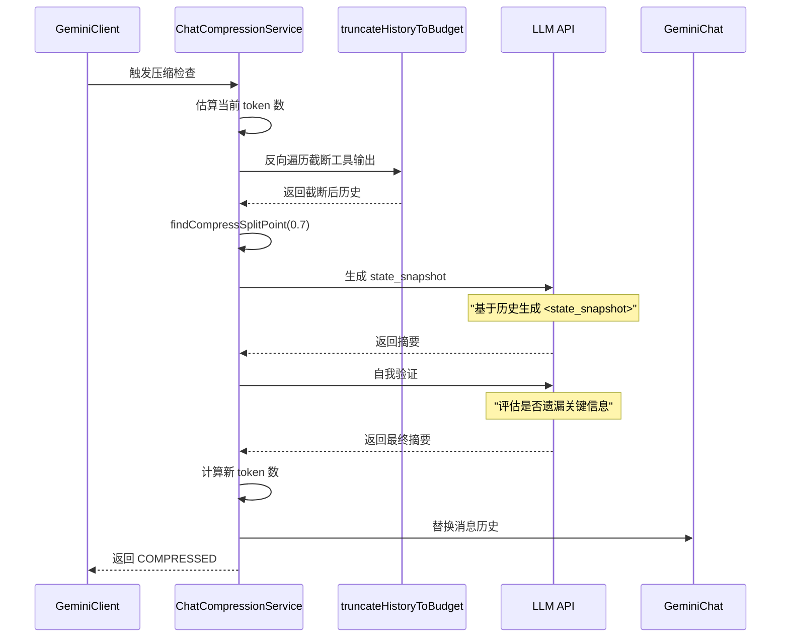

**数据变换详情**：

| 阶段 | 输入 | 处理 | 输出 | 代码位置 |
|-----|------|------|------|---------|
| 检查 | 消息列表 + 配置 | Token 估算 + 阈值检查 | 是否需要压缩 | `chatCompressionService.ts:263-277` ✅ Verified |
| 截断 | 历史消息 | 反向遍历 + 预算检查 | 截断后历史 | `chatCompressionService.ts:281-284` ✅ Verified |
| 分割 | 消息列表 | 字符计数 + 避开 functionCall | 分割点索引 | `chatCompressionService.ts:315-318` ✅ Verified |
| 摘要 | 待压缩消息 | LLM 生成 state_snapshot | 摘要文本 | `chatCompressionService.ts:353-372` ✅ Verified |
| 验证 | 原文 + 摘要 | LLM 自我评估 | 最终摘要 | `chatCompressionService.ts:376-403` ✅ Verified |
| 应用 | 验证通过的摘要 | 构建新历史 + 替换 | 压缩结果 | `chatCompressionService.ts:423-471` ✅ Verified |

### 4.2 数据流向图

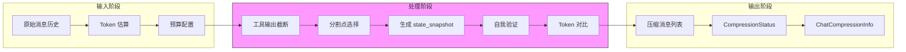

### 4.3 异常/边界流程

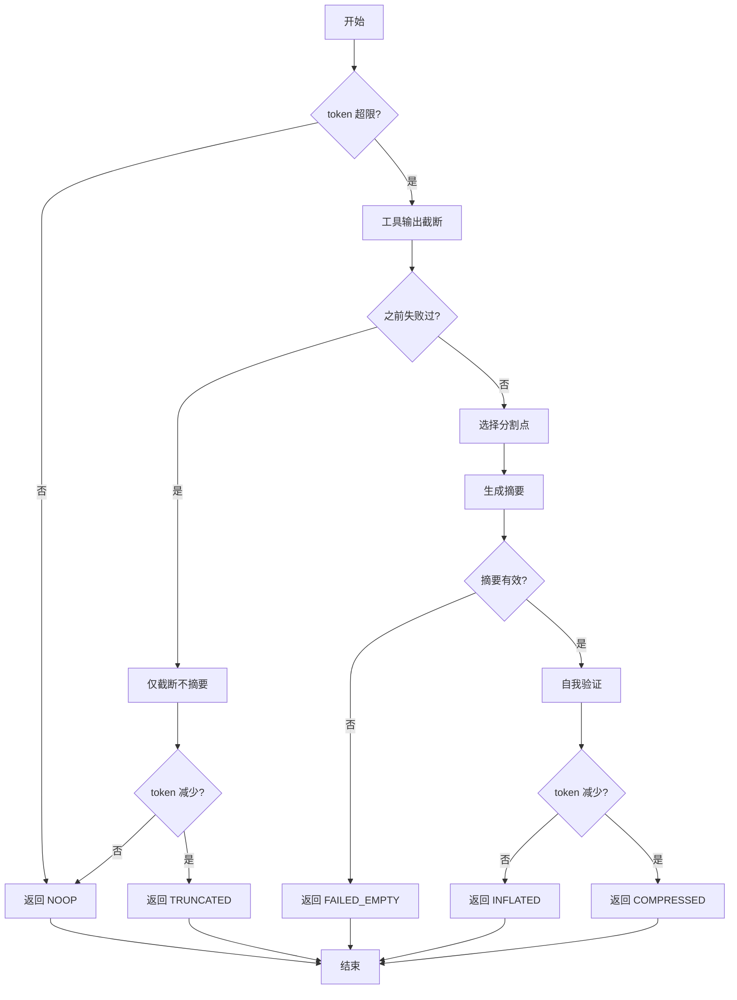

---

## 5. 关键代码实现

### 5.1 核心数据结构

```typescript
// gemini-cli/packages/core/src/core/turn.ts:168-192
export enum CompressionStatus {
  /** The compression was successful */
  COMPRESSED = 1,

  /** The compression failed due to the compression inflating the token count */
  COMPRESSION_FAILED_INFLATED_TOKEN_COUNT,

  /** The compression failed due to an error counting tokens */
  COMPRESSION_FAILED_TOKEN_COUNT_ERROR,

  /** The compression failed because the summary was empty */
  COMPRESSION_FAILED_EMPTY_SUMMARY,

  /** The compression was not necessary and no action was taken */
  NOOP,

  /** The compression was skipped due to previous failure, but content was truncated to budget */
  CONTENT_TRUNCATED,
}

export interface ChatCompressionInfo {
  originalTokenCount: number;
  newTokenCount: number;
  compressionStatus: CompressionStatus;
}
```

**字段说明**：

| 字段 | 类型 | 用途 |
|-----|------|------|
| `COMPRESSED` | `enum` | 压缩成功 |
| `COMPRESSION_FAILED_INFLATED_TOKEN_COUNT` | `enum` | 压缩后 token 增加，失败 |
| `COMPRESSION_FAILED_EMPTY_SUMMARY` | `enum` | 摘要为空，失败 |
| `NOOP` | `enum` | 无需压缩 |
| `CONTENT_TRUNCATED` | `enum` | 仅截断工具输出 |
| `originalTokenCount` | `number` | 原始 token 数 |
| `newTokenCount` | `number` | 压缩后 token 数 |
| `compressionStatus` | `CompressionStatus` | 压缩状态 |

### 5.2 主链路代码

```typescript
// gemini-cli/packages/core/src/services/chatCompressionService.ts:232-280
async compress(
  chat: GeminiChat,
  promptId: string,
  force: boolean,
  model: string,
  config: Config,
  hasFailedCompressionAttempt: boolean,
  abortSignal?: AbortSignal,
): Promise<{ newHistory: Content[] | null; info: ChatCompressionInfo }> {
  const curatedHistory = chat.getHistory(true);

  // 1. 历史为空检查
  if (curatedHistory.length === 0) {
    return {
      newHistory: null,
      info: {
        originalTokenCount: 0,
        newTokenCount: 0,
        compressionStatus: CompressionStatus.NOOP,
      },
    };
  }

  const originalTokenCount = chat.getLastPromptTokenCount();

  // 2. 阈值检查（非强制模式）
  if (!force) {
    const threshold = await config.getCompressionThreshold() ?? DEFAULT_COMPRESSION_TOKEN_THRESHOLD;
    if (originalTokenCount < threshold * tokenLimit(model)) {
      return {
        newHistory: null,
        info: { originalTokenCount, newTokenCount: originalTokenCount, compressionStatus: CompressionStatus.NOOP },
      };
    }
  }

  // 3. 工具输出截断
  const truncatedHistory = await truncateHistoryToBudget(curatedHistory, config);

  // ... 后续摘要生成和验证
}
```

**代码要点**：

1. **阈值前置检查**：避免不必要的压缩开销，默认阈值 50%
2. **渐进降级**：`hasFailedCompressionAttempt` 控制是否仅做截断
3. **工具优先截断**：先处理大工具输出，再考虑摘要生成

### 5.3 关键调用链

```text
GeminiClient.tryCompressChat()     [client.ts:1045]
  -> ChatCompressionService.compress()   [chatCompressionService.ts:232]
    -> truncateHistoryToBudget()         [chatCompressionService.ts:132]
      - 反向遍历历史
      - 检查 COMPRESSION_FUNCTION_RESPONSE_TOKEN_BUDGET
      - saveTruncatedToolOutput() 大输出保存到文件
    -> findCompressSplitPoint()          [chatCompressionService.ts:59]
      - 基于字符数计算分割点
      - 避开 functionCall 位置
    -> config.getBaseLlmClient().generateContent()  [chatCompressionService.ts:353]
      - 生成 state_snapshot
    -> config.getBaseLlmClient().generateContent()  [chatCompressionService.ts:376]
      - 自我验证改进
    -> calculateRequestTokenCount()      [第 438 行]
      - 对比压缩前后 token 数
```

---

## 6. 设计意图与 Trade-off

### 6.1 Gemini CLI 的选择

| 维度 | Gemini CLI 的选择 | 替代方案 | 取舍分析 |
|-----|------------------|---------|---------|
| 验证机制 | 自我验证（两次 LLM 调用） | 单次生成（Codex） | 质量更高但成本翻倍 |
| 预算策略 | Reverse Token Budget + 独立工具预算 | 保留最近 N 条（Kimi） | 更灵活但计算复杂 |
| 失败处理 | 放弃压缩（INFLATED） | 强制压缩（Kimi） | 安全保守但可能中断 |
| 降级策略 | 截断后仅截断不摘要 | 无降级 | 避免重复失败但效果有限 |
| 分割策略 | 基于字符数 + 避开 functionCall | 固定比例 | 质量更高但计算开销 |

### 6.2 为什么这样设计？

**核心问题**：如何在压缩上下文的同时保证不丢失关键信息？

**Gemini CLI 的解决方案**：

- 代码依据：`gemini-cli/packages/core/src/services/chatCompressionService.ts:376-403`
- 设计意图：通过两次 LLM 调用（生成 + 验证）确保压缩质量
- 带来的好处：
  - 质量保证：自我验证机制确保关键信息不丢失
  - 失败安全：压缩后 token 增加时自动放弃
  - 工具友好：独立预算避免工具输出挤占空间
  - 渐进降级：失败后仅做截断，避免重复失败
- 付出的代价：
  - 双重成本：两次 LLM 调用增加开销
  - 延迟增加：验证步骤增加总耗时
  - 配置复杂：多预算参数需要调优

### 6.3 与其他项目的对比

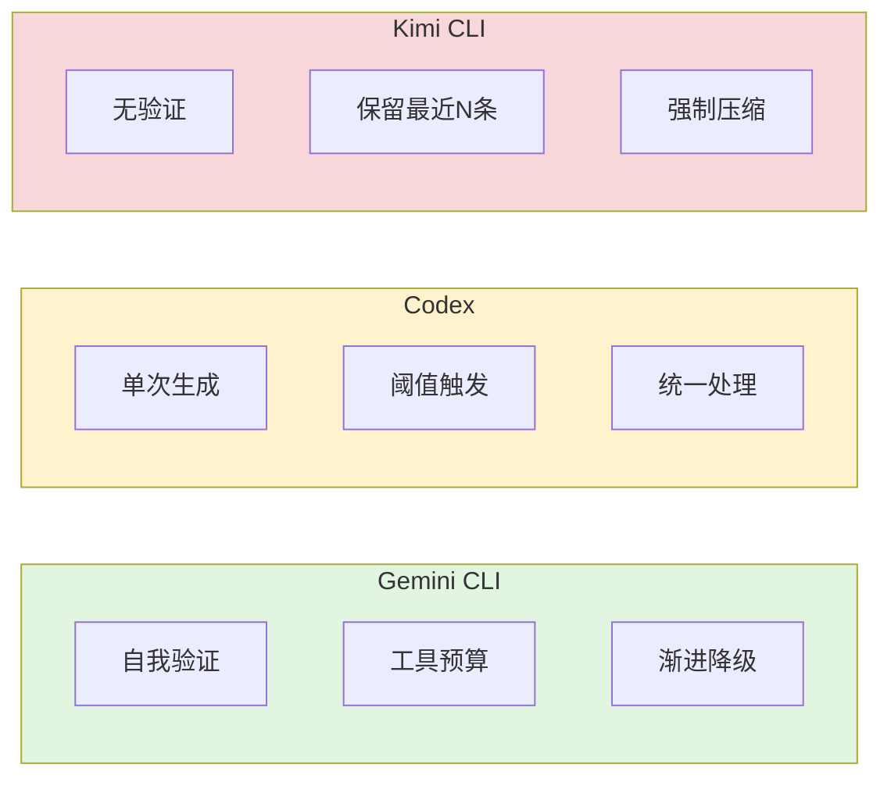

| 项目 | 核心差异 | 适用场景 |
|-----|---------|---------|
| Gemini CLI | 自我验证 + 工具独立预算 + 渐进降级 | 高质量要求、工具调用频繁、长对话 |
| Codex | 单次生成 + 渐进截断 | 成本敏感、快速响应 |
| Kimi CLI | 强制保留最近 N 条 + 无验证 | 简单场景、确定性需求 |

---

## 7. 边界情况与错误处理

### 7.1 终止条件

| 终止原因 | 触发条件 | 代码位置 |
|---------|---------|---------|
| Token 正常 | 当前 token 数低于阈值 | `chatCompressionService.ts:267` ✅ Verified |
| 历史为空 | 没有消息需要压缩 | `chatCompressionService.ts:244` ✅ Verified |
| 压缩无效 | 压缩后 token 数未减少 | `chatCompressionService.ts:452` ✅ Verified |
| 摘要为空 | LLM 返回空摘要 | `chatCompressionService.ts:405` ✅ Verified |
| 无内容可压缩 | 分割点为 0 | `chatCompressionService.ts:323` ✅ Verified |

### 7.2 超时/资源限制

```typescript
// gemini-cli/packages/core/src/services/chatCompressionService.ts:40-51
const DEFAULT_COMPRESSION_TOKEN_THRESHOLD = 0.5;  // 默认阈值 50%
const COMPRESSION_PRESERVE_THRESHOLD = 0.3;       // 保留最后 30%
const COMPRESSION_FUNCTION_RESPONSE_TOKEN_BUDGET = 50_000;  // 工具输出预算
```

### 7.3 错误恢复策略

| 错误类型 | 处理策略 | 代码位置 |
|---------|---------|---------|
| 压缩后 token 增加 | 返回 INFLATED，标记失败标志 | `chatCompressionService.ts:452-462` ✅ Verified |
| 摘要为空 | 返回 FAILED_EMPTY | `chatCompressionService.ts:405-421` ✅ Verified |
| 之前失败过 | 仅截断不摘要，避免重复失败 | `chatCompressionService.ts:288-313` ✅ Verified |
| 截断后 token 减少 | 返回 TRUNCATED | `chatCompressionService.ts:294-302` ✅ Verified |

---

## 8. 关键代码索引

| 功能 | 文件 | 行号 | 说明 |
|-----|------|------|------|
| 入口 | `gemini-cli/packages/core/src/core/client.ts` | 1045 | tryCompressChat 方法入口 |
| 核心 | `gemini-cli/packages/core/src/services/chatCompressionService.ts` | 232 | compress 方法主入口 |
| 截断 | `gemini-cli/packages/core/src/services/chatCompressionService.ts` | 132 | truncateHistoryToBudget 函数 |
| 分割 | `gemini-cli/packages/core/src/services/chatCompressionService.ts` | 59 | findCompressSplitPoint 函数 |
| 生成 | `gemini-cli/packages/core/src/services/chatCompressionService.ts` | 353 | 生成 state_snapshot |
| 验证 | `gemini-cli/packages/core/src/services/chatCompressionService.ts` | 376 | 自我验证阶段 |
| 状态 | `gemini-cli/packages/core/src/core/turn.ts` | 168 | CompressionStatus 枚举 |
| 信息 | `gemini-cli/packages/core/src/core/turn.ts` | 188 | ChatCompressionInfo 接口 |
| 配置 | `gemini-cli/packages/core/src/services/chatCompressionService.ts` | 40 | 压缩配置常量 |

---

## 9. 延伸阅读

- 前置知识：`docs/gemini-cli/07-gemini-cli-memory-context.md`
- 相关机制：`docs/gemini-cli/04-gemini-cli-agent-loop.md`
- 深度分析：`docs/comm/comm-context-compaction.md`（跨项目对比）
- 其他项目：
  - Kimi CLI: `docs/kimi-cli/questions/kimi-cli-context-compaction.md`
  - Codex: `docs/codex/questions/codex-context-compaction.md`

---

*✅ Verified: 基于 gemini-cli/packages/core/src/services/chatCompressionService.ts 等源码分析*
*⚠️ Inferred: 部分实现细节基于代码结构推断*
*基于版本：2026-02-08 | 最后更新：2026-02-25*
