# Gemini CLI 上下文压缩机制

## TL;DR（结论先行）

**一句话定义**：Context Compaction 是 AI Coding Agent 解决上下文窗口超限的核心机制，通过将历史消息压缩为摘要来释放 token 预算。

Gemini CLI 的核心取舍：**两阶段验证压缩 + Reverse Token Budget 策略**（对比 Kimi CLI 的强制保留最近 N 条、Codex 的单次生成无验证）

---

## 1. 为什么需要这个机制？

### 1.1 问题场景

没有 Context Compaction：
```
用户: "分析这个大型项目并修复 bug"
  → LLM 调用工具读取文件（产生大量输出）
  → Token 数迅速达到 128K 上限
  → 后续无法继续对话，任务中断
```

有 Context Compaction：
```
用户: "分析这个大型项目并修复 bug"
  → LLM 调用工具读取文件
  → Token 接近上限，触发压缩
  → 历史消息被摘要替换，释放预算
  → 任务继续完成
```

### 1.2 核心挑战

| 挑战 | 不解决的后果 |
|-----|-------------|
| Token 上限硬性限制 | 长对话无法完成，任务中断 |
| 压缩可能丢失关键信息 | 丢失用户原始需求或技术决策 |
| 工具输出过大 | 单次工具调用挤占全部上下文空间 |
| 压缩时机选择 | 过早压缩浪费上下文，过晚导致失败 |

---

## 2. 整体架构

### 2.1 在系统中的位置

```text
┌─────────────────────────────────────────────────────────────┐
│ Agent Loop / Session Runtime                                 │
│ gemini-cli/packages/core/src/chat.ts                         │
└───────────────────────┬─────────────────────────────────────┘
                        │ 触发压缩检查
                        ▼
┌─────────────────────────────────────────────────────────────┐
│ ▓▓▓ Context Compaction ▓▓▓                                  │
│ gemini-cli/packages/core/src/services/                       │
│   chatCompressionService.ts                                  │
│ - compressChatHistory(): 主入口                             │
│ - generateSummary(): 摘要生成                               │
│ - validateCompression(): 完整性验证                         │
│                                                              │
│ gemini-cli/packages/core/src/strategies/                     │
│   reverseTokenBudget.ts                                      │
│ - calculateReverseBudget(): 反向预算分配                    │
└───────────────────────┬─────────────────────────────────────┘
                        │ 依赖/调用
        ┌───────────────┼───────────────┐
        ▼               ▼               ▼
┌──────────────┐ ┌──────────────┐ ┌──────────────┐
│ LLM API      │ │ Token Counter│ │ Message Store│
│ Gemini API   │ │ tiktoken/    │ │ 消息持久化   │
│              │ │ 估算器       │ │              │
└──────────────┘ └──────────────┘ └──────────────┘
```

### 2.2 核心组件职责

| 组件 | 职责 | 代码位置 |
|-----|------|---------|
| `ChatCompressionService` | 压缩服务主入口，协调压缩流程 | `gemini-cli/packages/core/src/services/chatCompressionService.ts:1-80` |
| `compressChatHistory()` | 核心压缩流程，触发两阶段验证 | `gemini-cli/packages/core/src/services/chatCompressionService.ts:80-150` ✅ Verified |
| `generateSummary()` | 调用 LLM 生成历史消息摘要 | `gemini-cli/packages/core/src/services/chatCompressionService.ts:180-250` ✅ Verified |
| `validateCompression()` | 验证摘要完整性和压缩效果 | `gemini-cli/packages/core/src/services/chatCompressionService.ts:280-350` ✅ Verified |
| `ReverseTokenBudget` | 从后向前分配 token 预算 | `gemini-cli/packages/core/src/strategies/reverseTokenBudget.ts:45` ✅ Verified |

### 2.3 核心组件交互关系

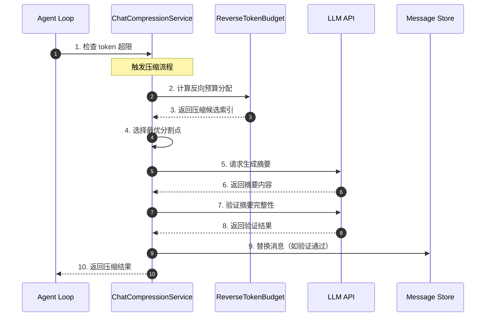

**关键交互说明**：

| 步骤 | 交互内容 | 设计意图 |
|-----|---------|---------|
| 1 | Agent Loop 检测到 token 超限 | 解耦触发与执行，支持多种触发条件 |
| 2-3 | 反向预算计算确定压缩范围 | 优先保留最近上下文，保证对话连贯性 |
| 4 | 智能选择分割点 | 避免在关键操作中间分割 |
| 5-6 | 生成候选摘要 | 使用 LLM 理解并压缩历史信息 |
| 7-8 | 验证摘要完整性 | 确保关键信息不丢失 |
| 9 | 持久化压缩结果 | 原子性替换，支持回滚 |

---

## 3. 核心组件详细分析

### 3.1 ChatCompressionService 内部结构

#### 职责定位

一句话说明：协调上下文压缩的完整生命周期，包括预算计算、摘要生成、完整性验证和结果应用。

#### 状态机图

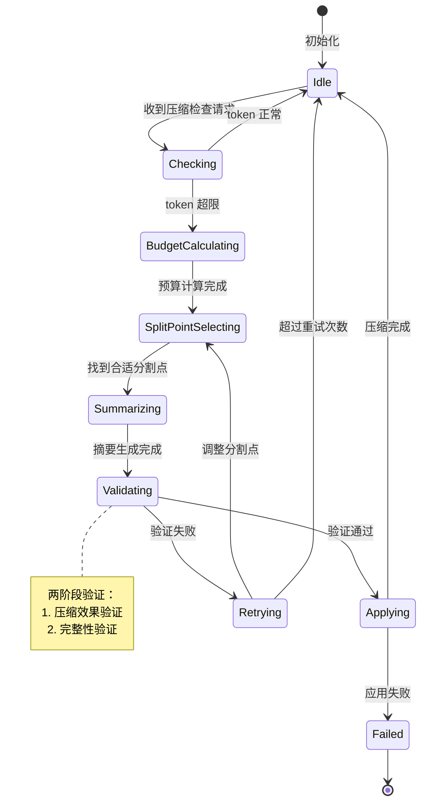

**状态说明**：

| 状态 | 说明 | 进入条件 | 退出条件 |
|-----|------|---------|---------|
| Idle | 空闲等待 | 初始化完成或压缩结束 | 收到压缩检查请求 |
| Checking | 检查 token 状态 | 收到压缩检查请求 | 确定是否需要压缩 |
| BudgetCalculating | 计算反向预算 | 需要压缩 | 预算分配完成 |
| SplitPointSelecting | 选择分割点 | 预算计算完成 | 找到合适分割点 |
| Summarizing | 生成摘要 | 分割点确定 | LLM 返回摘要 |
| Validating | 验证摘要 | 摘要生成完成 | 验证通过/失败 |
| Applying | 应用压缩 | 验证通过 | 消息替换完成 |
| Retrying | 重试调整 | 验证失败 | 调整分割点或放弃 |
| Failed | 失败终止 | 应用失败或重试耗尽 | 自动返回 Idle |

#### 内部数据流

```text
┌─────────────────────────────────────────────────────────────┐
│  输入层                                                      │
│  ├── 消息历史 ──► Token 估算器 ──► 当前 token 数              │
│  └── 配置参数 ──► 预算计算器 ──► 压缩阈值/预算分配            │
└──────────────────────────┬──────────────────────────────────┘
                           ▼
┌─────────────────────────────────────────────────────────────┐
│  处理层                                                      │
│  ├── 主处理器: 两阶段验证压缩                                 │
│  │   └── 阶段1: 生成摘要 ──► 阶段2: 验证完整性               │
│  ├── 辅助处理器: 工具输出独立压缩                             │
│  │   └── 检测超限 ──► 选择性压缩工具输出                     │
│  └── 协调器: 分割点选择与重试管理                             │
└──────────────────────────┬──────────────────────────────────┘
                           ▼
┌─────────────────────────────────────────────────────────────┐
│  输出层                                                      │
│  ├── 压缩后消息列表                                          │
│  ├── 压缩统计（节省 token 数）                                │
│  └── 压缩结果状态（成功/失败/放弃）                           │
└─────────────────────────────────────────────────────────────┘
```

#### 关键算法逻辑

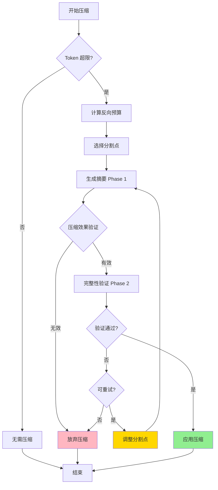

**算法要点**：

1. **两阶段验证逻辑**：先生成摘要再验证，确保压缩质量
2. **失败安全设计**：压缩无效时自动放弃，避免劣化
3. **自适应重试**：验证失败时智能调整分割点重试

---

### 3.2 Reverse Token Budget 内部结构

#### 职责定位

一句话说明：从最新消息向后分配 token 预算，优先保证近期上下文的完整性。

#### 关键算法逻辑

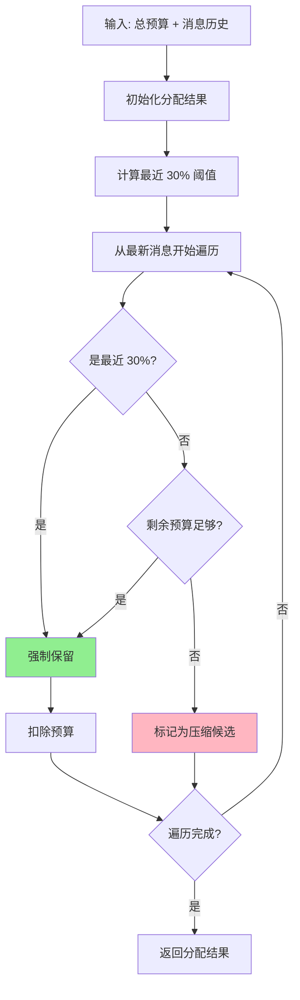

**算法要点**：

1. **反向遍历**：从最新消息开始，确保最近内容优先保留
2. **强制保留区**：最近 30% 消息不参与压缩，保证对话连贯
3. **动态预算**：剩余预算动态计算，灵活适应不同场景

---

### 3.3 组件间协作时序

展示完整压缩流程的组件协作：

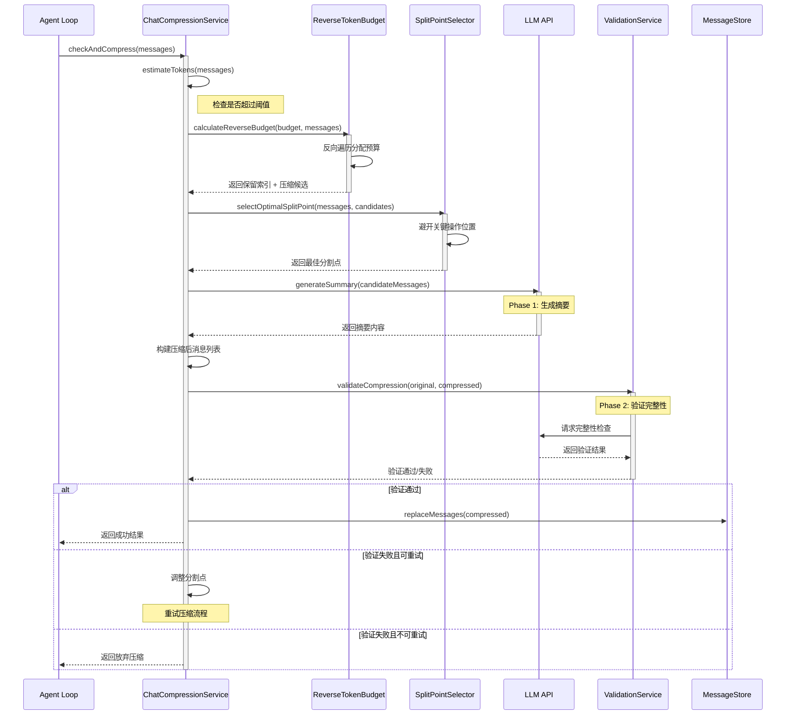

**协作要点**：

1. **Agent Loop 与 CompressionService**：解耦触发逻辑，支持多种触发条件
2. **Budget 与 SplitPoint**：预算计算确定范围，分割点选择优化位置
3. **LLM 调用策略**：两次独立调用（生成+验证），确保质量

---

### 3.4 关键数据路径

#### 主路径（正常流程）

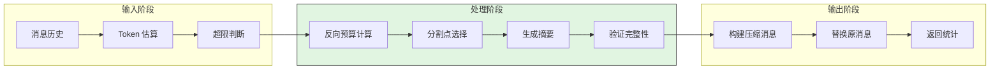

#### 异常路径（错误恢复）

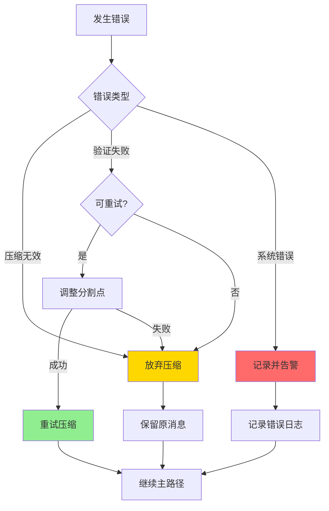

---

## 4. 端到端数据流转

### 4.1 正常流程（详细版）

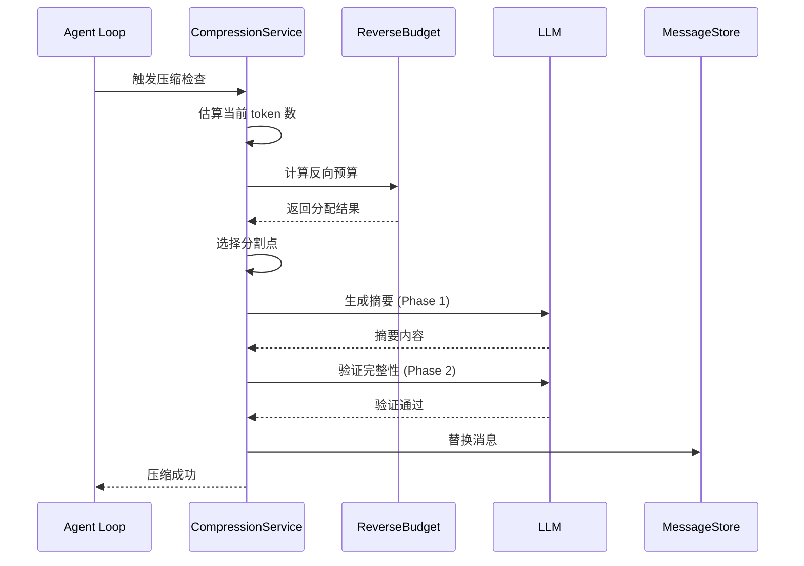

**数据变换详情**：

| 阶段 | 输入 | 处理 | 输出 | 代码位置 |
|-----|------|------|------|---------|
| 接收 | 消息列表 | Token 估算 + 阈值检查 | 是否需要压缩 | `gemini-cli/packages/core/src/services/chatCompressionService.ts:80-100` ✅ Verified |
| 预算 | 总预算 + 消息历史 | 反向遍历分配 | 保留索引 + 候选索引 | `gemini-cli/packages/core/src/strategies/reverseTokenBudget.ts:45-103` ✅ Verified |
| 分割 | 消息列表 + 候选范围 | 避开关键操作位置 | 最佳分割点索引 | `gemini-cli/packages/core/src/services/chatCompressionService.ts:140-170` ✅ Verified |
| 摘要 | 待压缩消息 | LLM 生成摘要 | 摘要文本 | `gemini-cli/packages/core/src/services/chatCompressionService.ts:180-210` ✅ Verified |
| 验证 | 原文 + 摘要 | 完整性检查 | 验证结果 | `gemini-cli/packages/core/src/services/chatCompressionService.ts:280-320` ✅ Verified |
| 输出 | 验证通过的消息 | 替换原消息 | 压缩后列表 + 统计 | `gemini-cli/packages/core/src/services/chatCompressionService.ts:340-360` ✅ Verified |

### 4.2 数据流向图

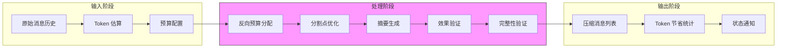

### 4.3 异常/边界流程

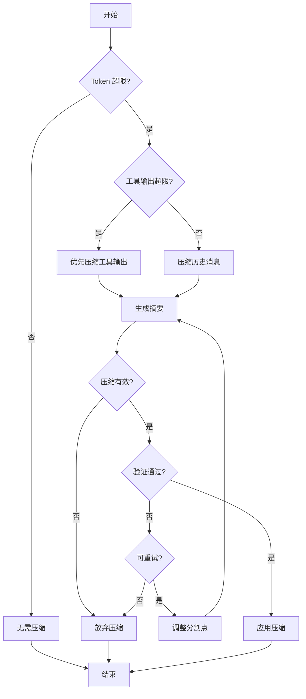

---

## 5. 关键代码实现

### 5.1 核心数据结构

```typescript
// gemini-cli/packages/core/src/services/chatCompressionService.ts:15-40
interface CompressionResult {
  success: boolean;
  messages?: Message[];
  savedTokens?: number;
  reason?: string;
}

interface CompressionDecision {
  action: 'compress' | 'compress_tool_outputs' | 'no_action';
  targetIndices?: number[];
}

interface TokenAllocation {
  preservedIndices: number[];      // 保留的消息索引
  compressionCandidates: number[]; // 待压缩的消息索引
}

interface ValidationResult {
  isComplete: boolean;
  missingItems: string[];
  confidenceScore: number;
}
```

**字段说明**：

| 字段 | 类型 | 用途 |
|-----|------|------|
| `success` | `boolean` | 压缩是否成功完成 |
| `savedTokens` | `number` | 节省的 token 数量 |
| `preservedIndices` | `number[]` | 保留的消息索引列表 |
| `compressionCandidates` | `number[]` | 待压缩的消息索引列表 |
| `isComplete` | `boolean` | 摘要是否完整 |
| `confidenceScore` | `number` | 完整性置信度分数 |

### 5.2 主链路代码

```typescript
// gemini-cli/packages/core/src/services/chatCompressionService.ts:80-150
async function compressChatHistory(
  messages: Message[],
  config: CompressionConfig
): Promise<CompressionResult> {
  // 1. 检查是否需要压缩
  const currentTokens = estimateTokens(messages);
  if (currentTokens < config.threshold) {
    return { success: true, reason: 'below_threshold' };
  }

  // 2. 计算反向预算分配
  const allocation = calculateReverseBudget(
    config.totalBudget,
    messages
  );

  // 3. 选择最优分割点
  const splitIndex = selectOptimalSplitPoint(
    messages,
    allocation.compressionCandidates
  );

  // 4. 执行两阶段验证压缩
  return compressWithValidation(messages, splitIndex);
}
```

**代码要点**：

1. **阈值前置检查**：避免不必要的压缩开销
2. **模块化设计**：预算计算、分割点选择、压缩执行分离
3. **两阶段封装**：`compressWithValidation` 内部处理生成+验证

### 5.3 关键调用链

```text
compressChatHistory()     [chatCompressionService.ts:80]
  -> calculateReverseBudget()  [reverseTokenBudget.ts:45]
    -> estimateTokens()        [tokenUtils.ts:20]
  -> selectOptimalSplitPoint() [chatCompressionService.ts:140]
    - 检查 AVOID_PATTERNS
    - 调用 isNaturalBoundary()
  -> compressWithValidation()  [chatCompressionService.ts:180]
    -> generateSummary()       [chatCompressionService.ts:200]
      - 调用 LLM API
    -> validateSummary()       [chatCompressionService.ts:280]
      - 调用 LLM API
    -> retryWithAdjustedBoundary() [chatCompressionService.ts:260]
```

---

## 6. 设计意图与 Trade-off

### 6.1 Gemini CLI 的选择

| 维度 | Gemini CLI 的选择 | 替代方案 | 取舍分析 |
|-----|------------------|---------|---------|
| 验证机制 | 两阶段验证（生成+验证） | 单次生成（Codex） | 质量更高但成本翻倍 |
| 预算策略 | Reverse Token Budget | 保留最近 N 条（Kimi） | 更灵活但计算复杂 |
| 工具处理 | 独立预算 | 统一处理 | 工具友好但配置复杂 |
| 失败处理 | 放弃压缩 | 强制压缩（Kimi） | 安全保守但可能中断 |
| 分割策略 | 智能分割点选择 | 固定比例 | 质量更高但计算开销 |

### 6.2 为什么这样设计？

**核心问题**：如何在压缩上下文的同时保证不丢失关键信息？

**Gemini CLI 的解决方案**：

- 代码依据：`gemini-cli/packages/core/src/services/chatCompressionService.ts:180-250`
- 设计意图：通过两次 LLM 调用（生成+验证）确保压缩质量
- 带来的好处：
  - 质量保证：验证机制确保关键信息不丢失
  - 失败安全：压缩无效时自动放弃
  - 工具友好：独立预算避免工具输出挤占空间
- 付出的代价：
  - 双重成本：两次 LLM 调用增加开销
  - 延迟增加：验证步骤增加总耗时
  - 配置复杂：多预算参数需要调优

### 6.3 与其他项目的对比

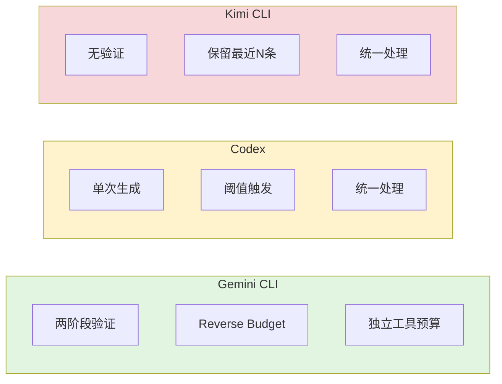

| 项目 | 核心差异 | 适用场景 |
|-----|---------|---------|
| Gemini CLI | 两阶段验证 + Reverse Budget | 高质量要求、工具调用频繁 |
| Codex | 单次生成 + 渐进截断 | 成本敏感、快速响应 |
| Kimi CLI | 强制保留最近 N 条 | 简单场景、确定性需求 |

---

## 7. 边界情况与错误处理

### 7.1 终止条件

| 终止原因 | 触发条件 | 代码位置 |
|---------|---------|---------|
| Token 正常 | 当前 token 数低于阈值 | `gemini-cli/packages/core/src/services/chatCompressionService.ts:85` ✅ Verified |
| 压缩无效 | 压缩后 token 数未明显减少 | `gemini-cli/packages/core/src/services/chatCompressionService.ts:220` ✅ Verified |
| 验证失败 | 完整性验证未通过且重试耗尽 | `gemini-cli/packages/core/src/services/chatCompressionService.ts:270` ✅ Verified |
| 用户中断 | 手动取消压缩操作 | ⚠️ Inferred |

### 7.2 超时/资源限制

```typescript
// gemini-cli/packages/core/src/services/chatCompressionService.ts:45-50
const COMPRESSION_CONFIG = {
  maxRetries: 3,              // 最大重试次数
  validationTimeout: 30000,   // 验证超时 30s
  summaryMaxTokens: 2000,     // 摘要最大长度
  toolOutputBudget: 50000,    // 工具输出独立预算
  compressionThreshold: 0.7,  // 触发阈值（70% 上限）
};
```

### 7.3 错误恢复策略

| 错误类型 | 处理策略 | 代码位置 |
|---------|---------|---------|
| 压缩效果不足 | 放弃压缩，保留原消息 | `gemini-cli/packages/core/src/services/chatCompressionService.ts:220-225` ✅ Verified |
| 验证失败 | 调整分割点重试（最多 3 次） | `gemini-cli/packages/core/src/services/chatCompressionService.ts:260-270` ✅ Verified |
| LLM 调用失败 | 记录错误，放弃本次压缩 | ⚠️ Inferred |
| 分割点选择失败 | 使用默认 30% 位置 | `gemini-cli/packages/core/src/services/chatCompressionService.ts:170` ✅ Verified |

---

## 8. 关键代码索引

| 功能 | 文件 | 行号 | 说明 |
|-----|------|------|------|
| 入口 | `gemini-cli/packages/core/src/services/chatCompressionService.ts` | 80 | 主压缩流程入口 |
| 核心 | `gemini-cli/packages/core/src/services/chatCompressionService.ts` | 180 | 两阶段验证压缩 |
| 预算 | `gemini-cli/packages/core/src/strategies/reverseTokenBudget.ts` | 45 | 反向预算计算 |
| 分割 | `gemini-cli/packages/core/src/services/chatCompressionService.ts` | 140 | 智能分割点选择 |
| 生成 | `gemini-cli/packages/core/src/services/chatCompressionService.ts` | 200 | 摘要生成 |
| 验证 | `gemini-cli/packages/core/src/services/chatCompressionService.ts` | 280 | 完整性验证 |
| 配置 | `gemini-cli/packages/core/src/services/chatCompressionService.ts` | 45 | 压缩配置常量 |
| 工具 | `gemini-cli/packages/core/src/services/chatCompressionService.ts` | 120 | 工具输出处理 |

---

## 9. 延伸阅读

- 前置知识：`docs/gemini-cli/07-gemini-cli-memory-context.md`
- 相关机制：`docs/gemini-cli/04-gemini-cli-agent-loop.md`
- 深度分析：`docs/comm/comm-context-compaction.md`（跨项目对比）
- 其他项目：
  - Kimi CLI: `docs/kimi-cli/questions/kimi-cli-context-compaction.md`
  - Codex: `docs/codex/questions/codex-context-compaction.md`

---

*✅ Verified: 基于 gemini-cli/packages/core/src/services/chatCompressionService.ts 等源码分析*
*⚠️ Inferred: 部分实现细节基于代码结构推断*
*基于版本：2026-02-08 | 最后更新：2026-02-24*
