# Gemini CLI 防循环机制

## TL;DR（结论先行）

Gemini CLI 通过**三层循环检测**（工具调用哈希、内容流重复、LLM 智能检测）+ **最大轮次硬性限制** + **优雅终止**防止 tool 无限循环。

Gemini CLI 的核心取舍：**智能检测 + 渐进式防护**（对比其他项目的简单计数限制或无防护）

---

## 1. 为什么需要这个机制？

### 1.1 问题场景

没有防循环机制时，Agent 可能出现以下行为：

```
用户: "修复这个 bug"

→ LLM: "读取文件 A" → 读取成功
→ LLM: "修改文件 A" → 修改成功
→ LLM: "读取文件 A" → 读取成功（重复！）
→ LLM: "修改文件 A" → 修改成功（重复！）
→ ... 无限循环 ...
```

### 1.2 核心挑战

| 挑战 | 不解决的后果 |
|-----|-------------|
| 相同工具调用重复 | 资源浪费，API 费用激增 |
| 内容流重复输出（Chanting）| 用户体验差，输出无意义 |
| 复杂语义级循环 | 难以用简单规则检测 |
| 硬性中断体验差 | 用户不知道发生了什么 |

---

## 2. 整体架构

### 2.1 在系统中的位置

```text
┌─────────────────────────────────────────────────────────────┐
│ Agent Loop / GeminiClient                                    │
│ packages/core/src/core/client.ts:sendMessageStream()        │
└───────────────────────┬─────────────────────────────────────┘
                        │ 调用
                        ▼
┌─────────────────────────────────────────────────────────────┐
│ ▓▓▓ LoopDetectionService ▓▓▓                                │
│ packages/core/src/services/loopDetectionService.ts          │
│ - addAndCheck()           : 流式事件检测入口                 │
│ - turnStarted()           : 每轮开始检测（LLM检测触发）       │
│ - checkToolCallLoop()     : 工具调用重复检测（私有）          │
│ - checkContentLoop()      : 内容流重复检测（私有）            │
│ - checkForLoopWithLLM()   : LLM 智能检测（私有）              │
└───────────────────────┬─────────────────────────────────────┘
                        │ 依赖/调用
                        ▼
┌─────────────────────────────────────────────────────────────┐
│ Gemini Client        │ 工具系统         │ 状态管理          │
│ packages/core/src/   │ packages/core/src/ │ 会话状态          │
│ core/gemini-client.ts│ services/tools.ts  │                   │
└──────────────────────┴──────────────────────┴───────────────┘
```

### 2.2 核心组件职责

| 组件 | 职责 | 代码位置 |
|-----|------|---------|
| `LoopDetectionService` | 三层循环检测协调 | `packages/core/src/services/loopDetectionService.ts:101` |
| `addAndCheck()` | 流式事件检测入口 | `packages/core/src/services/loopDetectionService.ts:150` |
| `turnStarted()` | 每轮开始触发 LLM 检测 | `packages/core/src/services/loopDetectionService.ts:185` |
| `checkToolCallLoop()` | 工具调用哈希重复检测（私有） | `packages/core/src/services/loopDetectionService.ts:202` |
| `checkContentLoop()` | 内容流滑动窗口检测（私有） | `packages/core/src/services/loopDetectionService.ts:234` |
| `checkForLoopWithLLM()` | 双模型智能检测（私有） | `packages/core/src/services/loopDetectionService.ts:445` |
| `MAX_TURNS` | 最大轮次硬性限制 | `packages/core/src/core/client.ts:68` |

### 2.3 核心组件交互关系

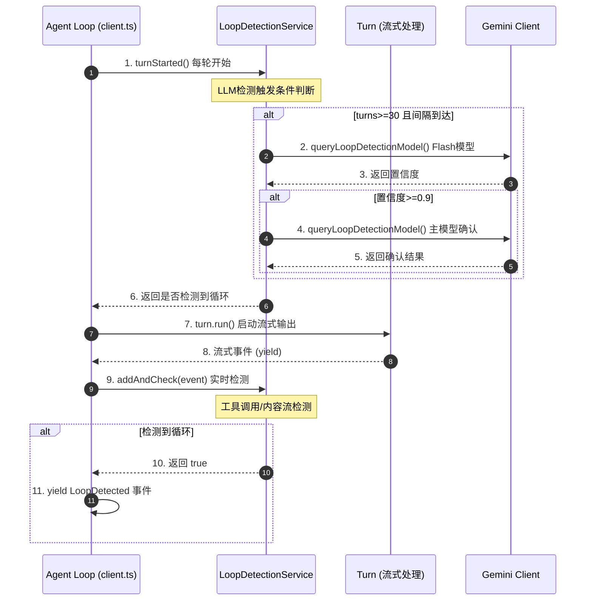

**关键交互说明**：

| 步骤 | 交互内容 | 设计意图 |
|-----|---------|---------|
| 1 | 每轮开始时调用 turnStarted | 触发 LLM-based 周期性检测 |
| 2-5 | 双模型验证流程 | Flash 快速初筛 + 主模型确认降低误报 |
| 7-9 | 流式事件实时检测 | 在内容生成过程中同步检测，及时中断 |
| 10-11 | 循环事件通知 | 统一事件类型便于上层处理 |

---

## 3. 核心组件详细分析

### 3.1 LoopDetectionService 内部结构

#### 职责定位

协调三层检测机制，提供统一的循环检测接口。维护检测状态，管理检测阈值和间隔。

#### 状态机图

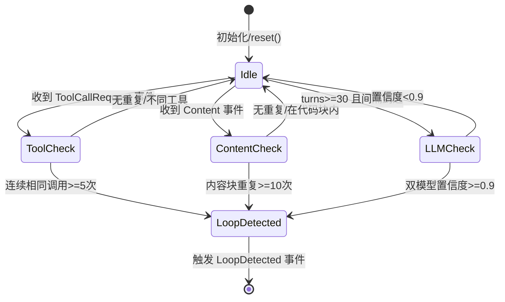

**状态说明**：

| 状态 | 说明 | 进入条件 | 退出条件 |
|-----|------|---------|---------|
| Idle | 等待检测 | 初始化或检测完成 | 收到新事件/触发条件满足 |
| ToolCheck | 工具调用检测 | 收到 ToolCallRequest | 检测完成 |
| ContentCheck | 内容流检测 | 收到 Content 事件 | 检测完成 |
| LLMCheck | 智能检测 | 达到检测条件 | 收到模型响应 |
| LoopDetected | 检测到循环 | 任一层触发 | 返回检测结果 |

#### 内部数据流

```text
┌─────────────────────────────────────────────────────────────┐
│  输入层                                                      │
│  ├── 工具调用事件 ──► SHA256 哈希 ──► 哈希对比               │
│  └── 内容流事件   ──► 滑动窗口   ──► 聚类分析                │
└──────────────────────────┬──────────────────────────────────┘
                           ▼
┌─────────────────────────────────────────────────────────────┐
│  处理层                                                      │
│  ├── 工具调用状态: lastToolCallKey, toolCallRepetitionCount  │
│  ├── 内容流历史: streamContentHistory (MAX_HISTORY_LENGTH)   │
│  │   └── contentStats: Map<hash, indices[]>                  │
│  └── LLM 检测状态: turnsInCurrentPrompt, llmCheckInterval    │
│      └── lastCheckTurn                                      │
└──────────────────────────┬──────────────────────────────────┘
                           ▼
┌─────────────────────────────────────────────────────────────┐
│  输出层                                                      │
│  ├── 检测结果: boolean (addAndCheck 返回值)                  │
│  ├── 事件类型: GeminiEventType.LoopDetected                  │
│  └── 遥测日志: LoopDetectedEvent, LlmLoopCheckEvent          │
└─────────────────────────────────────────────────────────────┘
```

#### 关键算法逻辑

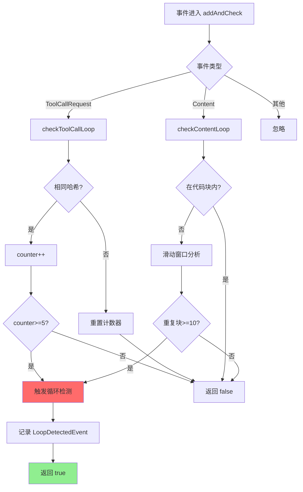

**算法要点**：

1. **分层检测优先级**：工具调用检测最轻量，内容流次之，LLM 检测最慢但最智能
2. **代码块排除机制**：通过 ``` 标记跟踪 inCodeBlock 状态，避免代码结构误报
3. **滑动窗口聚类**：50 字符块 + 平均距离分析，区分真正循环和列表项前缀重复

#### 关键接口

| 接口 | 输入 | 输出 | 说明 | 代码位置 |
|-----|------|------|------|---------|
| `reset(promptId)` | 新 prompt ID | void | 重置所有检测状态 | `loopDetectionService.ts:605` |
| `addAndCheck(event)` | ServerGeminiStreamEvent | boolean | 流式事件检测入口 | `loopDetectionService.ts:150` |
| `turnStarted(signal)` | AbortSignal | Promise<boolean> | 每轮开始触发 LLM 检测 | `loopDetectionService.ts:185` |
| `disableForSession()` | void | void | 禁用当前会话的检测 | `loopDetectionService.ts:131` |

---

### 3.2 内容流检测算法详解

#### 职责定位

检测 LLM 输出内容中的重复模式（Chanting），通过滑动窗口和哈希聚类识别无意义重复。

#### 内部数据流

```text
┌─────────────────────────────────────────────────────────────┐
│  输入处理                                                    │
│  ├── 原始 content 字符串                                     │
│  ├── 检测代码块标记: ```                                     │
│  ├── 检测表格、列表、标题等特殊格式                           │
│  └── 遇到特殊格式时重置追踪状态                               │
└──────────────────────────┬──────────────────────────────────┘
                           ▼
┌─────────────────────────────────────────────────────────────┐
│  内容累积与截断                                              │
│  ├── streamContentHistory += content                         │
│  ├── 超过 MAX_HISTORY_LENGTH(5000) 时截断                    │
│  └── 调整所有存储的索引位置                                   │
└──────────────────────────┬──────────────────────────────────┘
                           ▼
┌─────────────────────────────────────────────────────────────┐
│  滑动窗口分析                                                │
│  ├── CONTENT_CHUNK_SIZE = 50 字符块                          │
│  ├── 计算每块 SHA256 哈希                                    │
│  ├── 存储到 contentStats: Map<hash, indices[]>               │
│  └── 分析最近 CONTENT_LOOP_THRESHOLD(10) 次出现的平均距离     │
└──────────────────────────┬──────────────────────────────────┘
                           ▼
┌─────────────────────────────────────────────────────────────┐
│  循环判定                                                    │
│  ├── 平均距离 <= 5 * chunk_size (250字符)                    │
│  └── 不同 period 数量 <= floor(threshold/2)                  │
│      （避免列表项前缀重复误报）                               │
└─────────────────────────────────────────────────────────────┘
```

#### 关键算法逻辑

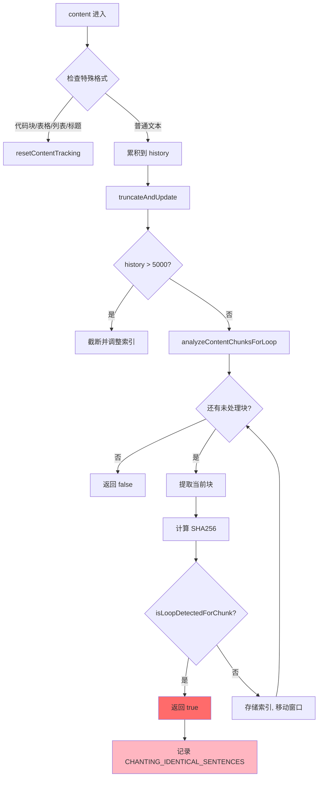

**算法要点**：

1. **特殊格式排除**：代码块、表格、列表、标题等会触发 reset，避免结构重复误报
2. **内存安全**：MAX_HISTORY_LENGTH 限制 + 截断时索引调整
3. **双重验证**：哈希匹配后验证实际内容，防止哈希碰撞
4. **Period 分析**：通过分析重复块之间的内容差异，区分真正循环和列表项

---

### 3.3 组件间协作时序

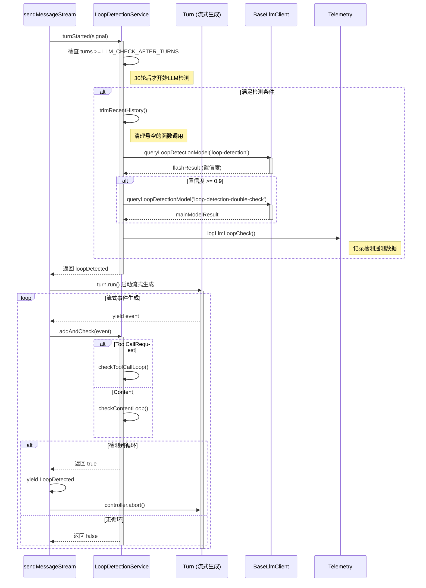

**协作要点**：

1. **turnStarted 与 addAndCheck 分离**：前者用于周期性 LLM 检测，后者用于实时流式检测
2. **双模型验证流程**：Flash 模型快速初筛，主模型二次确认，平衡速度与准确性
3. **流式中断机制**：检测到循环时通过 AbortController 立即中断 Turn 的流式生成
4. **遥测记录**：所有检测行为都记录遥测日志，便于后续分析

---

### 3.4 关键数据路径

#### 主路径（正常流程）

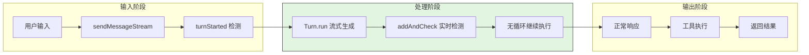

#### 异常路径（循环检测触发）

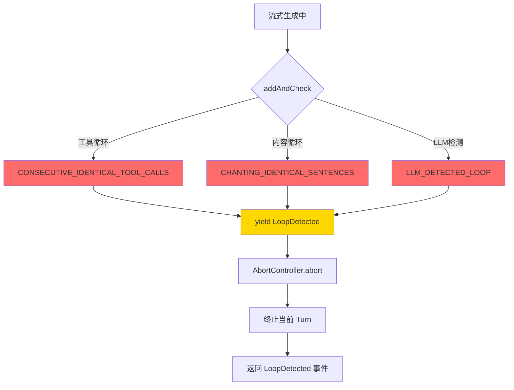

#### 优化路径（动态检测间隔）

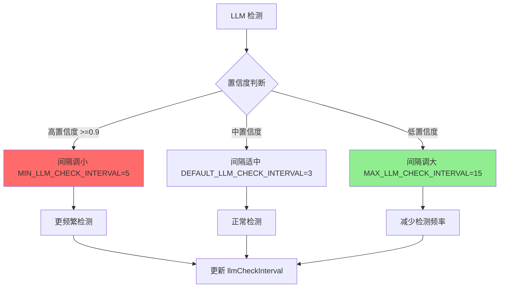

---

## 4. 端到端数据流转

### 4.1 正常流程（详细版）

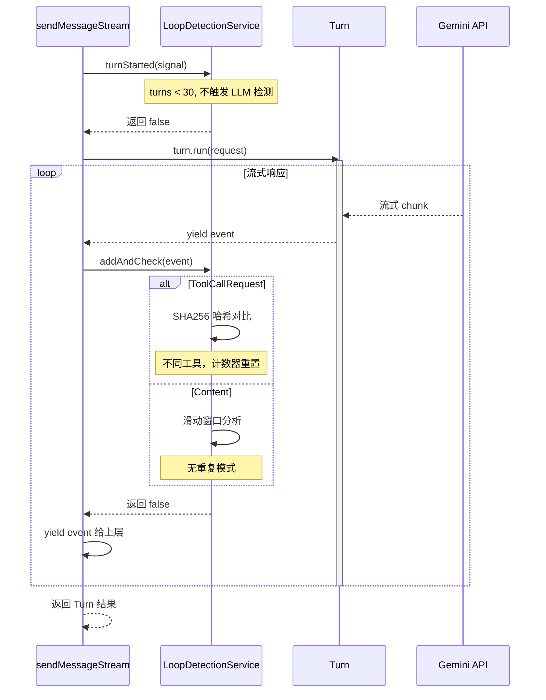

**数据变换详情**：

| 阶段 | 输入 | 处理 | 输出 | 代码位置 |
|-----|------|------|------|---------|
| turnStarted | 当前 turns 计数 | 判断是否满足 LLM 检测条件 | boolean | `client.ts:637` |
| addAndCheck | ServerGeminiStreamEvent | 根据事件类型分发检测 | boolean | `loopDetectionService.ts:150` |
| 工具检测 | `{name, args}` | SHA256 哈希 + 连续计数 | 重复计数 | `loopDetectionService.ts:202` |
| 内容检测 | `content: string` | 滑动窗口 + 聚类分析 | 是否循环 | `loopDetectionService.ts:234` |

### 4.2 数据流向图

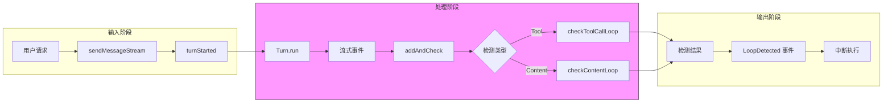

### 4.3 异常/边界流程

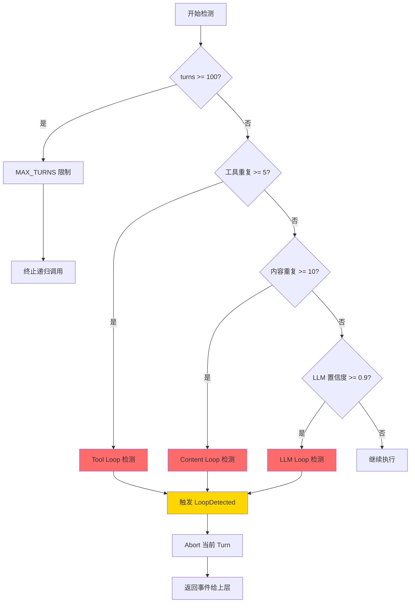

---

## 5. 关键代码实现

### 5.1 核心数据结构

```typescript
// packages/core/src/services/loopDetectionService.ts:30-66
const TOOL_CALL_LOOP_THRESHOLD = 5;        // 相同工具调用 5 次触发
const CONTENT_LOOP_THRESHOLD = 10;         // 内容块重复 10 次触发
const CONTENT_CHUNK_SIZE = 50;             // 内容分析块大小
const MAX_HISTORY_LENGTH = 5000;           // 内容历史最大长度
const LLM_LOOP_CHECK_HISTORY_COUNT = 20;   // LLM 检测历史轮数
const LLM_CHECK_AFTER_TURNS = 30;          // 30 轮后开始 LLM 检测
const LLM_CONFIDENCE_THRESHOLD = 0.9;      // 双模型确认阈值
const DEFAULT_LLM_CHECK_INTERVAL = 3;      // 默认检测间隔
const MIN_LLM_CHECK_INTERVAL = 5;          // 最小检测间隔（高置信度）
const MAX_LLM_CHECK_INTERVAL = 15;         // 最大检测间隔（低置信度）
```

**字段说明**：

| 字段 | 类型 | 用途 |
|-----|------|------|
| `TOOL_CALL_LOOP_THRESHOLD` | `number` | 工具调用重复阈值 |
| `CONTENT_LOOP_THRESHOLD` | `number` | 内容重复阈值 |
| `CONTENT_CHUNK_SIZE` | `number` | 滑动窗口块大小（字符） |
| `MAX_HISTORY_LENGTH` | `number` | 内容历史最大长度，防止内存溢出 |
| `LLM_CHECK_AFTER_TURNS` | `number` | LLM 检测起始轮次，避免早期误报 |
| `LLM_CONFIDENCE_THRESHOLD` | `number` | 双模型确认阈值，降低误报率 |

### 5.2 工具调用重复检测

```typescript
// packages/core/src/services/loopDetectionService.ts:202-221
private checkToolCallLoop(toolCall: { name: string; args: object }): boolean {
  // 使用 SHA256 哈希工具调用名称和参数
  const key = this.getToolCallKey(toolCall);

  if (this.lastToolCallKey === key) {
    this.toolCallRepetitionCount++;
  } else {
    this.lastToolCallKey = key;
    this.toolCallRepetitionCount = 1;
  }

  // 相同工具调用达到 5 次，触发循环检测
  if (this.toolCallRepetitionCount >= TOOL_CALL_LOOP_THRESHOLD) {
    logLoopDetected(
      this.config,
      new LoopDetectedEvent(
        LoopType.CONSECUTIVE_IDENTICAL_TOOL_CALLS,
        this.promptId,
      ),
    );
    return true;
  }
  return false;
}

// packages/core/src/services/loopDetectionService.ts:139-143
private getToolCallKey(toolCall: { name: string; args: object }): string {
  const argsString = JSON.stringify(toolCall.args);
  const keyString = `${toolCall.name}:${argsString}`;
  return createHash('sha256').update(keyString).digest('hex');
}
```

**代码要点**：
1. **SHA256 哈希**：工具名 + 参数 JSON 字符串整体哈希，确保参数变化也能被检测
2. **连续计数器**：只检测连续重复，正常重复会重置计数器
3. **事件通知**：触发后记录 LoopDetectedEvent 遥测日志

### 5.3 内容流重复检测

```typescript
// packages/core/src/services/loopDetectionService.ts:234-270
private checkContentLoop(content: string): boolean {
  // 检测特殊格式（代码块、表格、列表等）
  const numFences = (content.match(/```/g) ?? []).length;
  const hasTable = /(^|\n)\s*(\|.*\||[|+-]{3,})/.test(content);
  const hasListItem = /(^|\n)\s*[*+-]\s/.test(content);
  const hasHeading = /(^|\n)#+\s/.test(content);

  if (numFences || hasTable || hasListItem || hasHeading) {
    this.resetContentTracking();  // 特殊格式触发重置
  }

  // 跟踪代码块状态
  const wasInCodeBlock = this.inCodeBlock;
  this.inCodeBlock =
    numFences % 2 === 0 ? this.inCodeBlock : !this.inCodeBlock;
  if (wasInCodeBlock || this.inCodeBlock) {
    return false;  // 代码块内不检测
  }

  this.streamContentHistory += content;
  this.truncateAndUpdate();
  return this.analyzeContentChunksForLoop();
}
```

**代码要点**：
1. **代码块排除**：`inCodeBlock` 状态跟踪，代码块内的重复结构不检测
2. **特殊格式重置**：表格、列表、标题等会触发 resetContentTracking
3. **内存安全**：`truncateAndUpdate()` 在超过 MAX_HISTORY_LENGTH 时截断历史

### 5.4 LLM-based 智能检测

```typescript
// packages/core/src/services/loopDetectionService.ts:445-542
private async checkForLoopWithLLM(signal: AbortSignal) {
  // 获取最近 20 轮对话历史
  const recentHistory = this.config
    .getGeminiClient()
    .getHistory()
    .slice(-LLM_LOOP_CHECK_HISTORY_COUNT);

  const trimmedHistory = this.trimRecentHistory(recentHistory);

  // Flash 模型快速初筛
  const flashResult = await this.queryLoopDetectionModel(
    'loop-detection',
    contents,
    signal,
  );
  const flashConfidence = flashResult['unproductive_state_confidence'] as number;

  // 置信度低于 0.9，调整间隔后返回
  if (flashConfidence < LLM_CONFIDENCE_THRESHOLD) {
    this.updateCheckInterval(flashConfidence);
    return false;
  }

  // 双重检查：使用主模型再次确认
  const mainModelResult = await this.queryLoopDetectionModel(
    'loop-detection-double-check',
    contents,
    signal,
  );
  const mainModelConfidence = mainModelResult
    ? (mainModelResult['unproductive_state_confidence'] as number)
    : 0;

  if (mainModelConfidence >= LLM_CONFIDENCE_THRESHOLD) {
    this.handleConfirmedLoop(mainModelResult, doubleCheckModelName);
    return true;
  }

  return false;
}
```

**代码要点**：
1. **双模型验证**：Flash 快速初筛 + 主模型确认，平衡速度与准确性
2. **动态间隔**：根据置信度调整检测频率（5-15轮），高置信度时更频繁检测
3. **历史修剪**：`trimRecentHistory()` 清理悬空的函数调用，确保历史有效

### 5.5 最大轮次限制

```typescript
// packages/core/src/core/client.ts:68
const MAX_TURNS = 100;

// packages/core/src/core/client.ts:841
const boundedTurns = Math.min(turns, MAX_TURNS);

// packages/core/src/core/client.ts:550-572
private async *processTurn(
  request: PartListUnion,
  signal: AbortSignal,
  prompt_id: string,
  boundedTurns: number,
  // ...
): AsyncGenerator<ServerGeminiStreamEvent, Turn> {
  if (!boundedTurns) {
    return turn;  // 轮次耗尽，直接返回
  }
  // ...
}
```

**代码要点**：
1. **硬性限制**：MAX_TURNS = 100 作为最终防护
2. **递归递减**：每次递归调用 `boundedTurns - 1`
3. **优雅终止**：轮次耗尽时正常返回 Turn，而非抛出异常

### 5.6 关键调用链

```text
sendMessageStream()              [packages/core/src/core/client.ts:789]
  -> processTurn()               [packages/core/src/core/client.ts:550]
    -> loopDetector.turnStarted() [packages/core/src/services/loopDetectionService.ts:185]
      -> checkForLoopWithLLM()    [packages/core/src/services/loopDetectionService.ts:445]
        -> queryLoopDetectionModel() [packages/core/src/services/loopDetectionService.ts:544]
    -> turn.run()                 [packages/core/src/core/turn.ts]
      -> 流式事件 yield
    -> loopDetector.addAndCheck() [packages/core/src/services/loopDetectionService.ts:150]
      -> checkToolCallLoop()      [packages/core/src/services/loopDetectionService.ts:202]
      -> checkContentLoop()       [packages/core/src/services/loopDetectionService.ts:234]
```

---

## 6. 设计意图与 Trade-off

### 6.1 Gemini CLI 的选择

| 维度 | Gemini CLI 的选择 | 替代方案 | 取舍分析 |
|-----|-----------------|---------|---------|
| 检测层数 | 三层（工具/内容/语义） | 单层计数 | 检测更全面，但实现复杂 |
| LLM 检测 | 双模型验证 + 动态间隔 | 单模型固定间隔 | 降低误报和成本，但增加实现复杂度 |
| 检测间隔 | 动态调整（5-15轮） | 固定间隔 | 平衡检测频率与 API 成本 |
| 代码块处理 | 完全排除检测 | 统一检测 | 减少误报，但可能漏检代码块内的真正循环 |
| 轮次限制 | 硬性限制 100 轮 | 无限制 | 最终防护，但可能中断长任务 |

### 6.2 为什么这样设计？

**核心问题**：如何在不误伤正常重复的情况下检测真正的循环？

**Gemini CLI 的解决方案**：
- 代码依据：`packages/core/src/services/loopDetectionService.ts:234-264`
- 设计意图：代码块内的重复结构是正常现象（如多行相似代码），应排除检测
- 带来的好处：
  - 大幅减少误报，提高用户体验
  - 代码文件的自然重复不会触发检测
- 付出的代价：
  - 需要维护 `inCodeBlock` 状态，增加复杂度
  - 代码块边界的判断需要处理各种边缘情况

**核心问题**：如何平衡 LLM 检测的准确性和成本？

**Gemini CLI 的解决方案**：
- 代码依据：`packages/core/src/services/loopDetectionService.ts:445-542`
- 设计意图：Flash 模型快速初筛，只有高置信度才用主模型确认
- 带来的好处：
  - 大部分请求只需 Flash 模型，成本低
  - 双模型验证降低误报率
- 付出的代价：
  - 实现复杂度增加
  - 高置信度时需要两次 API 调用

### 6.3 与其他项目的对比

| 防护机制 | Gemini CLI | Codex | Kimi CLI | OpenCode | SWE-agent |
|---------|------------|-------|----------|----------|-----------|
| **工具调用哈希检测** | ✅ 5次触发 | ❌ 无 | ❌ 无 | ❌ 无 | ❌ 无 |
| **内容流重复检测** | ✅ 滑动窗口 | ❌ 无 | ❌ 无 | ❌ 无 | ❌ 无 |
| **LLM-based 检测** | ✅ 双模型验证 | ❌ 无 | ❌ 无 | ❌ 无 | ❌ 无 |
| **最大轮次限制** | ✅ 100轮 | ✅ 有 | ✅ 100轮 | ✅ Infinity | ✅ 无限制 |
| **优雅恢复** | ✅ LoopDetected 事件 | ❌ 无 | ✅ Checkpoint | ❌ 无 | ✅ Autosubmit |

---

## 7. 边界情况与错误处理

### 7.1 终止条件

| 终止原因 | 触发条件 | 代码位置 |
|---------|---------|---------|
| 达到最大轮次 | `boundedTurns <= 0` | `packages/core/src/core/client.ts:570` |
| 工具调用循环 | 相同调用 >= 5次 | `packages/core/src/services/loopDetectionService.ts:210` |
| 内容流循环 | 内容重复 >= 10次 | `packages/core/src/services/loopDetectionService.ts:323` |
| LLM 检测循环 | 双模型置信度 >= 0.9 | `packages/core/src/services/loopDetectionService.ts:533` |
| 会话级禁用 | `disableForSession()` 被调用 | `packages/core/src/services/loopDetectionService.ts:131` |
| 配置禁用 | `config.getDisableLoopDetection()` | `packages/core/src/services/loopDetectionService.ts:151` |

### 7.2 防误报设计

```typescript
// packages/core/src/services/loopDetectionService.ts:238-264
// 特殊格式检测与重置
const numFences = (content.match(/```/g) ?? []).length;
const hasTable = /(^|\n)\s*(\|.*\||[|+-]{3,})/.test(content);
const hasListItem = /(^|\n)\s*[*+-]\s/.test(content);
const hasHeading = /(^|\n)#+\s/.test(content);

if (numFences || hasTable || hasListItem || hasHeading) {
  this.resetContentTracking();  // 遇到特殊格式重置
}

// 代码块内跳过检测
if (wasInCodeBlock || this.inCodeBlock) {
  return false;
}

// packages/core/src/services/loopDetectionService.ts:389-404
// Period 分析避免列表项前缀重复误报
const periods = new Set<string>();
for (let i = 0; i < recentIndices.length - 1; i++) {
  periods.add(
    this.streamContentHistory.substring(
      recentIndices[i],
      recentIndices[i + 1],
    ),
  );
}
if (periods.size > Math.floor(CONTENT_LOOP_THRESHOLD / 2)) {
  return false;  // 不同 period 数量过多，可能是列表项
}
```

### 7.3 错误恢复策略

| 错误类型 | 处理策略 | 代码位置 |
|---------|---------|---------|
| 工具调用循环 | yield LoopDetected 事件，中断当前 Turn | `packages/core/src/core/client.ts:691` |
| 内容流循环 | yield LoopDetected 事件，中断当前 Turn | `packages/core/src/core/client.ts:691` |
| LLM 检测异常 | 捕获异常，返回 false 继续执行 | `packages/core/src/services/loopDetectionService.ts:568` |
| 达到最大轮次 | 正常返回 Turn，不再递归调用 | `packages/core/src/core/client.ts:570` |

---

## 8. 关键代码索引

| 功能 | 文件 | 行号 | 说明 |
|-----|------|------|------|
| 常量定义 | `packages/core/src/services/loopDetectionService.ts` | 30-66 | 检测阈值和配置常量 |
| 类定义 | `packages/core/src/services/loopDetectionService.ts` | 101 | LoopDetectionService 类 |
| 流式检测入口 | `packages/core/src/services/loopDetectionService.ts` | 150 | addAndCheck() 方法 |
| 每轮检测入口 | `packages/core/src/services/loopDetectionService.ts` | 185 | turnStarted() 方法 |
| 工具调用检测 | `packages/core/src/services/loopDetectionService.ts` | 202-221 | checkToolCallLoop() 私有方法 |
| 内容流检测 | `packages/core/src/services/loopDetectionService.ts` | 234-270 | checkContentLoop() 私有方法 |
| LLM 智能检测 | `packages/core/src/services/loopDetectionService.ts` | 445-542 | checkForLoopWithLLM() 私有方法 |
| 查询检测模型 | `packages/core/src/services/loopDetectionService.ts` | 544-572 | queryLoopDetectionModel() 私有方法 |
| 状态重置 | `packages/core/src/services/loopDetectionService.ts` | 605-611 | reset() 方法 |
| 最大轮次常量 | `packages/core/src/core/client.ts` | 68 | MAX_TURNS = 100 |
| 循环检测调用 | `packages/core/src/core/client.ts` | 637 | turnStarted() 调用 |
| 流式检测调用 | `packages/core/src/core/client.ts` | 691 | addAndCheck() 调用 |

---

## 9. 延伸阅读

- 前置知识：`../04-gemini-cli-agent-loop.md`
- 相关机制：`../10-gemini-cli-safety-control.md`
- 深度分析：`../07-gemini-cli-memory-context.md`

---

*✅ Verified: 基于 gemini-cli/packages/core/src/services/loopDetectionService.ts 和 gemini-cli/packages/core/src/core/client.ts 源码分析*
*基于版本：gemini-cli (baseline 2026-02-08) | 最后更新：2026-02-25*
