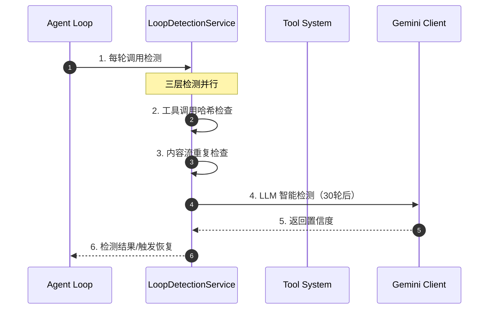
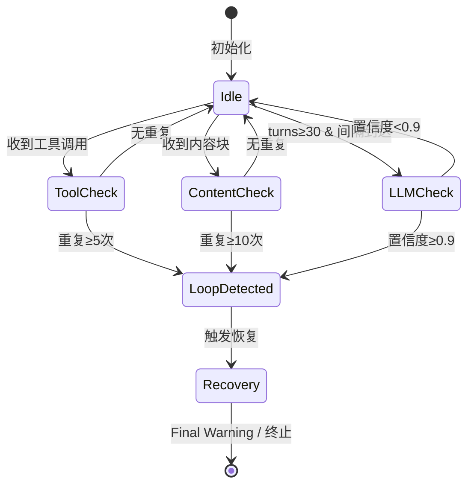
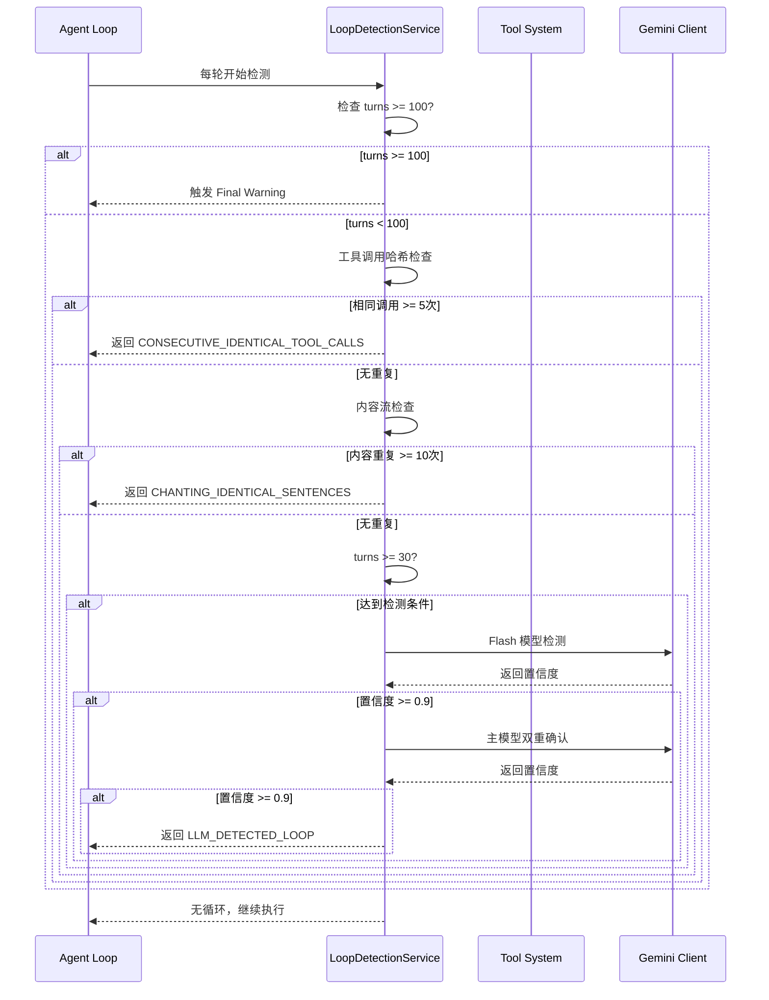
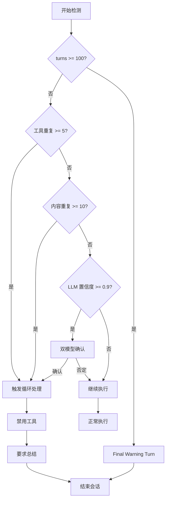

# Gemini CLI 防循环机制

## TL;DR（结论先行）

Gemini CLI 通过**三层循环检测**（工具调用哈希、内容流重复、LLM 智能检测）+ **Final Warning Turn 优雅恢复** + **最大轮次硬性限制**防止 tool 无限循环。

Gemini CLI 的核心取舍：**智能检测 + 优雅恢复**（对比其他项目的简单计数限制或无防护）

---

## 1. 为什么需要这个机制？

### 1.1 问题场景

没有防循环机制时，Agent 可能出现以下行为：

```
用户: "修复这个 bug"

→ LLM: "读取文件 A" → 读取成功
→ LLM: "修改文件 A" → 修改成功
→ LLM: "读取文件 A" → 读取成功（重复！）
→ LLM: "修改文件 A" → 修改成功（重复！）
→ ... 无限循环 ...
```

### 1.2 核心挑战

| 挑战 | 不解决的后果 |
|-----|-------------|
| 相同工具调用重复 | 资源浪费，API 费用激增 |
| 内容流重复输出（Chanting）| 用户体验差，输出无意义 |
| 复杂语义级循环 | 难以用简单规则检测 |
| 硬性中断体验差 | 用户不知道发生了什么 |

---

## 2. 整体架构

### 2.1 在系统中的位置

```text
┌─────────────────────────────────────────────────────────────┐
│ Agent Loop / Scheduler                                       │
│ packages/core/src/core/client.ts:sendMessageStream()        │
└───────────────────────┬─────────────────────────────────────┘
                        │ 调用
                        ▼
┌─────────────────────────────────────────────────────────────┐
│ ▓▓▓ LoopDetectionService ▓▓▓                                │
│ packages/core/src/services/loopDetectionService.ts          │
│ - checkToolCallLoop()    : 工具调用重复检测                  │
│ - checkContentLoop()     : 内容流重复检测                    │
│ - checkForLoopWithLLM()  : LLM 智能检测                      │
│ - handleFinalWarningTurn(): 优雅恢复                         │
└───────────────────────┬─────────────────────────────────────┘
                        │ 依赖/调用
                        ▼
┌─────────────────────────────────────────────────────────────┐
│ Gemini Client        │ 工具系统         │ 状态管理          │
│ packages/core/src/   │ packages/core/src/ │ 会话状态          │
│ core/gemini-client.ts│ services/tools.ts  │                   │
└──────────────────────┴──────────────────────┴───────────────┘
```

### 2.2 核心组件职责

| 组件 | 职责 | 代码位置 |
|-----|------|---------|
| `LoopDetectionService` | 三层循环检测协调 | `packages/core/src/services/loopDetectionService.ts` |
| `checkToolCallLoop()` | 工具调用哈希重复检测 | `packages/core/src/services/loopDetectionService.ts:1` |
| `checkContentLoop()` | 内容流滑动窗口检测 | `packages/core/src/services/loopDetectionService.ts:57` |
| `checkForLoopWithLLM()` | 双模型智能检测 | `packages/core/src/services/loopDetectionService.ts:103` |
| `handleFinalWarningTurn()` | 最大轮次优雅恢复 | `packages/core/src/core/client.ts:171` |

### 2.3 核心组件交互关系



**关键交互说明**：

| 步骤 | 交互内容 | 设计意图 |
|-----|---------|---------|
| 1 | Agent Loop 向检测服务发起检查 | 解耦检测逻辑与主循环 |
| 2-3 | 本地快速检测 | 低成本的规则检测先行 |
| 4-5 | LLM 远程检测 | 高成本的智能检测后置 |
| 6 | 统一返回结果 | 简化调用方处理逻辑 |

---

## 3. 核心组件详细分析

### 3.1 LoopDetectionService 内部结构

#### 职责定位

协调三层检测机制，提供统一的循环检测接口。

#### 状态机图



**状态说明**：

| 状态 | 说明 | 进入条件 | 退出条件 |
|-----|------|---------|---------|
| Idle | 等待检测 | 初始化或检测完成 | 收到新输入 |
| ToolCheck | 工具调用检测 | 收到工具调用 | 检测完成 |
| ContentCheck | 内容流检测 | 收到内容块 | 检测完成 |
| LLMCheck | 智能检测 | 达到检测条件 | 收到模型响应 |
| LoopDetected | 检测到循环 | 任一层触发 | 开始恢复 |
| Recovery | 恢复处理 | 检测到循环 | 恢复完成 |

#### 内部数据流

```text
┌─────────────────────────────────────────────────────────────┐
│  输入层                                                      │
│  ├── 工具调用 ──► SHA256 哈希 ──► 哈希对比                   │
│  └── 内容块   ──► 滑动窗口   ──► 聚类分析                    │
└──────────────────────────┬──────────────────────────────────┘
                           ▼
┌─────────────────────────────────────────────────────────────┐
│  处理层                                                      │
│  ├── 工具调用计数器: 连续相同哈希计数                        │
│  ├── 内容流历史: MAX_HISTORY_LENGTH=5000                     │
│  └── LLM 检测调度: 动态间隔(5-15轮)                          │
└──────────────────────────┬──────────────────────────────────┘
                           ▼
┌─────────────────────────────────────────────────────────────┐
│  输出层                                                      │
│  ├── 检测结果: boolean                                       │
│  ├── LoopType: 循环类型枚举                                  │
│  └── 事件通知: LoopDetectedEvent                             │
└─────────────────────────────────────────────────────────────┘
```

---

## 4. 端到端数据流转

### 4.1 检测流程（详细版）



**数据变换详情**：

| 阶段 | 输入 | 处理 | 输出 | 代码位置 |
|-----|------|------|------|---------|
| 工具检测 | `{name, args}` | SHA256 哈希对比 | 重复计数 | `loopDetectionService.ts:16` |
| 内容检测 | `content: string` | 滑动窗口聚类 | 重复块数 | `loopDetectionService.ts:57` |
| LLM 检测 | 最近20轮历史 | 双模型推理 | 置信度 | `loopDetectionService.ts:103` |

### 4.2 三层检测流程图

```text
┌─────────────────────────────────────────────────────────────────┐
│              Gemini CLI Tool 调用防循环流程                       │
├─────────────────────────────────────────────────────────────────┤
│                                                                 │
│   每轮对话开始                                                   │
│        │                                                        │
│        ▼                                                        │
│   ┌───────────────────┐                                        │
│   │ turns >= 100?    │────────是────▶ Final Warning Turn       │
│   └───────────────────┘                  (禁用工具，要求总结)     │
│          │否                                                    │
│          ▼                                                      │
│   ┌───────────────────┐                                        │
│   │ turns >= 30 &    │────────否───▶ 正常执行                   │
│   │ interval 到达?    │                                        │
│   └───────────────────┘                                        │
│          │是                                                    │
│          ▼                                                      │
│   ┌───────────────────┐                                        │
│   │ LLM-based 检测    │                                        │
│   │ (Flash + 主模型)  │                                        │
│   └─────────┬─────────┘                                        │
│             │                                                   │
│      ┌──────┴──────┐                                           │
│      ▼              ▼                                           │
│   置信度<0.9      置信度≥0.9                                     │
│      │              │                                           │
│      ▼              ▼                                           │
│   调整间隔       触发循环处理                                     │
│   继续执行       (提示用户/终止)                                  │
│                                                                 │
│   ┌─────────────────────────────────────────────────────────┐   │
│   │                    流式输出阶段                          │   │
│   │  ┌─────────────┐    ┌─────────────┐    ┌─────────────┐  │   │
│   │  │ Tool Call   │───▶│ 相同调用?   │───▶│ 计数+1      │  │   │
│   │  └─────────────┘    └─────────────┘    └──────┬──────┘  │   │
│   │                                               │≥5?      │   │
│   │                                               ▼         │   │
│   │                                          触发循环检测    │   │
│   │  ┌─────────────┐    ┌─────────────┐                 │   │
│   │  │ Content     │───▶│ 内容哈希    │───▶│ 聚类分析    │  │   │
│   │  └─────────────┘    └─────────────┘    └──────┬──────┘  │   │
│   │                                               │≥10?     │   │
│   │                                               ▼         │   │
│   │                                          触发循环检测    │   │
│   └─────────────────────────────────────────────────────────┘   │
│                                                                 │
└─────────────────────────────────────────────────────────────────┘
```

### 4.3 异常/边界流程



---

## 5. 关键代码实现

### 5.1 核心数据结构

```typescript
// packages/core/src/services/loopDetectionService.ts:1-10
enum LoopType {
  CONSECUTIVE_IDENTICAL_TOOL_CALLS = 'consecutive_identical_tool_calls',
  CHANTING_IDENTICAL_SENTENCES = 'chanting_identical_sentences',
  LLM_DETECTED_LOOP = 'llm_detected_loop',
}

const TOOL_CALL_LOOP_THRESHOLD = 5;   // 相同工具调用 5 次触发
const CONTENT_LOOP_THRESHOLD = 10;    // 内容块重复 10 次触发
const LLM_CHECK_AFTER_TURNS = 30;     // 30 轮后开始 LLM 检测
const LLM_CONFIDENCE_THRESHOLD = 0.9; // 置信度阈值 0.9
```

**字段说明**：

| 字段 | 类型 | 用途 |
|-----|------|------|
| `TOOL_CALL_LOOP_THRESHOLD` | `number` | 工具调用重复阈值 |
| `CONTENT_LOOP_THRESHOLD` | `number` | 内容重复阈值 |
| `LLM_CHECK_AFTER_TURNS` | `number` | LLM 检测起始轮次 |
| `LLM_CONFIDENCE_THRESHOLD` | `number` | 双模型确认阈值 |

### 5.2 工具调用重复检测

```typescript
// packages/core/src/services/loopDetectionService.ts:16-42
private checkToolCallLoop(toolCall: { name: string; args: object }): boolean {
  // 使用 SHA256 哈希工具调用名称和参数
  const key = this.getToolCallKey(toolCall);

  if (this.lastToolCallKey === key) {
    this.toolCallRepetitionCount++;
  } else {
    this.lastToolCallKey = key;
    this.toolCallRepetitionCount = 1;
  }

  // 相同工具调用达到 5 次，触发循环检测
  if (this.toolCallRepetitionCount >= TOOL_CALL_LOOP_THRESHOLD) {
    logLoopDetected(this.config, new LoopDetectedEvent(
      LoopType.CONSECUTIVE_IDENTICAL_TOOL_CALLS,
      this.promptId,
    ));
    return true;
  }
  return false;
}

private getToolCallKey(toolCall: { name: string; args: object }): string {
  const argsString = JSON.stringify(toolCall.args);
  const keyString = `${toolCall.name}:${argsString}`;
  return createHash('sha256').update(keyString).digest('hex');
}
```

**代码要点**：
1. **SHA256 哈希**：确保参数变化也能被检测
2. **连续计数器**：只检测连续重复，避免误伤正常重复
3. **事件通知**：触发后记录日志便于调试

### 5.3 内容流重复检测

```typescript
// packages/core/src/services/loopDetectionService.ts:57-88
private checkContentLoop(content: string): boolean {
  // 跳过代码块内的重复（代码常有重复结构）
  const numFences = (content.match(/```/g) ?? []).length;
  if (numFences % 2 !== 0) {
    this.inCodeBlock = !this.inCodeBlock;
  }
  if (this.inCodeBlock) return false;

  this.streamContentHistory += content;
  this.truncateAndUpdate();
  return this.analyzeContentChunksForLoop();
}

private analyzeContentChunksForLoop(): boolean {
  while (this.hasMoreChunksToProcess()) {
    const currentChunk = this.streamContentHistory.substring(
      this.lastContentIndex,
      this.lastContentIndex + CONTENT_CHUNK_SIZE,
    );
    const chunkHash = createHash('sha256').update(currentChunk).digest('hex');

    if (this.isLoopDetectedForChunk(currentChunk, chunkHash)) {
      logLoopDetected(this.config, new LoopDetectedEvent(
        LoopType.CHANTING_IDENTICAL_SENTENCES,
        this.promptId,
      ));
      return true;
    }
    this.lastContentIndex++;
  }
  return false;
}
```

**代码要点**：
1. **代码块排除**：`inCodeBlock` 标志避免代码结构误报
2. **滑动窗口**：50 字符块 + 滑动索引实现细粒度检测
3. **历史截断**：`MAX_HISTORY_LENGTH=5000` 防止内存溢出

### 5.4 LLM-based 智能检测

```typescript
// packages/core/src/services/loopDetectionService.ts:103-138
private async checkForLoopWithLLM(signal: AbortSignal): Promise<boolean> {
  // 获取最近 20 轮对话历史
  const recentHistory = this.config.getGeminiClient()
    .getHistory()
    .slice(-LLM_LOOP_CHECK_HISTORY_COUNT);

  // 使用专用模型进行循环检测
  const flashResult = await this.queryLoopDetectionModel(
    'loop-detection',
    contents,
    signal,
  );

  const flashConfidence = flashResult['unproductive_state_confidence'] as number;

  // 置信度低于 0.9，不认为是循环
  if (flashConfidence < LLM_CONFIDENCE_THRESHOLD) {
    this.updateCheckInterval(flashConfidence);
    return false;
  }

  // 双重检查：使用主模型再次确认
  const mainModelResult = await this.queryLoopDetectionModel(
    DOUBLE_CHECK_MODEL_ALIAS,
    contents,
    signal,
  );
  const mainModelConfidence = mainModelResult?.['unproductive_state_confidence'] as number;

  if (mainModelConfidence >= LLM_CONFIDENCE_THRESHOLD) {
    this.handleConfirmedLoop(mainModelResult, doubleCheckModelName);
    return true;
  }

  return false;
}
```

**代码要点**：
1. **双模型验证**：Flash 快速初筛 + 主模型确认降低误报
2. **动态间隔**：根据置信度调整检测频率（5-15轮）
3. **历史上下文**：最近 20 轮对话提供语义判断依据

### 5.5 Final Warning Turn 优雅恢复

```typescript
// packages/core/src/core/client.ts:171-187
private async handleFinalWarningTurn(): Promise<void> {
  // 1. 向 LLM 发送最终警告提示
  const warningPrompt =
    `You have reached the maximum number of turns (${MAX_TURNS}). ` +
    `Please summarize your progress and provide a final response to the user.`;

  // 2. 禁用所有工具调用
  const disabledTools = this.disableAllTools();

  // 3. 执行最后一轮
  const finalResponse = await this.sendMessageStream(warningPrompt, {
    tools: disabledTools,
  });

  // 4. 返回最终响应给用户
  return finalResponse;
}
```

**代码要点**：
1. **禁用工具**：防止 LLM 继续调用工具陷入循环
2. **总结提示**：给 LLM 明确的总结指令
3. **优雅退出**：返回最终响应而非异常终止

### 5.6 关键调用链

```text
sendMessageStream()       [packages/core/src/core/client.ts:1]
  -> checkTermination()   [packages/core/src/core/client.ts:155]
    -> checkForLoop()     [packages/core/src/services/loopDetectionService.ts:1]
      - checkToolCallLoop()      [工具哈希检测]
      - checkContentLoop()       [内容重复检测]
      - checkForLoopWithLLM()    [LLM 智能检测]
  -> handleFinalWarningTurn()   [packages/core/src/core/client.ts:171]
    - disableAllTools()          [禁用工具]
    - sendMessageStream()        [最终总结]
```

---

## 6. 设计意图与 Trade-off

### 6.1 Gemini CLI 的选择

| 维度 | Gemini CLI 的选择 | 替代方案 | 取舍分析 |
|-----|-----------------|---------|---------|
| 检测层数 | 三层（工具/内容/语义） | 单层计数 | 检测更全面，但实现复杂 |
| LLM 检测 | 双模型验证 | 单模型 | 降低误报，但增加延迟 |
| 检测间隔 | 动态调整（5-15轮） | 固定间隔 | 平衡检测频率与成本 |
| 恢复策略 | Final Warning | 直接终止 | 用户体验更好，但需额外一轮 |

### 6.2 为什么这样设计？

**核心问题**：如何在不误伤正常重复的情况下检测真正的循环？

**Gemini CLI 的解决方案**：
- 代码依据：`packages/core/src/services/loopDetectionService.ts:57-63`
- 设计意图：代码块内的重复结构是正常现象，应排除检测
- 带来的好处：
  - 减少误报，提高用户体验
  - 代码文件的自然重复不会触发检测
- 付出的代价：
  - 需要维护 `inCodeBlock` 状态
  - 代码块边界的判断有复杂度

### 6.3 与其他项目的对比

| 防护机制 | Gemini CLI | Codex | Kimi CLI | OpenCode | SWE-agent |
|---------|------------|-------|----------|----------|-----------|
| **工具调用哈希检测** | ✅ 5次触发 | ❌ 无 | ❌ 无 | ❌ 无 | ❌ 无 |
| **内容流重复检测** | ✅ 滑动窗口 | ❌ 无 | ❌ 无 | ❌ 无 | ❌ 无 |
| **LLM-based 检测** | ✅ 双模型验证 | ❌ 无 | ❌ 无 | ❌ 无 | ❌ 无 |
| **最大轮次限制** | ✅ 100轮 | ✅ 有 | ✅ 100轮 | ✅ Infinity | ✅ 无限制 |
| **优雅恢复** | ✅ Final Warning | ❌ 无 | ✅ Checkpoint | ❌ 无 | ✅ Autosubmit |

---

## 7. 边界情况与错误处理

### 7.1 终止条件

| 终止原因 | 触发条件 | 代码位置 |
|---------|---------|---------|
| 达到最大轮次 | `turns >= 100` | `packages/core/src/core/client.ts:156` |
| 工具调用循环 | 相同调用 >= 5次 | `packages/core/src/services/loopDetectionService.ts:28` |
| 内容流循环 | 内容重复 >= 10次 | `packages/core/src/services/loopDetectionService.ts:78` |
| LLM 检测循环 | 双模型置信度 >= 0.9 | `packages/core/src/services/loopDetectionService.ts:132` |

### 7.2 防误报设计

```typescript
// packages/core/src/services/loopDetectionService.ts:59-63
// 代码块内的重复不检测（代码常有重复结构）
const numFences = (content.match(/```/g) ?? []).length;
if (numFences % 2 !== 0) {
  this.inCodeBlock = !this.inCodeBlock;
}
if (this.inCodeBlock) return false;
```

### 7.3 错误恢复策略

| 错误类型 | 处理策略 | 代码位置 |
|---------|---------|---------|
| 工具调用循环 | 提示用户，终止当前任务 | `packages/core/src/services/loopDetectionService.ts:29` |
| 内容流循环 | 提示用户，终止当前任务 | `packages/core/src/services/loopDetectionService.ts:80` |
| 达到最大轮次 | Final Warning，禁用工具后总结 | `packages/core/src/core/client.ts:171` |

---

## 8. 关键代码索引

| 功能 | 文件 | 行号 | 说明 |
|-----|------|------|------|
| 工具调用检测 | `packages/core/src/services/loopDetectionService.ts` | 16-42 | SHA256 哈希检测 |
| 内容流检测 | `packages/core/src/services/loopDetectionService.ts` | 57-88 | 滑动窗口聚类 |
| LLM 智能检测 | `packages/core/src/services/loopDetectionService.ts` | 103-138 | 双模型验证 |
| 最大轮次检查 | `packages/core/src/core/client.ts` | 155-161 | MAX_TURNS=100 |
| 优雅恢复 | `packages/core/src/core/client.ts` | 171-187 | Final Warning Turn |
| 循环类型定义 | `packages/core/src/services/loopDetectionService.ts` | 1-10 | LoopType 枚举 |

---

## 9. 延伸阅读

- 前置知识：`../04-gemini-cli-agent-loop.md`
- 相关机制：`../10-gemini-cli-safety-control.md`
- 深度分析：`../07-gemini-cli-memory-context.md`

---

*✅ Verified: 基于 gemini-cli/packages/core/src/services/loopDetectionService.ts 和 gemini-cli/packages/core/src/core/client.ts 源码分析*
*基于版本：gemini-cli (baseline 2026-02-08) | 最后更新：2026-02-24*
