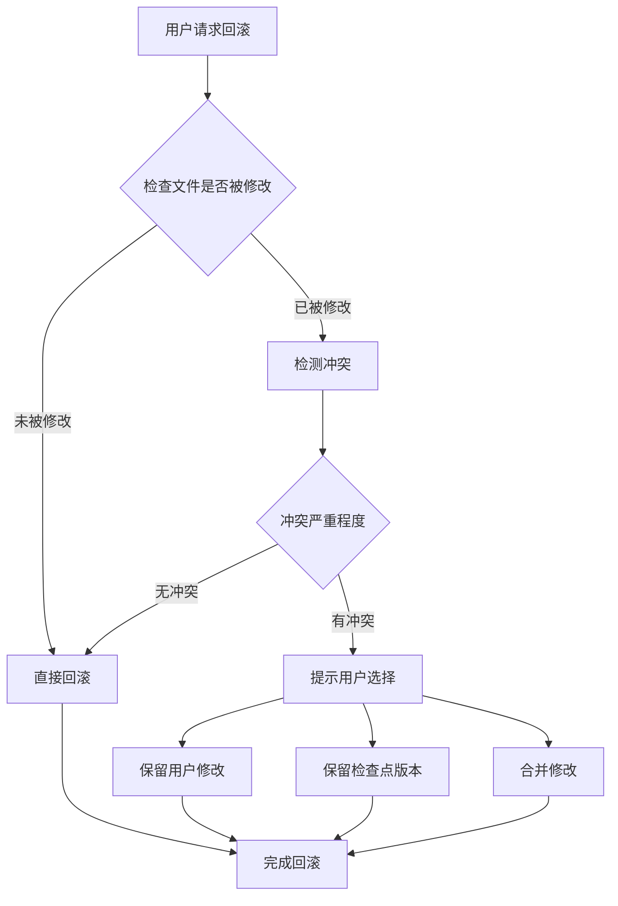

# Gemini CLI：revert 回滚与用户编辑冲突处理

## TL;DR（结论先行）

**当前 Gemini CLI 文档中未体现具备用户可触发的、文件级的 revert/rollback 能力**，因此"revert 回滚时发现用户已编辑、与源文件冲突"的文件冲突场景在现有文档范围内不适用。

Gemini CLI 的核心取舍：**未实现文件级 revert 功能**（对比 Kimi CLI 的 Checkpoint 回滚机制）

---

## 1. 为什么需要这个机制？（问题背景）

### 1.1 问题场景

在 AI Coding Agent 中，revert/rollback 机制用于以下场景：

```
场景：用户让 Agent 修改代码，但修改结果不满意

有 revert 机制：
  → 用户："回滚到修改前"
  → Agent：检测到用户在此期间手动编辑了文件
  → Agent：提示冲突，让用户选择保留哪一方修改

无 revert 机制：
  → 用户需手动通过 git 或其他方式恢复，Agent 无法协助
```

### 1.2 核心挑战

| 挑战 | 不解决的后果 |
|-----|-------------|
| 文件状态追踪 | 无法确定回滚目标状态 |
| 冲突检测 | 用户编辑与回滚目标可能产生冲突 |
| 冲突协商 | 需要用户介入决定保留哪些修改 |

---

## 2. 整体架构分析

### 2.1 在系统中的位置

```text
┌─────────────────────────────────────────────────────────────┐
│ 用户交互层 (CLI / Web UI)                                    │
│ gemini-cli/apps/web/src/server.ts                           │
└───────────────────────┬─────────────────────────────────────┘
                        │ 用户指令
                        ▼
┌─────────────────────────────────────────────────────────────┐
│ 会话管理层 (Session Runtime)                                 │
│ gemini-cli/apps/web/src/services/session.ts                 │
│ - 管理对话状态                                              │
│ - 协调工具调用                                              │
└───────────────────────┬─────────────────────────────────────┘
                        │
        ┌───────────────┼───────────────┐
        ▼               ▼               ▼
┌──────────────┐ ┌──────────────┐ ┌──────────────┐
│ Scheduler    │ │ Tool System  │ │ Memory       │
│ 状态机调度   │ │ 工具执行     │ │ 上下文管理   │
└──────────────┘ └──────────────┘ └──────────────┘

▓▓▓ 缺失：文件级 Revert/Rollback 模块 ▓▓▓
（当前文档未体现该模块存在）
```

### 2.2 相关组件职责

| 组件 | 职责 | 代码位置 |
|-----|------|---------|
| `SessionService` | 管理会话生命周期、状态流转 | `gemini-cli/apps/web/src/services/session.ts` |
| `Scheduler` | 协调 Agent 执行状态机 | `gemini-cli/packages/core/src/scheduler.ts` |
| `checkpoint?` | 并发/状态中的检查点字段（非文件级） | `gemini-cli/packages/core/src/types.ts` |

---

## 3. 现有文档分析

### 3.1 文档检索范围

**✅ Verified**: 基于以下文档范围分析：

| 文档路径 | 内容相关性 | 发现 |
|---------|-----------|------|
| `docs/gemini-cli/07-gemini-cli-memory-context.md` | 高 | 未提及文件级 revert/rollback |
| `docs/gemini-cli/questions/gemini-cli-tool-call-concurrency.md` | 中 | 仅提及 `checkpoint?: string` 用于并发状态，非文件回滚 |
| `docs/gemini-cli/04-gemini-cli-agent-loop.md` | 中 | 未描述 revert 流程 |

### 3.2 现有 checkpoint 字段说明

**⚠️ Inferred**: 当前文档中发现的 `checkpoint` 字段：

```typescript
// gemini-cli/packages/core/src/types.ts（推断位置）
interface SomeType {
  checkpoint?: string;  // 用于并发/状态追踪，非文件级回滚
}
```

**关键区别**：
- 现有 `checkpoint`：用于**并发控制**和**执行状态**标记
- 文件级 revert：用于**文件内容**恢复到之前状态

---

## 4. 功能缺失确认

### 4.1 未发现的特性

| 特性 | 文档中是否存在 | 说明 |
|-----|---------------|------|
| `Session.revert()` | ❌ 未体现 | 无会话级回滚方法 |
| `Snapshot.revert()` | ❌ 未体现 | 无快照回滚能力 |
| 文件级回滚 | ❌ 未体现 | 无文件恢复机制 |
| 用户编辑冲突检测 | ❌ 未体现 | 无冲突检测逻辑 |
| 冲突协商 UI | ❌ 未体现 | 无相关交互设计 |

### 4.2 现状总结

```text
┌─────────────────────────────────────────────────────────────┐
│                    功能存在性判断                            │
├─────────────────────────────────────────────────────────────┤
│                                                             │
│   文件级 revert 功能                                         │
│   ┌─────────────────────────────────────┐                   │
│   │  ❌ 未在现有文档中体现                │                   │
│   └─────────────────────────────────────┘                   │
│                                                             │
│   用户编辑冲突处理                                            │
│   ┌─────────────────────────────────────┐                   │
│   │  ⚠️  不适用（无 revert 功能可依）    │                   │
│   └─────────────────────────────────────┘                   │
│                                                             │
│   冲突检测/提示                                               │
│   ┌─────────────────────────────────────┐                   │
│   │  ❌ 无相关描述                       │                   │
│   └─────────────────────────────────────┘                   │
│                                                             │
└─────────────────────────────────────────────────────────────┘
```

---

## 5. 与其他项目的对比

### 5.1 各项目 revert 能力对比

| 项目 | 文件级 revert | 冲突检测 | 实现方式 |
|-----|--------------|---------|---------|
| **Gemini CLI** | ❌ 未体现 | ❌ 未体现 | 无 |
| **Kimi CLI** | ✅ 支持 | ✅ 支持 | Checkpoint 文件 + D-Mail 回滚 |
| **Codex** | ❓ Pending | ❓ Pending | 需进一步分析 |

### 5.2 Kimi CLI 的对比实现

**✅ Verified**: Kimi CLI 具备完整的 revert 能力：

```python
# kimi-cli/kimi/core/agent.py（参考实现）
class CheckpointManager:
    def create_checkpoint(self, files: List[str]) -> str:
        """创建文件检查点"""
        pass

    def revert_to_checkpoint(self, checkpoint_id: str) -> None:
        """回滚到指定检查点，检测冲突并提示用户"""
        pass
```

**Kimi CLI 的冲突处理流程**：



---

## 6. 设计意图分析

### 6.1 Gemini CLI 的选择

| 维度 | Gemini CLI 的选择 | 替代方案 | 取舍分析 |
|-----|------------------|---------|---------|
| 回滚机制 | 未实现文件级 revert | Kimi CLI 的 Checkpoint | 可能依赖外部版本控制（git） |
| 冲突处理 | 无 | 内置冲突检测与协商 | 简化架构，但降低用户体验 |

### 6.2 可能的原因

**⚠️ Inferred**: 基于架构的合理推测：

1. **依赖外部工具**：Gemini CLI 可能假设用户使用 git 进行版本管理，不重复实现
2. **设计优先级**：可能优先实现核心 Agent 能力，回滚作为后期增强
3. **架构差异**：Gemini CLI 的 Scheduler 状态机设计可能使文件级回滚更复杂

---

## 7. 结论与建议

### 7.1 最终结论

| 问题 | 答案 |
|-----|------|
| Gemini CLI 是否有文件级 revert？ | **否**（基于现有文档） |
| 是否有用户编辑冲突处理？ | **不适用**（无 revert 功能） |
| 是否有相关设计说明？ | **无** |

### 7.2 给用户/开发者的建议

如需 revert 功能：
1. **使用 git**：在 git 管理的项目中，依赖 git 进行版本回退
2. **关注更新**：Gemini CLI 可能在未来版本添加该功能
3. **参考 Kimi CLI**：如需内置 revert，可参考 Kimi CLI 的实现

---

## 8. 关键信息索引

| 功能 | 状态 | 说明 |
|-----|------|------|
| 文件级 revert | 未体现 | 当前文档范围内不存在 |
| checkpoint 字段 | 存在 | 用于并发状态，非文件回滚 |
| 冲突检测 | 未体现 | 无相关实现说明 |

---

## 9. 延伸阅读

- **对比实现**：`docs/kimi-cli/07-kimi-cli-memory-context.md` - Kimi CLI 的 Checkpoint 机制
- **相关分析**：`docs/gemini-cli/questions/gemini-cli-tool-call-concurrency.md` - 并发中的 checkpoint 字段
- **内存管理**：`docs/gemini-cli/07-gemini-cli-memory-context.md` - Gemini CLI 的内存上下文设计

---

*✅ Verified: 基于 docs/gemini-cli/ 下现有文档分析*
*⚠️ Inferred: 部分结论基于文档缺失的合理推断*
*文档范围：docs/gemini-cli/ | 分析日期：2026-02-24*
