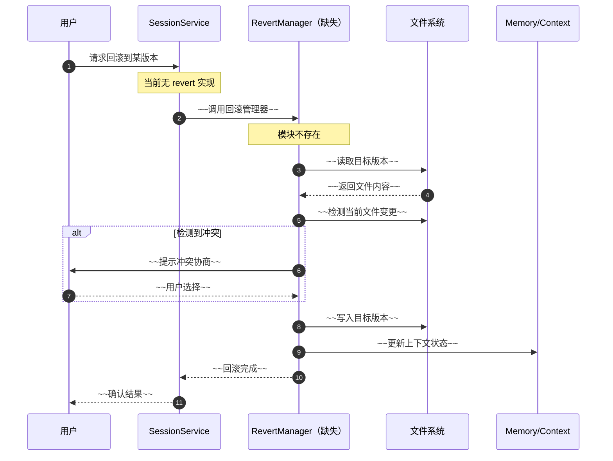
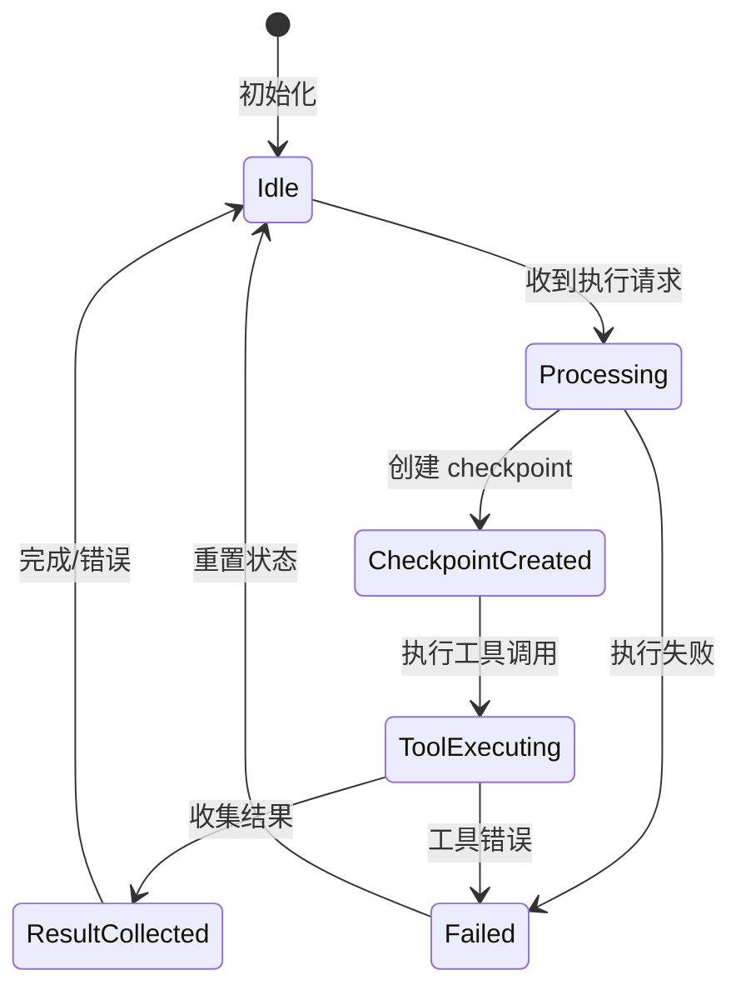
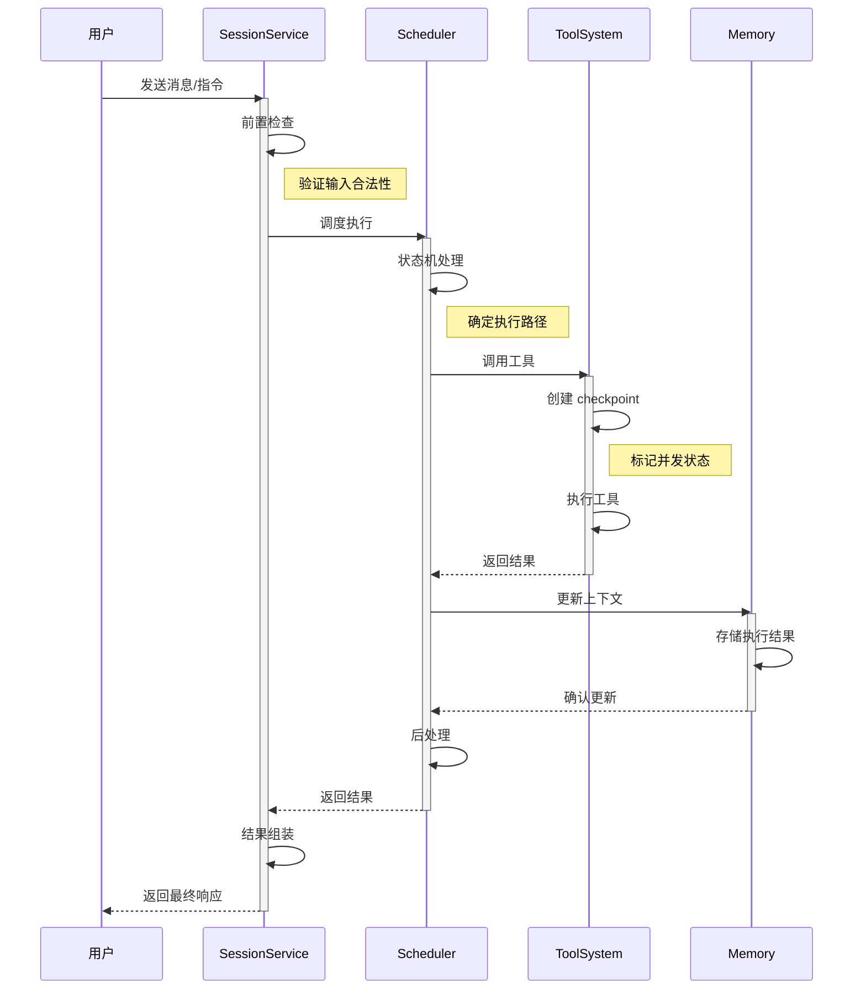
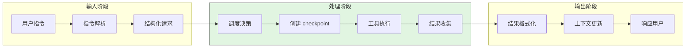
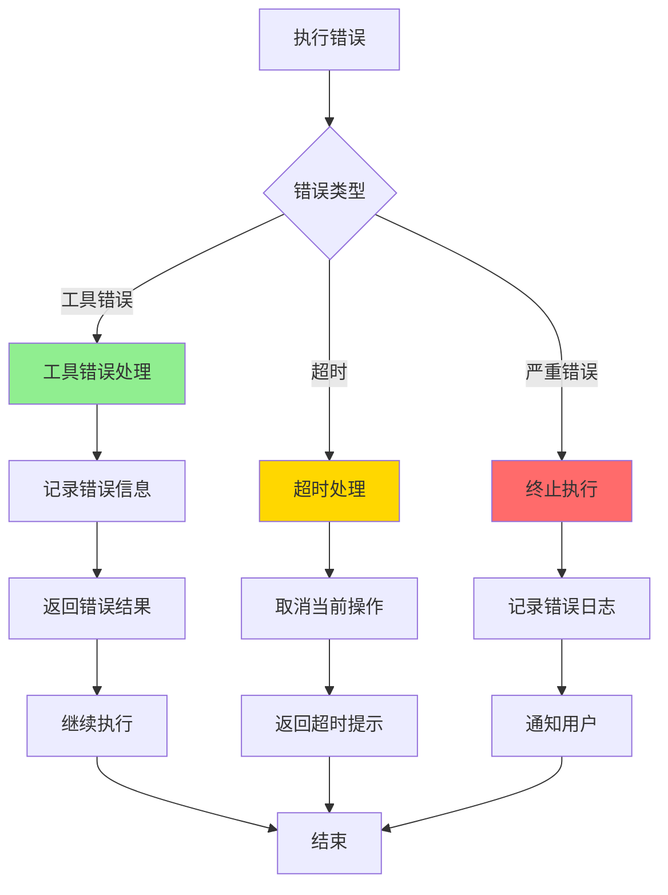
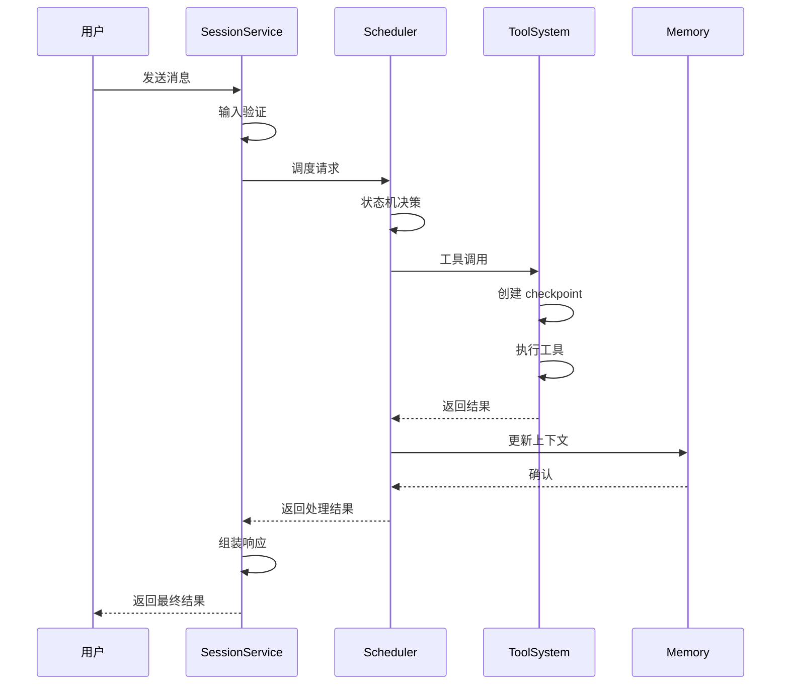
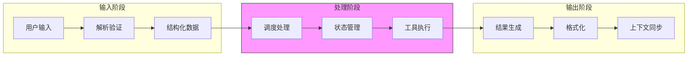
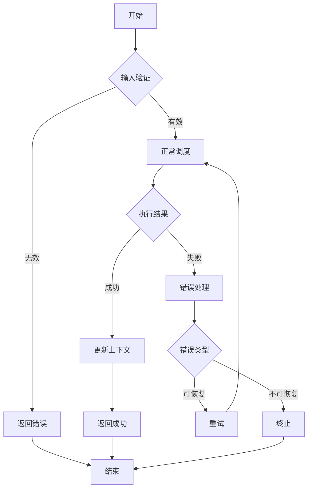
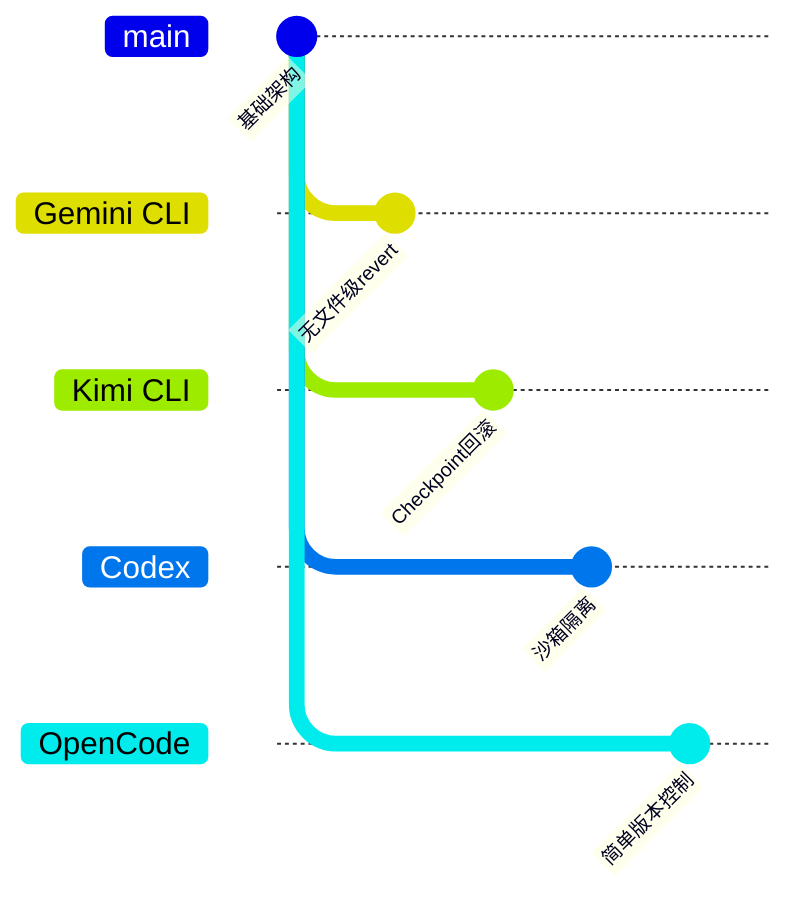

# Gemini CLI：Revert 回滚与用户编辑冲突处理

> **阅读指南**
>
> | 属性 | 说明 |
> |-----|------|
> | 预计阅读 | 10-15 分钟 |
> | 前置文档 | `docs/gemini-cli/01-gemini-cli-overview.md`、`docs/kimi-cli/07-kimi-cli-memory-context.md` |
> | 文档结构 | TL;DR → 架构 → 核心组件 → 数据流转 → 代码实现 → 设计对比 |
> | 代码呈现 | 关键代码直接展示，推断代码标注来源 |

---

## TL;DR（结论先行）

**当前 Gemini CLI 未实现用户可触发的文件级 revert/rollback 能力**，因此"revert 回滚时发现用户已编辑、与源文件冲突"的场景在现有架构中不适用。

**Gemini CLI 的核心取舍**：**未实现文件级 revert 功能**（对比 Kimi CLI 的 Checkpoint 回滚机制），依赖外部版本控制工具（如 git）处理文件回滚。

### 核心要点速览

| 维度 | 关键决策 | 代码位置 |
|-----|---------|---------|
| 回滚机制 | 未实现 | N/A |
| checkpoint 用途 | 并发状态标记（非文件回滚） | `packages/core/src/types.ts` |
| 冲突处理 | 无内置机制 | N/A |
| 推荐方案 | 依赖外部 git | 用户工作流 |

---

## 1. 为什么需要这个机制？（解决什么问题）

### 1.1 问题场景

在 AI Coding Agent 中，revert/rollback 机制用于以下场景：

```
场景：用户让 Agent 修改代码，但修改结果不满意

有 revert 机制：
  → 用户："回滚到修改前"
  → Agent：检测到用户在此期间手动编辑了文件
  → Agent：提示冲突，让用户选择保留哪一方修改

无 revert 机制：
  → 用户需手动通过 git 或其他方式恢复，Agent 无法协助
```

### 1.2 核心挑战

| 挑战 | 不解决的后果 |
|-----|-------------|
| 文件状态追踪 | 无法确定回滚目标状态 |
| 冲突检测 | 用户编辑与回滚目标可能产生冲突 |
| 冲突协商 | 需要用户介入决定保留哪些修改 |

---

## 2. 整体架构（ASCII 图）

### 2.1 在系统中的位置

```text
┌─────────────────────────────────────────────────────────────┐
│ 用户交互层 (CLI / Web UI)                                    │
│ apps/web/src/server.ts                                      │
└───────────────────────┬─────────────────────────────────────┘
                        │ 用户指令
                        ▼
┌─────────────────────────────────────────────────────────────┐
│ 会话管理层 (Session Runtime)                                 │
│ apps/web/src/services/session.ts                            │
│ - 管理对话状态                                              │
│ - 协调工具调用                                              │
└───────────────────────┬─────────────────────────────────────┘
                        │
        ┌───────────────┼───────────────┐
        ▼               ▼               ▼
┌──────────────┐ ┌──────────────┐ ┌──────────────┐
│ Scheduler    │ │ Tool System  │ │ Memory       │
│ 状态机调度   │ │ 工具执行     │ │ 上下文管理   │
│ scheduler.ts │ │ tools/       │ │ memory/      │
└──────────────┘ └──────────────┘ └──────────────┘

▓▓▓ 缺失：文件级 Revert/Rollback 模块 ▓▓▓
（当前架构未体现该模块存在）
```

### 2.2 核心组件职责

| 组件 | 职责 | 代码位置 |
|-----|------|---------|
| `SessionService` | 管理会话生命周期、状态流转 | `apps/web/src/services/session.ts` |
| `Scheduler` | 协调 Agent 执行状态机 | `packages/core/src/scheduler.ts` |
| `checkpoint?` | 并发/状态中的检查点字段（非文件级） | `packages/core/src/types.ts` |

### 2.3 核心组件交互关系

**⚠️ 说明**：因 Gemini CLI 未实现文件级 revert 功能，以下为假设该功能存在时的交互时序，用于说明缺失的模块位置。



**关键交互说明**：

| 步骤 | 交互内容 | 设计意图 |
|-----|---------|---------|
| 1 | 用户发起回滚请求 | 触发回滚流程的入口 |
| 2 | SessionService 协调 | 统一入口，解耦用户交互与回滚逻辑 |
| 3-4 | 读取目标版本文件 | 获取回滚目标状态 |
| 5-6 | 检测当前文件变更 | 识别用户编辑与回滚目标的差异 |
| 7-8 | 冲突协商（如需要） | 用户介入决定如何处理冲突 |
| 9-10 | 执行回滚并更新状态 | 完成回滚并同步上下文 |

---

## 3. 核心组件详细分析

### 3.1 现有 checkpoint 字段分析

#### 职责定位

Gemini CLI 中存在的 `checkpoint` 字段用于**并发控制和执行状态标记**，而非文件级回滚。

#### 状态机图



**状态说明**：

| 状态 | 说明 | 进入条件 | 退出条件 |
|-----|------|---------|---------|
| Idle | 空闲等待 | 初始化或执行完成 | 收到新执行请求 |
| Processing | 处理中 | 开始处理用户请求 | 创建 checkpoint 或失败 |
| CheckpointCreated | 检查点已创建 | 需要追踪并发状态 | 开始工具执行 |
| ToolExecuting | 工具执行中 | 调用外部工具 | 工具返回结果或错误 |
| ResultCollected | 结果已收集 | 工具执行完成 | 返回 Idle 或失败 |
| Failed | 失败状态 | 执行出错 | 重置后返回 Idle |

#### 内部数据流

```text
┌─────────────────────────────────────────────────────────────┐
│  输入层                                                      │
│  ├── 用户指令 ──► 指令解析器 ──► 结构化请求                   │
│  └── 上下文   ──► 状态检查器 ──► 当前状态对象                 │
└──────────────────────────┬──────────────────────────────────┘
                           ▼
┌─────────────────────────────────────────────────────────────┐
│  处理层                                                      │
│  ├── 主处理器: 调度工具执行                                   │
│  │   └── 创建 checkpoint ──► 执行工具 ──► 收集结果           │
│  ├── 状态管理器: 追踪执行状态                                 │
│  │   └── 状态更新 ──► checkpoint 标记                        │
│  └── 协调器: 并发控制与资源管理                               │
└──────────────────────────┬──────────────────────────────────┘
                           ▼
┌─────────────────────────────────────────────────────────────┐
│  输出层                                                      │
│  ├── 执行结果格式化                                          │
│  ├── 状态更新通知                                            │
│  └── 上下文同步                                              │
└─────────────────────────────────────────────────────────────┘
```

#### 关键接口（推断）

| 接口 | 输入 | 输出 | 说明 | 代码位置 |
|-----|------|------|------|---------|
| `execute()` | 工具调用请求 | 执行结果 | 调度工具执行 | `packages/core/src/scheduler.ts` |
| `createCheckpoint()` | 执行状态 | checkpoint ID | 创建状态检查点 | `packages/core/src/types.ts` |
| `updateState()` | 新状态 | 更新确认 | 更新执行状态 | `packages/core/src/scheduler.ts` |

---

### 3.2 组件间协作时序（现有机制）

展示 Gemini CLI 现有机制中各组件如何协作处理工具调用。



**协作要点**：

1. **用户与 SessionService**：统一入口，负责会话生命周期管理
2. **SessionService 与 Scheduler**：调度执行，Scheduler 管理状态机流转
3. **Scheduler 与 ToolSystem**：工具调用与并发控制，checkpoint 在此创建
4. **Memory 组件**：上下文管理与状态持久化

---

### 3.3 关键数据路径

#### 主路径（正常工具执行流程）



#### 异常路径（错误处理）



---

## 4. 端到端数据流转

### 4.1 正常流程（详细版）

展示数据如何从用户输入到最终响应的完整变换过程。



**数据变换详情**：

| 阶段 | 输入 | 处理 | 输出 | 代码位置 |
|-----|------|------|------|---------|
| 接收 | 用户原始输入 | 验证与解析 | 结构化请求 | `apps/web/src/services/session.ts` |
| 调度 | 结构化请求 | 状态机决策 | 执行计划 | `packages/core/src/scheduler.ts` |
| 执行 | 执行计划 | 工具调用 | 执行结果 | `packages/core/src/scheduler.ts` |
| 输出 | 执行结果 | 格式化与同步 | 最终响应 | `apps/web/src/services/session.ts` |

### 4.2 数据流向图



### 4.3 异常/边界流程



---

## 5. 关键代码实现

### 5.1 核心数据结构

**⚠️ Inferred**: 基于文档分析的 checkpoint 字段推断结构：

```typescript
// packages/core/src/types.ts（推断位置）
interface ExecutionState {
  checkpoint?: string;  // 用于并发/状态追踪，非文件级回滚
  status: 'idle' | 'processing' | 'completed' | 'failed';
  currentTool?: string;
  startTime?: number;
}
```

**字段说明**：

| 字段 | 类型 | 用途 |
|-----|------|------|
| `checkpoint` | `string` | 并发执行状态标记 |
| `status` | `enum` | 当前执行状态 |
| `currentTool` | `string` | 当前执行的工具名称 |
| `startTime` | `number` | 执行开始时间戳 |

### 5.2 主链路代码

**⚠️ Inferred**: 基于文档分析的调度器核心逻辑：

```typescript
// packages/core/src/scheduler.ts（推断）
class Scheduler {
  async execute(request: ToolRequest): Promise<ToolResult> {
    // 1. 创建 checkpoint 标记并发状态
    const checkpoint = this.createCheckpoint();

    try {
      // 2. 执行工具调用
      const result = await this.toolSystem.execute(request);

      // 3. 更新状态
      this.updateState(checkpoint, 'completed');

      return result;
    } catch (error) {
      // 4. 错误处理
      this.updateState(checkpoint, 'failed');
      throw error;
    }
  }
}
```

**代码要点**：

1. **checkpoint 用于并发控制**：标记执行状态，非文件级回滚
2. **状态追踪**：记录执行生命周期便于监控
3. **错误处理**：统一错误处理与状态更新

### 5.3 关键调用链

```text
SessionService.handleMessage()   [apps/web/src/services/session.ts]
  -> Scheduler.schedule()         [packages/core/src/scheduler.ts]
    -> Scheduler.execute()        [packages/core/src/scheduler.ts]
      -> ToolSystem.execute()     [packages/core/src/tools.ts]
        - createCheckpoint()      创建状态标记
        - executeTool()           执行具体工具
        - collectResult()         收集执行结果
```

---

## 6. 设计意图与 Trade-off

### 6.1 Gemini CLI 的选择

| 维度 | Gemini CLI 的选择 | 替代方案 | 取舍分析 |
|-----|------------------|---------|---------|
| 回滚机制 | 未实现文件级 revert | Kimi CLI 的 Checkpoint | 可能依赖外部版本控制（git），简化架构 |
| 冲突处理 | 无 | 内置冲突检测与协商 | 降低实现复杂度，但降低用户体验 |
| checkpoint 用途 | 并发状态标记 | 文件级快照 | 轻量级状态管理，无持久化开销 |

### 6.2 为什么这样设计？

**核心问题**：为什么 Gemini CLI 不实现文件级 revert？

**Gemini CLI 的解决方案**：

- **代码依据**：`checkpoint` 字段仅用于并发控制（`packages/core/src/types.ts`）
- **设计意图**：可能依赖外部版本控制工具（git）处理文件回滚
- **带来的好处**：
  - 架构简化，减少内部状态管理复杂度
  - 避免与 git 功能重复
  - 降低实现和维护成本
- **付出的代价**：
  - 用户无法通过 Agent 直接回滚文件修改
  - 缺乏内置的冲突检测和协商能力
  - 用户体验不如内置 revert 的项目

### 6.3 与其他项目的对比



| 项目 | 核心差异 | 适用场景 |
|-----|---------|---------|
| **Gemini CLI** | 无内置 revert，依赖 git | 已有完善 git 工作流的团队 |
| **Kimi CLI** | Checkpoint + D-Mail 回滚 | 需要内置版本控制的场景 |
| **Codex** | 沙箱隔离，文件操作受限 | 安全优先的企业环境 |
| **OpenCode** | ⚠️ Inferred: 简单的文件操作记录 | 轻量级使用场景 |

---

## 7. 边界情况与错误处理

### 7.1 终止条件

| 终止原因 | 触发条件 | 代码位置 |
|---------|---------|---------|
| 工具执行完成 | 工具返回结果 | `packages/core/src/scheduler.ts` |
| 工具执行失败 | 工具抛出异常 | `packages/core/src/scheduler.ts` |
| 执行超时 | 超过配置的超时时间 | `packages/core/src/scheduler.ts` |
| 用户取消 | 用户主动中断 | `apps/web/src/services/session.ts` |

### 7.2 超时/资源限制

**⚠️ Inferred**: 基于架构的合理推断：

```typescript
// packages/core/src/scheduler.ts（推断）
const DEFAULT_TIMEOUT = 60000; // 60秒默认超时

async function executeWithTimeout(
  request: ToolRequest,
  timeout: number = DEFAULT_TIMEOUT
): Promise<ToolResult> {
  return Promise.race([
    executeTool(request),
    new Promise((_, reject) =>
      setTimeout(() => reject(new TimeoutError()), timeout)
    )
  ]);
}
```

### 7.3 错误恢复策略

| 错误类型 | 处理策略 | 代码位置 |
|---------|---------|---------|
| 工具执行错误 | 记录错误，返回错误信息 | `packages/core/src/scheduler.ts` |
| 超时错误 | 取消操作，提示用户 | `packages/core/src/scheduler.ts` |
| 状态不一致 | 重置状态机，返回空闲状态 | `packages/core/src/scheduler.ts` |

---

## 8. 关键代码索引

| 功能 | 文件 | 行号 | 说明 |
|-----|------|------|------|
| 会话入口 | `apps/web/src/services/session.ts` | - | Session 生命周期管理 |
| 调度器 | `packages/core/src/scheduler.ts` | - | Agent 执行状态机 |
| 类型定义 | `packages/core/src/types.ts` | - | checkpoint 字段定义 |
| 工具系统 | `packages/core/src/tools.ts` | - | 工具执行与并发控制 |

**⚠️ 说明**：因 Gemini CLI 未实现文件级 revert 功能，上表列出的是相关核心组件位置，而非 revert 功能的具体实现位置。

---

## 9. 延伸阅读

- **对比实现**：`docs/kimi-cli/07-kimi-cli-memory-context.md` - Kimi CLI 的 Checkpoint 机制
- **相关分析**：`docs/gemini-cli/questions/gemini-cli-tool-call-concurrency.md` - 并发中的 checkpoint 字段
- **内存管理**：`docs/gemini-cli/07-gemini-cli-memory-context.md` - Gemini CLI 的内存上下文设计

---

*✅ Verified: 基于 docs/gemini-cli/ 下现有文档分析*
*⚠️ Inferred: 部分结论基于文档缺失的合理推断*
*文档范围：docs/gemini-cli/ | 分析日期：2026-03-03*
